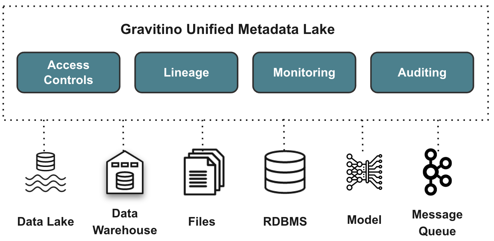

<!--
  Licensed to the Apache Software Foundation (ASF) under one
  or more contributor license agreements.  See the NOTICE file
  distributed with this work for additional information
  regarding copyright ownership.  The ASF licenses this file
  to you under the Apache License, Version 2.0 (the
  "License"); you may not use this file except in compliance
  with the License.  You may obtain a copy of the License at

   http://www.apache.org/licenses/LICENSE-2.0

  Unless required by applicable law or agreed to in writing,
  software distributed under the License is distributed on an
  "AS IS" BASIS, WITHOUT WARRANTIES OR CONDITIONS OF ANY
  KIND, either express or implied.  See the License for the
  specific language governing permissions and limitations
  under the License.
-->

# Apache Gravitino™

[](https://github.com/apache/gravitino/actions/workflows/build.yml)
[](https://github.com/apache/gravitino/actions/workflows/integration-test.yml)
[](https://github.com/apache/gravitino/blob/main/LICENSE)
[](https://github.com/apache/gravitino/graphs/contributors)
[](https://github.com/apache/gravitino/releases)
[](https://github.com/apache/gravitino/issues)
[](https://github.com/apache/gravitino/commits/main/)
[](https://www.bestpractices.dev/projects/8358)

## Introduction

Apache Gravitino is a high-performance, geo-distributed, and federated metadata lake. It manages metadata directly in different sources, types, and regions, providing users with unified metadata access for data and AI assets.



## 🚀 Key Features

- **Unified Metadata Management**: Manage diverse metadata sources through a single model and API (e.g., Hive, MySQL, HDFS, S3).
- **End-to-End Data Governance**: Features like access control, auditing, and discovery across all metadata assets.
- **Direct Metadata Integration**: Changes in underlying systems are immediately reflected via Gravitino’s connectors.
- **Geo-Distribution Support**: Share metadata across regions and clouds to support global architectures.
- **Multi-Engine Compatibility**: Seamlessly integrates with query engines without modifying SQL dialects.
- **AI Asset Management (WIP)**: Support for AI model and feature tracking.

## 🌐 Common Use Cases

- Federated metadata discovery across data lakes and data warehouses
- Multi-region metadata synchronization for hybrid or multi-cloud setups
- Data and AI asset governance with unified audit and access control
- Plug-and-play access for engines like Trino or Spark
- Support for evolving metadata standards, including AI model lineage

## 📚 Documentation

The latest Gravitino documentation is available at [gravitino.apache.org/docs/latest](https://gravitino.apache.org/docs/latest/).

This README provides a basic overview; visit the site for full installation, configuration, and development documentation.

## 🧪 Quick Start

### Use Gravitino Playground (Recommended)

Gravitino provides a Docker Compose–based playground for a full-stack experience.  
Clone or download the [Gravitino Playground repository](https://github.com/apache/gravitino-playground) and follow its [README](https://github.com/apache/gravitino-playground/blob/main/README.md).

### Run Gravitino Locally

1. [Download](https://gravitino.apache.org/downloads) and extract a binary release.
2. Edit `conf/gravitino.conf` to configure settings.
3. Start the server:

```bash
./bin/gravitino.sh start
```

4. To stop:

```bash
./bin/gravitino.sh stop
```

Press `CTRL+C` to stop.

## 🧊 Iceberg REST Catalog

Gravitino provides a native Iceberg REST catalog service.  
See: [Iceberg REST catalog service](https://gravitino.apache.org/docs/latest/iceberg-rest-service/)

## 🔌 Trino Integration

Gravitino includes a Trino connector for federated metadata access.  
See: [Using Trino with Gravitino](https://gravitino.apache.org/docs/latest/trino-connector/index/)

## 🛠️ Building from Source

Gravitino uses Gradle. Windows is not currently supported.

Clean build without tests:

```bash
./gradlew clean build -x test
```

Build a distribution:

```bash
./gradlew compileDistribution -x test
```

Or compressed package:

```bash
./gradlew assembleDistribution -x test
```

Artifacts are output to the `distribution/` directory.

More build options: [How to build Gravitino](https://gravitino.apache.org/docs/latest/how-to-build/)

## 👨‍💻 Developer Resources

- [How to build Gravitino](https://gravitino.apache.org/docs/latest/how-to-build/)
- [How to test Gravitino](https://gravitino.apache.org/docs/latest/how-to-test/)
- [Publish Docker images](https://gravitino.apache.org/docs/latest/publish-docker-images)

## 🤝 Contributing

We welcome all kinds of contributions—code, documentation, testing, connectors, and more!

To get started, please read our [CONTRIBUTING.md](CONTRIBUTING.md) guide.

## 🔗 ASF Resources

- 📬 Mailing List: [dev@gravitino.apache.org](mailto:dev@gravitino.apache.org) ([subscribe](mailto:dev-subscribe@gravitino.apache.org))
- 🐞 Issue Tracker: [GitHub Issues](https://github.com/apache/gravitino/issues)

## 🪪 License

Apache Gravitino is licensed under the Apache License, Version 2.0.  
See the [LICENSE](LICENSE) file for details.

<sub>Apache®, Apache Gravitino™, Apache Hadoop®, Apache Hive™, Apache Iceberg™, Apache Kafka®, Apache Spark™, Apache Submarine™, Apache Thrift™, and Apache Zeppelin™ are trademarks of the Apache Software Foundation in the United States and/or other countries.</sub>


