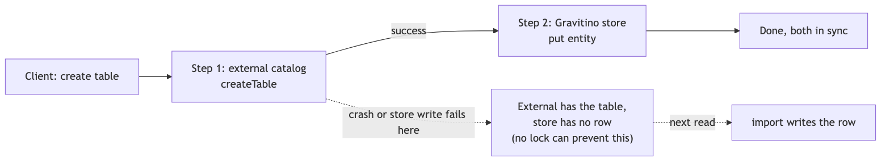
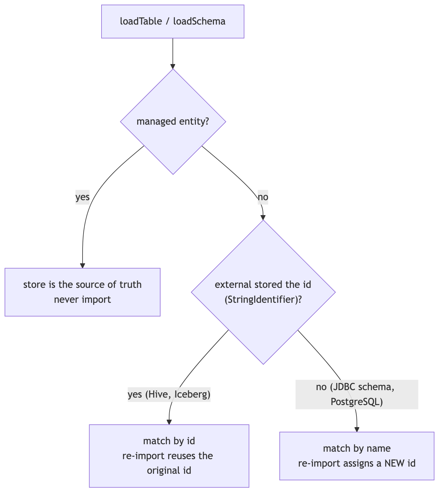
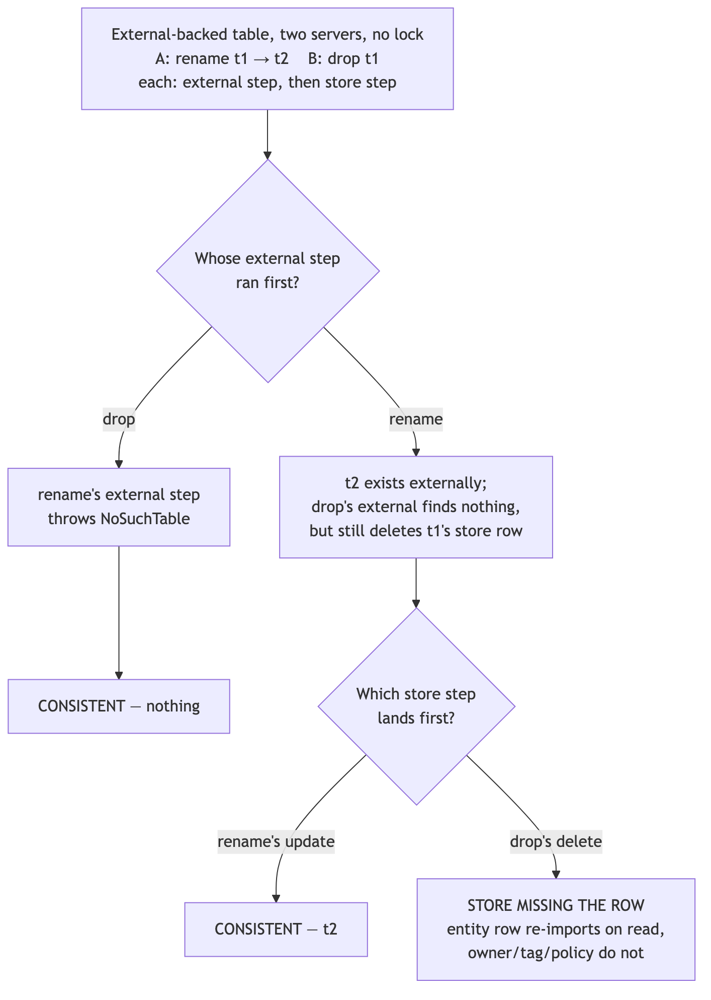
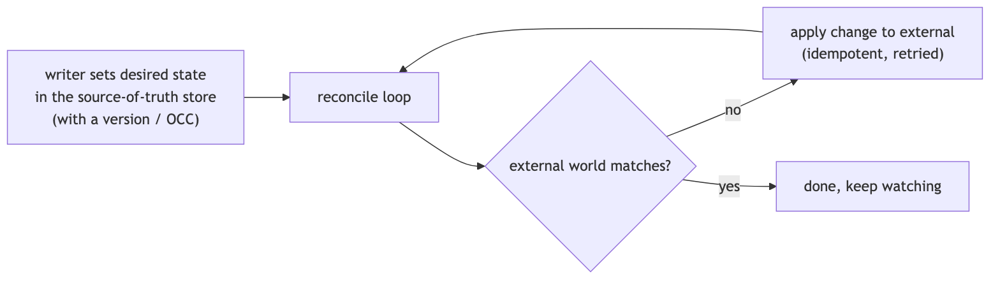

<!--
  Licensed to the Apache Software Foundation (ASF) under one
  or more contributor license agreements. See the NOTICE file
  distributed with this work for additional information
  regarding copyright ownership. The ASF licenses this file
  to you under the Apache License, Version 2.0 (the
  "License"); you may not use this file except in compliance
  with the License. You may obtain a copy of the License at

    http://www.apache.org/licenses/LICENSE-2.0

  Unless required by applicable law or agreed to in writing,
  software distributed under the License is distributed on an
  "AS IS" BASIS, WITHOUT WARRANTIES OR CONDITIONS OF ANY
  KIND, either express or implied. See the License for the
  specific language governing permissions and limitations
  under the License.
-->

# Design: Concurrency Control for Multi-Node Gravitino — Investigation and Decision

> Investigation and decision. The implementation is designed in [concurrency-control-implementation-design.md](concurrency-control-implementation-design.md).
>
> Tracking issue: [#10474](https://github.com/apache/gravitino/issues/10474) — *Address TreeLock limitations for Gravitino HA deployment*

**Short words used in this doc:**

- **HA** = High Availability = running more than one Gravitino server at the same time behind a load balancer.
- **OCC** = Optimistic Concurrency Control = the caller does not take an application/path lock before work; when it writes, it checks "is the row still the version I read?" If yes, write; if no, someone else changed it first, so handle the conflict. The database still takes its normal short statement/transaction locks.
- **External catalog** = the real system that holds the data, such as Hive, Iceberg, MySQL, or Kafka.
- **Gravitino store** = Gravitino's own database (`RelationalEntityStore`) that keeps a copy of the metadata.
- **Source of truth** = the system whose data we trust as correct when two copies disagree.

---

## Background

Gravitino uses an in-memory lock called `TreeLock` (`core/src/main/java/org/apache/gravitino/lock/`) to run metadata operations one at a time. For every operation, `TreeLockUtils.doWithTreeLock` locks the whole path from the root down: a read lock on every parent, and a read or write lock on the target (or on its parent for rename/drop).

```
loadTable(metalake.cat.db.t1)        alterTable(... rename t1)        dropTable(metalake.cat.db.t1)
  /                  READ              /                  READ          /                  READ
  /metalake          READ             /metalake          READ          /metalake          READ
  /metalake/cat      READ             /metalake/cat      READ          /metalake/cat      READ
  /metalake/cat/db   READ             /metalake/cat/db   WRITE         /metalake/cat/db   WRITE
  /metalake/cat/db/t1 READ            (parent write-locked)            (parent write-locked)
```

This is built on `LockManager`, which keeps an in-memory tree of `TreeLockNode`s (each one wraps a `ReentrantReadWriteLock`), plus reference counting, a background thread that removes unused nodes, and another background thread that checks for deadlocks inside the same JVM. It is about 800 lines of code in total (`LockManager` ~300, `TreeLockNode` ~250, `TreeLock` ~180, `TreeLockUtils` ~70).

### The problem: TreeLock only works inside one JVM

Each Gravitino server has its **own** `LockManager` with its own lock tree in its own memory. A write lock taken on server A means nothing to server B. Behind a load balancer, two servers can each pass their *local* TreeLock and change the same resource at the same time. So the moment Gravitino runs in HA, TreeLock stops protecting anything across servers. This is the reason #10474 was opened.

This leaves us with a decision. There are two directions:

1. **Remove TreeLock's correctness role** and let explicit rules in the shared database keep data correct.
2. **Keep the lock but make it work across nodes** (a distributed lock).

The rest of this document analyses what TreeLock really does today, then compares these two directions, then picks one.

---

## Goals

1. **Work with one server and with many.** The same operation must behave the same way on a single server and behind a load balancer. TreeLock only works inside one JVM, so HA is exactly where it stops helping.
2. **Fix the races we can fix.** Lost updates, two servers both "winning" a create, a child left under a deleted parent — these are writes where Gravitino's own database is the only source of truth, so they are ours to fix. Where an external catalog owns the data, match what it guarantees and write down what that is.
3. **Keep the change small.** Prefer rules the database already enforces over anything new to deploy: no extra service, no extra dependency, and keep call sites as they are where possible.
4. **Easy to run and to extend.** Adding an entity type or a catalog should get the same protection by following an existing pattern, instead of remembering which lock to take. Conflicts should be visible in logs, metrics and HTTP status codes, not something operators have to guess at.

---

## Non-Goals

1. **A distributed lock is not the target.** It is one option among others, not the goal. If a database rule can do the job, that wins; a cross-node lock is only worth considering where nothing else works.
2. **No single transaction across the external catalog and the Gravitino store.** No 2PC/XA. Not every external catalog offers the same guarantees, so we keep today's pattern: external system first, store second, store fixed on the next read.
3. **Stale reads are a different problem.** This document is about concurrent *writes*. Keeping each server's cached reads fresh is the `EntityChangeLogPoller` work, not this.
4. **We do not change how external catalogs behave.** Hive, Iceberg and JDBC keep their own concurrency semantics, and Gravitino does not promise more than they give.

---

## Analysis and Investigation

### A metadata write touches two stores, with no shared transaction

The key fact that is easy to miss: **every catalog metadata operation touches two separate stores, and there is no single transaction that covers both of them**:

1. The **external catalog** (Hive, Iceberg REST, JDBC/MySQL, Kafka, …).
2. Gravitino's **own database**, the Gravitino store.

The order is always the same: **the external system first, the Gravitino store second.** From `TableOperationDispatcher`:

```text
internalCreateTable():  catalog.createTable(...)   →  store.put(tableEntity)     // lines 642-689
dropTable():            catalog.dropTable(...)      →  store.delete(ident, TABLE) // lines 366-386
alterTable():           catalog.alterTable(...)     →  store column-sync          // lines 267-340
importTable():          catalog.loadTable(...)      →  store.put(tableEntity)     // lines 474-527
```



When a table is created, its Gravitino id is written **into the external table's own properties** as a `StringIdentifier` (`internalCreateTable`, line 636). Later, when the table is read, `importTable` uses the data from the external system to **overwrite and correct** the stored copy. So for external-backed catalogs, the external system is the source of truth, and the Gravitino store is a copy that is updated later and fixes itself on the next read.

An important result: **no lock can make the two stores update as one unit.** If the process crashes after `catalog.createTable` finished but before `store.put` runs, the external system has a table with no matching Gravitino entity. This is a crash problem, not a "two things at once" problem, and neither a local nor a distributed lock can fix it. This already tells us that a lock is not the tool that keeps the two stores matched.

### How the store fixes itself, and where it stops working

Here is how the self-fix works, traced through the code. If create succeeds in the external system but the store write fails, the error is **hidden** — `internalCreateTable:688-696` catches it, logs it, and still returns success to the client with no stored entity. Nothing is fixed until someone reads the table again. On that next read, `loadTable:142` sees `imported == false` and runs `importTable`, which writes the entity into the store. Schemas behave the same way (`internalLoadSchema` + `importSchema`). So a failed store write **does** auto-correct on the next load.



The import step does not need the id to run; the id only decides how stable the result is. The details:

| External system                                                         | How "needs import" is detected                                                 | Id after the self-fix                                                       |
|-------------------------------------------------------------------------|--------------------------------------------------------------------------------|-----------------------------------------------------------------------------|
| Can store the id (e.g. Hive, Iceberg) — `stringId != null`              | by id — `store.get(stringId.id())` (`internalLoadTable:596`)                   | **the original id is reused** (`importTable` sets `uid = stringId.id()`)    |
| Cannot store the id (e.g. JDBC schema, PostgreSQL) — `stringId == null` | by name — `getEntity(ident)` (`internalLoadTable:570`, code comment at `:590`) | **a new id is generated** (`importTable` sets `uid = idGenerator.nextId()`) |

The narrow limit: for an id-less external system the id is really owned by the Gravitino store, so if that row is lost the id cannot be recovered, and anything that references the entity by id (owner, tag, policy, role) points at the old, now-missing id. This does not appear in the plain "create then store write fails" flow, because no id-based references exist yet.

### Not every catalog has an external system that decides the winner

Whether the external system can act as the judge depends on the catalog. In the code this is the `managedStorage` capability (`Capability` in `core/.../connector/capability/Capability.java`; the default returns "managed" only for functions). The catalogs split into two groups:

| Group                                                         | Catalogs                                                                                                                                    | Source of truth for create/drop |
|---------------------------------------------------------------|---------------------------------------------------------------------------------------------------------------------------------------------|---------------------------------|
| **External-backed** (`managedStorage` = false for the entity) | Hive, Glue, JDBC (MySQL/PostgreSQL/Doris/OceanBase/StarRocks/BigQuery), Iceberg, Hudi, Paimon                                               | the **external system**         |
| **Gravitino-managed** (`managedStorage` = true)               | fileset (schema, fileset), model (schema, model), lakehouse-generic (schema, table), kafka (schema; the topic itself is external), function | the **Gravitino store**         |

This matters for the comparison below:

- For **external-backed** catalogs, the external system is a single shared source of truth that all Gravitino nodes talk to. It decides the final state according to its own concurrency semantics. For example, a database normally rejects a duplicate `CREATE TABLE`; Hive Metastore accepts full-table replacement alters without exposing a Gravitino-compatible version/CAS contract, so concurrent alters are not guaranteed to merge and may be last-writer-wins. Gravitino does not promise stronger merge semantics than the external catalog. Because TreeLock is per-node — and ordinary table alter currently takes a TreeLock read lock, so same-table alters can overlap even in one JVM — **cross-node behavior here already depends on the external system today, not on TreeLock.**
- For **Gravitino-managed** catalogs (fileset, model, and so on) there is **no external judge**. A fileset's "external" side is just a directory on HDFS or S3, which has no uniqueness check and no parent/child rule. For these, correctness can only come from the Gravitino store.

#### A concrete lost write on HMS and Glue, and what can be done

HMS `alter_table(db, table, newTable)` carries only the new object, never the base the caller read, so the server has nothing to compare against. The connector is a plain read-modify-write (`HiveCatalogOperations:692-746`, still carrying `// TODO(@Minghuang): require a table lock to avoid race condition`):

| Step | Server A                                   | Server B                                |
|------|--------------------------------------------|-----------------------------------------|
| 1    | loads t1: columns `[a]`, comment `c0`      |                                         |
| 2    |                                            | loads t1: the same base                 |
| 3    | writes back columns `[a, b]`, comment `c0` |                                         |
| 4    |                                            | writes back columns `[a]`, comment `c1` |

Both calls succeed, the table ends with comment `c1`, and **column `b` is gone** although B never touched columns. Same-field conflicts resolving to last-writer-wins would be expected, as in a SQL `UPDATE`; the bug is that a field the winner never edited is also lost. Gravitino does not notice either, because the connector returns the locally built object instead of re-reading (`HiveCatalogOperations:750`), so the store row mirrors a state HMS never held — and that row does not self-heal on read.

**Glue has the same defect**, for the same reason: `getTable` → build a full `TableInput` in memory → `UpdateTable` → return the locally built object (`GlueCatalogOperations:500-583`; its Iceberg tables take a separate branch and are unaffected). The other external-backed backends do not have this shape: JDBC translates the changes into an incremental `ALTER TABLE` statement and then re-reads, Iceberg commits an incremental change list under its native OCC, Paimon applies incremental `SchemaChange`s and re-reads. So this is a defect of the two HMS-shaped connectors, not of external-backed catalogs in general.

A lock does not fix this: a fencing token has nothing to validate against on HMS, and it would only serialize callers going through Gravitino while Spark, Trino and the Hive CLI write to the same HMS directly. The affordable fix is detection rather than mutual exclusion: **re-read after `alter_table`, verify the requested changes are present, and on a mismatch re-apply the change list to the fresh base with bounded retries**, then mirror the re-read result. One extra RPC, no new component, converges for disjoint changes, and detects out-of-band writers too; only the two connectors above need it, so a capability flag keeps the rest on the fast path. Hive 4's `AlterTableRequest.expectedParameterKey/Value` is a real single-parameter CAS, but Gravitino builds against Hive `2.3.9`/`3.1.3`, so it stays a future option.

### How bad is bad — three levels

Not every mismatch deserves the same reaction, so the rest of this analysis grades them. Only level 2 is a reason to hold anything up.

| Level | What it means                                                                                                                                                                                               | What we do about it                   |
|-------|-------------------------------------------------------------------------------------------------------------------------------------------------------------------------------------------------------------|---------------------------------------|
| **0** | Short-lived. The next read (import) or a reconcile job fixes it, and nothing is lost in between                                                                                                             | accept it, write it down              |
| **1** | A row is there that should not be, or is missing, but it is never trusted as the truth and no attachment is lost                                                                                            | accept it, a background job cleans it |
| **2** | Attachments of a **live** object are quietly deleted; **or** a row ends up pointing at a **different** object and takes its attachments along; **or** an operation reports success while doing the opposite | **must be fixed**                     |

"Attachments" means the data only Gravitino has about an object: owner, tags, policies, role grants, statistics. Level 2 is the line because attachments exist nowhere else — reading the external system cannot bring them back — and because "row points at the wrong object" is a permission problem, not a cosmetic one.

### What would break without TreeLock

Every store write on an external-backed path is one of four kinds: `put` (create), `put(overwrite)` (import), `update` (copy an alter), `delete` (drop). Pairing each with a concurrent partner gives the full list:

| Two operations at the same time                 | What happens with no lock                                                                                                                                                                                           | Level | Note                                                           |
|-------------------------------------------------|---------------------------------------------------------------------------------------------------------------------------------------------------------------------------------------------------------------------|-------|----------------------------------------------------------------|
| create × create                                 | the external catalog accepts only one; the loser gets `TableAlreadyExistsException` and never reaches the store                                                                                                     | 0     | the external system decides                                    |
| import × import                                 | one wins; the other catches `EntityAlreadyExistsException` and reloads (`TableOperationDispatcher:152-164`)                                                                                                         | 0     | already handles many servers                                   |
| import × drop                                   | a read that started before the drop writes the row back after it → left-over row                                                                                                                                    | 1     | [#12155](https://github.com/apache/gravitino/issues/12155)     |
| copy alter × copy alter                         | the copy can end up with the loser's value; the next `loadTable` reads the external system again and fixes it. On HMS and Glue the external object itself can lose a field, which is a separate bug described above | 0     | the external system already picked a winner                    |
| create child × drop parent                      | a child row can be added under a parent that was just deleted → left-over rows, invisible because list goes to the external system                                                                                  | 1     | GC cleans                                                      |
| **rename × drop**                               | drop deletes the store row **without checking anything**, so a table that is alive under its new name loses its row **and all its attachments**, while the caller is told the rename worked                         | **2** | [#12232](https://github.com/apache/gravitino/issues/12232)     |
| **drop × create, same name**                    | `store.delete(ident, TABLE)` deletes **by name** and ignores the external result (`TableOperationDispatcher:377-390`), so the drop of the old table removes the row and attachments of the new one                  | **2** | needs a delete with a version check on `(id, current_version)` |
| crash between the external call and `store.put` | a left-over object in the external system                                                                                                                                                                           | 1     | no lock helps — this is a crash, not concurrency               |

For entities whose only source of truth is the Gravitino store (metalake, catalog, fileset, model, tag, policy, user, group, role and the rest), the picture is different and simpler: lost updates and orphan children are real, and they can only be closed inside the database. That work is the implementation design.

**What this table says: the concurrency cases are level 0 or 1, except the two where the delete picks the wrong target.** Those two are not really concurrency bugs. They are bugs in *what gets deleted*. TreeLock hides them on one server and does nothing about them once several servers run.

### Do conflicting external operations always report a clear winner?

This is a fair thing to check, because the analysis above leans on "the external system decides the winner." The precise answer is narrower: the external system is the source of truth and applies its own integrity and concurrency rules, but those rules do not necessarily provide field-level merge, compare-and-set, or an "exactly one succeeds" result to Gravitino. Gravitino also does not always learn which side won, because a `drop` that finds nothing still returns without error.

- **create is loud.** A second `createTable` with the same name throws `TableAlreadyExistsException`; a `createTable` under a dropped schema throws `NoSuchSchemaException`. The loser fails clearly.
- **rename is loud.** Renaming a table whose source is gone throws `NoSuchTableException`.
- **drop is silent.** `dropTable` returns `true` if it dropped the table and `false` if the table "does not exist" (API contract: `TableCatalog.dropTable`; Hive catches not-found and returns `false`, `HiveCatalogOperations:983-993`). So a `false` can mean "someone else already dropped or renamed it" just as easily as "there was nothing to drop" — Gravitino cannot tell the two apart from the return value. `dropSchema` is the same, except it throws `NonEmptySchemaException` when the schema still has children and cascade is off.
- **drop-database vs create-table is order- and cascade-dependent.** If the create lands first and the drop cascades, both operations report success and the net external state is "gone." If the drop lands first, the create fails. If the drop is non-cascade and a child exists, the drop fails. In every ordering the external state is internally consistent, but there is no single "exactly one succeeds" rule.

Why this matters here: it does **not** make the external side inconsistent, and in the common case it does **not** cause a wrong store write (drop deletes the store row unconditionally, regardless of the boolean). But Gravitino cannot trust a drop's return value to know the true external state — one more reason the store copy needs an occasional reconcile rather than trusting each call's result. This is a reporting limit of the connector API, not something a lock would fix.

The winner can still be decided in the store: make drop's store step a conditional delete on `(id, current_version)` — the version-checked delete of gate G1 — instead of today's unconditional delete by name (`TableOperationDispatcher:377-390`). "One row deleted" then means this call de-registered the entity, which is what should drive the id-based cleanup and the change-log entry. It is exact for store-only entities, and it also stops a by-name delete from removing the row of a same-named entity that was re-created in the meantime.

### The harder case: mixed alter / rename / drop

The worry is the mix of `alter`, `rename`, and `drop` on the same table from two servers at once. The good news: **with a healthy store, the pure concurrent race ends either consistent or missing a row, and it does not by itself leave a stale row.** The missing-row case is the one that needs a fix, and it is smaller than it looks — see below and [#12232](https://github.com/apache/gravitino/issues/12232).

Take **rename `t1 → t2` on server A** and **drop `t1` on server B**, both on an external-backed catalog. Each operation does the external step first, then the store step. Two details of the store step matter: rename's store step (`updateTable`) reads t1's row and moves it to t2 in place; drop's store step (`store.delete(t1)`) runs **unconditionally** for external-backed tables (`TableOperationDispatcher:377-390`), even when the external drop found nothing.

The external catalog serializes DDL, so which side wins on the external side depends on **whose external step ran first**. That, plus the fact that drop's store delete is unconditional, gives exactly these outcomes:



- **Drop's external step ran first** — t1 is already gone, so rename's external step throws `NoSuchTableException` and never reaches its store step. Drop deletes t1's store row. External and store both end empty → **consistent** (nothing to import).
- **Rename's external step ran first** — t2 now exists externally, and drop's external step finds no t1 (returns false) — but its store step still deletes t1's store row **unconditionally**. Now the two store steps race:
  - rename's store update (t1 → t2) lands before drop's delete → the store has t2 → **consistent**;
  - drop's delete removes t1's row before rename's store update → rename's update matches 0 rows and writes nothing → **store missing the row**: t2 exists externally but has no store row.

The last outcome only partly fixes itself. The next `loadTable(t2)` re-imports the entity row and its columns, but drop's store step cascades: `TableMetaService.deleteTable` also soft-deletes everything attached to that table id — **owner, tag, policy, role grants, statistics** — and `importTable` restores none of them, not even when the id is reused. So the relations are silently and irreversibly gone, while the caller is told the rename succeeded. The fix is simple: **do not touch the store when the external drop returned `false`**, since `false` here means "still there under another name", and leave stale-row cleanup to reconcile. Tracked as [#12232](https://github.com/apache/gravitino/issues/12232).

The missing-row case matters only across nodes, or after removing TreeLock. Today TreeLock takes a write lock on the schema for both drop and rename, so on a single server they cannot interleave; under HA they already can, because the lock is per-node.

A second concurrent case is **create a child while its parent is being dropped** — `createTable(db.t1)` on server A while `dropSchema(db)` on server B. For external-backed catalogs the external system decides this race. But for entities whose only source of truth is the Gravitino store, and for Gravitino's own rows, nothing stops server A from inserting the child row just after server B removed the parent — an **orphan child**. A per-row version check cannot express this. A plain `INSERT ... SELECT ... WHERE parent.deleted_at = 0` is also insufficient at Gravitino's `READ_COMMITTED` isolation: drop can check that there are no children, the create can then observe a live parent and commit, and the drop can finally delete the parent. The shared parent-row transaction rule of gate G2 is what closes this; the implementation design gives the SQL.

### A note on stale store rows

A natural follow-up: can the store keep a row that points at an external object that is already gone (a "stale row"), for example after an out-of-band drop in Hive or a failed `store.delete`? Yes, but for the entity itself it does not matter — relying on the external state is reliable here: `loadTable` asks the external system first, so a stale row is never trusted, and a later create with the same name overwrites it (`store.put(overwrite = true)`).

The one thing the external system cannot repair is **Gravitino-only data attached to the entity by id** — owner, tag, policy, and role relations — because `importTable` rebuilds only the entity row (a single `store.put`), not those relations. If an external object disappears out of band, those relations can be left dangling on a ghost id. This is a pre-existing data-cleanup matter that a background reconcile would clean; it is unrelated to the remove-vs-lock decision and is tracked separately (see the appendix, "Pre-existing hazards").

### The really bad cases are not about concurrency at all

Both cases below come from what the promise above already allows: a user changing the external system directly. Both are level 2. Both happen today, with TreeLock in place, on a single server.

**S1 — a copied Gravitino id moves an existing row to another table, and the permissions move with it.**
When a table is created, Gravitino writes its id into the external table's properties as a `StringIdentifier` (`TableOperationDispatcher:632-640`). Nothing stops that property from being copied: `CREATE TABLE t2 LIKE t1` in Hive, a copy tool, or a restored backup all carry `TBLPROPERTIES` over. The next `loadTable(t2)` then does:

```
internalLoadTable(t2)  → stringId = id of t1
store.get(t2)          → not found → imported = false
importTable(t2)        → uid = stringId.id() = id of t1        (TableOperationDispatcher:489-501)
store.put(entity, overwrite = true)
   → INSERT ... ON DUPLICATE KEY UPDATE table_name = 't2'      (TableMetaBaseSQLProvider:200-218)
   → table_id is the PRIMARY KEY (schema-*.sql, table_meta) → t1's row is *renamed* to t2
```

t1 loses its row, and **t2 gets t1's owner, tags, policies, role grants and statistics**, because every attachment table uses `table_id`. The next `loadTable(t1)` moves it back, so the two tables keep swapping one identity. Gravitino already knows this kind of problem exists — the multi-catalog import check even mentions permission conflicts (`TableOperationDispatcher:159-163`) — but nothing checks for a repeated id.

**S2 — a left-over row is reused by name, so a new table gets the old table's permissions.**
A catalog that cannot store the id (JDBC, PostgreSQL) matches by name instead (`internalLoadTable:569-593`). If a table is dropped outside Gravitino, the store row stays; on its own that is only level 1. But if another user then creates a table with the same name, the next read finds the old row, reports `imported = true`, and the new table quietly gets the old table's owner and grants. A level-1 left-over becomes a level-2 permission bug as soon as the name is reused.

### Summary of the analysis

- For external-backed catalogs, the external system is the source of truth and decides the final state under its own concurrency contract, today, with or without TreeLock. This does not imply that concurrent full-object alters are merged.
- The concurrent rename/drop race ends either consistent or missing a row. The missing row is **not** repaired by the next read: `importTable` re-writes only the entity row, while the drop already cascaded the attachments (`TableMetaService:270-302`), so owner, tags, policies, role grants and statistics are gone for good. This is level 2 and is why [#12232](https://github.com/apache/gravitino/issues/12232) comes first.
- Relying on the external state to repair the store is reliable for the entity itself; only Gravitino-only relations (owner/tag/policy/role) can be left dangling on a ghost id, which a background relation GC cleans (see the appendix, "Pre-existing hazards").
- The really bad cases (S1, S2 and the two delete bugs) are about **identity**: a row that ends up pointing at the wrong object, or a delete that picks the wrong target. None of them is fixed by a lock once several servers run.
- The real correctness gap that this design must close is the writes whose only source of truth is the Gravitino store (lost updates and orphan children) — which can only be closed inside the database.

---

## How Other Systems Keep Two Stores Consistent

Changing an external system and a local store together, with no shared transaction, is the well-known "dual write" problem. It is worth checking how comparable systems solve it before we pick a direction. (This section is industry background, described at the pattern level, not verified against this repo.)

The short finding: **most modern answers avoid making a separate global lock the primary consistency mechanism.** They pick a single source of truth, let the other side catch up by itself (idempotent reconcile/cache refresh), and use a version check (OCC) or an atomic swap inside the source of truth. There are exceptions: for example, Hive ACID uses a durable metastore transaction/lock manager, and older or fallback Iceberg deployments can use an external lock manager when the catalog cannot provide atomic/OCC commits. Those are heavier, store-specific mechanisms. A lock only makes callers take turns; it does not make two writes happen as one.

| Pattern                                                  | How it stays consistent                                                                                                             | Example systems                                                                                             | Separate cross-node lock?                                   |
|----------------------------------------------------------|-------------------------------------------------------------------------------------------------------------------------------------|-------------------------------------------------------------------------------------------------------------|-------------------------------------------------------------|
| One store only + atomic commit / OCC                     | There is a single metadata store; concurrent writers race on a version or an atomic pointer swap; the loser retries                 | Iceberg REST catalog / Apache Polaris, Nessie, AWS Glue Iceberg catalog                                     | No for these examples                                       |
| External is the source of truth + federated access/cache | The external system is the source of truth; the service queries it or keeps a derived cache/index that is refreshed from it         | Netflix Metacat (federated metadata; external stores remain the source of truth), DNS resolvers (TTL cache) | No                                                          |
| Internal is the source of truth + reconcile loop         | Desired state is stored internally; a controller keeps driving the external world to match, idempotently                            | Kubernetes (etcd + controllers), most cloud control planes                                                  | No (uses a version field / OCC)                             |
| Transactional outbox + async apply                       | Write the intent into the internal store in one transaction; a worker applies it to the external system, retrying until it succeeds | Debezium outbox pattern                                                                                     | No                                                          |
| Durable lock/transaction manager                         | Store locks/transactions in a shared durable metastore; use heartbeats/timeouts to recover crashed holders                          | Hive ACID / Hive Metastore `DbTxnManager`                                                                   | Yes, for that lock-manager path; heavier and store-specific |
| Coordinated transaction                                  | Two-phase commit, or a saga with compensation on failure                                                                            | XA / 2PC (rare), saga frameworks                                                                            | Not a lock, but heavy coordination; usually avoided         |

The "internal source of truth + reconcile loop" pattern is the most common modern answer, and it looks like this:



Where Gravitino sits, and what to borrow:

- For **external-backed** catalogs, Gravitino already uses "external is the source of truth + read repair" (import on read). This is close to the federation/cache pattern: the system that owns the data is outside Gravitino, and Gravitino's local row is derived from it. Metacat is only a loose comparison here because it federates schema metadata instead of materializing it as Gravitino rows.
- For **Gravitino-managed** entities, the store is the only source of truth, so the right tool is the "one store + OCC" pattern — exactly what Direction 1 proposes.
- Where Gravitino is thinner than best practice: its repair is lazy and only adds (import on read; it never removes stale rows). Systems that make the internal store the source of truth (Kubernetes) run an active reconcile loop that also removes what should not exist. That active reconcile is the background job listed in the appendix, "Pre-existing hazards".
- The outside signal is not that cross-node locks never exist. They do. The signal is that, for dual-write correctness, the core mechanism is usually a single source of truth plus OCC/atomic commit or idempotent reconciliation. A multi-node TreeLock would still not make the external catalog write and Gravitino store write atomic.

---

## Comparing the Two Directions

Both directions must reach the same bar: correct on one server and correct across many servers. They differ in how, and in what they cost.

### Direction 1 — Remove TreeLock's correctness role, use database-native concurrency

Move the correctness rules into the shared database:

- **OCC**: most entity tables already have a version column; a write does `UPDATE ... WHERE current_version = N`. Only one of two racing writers advances `N → N+1`; the other changes 0 rows, re-reads, and retries. The database row lock for that single statement is the judge.
- **Strict create**: a user create uses a non-overwriting insert so a unique-key conflict selects one winner. Idempotent upsert remains available only for import/reconcile paths.
- **Cross-row rule protocol**: create-child, drop-parent, rename-to-parent, and relation-endpoint operations take the same parent or endpoint row lock inside a short database transaction. The lock is never held across an external-catalog RPC.

After these rules exist and the full call-site audit and two-node tests pass, TreeLock no longer carries any correctness duty. It can be shrunk to a small in-process helper (a speed helper, not a correctness tool).

### Direction 2 — Keep a lock, make it work across nodes

Add a cross-node lock so that, as today, one caller at a time holds the path. Two ways to build it:

- **2a — External lock service** (ZooKeeper, etcd, Redis): a real distributed lock keyed by the resource path.
- **2b — Database lock** (`SELECT ... FOR UPDATE` on a lock table): reuse the existing database as the lock, holding a row lock for the length of the operation.

Both directions do the same two steps: call the external catalog (Hive, Iceberg — this step can be slow, or even hang), then write Gravitino's own database. The real difference is what happens to the **other** servers while one server is doing this:

- **Direction 1 does not hold a global/path lock across the external call.** Same-row writes use OCC. Cross-row rules can wait briefly on a parent or endpoint row inside the store transaction, but unrelated operations and external RPCs are not serialized.
- **Direction 2 makes every server take one shared lock first** and hold it through both steps — including the slow external call. While one server holds the lock, all the others wait; and if that server hangs during the external call, everyone is stuck.

```text
Direction 1: external RPC (no DB/path lock held) → short store transaction (OCC or targeted row lock)
Direction 2: acquire shared path lock → external RPC → store write → release shared path lock
```

### Side-by-side comparison

| Dimension                                | Direction 1 — remove TreeLock's correctness role (OCC + strict insert + targeted DB transaction guards)                                               | Direction 2 — cross-node path lock (2a service / 2b DB `FOR UPDATE`)                                                                                                                                                |
|------------------------------------------|-------------------------------------------------------------------------------------------------------------------------------------------------------|---------------------------------------------------------------------------------------------------------------------------------------------------------------------------------------------------------------------|
| Correct on one server                    | Yes                                                                                                                                                   | Yes                                                                                                                                                                                                                 |
| Correct across servers                   | Yes only after gates G1–G5 pass — the database is shared and is the judge                                                                             | Yes if the distributed lock is correctly implemented and every caller participates                                                                                                                                  |
| Fixes the external-vs-store mismatch     | No — but no lock can (see Analysis)                                                                                                                   | No — same limit                                                                                                                                                                                                     |
| Cost per operation (no conflict)         | Same-row OCC adds no round trip beyond the normal UPDATE; cross-row rules add a short parent/endpoint row-lock query inside the store transaction     | 2a: a network call to the lock service on every op. 2b: an extra lock row read/write on every op                                                                                                                    |
| Behavior during the slow external call   | No database or distributed lock is held during the external call                                                                                      | The path lock is held for the **whole** operation, including the external call that may hang; one stuck holder blocks everyone                                                                                      |
| New dependency / single point of failure | None — reuses the database                                                                                                                            | 2a: yes, a new cluster to run and monitor. 2b: no new system, but a new lock table and new failure modes                                                                                                            |
| Extra failure handling                   | Bounded OCC retry plus normal transaction timeout/deadlock handling                                                                                   | 2a needs leases, fencing, and crashed-holder handling. Transactional 2b row locks are released on commit, rollback, or connection loss, but still need lock/deadlock timeouts and must not span a slow external RPC |
| Maintainability                          | Removes the ~700-line tree; adds explicit database rules and targeted transaction guards                                                              | Keeps a lock subsystem and adds distributed-lock handling (client library and lease renewal for 2a, or dialect-specific SQL and long-transaction risks for 2b)                                                      |
| Effort to make correct                   | Real work: enable OCC, split strict create from upsert, add parent/endpoint protocols, and audit every cross-row rule (see the implementation design) | Real work too: build and operate the lock layer, and still add database rules for managed data and crash/reconcile cases                                                                                            |

### Reading the comparison

- Both directions can be made correct. The difference is cost and complexity.
- Direction 2's biggest problem is holding a lock during the external call — the slowest and least reliable step. This lowers throughput and lets one stuck node block others. Direction 1 never holds a lock during that call.
- Direction 2 also adds ongoing operational cost (a lock service with lease/fencing for 2a, or long database transactions and lock-timeout/deadlock handling for 2b) with no matching correctness gain: it does **not** fix the external-vs-store mismatch, and external-backed catalogs already rely on the external source of truth's own semantics today.
- Direction 1 is simpler to maintain (it deletes a large subsystem) and has no per-operation network cost, but it requires spreading correctness rules across the write paths in the database layer.

---

## What TreeLock still protects on a single server

The analysis above answers "can the database replace the lock for entity rows?". The review asked a sharper question: **once the database rules are in place, is anything left that TreeLock protects today and the database cannot take over?** This section answers it by going through the call sites instead of the entity model, and marks every case the store cannot handle.

The labels below drive the plan. `MUST REPLACE FIRST` means a replacement has to be merged before the lock is touched. `NO CHANGE` means the lock does not protect the case even today, so removing it changes nothing.

### Group A — Java object lifetime: the database cannot express this

| #   | Case                                                         | What TreeLock does today                                                                                                                                                                                                                                                                                                 | Why the database cannot replace it                                                                                                                                                                                                                                                                                      | Label                                                                                                   |
|-----|--------------------------------------------------------------|--------------------------------------------------------------------------------------------------------------------------------------------------------------------------------------------------------------------------------------------------------------------------------------------------------------------------|-------------------------------------------------------------------------------------------------------------------------------------------------------------------------------------------------------------------------------------------------------------------------------------------------------------------------|---------------------------------------------------------------------------------------------------------|
| A1  | `dropCatalog` against any running operation on that catalog  | `dropCatalog` takes a **WRITE lock on the metalake** (`CatalogManager.java:925-931`), which keeps out every read-locked operation under that metalake in this JVM. Removing the cache entry then calls `CatalogWrapper.close()` (`:387-395`), which closes the catalog's `IsolatedClassLoader` and its pool (`:287-308`) | The rule is "no thread is still running inside this classloader". That is about Java objects, not rows. A parent-row check can stop the *row* from being written under a deleted catalog, but it cannot stop a thread in the middle of an RPC from hitting a closed classloader and failing with `NoClassDefFoundError` | **MUST REPLACE FIRST** — count the users of `CatalogWrapper` and close it only when the last one leaves |
| A2  | `alterCatalog` (including rename) against running operations | The same metalake write lock (`CatalogManager.java:867-873`); the path drops the cache entry and builds a **new** wrapper (`:900-915`), so the old one is closed the same way                                                                                                                                            | Same reason as A1. A rename also changes the name that running operations already looked up                                                                                                                                                                                                                             | **MUST REPLACE FIRST** — same fix as A1                                                                 |
| A3  | `dropCatalog(force = true)` on a managed catalog             | Still under the metalake write lock, it calls the connector's `dropSchema` for every schema (`CatalogManager.java:940-975`), so real external work happens while the whole metalake is blocked in this JVM                                                                                                               | The store rules can order the rows, but they cannot stop a concurrent `createFileset` from creating a directory in object storage after the cascade already passed that schema                                                                                                                                          | **MUST REPLACE FIRST for the storage side**; the row side is covered by the parent rule                 |

This is why the goal has always been "keep a small in-process helper", not "delete the lock API".

### Group B — a second external system that is never read back

For catalog metadata the store copy is fixed on the next read (import). Two other external write targets are never read back, so a wrong order stays wrong.

| #   | Case                                                                                                                  | Order today                                                                                                                                                                                                               | What happens once the lock is gone                                                                                                                                                                                      | Label                                                                                                                                                                       |
|-----|-----------------------------------------------------------------------------------------------------------------------|---------------------------------------------------------------------------------------------------------------------------------------------------------------------------------------------------------------------------|-------------------------------------------------------------------------------------------------------------------------------------------------------------------------------------------------------------------------|-----------------------------------------------------------------------------------------------------------------------------------------------------------------------------|
| B1  | Authorization plugin (Ranger and others) on `grantRolesToUser`, `revokeRolesFromUser` and the group and role versions | The whole call runs under a **write lock on the user, group or role** (`AccessControlManager.java:222-252`, `:310-323`), and inside it the store is written first and the plugin second (`PermissionManager.java:81-143`) | Two calls can reach the store in one order and Ranger in the other. The store then says "granted" while Ranger says "revoked", **and it stays that way** — nothing reads Ranger back                                    | **MUST REPLACE FIRST** — send the store version with the plugin call and let the newer version win, or keep a small per-principal lock and write down the multi-server gap  |
| B2  | HMS and Glue whole-object `alter_table`                                                                               | TreeLock takes a **read** lock for a normal alter, so two alters on one table already overlap in one JVM                                                                                                                  | No change: a field the winner never edited can still be lost, as described above. A lock never fixed this, and a cross-node lock would not either, because Spark, Trino and the Hive CLI write to the same HMS directly | **NO CHANGE**, but a real bug — fix it by reading back and re-applying, not by locking                                                                                      |
| B3  | Managed fileset: the store row against the directory in HDFS or S3                                                    | `createFileset` takes a write lock on the fileset (`FilesetOperationDispatcher.java:159-165`), `dropFileset` a write lock on the **schema** (`:238-241`), so create and drop of one fileset cannot overlap in this JVM    | The rows can be ordered by a version check, but the storage work cannot: a drop that removes the directory tree can land after a concurrent create's `mkdirs`, leaving a live fileset row whose data directory is gone  | **NEEDED, but not a blocker** — for managed catalogs, decide in the store first, then do the storage work, so the loser never touches storage. Write down what risk is left |
| B4  | Jobs against the external job executor                                                                                | `runJob` and `cancelJob` take a write lock on the job (`JobManager.java:520-525`, `:610-615`)                                                                                                                             | A cancel and a status update can reach the executor in the wrong order, so the job state in the store may not match the executor                                                                                        | **NEEDED, but not a blocker** — write down the allowed state changes, enforce them with a version check, and treat the executor as the source of truth when they disagree   |

### Group C — real gaps the database *can* close, but has not yet

These are not reasons to keep the lock. They are the work list. Each is protected today only inside one JVM.

| #   | Case                                                                          | Evidence                                                                                                                                                                                                                                                                  | Replacement                                                                                                          |
|-----|-------------------------------------------------------------------------------|---------------------------------------------------------------------------------------------------------------------------------------------------------------------------------------------------------------------------------------------------------------------------|----------------------------------------------------------------------------------------------------------------------|
| C1  | No parent rule for `schema → table/fileset/model/topic/view/function`         | The parent-rule work in flight covers only `metalake → catalog → schema`. `dropSchema` takes a schema write lock while `createTable` takes a read lock — that only holds in one JVM                                                                                       | extend the parent-row rule one level down                                                                            |
| C2  | Metalake `enable` and `disable` write every catalog row outside a transaction | `MetalakeManager.java:400-405` — the code comment says it: "we can't make sure we can change all catalog properties in a transaction"                                                                                                                                     | one transaction over the metalake row and its catalog rows, or read the flag from the metalake instead of copying it |
| C3  | The non-cascade "is it empty" check misses views and functions                | `SchemaMetaService.checkSchemaIsEmpty`                                                                                                                                                                                                                                    | add both checks                                                                                                      |
| C4  | Drop deletes the store row **by name**                                        | `TableOperationDispatcher:377-390`                                                                                                                                                                                                                                        | delete with a version check on `(id, current_version)`                                                               |
| C5  | Rename against drop can delete a live entity's row and all its attachments    | [#12232](https://github.com/apache/gravitino/issues/12232)                                                                                                                                                                                                                | do not touch the store when the external drop returned `false`                                                       |
| C6  | Managed schema and managed fileset create with a blind upsert                 | `ManagedSchemaOperations:95-119` (`exists()` then `put(..., true)`) and `FilesetCatalogOperations:572`. Checked in the code: catalog, managed table, managed function, model, user, group and role already insert with `overwrite = false`, so only these two are exposed | plain insert, so the unique key picks the winner                                                                     |
| C7  | Model version counter, one live owner, tag/policy/statistic endpoints         | see the implementation design, Part 2                                                                                                                                                                                                                                     | raise the counter first, migrate the owner unique key, lock the endpoint                                             |

### Group D — TreeLock is not protecting these anyway

Worth listing, so the lock does not get more credit than it deserves:

- **Two `alterTable` or `alterFileset` calls on one entity** — read lock, so they already overlap.
- **Authorization plugin calls from the hook dispatchers** — `TableHookDispatcher.java:115-131` calls the plugin *after* `dispatcher.dropTable(...)` returns, so outside the lock. Table-level privilege calls have no ordering today.
- **`setOwner`** — takes only a read lock on the principal (`OwnerManager.java:98-113`), so two calls already race.
- **Import on read** — `loadTable` writes to the store, and a read that started before a drop can write the row back after it.
- **Anything across servers** — by design.

### What the review concludes

1. The entity-row story holds: for external-backed catalogs the external system stays the source of truth, and for managed entities the database rules in the implementation design are the right replacement.
2. **The bad external-backed bugs are not concurrency bugs.** They are identity bugs — a store row ends up pointing at a different object and takes its owner, tags and policies along. They are described in the implementation design (Part 1) and they happen today with TreeLock in place. They have to be fixed either way, and they have to be fixed *first*, because TreeLock hides two of them on a single server.
3. **TreeLock is not only a row lock.** Group A (catalog and classloader lifetime) is about Java objects, so no database rule can replace it; it needs reference counting. Group B1 (order of plugin calls) is the one place where removing the lock changes single-server behaviour and nothing reads the other system back.
4. Group C shows the row-level work is only half done — one level of the hierarchy out of two.
5. So TreeLock removal is **approved, but in order**: the identity fixes and the entity-level parent rule land first, `CatalogWrapper` gets reference counting, and the plugin call gets either a small kept guard or the store version. After that the lock protects nothing that is not already protected somewhere else.


## Conclusion

**Choose Direction 1 as the target architecture: do not build a distributed TreeLock around the external-catalog call and the Gravitino-store write.** This is a directional decision, not approval to shrink TreeLock now.

**TreeLock is removed, but not first.** The review above found no concurrency case on external-backed catalogs where the lock is what stands between Gravitino and a bad correctness problem. Concurrent writes there end up either matching, or with a left-over store row that the next read fixes, or with a result the external system itself chose. What the review did find is a small set of **identity** bugs: a drop deleting a live entity's row and its grants, a delete by name hitting the next table with that name, and a store row that ends up pointing at a different object. These are bad, they are not fixed by any lock once more than one server runs, and TreeLock hides two of them on a single server. They are fixed first. The one thing that truly cannot move into the database — the lifetime of `CatalogWrapper` and its `IsolatedClassLoader` — is replaced by reference counting, and the plugin calls keep a small guard until they carry the store version. Only then does the tree come out.

Removal is approved, but it is **ordered**. These five conditions must be true before `LockManager` and `TreeLockNode` are touched. The implementation design turns each one into work; here they are only stated as conditions.

| Gate   | Condition                                                                                                                                                                                                                                                                                       | Why it must come first                                                                                                   |
|--------|-------------------------------------------------------------------------------------------------------------------------------------------------------------------------------------------------------------------------------------------------------------------------------------------------|--------------------------------------------------------------------------------------------------------------------------|
| **G1** | No write path can delete or move the attachments of a live entity: drop does not touch the store when the external drop returned `false`, drop deletes with a version check on `(id, current_version)` instead of by name, and import refuses an id that already belongs to another live entity | these are the level-2 bugs; TreeLock hides two of them on one server, so removing it first would make them everyday bugs |
| **G2** | The parent rule (shared lock on a live parent row for create, exclusive for drop, both inside one transaction) covers `metalake → catalog → schema → entity`, and same-row updates use a version check with a version that always goes up                                                       | today this level is guarded only by TreeLock inside one JVM                                                              |
| **G3** | `CatalogWrapper` is reference-counted, so `close()` and the `IsolatedClassLoader` teardown run only after the last in-flight user leaves                                                                                                                                                        | this is about Java objects, not rows; no database rule can express it                                                    |
| **G4** | Authorization-plugin calls either carry the store version or keep a small in-process guard, and the multi-server gap is written down                                                                                                                                                            | Ranger is never read back, so a wrong order stays wrong                                                                  |
| **G5** | The race tests run against **two** servers sharing one database, on every supported relational backend, driven by barriers rather than timing                                                                                                                                                   | a multithreaded single-server test cannot show what happens when the lock is gone                                        |

This means:

"Remove TreeLock" therefore does not mean "use no locks." It means removing the JVM-local hierarchical lock from the correctness model. Database statements still take normal row locks, and the cross-row protocols below deliberately take short parent/endpoint row locks. None of those locks may span the external-catalog RPC.

---

## Where the implementation lives

This document stops at the decision and the gates. The design of the replacement — the database rules, the catalog entity worked end to end, the API and configuration changes, and the staged task list that closes G1–G5 — is in [concurrency-control-implementation-design.md](concurrency-control-implementation-design.md).

A short map of what is where:

| Question                                                             | Document              |
|----------------------------------------------------------------------|-----------------------|
| Why not a distributed lock? What do other systems do?                | this document         |
| How bad can external-catalog mismatches get, and which ones are bad? | this document         |
| What does TreeLock still protect on one server?                      | this document         |
| What has to be true before the lock is removed?                      | this document (G1–G5) |
| What SQL, transactions and rules replace it?                         | implementation design |
| What changes for a client (status codes, configs, migrations)?       | implementation design |
| Who does what, in which order?                                       | implementation design |

---

## Appendix — Hazards found by this investigation

Six data-integrity hazards turned up. **Two of them exist today with TreeLock in place — a lock never guarded them — so they are independent of the remove-vs-lock decision and should be fixed first.** They are do-first sub-issues of the epic [#10238](https://github.com/apache/gravitino/issues/10238). The other four are covered by the gates above. The fixes themselves are designed in the implementation document; this table records the findings.

| #   | Hazard                                                                                                                                                                 | Level                                     | Exists today with TreeLock?                  | Where it is fixed                                                                                                                                                                                                              |
|-----|------------------------------------------------------------------------------------------------------------------------------------------------------------------------|-------------------------------------------|----------------------------------------------|--------------------------------------------------------------------------------------------------------------------------------------------------------------------------------------------------------------------------------|
| 1   | id-less catalogs (JDBC, PostgreSQL) have no stable id across a delete, and relations orphaned by out-of-band row loss are never removed                                | 1                                         | **Yes**                                      | relation GC ([#12154](https://github.com/apache/gravitino/issues/12154)). Reusing a tombstoned id on re-import was considered and **rejected as unsound** ([#12153](https://github.com/apache/gravitino/issues/12153), closed) |
| 2   | left-over store rows: a failed or swallowed `store.delete`, or a crash, leaves a row with no external object. Only schemas are cleaned today (`OrphanedSchemaCleanup`) | 1, and **2** once the name is reused (S2) | **Yes**                                      | reconcile job ([#12155](https://github.com/apache/gravitino/issues/12155)), part of gate G1                                                                                                                                    |
| 3   | a copied `StringIdentifier` re-binds an existing row and moves its attachments (S1)                                                                                    | **2**                                     | **Yes**                                      | import-time id check, gate G1                                                                                                                                                                                                  |
| 4   | rename against drop, and drop by name, delete a live entity's row and attachments                                                                                      | **2**                                     | hidden on one server                         | [#12232](https://github.com/apache/gravitino/issues/12232) and the version-checked delete, gate G1                                                                                                                             |
| 5   | version checks are not really in use: several entities keep the version fixed and compare the whole row instead                                                        | —                                         | yes, but harmless today                      | gate G2                                                                                                                                                                                                                        |
| 6   | cross-row relations and state machines were never reviewed: tag, policy, owner, job and statistic operations can race with the deletion of the other end               | 1–2                                       | partly, some are unprotected even in one JVM | gate G2 and the implementation design, Part 2                                                                                                                                                                                  |

One note on hazard 5, checked in the code: managed **create** is in better shape than earlier drafts of this document claimed. Catalog (`CatalogManager:619`), managed table (`ManagedTableOperations:149`), managed function (`ManagedFunctionOperations:187`), model (`ModelCatalogOperations:152`), user, group and role (`UserGroupManager:77,138`, `RoleManager:81`) already insert with `overwrite = false`, so the unique key picks the winner. Only **managed schema** (`ManagedSchemaOperations:95-119`, `exists()` then `put(..., true)`) and **managed fileset** (`FilesetCatalogOperations:572`) still use a blind upsert. The remaining `overwrite = true` calls are import paths, where it is intended.
