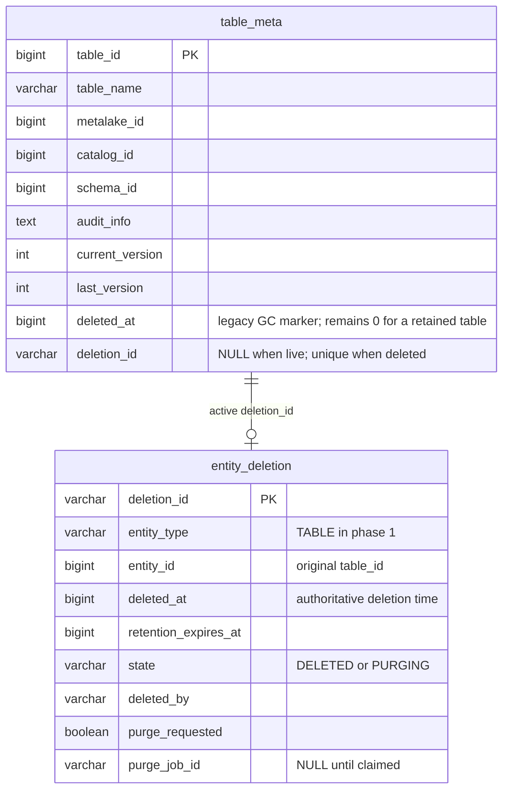
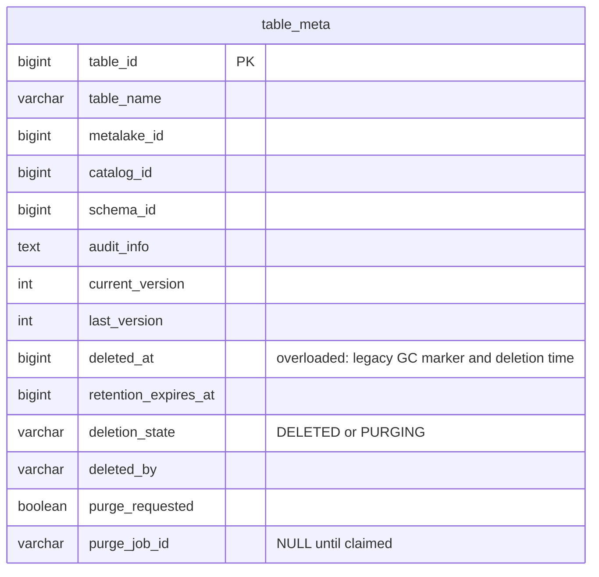
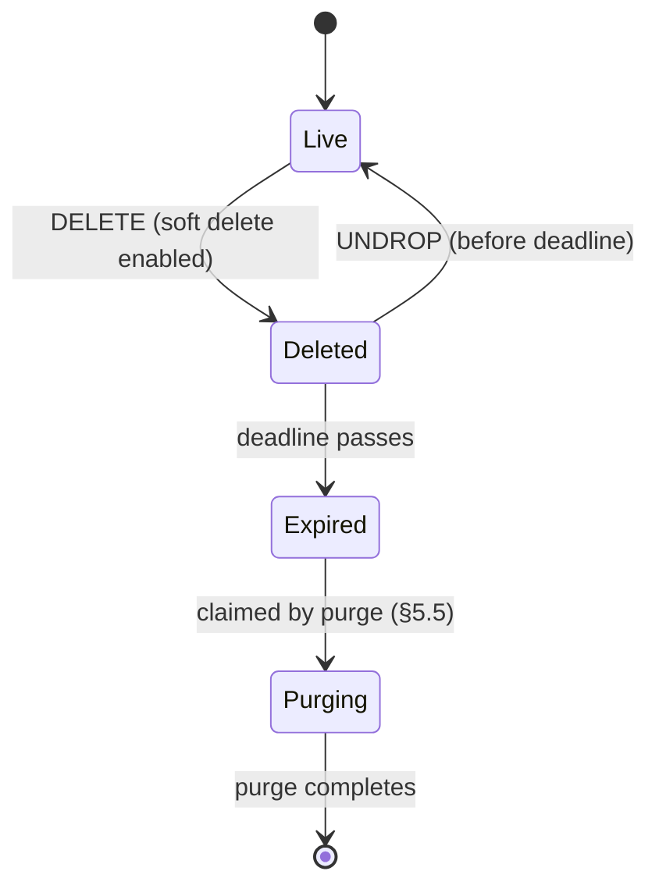
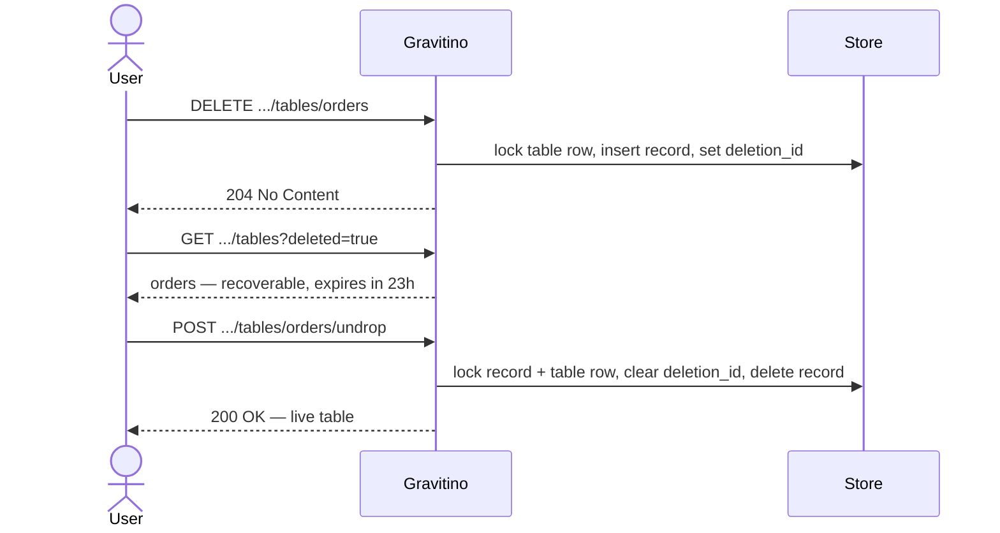
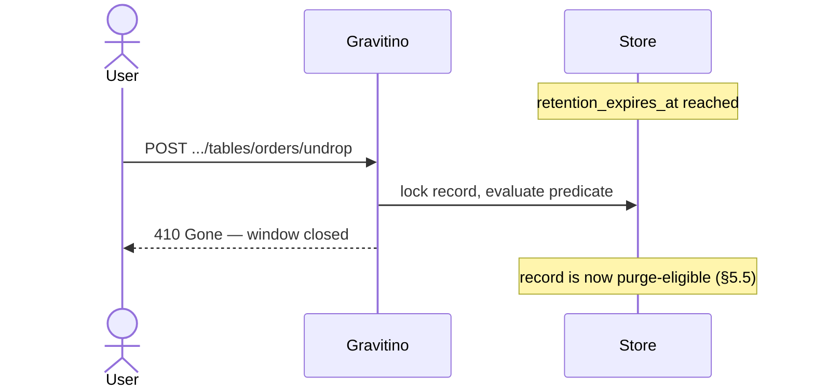
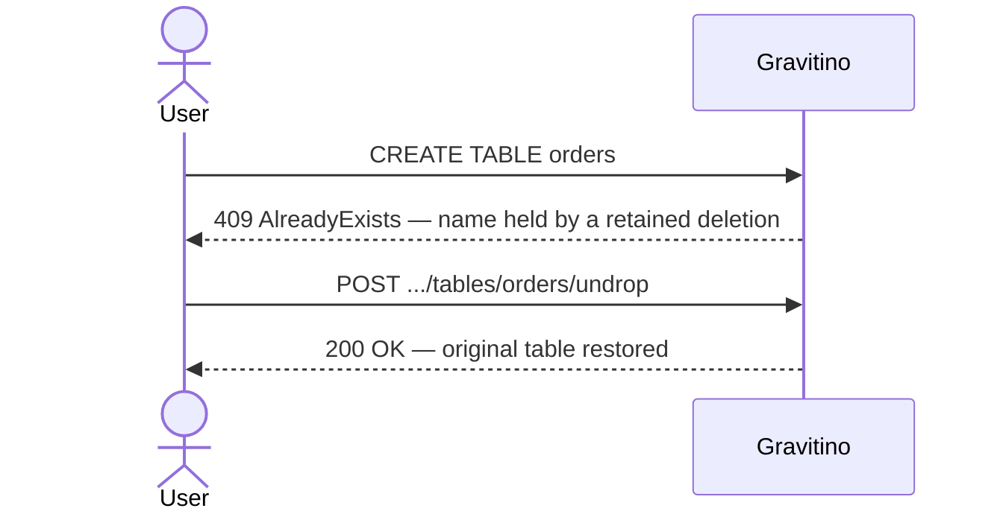
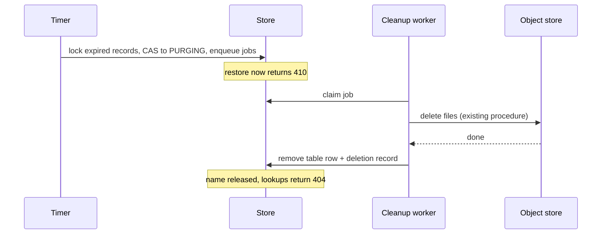

<!--
  Licensed to the Apache Software Foundation (ASF) under one
  or more contributor license agreements.  See the NOTICE file
  distributed with this work for additional information
  regarding copyright ownership.  The ASF licenses this file
  to you under the Apache License, Version 2.0 (the
  "License"); you may not use this file except in compliance
  with the License.  You may obtain a copy of the License at

   http://www.apache.org/licenses/LICENSE-2.0

  Unless required by applicable law or agreed to in writing,
  software distributed under the License is distributed on an
  "AS IS" BASIS, WITHOUT WARRANTIES OR CONDITIONS OF ANY
  KIND, either express or implied.  See the License for the
  specific language governing permissions and limitations
  under the License.
-->

# Design: Soft Deletion for Iceberg Tables

| Field   | Value                                                                               |
| ------- | ----------------------------------------------------------------------------------- |
| Status  | Draft — for discussion                                                              |
| Author  | Nevin Zheng                                                                         |
| Created | 2026-07-29                                                                          |
| Module  | `core`, `server`, `iceberg/iceberg-rest-server`                                     |
| Related | [Asynchronous Hard Deletion](../async-iceberg-rest-hard-deletion.md) (§3 Non-Goal 1) |

**Scope.** The deletion record, the metadata model, and the API for discovering and
undeleting a dropped Iceberg table, and the purge that runs when the window closes.
Purge reuses the shipped cleanup worker; its scheduling and operator tooling are
deferred (§5.5). Existing drop and purge behavior is unchanged.

---

## 1. Background

Dropping an Iceberg table is terminal — no window exists in which a mistaken drop
can be undone.

| Request                                       | What happens                                  | Recoverable |
| --------------------------------------------- | --------------------------------------------- | ----------- |
| `DELETE …` (no purge)                         | Registration removed; data files orphaned     | No          |
| `DELETE …?purgeRequested=true` (synchronous)  | Files deleted on the request thread           | No          |
| `DELETE …?purgeRequested=true` (asynchronous) | A cleanup job deletes files in the background | No          |

The asynchronous path shipped with
[Asynchronous Hard Deletion](../async-iceberg-rest-hard-deletion.md), which moved
cleanup off the request thread. It deliberately left recovery out — its §3 Non-Goal
1 destroys files with no undrop path and defers soft delete to a follow-up. This is
that follow-up.

Two existing mechanisms look adjacent but are not recovery. **Relational
tombstones** (`deleted_at` plus `RelationalGarbageCollector`) are storage hygiene:
nothing reads those rows back, there is no restore verb, and the name frees up at
once. **The purge tombstone** holds an identifier only while a cleanup job runs, to
stop a recreate landing on the old storage prefix.

Gravitino retains deleted rows today, but it neither reserves their names nor gives
users a way to see or recover them. Missing is a durable record saying *this was
deleted, it can still be restored, and here is when that stops being true.*

---

## 2. Recommended Design

**Decision.** Replace today's V1 row-tombstone deletion model with the V2 entity
deletion model, and make V2 the single implementation after migration. A V2 deletion
has its own durable `entity_deletion` record; the table retains its identity and V2
can therefore expose a bounded, name-reserving restore window.

| Decision | Recommendation |
| -------- | -------------- |
| Deletion state | Put timestamps, retention, state, actor, and purge ownership on `entity_deletion`, not on `table_meta`. |
| Relationship during the first V2 rollout | Use nullable `table_meta.deletion_id` to point at the V2 record; it is a relationship projection, not duplicated lifecycle state. |
| Compatibility | Fully migrate V1 to V2. Do not operate two deletion implementations indefinitely. |
| Default policy | Configure V2 on the Iceberg catalog, with a two-week default retention period. |

### 2.1 User-visible behavior

The existing drop route remains the entry point. V2 adds discovery and recovery on
the existing Gravitino table resource:

```text
DELETE /.../tables/{table}
GET    /.../tables?deleted=true
GET    /.../tables/{table}?deleted=true
POST   /.../tables/{table}/undrop
```

A successful drop hides the table and reserves its name. Before the deadline, a user
can discover it and restore its original metadata identity. After the deadline, a
purge claim makes recovery unavailable and asynchronous cleanup removes metadata and,
when requested, Iceberg files. Standard Iceberg REST clients continue to see the
existing drop protocol.

### 2.2 Rollout decision

V1 is the current `deleted_at`/garbage-collector implementation. V2 is the entity
deletion model. The proposal recommends a full V1 → V2 schema and service migration,
so API routes, reads, locking, garbage collection, and purge use one state machine.
The alternative—routing individual operations through V1 or V2 according to
configuration—is documented as a fallback only in §6.3.

The remainder of this document contains the detailed storage comparison, exact API
contract, transaction/purge mechanics, and migration plan. Reference implementations
are in Appendix A.

---

## 3. Scope

### 3.1 Goals

1. **Recoverable window**: a dropped table is restorable to its *original* identity
   — same id, name, and attached metadata — until a persisted deadline.
2. **Bounded**: recoverability ends at that deadline whether or not purge has run.
3. **Reserved name**: the name stays occupied until purge, so no new table can take
   it and make restore ambiguous.
4. **Discoverable**: users can list what they dropped and how long they have left,
   through the existing Gravitino metadata API.
5. **No Iceberg REST wire change**: standard clients drop tables exactly as today.
6. **Automatic expiry**: when the window closes, purge removes the files and the
   metadata with no operator action.

---

### 3.2 Non-Goals

1. **Purge internals**: §5.5 defines the purge lifecycle and its transactions;
   scheduling parameters, retry tuning, and operator repair tooling are deferred.
2. **Changing existing drop or purge behavior**: the synchronous and asynchronous
   hard-delete paths are untouched, including their defaults and `purgeRequested`.
3. **Non-Iceberg connectors**: JDBC, Kafka, and Paimon drops destroy the object at
   the source. Iceberg is recoverable because a saved metadata pointer can be
   re-registered.
4. **Namespace, schema, and view recovery**: different containment rules; a follow-up.
5. **Schema- and table-level retention overrides**: phase 1 resolves retention from
   the catalog property at drop time.
6. **Trash / recycle-bin UX**: no Web UI work.

---

## 4. Detailed Storage Design

The decision is **where deletion state lives**. Both sketches begin with the current
`table_meta` row: `table_id`, `table_name`, `metalake_id`, `catalog_id`, `schema_id`,
`audit_info`, `current_version`, `last_version`, and the legacy `deleted_at` column.

### 4.1 Recommended: Separate deletion action record

Phase 1 keeps the current table row as the table's identity and adds one nullable
relationship pointer. The deletion action, including its timestamp and purge
lifecycle, is its own entity record.



`table_meta.deletion_id IS NULL` means the table is live. A non-null value identifies
the one deletion action that currently hides it. Restore clears the pointer and
removes the action record in one transaction; table metadata and relations do not
need to be rewritten. This puts all lifecycle data on the deletion action rather
than copying lifecycle columns onto the table row.

#### Fields and invariants

Only one field is added to the current `table_meta` row. Every other new field belongs
to the deletion action record.

| Record and field | Purpose |
| ---------------- | ------- |
| `table_meta.deletion_id` | Phase-1 nullable, unique pointer to the active deletion action. `NULL` means live; a non-null value reserves the table name and identifies the action to restore or purge. |
| `entity_deletion.deletion_id` | Opaque primary key for the same deletion generation. This is the durable action identifier, not a table name. |
| `entity_deletion.entity_type` | `TABLE` in phase 1. Keeps the record reusable when another metadata entity becomes recoverable. |
| `entity_deletion.entity_id` | The original `table_id`, preserving table identity across restore. |
| `entity_deletion.deleted_at` | Authoritative time of the deletion action. New soft deletes leave `table_meta.deleted_at` at `0`. |
| `entity_deletion.retention_expires_at` | Calculated once at drop time, so later retention configuration changes affect only later drops. |
| `entity_deletion.state` | `DELETED` while recoverable and `PURGING` once a worker has claimed irreversible cleanup. |
| `entity_deletion.deleted_by` | Principal that requested the deletion, for discovery and audit. |
| `entity_deletion.purge_requested` | Captures whether eventual purge deletes Iceberg files or only catalog metadata. |
| `entity_deletion.purge_job_id` | `NULL` while recoverable; set by the successful `DELETED → PURGING` claim. |

During the compatibility transition, a table is hidden when either the legacy marker
or the new pointer is present:

```
isDeleted = table_meta.deleted_at != 0 OR table_meta.deletion_id IS NOT NULL
```

The existing garbage collector scans `deleted_at`, so it does not see retained
tables. The existing unique key on `(schema_id, table_name, deleted_at)` continues to
reserve a retained name because its `deleted_at` remains `0`. A unique index on
`table_meta.deletion_id`, together with the drop transaction's
`deletion_id IS NULL` check, permits only one active deletion action per table across
MySQL, PostgreSQL, and H2. The reference direction is only
`table_meta.deletion_id → entity_deletion`; it must not cascade, so a table-row
delete can never silently erase the deletion action record.

#### Longer-term simplification

Phase 1 deliberately stores the **relationship key** in both records:
`table_meta.deletion_id` points to `entity_deletion.deletion_id`. It does not
duplicate deletion time, retention, state, actor, or purge-job fields; those remain
authoritative only on `entity_deletion`.

The recommended long-term shape is deletion-entity-only: remove the
`table_meta.deletion_id` projection and resolve an active deletion through a unique
`entity_deletion(entity_type, entity_id)` record. That keeps the base entity row
entirely about the table. It is a follow-up migration, not an R1 prerequisite: it
requires the deleted-read, locking, and indexing paths to use the deletion entity
directly. Phase 1 retains the pointer because it is the smaller, compatible rollout
while the generic entity-deletion layer is introduced.

### 4.2 Alternative: Glob the deletion lifecycle onto the current row (not recommended)

The alternative keeps one row by adding every deletion-action field to the existing
`table_meta` record.



This saves one table but makes `table_meta` represent both a table and a mutable
deletion action. It also requires the same state-machine columns on every future
recoverable entity type. Restore becomes a multi-column inverse update whose
correctness depends on clearing every lifecycle field; a deletion action has no
independent identifier for audit, purge ownership, or future extension. For those
reasons, this option is not recommended.

---

## 5. Detailed API and Lifecycle

### 5.1 Overview

A drop with soft delete enabled writes a **deletion record** and leaves the table
row in place. The record holds the deadline and is the only thing making the table
recoverable. Restore deletes the record; passing the deadline ends recoverability.



`Expired` is derived, not stored — it is `DELETED` with the deadline behind it.
`Purging` is stored and is the hard cutoff: once a purge owns the record, restore is
refused even if no file has been deleted. There is no `Restoring` state; restore is
a single transaction.

### 5.2 API

All new surface extends the **Gravitino metadata routes**. No new route tree, and no
change to the Iceberg REST wire protocol.

| Operation    | Route                                                                      |
| ------------ | -------------------------------------------------------------------------- |
| Drop         | `DELETE /api/metalakes/{m}/catalogs/{c}/schemas/{s}/tables/{t}`             |
| List deleted | `GET  /api/metalakes/{m}/catalogs/{c}/schemas/{s}/tables?deleted=true`      |
| Load deleted | `GET  /api/metalakes/{m}/catalogs/{c}/schemas/{s}/tables/{t}?deleted=true`  |
| Restore      | `POST /api/metalakes/{m}/catalogs/{c}/schemas/{s}/tables/{t}/undrop`        |

`deleted=true` reuses the existing table routes rather than adding a `/deletions`
tree: the table is addressed by the name it still holds, so clients need no second
identifier. The response carries safe fields only — never a metadata location,
FileIO properties, or credentials:

```json
{
  "name": "orders",
  "entityId": "984273",
  "deletedAt": 1784800000000,
  "retentionExpiresAt": 1784886400000,
  "deletedBy": "alice",
  "purgeRequested": true,
  "recoverable": true
}
```

**Drop behavior.** With soft delete disabled, all three paths in §1 are untouched.
With it enabled, a deletion record is created and the table row is retained;
`purgeRequested` is *captured on the record* and consumed by purge when the window
closes (§5.5), so the parameter keeps its meaning — files still die if it was
`true`, just later.

**Errors.** No conditional headers, so no `412` or `428`.

| Code  | Condition                                                                  |
| ----- | -------------------------------------------------------------------------- |
| `204` | Drop accepted                                                              |
| `200` | Deleted read or restore succeeded                                          |
| `400` | Malformed request                                                          |
| `403` | Caller may not read deleted metadata or restore                            |
| `404` | No live table, or no retained deletion — including after a completed purge  |
| `409` | Create, register, or rename targets a name held by a retained deletion      |
| `410` | The deadline has passed, or a purge already owns the record                 |

### 5.3 Concurrency

Consistency comes from **row locks**, not ETags or a revision column. There is no
`If-Match` and no client-visible precondition. Each transaction takes
`SELECT … FOR UPDATE` on the rows it touches, in one order — **record, then table
row**.

| Transaction     | Locks                  | Steps                                                                                                                  |
| --------------- | ---------------------- | ---------------------------------------------------------------------------------------------------------------------- |
| **Drop**        | table row only         | Verify live and `deletion_id IS NULL`; insert the record; set `deletion_id`; commit                                     |
| **Restore**     | record, then table row | Verify the predicate below; clear `deletion_id`; delete the record; commit                                              |
| **Purge claim** | record, then table row | Re-verify the deadline has passed; CAS `DELETED → PURGING` and attach `purge_job_id`; commit                             |

Drop takes a single lock, so it cannot be in a deadlock cycle, and because the
pointer it writes lives on the row it locks, it still serializes against restore and
purge. Recoverability is a predicate, not a stored flag:

```
state = 'DELETED' AND now < retention_expires_at AND purge_job_id IS NULL
```

The deadline is exclusive for restore and inclusive for purge, so no instant is
both. `server_now` is captured once per transaction; clock skew across nodes could
let one consider a record recoverable while another considers it expired, which the
`PURGING` CAS still resolves to a single winner.

Restore consumes the record, so it cannot apply twice: a replayed restore finds a
live table and no record, returning `404`. A replayed drop finds `deletion_id`
already set and creates nothing.

### 5.4 User journeys

**Drop and restore.**



**Deadline passes.**



**Name held during the window.**



The `409` is deliberate: a user recreating the name usually meant to get the old
table back, and letting a new empty table take it would strand the recoverable one.

### 5.5 Purge

Purge runs in three phases. The middle one is the shipped async cleanup worker,
unchanged — only the claim and the finalization are new.

```mermaid
stateDiagram-v2
    [*] --> Deleted: DELETE
    Deleted --> Live: UNDROP (before deadline)
    Deleted --> Expired: deadline passes
    Expired --> Purging: timer claims (row lock + CAS + enqueue)
    Purging --> Purging: retry on failure; name stays reserved
    Purging --> [*]: files gone, then table row and record removed
```



| Phase           | Runs                                                                                                   | Notes                                                            |
| --------------- | ------------------------------------------------------------------------------------------------------ | ---------------------------------------------------------------- |
| **1. Claim**    | A timer, in one transaction per batch: row lock each expired record, CAS `DELETED → PURGING`, set `purge_job_id`, insert a cleanup job | Purely relational; no external side effect yet |
| **2. Delete**   | The shipped cleanup worker, unchanged                                                                   | Rebuilds the file graph from the table's metadata pointer and deletes leaf-first, root `metadata.json` last |
| **3. Finalize** | One transaction: remove table-owned rows, the table row, then the record                                | Only on confirmed success                                        |



Three rules make this safe. Finalization is **predicated** on matching `table_id`,
`deletion_id`, and `purge_job_id`, so a table that was restored and dropped again is
never destroyed by the old generation's job. When `purge_requested` is false, phase
2 is skipped and only metadata is removed — files are left, matching today's
metadata-only drop. And a job that exhausts its retries leaves the record in
`PURGING` with the name still reserved, awaiting operator repair; a failed purge
never silently releases a name or returns the record to `DELETED`.

### 5.6 Interoperation with asynchronous hard deletion

Soft delete and the shipped async hard deletion never act on the same table at once.
Configuration decides which path a drop takes:

| Soft delete | A drop is handled by            | The name is reserved by |
| ----------- | ------------------------------- | ----------------------- |
| Disabled    | Async hard deletion (unchanged) | The cleanup job row     |
| Enabled     | Soft deletion (this design)     | The retained table row  |

They meet at exactly one point: when the deadline passes, the `DELETED → PURGING`
CAS hands the table over. That single transition is why only one owner ever holds a
name at a time.

**The flag gates writes, not reads.** Creating a deletion record is the only
conditional behavior; every read of `entity_deletion` is always active, and
hard-delete teardown always removes any record it finds — in the same transaction
that removes the table row, since the pointer does not cascade. So the flag governs
new drops only: turning it off stops new retained deletions while existing records
keep draining through restore or expiry, rather than stranding with names held.
Where the feature was never enabled the table is empty and every read is an indexed
miss.

### 5.7 Catalog configuration

Phase 1 configures soft delete on the Iceberg catalog. These catalog properties are
the defaults for every table in that catalog; the resolved retention is captured in
`entity_deletion.retention_expires_at` when the table is dropped. A later catalog
change therefore affects subsequent drops only.

| Catalog property                            | Default      | Description                                      |
| ------------------------------------------- | ------------ | ------------------------------------------------ |
| `gravitino.entity.soft-delete.enabled`      | `false`      | Opt-in. Off preserves today's behavior exactly.  |
| `gravitino.entity.soft-delete.retention-ms` | `1209600000` | Recovery window: two weeks. Valid range 0–90 days. |

Phase 1 honors these for Iceberg tables only. Retention `0` means the record is
immediately expired — no usable window. Schema- and table-level overrides are
explicitly deferred.

### 5.8 Authorization

Reading deleted metadata and restoring are authorized before anything is disclosed
or changed, against *current* permissions rather than those captured at drop time.
Because a deleted table's owner may no longer be evaluable, phase 1 authorizes both
against the parent schema. Unauthorized, wrong-generation, and missing targets share
a sanitized `404`, so `deleted=true` cannot probe for existence.

Restore reinstates the table's pre-drop grants, owner, tags, and policies, since
those rows were never touched.

### 5.9 Backward compatibility

With soft delete disabled, behavior is unchanged. With it enabled:

- Live reads and lists exclude retained tables once the `isDeleted` predicate is
  propagated (§4.1).
- A dropped name stays occupied until purge, so create, register, and rename may
  return `409` where they previously succeeded. This is the one visible change.
- Standard Iceberg REST clients see no protocol change — a drop still succeeds and
  `HEAD` still returns `404`.
- Metadata and files survive until purge runs, so an enabled deployment holds
  storage for at least the length of the window.

---

## 6. Compatibility and Migration

### 6.1 Terms

**V1 deletion** is the current Gravitino behavior: a drop marks the metadata row with
`deleted_at`; the relational garbage collector later removes the tombstone. It has no
public deleted-object query or restore contract, and it frees the name immediately.

**V2 entity deletion** is this proposal: a deletion is represented by an
`entity_deletion` record with its own identity, timestamp, retention deadline, state,
and purge ownership. The metadata row is retained, a V2 deletion reserves its name,
and the metadata API can list and restore it.

### 6.2 Option A: Full V1 → V2 migration (recommended)

Make V2 the single deletion implementation. The schema migration adds the deletion
entity and the V2 relationship/indexes, and the service migration moves every delete,
read, garbage-collection, and purge path to the V2 model. New API routes therefore
always read one state machine, and catalog configuration tunes V2 retention rather
than choosing between two deletion implementations.

The data migration must preserve the timestamp of every surviving V1 tombstone and
must never grant it a new recovery window. A V1 tombstone that has already expired
continues directly to cleanup; a migration conflict, such as a name legitimately
reused under V1, is not silently restored. The implementation can drain such rows or
record them as non-recoverable V2 actions, but it must finish the cutover with only
the V2 schema and behavior active.

This is the recommended option because it creates one query model, one locking model,
one garbage-collection/purge lifecycle, and one set of user-visible semantics. It is
more work in the migration itself, but substantially simpler to operate and evolve.

### 6.3 Option B: V1/V2 interoperation (not recommended)

Keep both deletion implementations and add routing so a request takes either the V1
or V2 path according to configuration. The routes, reads, garbage collector, and
purge workers would all need to understand both representations; a catalog-level mode
would decide which path a new drop takes.

This reduces the initial migration work but leaves two durable deletion contracts in
production. Discovery and restore must merge V1/V2 results, locking and name rules
can differ by mode, and every future feature must be implemented and tested twice.
For that reason it is a fallback only if a full cutover is operationally impossible,
not the proposed delivery model.

---

## 7. Delivery Plan

### 7.1 Record and lifecycle
- [ ] Add the `entity_deletion` table and migrations (MySQL, H2, PostgreSQL)
- [ ] Add nullable `table_meta.deletion_id` with its unique index and conversion objects
- [ ] Propagate the `isDeleted` predicate (§4.1) through every read path
- [ ] Implement the row-locked drop transaction behind the soft-delete config
- [ ] Implement the row-locked restore transaction

### 7.2 API
- [ ] Add `?deleted=true` to table list and load in `server/`
- [ ] Add the `POST …/undrop` endpoint and DTOs
- [ ] Authorization for deleted reads and restore
- [ ] Java and Python client support
- [ ] Update the OpenAPI spec and validate with `./gradlew :docs:build`
- [ ] Update user-facing documentation in `docs/`

### 7.3 Purge
- [ ] Timer that claims expired records: row lock, CAS to `PURGING`, enqueue the cleanup job
- [ ] Route claimed records into the shipped cleanup worker; skip file deletion when `purge_requested` is false
- [ ] Predicated finalization: table-owned rows, the table row, then the record
- [ ] Operator repair path for records stuck in `PURGING`

---

### 7.4 Testing

- **Unit**: drop writes exactly one record; restore consumes it; replayed drop and
  restore are safe; the recoverability predicate at each boundary, including
  retention `0`.
- **Concurrency**: restore versus purge claim — exactly one wins; concurrent drops
  produce one record; lock ordering under contention on H2, MySQL, and PostgreSQL.
- **Integration** (`gravitino-docker-test`): drop, list with `deleted=true`, restore,
  then confirm the original identity and attached metadata survive; restore after the
  deadline returns `410`; a same-name create returns `409` on both the Gravitino and
  Iceberg REST paths; restart mid-window loses nothing.
- **Purge**: expiry deletes files and releases the name; `purge_requested = false`
  removes metadata and leaves files; a table restored and re-dropped is never
  destroyed by the old generation's job.

---

## Appendix A: Competitive Reference Implementations

This section distinguishes published API contracts from source-visible implementation
details. The hosted Databricks Unity Catalog service and the open-source
`unitycatalog/unitycatalog` project are separate implementations.

### A.1 Unity Catalog

#### Databricks Unity Catalog (hosted)

**Databricks SQL recovery API.** Unity Catalog exposes discovery and two restore
forms:

```sql
SHOW TABLES DROPPED [ { FROM | IN } schema_name ] [ LIMIT maxResults ];

UNDROP TABLE catalog.schema.table_name;
UNDROP TABLE WITH ID '<table-id>';
```

`SHOW TABLES DROPPED` lists recoverable dropped tables visible to the caller. Its
result includes `catalogName`, `schemaName`, `tableName`, `tableId`, `tableType`,
`deletedAt`, `createdAt`, `updatedAt`, `createdBy`, `owner`, and `comment`.
`tableId` identifies one dropped generation. The name form restores the most recent
matching table; `UNDROP TABLE WITH ID` restores the exact generation selected from
the discovery result. The parent catalog and schema must exist, and a live same-name
relation must be renamed before recovery. Recovery restores privileges, column
specification, and properties; primary and foreign-key constraints are not restored,
and ownership returns to the previous owner.

**REST table API.** The documented table surface includes:

```text
GET    /api/2.1/unity-catalog/tables
POST   /api/2.1/unity-catalog/tables
GET    /api/2.1/unity-catalog/tables/{full_name}
DELETE /api/2.1/unity-catalog/tables/{full_name}
```

The public `TableInfo` model includes a stable `table_id` and an optional
`deleted_at` timestamp. The documented REST list and get routes do not define a
deleted-table selector, and the REST API does not document an HTTP undrop operation;
the published recovery surface is Databricks SQL.

**Published metadata and lifecycle contract.** Databricks does not publish its
physical metastore schema or hosted-service implementation. Its public behavior does
establish that multiple dropped generations of one name can be retained and selected
by immutable ID. The default recovery window is seven days; catalog and schema
retention settings apply prospectively to subsequently dropped tables. When the
window ends, the object is no longer recoverable and managed-table data files are
deleted asynchronously. Deleting an external table removes catalog metadata while
leaving its external files in place.

**References.**

- [SHOW TABLES DROPPED](https://docs.databricks.com/aws/en/sql/language-manual/sql-ref-syntax-aux-show-tables-dropped)
- [UNDROP TABLE](https://docs.databricks.com/aws/en/sql/language-manual/sql-ref-syntax-ddl-undrop-table)
- [Unity Catalog Tables REST API](https://docs.databricks.com/api/workspace/tables)
- [List Tables REST API](https://docs.databricks.com/api/workspace/tables/list)
- [Object storage lifecycle in Unity Catalog](https://docs.databricks.com/aws/en/data-governance/unity-catalog/object-storage-lifecycle)
- [ALTER CATALOG retention setting](https://docs.databricks.com/aws/en/sql/language-manual/sql-ref-syntax-ddl-alter-catalog)

#### Open-source Unity Catalog

**REST API.** The open-source server exposes the same normal table-operation shape:

```text
POST   /api/2.1/unity-catalog/tables
GET    /api/2.1/unity-catalog/tables
GET    /api/2.1/unity-catalog/tables/{full_name}
DELETE /api/2.1/unity-catalog/tables/{full_name}
```

Its OpenAPI contract has no `undrop`, `undelete`, `include_deleted`, dropped-table
listing, or retention route. `DELETE` returns `200 OK`.

**Source-visible metadata and lifecycle backing.** `TableInfoDAO` maps a live table
to `uc_tables`, with a UUID `id` exposed as `table_id`, name, schema ID, type, owner,
and creation/update attribution. It has no deletion timestamp, deletion state,
retention expiry, deletion ID, or tombstone reference. Table columns and properties
are associated with that live row.

`TableRepository.deleteTable` hard-deletes this metadata. For a managed table it
attempts directory and Delta-commit cleanup, removes properties, and removes the
table row (with its cascaded columns); for an external table it skips the file cleanup
but still removes the catalog metadata. `TableService` then removes table
authorizations. This source implementation therefore has no retained metadata from
which to recover a table.

**References.**

- [OpenAPI table routes](https://github.com/unitycatalog/unitycatalog/blob/3976efb6556655b9359e7a98f71010c8ea9f395c/api/all.yaml)
- [`TableInfoDAO` metadata model](https://github.com/unitycatalog/unitycatalog/blob/3976efb6556655b9359e7a98f71010c8ea9f395c/server/src/main/java/io/unitycatalog/server/persist/dao/TableInfoDAO.java)
- [`TableRepository.deleteTable`](https://github.com/unitycatalog/unitycatalog/blob/3976efb6556655b9359e7a98f71010c8ea9f395c/server/src/main/java/io/unitycatalog/server/persist/TableRepository.java)
- [`TableService.deleteTable`](https://github.com/unitycatalog/unitycatalog/blob/3976efb6556655b9359e7a98f71010c8ea9f395c/server/src/main/java/io/unitycatalog/server/service/TableService.java)

### A.2 Apache Polaris

**Iceberg REST API.** Polaris implements the standard Iceberg REST drop route:

```text
DELETE /v1/{prefix}/namespaces/{namespace}/tables/{table}?purgeRequested={boolean}
```

It returns `204 No Content`. `purgeRequested` defaults to `false` and means that the
caller requests deletion of the underlying table data and metadata. The published
OpenAPI defines no route to list dropped tables or to undrop one.

**Source-visible metadata and lifecycle backing.** `LocalIcebergCatalog.dropTable`
removes the table catalog entry through `dropEntityIfExists`. A request with
`purgeRequested=true` is rejected unless the `DROP_WITH_PURGE_ENABLED` feature is
enabled; that feature defaults to `false`. In the transactional metastore
implementation, an enabled purge both drops the entity and creates a `TASK` entity
of type `ENTITY_CLEANUP_SCHEDULER` in the same transaction. Its task payload contains
the dropped table metadata needed by the cleanup handler, which fans out file-cleanup
work and then deletes the Iceberg metadata file.

That task is a physical-cleanup mechanism, not a recovery contract. The JDBC
persistence implementation deletes the metadata entity row, while the core entity
model's lifecycle timestamp fields are not exposed through an Iceberg REST discovery
or restore API. Polaris publishes no recoverability window or undelete operation.

**References.**

- [Iceberg REST OpenAPI drop route](https://github.com/apache/polaris/blob/main/spec/iceberg-rest-catalog-open-api.yaml)
- [`LocalIcebergCatalog.dropTable`](https://github.com/apache/polaris/blob/main/runtime/service/src/main/java/org/apache/polaris/service/catalog/iceberg/LocalIcebergCatalog.java)
- [`DROP_WITH_PURGE_ENABLED` configuration](https://github.com/apache/polaris/blob/main/polaris-core/src/main/java/org/apache/polaris/core/config/FeatureConfiguration.java)
- [Transactional drop and task creation](https://github.com/apache/polaris/blob/main/polaris-core/src/main/java/org/apache/polaris/core/persistence/transactional/TransactionalMetaStoreManagerImpl.java)
- [Table cleanup task handler](https://github.com/apache/polaris/blob/main/runtime/service/src/main/java/org/apache/polaris/service/task/TableCleanupTaskHandler.java)
- [JDBC entity deletion](https://github.com/apache/polaris/blob/main/persistence/relational-jdbc/src/main/java/org/apache/polaris/persistence/relational/jdbc/JdbcBasePersistenceImpl.java)
