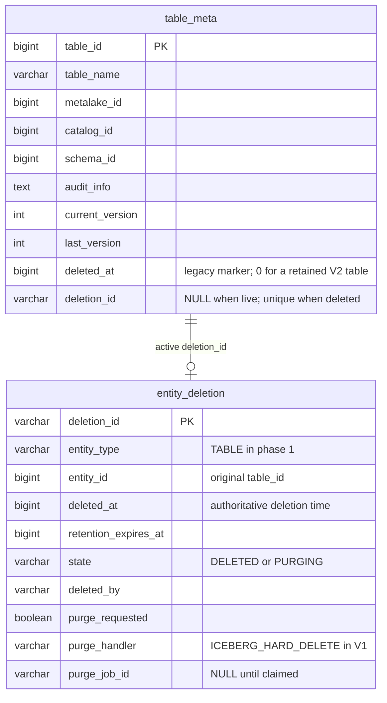
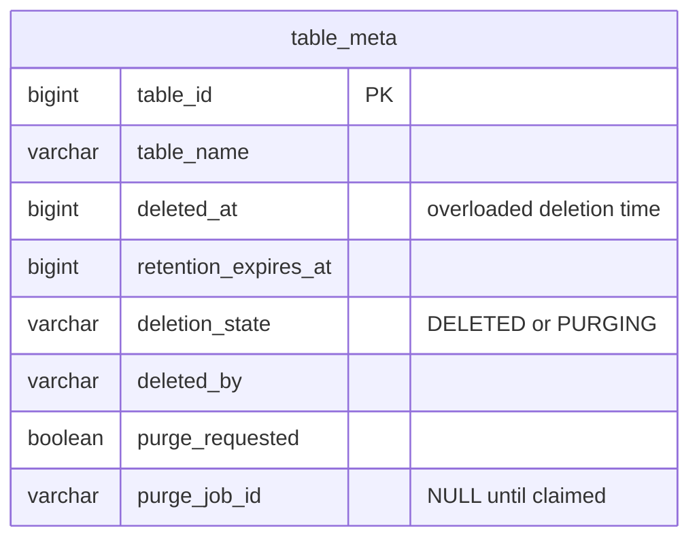
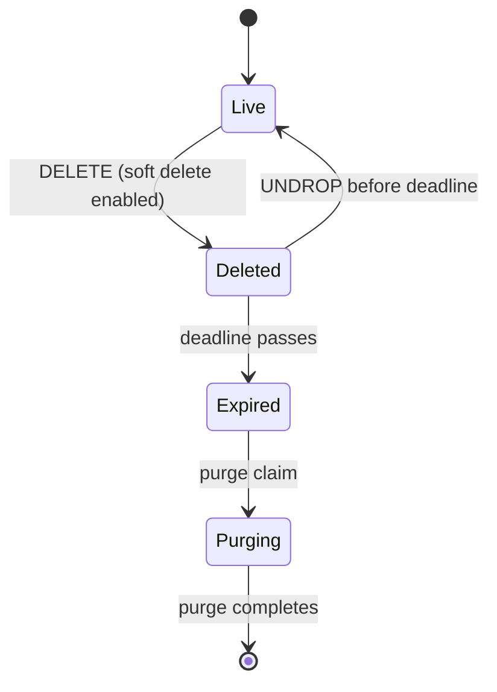
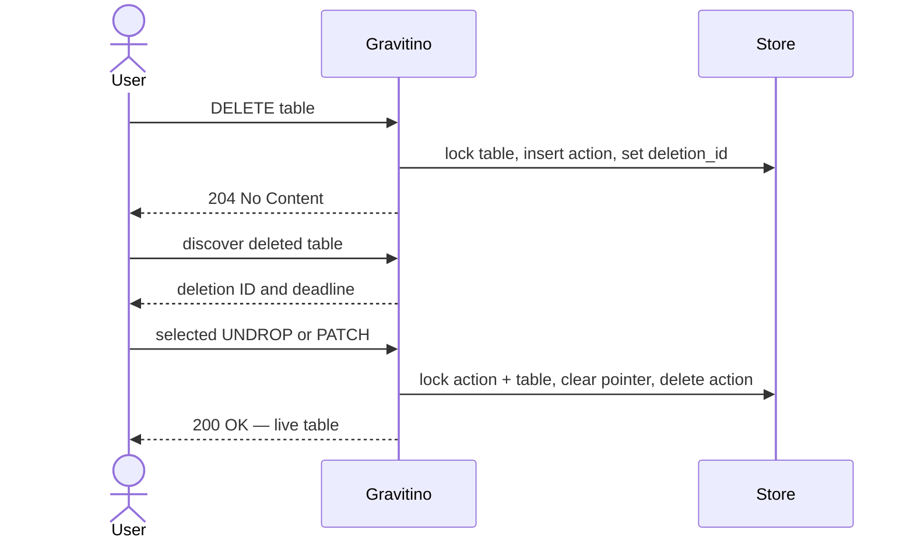

<!--
  Licensed to the Apache Software Foundation (ASF) under one
  or more contributor license agreements.  See the NOTICE file
  distributed with this work for additional information
  regarding copyright ownership.  The ASF licenses this file
  to you under the Apache License, Version 2.0 (the
  "License"); you may not use this file except in compliance
  with the License.  You may obtain a copy of the License at

   http://www.apache.org/licenses/LICENSE-2.0

  Unless required by applicable law or agreed to in writing,
  software distributed under the License is distributed on an
  "AS IS" BASIS, WITHOUT WARRANTIES OR CONDITIONS OF ANY
  KIND, either express or implied.  See the License for the
  specific language governing permissions and limitations
  under the License.
-->

# Design: Soft Deletion for Iceberg Tables

| Field | Value |
| --- | --- |
| Status | Draft — for discussion |
| Author | Nevin Zheng |
| Created | 2026-07-29 |
| Module | `core`, `server`, `iceberg/iceberg-rest-server` |
| Related | [Asynchronous Hard Deletion](../async-iceberg-rest-hard-deletion.md) (§3 Non-Goal 1) |

**Scope.** This design adds a retained deletion record, metadata model, discovery,
undelete, and expiry-driven purge for Iceberg tables. It exposes the same lifecycle
through two management facades: the PRD-requested Iceberg REST management extension
and the native Gravitino table API. Both delegate to one deletion and purge control
plane. V2 delegates purge to a common handler; its exact worker and job mechanics are
deferred for follow-up design review. With soft delete disabled, existing drop and
purge behavior is unchanged.

---

## 1. Background

Dropping an Iceberg table is terminal — no recovery window exists today.

| Request | V1 — current hard-delete behavior | V2 — proposed soft-delete behavior |
| --- | --- | --- |
| `DELETE …` (no purge) | Removes the catalog registration; data files are orphaned. | Creates a retained deletion action with the configured recovery deadline. |
| `DELETE …?purgeRequested=true` (synchronous) | Deletes files on the request thread. | Marks the action immediately expired. It is deleted briefly, then the expiry scan invokes the common purge method. |
| `DELETE …?purgeRequested=true` (asynchronous) | Creates a cleanup job that deletes files in the background. | Uses the same V2 deletion-action and expiry path; V2 does not add a separate sync/async choice. |

[Asynchronous Hard Deletion](../async-iceberg-rest-hard-deletion.md) moved cleanup
off the request thread. It deliberately left recovery out: a table is dropped and,
when requested, its files are later destroyed. This design adds the retained period
before that irreversible hand-off. V2's exact purge-worker, enqueue, and retry
mechanism will be specified in a follow-up purge design after this API and metadata
review; this proposal only defines the deletion action and the transition to purge.

Two existing mechanisms are adjacent but are not recovery. Relational tombstones
(`deleted_at` plus `RelationalGarbageCollector`) are storage hygiene: no user-facing
read or restore exists, and a name is reusable immediately. The asynchronous purge
tombstone only protects a name while an existing cleanup job runs. Neither says,
durably, *this deletion can still be undone until this deadline*.

---

## 2. Recommended Design

**Decision.** Introduce V2 entity deletions and make that model the single deletion
implementation after migration. Each retained Iceberg drop has a durable
`entity_deletion` action. The table retains its identity; the action owns retention,
state, actor, and purge ownership. This creates a bounded recovery window while
holding the original name.

| Decision | Recommendation |
| --- | --- |
| Deletion state | Store timestamps, retention, state, actor, and purge ownership on `entity_deletion`, not `table_meta`. |
| V2 relationship | Add nullable `table_meta.deletion_id` as a relationship projection, not duplicate lifecycle state. |
| Public API | Implement both the Iceberg management extension (A) and native Gravitino table API (B) over one control plane. |
| Compatibility | Fully migrate V1 to V2; do not operate both deletion implementations indefinitely. |
| Default policy | Configure V2 on the Iceberg catalog, with a two-week default recovery period. |

### 2.1 User-visible behavior

The normal Iceberg REST table `DELETE` remains the entry point. A retained drop hides
the table and holds its name. Before the persisted deadline, a user can discover and
restore the exact original metadata identity. At expiry, a purge claim makes recovery
unavailable and hands the deletion to asynchronous cleanup.

V2 has two management facades:

```text
A. Iceberg management extension
GET    /iceberg/management/v1/.../tables?deleted=true
POST   /iceberg/management/v1/.../tables/{table}/undrop?deletionId={id}

B. Native Gravitino table API
GET    /api/.../tables?include=deleted
PATCH  /api/.../tables/{table}?include=deleted&id={entityId}&deletionId={deletionId}
```

The standard Iceberg REST `/v1` wire contract is unchanged. The management route is
a documented Gravitino extension; the native route is an Iceberg-first use of a
potential broader Gravitino recovery pattern. No non-Iceberg entity type is enabled
by this design.

### 2.2 Rollout and migration decision

V1 is the current `deleted_at` / garbage-collector model. V2 is the entity-deletion
model. This proposal recommends a full V1 → V2 schema and service migration so reads,
locks, garbage collection, and purge use one state machine. A temporary V1/V2
interoperation route is documented only as a fallback in §6.3.

---

## 3. Scope

### 3.1 Goals

1. **Recoverable window:** a dropped Iceberg table can return with its original ID,
   name, and attached metadata until a persisted deadline.
2. **Bounded:** recovery ends at that deadline even if physical cleanup has not run.
3. **Reserved name:** no new table can take a retained deleted table's name.
4. **Discoverable:** callers can find a deleted table, its deletion generation, and
   its remaining recovery time.
5. **Two compatible facades:** the PRD management API and the native Gravitino API
   use one lifecycle rather than two independent storage models.
6. **No standard IRC wire change:** normal Iceberg clients continue to use existing
   `/v1` drop behavior.
7. **Automatic expiry:** an expiry scan invokes the shared purge method without an
   operator having to reissue the request.

### 3.2 Non-goals

1. **Purge-worker internals:** retry tuning, scheduling parameters, and repair UI
   are deferred; §5.6 defines only the action-to-worker boundary.
2. **Non-Iceberg connectors and entity types:** JDBC, Kafka, Paimon, namespaces,
   schemas, views, and other entities require their own source-system recovery and
   purge design.
3. **Changing standard hard-delete behavior when soft delete is disabled.**
4. **Schema- and table-level retention overrides:** phase 1 resolves retention from
   the Iceberg catalog when the table is dropped.
5. **Trash / recycle-bin UI.**

---

## 4. Detailed Storage Design

The design question is where deletion state lives. Both options begin with the
current `table_meta` row: `table_id`, `table_name`, `metalake_id`, `catalog_id`,
`schema_id`, audit fields, version fields, and the legacy `deleted_at` marker.

### 4.1 Recommended: separate deletion action record

Phase 1 keeps the table row as the table's identity and adds one nullable relationship
pointer. The deletion action owns the durable lifecycle. Iceberg purge-job parameters
are constructed from the retained table metadata when the action is purged.



`table_meta.deletion_id IS NULL` means the table is live. A non-null value identifies
the active deletion action. Restore clears the pointer and removes the action in one
transaction; the retained Gravitino table metadata and relations do not need to be
recreated.

#### Fields and invariants

| Record and field | Purpose |
| --- | --- |
| `table_meta.deletion_id` | Nullable, unique pointer to the active action. It reserves the table name and identifies the deletion to restore or purge. |
| `entity_deletion.deletion_id` | Opaque immutable ID for one deletion generation, not a table name. |
| `entity_type` | `TABLE` in V1. It permits future expansion without enabling it now. |
| `entity_id` | Original immutable `table_id`; restore returns the same identity. |
| `deleted_at` | Authoritative V2 deletion time. A retained V2 table keeps `table_meta.deleted_at = 0`. |
| `retention_expires_at` | Calculated at drop time; later configuration changes affect only later drops. |
| `state` | `DELETED` while recoverable and `PURGING` after irreversible cleanup is claimed. |
| `deleted_by` | Deleting principal, for safe discovery and audit correlation. |
| `purge_requested` | Whether final cleanup deletes Iceberg files or only catalog metadata. |
| `purge_handler` | The typed physical-cleanup handler. V1 uses `ICEBERG_HARD_DELETE`. |
| `purge_job_id` | `NULL` while recoverable; set by the successful `DELETED → PURGING` claim. |

When a deletion is claimed for purge, the service constructs
`IcebergPurgeJobParameters` from the retained table metadata and current catalog
configuration, then passes them to the typed purge handler. The deletion action stores
lifecycle state, not a second copy of Iceberg table metadata or credentials.

During migration, a table is hidden when either V1 or V2 marks it deleted:

```text
isDeleted = table_meta.deleted_at != 0 OR table_meta.deletion_id IS NOT NULL
```

The existing garbage collector scans `deleted_at`, so it does not collect retained V2
tables. Because the retained row keeps `deleted_at = 0`, the existing unique key on
`(schema_id, table_name, deleted_at)` holds the name. A unique index on
`table_meta.deletion_id`, together with the locked `deletion_id IS NULL` check,
permits only one active action per table across MySQL, PostgreSQL, and H2. The pointer
must not cascade: removal of a table row must never silently erase an action record.

#### Longer-term simplification

Phase 1 deliberately stores only the relationship key in both records:
`table_meta.deletion_id` points to `entity_deletion.deletion_id`. Lifecycle fields
remain authoritative only on `entity_deletion`.

The long-term simplification is deletion-entity-only: remove the pointer and resolve
an active action through a unique `entity_deletion(entity_type, entity_id)` record.
That is a later migration, not a V1 prerequisite, because every deleted-read, lock,
and index path must then resolve through the action entity directly.

### 4.2 Alternative: glob the lifecycle onto the current row (not recommended)

The alternative adds `retention_expires_at`, deletion state, actor,
`purge_requested`, and `purge_job_id` directly to `table_meta`.



This saves one table but makes one row mean both a table and a mutable deletion action.
It requires lifecycle columns on every future recoverable entity, has no independent
deletion-generation ID, and makes restore a correctness-sensitive multi-column inverse
update. The dedicated action is clearer, reversible, and separately extensible.

### 4.3 Other alternatives considered

| Alternative | Why it is not the chosen model |
| --- | --- |
| Extend the existing asynchronous cleanup-job row | A cleanup job is execution state, not a recoverable deletion. It exists only for the purge path and would mix a weeks-long retained action with worker attempts, heartbeats, and failures. |
| Derive recovery from audit or change-log rows | A log can explain history but cannot act as an authoritative deadline, name reservation, exact-generation selector, or restore-versus-purge concurrency boundary. |

The existing cleanup-job row remains the correct execution record after an action is
claimed for purge. It is intentionally linked by `purge_job_id`, rather than expanded
into the retained deletion record.

---

## 5. Detailed API and Lifecycle

### 5.1 Overview

When soft delete is enabled, a drop writes a deletion action and retains the table
row. The action holds the deadline and is the only object that makes the table
recoverable. Restore removes the action; successful final purge removes it after
table cleanup. The action is disposable recovery state, not an audit ledger: delete,
restore, purge, and failure audit events are separate concerns.



`Expired` is derived, not stored: it is `DELETED` after its deadline. `PURGING` is the
hard recovery cutoff; once a purge owns an action, undelete is refused even if file
deletion has not started. There is no public `RESTORING`, `RESTORED`, or `PURGED`
action record in V1.

### 5.2 API surfaces and rollout

**Decision: implement both public management surfaces for Iceberg tables.** The
deletion action, retention policy, audit metadata, and purge job are shared. A and B
are transport facades over one control plane, not competing metadata models.

**A is the committed PRD surface.** Mark's PRD requests an Iceberg REST management
API, so it is the required Iceberg-facing interface. **B is also implemented for the
same Iceberg lifecycle** because Gravitino-native clients need a consistent recovery
experience. Extending B to more entity types is a future product/API decision; this
document enables no non-Iceberg type.

#### A. Iceberg management API — Iceberg-only scope

This is a documented Gravitino management extension next to, but not inside, upstream
Iceberg REST `/v1` routes.

```http
# Standard Iceberg REST table drop; configuration selects the lifecycle.
DELETE /iceberg/v1/{prefix}/namespaces/{namespace}/tables/{table}?purgeRequested={boolean}

# Gravitino-specific Iceberg management extension.
GET    /iceberg/management/v1/{prefix}/namespaces/{namespace}/tables?deleted=true
GET    /iceberg/management/v1/{prefix}/namespaces/{namespace}/tables/{table}?deleted=true&deletionId={id}
POST   /iceberg/management/v1/{prefix}/namespaces/{namespace}/tables/{table}/undrop?deletionId={id}
DELETE /iceberg/management/v1/{prefix}/namespaces/{namespace}/tables/{table}/deletions/{id}
```

The final `DELETE` calls the shared purge method for the selected action. It marks
the action `PURGING`, after which undelete is refused, and delegates cleanup to the
Iceberg purge handler. The expiry scanner calls the same method for expired actions.
This tree is not an Iceberg REST standard; it is versioned and documented as a
Gravitino extension.

#### B. Native Gravitino soft-delete and purge API — incremental rollout

This extends the native Gravitino table resource with the same retained deletion
contract. V1 enables it for Iceberg tables only, alongside A.

```http
GET    /api/metalakes/{m}/catalogs/{c}/schemas/{s}/tables?include=deleted&name={table}&id={entityId}
GET    /api/metalakes/{m}/catalogs/{c}/schemas/{s}/tables/{table}?include=deleted&id={entityId}&deletionId={deletionId}
PATCH  /api/metalakes/{m}/catalogs/{c}/schemas/{s}/tables/{table}?include=deleted&id={entityId}&deletionId={deletionId}

{ "deleted": false }

DELETE /api/metalakes/{m}/catalogs/{c}/schemas/{s}/tables/{table}?include=deleted&id={entityId}&deletionId={deletionId}&purge=true
```

The deleted list returns each deletion's opaque `deletionId`. `PATCH` restores only
the selected retained generation. `entityId` and `deletionId` together select the
exact action; the table name and parent route are validated against the saved action
rather than acting as the mutation key. The explicit native purge calls the same
purge method as A. No other entity type is enabled by this design.

#### Shared behavior, results, and errors

Both discovery APIs expose safe fields only — never a metadata location, FileIO
properties, or credentials.

```json
{
  "name": "orders",
  "entityId": "984273",
  "deletionId": "del_01H...",
  "deletedAt": 1784800000000,
  "retentionExpiresAt": 1784886400000,
  "deletedBy": "alice",
  "purgeRequested": false,
  "recoverable": true
}
```

With soft delete disabled, all existing drop paths are unchanged. With it enabled,
`purgeRequested=false` receives the configured retained window.
`purgeRequested=true` creates the same deletion action but sets
`retention_expires_at` to the deletion time. It is therefore deleted briefly, then
the expiry scanner claims it and calls the shared purge method.

| Code | Condition |
| --- | --- |
| `200` | Deleted read or restore succeeds. |
| `202` | Purge has been accepted for asynchronous execution. |
| `204` | Standard Iceberg drop is accepted. |
| `400` | Request path, body, query, or header is malformed. |
| `403` | Caller is not allowed to discover, restore, or purge the deletion. |
| `404` | No selected retained deletion exists, including an action consumed by restore. |
| `409` | Create, register, or rename targets a name held by a retained deletion. |
| `410` | An undelete is requested after the deadline or after purge owns the action. |

### 5.3 Concurrency

Row locks and the action-state predicate provide server-side serialization. Each
mutation supplies the exact immutable `deletionId` and locks the deletion action and
table row in one order: **action, then table row**. A and B therefore share the same
correctness boundary without a public conditional-header contract.

| Transaction | Locks | Steps |
| --- | --- | --- |
| **Drop** | table row | Verify live and `deletion_id IS NULL`; insert action; set pointer; commit. |
| **Restore** | action, then table row | Verify target and recovery predicate; clear pointer; remove action; commit. |
| **Purge claim** | action, then table row | Verify `DELETED`; the expiry scan also verifies expiry; CAS `DELETED → PURGING`; attach job ID; commit. |

Recoverability is a predicate, not a stored flag:

```text
state = 'DELETED' AND now < retention_expires_at AND purge_job_id IS NULL
```

The deadline is exclusive for restore and inclusive for purge. `server_now` is
captured once per transaction. Expiry or `PURGING` returns `410`. If a concurrent
restore already consumed the selected action, the exact-ID replay returns `404`; a
caller with a lost response confirms success by loading the normal live table.

### 5.4 User journeys

**Drop and restore through either management facade.**



**Deadline and name reservation.** A request after the deadline receives `410`; the
same name remains reserved until successful finalization. A same-name create,
register, or rename receives `409`, rather than silently stranding the recoverable
table. A user who wants the old table restores it; one who wants replacement contents
uses an explicit replace workflow after purge.

### 5.5 Delete semantics

| `soft-delete.enabled` | `purgeRequested` | Result |
| --- | --- | --- |
| `false` | `false` | Existing metadata-only drop; no retained action. |
| `false` | `true` | Existing hard-delete behavior; no recovery window. |
| `true` | `false` | Create a retained action with the catalog's captured recovery deadline. |
| `true` | `true` | Create an immediately expired action; it is deleted briefly, then the expiry scanner invokes the purge handler to delete Iceberg files. |
| `true`, retention `0` | either | Immediately purge-eligible; no usable recovery window. |

The enabled drop transaction must capture the action, set the table pointer, and
reserve the name before returning success. A retry must detect the existing retained
action rather than create a second deletion generation.

### 5.6 Purge

Purge has a small control-plane handoff. A background scan selects expired actions and
calls the shared purge method. The method transitions the selected action to
`PURGING` and delegates to the typed purge handler. The exact worker, enqueue,
batching, retry, and operator-repair mechanism will be specified in follow-up design
work.

```mermaid
stateDiagram-v2
    [*] --> Deleted: DELETE
    Deleted --> Live: UNDROP before deadline
    Deleted --> Expired: deadline passes
    Expired --> Purging: expiry scan calls purge
    Deleted --> Purging: explicit PURGE
    Purging --> Purging: retry on failure; name remains reserved
    Purging --> [*]: files handled, table row and action removed
```



| Phase | Runs | Notes |
| --- | --- | --- |
| **1. Claim** | Expiry scan or explicit management purge | Lock the action; transition `DELETED → PURGING`; compute `IcebergPurgeJobParameters` from retained metadata; then invoke the typed purge handler. |
| **2. Delete** | Purge mechanism — follow-up design | For `purge_requested=true`, delete Iceberg files; otherwise remove catalog metadata only. |
| **3. Finalize** | Completion transaction | Match the deletion and purge job; remove table-owned rows, table row, then action. |

Once an action is `PURGING`, undelete is refused. A failed purge stays `PURGING`,
keeps the name reserved, and requires repair. It must not become recoverable again or
silently release the name. Predicated finalization prevents an old job from deleting a
table that was restored and later dropped again.

### 5.7 Interoperation with asynchronous hard deletion

Soft delete and the existing asynchronous hard-delete path do not own the same table
at once.

| Soft delete | Drop owner | Name reservation |
| --- | --- | --- |
| Disabled | Existing hard-delete path | Existing cleanup-job tombstone where applicable |
| Enabled | This retained-action lifecycle | Retained `table_meta` row |

They meet only at `DELETED → PURGING`: one action hands an expired retained table to
the purge mechanism. The soft-delete flag gates new writes only. Disabling it stops
new retained actions; existing actions continue to restore or drain through purge.
The scan reads retained actions regardless of the current flag value.

### 5.8 Catalog configuration

V1 configures soft delete on the Iceberg catalog. The resolved value is captured in
`entity_deletion.retention_expires_at` at drop time, so a later configuration change
applies only to later drops.

| Catalog property | Default | Description |
| --- | --- | --- |
| `gravitino.entity.soft-delete.enabled` | `false` | Opt in; `false` retains current behavior. |
| `gravitino.entity.soft-delete.retention-ms` | `1209600000` | Two-week recovery window; valid range 0–90 days. |

Phase 1 honors these properties for Iceberg tables only. Retention `0` means no usable
recovery window. Schema- and table-level overrides are deferred.

### 5.9 Authorization

Authorize deleted reads, restore, and purge before any deleted metadata is disclosed
or changed, using current parent-schema permissions. A deleted table's object-level
owner may no longer be evaluable. Unauthorized, wrong-generation, and missing targets
share a sanitized `404` where needed to avoid an existence oracle. Authorization
policy details are intentionally kept out of this V1 storage/lifecycle decision. The
V2 drop retains table associations, so a successful restore re-exposes the original
Gravitino owner, tags, policies, and grants. External authorization-plugin replay is
deferred.

### 5.10 Backward compatibility

With soft delete disabled, behavior is unchanged. With it enabled:

- Live reads and lists exclude a table with a non-null `deletion_id`.
- A dropped name remains occupied until purge finalization; create, register, and
  rename can return `409` where they previously succeeded.
- Standard Iceberg REST clients still use the normal drop protocol.
- Metadata and files remain until the selected purge behavior runs.

---

## 6. Compatibility and Migration

### 6.1 Terms

**V1 deletion** is the current `deleted_at` plus garbage-collector behavior. It has
no public deleted-object discovery or restore contract and frees the name immediately.

**V2 entity deletion** is this design: a dedicated action has a deletion ID,
retention deadline, state, and purge ownership. The retained table row holds the name
and V2 supplies discovery and recovery through the two management facades.

### 6.2 Option A: full V1 → V2 migration (recommended)

Make V2 the single deletion implementation. The schema migration adds the action
entity and relationship/indexes; the service migration moves delete, read, garbage
collection, and purge to V2. New API routes then see one state machine.

The data migration preserves the timestamp of every surviving V1 tombstone and never
grants it a new recovery window. A V1 row already past expiry continues to cleanup. A
name legitimately reused under V1 is never silently restored; it is drained or
recorded as nonrecoverable before cutover completes.

### 6.3 Option B: V1/V2 interoperation (not recommended)

Keep both representations and route each operation by configuration. This lowers the
initial migration cost but forces discovery, locks, garbage collection, and future
features to understand two durable contracts. It is a fallback only if full cutover
is operationally impossible.

---

## 7. Delivery Plan

### 7.1 Record and lifecycle

- [ ] Add `entity_deletion` and migrations for MySQL, H2, and PostgreSQL.
- [ ] Add nullable `table_meta.deletion_id` and its unique index.
- [ ] Propagate the V1/V2 `isDeleted` predicate through live reads.
- [ ] Implement locked V2 drop and restore transactions behind the Iceberg catalog configuration.
- [ ] Construct typed Iceberg purge-job parameters from retained table metadata when
  the shared purge method claims an action.

### 7.2 API

- [ ] **A (PRD):** add the versioned Iceberg management resource, DTOs, and documentation.
- [ ] **B (Iceberg only):** add deleted discovery, exact-generation read, exact-generation `PATCH`, and explicit purge to the native API.
- [ ] Keep A and B as facades over the same deletion action and lifecycle transactions.
- [ ] Add authorization, Java/Python client support, OpenAPI validation, and user documentation.
- [ ] Do not enable another entity type without a type-specific deletion/recovery/purge design.

### 7.3 Purge

- [ ] Claim expired actions with a row lock, CAS, job link, and durable enqueue.
- [ ] Route claimed actions to the existing cleanup worker.
- [ ] Add exact-generation finalization and repair for actions stuck in `PURGING`.

### 7.4 Testing

- **Unit:** one action per drop; restore consumes it; retries are safe; retention 0;
  `purgeRequested=true` is immediately purge-eligible and the expiry scan invokes
  the same purge method.
- **Concurrency:** restore versus purge claim has exactly one winner; concurrent drops
  create one action; locking works on H2, MySQL, and PostgreSQL.
- **Integration:** both A and B discover and restore the same deletion; original
  identity survives; same-name create returns `409`; restart preserves the window.
- **Purge:** expiry releases the name only after success; non-file purge leaves files;
  an old generation's job cannot destroy a later drop.

---

## Appendix A: Competitive Reference Implementations

This matrix separates the public recovery surface from the persistence model. Hosted
Unity Catalog and open-source Unity Catalog share a resource name but do not share the
same deletion implementation.

| Comparison item | Unity Catalog | Apache Polaris |
| --- | --- | --- |
| **Implementation method** | **Hosted:** retains a dropped table during a recovery window. <br> **Open source:** hard-deletes the live `uc_tables` row and related metadata. | Hard-deletes the catalog entity. With purge enabled, it creates a cleanup `TASK` in the same metastore transaction. |
| **API example** | **Hosted SQL:** `SHOW TABLES DROPPED`; `UNDROP TABLE …` or `UNDROP TABLE WITH ID '…'`. Its documented REST table API has normal CRUD but no REST undrop. <br> **Open source:** normal REST CRUD only. | Standard Iceberg REST `DELETE /v1/{prefix}/namespaces/{namespace}/tables/{table}?purgeRequested=…`. No deleted-table discovery or undelete route. |
| **Metadata backing / identity** | **Hosted:** physical schema is private; the public result exposes stable `table_id` and `deleted_at`, and the ID form selects one dropped generation. <br> **Open source:** no deletion timestamp, retention record, or tombstone reference. | Cleanup task carries physical-cleanup input, but the deleted table entity is not retained as a recovery record. |
| **Retention and recovery** | **Hosted:** configurable recovery window; name-based recovery selects the latest generation and a live same-name table must be renamed first. <br> **Open source:** no recovery window. | No retained recovery window or undelete semantics. |
| **Physical cleanup** | **Hosted:** managed storage is cleaned asynchronously after the recovery period. <br> **Open source:** managed-table cleanup is attempted during deletion; external tables keep files but lose metadata. | `DROP_WITH_PURGE_ENABLED` gates a cleanup handler that deletes data and metadata after hard delete. |

**Unity Catalog sources.** [SHOW TABLES DROPPED](https://docs.databricks.com/aws/en/sql/language-manual/sql-ref-syntax-aux-show-tables-dropped), [UNDROP TABLE](https://docs.databricks.com/aws/en/sql/language-manual/sql-ref-syntax-ddl-undrop-table), [Tables REST API](https://docs.databricks.com/api/workspace/tables), [Object storage lifecycle](https://docs.databricks.com/aws/en/data-governance/unity-catalog/object-storage-lifecycle), [ALTER CATALOG retention](https://docs.databricks.com/aws/en/sql/language-manual/sql-ref-syntax-ddl-alter-catalog), [open-source routes](https://github.com/unitycatalog/unitycatalog/blob/3976efb6556655b9359e7a98f71010c8ea9f395c/api/all.yaml), [`TableInfoDAO`](https://github.com/unitycatalog/unitycatalog/blob/3976efb6556655b9359e7a98f71010c8ea9f395c/server/src/main/java/io/unitycatalog/server/persist/dao/TableInfoDAO.java), and [`TableRepository.deleteTable`](https://github.com/unitycatalog/unitycatalog/blob/3976efb6556655b9359e7a98f71010c8ea9f395c/server/src/main/java/io/unitycatalog/server/persist/TableRepository.java).

**Polaris sources.** [Iceberg REST OpenAPI drop route](https://github.com/apache/polaris/blob/main/spec/iceberg-rest-catalog-open-api.yaml), [`LocalIcebergCatalog.dropTable`](https://github.com/apache/polaris/blob/main/runtime/service/src/main/java/org/apache/polaris/service/catalog/iceberg/LocalIcebergCatalog.java), [`DROP_WITH_PURGE_ENABLED`](https://github.com/apache/polaris/blob/main/polaris-core/src/main/java/org/apache/polaris/core/config/FeatureConfiguration.java), [transactional cleanup task creation](https://github.com/apache/polaris/blob/main/polaris-core/src/main/java/org/apache/polaris/core/persistence/transactional/TransactionalMetaStoreManagerImpl.java), [table cleanup task handler](https://github.com/apache/polaris/blob/main/runtime/service/src/main/java/org/apache/polaris/service/task/TableCleanupTaskHandler.java), and [JDBC entity deletion](https://github.com/apache/polaris/blob/main/persistence/relational-jdbc/src/main/java/org/apache/polaris/persistence/relational/jdbc/JdbcBasePersistenceImpl.java).


## Appendix B: Iceberg REST compatibility and soft deletion

The upstream Iceberg REST Catalog specification does not define `undrop`, `undelete`,
deleted-table listing, retention, or a soft-delete resource. It does provide these
normal primitives:

| IRC primitive | Standard role | Role in this design |
| --- | --- | --- |
| `DELETE .../tables/{table}?purgeRequested=false` | Remove catalog registration without requesting file deletion. | Starts a retained action when soft delete is enabled. |
| `DELETE .../tables/{table}?purgeRequested=true` | Request metadata and file deletion. | Creates an immediately expired action; the expiry scan then invokes the V2 purge method. |
| `POST .../tables/{table}/unregister` | Remove a registration while returning its metadata location. | Possible internal metadata-only deletion mechanism. |
| `POST .../register` | Register a supplied metadata location. | Possible internal restoration mechanism. |

`unregister` and `register` are not `UNDROP`: they do not select an exact deletion,
apply retention and authorization, reserve a name, or coordinate purge. Those are
responsibilities of the Gravitino deletion action.

The standard IRC `/v1` routes remain standard. A lives under
`/iceberg/management/v1/...` as a separately versioned Gravitino extension. B lives
under native Gravitino `/api/...` routes. Both invoke the same action records,
retention checks, and purge handler.

**References.** [Iceberg REST Catalog specification](https://iceberg.apache.org/rest-catalog-spec/) and [upstream OpenAPI contract](https://github.com/apache/iceberg/blob/main/open-api/rest-catalog-open-api.yaml).
