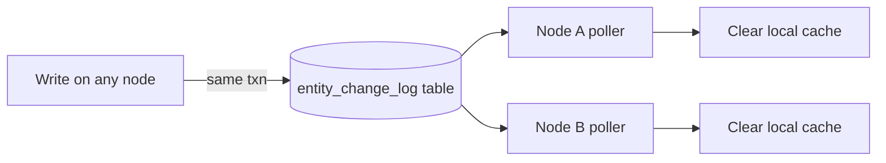
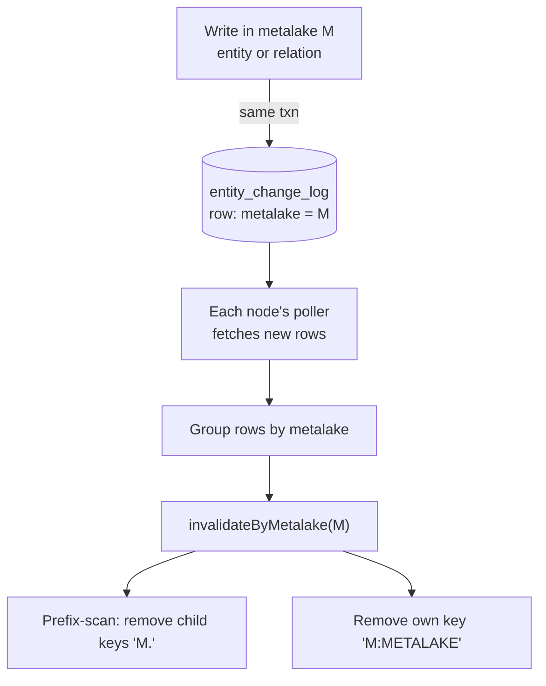
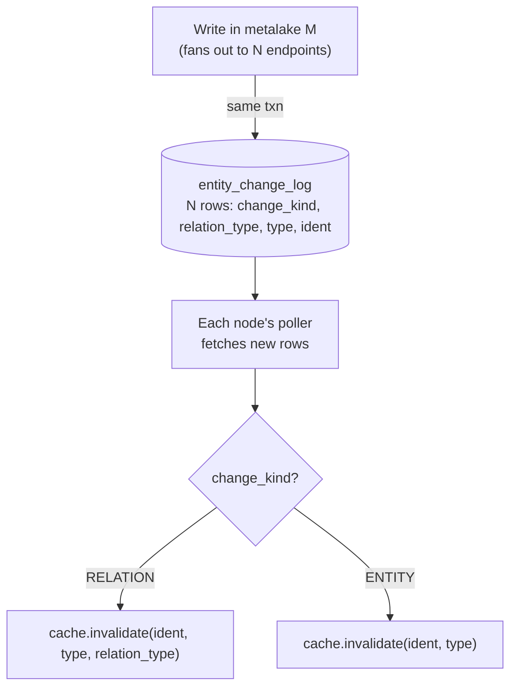
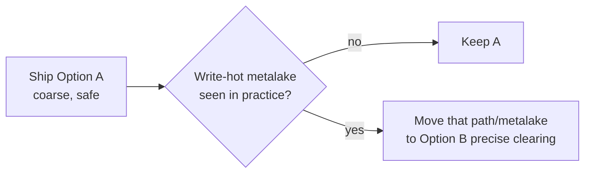

<!--
  Licensed to the Apache Software Foundation (ASF) under one
  or more contributor license agreements.  See the NOTICE file
  distributed with this work for additional information
  regarding copyright ownership.  The ASF licenses this file
  to you under the Apache License, Version 2.0 (the
  "License"); you may not use this file except in compliance
  with the License.  You may obtain a copy of the License at

   http://www.apache.org/licenses/LICENSE-2.0

  Unless required by applicable law or agreed to in writing,
  software distributed under the License is distributed on an
  "AS IS" BASIS, WITHOUT WARRANTIES OR CONDITIONS OF ANY
  KIND, either express or implied.  See the License for the
  specific language governing permissions and limitations
  under the License.
-->

---
title: "Multi-Node Invalidation for Entity Store Cache"
status: "Draft"
date: "2026-06-18"
---

## Background

Gravitino has two caches. The **jcasbin authorization cache** has already been reworked for multi-node and works correctly with more than one server. The **entity store cache** has not — it only clears entries on the node that made a change, so a change on node A leaves node B serving stale data. The only safe workaround today is to turn the entity store cache off (`gravitino.cache.enabled=false`), which hurts read-heavy catalogs (Iceberg most of all).

The jcasbin rework already gives us a proven pattern to copy. Every change writes a row to the `entity_change_log` table; a poller on each node reads new rows and clears the matching cache entries:



## Goals

- Make the **entity store cache** work in a multi-node deployment, so `gravitino.cache.enabled=true` becomes safe with more than one node.
- After a write, every node clears the affected entries within one poll interval — reusing the jcasbin `entity_change_log` + poller pattern.

These already behave correctly and stay unchanged:

| Already correct                       | Why                                                                    |
|---------------------------------------|------------------------------------------------------------------------|
| Writes never lose updates             | The write path reads the DB (not the cache) with an optimistic version check |
| `list(namespace)`                     | Skips the cache, so it is never stale                                  |
| Structural ALTER/DROP                 | Already write a change-log row; their `(ident, type)` key clears the right entry |
| CREATE                                | Needs no row: no negative caching, and `list` skips the cache          |

Structural entities = metalake, catalog, schema, table, topic, model, fileset, view.

## Problem Analysis

### Three Gaps to Close

| # | Gap                                            | Detail                                                                                             |
|---|------------------------------------------------|----------------------------------------------------------------------------------------------------|
| 1 | Relations write no change-log row              | grant, revoke, set owner, attach tag/policy record nothing                                          |
| 2 | Auth/metadata entities write no row            | `user` / `group` / `role` / `tag` / `policy` emit nothing for their own ALTER/DROP or relations — yet they **are** cached |
| 3 | The log can only describe ALTER and DROP       | `OperateType` has two values and a row holds one entity; a relation is a **binding between two** entities, which the row cannot express |

### Why Relations Are the Hard Part

A relation is cached **in both directions** — the same `ROLE_USER_REL` lives under two keys:

```
(ROLE_USER_REL, role1, ROLE) → [userA, userB]
(ROLE_USER_REL, userA, USER) → [role1, role2]
```

Dropping `role1` must also clear the reverse keys under each user, but "role1 was dropped" does not tell you who those users are. The writing node finds them with a local reverse index; another node may never have cached `role1`'s side, so it cannot. The two options below differ mainly in how they handle this reverse key.

### How Relations Are Written Today

Not all relation changes go through the relation API — this is the key thing an emit plan must not miss.

**Mechanism 1 — the binding is a field on an entity, saved with `store.update` / `store.put`.** Granting a role rewrites a field and saves the entity; it never calls a relation method:

| Operation                          | Code path             | Field changed                 | Relation affected          |
|------------------------------------|-----------------------|-------------------------------|----------------------------|
| grant/revoke role to **user**      | `store.update(USER)`  | `UserEntity.roleNames`        | `ROLE_USER_REL`            |
| grant/revoke role to **group**     | `store.update(GROUP)` | `GroupEntity.roleNames`       | `ROLE_GROUP_REL`           |
| grant/revoke privilege to **role** | `store.update(ROLE)`  | `RoleEntity.securableObjects` | `METADATA_OBJECT_ROLE_REL` |
| create role                        | `store.put(ROLE)`     | `securableObjects`            | `METADATA_OBJECT_ROLE_REL` |

These land in `UserMetaService` / `GroupMetaService` / `RoleMetaService`, which emit **nothing** today.

**Mechanism 2 — the relation API** (`insertRelation` / `batchInsertRelations` / `updateEntityRelations` / `deleteRelation`):

| Operation          | Relation                     |
|--------------------|------------------------------|
| set owner          | `OWNER_REL`                  |
| associate tags     | `TAG_METADATA_OBJECT_REL`    |
| associate policies | `POLICY_METADATA_OBJECT_REL` |
| future-grant apply | role/user/group relations    |

### What Each Relation Caches

Both directions are cached, so a change clears two keys, and the reverse key needs the **counterpart's name**:

| Relation                     | Key direction 1          | Key direction 2            | Names needed to clear both |
|------------------------------|--------------------------|----------------------------|----------------------------|
| `ROLE_USER_REL`              | `(rel, user, USER)`      | `(rel, role, ROLE)`        | user + its roles           |
| `ROLE_GROUP_REL`             | `(rel, group, GROUP)`    | `(rel, role, ROLE)`        | group + its roles          |
| `METADATA_OBJECT_ROLE_REL`   | `(rel, object, objType)` | `(rel, role, ROLE)`        | object + role              |
| `OWNER_REL`                  | `(rel, object, objType)` | `(rel, owner, USER/GROUP)` | object + owner             |
| `TAG_METADATA_OBJECT_REL`    | `(rel, object, objType)` | `(rel, tag, TAG)`          | object + tag               |
| `POLICY_METADATA_OBJECT_REL` | `(rel, object, objType)` | `(rel, policy, POLICY)`    | object + policy            |

### How One Node Clears Them Today

`RelationalEntityStore` already does this locally, and the cross-node design must reproduce it:

- **Entity-update path:** clear the entity's own key, then `invalidateAggregatedRoleRelationCache` walks the binding fields and clears the counterpart keys (each `securableObject`, each `roleName`).
- **Relation-API path:** clear both endpoints, `(src, relType)` and `(dst, relType)`.

The reverse key is the cross-node problem: a freshly granted binding was never cached on the other node, so it can only be cleared if the log carries the counterpart name (Option B) or if the whole metalake is cleared (Option A).

## Solution A: Clear the Whole Metalake

On any change in metalake M, write **one coarse row tagged with M**; every node clears all of M's cache entries and reloads lazily. Correct because a relation never crosses a metalake, so clearing M covers both directions — the reader never has to find the counterpart.



### Writer Side: What to Emit

Every row is identical — just the metalake; the reader ignores `entityType` / `fullName`. Sites that emit nothing today:

| Write                                                 | Lands in                               | Emit          |
|-------------------------------------------------------|----------------------------------------|---------------|
| grant/revoke role to user/group                       | `UserMetaService` / `GroupMetaService` | 1 row (M)     |
| grant/revoke privilege to role, create role           | `RoleMetaService`                      | 1 row (M)     |
| user/group/role/tag/policy own ALTER/DROP             | their MetaService                      | 1 row (M)     |
| set owner / attach tag / attach policy / future-grant | relation API backend                   | 1 row (M)     |
| structural ALTER/DROP                                 | structural MetaServices                | already emits |

grant/revoke is neither ALTER nor DROP, so add one `OperateType` value (e.g. `RELATION_CHANGE`) to carry the metalake instead of misusing `ALTER`.

**Writer difficulty: low–medium** — touch each site, one trivial emit, one new enum value, no schema change.

### Reader Side: What to Clear

One case — `invalidateByMetalake(M)`, two steps (keys use `.` between names and `:` before the type):

1. prefix-scan and remove child keys `"M."` — the trailing `.` keeps `prod` from matching `production`;
2. remove the metalake's own key `"M:METALAKE"`.

**Reader difficulty: low** — one method, one edge case (the prefix boundary).

### Reducing the Reload Spike

One write clears M's whole working set, so reads reload from the DB. It is bounded to one metalake, but a **write-hot metalake** plus **all nodes polling on the same cadence** can cause a synchronized burst. Mitigations, best first (combine the first two):

| Technique          | Idea                                                                                                                                    | Effect                          | Note                                |
|--------------------|-----------------------------------------------------------------------------------------------------------------------------------------|---------------------------------|-------------------------------------|
| Generation counter | bump a per-metalake counter instead of evicting; an entry stamped older than the counter is a miss on next `get` and reloads on its own | removes the burst entirely      | +1 `long`/entry; **recommended**    |
| Poll jitter        | randomize each node's poll offset                                                                                                       | flattens the cluster-wide spike | cheap, independent; **recommended** |
| Refresh-ahead      | serve the old value while one async load refreshes (`refreshAfterWrite`)                                                                | lowers latency spike            | widens stale window; fallback only  |

## Solution B: Clear Only the Affected Keys

Record the exact keys each write touched and let the other node replay them — no reload spike, but the log must carry the counterpart names. The writing node already knows them (`insertRelation` has both endpoints; `updateEntityRelations` has src + every dst; the entity-update path has the `roleNames` / `securableObjects` lists), so the other node discovers nothing.



**Schema change:** add `change_kind` (`ENTITY` / `RELATION`) and `relation_type` (nullable, set only on `RELATION` rows).

### Writer Side: What to Emit

Each affected endpoint is one row. Example — grant role1 to userA, userB → 3 rows: `(RELATION, ROLE_USER_REL, ROLE, role1)`, `(RELATION, ROLE_USER_REL, USER, userA)`, `(RELATION, ROLE_USER_REL, USER, userB)`.

| Channel                    | Site                                         | Rows to emit                                         | Endpoints come from                                   |
|----------------------------|----------------------------------------------|------------------------------------------------------|-------------------------------------------------------|
| 1 — relation API           | `insertRelation` / `updateEntityRelations` … | one `(RELATION, relType, type, ident)` per endpoint  | method arguments — easy                               |
| 2 — entity-update bindings | user/group/role `update` / `put`             | the entity + one per counterpart in the binding list | `roleNames` / `securableObjects` — easy to miss       |
| 3 — entity DROP cascade    | delete in any MetaService                    | one per opposite endpoint of each cascaded relation  | **`SELECT` before the soft-delete** — the costly part |
| own ALTER/DROP             | auth/metadata MetaServices                   | `(ENTITY, ALTER\|DROP, type, ident)`                 | the entity itself                                     |

Channel 3 cascade map (which relations cascade, and the opposite endpoints to SELECT):

| Deleted entity                            | Cascaded relations                                                                                    | Opposite endpoints to emit                    |
|-------------------------------------------|-------------------------------------------------------------------------------------------------------|-----------------------------------------------|
| role                                      | `ROLE_USER_REL` / `ROLE_GROUP_REL` / `METADATA_OBJECT_ROLE_REL`                                       | associated users / groups / securable objects |
| user                                      | `ROLE_USER_REL` / `OWNER_REL`                                                                         | associated roles; owned objects               |
| group                                     | `ROLE_GROUP_REL` / `OWNER_REL`                                                                        | associated roles; owned objects               |
| catalog/schema/table/topic/model/fileset  | `METADATA_OBJECT_ROLE_REL` / `OWNER_REL` / `POLICY_METADATA_OBJECT_REL` / `TAG_METADATA_OBJECT_REL`   | associated roles / owner / policies / tags    |
| metalake                                  | all of the above                                                                                      | same (cascaded at the metalake level)         |

**Writer difficulty: high** — schema change, row fan-out per batch write, and Channels 2 + 3 spread across every MetaService/manager that touches a binding. Miss one counterpart and that key stays stale on other nodes until its TTL expires.

### Reader Side: What to Clear

Mechanical replay, one row → one call (see the diagram): `RELATION` rows call `cache.invalidate(ident, type, relation_type)`, `ENTITY` rows call `cache.invalidate(ident, type)`. Both directions are covered because each is its own row.

**Reader difficulty: medium** — more cases than A (every relation, both directions, plus entity DDL), but no graph walk and no metalake-wide eviction.

## Comparison and Conclusion

|                        | A: Clear the metalake                 | B: Clear affected keys                             |
|------------------------|---------------------------------------|----------------------------------------------------|
| Change-log writes      | 1 coarse metalake row per write site  | entity + every counterpart endpoint; N rows        |
| Schema change          | none (one new operate type)           | two new columns                                    |
| Emit sites to touch    | both mechanisms + auth/tag/policy DDL | both mechanisms + auth/tag/policy DDL              |
| Hardest emit work      | none beyond tagging the metalake      | Channel 2 binding lists + Channel 3 cascade SELECT |
| Cases to clear         | one: `invalidateByMetalake`           | every relation (both directions) + entity DDL      |
| Reader difficulty      | low                                   | medium                                             |
| Writer difficulty      | low–medium                            | high                                               |
| Reload spike           | one metalake; mitigated               | none                                               |
| Main risk              | write-hot metalake                    | a missed counterpart leaves stale cache            |

Both options pay the same bill for finding and touching the write sites, and both need the new "binding" notion. The real trade-off:

- **A** trades extra DB reloads for a design that is **nearly impossible to get wrong**.
- **B** trades a much larger, error-prone emit surface for **no reload spike**.

**Conclusion: ship A first.** It is the smaller, safer change and unblocks multi-node with `cache.enabled=true` quickly.

## Rollout



A and B share the same consistency model and the same emit sites, so B can replace A **incrementally** — one relation channel or one metalake at a time, with no rewrite.

## Notes for Both Options

1. **The change-log write shares the backend write's transaction** (as `insertEntityChange` already does), or a concurrent failure could drop a signal or an endpoint.
2. **Replaying your own row is harmless** — the writing node already cleared its cache; its poller later replays the same row, and clearing an already-clear entry is a no-op (same as jcasbin).

## Test Plan

| Area        | Check                                                                                                                                                                      |
|-------------|----------------------------------------------------------------------------------------------------------------------------------------------------------------------------|
| A clearing  | a row for M clears every `M.` key plus `M:METALAKE`, and leaves a sibling like `prod` / `production` untouched                                                             |
| B clearing  | each channel and cascade lists the right counterparts; replay clears exactly those keys, both directions                                                                   |
| Multi-node  | node A runs grant/revoke/drop role, role to user/group, setOwner, attach tag/policy; node B sees fresh `listEntitiesByRelation` (both directions) within one poll interval |
| Regression  | entity-key behavior, the write path, and `list` strong consistency are unchanged                                                                                           |
