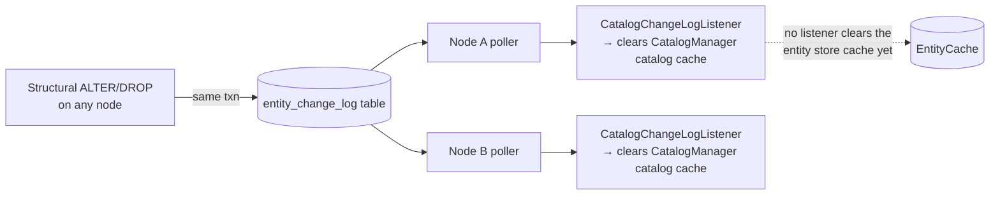
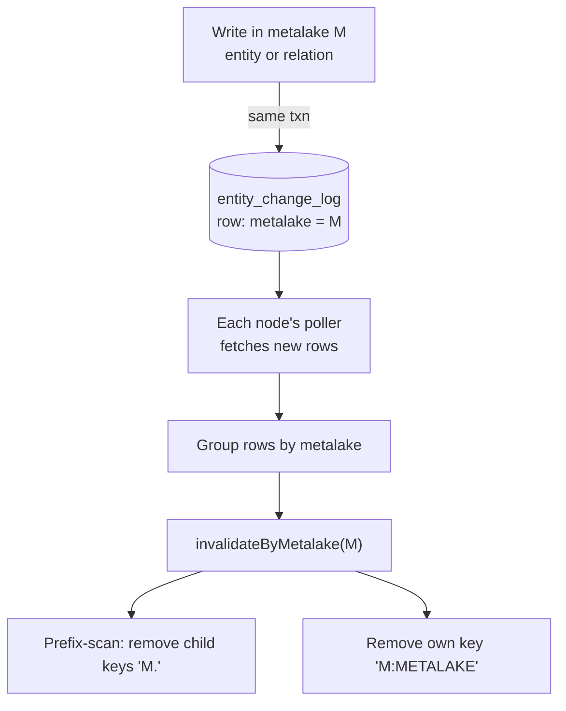
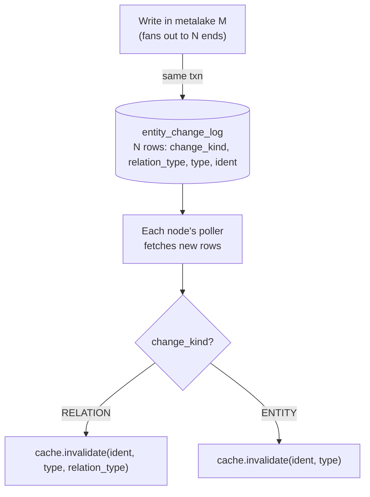
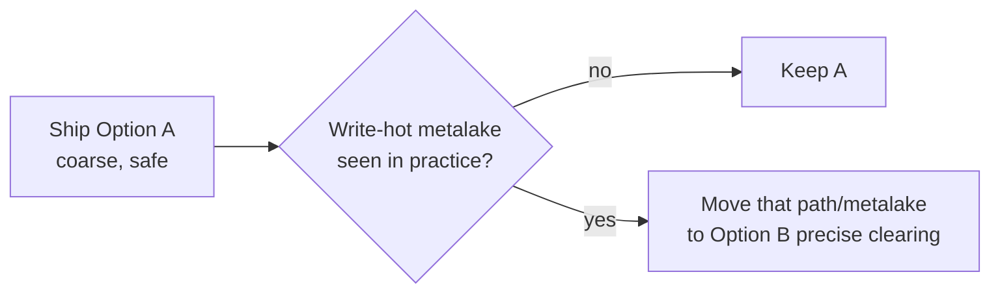

<!--
  Licensed to the Apache Software Foundation (ASF) under one
  or more contributor license agreements.  See the NOTICE file
  distributed with this work for additional information
  regarding copyright ownership.  The ASF licenses this file
  to you under the Apache License, Version 2.0 (the
  "License"); you may not use this file except in compliance
  with the License.  You may obtain a copy of the License at

   http://www.apache.org/licenses/LICENSE-2.0

  Unless required by applicable law or agreed to in writing,
  software distributed under the License is distributed on an
  "AS IS" BASIS, WITHOUT WARRANTIES OR CONDITIONS OF ANY
  KIND, either express or implied.  See the License for the
  specific language governing permissions and limitations
  under the License.
-->

---
title: "Multi-Node Invalidation for Entity Store Cache"
status: "Draft"
date: "2026-06-18"
---

## Background

This is the detailed design for the **local in-memory cache** (`gravitino.cache.impl = caffeine`, `coherence() = LOCAL_PER_NODE`). It is one of the two implementations in the [overview](./gravitino-entity-cache-multinode-overview-design.md). Read the overview first for the pluggable `EntityCache` SPI and the `coherence()` capability.

The entity store cache only clears entries on the node that made a change. So when more than one node runs, a change on node A leaves node B serving old data. The only safe workaround today is to turn the cache off (`gravitino.cache.enabled=false`), which hurts read-heavy catalogs (Iceberg most of all).

This document makes the local cache correct across nodes, so `gravitino.cache.enabled=true` becomes safe with more than one node.

## Goals

- Make the entity store cache correct across nodes, so `gravitino.cache.enabled=true` is safe with more than one node.
- After a write, every node drops the affected entries within a bounded delay.
- Keep the single-node behavior and the strong-consistency write path unchanged.

## Problem Analysis

### How the Cache Works Today

`CaffeineEntityCache` is the only implementation today. It is an in-memory cache, **one copy per node**. It caches two kinds of entries:

- **entity keys** `(ident, type)` → the entity itself;
- **relation keys** `(ident, type, relType)` → the list of related entities.

Relations are cached **in both directions**. The same `ROLE_USER_REL` lives under two keys:

```
(ROLE_USER_REL, role1, ROLE) → [userA, userB]
(ROLE_USER_REL, userA, USER) → [role1, role2]
```

To keep both directions in step, the cache holds a **reverse index**: when one side changes, it can find and clear the other side. On a write, the node clears the changed entity's key and then walks the reverse index to clear the related keys (a cascade). On a single node this is correct: right after any write, that node's cache matches the database.

### What Already Stays Correct Across Nodes

Some behavior is already safe with more than one node and does not change. None of it depends on the cache being cleared across nodes:

| Already correct                       | Why                                                                    |
|---------------------------------------|------------------------------------------------------------------------|
| Writes never lose updates             | The write path reads the DB (not the cache) with an optimistic version check |
| `list(namespace)`                     | Skips the cache, so it is never stale                                  |
| CREATE                                | Needs nothing: no negative caching, and `list` skips the cache         |

Structural entities = metalake, catalog, schema, table, topic, model, fileset, view.

### Why It Breaks Across Nodes

The cascade above runs **only on the node that made the change** (`RelationalEntityStore` calls `cache.invalidate(...)` directly on the write path). Nothing tells the other nodes to drop their copies. So after node A grants a role, node B keeps serving the old data until its entry happens to expire. The cache is per-node, but the clear never leaves the node. This is true for **every** cached entity — structural entities included; the entity store cache has no cross-node invalidation at all today.

### Why Relations Are the Hardest Part

For an entity key the fix is easy: "table T changed" names exactly the key to drop, and any node can drop it. Relations are harder because of the reverse key.

Dropping `role1` must also clear the reverse keys under each user (`(ROLE_USER_REL, userA, USER)` …), but "role1 was dropped" does not say **who those users are**. The writing node finds them through its local reverse index. Another node may never have cached `role1`'s side, so its reverse index is empty and it cannot discover them. So any cross-node solution must carry enough information to clear **both directions**, not just the side that was named. This reverse key is the core difficulty, and the two options later differ mainly in how they handle it.

## Approaches to Multi-Node Consistency

The problem is now clear: after a write on one node, get every other node's per-node cache fresh, **including the relation reverse key**. Keeping a per-node cache fresh across a cluster is a common problem, with a few standard answers:

| Approach                   | How it works                                                              | Trade-off                                                                 |
|----------------------------|---------------------------------------------------------------------------|--------------------------------------------------------------------------|
| TTL only                   | Let each entry expire after a fixed time                                   | No extra work, but every node serves old data until the TTL passes        |
| Pub/sub broadcast          | The writer publishes an "invalidate X" message; every node subscribes      | Low delay, but needs a message bus (Redis pub/sub, Kafka) and must handle missed messages |
| Change-log table + poller  | The writer records the change in a DB table in the same transaction; each node polls and replays it | No new infrastructure (reuses the DB), survives restarts, but adds up to one poll interval of delay |
| Shared (distributed) cache | One copy for the whole cluster, no per-node copy to keep fresh             | No propagation at all, but needs Redis/Memcached and a network hop per read |

For the local cache the **change-log table + poller** is the best fit, and Gravitino **already has it**:

- It needs **no new infrastructure** — it reuses the DB Gravitino already requires.
- It is **already running**: the entity store already maintains an `entity_change_log` table and a per-node poller (modeled on the jcasbin authorization cache, which uses the same pattern), and the structural entities already emit to it. So we are extending a working mechanism, not building one.
- The delay (one poll interval) is fine for metadata, and writes stay strongly consistent (the write path reads the DB, not the cache).

Pub/sub would cut the delay but adds a message bus to run; we keep it as a future option (see the overview roadmap). The shared cache is the other implementation, covered in its own [design](./gravitino-entity-cache-multinode-shared-cache-design.md). So this design **extends the existing change-log** to cover what the cache still misses.

## Our Approach

### What the Change-Log Already Provides

The transport already exists — but it does **not** yet clear the entity store cache. What is in place:

- An `entity_change_log` table. Each row has `metalakeName`, `entityType`, `fullName`, `operateType`, `createdAt` (`EntityChangeRecord`).
- An `OperateType` enum with two values: `ALTER` and `DROP`.
- A per-node `EntityChangeLogPoller` that reads new rows and hands each batch to any **registered listener** (`EntityChangeLogListener`).
- The structural MetaServices (metalake, catalog, schema, table, topic, model, view, fileset) already write a row on ALTER/DROP — so the **writer side for structural entities is done**.
- One consumer is wired today: `CatalogChangeLogListener`, which clears `CatalogManager`'s **catalog cache** (the catalog instances/config cache). That is a **different cache** from the entity store cache this document is about.



So the table, the poller, and the structural emit already exist; the part this design must add is a listener that clears the **entity store cache** from polled rows, plus the rows the cache needs that nobody emits yet.

### What the Change-Log Is Missing for the Cache

There is one **reader-side** gap and three **writer-side** gaps.

**Reader side (the fundamental one):**

| # | Gap                                            | Detail                                                                                             |
|---|------------------------------------------------|----------------------------------------------------------------------------------------------------|
| 0 | No listener clears the entity store cache      | The poller dispatches rows, but the only registered consumer is `CatalogChangeLogListener` (catalog cache). Nothing turns a polled row into `EntityCache.invalidate(...)`. So today even a structural ALTER/DROP — which **does** emit a row — is never reflected in another node's entity store cache. |

**Writer side (what the rows must carry):**

| # | Gap                                            | Detail                                                                                             |
|---|------------------------------------------------|----------------------------------------------------------------------------------------------------|
| 1 | Relations write no row                         | grant, revoke, set owner, attach tag/policy record nothing                                          |
| 2 | Auth/metadata entities write no row            | `user` / `group` / `role` / `tag` / `policy` write nothing for their own ALTER/DROP or relations — yet they **are** cached |
| 3 | The log can only describe ALTER and DROP       | `OperateType` has only `ALTER` and `DROP`, and a row holds one entity (`fullName` + `entityType`); a relation is a **link between two** entities, which one row cannot express |

Gap 0 is shared by both options below: each adds an `EntityChangeLogListener` for the entity store cache that replays polled rows as cache invalidations (the structural rows that already exist start being honored the moment this listener is added). The options differ only in the writer-side gaps — **what** each row carries so the listener can clear both directions. To plan that we need to know **where** relation changes happen and **what** each one caches.

#### Where Relation Changes Happen

Not all relation changes go through the relation API — this is the key thing an emit plan must not miss.

**Mechanism 1 — the link is a field on an entity, saved with `store.update` / `store.put`.** Granting a role rewrites a field and saves the entity; it never calls a relation method:

| Operation                          | Code path             | Field changed                 | Relation affected          |
|------------------------------------|-----------------------|-------------------------------|----------------------------|
| grant/revoke role to **user**      | `store.update(USER)`  | `UserEntity.roleNames`        | `ROLE_USER_REL`            |
| grant/revoke role to **group**     | `store.update(GROUP)` | `GroupEntity.roleNames`       | `ROLE_GROUP_REL`           |
| grant/revoke privilege to **role** | `store.update(ROLE)`  | `RoleEntity.securableObjects` | `METADATA_OBJECT_ROLE_REL` |
| create role                        | `store.put(ROLE)`     | `securableObjects`            | `METADATA_OBJECT_ROLE_REL` |

These land in `UserMetaService` / `GroupMetaService` / `RoleMetaService`, which emit **nothing** today.

**Mechanism 2 — the relation API** (`insertRelation` / `batchInsertRelations` / `updateEntityRelations` / `deleteRelation`):

| Operation          | Relation                     |
|--------------------|------------------------------|
| set owner          | `OWNER_REL`                  |
| associate tags     | `TAG_METADATA_OBJECT_REL`    |
| associate policies | `POLICY_METADATA_OBJECT_REL` |
| future-grant apply | role/user/group relations    |

#### What Each Relation Caches

Both directions are cached, so a change clears two keys, and the reverse key needs the **other side's name**:

| Relation                     | Key direction 1          | Key direction 2            | Names needed to clear both |
|------------------------------|--------------------------|----------------------------|----------------------------|
| `ROLE_USER_REL`              | `(rel, user, USER)`      | `(rel, role, ROLE)`        | user + its roles           |
| `ROLE_GROUP_REL`             | `(rel, group, GROUP)`    | `(rel, role, ROLE)`        | group + its roles          |
| `METADATA_OBJECT_ROLE_REL`   | `(rel, object, objType)` | `(rel, role, ROLE)`        | object + role              |
| `OWNER_REL`                  | `(rel, object, objType)` | `(rel, owner, USER/GROUP)` | object + owner             |
| `TAG_METADATA_OBJECT_REL`    | `(rel, object, objType)` | `(rel, tag, TAG)`          | object + tag               |
| `POLICY_METADATA_OBJECT_REL` | `(rel, object, objType)` | `(rel, policy, POLICY)`    | object + policy            |

On a single node, `RelationalEntityStore` already clears both directions locally — the entity-update path walks the link fields and clears each other-side key, and the relation-API path clears both ends. The cross-node design must reproduce this same clearing on the other nodes. The two options below differ only in what the change-log row carries so the other node can do it.

### Option A: Clear the Whole Metalake

On any change in metalake M, write **one coarse row tagged with M**; every node clears all of M's cache entries and reloads them lazily. This is correct because a relation never crosses a metalake, so clearing M covers both directions — the reader never has to find the other side.



#### Writer Side: What to Emit

Every row is the same — just the metalake; the reader ignores `entityType` / `fullName`. Sites that emit nothing today:

| Write                                                 | Lands in                               | Emit          |
|-------------------------------------------------------|----------------------------------------|---------------|
| grant/revoke role to user/group                       | `UserMetaService` / `GroupMetaService` | 1 row (M)     |
| grant/revoke privilege to role, create role           | `RoleMetaService`                      | 1 row (M)     |
| user/group/role/tag/policy own ALTER/DROP             | their MetaService                      | 1 row (M)     |
| set owner / attach tag / attach policy / future-grant | relation API backend                   | 1 row (M)     |
| structural ALTER/DROP                                 | structural MetaServices                | already emits |

grant/revoke is neither ALTER nor DROP, so add one `OperateType` value (e.g. `RELATION_CHANGE`) to carry the metalake instead of reusing `ALTER`.

**Writer difficulty: low–medium** — touch each site, one trivial emit, one new enum value, no schema change.

#### Reader Side: What to Clear

One case — `invalidateByMetalake(M)`, two steps (keys use `.` between names and `:` before the type):

1. prefix-scan and remove child keys `"M."` — the trailing `.` keeps `prod` from matching `production`;
2. remove the metalake's own key `"M:METALAKE"`.

**Reader difficulty: low** — one method, one edge case (the prefix boundary).

#### Reducing the Reload Spike

One write clears M's whole working set, so reads reload from the DB. It is limited to one metalake, but a **write-hot metalake** plus **all nodes polling on the same beat** can cause a burst of reloads at once. Ways to soften it, best first (combine the first two):

| Technique          | Idea                                                                                                                                    | Effect                          | Note                                |
|--------------------|-----------------------------------------------------------------------------------------------------------------------------------------|---------------------------------|-------------------------------------|
| Generation counter | bump a per-metalake counter instead of evicting; an entry stamped older than the counter is a miss on next `get` and reloads on its own | removes the burst entirely      | +1 `long`/entry; **recommended**    |
| Poll jitter        | randomize each node's poll offset                                                                                                       | spreads out the cluster-wide spike | cheap, independent; **recommended** |
| Refresh-ahead      | serve the old value while one async load refreshes (`refreshAfterWrite`)                                                                | lowers latency spike            | widens stale window; fallback only  |

### Option B: Clear Only the Affected Keys

Record the exact keys each write touched and let the other node replay them — no reload spike, but the log must carry the other-side names. The writing node already knows them (`insertRelation` has both ends; `updateEntityRelations` has src + every dst; the entity-update path has the `roleNames` / `securableObjects` lists), so the other node looks nothing up.



**Schema change:** add `change_kind` (`ENTITY` / `RELATION`) and `relation_type` (nullable, set only on `RELATION` rows).

#### Writer Side: What to Emit

Each affected end is one row. Example — grant role1 to userA, userB → 3 rows: `(RELATION, ROLE_USER_REL, ROLE, role1)`, `(RELATION, ROLE_USER_REL, USER, userA)`, `(RELATION, ROLE_USER_REL, USER, userB)`.

| Channel                    | Site                                         | Rows to emit                                         | Ends come from                                        |
|----------------------------|----------------------------------------------|------------------------------------------------------|-------------------------------------------------------|
| 1 — relation API           | `insertRelation` / `updateEntityRelations` … | one `(RELATION, relType, type, ident)` per end       | method arguments — easy                               |
| 2 — entity-update links    | user/group/role `update` / `put`             | the entity + one per other side in the link list     | `roleNames` / `securableObjects` — easy to miss       |
| 3 — entity DROP cascade    | delete in any MetaService                    | one per opposite end of each cascaded relation       | **`SELECT` before the soft-delete** — the costly part |
| own ALTER/DROP             | auth/metadata MetaServices                   | `(ENTITY, ALTER\|DROP, type, ident)`                 | the entity itself                                     |

Channel 3 cascade map (which relations cascade, and the opposite ends to SELECT):

| Deleted entity                            | Cascaded relations                                                                                    | Opposite ends to emit                         |
|-------------------------------------------|-------------------------------------------------------------------------------------------------------|-----------------------------------------------|
| role                                      | `ROLE_USER_REL` / `ROLE_GROUP_REL` / `METADATA_OBJECT_ROLE_REL`                                       | associated users / groups / securable objects |
| user                                      | `ROLE_USER_REL` / `OWNER_REL`                                                                         | associated roles; owned objects               |
| group                                     | `ROLE_GROUP_REL` / `OWNER_REL`                                                                        | associated roles; owned objects               |
| catalog/schema/table/topic/model/fileset  | `METADATA_OBJECT_ROLE_REL` / `OWNER_REL` / `POLICY_METADATA_OBJECT_REL` / `TAG_METADATA_OBJECT_REL`   | associated roles / owner / policies / tags    |
| metalake                                  | all of the above                                                                                      | same (cascaded at the metalake level)         |

**Writer difficulty: high** — schema change, one row per end on each batch write, and Channels 2 + 3 spread across every MetaService/manager that touches a link. Miss one other-side row and that key stays stale on other nodes until its TTL expires.

#### Reader Side: What to Clear

Plain replay, one row → one call (see the diagram): `RELATION` rows call `cache.invalidate(ident, type, relation_type)`, `ENTITY` rows call `cache.invalidate(ident, type)`. Both directions are covered because each is its own row.

**Reader difficulty: medium** — more cases than A (every relation, both directions, plus entity DDL), but no graph walk and no metalake-wide clear.

## Comparison and Conclusion

|                        | A: Clear the metalake                 | B: Clear affected keys                             |
|------------------------|---------------------------------------|----------------------------------------------------|
| Change-log writes      | 1 coarse metalake row per write site  | entity + every other-side end; N rows              |
| Schema change          | none (one new operate type)           | two new columns                                    |
| Emit sites to touch    | both mechanisms + auth/tag/policy DDL | both mechanisms + auth/tag/policy DDL              |
| Hardest emit work      | none beyond tagging the metalake      | Channel 2 link lists + Channel 3 cascade SELECT    |
| Cases to clear         | one: `invalidateByMetalake`           | every relation (both directions) + entity DDL      |
| Reader difficulty      | low                                   | medium                                             |
| Writer difficulty      | low–medium                            | high                                               |
| Reload spike           | one metalake; softened                | none                                               |
| Main risk              | write-hot metalake                    | a missed other-side row leaves stale cache         |

Both options pay the same cost for finding and touching the write sites, and both need the new "link" notion. The real trade-off:

- **A** trades extra DB reloads for a design that is **very hard to get wrong**.
- **B** trades a much larger, error-prone emit surface for **no reload spike**.

**Conclusion: ship A first.** It is the smaller, safer change and unblocks multi-node with `cache.enabled=true` quickly.

## Evolution Plan



A and B share the same consistency model and the same emit sites, so B can replace A **one step at a time** — one relation channel or one metalake at a time, with no rewrite.

## Notes for Both Options

1. **The change-log write shares the backend write's transaction** (as the structural entities already do), or a concurrent failure could drop a signal or an end.
2. **Replaying your own row is harmless** — the writing node already cleared its cache; its poller later replays the same row, and clearing an already-clear entry does nothing (same as jcasbin).

## Test Plan

| Area        | Check                                                                                                                                                                      |
|-------------|----------------------------------------------------------------------------------------------------------------------------------------------------------------------------|
| A clearing  | a row for M clears every `M.` key plus `M:METALAKE`, and leaves a sibling like `prod` / `production` untouched                                                             |
| B clearing  | each channel and cascade lists the right other-side rows; replay clears exactly those keys, both directions                                                                |
| Multi-node  | node A runs grant/revoke/drop role, role to user/group, setOwner, attach tag/policy; node B sees fresh `listEntitiesByRelation` (both directions) within one poll interval |
| Regression  | entity-key behavior, the write path, and `list` strong consistency are unchanged                                                                                           |
