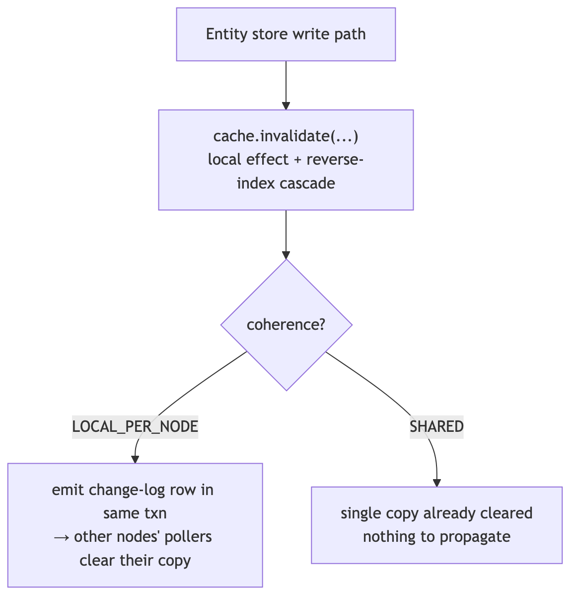
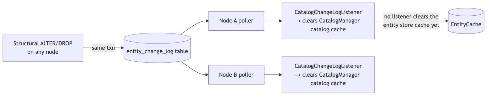
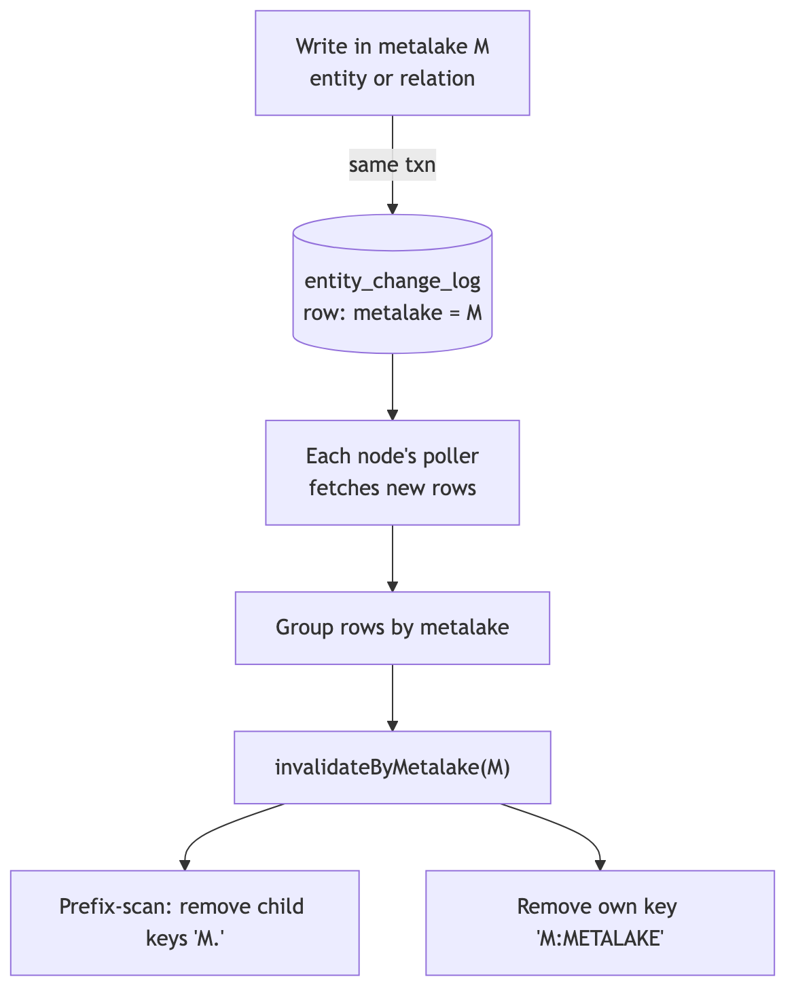
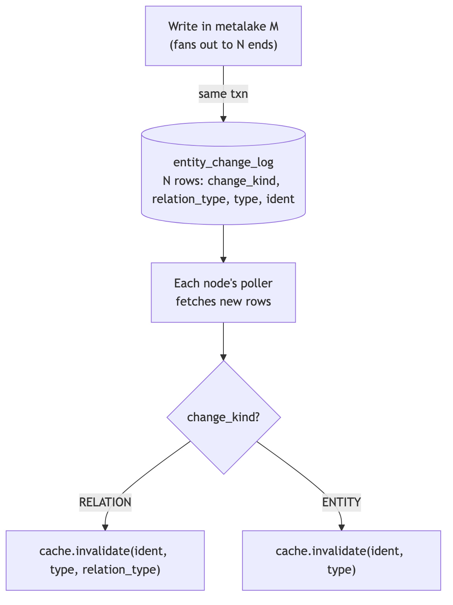
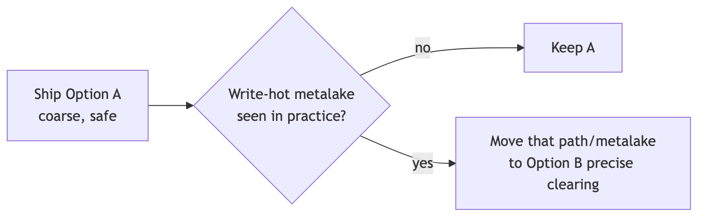
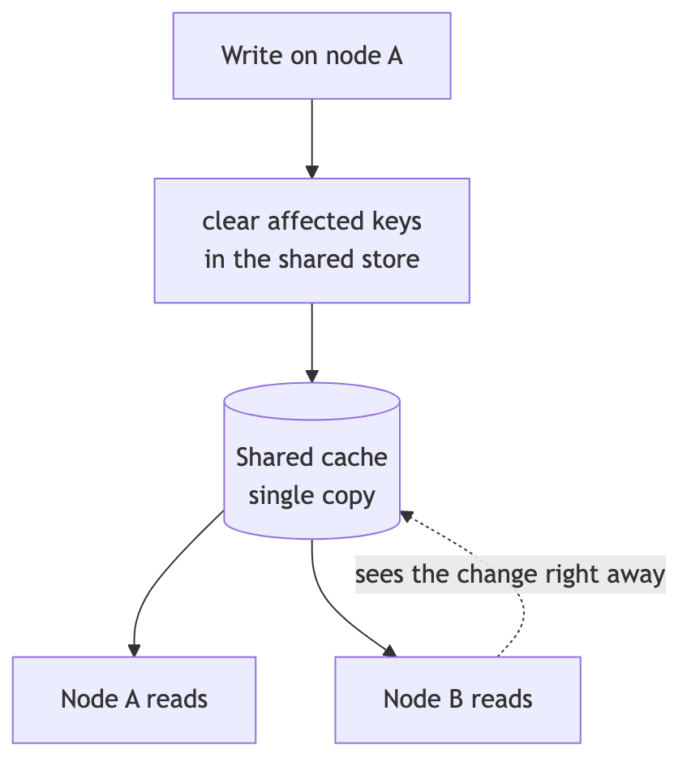

<!--
  Licensed to the Apache Software Foundation (ASF) under one
  or more contributor license agreements.  See the NOTICE file
  distributed with this work for additional information
  regarding copyright ownership.  The ASF licenses this file
  to you under the Apache License, Version 2.0 (the
  "License"); you may not use this file except in compliance
  with the License.  You may obtain a copy of the License at

   http://www.apache.org/licenses/LICENSE-2.0

  Unless required by applicable law or agreed to in writing,
  software distributed under the License is distributed on an
  "AS IS" BASIS, WITHOUT WARRANTIES OR CONDITIONS OF ANY
  KIND, either express or implied.  See the License for the
  specific language governing permissions and limitations
  under the License.
-->

---
title: "Multi-Node Support for the Entity Store Cache"
status: "Draft"
date: "2026-06-18"
---

## Background

Gravitino has two caches:

- The **jcasbin authorization cache** has already been reworked for multi-node. It works correctly when more than one server runs.
- The **entity store cache** has not. It only clears entries on the node that made a change, so a change on node A leaves node B serving old data.

Today the only safe way to run more than one node is to turn the entity store cache off (`gravitino.cache.enabled=false`). That hurts read-heavy catalogs, Iceberg most of all.

This document makes the entity store cache correct on multiple nodes. It first defines a small pluggable framework — one SPI, several implementations, each owning its own consistency story — and then gives the full design for the two implementations that framework ships with: a **local in-memory cache** (the default, no extra dependency) and an opt-in **shared cache** (Redis).

## Goals and Non-Goals

**Goals**

- Make the entity store cache correct when more than one node runs, so `gravitino.cache.enabled=true` becomes safe.
- Make the cache **pluggable**: one SPI, several implementations, chosen by config. Each implementation owns its own consistency story.
- Ship a **default with no extra dependency** (local in-memory cache). Let users who already run Redis switch to a **shared cache** with only a config change.
- After a write, every node drops the affected entries within a bounded delay, and the single-node behavior and the strong-consistency write path stay unchanged.

**Non-Goals**

- Replace the entity store or its write path (the optimistic version lock). The cache sits in front of the store and never becomes the source of truth.
- Add a built-in cluster membership / gossip layer. Coordination uses only what Gravitino already has (the DB) or an external cache the user opts into.

---

## Current Cache Implementation

`EntityCache` is already an SPI, chosen by `gravitino.cache.impl` and created by `CacheFactory`, which keeps a name → class table:

```java
public static final ImmutableMap<String, String> ENTITY_CACHES =
    ImmutableMap.of("caffeine", CaffeineEntityCache.class.getCanonicalName());
```

So the SPI is in place, but **there is only one implementation today: `CaffeineEntityCache`** (`caffeine`). It is an in-memory cache, **one copy per node**, holding two kinds of entries:

- **entity keys** `(ident, type)` → the entity itself;
- **relation keys** `(ident, type, relType)` → the list of related entities.

Relations are cached **in both directions**. The same `ROLE_USER_REL` lives under two keys:

```
(ROLE_USER_REL, role1, ROLE) → [userA, userB]
(ROLE_USER_REL, userA, USER) → [role1, role2]
```

To keep both directions in step, the cache holds a **reverse index**: when one side changes, it can find and clear the other side. On a write, the node clears the changed entity's key and then walks the reverse index to clear the related keys (a cascade). On a single node this is correct: right after any write, that node's cache matches the database.

### What Already Stays Correct Across Nodes

Some behavior is already safe with more than one node and does not change, because none of it depends on a cross-node clear:

| Already correct           | Why                                                                          |
| ------------------------- | ---------------------------------------------------------------------------- |
| Writes never lose updates | The write path reads the DB (not the cache) with an optimistic version check |
| `list(namespace)`         | Skips the cache, so it is never stale                                        |
| CREATE                    | Needs nothing: no negative caching, and `list` skips the cache               |

### Why It Breaks Across Nodes

The cascade runs **only on the node that made the change** (`RelationalEntityStore` calls `cache.invalidate(...)` directly on the write path). Nothing tells the other nodes to drop their copies. So after node A grants a role, node B keeps serving old data until its entry happens to expire. This is true for **every** cached entity — structural entities (metalake, catalog, schema, table, topic, model, fileset, view) included; the entity store cache has no cross-node invalidation at all today.

### Why Relations Are the Hardest Part

For an entity key the fix is easy: "table T changed" names exactly the key to drop, and any node can drop it. Relations are harder because of the **reverse key**.

Dropping `role1` must also clear the reverse keys under each user (`(ROLE_USER_REL, userA, USER)` …), but "role1 was dropped" does not say **who those users are**. The writing node finds them through its local reverse index. Another node may never have cached `role1`'s side, so its reverse index is empty and it cannot discover them. So any cross-node solution must carry enough information to clear **both directions**, not just the side that was named. This reverse key is the core difficulty, and the two implementations below differ mainly in how they handle it.

---

## The Pluggable Framework

The whole framework rests on one idea: **cross-node consistency is a property of the cache implementation, not something the upper layers manage.** The `EntityCache` SPI gains one capability:

```
EntityCache.coherence() → LOCAL_PER_NODE | SHARED
```

- `LOCAL_PER_NODE` — each node holds its own copy, so a write must be **propagated** to other nodes to clear their copies. `CaffeineEntityCache` is this kind.
- `SHARED` — one copy for the whole cluster, so a write clears it once and every node sees it. Nothing to propagate.

The write path stays the same for every implementation. It always asks the cache to clear what changed; only the **propagation** differs, decided by the capability:

<!-- diagram source: diagrams/write-path-coherence.mmd (regenerate with mermaid-cli) -->


The one change that makes this pluggable: the change-log emit, implicit today, becomes **conditional on `coherence()`**, and that is the single seam future implementations plug into. `CacheFactory.ENTITY_CACHES` is already a name → class table loaded by reflection, so a new implementation is one new table entry with no change to call sites.

## Approaches to Multi-Node Consistency

The two coherence modes are not arbitrary — they fall out of the standard ways to keep a cache correct across a cluster. The underlying problem is general: after a write on one node, no other node may serve stale data. There are a few well-known answers:

| Approach                   | How it works                                                                                        | Why it fits / doesn't                                                                                                                            |
| -------------------------- | --------------------------------------------------------------------------------------------------- | ------------------------------------------------------------------------------------------------------------------------------------------------ |
| TTL only                   | each entry expires after a fixed time                                                               | no extra work, but every node serves old data until the TTL passes — too stale for metadata that must read fresh right after a grant or DDL      |
| Pub/sub broadcast          | the writer publishes "invalidate X"; every node subscribes                                          | low delay, but needs a message bus (Redis pub/sub, Kafka) to run and must handle missed messages — extra infrastructure we don't want by default |
| Change-log table + poller  | the writer records the change in a DB table in the same transaction; each node polls and replays it | no new infrastructure (reuses the DB Gravitino already requires), survives restarts; costs up to one poll interval of delay                      |
| Shared (distributed) cache | one copy for the whole cluster, so there is nothing per-node to keep fresh                          | no propagation at all, but needs Redis/Memcached and a network hop per read                                                                      |

The first two don't stand on their own: **TTL** is too stale for metadata, and **pub/sub** adds a message bus to operate (kept as a future option — see the [roadmap](#roadmap)). That leaves **two practical approaches**, and they line up exactly with the two coherence modes:

| Practical approach                                        | Coherence mode   | Implementation       |
| --------------------------------------------------------- | ---------------- | -------------------- |
| Change-log table + poller — keep each per-node copy fresh | `LOCAL_PER_NODE` | `caffeine` (default) |
| Shared cache — remove per-node copies entirely            | `SHARED`         | `redis` (opt-in)     |

## Consistency Model

| Aspect                       | `LOCAL_PER_NODE` (default)     | `SHARED` (opt-in)                        |
| ---------------------------- | ------------------------------ | ---------------------------------------- |
| Copies                       | one per node                   | one cluster-wide                         |
| Cross-node propagation       | change-log + per-node poller   | none needed                              |
| Consistency                  | eventual (≤ one poll interval) | strong (read-your-writes, no divergence) |
| External dependency          | none                           | Redis                                    |
| Read latency                 | local memory (fastest)         | one network hop                          |
| Relation reverse-key problem | present (the hard part)        | gone (shared reverse index)              |

`SHARED` is strong because it makes the cluster behave like a single node: there is one copy, the write clears it right after the DB commit, and the existing optimistic entity version stops a stale re-populate.

The rest of this document is the detailed design for each mode — first the default local cache, then the shared cache.

---

# Implementation A — Local In-Memory Cache (`caffeine`, `LOCAL_PER_NODE`)

This implementation keeps the per-node Caffeine cache and adds the missing piece: a way for one node's write to reach the other nodes' caches. The transport is the **change-log table + poller** from the approaches above, which Gravitino **already runs**.

## The Change-Log Transport

The transport already exists — but it does **not** yet clear the entity store cache. What is in place:

- An `entity_change_log` table. Each row has `metalakeName`, `entityType`, `fullName`, `operateType`, `createdAt` (`EntityChangeRecord`).
- An `OperateType` enum with two values: `ALTER` and `DROP`.
- A per-node `EntityChangeLogPoller` that reads new rows and hands each batch to any **registered listener** (`EntityChangeLogListener`).
- The structural MetaServices (metalake, catalog, schema, table, topic, model, view, fileset) already write a row on ALTER/DROP — so the **writer side for structural entities is done**.
- One consumer is wired today: `CatalogChangeLogListener`, which clears `CatalogManager`'s **catalog cache** (the catalog instances/config cache) — a **different cache** from the entity store cache this design is about.

<!-- diagram source: diagrams/changelog-transport.mmd (regenerate with mermaid-cli) -->


So the table, the poller, and the structural emit already exist; this design adds a listener that clears the **entity store cache** from polled rows, plus the rows the cache needs that nobody emits yet.

## What the Change-Log Is Missing for the Cache

There is one **reader-side** gap and three **writer-side** gaps.

**Reader side (the fundamental one):**

| #   | Gap                                       | Detail                                                                                                                                                                                                                                                                                                  |
| --- | ----------------------------------------- | ------------------------------------------------------------------------------------------------------------------------------------------------------------------------------------------------------------------------------------------------------------------------------------------------------- |
| 0   | No listener clears the entity store cache | The poller dispatches rows, but the only registered consumer is `CatalogChangeLogListener` (catalog cache). Nothing turns a polled row into `EntityCache.invalidate(...)`. So today even a structural ALTER/DROP — which **does** emit a row — is never reflected in another node's entity store cache. |

**Writer side (what the rows must carry):**

| #   | Gap                                      | Detail                                                                                                                                                                         |
| --- | ---------------------------------------- | ------------------------------------------------------------------------------------------------------------------------------------------------------------------------------ |
| 1   | Relations write no row                   | grant, revoke, set owner, attach tag/policy record nothing                                                                                                                     |
| 2   | Auth/metadata entities write no row      | `user` / `group` / `role` / `tag` / `policy` write nothing for their own ALTER/DROP or relations — yet they **are** cached                                                     |
| 3   | The log can only describe ALTER and DROP | `OperateType` has only `ALTER` and `DROP`, and a row holds one entity (`fullName` + `entityType`); a relation is a **link between two** entities, which one row cannot express |

Gap 0 is shared by both options below: each adds an `EntityChangeLogListener` for the entity store cache that replays polled rows as cache invalidations (the structural rows that already exist start being honored the moment this listener is added). The options differ only in the writer-side gaps — **what** each row carries so the listener can clear both directions. To plan that we need to know **where** relation changes happen and **what** each one caches.

### Where Relation Changes Happen

Not all relation changes go through the relation API — this is the key thing an emit plan must not miss.

**Mechanism 1 — the link is a field on an entity, saved with `store.update` / `store.put`.** Granting a role rewrites a field and saves the entity; it never calls a relation method:

| Operation                          | Code path             | Field changed                 | Relation affected          |
| ---------------------------------- | --------------------- | ----------------------------- | -------------------------- |
| grant/revoke role to **user**      | `store.update(USER)`  | `UserEntity.roleNames`        | `ROLE_USER_REL`            |
| grant/revoke role to **group**     | `store.update(GROUP)` | `GroupEntity.roleNames`       | `ROLE_GROUP_REL`           |
| grant/revoke privilege to **role** | `store.update(ROLE)`  | `RoleEntity.securableObjects` | `METADATA_OBJECT_ROLE_REL` |
| create role                        | `store.put(ROLE)`     | `securableObjects`            | `METADATA_OBJECT_ROLE_REL` |

These land in `UserMetaService` / `GroupMetaService` / `RoleMetaService`, which emit **nothing** today.

**Mechanism 2 — the relation API** (`insertRelation` / `batchInsertRelations` / `updateEntityRelations` / `deleteRelation`):

| Operation          | Relation                     |
| ------------------ | ---------------------------- |
| set owner          | `OWNER_REL`                  |
| associate tags     | `TAG_METADATA_OBJECT_REL`    |
| associate policies | `POLICY_METADATA_OBJECT_REL` |
| future-grant apply | role/user/group relations    |

### What Each Relation Caches

Both directions are cached, so a change clears two keys, and the reverse key needs the **other side's name**:

| Relation                     | Key direction 1          | Key direction 2            | Names needed to clear both |
| ---------------------------- | ------------------------ | -------------------------- | -------------------------- |
| `ROLE_USER_REL`              | `(rel, user, USER)`      | `(rel, role, ROLE)`        | user + its roles           |
| `ROLE_GROUP_REL`             | `(rel, group, GROUP)`    | `(rel, role, ROLE)`        | group + its roles          |
| `METADATA_OBJECT_ROLE_REL`   | `(rel, object, objType)` | `(rel, role, ROLE)`        | object + role              |
| `OWNER_REL`                  | `(rel, object, objType)` | `(rel, owner, USER/GROUP)` | object + owner             |
| `TAG_METADATA_OBJECT_REL`    | `(rel, object, objType)` | `(rel, tag, TAG)`          | object + tag               |
| `POLICY_METADATA_OBJECT_REL` | `(rel, object, objType)` | `(rel, policy, POLICY)`    | object + policy            |

On a single node, `RelationalEntityStore` already clears both directions locally — the entity-update path walks the link fields and clears each other-side key, and the relation-API path clears both ends. The cross-node design must reproduce this same clearing on the other nodes. The two options below differ only in what the change-log row carries so the other node can do it.

## Option A: Clear the Whole Metalake

On any change in metalake M, write **one coarse row tagged with M**; every node clears all of M's cache entries and reloads them lazily. This is correct because a relation never crosses a metalake, so clearing M covers both directions — the reader never has to find the other side.

<!-- diagram source: diagrams/option-a-metalake.mmd (regenerate with mermaid-cli) -->


**Writer side.** Every row is the same — just the metalake; the reader ignores `entityType` / `fullName`. Sites that emit nothing today:

| Write                                                 | Lands in                               | Emit          |
| ----------------------------------------------------- | -------------------------------------- | ------------- |
| grant/revoke role to user/group                       | `UserMetaService` / `GroupMetaService` | 1 row (M)     |
| grant/revoke privilege to role, create role           | `RoleMetaService`                      | 1 row (M)     |
| user/group/role/tag/policy own ALTER/DROP             | their MetaService                      | 1 row (M)     |
| set owner / attach tag / attach policy / future-grant | relation API backend                   | 1 row (M)     |
| structural ALTER/DROP                                 | structural MetaServices                | already emits |

grant/revoke is neither ALTER nor DROP, so add one `OperateType` value (e.g. `RELATION_CHANGE`) to carry the metalake instead of reusing `ALTER`. **Writer difficulty: low–medium** — touch each site, one trivial emit, one new enum value, no schema change.

**Reader side.** One case — `invalidateByMetalake(M)`, two steps (keys use `.` between names and `:` before the type):

1. prefix-scan and remove child keys `"M."` — the trailing `.` keeps `prod` from matching `production`;
2. remove the metalake's own key `"M:METALAKE"`.

**Reader difficulty: low** — one method, one edge case (the prefix boundary).

**Reducing the reload spike.** One write clears M's whole working set, so reads reload from the DB. It is limited to one metalake, but a **write-hot metalake** plus **all nodes polling on the same beat** can cause a burst of reloads at once. Ways to soften it, best first (combine the first two):

| Technique          | Idea                                                                                                                                    | Effect                             | Note                                |
| ------------------ | --------------------------------------------------------------------------------------------------------------------------------------- | ---------------------------------- | ----------------------------------- |
| Generation counter | bump a per-metalake counter instead of evicting; an entry stamped older than the counter is a miss on next `get` and reloads on its own | removes the burst entirely         | +1 `long`/entry; **recommended**    |
| Poll jitter        | randomize each node's poll offset                                                                                                       | spreads out the cluster-wide spike | cheap, independent; **recommended** |
| Refresh-ahead      | serve the old value while one async load refreshes (`refreshAfterWrite`)                                                                | lowers latency spike               | widens stale window; fallback only  |

## Option B: Clear Only the Affected Keys

Record the exact keys each write touched and let the other node replay them — no reload spike, but the log must carry the other-side names. The writing node already knows them (`insertRelation` has both ends; `updateEntityRelations` has src + every dst; the entity-update path has the `roleNames` / `securableObjects` lists), so the other node looks nothing up.

<!-- diagram source: diagrams/option-b-keys.mmd (regenerate with mermaid-cli) -->


**Schema change:** add `change_kind` (`ENTITY` / `RELATION`) and `relation_type` (nullable, set only on `RELATION` rows).

**Writer side.** Each affected end is one row. Example — grant role1 to userA, userB → 3 rows: `(RELATION, ROLE_USER_REL, ROLE, role1)`, `(RELATION, ROLE_USER_REL, USER, userA)`, `(RELATION, ROLE_USER_REL, USER, userB)`.

| Channel                 | Site                                         | Rows to emit                                     | Ends come from                                        |
| ----------------------- | -------------------------------------------- | ------------------------------------------------ | ----------------------------------------------------- |
| 1 — relation API        | `insertRelation` / `updateEntityRelations` … | one `(RELATION, relType, type, ident)` per end   | method arguments — easy                               |
| 2 — entity-update links | user/group/role `update` / `put`             | the entity + one per other side in the link list | `roleNames` / `securableObjects` — easy to miss       |
| 3 — entity DROP cascade | delete in any MetaService                    | one per opposite end of each cascaded relation   | **`SELECT` before the soft-delete** — the costly part |
| own ALTER/DROP          | auth/metadata MetaServices                   | `(ENTITY, ALTER\|DROP, type, ident)`             | the entity itself                                     |

Channel 3 cascade map (which relations cascade, and the opposite ends to SELECT):

| Deleted entity                           | Cascaded relations                                                                                  | Opposite ends to emit                         |
| ---------------------------------------- | --------------------------------------------------------------------------------------------------- | --------------------------------------------- |
| role                                     | `ROLE_USER_REL` / `ROLE_GROUP_REL` / `METADATA_OBJECT_ROLE_REL`                                     | associated users / groups / securable objects |
| user                                     | `ROLE_USER_REL` / `OWNER_REL`                                                                       | associated roles; owned objects               |
| group                                    | `ROLE_GROUP_REL` / `OWNER_REL`                                                                      | associated roles; owned objects               |
| catalog/schema/table/topic/model/fileset | `METADATA_OBJECT_ROLE_REL` / `OWNER_REL` / `POLICY_METADATA_OBJECT_REL` / `TAG_METADATA_OBJECT_REL` | associated roles / owner / policies / tags    |
| metalake                                 | all of the above                                                                                    | same (cascaded at the metalake level)         |

**Writer difficulty: high** — schema change, one row per end on each batch write, and Channels 2 + 3 spread across every MetaService/manager that touches a link. Miss one other-side row and that key stays stale on other nodes until its TTL expires.

**Reader side.** Plain replay, one row → one call: `RELATION` rows call `cache.invalidate(ident, type, relation_type)`, `ENTITY` rows call `cache.invalidate(ident, type)`. Both directions are covered because each is its own row. **Reader difficulty: medium** — more cases than A (every relation, both directions, plus entity DDL), but no graph walk and no metalake-wide clear.

## Comparison and Conclusion

|                   | A: Clear the metalake                 | B: Clear affected keys                          |
| ----------------- | ------------------------------------- | ----------------------------------------------- |
| Change-log writes | 1 coarse metalake row per write site  | entity + every other-side end; N rows           |
| Schema change     | none (one new operate type)           | two new columns                                 |
| Emit sites        | both mechanisms + auth/tag/policy DDL | both mechanisms + auth/tag/policy DDL           |
| Hardest emit work | none beyond tagging the metalake      | Channel 2 link lists + Channel 3 cascade SELECT |
| Cases to clear    | one: `invalidateByMetalake`           | every relation (both directions) + entity DDL   |
| Reader difficulty | low                                   | medium                                          |
| Writer difficulty | low–medium                            | high                                            |
| Reload spike      | one metalake; softened                | none                                            |
| Main risk         | write-hot metalake                    | a missed other-side row leaves stale cache      |

Both options pay the same cost for finding and touching the write sites, and both need the new "link" notion. The real trade-off: **A** trades extra DB reloads for a design that is **very hard to get wrong**; **B** trades a much larger, error-prone emit surface for **no reload spike**.

**Conclusion: ship A first.** It is the smaller, safer change and unblocks multi-node with `cache.enabled=true` quickly.

### Evolution Plan

<!-- diagram source: diagrams/evolution-plan.mmd (regenerate with mermaid-cli) -->


A and B share the same consistency model and the same emit sites, so B can replace A **one step at a time** — one relation channel or one metalake at a time, with no rewrite.

### Notes

1. **The change-log write shares the backend write's transaction** (as the structural entities already do), or a concurrent failure could drop a signal or an end.
2. **Replaying your own row is harmless** — the writing node already cleared its cache; its poller later replays the same row, and clearing an already-clear entry does nothing (same as jcasbin).

---

# Implementation B — Shared Cache (`redis`, `SHARED`)

The local cache keeps a per-node copy and pays to propagate every change, with the relation reverse key as the hard case. The shared cache makes the opposite choice.

## Why a Shared Cache

The root cause of all the propagation work is that **each node has its own copy**. If there were only one copy, there would be nothing to send and no reverse key to chase on a remote node. That is what a shared cache gives:

<!-- diagram source: diagrams/shared-cache-single-copy.mmd (regenerate with mermaid-cli) -->


The writing node computes the affected keys (the same cascade the local cache already does) and clears them in the shared store. Every node reads that same store, so no change-log and no poller are needed, and the reverse-key problem is gone because the reverse index is shared too.

A **near-cache** (small L1 local cache in front of the shared L2) would cut the network hop, but its L1 brings back exactly the per-node invalidation problem this design avoids, so it is left as a future step (see the [roadmap](#roadmap)). This design targets the plain shared cache — the simplest design that gives strong consistency and reuses infrastructure many users already run.

This implementation declares `coherence() = SHARED`, and targets **Redis** (Memcached cannot support the indexes this cache needs — see [Why Redis First](#why-redis-first-not-memcached)).

## What Caffeine Relies On Today

The goal is to behave exactly like `CaffeineEntityCache`. So we must look at what that class actually relies on, because most of it is **not** a plain key → value map and does not map to Redis for free. It keeps three in-process structures:

| #   | Structure                            | Type today                                    | What it is for                                                                                                                              |
| --- | ------------------------------------ | --------------------------------------------- | ------------------------------------------------------------------------------------------------------------------------------------------- |
| 1   | `cacheData`                          | `Cache<EntityCacheRelationKey, List<Entity>>` | The values. One entry per entity key or relation key. Even a single entity is stored as a one-element list.                                 |
| 2   | `cacheIndex`                         | `RadixTree<EntityCacheRelationKey>`           | A **forward prefix index**. Lets the cascade find every child key by prefix: `getValuesForKeysStartingWith(identifier)`.                    |
| 3   | `reverseIndex` (`ReverseIndexCache`) | a `RadixTree` + a `Map`                       | Two maps: `entityKey → [relation keys that point to it]` and `relationKey → [entity keys it points to]` (for cleanup). Also prefix-scanned. |

The key string format matters, because the prefix scans depend on it (`EntityCacheKey.toString()` / `EntityCacheRelationKey.toString()`):

```
entity key   :  <metalake>.<catalog>.<schema>.<name>:<TYPE>
                e.g.  ml1.cat1.sch1.tbl1:TABLE
relation key :  <identifier>:<TYPE>:<RELTYPE>
                e.g.  ml1.system.role.role1:ROLE:ROLE_USER_REL
```

The cascade (`invalidateEntities`) is a BFS that, for each key it removes, runs **two prefix scans** — `cacheIndex.getValuesForKeysStartingWith(ident)` for hierarchical children and `reverseIndex.getValuesForKeysStartingWith(ident)` for the reverse direction — then enqueues what they return. So the real work of the shared cache is reproducing **prefix scan** and the **reverse index** on Redis. A plain `GET`/`SET`/`DEL` store is not enough.

## Mapping Each Structure to Redis

All keys live under one namespace prefix (`gv:ec:`); below it is dropped for readability.

| Caffeine structure                               | Redis representation                                                  | Type   |
| ------------------------------------------------ | --------------------------------------------------------------------- | ------ |
| `cacheData[key] = List<Entity>`                  | `D:{key}` → serialized list                                           | String |
| `cacheIndex` (forward prefix index)              | `IDX` → all data-key strings, every score `0`                         | ZSet   |
| `reverseIndex[entityKey] = [relKeys]`            | `R:{entityKey}` → set of relation-key strings                         | Set    |
| `reverseIndex` keys (for prefix scan)            | `RIDX` → all `entityKey` strings that have a reverse entry, score `0` | ZSet   |
| `entityToReverseIndexMap[relKey] = [entityKeys]` | `RO:{relKey}` → set of entity-key strings this relation key points to | Set    |

`D:` replaces structure 1. `IDX`/`RIDX` replace the two radix trees' prefix-scan ability. `R:`/`RO:` replace the reverse index's two maps (the second one, `RO:`, exists only so a removed relation key can find and clean the `R:` sets that reference it — exactly what `ReverseIndexCache.remove` does in memory).

## Prefix-Index Lookup (the Hard Part)

Caffeine uses a radix tree so that `getValuesForKeysStartingWith("ml1.cat1")` returns every key under that prefix in one call. Redis has no radix tree, and `KEYS`/`SCAN` with a glob is an O(N) full scan — not usable on the read/write path. The standard Redis replacement is a **lexicographically sorted set + a range query**:

1. Keep every key string as a member of a ZSet with the **same score** (`0`). With equal scores, a ZSet is ordered purely by member string.
2. A prefix scan becomes one `ZRANGEBYLEX`:

```
ZRANGEBYLEX IDX "[ml1.cat1" "(ml1.cat1\xff"
```

This returns exactly the members in `[ "ml1.cat1" , "ml1.cat1\xff" )`, i.e. every key string that starts with `ml1.cat1`, in `O(log N + M)` (M = matches) instead of `O(N)`. The reverse index is scanned the same way against `RIDX`.

This reproduces the radix-tree semantics **including its existing rough edge**: a prefix of `ml1.cat1` also matches `ml1.cat11...`, because both the radix tree and `ZRANGEBYLEX` match on raw string prefix. The `:` before the type and the `.` between names are the only boundaries — the same boundary nuance as the local cache's Option A prefix scan, so behavior is identical and parity holds.

## Operation Walk-Through

Concrete command sequences for each `EntityCache` method:

**`getIfPresent(ident, type[, relType])`** — `GET D:{key}`; deserialize; on miss return empty and let the caller load from the DB and `put`.

**`put(entity)`** — mirror `syncEntitiesToCache` + `invalidateOnKeyChange`:

```
SET   D:{key} <serialized [entity]>
ZADD  IDX 0 {key}
# reverse index: apply the same ReverseIndexRules, for each referenced entity E:
SADD  R:{E} {key}      ;  ZADD RIDX 0 {E}      ;  SADD RO:{key} {E}
```

**`put(ident, type, relType, entities)`** — relation lists **merge** with what is already cached (Caffeine does a `LinkedHashSet` union). On Redis this is a read-modify-write, so it must be atomic. Do it in a Lua script: `GET D:{key}` → union → `SET`, plus the same `ZADD`/`SADD` reverse-index updates, all in one script so two nodes merging the same relation key cannot lose entries.

**`invalidate(ident, type)` / `invalidate(..., relType)`** — the BFS cascade, run as **one Lua script** so the whole cascade is atomic (see next section). Per dequeued key `k`:

```
DEL        D:{k}
ZREM       IDX {k}
ZRANGEBYLEX IDX  "[{ident_k}" "({ident_k}\xff"   → enqueue children
ZRANGEBYLEX RIDX "[{ident_k}" "({ident_k}\xff"   → for each entityKey, SMEMBERS R:{entityKey} → enqueue, then clean R:/RIDX
# clean this key's own reverse bookkeeping (mirrors ReverseIndexCache.remove):
SMEMBERS   RO:{k} → for each E: SREM R:{E} {k}; if R:{E} empty → DEL R:{E}, ZREM RIDX {E}
DEL        RO:{k}
SREM/DEL   R:{k} ; ZREM RIDX {k}
```

**`contains`** → `EXISTS D:{key}`. **`size`** → `ZCARD IDX`. **`clear`** → delete all keys under the `gv:ec:` namespace (a one-off `SCAN` + `UNLINK`, or a dedicated logical DB so `FLUSHDB` is safe).

## Concurrency and the Stale-Populate Guard

Caffeine uses an in-process `SegmentedLock` (striped per-key locks, plus a global lock for `clear`). On a shared store that lock no longer protects other nodes, so correctness must come from Redis itself:

- **Cascade atomicity** — running the cascade as a single **Lua script** makes it atomic on the Redis server: no other command interleaves, so a concurrent reader never sees the index and the data half-updated. This removes the need for a distributed lock around `invalidate`.
- **Single-flight on miss** — `withCacheLock` today stops a node from loading the same key many times at once. A **per-node** lock still does that for each node; a small cross-node stampede on a cold key is acceptable. An optional `SET NX PX` lease can make it cluster-wide if needed.
- **The delete-then-stale-populate race** — the dangerous case: reader loads `v1` from the DB; a writer commits `v2` and `DEL`s the key; the slow reader then `SET`s `v1` back. The DB read alone cannot catch this. Two guards, both on the populate path:
  - **Version check**: the value carries the entity version; populate is a Lua `SET` that only writes when no value exists *and* the loaded version is the one the loader observed. Combined with the writer's `DEL`-after-commit, a populate that lost the race is dropped.
  - **Lease token** (optional, stronger): on miss the reader `SET NX`s a short-TTL lease; the writer's `invalidate` also deletes the lease; the populate only writes if its lease is still alive. This closes the window the version check leaves open under clock/version edge cases.

## Where the Shared Cascade Logic Lives

The BFS itself is identical to Caffeine's; only the per-step operations differ (Redis commands vs. in-process map calls). So the BFS shape and the relation model it walks (the two write mechanisms, the bidirectional keys, the cascade map — see [What Each Relation Caches](#what-each-relation-caches) above) can stay in shared code, with a small storage interface (`getByPrefix`, `delete`, `addToIndex`, …) implemented once for Caffeine and once for Redis.

## Why Redis First, Not Memcached

The prefix index and reverse index above need **sorted-set range queries** (`ZRANGEBYLEX`) and **server-side atomic scripts** (Lua). Memcached has neither — it is a flat key → value store with no ordered structure and no scripting. So the cascade and prefix scan cannot be built on Memcached without rebuilding an index layer on top of it. This design therefore targets **Redis**; Memcached is left out of scope until there is a concrete need, and if added it would likely be a value-only store with no relation invalidation.

## Consistency

Strong, in the sense the cache can actually provide: **read-your-writes across the cluster, with no two nodes disagreeing.**

- One copy means two nodes can never hold different values.
- The write clears the shared keys **right after** the DB commit (never before), so a concurrent reader cannot put stale data back into a just-cleared slot.
- A slow reader that loaded an old value and tries to populate after a concurrent write is rejected by the version check / lease above.

The cache never becomes the source of truth; the entity store and its version lock stay authoritative.

## Configuration

```properties
gravitino.cache.enabled = true
gravitino.cache.impl    = redis        # Redis only for now (see "Why Redis First")

# shared-cache sub-keys (apply only when impl = redis)
gravitino.cache.redis.address     = redis://host:6379
gravitino.cache.redis.namespace   = gv:ec       # key prefix / logical DB for clear()
gravitino.cache.redis.ttl         = ...         # safety bound, not the consistency mechanism
gravitino.cache.redis.serializer  = ...         # e.g. JSON or a binary codec
```

`CacheFactory.ENTITY_CACHES` gains one entry, e.g. `"redis" -> RedisEntityCache.class`; call sites are unchanged.

**Trade-off vs. the local cache:** the local cache wins on read latency and needs no extra service, but pays for cross-node propagation and the reverse-key problem. The shared cache removes both at the cost of a Redis dependency and a network hop per read (and the operator owns Redis HA). They are interchangeable through the SPI, so users pick by their environment.

---

## Roadmap

<!-- diagram source: diagrams/roadmap.mmd (regenerate with mermaid-cli) -->


| Phase | Deliverable                                                                    | Why                                    |
| ----- | ------------------------------------------------------------------------------ | -------------------------------------- |
| 1     | `coherence()` capability + gated change-log emit + `caffeine` LOCAL (Option A) | multi-node works, no extra dependency  |
| 2     | refine `caffeine` invalidation to Option B where needed                        | performance for write-hot metalakes    |
| 3     | `redis` SHARED implementation                                                  | strong consistency, reuse user's Redis |
| 4     | push propagation (pub/sub) or near-cache L1+L2                                 | lower invalidation latency             |

Phase 1 is the framework: once the coherence gate exists, the local cache's invalidation choices are an implementation detail, and the shared cache drops in beside it without touching the write path.

## Test Plan

| Area                  | Check                                                                                                                                                                                                     |
| --------------------- | --------------------------------------------------------------------------------------------------------------------------------------------------------------------------------------------------------- |
| Local — Option A      | a row for M clears every `M.` key plus `M:METALAKE`, and leaves a sibling like `prod` / `production` untouched                                                                                            |
| Local — Option B      | each channel and cascade lists the right other-side rows; replay clears exactly those keys, both directions                                                                                               |
| Shared — prefix index | `ZRANGEBYLEX IDX` returns exactly the keys under a prefix, and matches the radix tree's results (including the `ml1.cat1` / `ml1.cat11` boundary) for the same data                                       |
| Shared — cascade      | the Lua cascade clears the right entity, relation (both directions), `IDX`, `RIDX`, `R:`, and `RO:` entries; no orphan reverse entries; a reader mid-cascade never sees data present but its index gone   |
| Shared — merge        | two nodes `put` the same relation key concurrently; the merged list keeps both sides' entities                                                                                                            |
| Shared — consistency  | the delete-then-populate race: a stale `v1` populate after a committed `v2` + `DEL` is rejected by the version check / lease; no node serves a value older than the last commit                           |
| Multi-node e2e        | node A runs grant/revoke/drop role, role to user/group, setOwner, attach tag/policy; node B sees fresh `listEntitiesByRelation` (both directions) within one poll interval (LOCAL) or right away (SHARED) |
| Regression / parity   | entity-key behavior, the write path, and `list` strong consistency are unchanged; the same invalidation cases behave the same through both implementations                                                |
