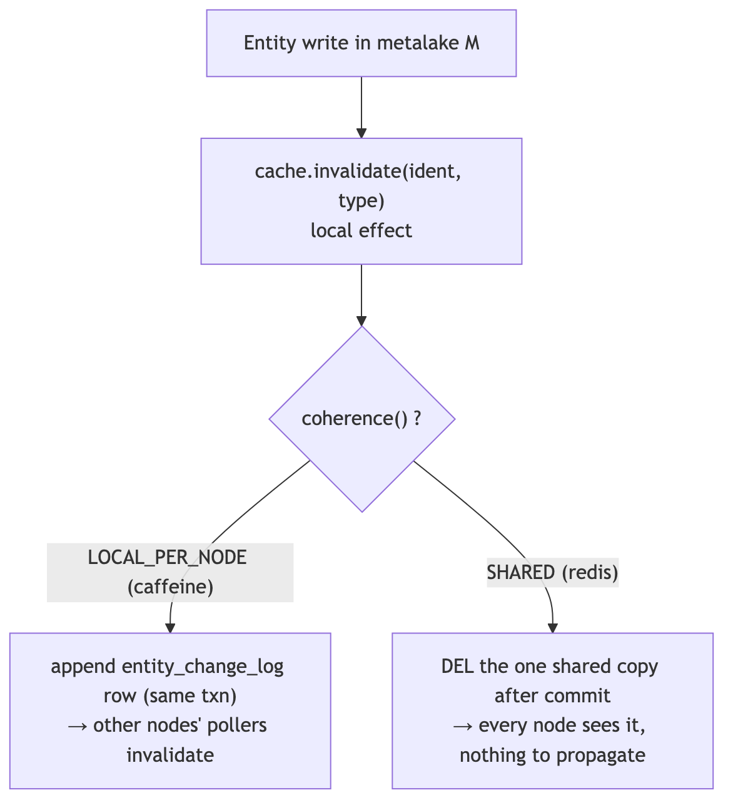
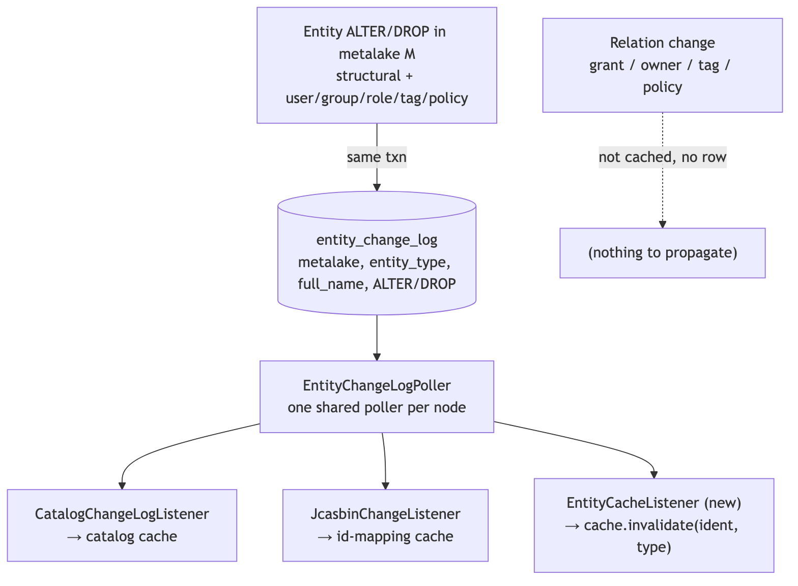
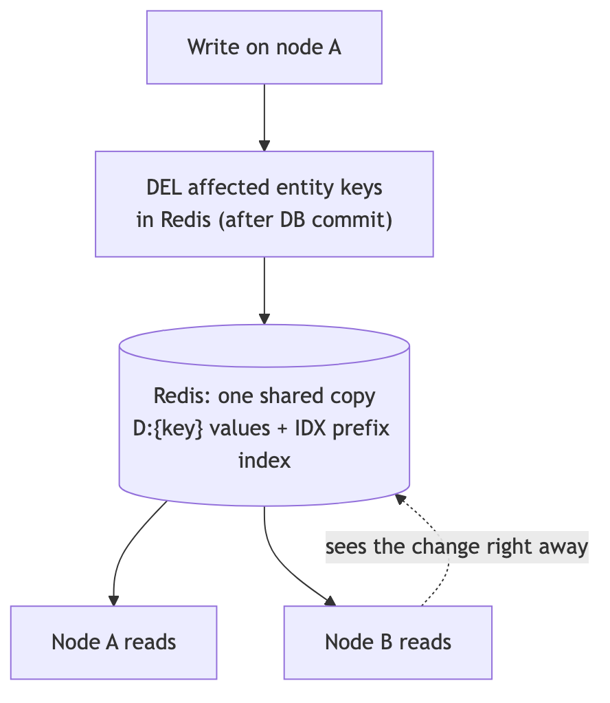
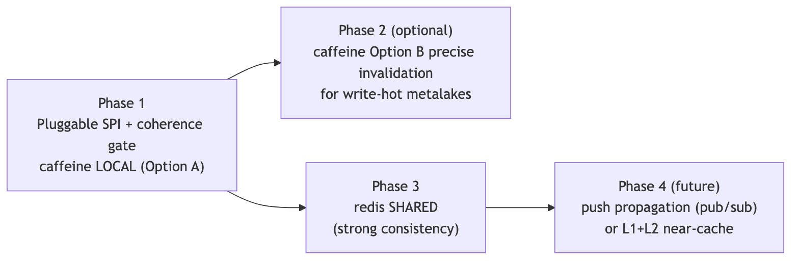

<!--
  Licensed to the Apache Software Foundation (ASF) under one
  or more contributor license agreements.  See the NOTICE file
  distributed with this work for additional information
  regarding copyright ownership.  The ASF licenses this file
  to you under the Apache License, Version 2.0 (the
  "License"); you may not use this file except in compliance
  with the License.  You may obtain a copy of the License at

   http://www.apache.org/licenses/LICENSE-2.0

  Unless required by applicable law or agreed to in writing,
  software distributed under the License is distributed on an
  "AS IS" BASIS, WITHOUT WARRANTIES OR CONDITIONS OF ANY
  KIND, either express or implied.  See the License for the
  specific language governing permissions and limitations
  under the License.
-->

---
title: "Multi-Node Support for the Entity Store Cache"
status: "Draft"
date: "2026-07-07"
---

## Background

Gravitino has two caches:

- The **jcasbin authorization cache** already works with more than one node.
- The **entity store cache** does not. When a change happens on node A, only node A clears its cache. Node B keeps serving the old data until its entry expires.

Because of this, the only safe way to run more than one node today is to turn the entity store cache off (`gravitino.cache.enabled=false`). That is bad for read-heavy catalogs, especially Iceberg.

This document proposes a design to make the entity store cache correct when running more than one node. It is a design proposal; no behavior has changed yet.

## Goals and Non-Goals

**Goals**

- Make the entity store cache correct with more than one node, so `gravitino.cache.enabled=true` is safe.
- Keep the cache **pluggable**: one SPI, chosen by `gravitino.cache.impl`. Ship `caffeine` as the default (no extra dependency) and `redis` as an option the user turns on by config. The current caffeine implementation is rather complex for any users to make any an new implementation, so we need to simplify it. 
- Keep single-node behavior and the write path (the optimistic version lock) unchanged.

**Non-Goals**

- Replace the entity store or its write path. The cache sits in front of the store and is never the source of truth.
- Add a cluster membership / gossip layer or any other complex distributed system. We only use the DB Gravitino already needs, or the external cache the user turns on.

---

## Current Cache Implementation

`EntityCache` is already an SPI, chosen by `gravitino.cache.impl` and created by `CacheFactory`. There is one implementation today, `CaffeineEntityCache` (`caffeine`): an in-memory cache, **one copy per node**, with two kinds of entries:

- **entity keys** `(ident, type)` → the entity itself;
- **relation keys** `(ident, type, relType)` → the list of related entities, stored **in both directions** and kept in step by an in-process **reverse index** (`ReverseIndexCache`).

On a write, the node clears the changed key and then uses the reverse index to clear the related keys. On a single node this is correct. The problem is that this clearing happens **only on the node that made the change** (`RelationalEntityStore` calls `cache.invalidate(...)` locally). Nothing tells the other nodes, so they serve old data until their entries expire.

Some behavior is already safe with more than one node and does not change:

| Already correct           | Why                                                                          |
| ------------------------- | ---------------------------------------------------------------------------- |
| Writes never lose updates | The write path reads the DB (not the cache) with an optimistic version check |
| `list(namespace)`         | Skips the cache, so it is never stale                                        |
| CREATE                    | Needs nothing: no negative caching, and `list` skips the cache               |

The rest of the problem splits in two:

- **entity keys** are one-to-one. "table T changed" names exactly the key to drop, and any node can drop it. This is easy.
- **relation keys** have a reverse key. Dropping one side (say a role) also means dropping the other side's key (each user that had the role), but "the role changed" does not say *which* users those are. The writing node knows them from its local reverse index; a remote node may not.

That reverse key is the hard part. So the first question is whether the cache needs relations at all.

---

## Do We Need to Cache Relations?

All the cross-node difficulty comes from relation caching (the reverse key and the write fan-out). Before building around it, we checked whether it is actually important for performance. It is not.

**Who reads the relation cache.** The cached relation path is `RelationalEntityStore.listEntitiesByRelation`, which runs **one indexed SQL join** per call (`JDBCBackend.listEntitiesByRelation`). Its callers are all metadata governance managers:

| Caller               | Relation                     | API that uses it                  |
| -------------------- | ---------------------------- |-----------------------------------|
| `OwnerManager`       | `OWNER_REL`                  | `GET .../owner`                   |
| `RoleManager`        | role relations               | role / authorization management   |
| `FutureGrantManager` | role/user/group relations    | applying future grants (admin op) |
| `TagManager`         | `TAG_METADATA_OBJECT_REL`    | tag endpoints                     |
| `PolicyManager`      | `POLICY_METADATA_OBJECT_REL` | policy endpoints                  |

**Who does not.** The two paths that must be fast do **not** use it:

- **Core metadata reads** (`get` / `list` of table, schema, catalog, …) never call `listEntitiesByRelation`. Removing the relation cache does not affect them at all.
- **Authorization checks** (`JcasbinAuthorizer`) read roles straight from mappers (`RoleMetaMapper.listRolesByUserId` / `listRolesByGroupId`), owner from its own `ownerRelCache` (which polls `owner_meta`), and id from its own `metadataIdCache`. It does not use the entity store relation cache at all. Relation caching was first added with authorization in mind, but authorization no longer uses it.

**Cost of removing it.** Each call becomes one indexed query — not an N+1 (one query per item). No list endpoint loads relations per item in a loop. The one place a single request makes several queries is **tag / policy inheritance**: listing an object's tags also reads its parents (the object plus up to ~3 ancestors), so a tag lookup is up to ~4 single-row queries; the cache mainly saves re-reading popular parents. This is the only workload where removing the cache adds real DB load, and it can be measured today — those calls are already `@Monitored` (`baseMetricName = "listTagsForMetadataObject"`, `"getOwner"`, `"listPoliciesForMetadataObject"`).

**Decision.** Remove relation caching from the entity store cache. Relation reads go straight to the DB (one indexed query each), the same as authorization already does. This is safe for the core read path and for authorization; the only risk is workloads with heavy tag/policy inheritance reads, which we can watch with the existing metrics and, if ever needed, address by adding precise relation caching back later.

The result: the cache holds only **entity keys**, so cross-node invalidation becomes the easy one-to-one case, and (as both implementations show) each design loses its hardest part. The `ReverseIndexCache` and the two-direction relation keys are removed with it.

But "cache only entity keys" is not the end of it: some entities **copy fields from other entities**, which would bring the reverse-lookup problem back. The next section works out which entities are actually safe to cache.

---

## Which Entities to Cache

Dropping relations leaves the entity keys. But not every entity key is truly one-to-one. Some entities store fields **copied from other entities**, and those copies go stale when the other entity changes — which brings back the same reverse lookup we just removed. So we look at what each cached entity actually holds.

**Self-contained vs. derived.**

| Entity                                                 | Copies a field from another entity?                                                                                                                | Safe to cache on its own?                                            |
| ------------------------------------------------------ | -------------------------------------------------------------------------------------------------------------------------------------------------- | -------------------------------------------------------------------- |
| metalake, catalog, schema, table, topic, view, fileset | no — holds only its own data (columns, properties, comment…)                                                                                       | yes                                                                  |
| model, model version, function                         | no — but each holds a load-bearing pointer (the model version URI / latest version, or the function implementation) that goes stale on other nodes | no — left out for cross-node safety, see [Consistency](#consistency) |
| tag, policy                                            | no — associations are relations, not stored on the entity                                                                                          | yes                                                                  |
| user, group                                            | yes — `roleNames` / `roleIds`, built from the user's roles                                                                                         | no                                                                   |
| role                                                   | yes — `securableObjects`, built from metadata objects                                                                                              | no                                                                   |

**Why user / group / role are a problem.**

- `getUserByIdentifier` builds `roleNames` at read time by joining the user's roles (`UserMetaService` calls `RoleMetaService.listRolesByUserId`). If a role is dropped, it disappears from every user's list, but the user rows are not touched — so a cached user still lists the dropped role. Finding which users hold a role is a reverse lookup (role → users), exactly what dropping relations was meant to avoid.
- `RoleEntity.securableObjects` has the same shape one level up: if a metadata object is renamed or dropped, a cached role that points at it is stale, and finding which roles point at an object is again a reverse lookup (object → roles).

**Does authorization need these in the cache?** This is the key question, because authorization is the hot path. We checked `JcasbinAuthorizer`:

- **user / group — no.** It reads user and group data through its own mappers (`UserMetaMapper`, `GroupMetaMapper`) into its own caches (`userRoleCache`, `groupRoleCache`), never through the entity store cache. So excluding user/group from the entity store cache does not affect authorization at all.
- **role — only at cold start or after a change.** It does read role entities through the entity store (`entityStore.batchGet/get(ROLE)`), but only to (re)load a role's policies into the enforcer. Loaded roles are held in `loadedRoles`, a cache with `expireAfterAccess` (default 1 hour), so a role used at least once an hour never expires and the entity read is skipped. The entity read happens only on cold start, right after a role is edited, or after a role sits unused for over an hour — each a cheap one-time `batchGet`, not a per-request cost.

So caching user, group, and role buys almost nothing (authorization does not depend on it) and costs a lot (the reverse-lookup problem comes back). tag and policy are safe to cache, but they are low-volume governance objects, not the read-heavy metadata the cache exists for.

**Conclusion: cache only the basic metadata objects** — metalake, catalog, schema, table, topic, view, fileset. In code this is a small allowlist of entity types in the cache. Model, model version, and function are left out on purpose: they are read rarely, and each one holds a load-bearing pointer (the model version URI or latest version, or the function implementation) that would return a wrong answer on another node if it went stale — the per-alter check under [Consistency](#consistency) explains why. Every cached entity is then self-contained and one-to-one, so cross-node invalidation stays precise with no reverse lookups. As a bonus, these entities already write ALTER/DROP rows to `entity_change_log`, so the writer side needs no change at all.

The cache now holds only self-contained metadata objects. The next question is how to tell the other nodes to drop a key when it changes.

---

## Approaches to Multi-Node Consistency

Keeping a per-node cache fresh across a cluster is a common problem: after a write on one node, no other node may serve stale data. The standard techniques:

| Approach                   | How it works                                                                                | Trade-off                                                                          |
| -------------------------- | ------------------------------------------------------------------------------------------- |------------------------------------------------------------------------------------|
| TTL only                   | each entry expires after a fixed time                                                       | no work, but every node serves old data until the TTL passes                       |
| Pub/sub broadcast          | the writer sends "invalidate X"; every node subscribes                                      | low delay, but needs a message bus and must handle missed messages                 |
| Change-log table + poller  | the writer records the change in a DB table in the same transaction; each node polls it     | no new infrastructure (reuses the DB), survives restarts; up to one poll of delay  |
| Shared (distributed) cache | one copy for the whole cluster, so there is nothing per-node to keep fresh                  | no propagation at all, but needs Redis/Memcached and a network round-trip per read |

### How other metadata systems solve it

We looked at how similar systems keep **their own per-node cache** coherent across a cluster (not how they notify downstream/derived systems — that is a different problem). **The most common answer is a per-node cache kept fresh by polling or by an invalidation/broadcast signal; no one relies on plain TTL.** Each row below has a source:

| System                             | How it keeps its per-node cache fresh across nodes                                                                                                                                                                                                                       | Technique                  |
| ---------------------------------- |--------------------------------------------------------------------------------------------------------------------------------------------------------------------------------------------------------------------------------------------------------------------------|----------------------------|
| **Hive Metastore** (`CachedStore`) | each node's in-memory cache is updated by a background thread that **polls the `NOTIFICATION_LOG` table** (written by `DbNotificationListener`); the log is in commit order and is the source of truth, and reads fall back to the DB until the thread catches up [1][2] | change-log + poll          |
| **Apache Ranger** (plugins)        | each plugin keeps a **local policy cache** and **periodically polls Ranger Admin** for a newer version (default every 30s, `policy.pollIntervalMs`), downloading only the delta when the version changes [3]                                                             | periodic poll              |
| **Confluent Schema Registry**      | one compacted Kafka topic **`_schemas`** is the commit log and the source of truth; every node reads it in a background thread to build its **local materialized view** [4]                                                                                              | shared log                 |
| **Apache Impala** (`catalogd`)     | metadata changes are **broadcast to all coordinators through `statestored`**; in local-catalog mode coordinators instead **fetch on demand and cache locally**, and invalidate that cache on `catalogd` failover [5]                                                     | broadcast / on-demand pull |
| **Redis** (client-side caching)    | with `CLIENT TRACKING` the server remembers which keys each client cached and **pushes an invalidation message** (RESP3 push) when a key changes, so the client flushes its local copy [6]                                                                               | server-push invalidation   |
| **CockroachDB**                    | each node caches table/schema descriptors under a **versioned lease**; at most the **two latest versions** can be leased at once, and a schema change waits for old leases to be released or to expire (lease duration on the order of minutes) before advancing [7]     | versioned lease            |
| **Trino** (Hive connector)         | a coordinator-side metastore cache with a fixed **TTL plus background refresh** (`hive.metastore-cache-ttl`, `hive.metastore-refresh-interval`); its own docs note this can return stale data [8]                                                                        | TTL + refresh              |

Two things stand out: **polling a change/version log (Hive, Ranger) is the most common, no-new-infrastructure answer**, and the one system that relies on **TTL alone (Trino) is documented to sometimes return stale data** — even CockroachDB, which looks TTL-like, actually uses bounded leases with active release, not plain expiry. That is exactly why TTL is not enough for us.

### The two approaches we pick

The closest match to what Gravitino needs is **Hive Metastore's `CachedStore`**: a per-node cache kept fresh by polling a change log in the same DB. Gravitino already has both pieces — the DB as the source of truth, and an `entity_change_log` table with a poller (built for the jcasbin cache). So this works with **no new infrastructure**. This is the default, and we call it `caffeine`.

The broadcast / pub-sub-invalidation systems (Impala's `statestored`, Redis client-side caching, Schema Registry's shared log) work well, but they need a **message bus that Gravitino does not have**, so pub/sub is left for later (see the [roadmap](#roadmap)). **TTL alone** (Trino) is rejected for the stale-read reason its own docs give. That leaves two approaches that need no new component:

- **reuse the DB** — a per-node cache kept fresh by the change log. → `caffeine`
- **use a shared copy** — for teams already running Redis and wanting strong consistency, keep one copy in Redis. → `redis`

**Sources**

1. Hive — *Synchronized Metastore Cache*: <https://cwiki.apache.org/confluence/display/Hive/Synchronized+Metastore+Cache> (and HIVE-18661: <https://issues.apache.org/jira/browse/HIVE-18661>)
2. Hive — `CachedStore.java` / `DbNotificationListener.java`: <https://github.com/apache/hive/blob/master/standalone-metastore/metastore-server/src/main/java/org/apache/hadoop/hive/metastore/cache/CachedStore.java>
3. Apache Ranger — *FAQ* (plugins cache policies locally and poll Ranger Admin at intervals): <https://ranger.apache.org/faq.html>; default `pollIntervalMs = 30000` in the plugin config: <https://github.com/apache/ranger/blob/master/hive-agent/conf/ranger-hive-security.xml>
4. Confluent Schema Registry docs: <https://docs.confluent.io/platform/current/schema-registry/index.html>
5. Apache Impala — *Metadata Management* (catalogd broadcasts via statestored; local-catalog mode fetches on demand and caches): <https://impala.apache.org/docs/build/html/topics/impala_metadata.html>
6. Redis — *Client-side caching* / `CLIENT TRACKING` (RESP3 push invalidation): <https://redis.io/docs/latest/develop/reference/client-side-caching/>
7. CockroachDB — *Table Descriptor Lease* RFC (at most two leased versions; ~5m lease): <https://github.com/cockroachdb/cockroach/blob/master/docs/RFCS/20151009_table_descriptor_lease.md> (and *Online Schema Changes*: <https://www.cockroachlabs.com/docs/stable/online-schema-changes>)
8. Trino — *Metastores* docs: <https://trino.io/docs/current/object-storage/metastores.html> (stale-read note: <https://github.com/trinodb/trino/issues/10512>)

---

## The Pluggable Framework

We now have two approaches that behave differently — one keeps a local copy per node, the other keeps one shared copy. To let a user pick either one by config, the cache stays **pluggable**, and each implementation says which kind it is. The `EntityCache` SPI adds one method:

```
EntityCache.coherence() → LOCAL_PER_NODE | SHARED
```

- `LOCAL_PER_NODE` — each node has its own copy, so a write must be **sent to the other nodes** to clear their copies. `caffeine` is this kind.
- `SHARED` — one copy for the whole cluster, so a write clears it once and every node sees it. Nothing to send. `redis` is this kind.

The write path is the same for both; only what happens after the local clear differs, and that is decided by `coherence()`:

<!-- diagram source: diagrams/coherence-gate.mmd (regenerate with mermaid-cli) -->


`CacheFactory.ENTITY_CACHES` is already a name → class table loaded by reflection, so adding `redis` next to `caffeine` is one new table entry with no change to the callers.

The rest of this document describes each implementation — first the default local cache, then the shared cache.

---

# Implementation A — Caffeine (`caffeine`, `LOCAL_PER_NODE`, default)

With only self-contained metadata objects cached, "entity X changed" names exactly the key to drop, and **any node can drop it** — no reverse key, no fan-out. The channel to carry "entity X changed" to the other nodes already exists and is already used by other caches.

<!-- diagram source: diagrams/entity-key-invalidation.mmd (regenerate with mermaid-cli) -->


### Reuse the existing transport

`entity_change_log` and `EntityChangeLogPoller` already exist and are already used by two consumers:

- `CatalogChangeLogListener` → clears `CatalogManager`'s catalog cache;
- `JcasbinChangeListener` → clears jcasbin's **id-mapping cache** (`metadataIdCache`).

Each row is `{metalake, entity_type, full_name, operate_type (ALTER | DROP), created_at}`. The structural MetaServices (metalake, catalog, schema, table, topic, view, fileset) already write a row on ALTER/DROP. We add the entity store cache as a **third consumer** of the same poller.

### Writer side

The cache now holds only metadata objects, and those **already write** an ALTER/DROP row to `entity_change_log` today. So the writer side needs **no change** — no new rows, no new columns, no new operate type:

| Change                                                | Cached? | Writes a change-log row |
| ----------------------------------------------------- | ------- | ----------------------- |
| structural ALTER/DROP (table, schema, catalog, …)     | yes     | yes — already emitted   |
| user / group / role / tag / policy ALTER/DROP         | no      | not needed (not cached) |
| model / model version / function ALTER/DROP           | no      | not needed (not cached) |
| relation change (grant, set owner, attach tag/policy) | no      | not needed (not cached) |

The existing structural rows are written in the same transaction as the entity write, so nothing new is added here.

### Reader side

A new `EntityChangeLogListener` for the entity store cache runs on the **same poller** and replays each row as a direct invalidation:

```
onEntityChange(rows):
    for row in rows:
        cache.invalidate(identOf(row), row.entity_type)   # drop exactly this entity key
```

Dropping a container (for example a schema) must also drop its cached children. That uses the **forward** prefix scan the cache already has (`cacheIndex`), on the local node — the reverse index is not involved. This is the only remaining cascade.

### A third consumer of the existing feed

The entity store cache becomes a third consumer of the poller, next to the catalog cache and the jcasbin id-mapping cache. All three read the same structural ALTER/DROP rows that already exist — the entity store cache clears its entity key, the catalog cache clears its catalog, jcasbin clears its id mapping. There is no new row type, so the existing consumers do not change.

### Consistency

The cache never holds the truth. Every write goes to the DB first, under the version lock, so a stale cache can **never** cause a lost update or a bad write. The only thing that can go wrong is that a read on **another node** returns an old value for a short time — at most one poll interval, until that node drops the key.

So the real question is simple: when another node reads an old value, does it matter? We went through every alter and every drop, for every cached entity, one at a time. A stale read falls into one of two buckets:

- **The old value makes the next step fail with an error.** The user sees the error and tries again. This is safe.
- **The old value is used silently and gives a wrong answer, with no error.** This is the dangerous kind.

We only need to worry about the second bucket.

#### Two groups of cached entities

The danger depends on where the real data comes from.

**Group 1 — the data comes from the connector: table, view, topic, and schemas in external catalogs.** For these, Gravitino does not read the metadata from its own cache. On every load it asks the underlying system (Hive, Iceberg, JDBC, Kafka) for the current object, and uses the cached entity only for Gravitino's own id and audit fields. All nodes ask the same underlying system, so they all see the same thing. If the object was dropped or renamed, the connector call fails right away with a "not found" error. **This whole group is safe — nothing to do.**

**Group 2 — the data comes from Gravitino's own store: metalake, catalog, managed schema, fileset, model, model version, function.** Here the cached entity *is* the answer, so a stale read really can return an old value. We looked at each alter in this group.

(Views follow the same rule as tables: their definition is read through the connector on every load, so they sit in Group 1 and are safe.)

#### Walking through the alters in Group 2

Most alters are safe:

| Change                                             | What a stale read does                                                                                                                                | Safe? |
| -------------------------------------------------- | ----------------------------------------------------------------------------------------------------------------------------------------------------- | ----- |
| rename (metalake, catalog, schema, fileset, model) | reading the old name returns a leftover copy, but any write to it goes to the DB and fails; the new name misses the cache and loads fresh from the DB | yes   |
| update comment                                     | you see an old comment for a moment                                                                                                                   | yes   |
| set / remove property (metalake, model, fileset)   | these properties do not change where the data lives                                                                                                   | yes   |
| fileset storage location                           | **cannot be changed** — there is no alter for it, so it can never go stale                                                                            | yes   |
| drop                                               | for Group 1 the connector call fails; for a fileset the file path is gone and access fails                                                            | yes   |
| catalog changes                                    | already handled today by a separate cross-node signal (`CatalogChangeLogListener`), not by this cache                                                 | yes   |

Five cases are **not** safe — a stale read gives a wrong answer with no error. They are in the model area, functions, or the metalake on/off flag:

| Change                                                                | Why a stale read is wrong, with no error                                                                                                                                                            |
| --------------------------------------------------------------------- | --------------------------------------------------------------------------------------------------------------------------------------------------------------------------------------------------- |
| model version — update / add / remove URI                             | the URI points to the model files. An old URI silently loads the **wrong model files**.                                                                                                             |
| model version — update aliases                                        | an alias silently points to the **wrong version**.                                                                                                                                                  |
| model — latest version (after a new version is added on another node) | "get the latest version" silently returns an **old version**.                                                                                                                                       |
| function — add / update / remove implementation or definition         | the implementation is the code the function runs. An old copy silently runs the **wrong function code**.                                                                                            |
| metalake — disable                                                    | a node with a stale copy still thinks the metalake is on and **lets operations run** on a metalake that was turned off. (Turning it back on is safe: a stale node only throws "in use" by mistake.) |

#### What we do about it

We keep the simple design and remove the danger at the source:

- **Do not cache the model area (model, model version) or functions.** The cache exists for the read-heavy path, which today is tables; model and function reads are a small share of traffic, so reading them from the DB every time costs almost nothing. Leaving these areas out removes four of the five dangerous cases outright and keeps the rule simple (an entity type is either in or out — no half-cached entity with a version-checked pointer). These reads are then always fresh, on every node. If model or function traffic grows later, we can add them back with a proper freshness check.
- **Read the metalake on/off flag straight from the DB, not the cache.** This is a cheap single-row read on the guard check only, and it removes the last dangerous case.

After these two changes, everything left in the cache is safe: either its real data comes from the connector (Group 1), or a stale read can only fail with an error or show a harmless old comment (Group 2). We do **not** need a per-entity version check on the cache.

If a deployment still wants every read fully up to date, it can switch to the `redis` shared cache, which keeps one copy for the whole cluster.

#### The staleness promise (SLA)

For everything that stays in the cache:

- The node that made the change sees it right away.
- Every other node sees it within **one poll interval**. This is set by `gravitino.entityChangeLog.pollIntervalSecs` (**default 3 seconds**; lower it, e.g. to 1 second, for a shorter delay at the cost of more frequent DB polls).
- The cache's own TTL (minutes to hours) is only a safety net in case the poller ever misses a row; it is not the main mechanism.

This "at most one poll interval" promise holds only if the poller never drops a row. So the poller must reuse the same gap-safe, id-based polling already built for the change log (see `#11736`), keep the TTL as a backstop, and be watched for lag.

---

# Implementation B — Redis (`redis`, `SHARED`, optional)

The local cache keeps one copy per node and must send every change to the other nodes. The shared cache does the opposite: **one copy for the whole cluster**, so a write clears it once and every node sees it — no change log, no poller.

<!-- diagram source: diagrams/shared-cache.mmd (regenerate with mermaid-cli) -->


Putting a shared store in front of the DB is a common pattern:

| Approach                           | How it works                                   | Trade-off                                                    |
| ---------------------------------- | ---------------------------------------------- |--------------------------------------------------------------|
| Per-node cache + invalidation      | each node caches; writes are sent to the nodes | fastest reads, but needs propagation (this is `caffeine`)    |
| Shared cache (this implementation) | one copy in Redis, every node reads it         | no propagation, but a network round-trip per read            |
| Near-cache (L1 local + L2 shared)  | a small local cache in front of the shared one | fast reads + one copy, but the L1 needs invalidating (later) |

### Why this is simple now

The old problem with a shared cache was the relation **reverse index** — rebuilding `ReverseIndexCache` and its two-direction cleanup on Redis (extra sets, Lua reverse-cascade, list merges). **With relations removed, none of that is needed.** The shared cache stores only entity keys:

| What Redis holds | How                              | Redis type |
| ---------------- | -------------------------------- | ---------- |
| entity value     | `D:{key}` → serialized entity    | String     |
| forward index    | `IDX` → all key strings, score 0 | ZSet       |

`IDX` exists only for the one remaining cascade — dropping a container must remove its children. That is a prefix range, `ZRANGEBYLEX IDX "[{prefix}" "({prefix}\xff"`, the same forward prefix the local cache does with its radix tree. There is **no** reverse index, no list merge, no reverse Lua cascade.

### Operations

- **get** → `GET D:{key}`; on miss, load from the DB and `put`.
- **put** → `SET D:{key} <entity>` ; `ZADD IDX 0 {key}`.
- **invalidate(ident, type)** → `DEL D:{key}` ; `ZREM IDX {key}`. For a container, use `ZRANGEBYLEX IDX` to find the child keys, then `DEL`/`ZREM` them — run as one Lua script so a reader never sees a half-done drop.
- **clear** → remove everything under the `gv:ec:` prefix (`SCAN`+`UNLINK`, or a dedicated logical DB).

### Consistency and the stale-write guard

Strong: one copy means two nodes can never disagree, and the writer clears the shared keys **right after** the DB commit. The one race to guard is *delete-then-stale-write*: a reader loads `v1`, a writer commits `v2` and deletes the key, then the slow reader writes `v1` back. Guard it when writing the value — the value carries the entity version, and the write is a Lua `SET` that only writes when the slot is empty and the loaded version is the one the reader saw; a write that lost the race is dropped. (An optional short `SET NX` lease covers the remaining clock/version edge.)

The cache is never the source of truth; the entity store and its version lock stay authoritative. Memcached is out of scope — even the forward prefix drop needs `ZRANGEBYLEX`, which Memcached does not have.

### Configuration

```properties
gravitino.cache.enabled = true
gravitino.cache.impl    = redis          # default is caffeine

gravitino.cache.redis.address    = redis://host:6379
gravitino.cache.redis.namespace  = gv:ec       # key prefix / logical DB for clear()
gravitino.cache.redis.ttl        = ...         # safety bound, not the consistency mechanism
gravitino.cache.redis.serializer = ...         # e.g. JSON or a binary codec
```

`CacheFactory.ENTITY_CACHES` gains `"redis" -> RedisEntityCache.class`; the callers do not change.

---

## Choosing an Implementation

|                |            `caffeine` (default)      | `redis` (optional)                               |
|----------------| ------------------------------------ |--------------------------------------------------|
| Dependency     | none                                 | a Redis the operator runs                        |
| Read latency   | local memory                         | one network round-trip                           |
| Consistency    | eventual (≤ one poll interval)       | strong (read-your-writes)                        |
| Transport      | reuses `entity_change_log` + poller  | none — one shared copy                           |
| Best for       | most deployments                     | already running Redis; wants strong consistency  |

Both are chosen through the same SPI, so a user picks by environment with a single config change. `caffeine` stays the default.

## Roadmap

<!-- diagram source: diagrams/roadmap.mmd (regenerate with mermaid-cli) -->


| Phase | Deliverable                                                                                                                                                           | Why                                             |
| ----- |-----------------------------------------------------------------------------------------------------------------------------------------------------------------------|-------------------------------------------------|
| 1     | cache only metadata objects (drop relation, user/group/role, model, and function caching) + add the entity store `EntityChangeLogListener` (structural rows already exist) — `caffeine` | multi-node works, no schema change, no new emit |
| 2     | `redis` `SHARED` implementation behind the same SPI                                                                                                                   | strong consistency, reuse user's Redis          |
| 3     | (later, if metrics show hot relation reads) add precise relation caching back, per relation type                                                                      | heavy tag/policy workloads                      |

## Test Plan

| Area                   | Check                                                                                                                                                                                                                                                         |
| ---------------------- | ------------------------------------------------------------------------------------------------------------------------------------------------------------------------------------------------------------------------------------------------------------- |
| Multi-node — caffeine  | node A runs ALTER/DROP on table / schema / catalog; node B serves the fresh entity within one poll interval                                                                                                                                                   |
| Hierarchical drop      | dropping a schema drops the schema's cached child tables on the other node(s), and leaves a sibling schema alone (forward prefix scan)                                                                                                                        |
| Shared feed            | the entity store cache, the catalog cache, and the jcasbin id-mapping cache all act on the same structural rows; adding the entity store consumer does not change the others                                                                                  |
| Not cached             | get user / group / role / model / model version / function return correct data straight from the DB (they are not cached); authorization is unaffected                                                                                                        |
| Silent-staleness guard | after a URI/alias/version change (model) or an implementation change (function) on node A, node B never returns the old value (model and function reads are uncached); disabling a metalake on A blocks operations on B (the on/off flag is read from the DB) |
| Multi-node — redis     | node A ALTER/DROP; node B reads the fresh entity right away; a container drop removes child keys via `ZRANGEBYLEX`; no half-done drop is visible                                                                                                              |
| Redis stale-write      | a stale `v1` write after a committed `v2` + delete is rejected by the version guard; no node serves a value older than the last commit                                                                                                                        |
| Relation reads         | owner / role / tag / policy listings return correct results from the DB with no caching; tag/policy inheritance still resolves                                                                                                                                |
| Regression             | single-node behavior, the write path's version check, and `list` strong consistency are unchanged                                                                                                                                                             |
