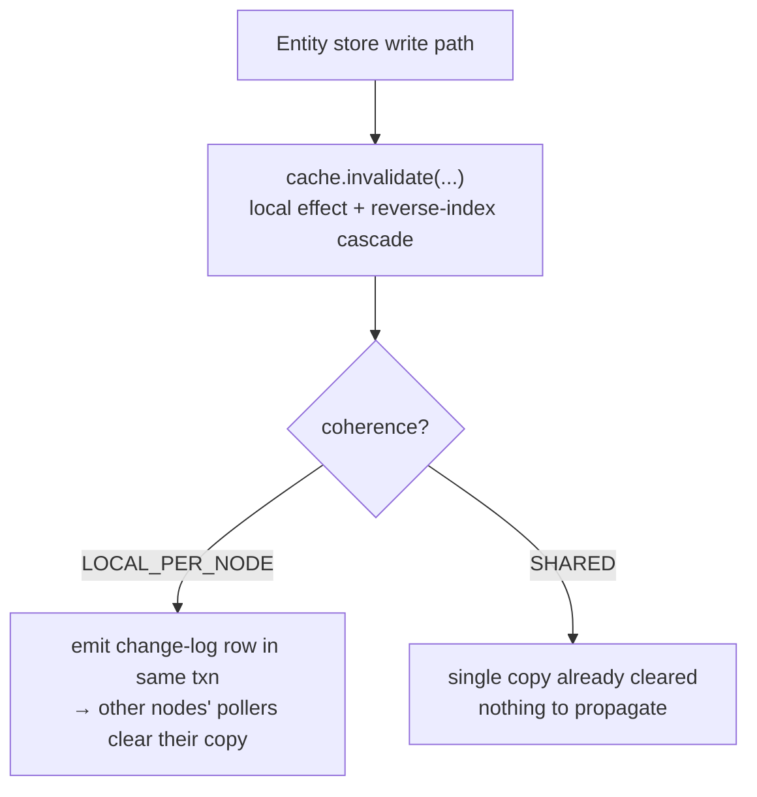
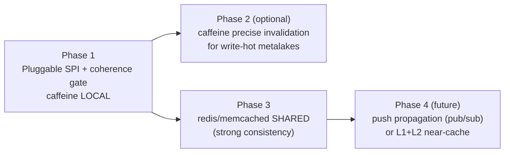

<!--
  Licensed to the Apache Software Foundation (ASF) under one
  or more contributor license agreements.  See the NOTICE file
  distributed with this work for additional information
  regarding copyright ownership.  The ASF licenses this file
  to you under the Apache License, Version 2.0 (the
  "License"); you may not use this file except in compliance
  with the License.  You may obtain a copy of the License at

   http://www.apache.org/licenses/LICENSE-2.0

  Unless required by applicable law or agreed to in writing,
  software distributed under the License is distributed on an
  "AS IS" BASIS, WITHOUT WARRANTIES OR CONDITIONS OF ANY
  KIND, either express or implied.  See the License for the
  specific language governing permissions and limitations
  under the License.
-->

---
title: "Multi-Node Support for the Entity Store Cache: Overview"
status: "Draft"
date: "2026-06-18"
---

## Background

Gravitino has two caches:

- The **jcasbin authorization cache** has already been reworked for multi-node. It works correctly when more than one server runs.
- The **entity store cache** has not. It only clears entries on the node that made a change. So a change on node A leaves node B serving old data.

Today the only safe way to run more than one node is to turn the entity store cache off (`gravitino.cache.enabled=false`). That hurts read-heavy catalogs, Iceberg most of all.

This document is the **overview**. It explains the current cache, defines a pluggable framework that makes the entity store cache correct on multiple nodes, and points to one detailed design per implementation.

## Goals and Non-Goals

**Goals**

- Make the entity store cache correct when more than one node runs, so `gravitino.cache.enabled=true` becomes safe.
- Make the cache **pluggable**: one SPI, several implementations, chosen by config. Each implementation owns its own consistency story.
- Ship a **default with no extra dependency** (local in-memory cache). Let users who already run Redis/Memcached switch to a **shared cache** with only a config change.

**Non-Goals**

- Replace the entity store or its write path (the optimistic version lock). The cache sits in front of the store and never becomes the source of truth.
- Add a built-in cluster membership / gossip layer. Coordination uses only what Gravitino already has (the DB) or an external cache the user opts into.

## Current Cache Implementation

Before the new design, it helps to see what exists today.

`EntityCache` is already an SPI. It is chosen by `gravitino.cache.impl` and created by `CacheFactory`, which keeps a name → class table:

```java
public static final ImmutableMap<String, String> ENTITY_CACHES =
    ImmutableMap.of("caffeine", CaffeineEntityCache.class.getCanonicalName());
```

So the SPI is in place, but **there is only one implementation today: `CaffeineEntityCache`** (`caffeine`). Its shape:

| Part            | Today                                                                 |
|-----------------|----------------------------------------------------------------------|
| Storage         | In-process Caffeine map, one copy **per node**                        |
| What it caches  | Entity keys `(ident, type)` and relation-list keys `(ident, type, relType)` |
| Reverse index   | In-process `ReverseIndexCache`, so a relation change can find and clear the other direction's key |
| Invalidation    | On a write, the local node clears the entity key and walks the reverse index to clear the related keys |
| Scope of clear  | **Local node only** — no signal is sent to other nodes               |

This is fine on a single node. The problem is the last row: the clear stays local. The design below keeps this implementation and adds the missing piece — a way for one node's write to reach the other nodes' caches.

## The Pluggable Design

The whole framework rests on one idea: **cross-node consistency is a property of the cache implementation, not something the upper layers manage.** The `EntityCache` SPI gains one capability:

```
EntityCache.coherence() → LOCAL_PER_NODE | SHARED
```

- `LOCAL_PER_NODE` — each node holds its own copy, so a write must be **propagated** to other nodes to clear their copies. `CaffeineEntityCache` is this kind.
- `SHARED` — one copy for the whole cluster, so a write clears it once and every node sees it. Nothing to propagate.

The write path stays the same for every implementation. It always asks the cache to clear what changed. Only the **propagation** differs, and it is decided by the capability:



The one change that makes this pluggable: the change-log emit, implicit today, becomes **conditional on `coherence()`**, and that is the single seam future implementations plug into. `CacheFactory.ENTITY_CACHES` is already a name → class table loaded by reflection, so a new implementation is one new table entry with no change to call sites.

## Consistency Model

| Aspect                       | `LOCAL_PER_NODE` (default)         | `SHARED` (opt-in)                        |
|------------------------------|------------------------------------|------------------------------------------|
| Copies                       | one per node                       | one cluster-wide                         |
| Cross-node propagation       | change-log + per-node poller       | none needed                              |
| Consistency                  | eventual (≤ one poll interval)     | strong (read-your-writes, no divergence) |
| External dependency          | none                               | Redis / Memcached                        |
| Read latency                 | local memory (fastest)             | one network hop                          |
| Relation reverse-key problem | present (the hard part)            | gone (shared reverse index)              |

`SHARED` is strong because it makes the cluster behave like a single node: there is one copy, the write clears it right after the DB commit, and the existing optimistic entity version stops a stale re-populate.

## Implementations

| Implementation        | `cache.impl` | coherence        | Detailed design                                                                                          |
|-----------------------|--------------|------------------|----------------------------------------------------------------------------------------------------------|
| Local in-memory cache | `caffeine`   | `LOCAL_PER_NODE` | [Multi-Node Invalidation for Entity Store Cache](./gravitino-entity-cache-multinode-changelog-design.md) |
| Shared cache          | `redis` (Memcached later) | `SHARED` | [Shared Cache for Multi-Node Entity Store](./gravitino-entity-cache-multinode-shared-cache-design.md)    |

The local cache is the default and needs no extra dependency; its detailed design covers the change-log emit/clear and how fine-grained the relation invalidation should be (coarse vs precise). The shared cache is opt-in; its detailed design covers running the same invalidation against the shared store and why the cross-node reverse-key problem goes away.

## Roadmap



| Phase | Deliverable                                                           | Why                                    |
|-------|----------------------------------------------------------------------|----------------------------------------|
| 1     | `coherence()` capability + gated change-log emit + `caffeine` LOCAL   | multi-node works, no extra dependency  |
| 2     | refine `caffeine` invalidation granularity where needed              | performance for write-hot metalakes    |
| 3     | `redis` SHARED implementation (Memcached later)                      | strong consistency, reuse user's Redis |
| 4     | push propagation or near-cache L1+L2                                 | lower invalidation latency             |

Phase 1 is the framework: once the coherence gate exists, the local cache's invalidation choices are an implementation detail, and the shared cache drops in beside it without touching the write path.
