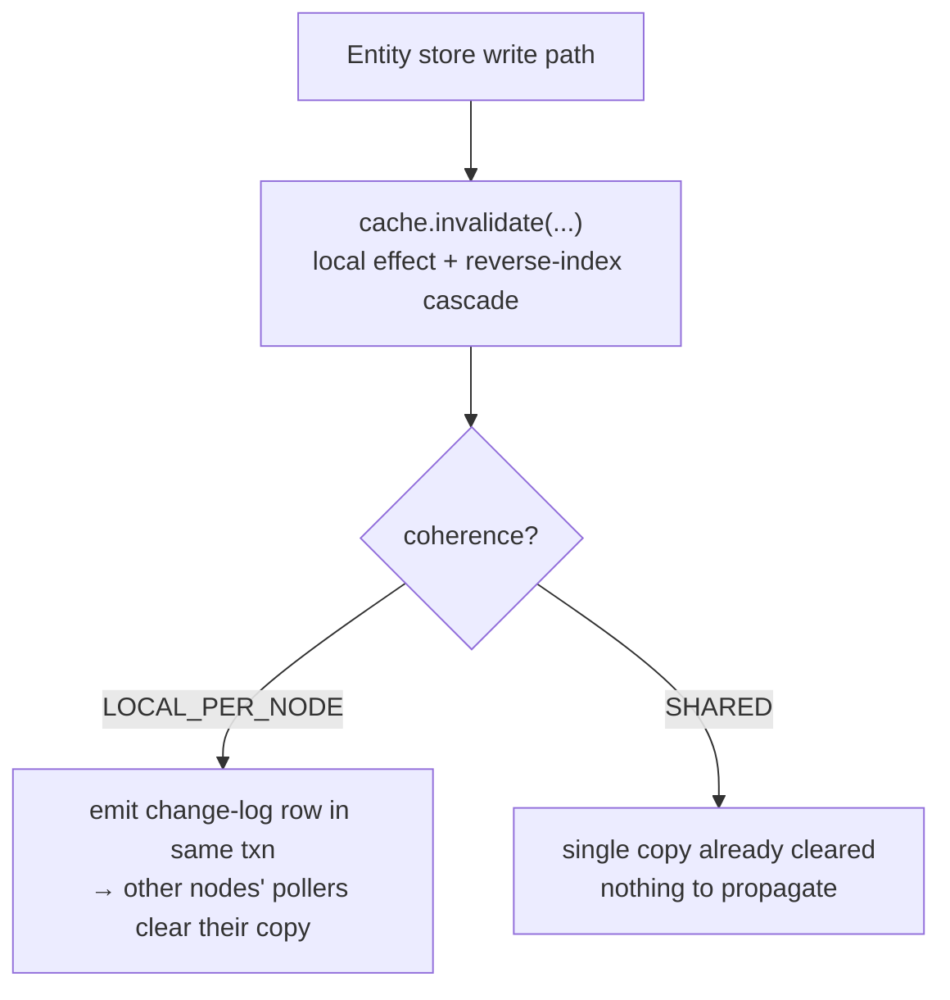
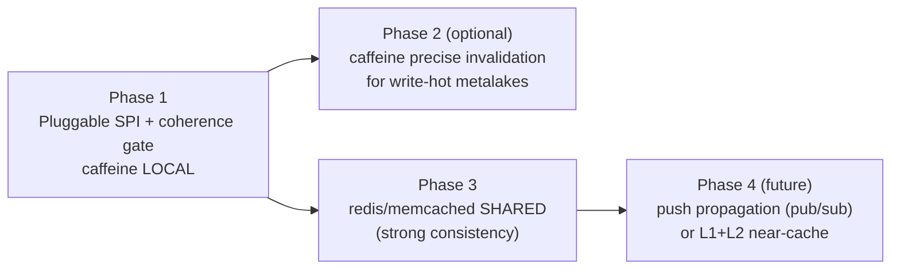

<!--
  Licensed to the Apache Software Foundation (ASF) under one
  or more contributor license agreements.  See the NOTICE file
  distributed with this work for additional information
  regarding copyright ownership.  The ASF licenses this file
  to you under the Apache License, Version 2.0 (the
  "License"); you may not use this file except in compliance
  with the License.  You may obtain a copy of the License at

   http://www.apache.org/licenses/LICENSE-2.0

  Unless required by applicable law or agreed to in writing,
  software distributed under the License is distributed on an
  "AS IS" BASIS, WITHOUT WARRANTIES OR CONDITIONS OF ANY
  KIND, either express or implied.  See the License for the
  specific language governing permissions and limitations
  under the License.
-->

---
title: "Multi-Node Support for the Entity Store Cache: Overview"
status: "Draft"
date: "2026-06-18"
---

## Background

Gravitino has two caches. The **jcasbin authorization cache** has already been reworked for multi-node and works correctly with more than one server. The **entity store cache** has not — it only clears entries on the node that made a change, so a change on node A leaves node B serving stale data. The only safe workaround today is to turn the entity store cache off (`gravitino.cache.enabled=false`), which hurts read-heavy catalogs (Iceberg most of all).

This document is the **macro overview**. It defines the pluggable framework that makes the entity store cache correct on multiple nodes, and points to one detailed design per implementation.

## Goals and Non-Goals

**Goals**

- Make the entity store cache correct in a multi-node deployment, so `gravitino.cache.enabled=true` becomes safe.
- Make the cache **pluggable**: one SPI, several implementations, selected by config; each implementation owns its own consistency story.
- Ship a **zero-dependency default** (local in-memory cache) and let users who already run Redis/Memcached switch to a **shared cache** with only a config change.

**Non-goals**

- Replacing the entity store or its strong-consistency write path (optimistic version lock). The cache sits in front of it and never becomes the source of truth.
- A built-in cluster membership / gossip layer. Coordination uses only what Gravitino already has (the DB) or an external cache the user opts into.

## The Pluggable Design

The whole framework rests on one idea: **cross-node consistency is a property of the cache implementation, not something the upper layers manage.** The `EntityCache` SPI (already present, selected by `gravitino.cache.impl` through `CacheFactory`) gains one capability:

```
EntityCache.coherence() → LOCAL_PER_NODE | SHARED
```

- `LOCAL_PER_NODE` — each node holds its own copy, so writes must be **propagated** to other nodes to clear their copies.
- `SHARED` — one copy for the whole cluster, so a write clears it once and every node sees it; nothing to propagate.

The write path stays implementation-agnostic. It always asks the cache to clear what changed; only the **propagation** differs, and it is gated by the capability:



The one refactor that makes this pluggable: the change-log emit, today implicit, becomes **conditional on `coherence()`** and is the single seam future strategies plug into. `CacheFactory.ENTITY_CACHES` is already a name → class registry loaded by reflection, so a new implementation is one registry entry with no change to call sites.

## Consistency Model

| Aspect                       | `LOCAL_PER_NODE` (default)         | `SHARED` (opt-in)                        |
|------------------------------|------------------------------------|------------------------------------------|
| Copies                       | one per node                       | one cluster-wide                         |
| Cross-node propagation       | change-log + per-node poller       | none needed                              |
| Consistency                  | eventual (≤ one poll interval)     | strong (read-your-writes, no divergence) |
| External dependency          | none                               | Redis / Memcached                        |
| Read latency                 | local memory (fastest)             | one network hop                          |
| Relation reverse-key problem | present (the hard part)            | dissolved (shared reverse index)         |

`SHARED` is strong because it makes the cluster behave like a single node: there is one copy, the write clears it right after the DB commit, and the existing optimistic entity version guards a stale re-populate.

## Implementations

| Implementation        | `cache.impl` | coherence        | Detailed design                                                                 |
|-----------------------|--------------|------------------|---------------------------------------------------------------------------------|
| Local in-memory cache | `caffeine`   | `LOCAL_PER_NODE` | [Multi-Node Invalidation for Entity Store Cache](./entity-cache-multinode-changelog-design.md) |
| Shared cache          | `redis` / `memcached` | `SHARED` | [Shared Cache for Multi-Node Entity Store](./entity-cache-multinode-shared-cache-design.md) |

The local cache is the zero-dependency default; its detailed design covers the change-log emit/clear and the relation-invalidation granularity (coarse vs precise). The shared cache is opt-in; its detailed design covers running the same invalidation cascade against the shared store and why the cross-node reverse-key problem disappears.

## Roadmap



| Phase | Deliverable                                                           | Why                                    |
|-------|----------------------------------------------------------------------|----------------------------------------|
| 1     | `coherence()` capability + gated change-log emit + `caffeine` LOCAL   | multi-node works, zero dependency      |
| 2     | refine `caffeine` invalidation granularity where needed              | performance for write-hot metalakes    |
| 3     | `redis` / `memcached` SHARED implementation                          | strong consistency, reuse user's Redis |
| 4     | push propagation or near-cache L1+L2                                 | lower invalidation latency             |

Phase 1 is the framework: once the coherence gate exists, the local cache's invalidation choices are an implementation detail, and the shared cache drops in beside it without touching the write path.
