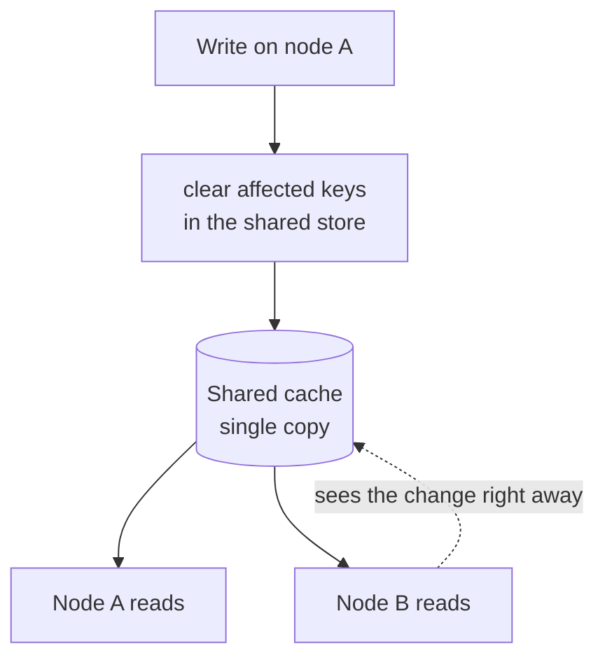

<!--
  Licensed to the Apache Software Foundation (ASF) under one
  or more contributor license agreements.  See the NOTICE file
  distributed with this work for additional information
  regarding copyright ownership.  The ASF licenses this file
  to you under the Apache License, Version 2.0 (the
  "License"); you may not use this file except in compliance
  with the License.  You may obtain a copy of the License at

   http://www.apache.org/licenses/LICENSE-2.0

  Unless required by applicable law or agreed to in writing,
  software distributed under the License is distributed on an
  "AS IS" BASIS, WITHOUT WARRANTIES OR CONDITIONS OF ANY
  KIND, either express or implied.  See the License for the
  specific language governing permissions and limitations
  under the License.
-->

---
title: "Shared Cache for Multi-Node Entity Store"
status: "Draft"
date: "2026-06-18"
---

## Background

This is the detailed design for the **shared cache** implementation of the entity store cache (`gravitino.cache.impl = redis`). It is one of the two implementations in the [overview](./gravitino-entity-cache-multinode-overview-design.md); the other is the local in-memory cache ([detailed design](./gravitino-entity-cache-multinode-changelog-design.md)). Read the overview first for the pluggable `EntityCache` SPI and the `coherence()` capability.

This design targets Redis. Memcached cannot support the prefix index and reverse index this cache needs (see [Why Redis First](#why-redis-first-not-memcached)), so it is out of scope here.

This implementation declares `coherence() = SHARED`.

The entity store cache only clears entries on the node that made a change, so on multiple nodes other nodes serve old data. The local cache solves this by sending a change-log signal to every node. This document covers a different answer: keep **one copy** for the whole cluster, so there is nothing to send.

## Goals

- Provide a multi-node-correct entity store cache for users who already run Redis, with only a config change.
- Give **strong consistency** (read-your-writes across the cluster, no two nodes ever disagree).
- Keep **the same invalidation behavior** as the local cache, so the two implementations are interchangeable from the caller's view.

## Problem Analysis

A local per-node cache has to *send* every change to other nodes so they clear their own copy. The hard case is a relation's reverse key: a link that was never cached on another node cannot be found there (see the [local cache design](./gravitino-entity-cache-multinode-changelog-design.md) for the full reverse-key problem).

The root cause is that **each node has its own copy**. If there were only one copy, there would be nothing to send and no reverse key to chase on a remote node. That is what a shared cache gives:



The writing node computes the affected keys (the same cascade the local cache already does) and clears them in the shared store. Every node reads that same store, so no change-log and no poller are needed, and the reverse-key problem is gone because the reverse index is shared too.

## How Others Solve This

Using a shared (distributed) cache to avoid per-node staleness is a standard pattern:

| Approach                        | How it works                                          | Trade-off                                                   |
|---------------------------------|-------------------------------------------------------|------------------------------------------------------------|
| Per-node cache + invalidation   | Each node caches; writes are broadcast or polled       | Fastest reads (local memory), but needs propagation logic   |
| Shared cache (this design)      | One copy in Redis/Memcached, every node reads it       | No propagation, but each read is a network hop              |
| Near-cache (L1 local + L2 shared) | Small local cache in front of the shared one         | Fast reads + one copy, but L1 needs its own invalidation    |

Redis and Memcached are the common shared stores; many Gravitino users already run one. We pick the plain **shared cache** for this implementation because it is the simplest design that gives strong consistency and reuses infrastructure the user already has. Near-cache (L1+L2) is left as a future step (see the overview roadmap), since its L1 brings back the same invalidation problem this design avoids.

## Our Approach

The goal is to behave exactly like `CaffeineEntityCache`. So before any design, we must look at what that class actually relies on, because most of it is **not** a plain key → value map and does not map to Redis for free.

### What Caffeine Relies On Today

`CaffeineEntityCache` keeps three in-process structures, not one:

| # | Structure                                    | Type today                                  | What it is for                                                                                  |
|---|----------------------------------------------|---------------------------------------------|------------------------------------------------------------------------------------------------|
| 1 | `cacheData`                                  | `Cache<EntityCacheRelationKey, List<Entity>>` | The values. One entry per entity key `(ident, type)` or relation key `(ident, type, relType)`. Even a single entity is stored as a one-element list. |
| 2 | `cacheIndex`                                 | `RadixTree<EntityCacheRelationKey>`         | A **forward prefix index**. Lets the cascade find every child key by prefix: `getValuesForKeysStartingWith(identifier)`. |
| 3 | `reverseIndex` (`ReverseIndexCache`)         | a `RadixTree` + a `Map`                      | Two maps: `entityKey → [relation keys that point to it]` and `relationKey → [entity keys it points to]` (for cleanup). Also prefix-scanned. |

The key string format matters, because the prefix scans depend on it (`EntityCacheKey.toString()` / `EntityCacheRelationKey.toString()`):

```
entity key   :  <metalake>.<catalog>.<schema>.<name>:<TYPE>
                e.g.  ml1.cat1.sch1.tbl1:TABLE
relation key :  <identifier>:<TYPE>:<RELTYPE>
                e.g.  ml1.system.role.role1:ROLE:ROLE_USER_REL
```

The cascade (`invalidateEntities`) is a BFS that, for each key it removes, runs **two prefix scans** — `cacheIndex.getValuesForKeysStartingWith(ident)` for hierarchical children and `reverseIndex.getValuesForKeysStartingWith(ident)` for the reverse direction — then enqueues what they return. So the real work of the shared cache is reproducing **prefix scan** and the **reverse index** on Redis. A plain `GET`/`SET`/`DEL` store is not enough.

### Mapping Each Structure to Redis

All keys live under one namespace prefix (`gv:ec:`); below it is dropped for readability.

| Caffeine structure                              | Redis representation                                                    | Type    |
|-------------------------------------------------|------------------------------------------------------------------------|---------|
| `cacheData[key] = List<Entity>`                 | `D:{key}` → serialized list                                            | String  |
| `cacheIndex` (forward prefix index)             | `IDX` → all data-key strings, every score `0`                          | ZSet    |
| `reverseIndex[entityKey] = [relKeys]`           | `R:{entityKey}` → set of relation-key strings                          | Set     |
| `reverseIndex` keys (for prefix scan)           | `RIDX` → all `entityKey` strings that have a reverse entry, score `0`  | ZSet    |
| `entityToReverseIndexMap[relKey] = [entityKeys]`| `RO:{relKey}` → set of entity-key strings this relation key points to  | Set     |

`D:` replaces structure 1. `IDX`/`RIDX` replace the two radix trees' prefix-scan ability. `R:`/`RO:` replace the reverse index's two maps (the second one, `RO:`, exists only so a removed relation key can find and clean the `R:` sets that reference it — exactly what `ReverseIndexCache.remove` does in memory).

### Prefix-Index Lookup (the Hard Part)

Caffeine uses a radix tree so that `getValuesForKeysStartingWith("ml1.cat1")` returns every key under that prefix in one call. Redis has no radix tree, and `KEYS`/`SCAN` with a glob is an O(N) full scan — not usable on the read/write path. The standard Redis replacement is a **lexicographically sorted set + a range query**:

1. Keep every key string as a member of a ZSet with the **same score** (`0`). With equal scores, a ZSet is ordered purely by member string.
2. A prefix scan becomes one `ZRANGEBYLEX`:

```
ZRANGEBYLEX IDX "[ml1.cat1" "(ml1.cat1\xff"
```

This returns exactly the members in `[ "ml1.cat1" , "ml1.cat1\xff" )`, i.e. every key string that starts with `ml1.cat1`, in `O(log N + M)` (M = matches) instead of `O(N)`. The reverse index is scanned the same way against `RIDX`.

This reproduces the radix-tree semantics **including its existing rough edge**: a prefix of `ml1.cat1` also matches `ml1.cat11...`, because both the radix tree and `ZRANGEBYLEX` match on raw string prefix. The `:` before the type and the `.` between names are the only boundaries; this is the same boundary nuance called out in the [local cache design](./gravitino-entity-cache-multinode-changelog-design.md) and behavior is identical, so parity holds.

### Operation Walk-Through

Concrete command sequences for each `EntityCache` method:

**`getIfPresent(ident, type[, relType])`** — `GET D:{key}`; deserialize; on miss return empty and let the caller load from the DB and `put`.

**`put(entity)`** — mirror `syncEntitiesToCache` + `invalidateOnKeyChange`:

```
SET   D:{key} <serialized [entity]>
ZADD  IDX 0 {key}
# reverse index: apply the same ReverseIndexRules, for each referenced entity E:
SADD  R:{E} {key}      ;  ZADD RIDX 0 {E}      ;  SADD RO:{key} {E}
```

**`put(ident, type, relType, entities)`** — relation lists **merge** with what is already cached (Caffeine does a `LinkedHashSet` union). On Redis this is a read-modify-write, so it must be atomic. Do it in a Lua script: `GET D:{key}` → union → `SET`, plus the same `ZADD`/`SADD` reverse-index updates, all in one script so two nodes merging the same relation key cannot lose entries.

**`invalidate(ident, type)` / `invalidate(..., relType)`** — the BFS cascade, run as **one Lua script** so the whole cascade is atomic (see next section). Per dequeued key `k`:

```
DEL        D:{k}
ZREM       IDX {k}
ZRANGEBYLEX IDX  "[{ident_k}" "({ident_k}\xff"   → enqueue children
ZRANGEBYLEX RIDX "[{ident_k}" "({ident_k}\xff"   → for each entityKey, SMEMBERS R:{entityKey} → enqueue, then clean R:/RIDX
# clean this key's own reverse bookkeeping (mirrors ReverseIndexCache.remove):
SMEMBERS   RO:{k} → for each E: SREM R:{E} {k}; if R:{E} empty → DEL R:{E}, ZREM RIDX {E}
DEL        RO:{k}
SREM/DEL   R:{k} ; ZREM RIDX {k}
```

**`contains`** → `EXISTS D:{key}`. **`size`** → `ZCARD IDX`. **`clear`** → delete all keys under the `gv:ec:` namespace (a one-off `SCAN` + `UNLINK`, or a dedicated logical DB so `FLUSHDB` is safe).

### Concurrency and the Stale-Populate Guard

Caffeine uses an in-process `SegmentedLock` (striped per-key locks, plus a global lock for `clear`). On a shared store that lock no longer protects other nodes, so correctness must come from Redis itself:

- **Cascade atomicity** — running the cascade as a single **Lua script** makes it atomic on the Redis server: no other command interleaves, so a concurrent reader never sees the index and the data half-updated. This removes the need for a distributed lock around `invalidate`.
- **Single-flight on miss** — `withCacheLock` today stops a node from loading the same key many times at once. A **per-node** lock still does that for each node; a small cross-node stampede on a cold key is acceptable. An optional `SET NX PX` lease can make it cluster-wide if needed.
- **The delete-then-stale-populate race** — the dangerous case: reader loads `v1` from the DB; a writer commits `v2` and `DEL`s the key; the slow reader then `SET`s `v1` back. The DB read alone cannot catch this. Two guards, both on the populate path:
  - **Version check**: the value carries the entity version; populate is a Lua `SET` that only writes when no value exists *and* the loaded version is the one the loader observed. Combined with the writer's `DEL`-after-commit, a populate that lost the race is dropped.
  - **Lease token** (optional, stronger): on miss the reader `SET NX`s a short-TTL lease; the writer's `invalidate` also deletes the lease; the populate only writes if its lease is still alive. This closes the window the version check leaves open under clock/version edge cases.

### Where the Shared Cascade Logic Lives

The BFS itself is identical to Caffeine's; only the per-step operations differ (Redis commands vs. in-process map calls). So the BFS shape and the relation model it walks (the two write mechanisms, the bidirectional keys, the cascade map — see the [local cache design](./gravitino-entity-cache-multinode-changelog-design.md)) can stay in shared code, with a small storage interface (`getByPrefix`, `delete`, `addToIndex`, …) implemented once for Caffeine and once for Redis.

### Why Redis First, Not Memcached

The prefix index and reverse index above need **sorted-set range queries** (`ZRANGEBYLEX`) and **server-side atomic scripts** (Lua). Memcached has neither — it is a flat key → value store with no ordered structure and no scripting. So the cascade and prefix scan cannot be built on Memcached without rebuilding an index layer on top of it. This detailed design therefore targets **Redis**; Memcached is left out of scope until there is a concrete need, and if added it would likely be a value-only store with no relation invalidation.

### Consistency

Strong, in the sense the cache can actually provide: **read-your-writes across the cluster, with no two nodes disagreeing.**

- One copy means two nodes can never hold different values.
- The write clears the shared keys **right after** the DB commit (never before), so a concurrent reader cannot put stale data back into a just-cleared slot.
- A slow reader that loaded an old value and tries to populate after a concurrent write is rejected by the version check / lease above.

The cache never becomes the source of truth; the entity store and its version lock stay authoritative.

### Configuration

```properties
gravitino.cache.enabled = true
gravitino.cache.impl    = redis        # Redis only for now (see "Why Redis First")

# shared-cache sub-keys (apply only when impl = redis)
gravitino.cache.redis.address     = redis://host:6379
gravitino.cache.redis.namespace   = gv:ec       # key prefix / logical DB for clear()
gravitino.cache.redis.ttl         = ...         # safety bound, not the consistency mechanism
gravitino.cache.redis.serializer  = ...         # e.g. JSON or a binary codec
```

`CacheFactory.ENTITY_CACHES` gains one entry, e.g. `"redis" -> RedisEntityCache.class`; call sites are unchanged.

## Comparison

| Plus                                              | Minus                                                        |
|---------------------------------------------------|-------------------------------------------------------------|
| Strong consistency (single copy, version-guarded) | Needs Redis; HA is the operator's responsibility            |
| Relation reverse-key problem is gone              | Each cache access is a network hop, not a memory read       |
| No change-log, no poller, no reload spike         | Entities must be serialized; the radix trees become `IDX`/`RIDX` ZSets and `R:`/`RO:` sets that must be kept in step |
| Reuses infrastructure many users already run      | Shared store availability now affects cache reads           |

Compared with the local cache: the local cache wins on read latency and needs no extra service, but pays for cross-node propagation and the reverse-key problem. The shared cache removes both at the cost of a dependency and a network hop per read. They are interchangeable through the SPI, so users pick by their environment.

## Test Plan

| Area           | Check                                                                                                |
|----------------|------------------------------------------------------------------------------------------------------|
| Prefix index   | `ZRANGEBYLEX IDX` returns exactly the keys under a prefix, and matches the radix tree's results (including the `ml1.cat1` / `ml1.cat11` boundary) for the same data |
| Cascade        | the Lua cascade clears the right entity, relation (both directions), `IDX`, `RIDX`, `R:`, and `RO:` entries; no orphan reverse entries left behind |
| Cascade atomic | a reader during an in-flight cascade never sees data present but its index entry gone (or vice versa) |
| Merge          | two nodes `put` the same relation key concurrently; the merged list keeps both sides' entities        |
| Consistency    | the delete-then-populate race: a stale `v1` populate after a committed `v2` + `DEL` is rejected by the version check / lease; no node serves a value older than the last commit |
| No propagation | `coherence() = SHARED` skips change-log emit and the poller entirely                                  |
| Multi-node e2e | node A runs grant/revoke/drop role, role to user/group, setOwner, attach tag/policy; node B sees the change right away |
| Parity         | the same invalidation cases the local cache covers behave the same through the shared cache           |
