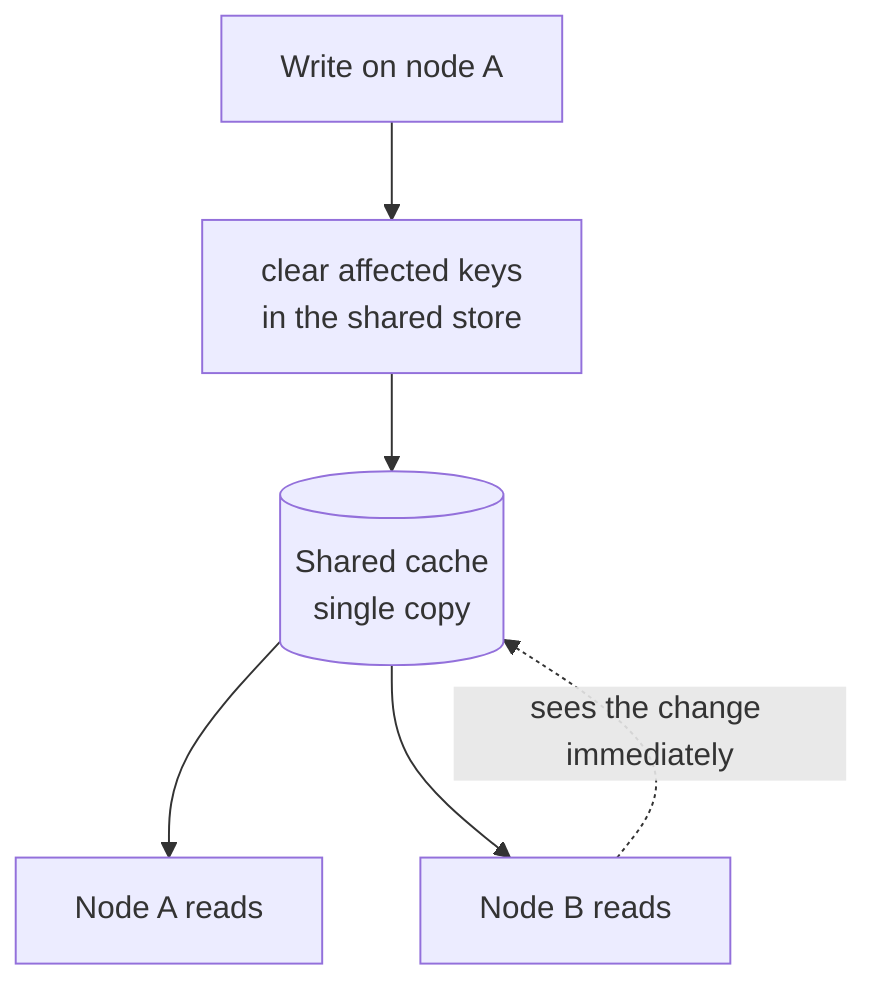
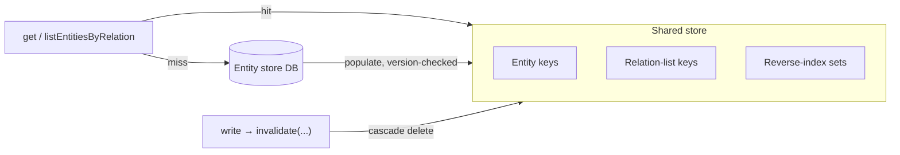

<!--
  Licensed to the Apache Software Foundation (ASF) under one
  or more contributor license agreements.  See the NOTICE file
  distributed with this work for additional information
  regarding copyright ownership.  The ASF licenses this file
  to you under the Apache License, Version 2.0 (the
  "License"); you may not use this file except in compliance
  with the License.  You may obtain a copy of the License at

   http://www.apache.org/licenses/LICENSE-2.0

  Unless required by applicable law or agreed to in writing,
  software distributed under the License is distributed on an
  "AS IS" BASIS, WITHOUT WARRANTIES OR CONDITIONS OF ANY
  KIND, either express or implied.  See the License for the
  specific language governing permissions and limitations
  under the License.
-->

---
title: "Shared Cache for Multi-Node Entity Store"
status: "Draft"
date: "2026-06-18"
---

## Scope

This is the detailed design for the **shared cache** implementation of the entity store cache (`gravitino.cache.impl = redis` / `memcached`). It is one of the two implementations defined in the [overview](./entity-cache-multinode-overview-design.md); the other is the local in-memory cache ([detailed design](./entity-cache-multinode-changelog-design.md)). Read the overview first for the pluggable `EntityCache` SPI and the `coherence()` capability.

This implementation declares `coherence() = SHARED`.

## Why a Shared Cache

A local per-node cache has to *propagate* every change so other nodes clear their own copy, and the hard case is a relation's reverse key: a binding that was never cached on another node cannot be found there. A shared cache removes the whole problem:



There is **one copy**. The writing node computes the affected keys (the same cascade the local cache already does) and clears them in the shared store; every node reads that same store, so no change-log and no poller are needed, and the reverse-key problem disappears because the reverse index is shared too.

## Consistency

Strong, in the sense the cache can actually provide: **read-your-writes across the cluster, with no cross-node divergence.**

- One copy means two nodes can never hold different values.
- The write clears the shared keys **right after** the DB commit (never before), so a concurrent reader cannot re-populate stale data into a just-cleared slot.
- A slow reader that loads an old value and tries to populate after a concurrent write is rejected by the **existing optimistic entity version** — the populate only wins if its version is not older than what the write left behind.

The cache never becomes the source of truth; the entity store and its version lock remain authoritative.

## Design: Same Cascade, Shared Storage

The requirement is functional parity with the local cache, so the shared implementation keeps the **same invalidation algorithm** and only changes where the data and the index live:

| Piece                           | Local (`caffeine`)             | Shared (`redis` / `memcached`)                          |
|---------------------------------|--------------------------------|---------------------------------------------------------|
| Entity / relation entries       | in-process Caffeine map        | shared-store keys (entities + relation lists)           |
| Reverse index                   | in-process `ReverseIndexCache` | shared-store sets (object/role → relation keys)         |
| Invalidate cascade (BFS)        | over the in-process index      | the same BFS over the shared index                      |
| Cross-node propagation          | change-log + poller            | none — one shared copy                                  |
| Single-flight (`withCacheLock`) | per-node lock                  | per-node lock is enough; a stale populate is version-rejected |
| Serialization                   | none (objects in heap)         | entities serialized on write, deserialized on read      |

The cascade logic can live in the shared `BaseEntityCache` so both implementations reuse it; only the storage and reverse index are implemented per backend. The relation model the cascade walks (the two write mechanisms, the bidirectional keys, the cascade map) is described in the [local cache design](./entity-cache-multinode-changelog-design.md) and applies unchanged here.

## What the Implementation Provides



- `get` / `listEntitiesByRelation`: read the shared store; on miss, load from the DB and populate with the entity version attached.
- `put` / `invalidate`: write/delete shared-store keys and update the reverse-index sets; `invalidate` runs the cascade and deletes every affected key in both directions.
- No `entity_change_log` rows and no poller for this implementation — `coherence() = SHARED` tells the write path to skip both.

## Configuration

```properties
gravitino.cache.enabled = true
gravitino.cache.impl    = redis        # or memcached

# shared-cache sub-keys (apply only when impl = redis / memcached)
gravitino.cache.redis.address     = redis://host:6379
gravitino.cache.redis.ttl         = ...     # safety bound, not the consistency mechanism
gravitino.cache.redis.serializer  = ...
```

`CacheFactory.ENTITY_CACHES` gains one entry, e.g. `"redis" -> RedisEntityCache.class`; call sites are unchanged.

## Trade-offs

| Plus                                              | Minus                                                        |
|---------------------------------------------------|-------------------------------------------------------------|
| Strong consistency (single copy, version-guarded) | Needs Redis/Memcached; HA is the operator's responsibility  |
| Relation reverse-key problem disappears           | Each cache access is a network hop, not a memory read       |
| No change-log, no poller, no reload spike         | Entities must be serialized; reverse index reimplemented on the shared store |
| Reuses infrastructure many users already run      | Shared store availability now affects cache reads           |

## Test Plan

| Area          | Check                                                                                                |
|---------------|------------------------------------------------------------------------------------------------------|
| Cascade       | a write clears the right entity, relation (both directions), and reverse-index entries in the shared store |
| Consistency   | a concurrent stale populate is rejected by the entity version; no node ever serves a value older than the last commit |
| No propagation| `coherence() = SHARED` skips change-log emit and the poller entirely                                  |
| Multi-node e2e| node A runs grant/revoke/drop role, role to user/group, setOwner, attach tag/policy; node B sees the change immediately |
| Parity        | the same invalidation cases the local cache covers behave identically through the shared cache        |
