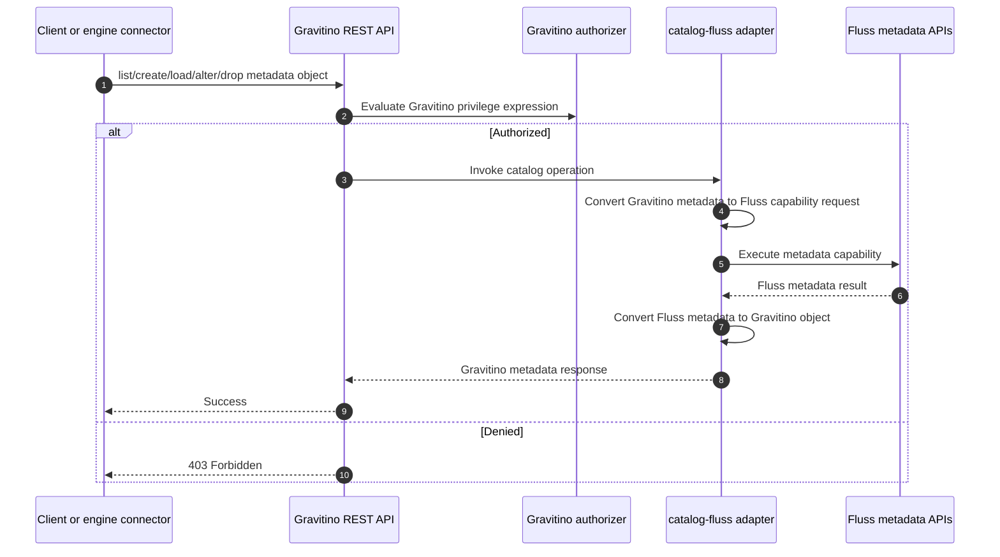
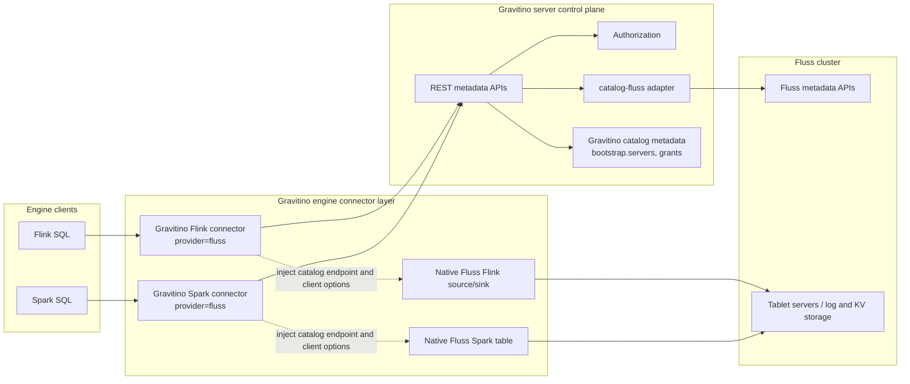
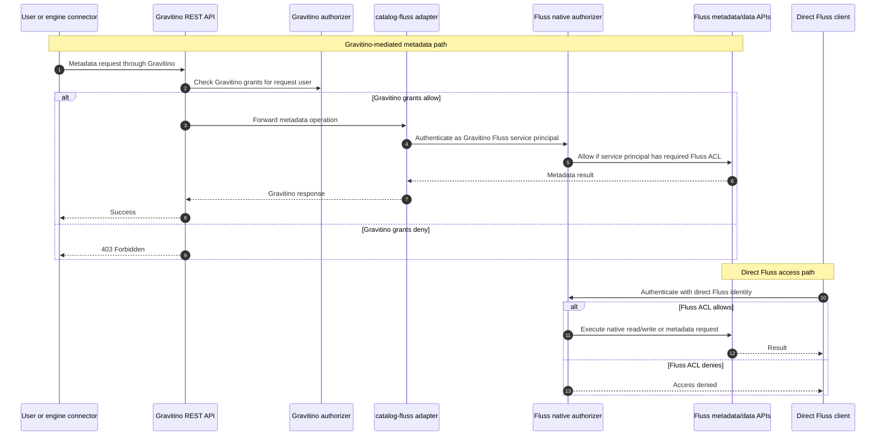

<!--
  Licensed to the Apache Software Foundation (ASF) under one
  or more contributor license agreements.  See the NOTICE file
  distributed with this work for additional information
  regarding copyright ownership.  The ASF licenses this file
  to you under the Apache License, Version 2.0 (the
  "License"); you may not use this file except in compliance
  with the License.  You may obtain a copy of the License at

   http://www.apache.org/licenses/LICENSE-2.0

  Unless required by applicable law or agreed to in writing,
  software distributed under the License is distributed on an
  "AS IS" BASIS, WITHOUT WARRANTIES OR CONDITIONS OF ANY
  KIND, either express or implied.  See the License for the
  specific language governing permissions and limitations
  under the License.
-->

# Design of Apache Fluss Catalog Support for Apache Gravitino

## Background

Gravitino currently does not provide a native catalog integration for Apache Fluss. This creates three practical problems:
1. **No unified metadata entry for Fluss users**: Organizations using Fluss cannot register a Fluss cluster as a first-class Gravitino catalog and manage its metadata through Gravitino's schema, table, partition, and privilege APIs.
2. **Inconsistent metadata management**: Fluss users must manage Fluss metadata separately from Gravitino, leading to potential inconsistencies and increased operational overhead.
3. **Limited interoperability**: Without native catalog support, Fluss users cannot leverage Gravitino's unified access control, lineage, and governance features for their Fluss data.

## Goals

1. **Unified metadata management**: Provide a single interface to manage metadata in a Fluss cluster through Gravitino's catalog, schema, table, and partition APIs.
2. **Enhanced visibility and governance**: Enable Fluss users to leverage Gravitino's access control, lineage, and audit capabilities for better management of their data assets.
3. **Multi-engine integration**: Allow engine connectors integrated with Fluss (such as Flink and Spark) to access Fluss tables through Gravitino, providing a consistent user experience.

## Non-Goals

This design intentionally does not include:

1. **Moving Fluss metadata storage into Gravitino**: Gravitino acts as a metadata proxy for Fluss. Metadata remains stored in Fluss, and Gravitino interacts with Fluss through APIs to provide a unified view and management surface.
2. **New Fluss engine data connector**: This design does not create a new Flink or Spark data source for Fluss. It adds Gravitino-side adapters that reuse the existing Fluss Flink/Spark connectors for data-plane reads and writes.
3. **Fluss server-side custom authorizer implementation**: This design does not implement or modify Fluss server-side authorizer plugins. Option 2 only discusses a future Gravitino-side authorization plugin that synchronizes ACLs through Fluss client APIs.

## Fluss Catalog

### Fluss Catalog Implementation

Create a new `catalogs/catalog-fluss` module that uses the Fluss Java API to manage metadata in a Fluss cluster. The relevant Fluss metadata model includes:

| Level | Description |
|-------|-------------|
| **Cluster** | Represents the overall cluster topology, including coordinator and tablet server nodes |
| **Database** | A logical namespace that groups tables; carries properties, creation/modification timestamps |
| **Table** | Defines a table's schema, storage format, partitioning, and bucket strategy |
| **Partition** | Logical division of a table's data by partition key values |

This hierarchy follows this pattern:

```shell
Cluster
  └── Database
        └── Table (Schema + Format + Partition strategy)
              └── Partition
```

### Configurations

Defines the following catalog properties for `provider=fluss`:

| Property                         | Required | Default Value  | Description                                                  |
| -------------------------------- | -------- | -------------- | ------------------------------------------------------------ |
| `bootstrap.servers`              | Yes      | —              | Catalog-level Fluss endpoint stored once in Gravitino. The server-side catalog plugin uses it for metadata operations, and Gravitino engine adapters inject it into native Fluss runtime options. Users should not configure it again in Flink/Spark catalogs. |
| `gravitino.bypass.`              | No       | -              | Server-side Fluss client properties used only by the Gravitino catalog plugin. Properties are passed to the Fluss client without the prefix. |

### Operations Mapping

For `FlussCatalogOperations`, catalog-level operations are mapped to Fluss cluster connection and validation, schema-level operations are mapped to Fluss database capabilities, table-level operations are mapped to Fluss table capabilities, and partition-level operations are mapped to Fluss partition capabilities. The implementation should provide the following interfaces:
- TableOperations
- SupportsSchemas
- TableCatalog
- SupportsPartitions

#### Catalog Operations

Because Fluss does not have a catalog object, catalog operations are primarily Gravitino-side operations with optional validation against the target Fluss cluster.

| Gravitino Operation | Fluss Metadata Capability | Notes |
| ------------------- | ------------------------- | ----- |
| `createCatalog` | none | The catalog object itself is created only in Gravitino. |
| `loadCatalog` | none | Reads Gravitino catalog metadata only. |
| `alterCatalog` | none | Updates Gravitino-side connection or authz properties only. |
| `dropCatalog` | none | Removes the Gravitino registration only. It does not delete anything from Fluss. |
| `testConnection` | Validate cluster reachability and credentials | Validates that the configured Fluss cluster endpoint and service identity are usable. |

#### Schema Operations

Gravitino schema operations are mapped to Fluss database or namespace capabilities.

| Gravitino Operation | Fluss Metadata Capability | Notes |
| ------------------- | ------------------------- | ----- |
| `listSchemas` | List databases | Returns Fluss databases as Gravitino schemas. |
| `createSchema` | Create a database | Creates a Fluss database from Gravitino schema metadata. |
| `loadSchema` | Load database metadata | Loads database metadata and converts it to a Gravitino schema object. |
| `alterSchema` | Update database metadata | Updates mutable database metadata such as properties or comments. |
| `dropSchema` | Drop a database | Drops the mapped Fluss database using the cascade behavior described below. |

#### Schema Drop Semantics

`dropSchema` should preserve Gravitino's `cascade` parameter.

When `cascade=false`, the Fluss catalog uses restrict semantics: dropping a non-empty Fluss database must fail and be translated to `NonEmptySchemaException`.

When `cascade=true`, the catalog may pass the cascade request to Fluss so Fluss removes tables under the database according to its own drop-database semantics. A missing Fluss database should be translated to a `false` return value for idempotent drops or to `NoSuchSchemaException` where the Gravitino API requires an exception.

#### Table Operations

Gravitino table operations are mapped to Fluss table capabilities through a translation layer that converts Gravitino columns, keys, partition transforms, distribution, and properties into Fluss table metadata.

| Gravitino Operation | Fluss Metadata Capability | Notes |
| ------------------- | ------------------------- | ----- |
| `listTables` | List tables in a database | Returns Fluss tables under the mapped database. |
| `loadTable` | Load table metadata | Returns Fluss table metadata and converts it to a Gravitino table object. |
| `createTable` | Create a table from a translated descriptor | Creates either a primary key table or log table based on Gravitino table definition. |
| `alterTable` | Apply table metadata changes | Updates mutable Fluss table metadata. |
| `dropTable` | Drop a table | Removes the Fluss table mapped from the Gravitino table object. |

#### Table Change Support

`alterTable` must only translate changes that are supported by the target Fluss version. The initial implementation should be conservative and fail fast before calling Fluss when a requested change is known to be unsupported. Unsupported changes should be rejected with `UnsupportedOperationException` or `IllegalArgumentException` at the adapter boundary, while invalid Fluss-side changes should be translated from Fluss validation errors to the closest Gravitino exception.

| Gravitino `TableChange` | Initial Fluss handling | Notes |
| ----------------------- | ---------------------- | ----- |
| `SetProperty` / `RemoveProperty` for alterable `table.*` options | Supported when the option is alterable in Fluss | Fluss 0.9 alterable options include datalake enablement/freshness, tiered-log local segments, auto-partition retention, and statistics columns. Immutable storage options such as bucket number, bucket keys, primary key, partition keys, and most physical layout options must be rejected. |
| `UpdateComment` | Not supported by Fluss 0.9 | Fluss 0.9 stores table comments in `TableDescriptor`, but its `alterTable` change model does not expose a table-level comment update operation. Reject with `UnsupportedOperationException` instead of silently dropping the change. |
| `AddColumn` | Supported only for appending a nullable column at the end of the schema | Fluss 0.9 schema evolution rejects adding columns at non-last positions and rejects non-nullable new columns. |
| `DeleteColumn`, `RenameColumn`, `UpdateColumnType`, `UpdateColumnPosition`, `UpdateColumnDefaultValue`, `UpdateColumnNullability`, `UpdateColumnAutoIncrement` | Not supported initially | Fluss 0.9 server-side schema evolution rejects drop, rename, and modify-column operations. |
| `AddIndex` / `DeleteIndex` | Not supported initially | The Fluss primary key is part of table creation metadata and should not be changed through `alterTable`. |
| Distribution, partitioning, primary-key, bucket-number, or bucket-key changes | Not supported | These properties define Fluss physical layout and routing. Changing them requires a future migration design rather than a metadata-only alter. |

#### Partition Operations

Partition operations are exposed through Gravitino's existing partition interfaces and translated into Fluss partition capabilities only for partitioned Fluss tables.

| Gravitino Operation | Fluss Metadata Capability | Notes |
| ------------------- | ------------------------- | ----- |
| `listPartitions` | List table partition metadata | Lists Fluss partitions and converts them into Gravitino partition objects. |
| `getPartition` | Read or filter partition metadata | The adapter may call the Fluss partition-list capability and filter the returned partition metadata by the requested partition spec when a single-partition API is unavailable. |
| `addPartition` | Create a manual partition | Adds a manual partition to a partitioned Fluss table. |
| `dropPartition` | Drop a manual partition | Drops a manual partition from a partitioned Fluss table. |

#### Current Fluss API Reference

The operation mapping above is intentionally expressed in terms of metadata capabilities instead of specific Java methods. The following table records how those capabilities map to the Fluss 0.9 Java client API and should be treated as an implementation reference, not a stable design contract. If the Fluss API evolves, the `catalog-fluss` adapter can change its calls while preserving the same Gravitino-facing semantics.

| Fluss Metadata Capability | Current Fluss Java API | Notes |
| ------------------------- | ---------------------- | ----- |
| Validate cluster reachability and credentials | `Admin.listDatabases()` or an equivalent lightweight metadata read | Used by `testConnection`; the exact probe can change. |
| List databases or namespaces | `Admin.listDatabases()` | `Admin.listDatabaseSummaries()` may be used when summary fields are needed and supported. |
| Create a database or namespace | `Admin.createDatabase(...)` | Uses a Fluss `DatabaseDescriptor` derived from Gravitino schema metadata. |
| Load database or namespace metadata | `Admin.getDatabaseInfo(...)` | Converts Fluss database metadata to a Gravitino schema object. |
| Update database or namespace metadata | `Admin.alterDatabase(...)` | Applies supported property or comment changes. |
| Drop a database or namespace | `Admin.dropDatabase(...)` | Honors the Gravitino schema drop semantics and the Fluss cascade behavior. |
| List tables in a database or namespace | `Admin.listTables(...)` | Returns table names under the mapped schema/database. |
| Create a table from a translated descriptor | `Admin.createTable(...)` | Uses a Fluss `TableDescriptor` translated from Gravitino table metadata. |
| Load table metadata | `Admin.getTableInfo(...)` | Converts Fluss `TableInfo` to a Gravitino table object. |
| Apply table metadata changes | `Admin.alterTable(...)` | Applies supported Fluss `TableChange` objects translated from Gravitino changes. |
| Drop a table | `Admin.dropTable(...)` | Removes the mapped Fluss table. |
| List or filter table partition metadata | `Admin.listPartitionInfos(...)` | Can list all partitions or filter by a partial partition spec when supported; otherwise the adapter filters the returned list by partition spec. |
| Create a manual partition | `Admin.createPartition(...)` | Applies to partitioned Fluss tables. |
| Drop a manual partition | `Admin.dropPartition(...)` | Applies to partitioned Fluss tables. |

#### Metadata Operation Sequence

The metadata operation flow keeps Gravitino as the entry point for authorization and metadata normalization, while Fluss remains the underlying metadata store.



## Engine Connector Integration

The Fluss catalog should make Gravitino the engine-facing catalog control plane while keeping the native Fluss engine connectors as the data plane. After a Fluss catalog is registered in Gravitino, Flink and Spark users should be able to access it through the Gravitino Flink/Spark connector, and normal table scans and writes should be executed by the native Fluss Flink/Spark runtime.

### Overall Architecture



The solid arrows show the metadata control plane. The dotted arrows show how the Gravitino engine adapters prepare native Fluss runtime options after table resolution; The actual read/write path is still handled by the native Fluss engine connectors.

### Design Principles

- **No new Fluss data connector**: The Gravitino connector layer should not reimplement Fluss scan, lookup, sink, or streaming write logic. It should reuse the Fluss Flink `FlinkTableFactory` and Fluss Spark `SparkCatalog`/`SparkTable` implementations.
- **Gravitino owns metadata operations**: Catalog, schema, table, and partition DDL should go through Gravitino first, so Gravitino authorization, audit, and metadata normalization are applied.
- **Gravitino owns engine authorization**: Flink and Spark users should be authorized by the Gravitino permission model before the engine adapter returns a native Fluss table, source, or sink.
- **Fluss owns data-plane execution**: Once a table is loaded, the engine runtime uses Fluss native readers and writers to access the Fluss cluster directly.
- **Single endpoint source of truth**: `bootstrap.servers` is stored in the Gravitino catalog. The engine adapters read it from Gravitino and inject it into the native Fluss connector at runtime.

### Flink Connector Path

Add a Fluss adapter to `flink-connector/flink` with the same pattern used by the existing Iceberg, Paimon, Hive, and JDBC adapters.

| Component                                                    | Responsibility                                               |
| ------------------------------------------------------------ | ------------------------------------------------------------ |
| `org.apache.gravitino.flink.connector.fluss.GravitinoFlussCatalogFactory` | Implements `BaseCatalogFactory`; returns `factoryIdentifier() = "fluss"`, `gravitinoCatalogProvider() = "fluss"`, and `Catalog.Type.RELATIONAL`. |
| `org.apache.gravitino.flink.connector.fluss.FlussPropertiesConverter` | Converts `bootstrap.servers`, Flink bypass properties, and Fluss table properties between Gravitino and Flink. |
| `org.apache.gravitino.flink.connector.fluss.GravitinoFlussCatalog` | Extends Gravitino Flink `BaseCatalog`; wraps a native `org.apache.fluss.flink.catalog.FlinkCatalog` as the real catalog. |
| `META-INF/services/org.apache.flink.table.factories.Factory` | Registers `GravitinoFlussCatalogFactory` so `GravitinoCatalogStore` can discover `provider=fluss`. |

The Flink runtime flow is:

1. `GravitinoCatalogStore.getCatalog()` loads the Gravitino catalog and matches `provider=fluss` to `GravitinoFlussCatalogFactory` through `BaseCatalogFactory.gravitinoCatalogProvider()`.
2. `GravitinoFlussCatalog.getTable()` loads the table through Gravitino REST APIs and converts it to a Flink `CatalogTable`.
3. The adapter injects catalog-level `bootstrap.servers` from Gravitino and allowed Flink-side Fluss `client.*` options into the returned table options, following the same requirement as Fluss native `FlinkCatalog.getTable()`.
4. `GravitinoFlussCatalog.getFactory()` returns the native Fluss `FlinkTableFactory`, so Flink creates `FlinkTableSource` and `FlinkTableSink` for scans, lookup joins, streaming reads, and writes.

The initial Flink scope should cover normal Fluss tables. Fluss virtual tables such as `$changelog`, `$binlog`, and `$lake` can be added later.

### Spark Connector Path

Add a Fluss adapter to `spark-connector` with the same pattern used by the existing Iceberg, Paimon, Hive, and JDBC adapters.

| Component | Responsibility |
| --------- | -------------- |
| `org.apache.gravitino.spark.connector.fluss.GravitinoFlussCatalog` | Extends Gravitino Spark `BaseCatalog`; creates and initializes a native `org.apache.fluss.spark.SparkCatalog`. |
| Version-specific classes | Add `GravitinoFlussCatalogSpark34` and `GravitinoFlussCatalogSpark35`. Spark 3.3 is not supported in the initial implementation because Fluss does not provide a Spark 3.3 runtime module. |
| `org.apache.gravitino.spark.connector.fluss.FlussPropertiesConverter` | Converts `bootstrap.servers`, Spark bypass properties, and Fluss table properties between Gravitino and Spark. |
| `CatalogNameAdaptor` mapping | Adds `fluss-3.4` and `fluss-3.5` mappings so `GravitinoDriverPlugin` can auto-register `provider=fluss` catalogs. |
| `org.apache.gravitino.spark.connector.fluss.SparkFlussTable` | A thin wrapper around native Fluss `SparkTable`, or direct delegation when no extra metadata behavior is needed. It delegates `SupportsRead` and `SupportsWrite` to Fluss. |

The Spark runtime flow is:

1. `GravitinoDriverPlugin` loads relational catalogs from Gravitino and calls `CatalogNameAdaptor.getCatalogName(provider)`.
2. When `provider=fluss`, Spark registers the matching version-specific `GravitinoFlussCatalog` class under `spark.sql.catalog.<catalog-name>`.
3. `GravitinoFlussCatalog.initialize()` loads catalog metadata from Gravitino, maps catalog-level `bootstrap.servers` and Spark-side Fluss properties to native Fluss Spark options, and initializes native `org.apache.fluss.spark.SparkCatalog`.
4. `loadTable()` first loads the table through Gravitino for metadata authorization, then loads the native Fluss Spark table and returns a table object whose scan and write builders delegate to Fluss `SparkTable`.
5. For Spark 3.5 and later, writes should use the existing `loadTable(Identifier, Set<TableWritePrivilege>)` path so Gravitino can require the proper write privilege before the native Fluss writer is created.

### Engine Property Mapping

| Source Property | Target Runtime Property | Notes |
| --------------- | ----------------------- | ----- |
| Gravitino catalog `bootstrap.servers` | Flink table option and Spark catalog option `bootstrap.servers` | Required by both native Fluss engine connectors, but configured only once in Gravitino. |
| `gravitino.bypass.client.*` | Server-side Fluss client property only | Used by `catalog-fluss` inside Gravitino; must not be exposed as engine credentials. |
| `flink.bypass.client.*` | Flink `client.*` catalog/table option | Optional Flink-side Fluss authentication or client tuning for the native data plane. These properties do not grant Gravitino privileges and should normally be supplied by the platform or deployment, not ad hoc by end users. |
| `spark.bypass.client.*` | Spark `client.*` catalog option | Optional Spark-side Fluss authentication or client tuning for the native data plane. These properties do not grant Gravitino privileges and should normally be supplied by the platform or deployment, not ad hoc by end users. |
| `table.*` | Native Fluss table config | Preserved as table metadata and forwarded to engine connectors. |
| `bucket.num`, `bucket.key` | Native Fluss distribution options | Used when creating tables and when reconstructing engine table metadata. |
| `primary.key` | Spark table property on create; Gravitino primary key index after normalization | Required because Spark has no native primary-key schema construct. |

This gives operators the desired user experience: Flink and Spark users work with a Gravitino catalog name, while the actual read/write path is still the battle-tested Fluss engine connector path.

### Compatibility

The initial implementation targets Apache Fluss 0.9 as the compatibility baseline. The required Fluss API surface includes Java metadata APIs for databases, tables, partitions, ACL management, the Fluss Flink connector, and the Fluss Spark 3.4/3.5 connector modules.

Engine support should follow the Fluss 0.9 connector matrix. Flink support can be added for the Flink versions where both Gravitino and Fluss ship compatible connector modules. Spark support is limited to Spark 3.4 and Spark 3.5 in the initial implementation.

## Error Handling

The Fluss catalog should make connectivity failures visible without making Gravitino catalog metadata loading depend on Fluss availability. Loading the Gravitino catalog registration should read only Gravitino metadata. `testConnection` and metadata operations that actually touch Fluss should open or reuse a Fluss client and fail clearly if the Fluss cluster is unavailable.

Error handling rules:

- `testConnection` should use a bounded Fluss client request timeout. Operators can tune this through Fluss client properties such as `gravitino.bypass.client.request-timeout`. A timeout or connection failure should be reported as a Gravitino connection failure.
- Fluss not-found exceptions should be translated to the corresponding Gravitino exceptions, such as `NoSuchSchemaException`, `NoSuchTableException`, or `NoSuchPartitionException` where applicable.
- Fluss already-exists exceptions should be translated to Gravitino already-exists exceptions.
- Fluss non-empty database errors should be translated to `NonEmptySchemaException`.
- Unsupported or invalid schema/table changes should fail at the adapter boundary when possible.
- Other unexpected Fluss client failures should be wrapped with context in `GravitinoRuntimeException` or a more specific Gravitino exception if one exists.

## Testing Strategy

The implementation should include focused tests for both metadata conversion and engine integration:

- Unit tests for catalog property conversion: `bootstrap.servers`, `gravitino.bypass.*`, `flink.bypass.*`, and `spark.bypass.*`.
- Unit tests for Fluss-to-Gravitino and Gravitino-to-Fluss metadata conversion, including columns, primary keys, partition keys, bucket properties, table properties, and custom properties.
- Unit tests for `alterTable` filtering: supported nullable-last-column additions and alterable `table.*` properties should pass; unsupported primary-key, bucket, partitioning, drop/rename/modify column, and index changes should fail before reaching Fluss.
- Integration tests with an embedded or test Fluss cluster for schema/table/partition CRUD, `dropSchema` restrict/cascade behavior, connection failures, and exception translation. Reuse Gravitino's existing catalog integration-test patterns where possible, and add Fluss-specific cluster fixtures only where native Fluss behavior must be verified.
- Flink connector tests that register a Gravitino `provider=fluss` catalog, resolve a table through Gravitino, and verify that native Fluss `FlinkTableSource` and `FlinkTableSink` are created with injected `bootstrap.servers`.
- Spark 3.4 and Spark 3.5 connector tests that verify catalog auto-registration, table loading, and delegation to native Fluss `SparkTable` read/write builders.
- Authorization tests for Option 3: Gravitino denies unauthorized metadata requests, Fluss denies direct client access without ACLs, and the Gravitino service principal can perform only the documented metadata operations.

## Security and Access Control

The Fluss catalog security design has two separate parts:

1. **Authentication (authN)**: how the caller authenticates to Gravitino, and how Gravitino authenticates to Fluss.
2. **Authorization (authZ)**: where access control is enforced, and whether Gravitino privileges stay in Gravitino or are synchronized to Fluss ACLs.

### Authentication

Caller-to-Gravitino authentication follows the existing Gravitino server authentication configuration and is not Fluss-specific. After the request is authenticated, Gravitino uses the current user from the server request context for metadata authorization checks.

Gravitino-to-Fluss authentication is catalog-level service authentication. The Fluss catalog opens a Fluss Java client connection with a service identity configured in the catalog properties. The required endpoint property is `bootstrap.servers`; it is stored once in the Gravitino catalog and can also be injected by Gravitino engine adapters into native Fluss runtime options. Fluss client security properties can be passed through with the `gravitino.bypass.` prefix, for example:

```properties
bootstrap.servers=host1:9092,host2:9092
gravitino.bypass.client.security.protocol=SASL
gravitino.bypass.client.security.sasl.mechanism=PLAIN
gravitino.bypass.client.security.sasl.username=gravitino_fluss
gravitino.bypass.client.security.sasl.password=<secret>
```

The Fluss service identity should be treated as a catalog secret and should not be exposed to end users or engine clients. This design does not include end-user credential delegation or Fluss client impersonation. All metadata operations sent from Gravitino to Fluss use the configured service identity.

Engine-to-Fluss authentication is separate from Gravitino-to-Fluss authentication. This is not a separate permission model. Flink and Spark jobs are authorized by Gravitino before a native Fluss source or sink is created, and then use a Fluss runtime identity only because the native Fluss connector must authenticate to the Fluss data plane. The runtime identity may be configured through `flink.bypass.client.*`, `spark.bypass.client.*`, or engine deployment configuration, but these properties should be controlled by the platform or an approved credential mechanism. The Gravitino service credential must not be copied into engine jobs.

### Engine Connector Authorization Boundary

The Gravitino permission model is the source of authorization for engine connector access. The Flink and Spark adapters must load catalogs and tables through Gravitino, use Gravitino REST authorization for metadata reads and write planning, and fail before constructing the native Fluss connector object when the Gravitino user lacks the required privilege.

Fluss credentials used by the native engine connector are only data-plane authentication credentials. They should not be interpreted as grants, and user-provided `client.*` properties must not bypass a Gravitino denial. In Option 3, Fluss ACLs are an additional enforcement layer for direct Fluss access and for the native data-plane connection, but they do not replace the Gravitino privilege check on the Gravitino engine path.

For authorization pushdown, the same service identity must be able to manage Fluss ACLs. In practice, it should either be configured as a Fluss super user or be granted the required `ALTER` privileges on the Fluss resources whose ACLs it manages.

### Authorization Options

For authorization, the design compares two Gravitino-native approaches already used in the project:

- **Built-in Authorization**: Gravitino enforces access control at the REST API layer. Authorization data is maintained in Gravitino's `EntityStore` and evaluated by the Gravitino server authorizer.
- **Authorization Pushdown**: Gravitino keeps the desired role and privilege model, and an authorization plugin synchronizes the corresponding permissions to the underlying system. The underlying system then enforces access control for its own clients.

### Option 1: Built-in Authorization

In this approach, the Fluss catalog is registered without an `authorization-provider`, so no Fluss catalog authorization plugin is loaded. Gravitino authorization must still be enabled globally, for example with `gravitino.authorization.enable=true`. Gravitino intercepts incoming REST requests via `GravitinoInterceptionService`, evaluates the caller's privileges against the Gravitino authorizer, and rejects unauthorized operations before they reach the Fluss cluster.

**How it works:**

1. The Fluss catalog is registered in Gravitino without an `authorization-provider`.
2. Gravitino server authorization is enabled and configured with service admins and an authorizer.
3. When a user calls Gravitino's REST API, `MetadataAuthorizationMethodInterceptor` evaluates the authorization expression on the REST operation.
4. If the privilege check passes, Gravitino forwards the operation to Fluss using the configured Fluss service connection.
5. If the privilege check fails, Gravitino returns a `403 Forbidden` response immediately. The request never reaches Fluss.

**Gravitino privileges involved in Fluss catalog operations:**

| Operation | Required Gravitino authorization |
| --------- | -------------------------------- |
| Load catalog | Owner of the metalake/catalog, or `USE_CATALOG` on the metalake/catalog |
| List schemas | Load catalog first; results are filtered by ownership or `USE_SCHEMA` |
| Create schema | Owner of the metalake/catalog, or `USE_CATALOG` and `CREATE_SCHEMA` |
| Load schema | Load catalog first; owner of the metalake/catalog/schema, or `USE_SCHEMA` |
| Create table | Owner of the metalake/catalog/schema, or `USE_CATALOG`, `USE_SCHEMA`, and `CREATE_TABLE` |
| Load table | `USE_CATALOG`, `USE_SCHEMA`, and table ownership, `SELECT_TABLE`, or `MODIFY_TABLE` |
| Alter table | `USE_CATALOG`, `USE_SCHEMA`, and table ownership or `MODIFY_TABLE` |
| Drop table | Owner of the metalake/catalog/schema, or table owner with `USE_CATALOG` and `USE_SCHEMA` |
| List/get partitions | Same as load table |
| Add/drop partitions | Same as alter table |

**Advantages:**

- **Simple to implement**: No Fluss authorization plugin is needed for the initial catalog.
- **Full Gravitino privilege model support**: Supports Gravitino roles, users, groups, owners, privilege inheritance, and deny rules.
- **No dependency on Fluss authorization**: Works even when Fluss authorization is disabled.

**Disadvantages:**

- **Bypass risk**: Users who can connect directly to the Fluss cluster bypass Gravitino's access controls. This option is safe as a production security boundary only when direct Fluss access is restricted by network policy, credentials, or Fluss-side authorization.
- **Metadata-plane enforcement only**: Gravitino protects only operations that go through Gravitino REST APIs. It does not protect direct Flink, Spark, Kafka, or Java client access to Fluss.
- **No permission synchronization**: Permission changes in Gravitino are not propagated to Fluss. Fluss audit and enforcement cannot reflect Gravitino grants.

### Option 2: Authorization Pushdown

Option 2 should be treated as a future enhancement, not part of the initial Fluss catalog implementation. Its purpose is narrow: reduce the bypass risk when users or engines connect directly to Fluss instead of going through Gravitino.

A minimal pushdown design is enough for this phase. Gravitino remains the place where privileges are managed, and Fluss is only the runtime enforcement point for the subset of grants that can be safely translated to Fluss ACLs.

**Minimal scope:**

1. Enable this option only when the catalog is registered with `authorization-provider=fluss` and Fluss is configured with `authorizer.enabled=true`.
2. Synchronize only `ALLOW` privileges. Gravitino `DENY` privileges remain Gravitino-only because Fluss currently supports only `PermissionType.ALLOW`.
3. Support only user and group principals that Fluss can recognize at runtime. Full Gravitino role modeling inside Fluss is out of scope.
4. Start with schema/table-scoped privileges. Metalake/catalog-scoped grants, owner semantics, and drift reconciliation are future work.

**Minimal privilege mapping:**

Fluss ACLs use generic operations such as `CREATE`, `DESCRIBE`, `READ`, `WRITE`, and `ALTER` on `CLUSTER`, `DATABASE`, or `TABLE` resources. The initial pushdown mapping should stay small:

| Gravitino privilege or operation scope | Fluss ACL binding | Notes |
| -------------------------------------- | ----------------- | ----- |
| `USE_SCHEMA` | `ALLOW DESCRIBE` on `DATABASE <schema>` | Allows listing and loading database-scoped metadata. |
| `CREATE_TABLE` | `ALLOW CREATE` on `DATABASE <schema>` | Allows table creation in an existing database. |
| `SELECT_TABLE` on table | `ALLOW READ` on `TABLE <schema>.<table>` | Allows direct table reads. |
| `SELECT_TABLE` on schema | `ALLOW READ` on `DATABASE <schema>` | Allows direct reads for tables under the database. |
| `MODIFY_TABLE` on table | `ALLOW WRITE` and `ALLOW ALTER` on `TABLE <schema>.<table>` | `WRITE` covers data writes and partition mutation; `ALTER` covers table metadata changes. |
| Drop table operation | `ALLOW DROP` on `TABLE <schema>.<table>` | Gravitino currently treats drop table as owner-based rather than a standalone grant. Pushdown can only create this ACL if a future explicit drop privilege or owner synchronization rule is defined. |
| Alter schema operation | `ALLOW ALTER` on `DATABASE <schema>` | Gravitino schema alteration is owner-based. Minimal pushdown should not infer this ACL from unrelated grants. |
| Drop schema operation | `ALLOW DROP` on `DATABASE <schema>` | Gravitino schema drop is owner-based and high impact. Minimal pushdown should not infer this ACL from unrelated grants. |

`USE_CATALOG` has no exact Fluss equivalent and should stay as a Gravitino-side prerequisite. `CREATE_SCHEMA` would require `ALLOW CREATE` on the Fluss `CLUSTER` resource, which is broader than a single Gravitino catalog, so it should not be pushed down by default. Owner-based operations such as drop table, alter schema, and drop schema should remain Gravitino-side unless a future design defines explicit owner-to-ACL synchronization semantics.

**Implementation outline:**

The Gravitino-side `FlussAuthorizationPlugin` only needs to translate supported Gravitino grants into Fluss `AclBinding` objects and invoke Fluss ACL management capabilities. In the Fluss 0.9 Java API, those capabilities are exposed through `createAcls`, `dropAcls`, and `listAcls`; the design does not implement a Fluss server-side authorizer. Unsupported privileges should be ignored with clear documentation or rejected during plugin validation, depending on the final product decision.

This keeps Option 2 intentionally small. It gives operators a path to protect direct Fluss access without requiring a full authorization reconciliation system in the first version.

### Option 3: Hybrid Dual-layer Authorization

This option follows the spirit of AWS Glue Data Catalog and Lake Formation hybrid access mode: two permission paths can coexist so operators can introduce stronger governance without immediately migrating every workload to one permission system.

For Fluss, the equivalent design is a dual-layer deployment model rather than automatic privilege synchronization. Gravitino protects the metadata APIs exposed through Gravitino, while Fluss protects all direct Fluss client access with its native ACLs.

**How it works:**

1. Enable Gravitino built-in authorization with `gravitino.authorization.enable=true`.
2. Enable Fluss native authorization with `authorizer.enabled=true`.
3. Configure the Fluss catalog with a dedicated Fluss service principal. This principal should have only the Fluss permissions needed by Gravitino to perform metadata operations.
4. Users and engines that connect to Fluss directly must authenticate to Fluss with their own Fluss identities and pass Fluss ACL checks.
5. Gravitino grants and Fluss ACLs are managed independently. There is no automatic pushdown or reverse synchronization.

**Layer responsibilities:**

| Layer | Enforces | Identity used for checks | Scope |
| ----- | -------- | ------------------------ | ----- |
| Gravitino | Built-in metadata and engine-planning authorization | Gravitino request user | REST metadata operations and Flink/Spark connector table resolution through Gravitino |
| Fluss | Native ACL authorization | Fluss authenticated principal | Direct Flink/Spark/Kafka/Java access, the native engine data-plane connection, and Gravitino's Fluss service connection |

The two layers are independent and are evaluated on different access paths:



This is simpler than Option 2 because it does not translate Gravitino privileges into Fluss ACLs. It is also safer than Option 1 for production environments where direct Fluss access exists, because Fluss still enforces its own ACLs on direct clients.

However, it is not a strict same-principal double-check for Gravitino-originated requests. Gravitino checks the end user, but Fluss sees the configured service principal unless a future Fluss client impersonation or credential delegation mechanism is added.

**Minimum Fluss ACL sample:**

Following the Glue catalog design, the Fluss counterpart of the AWS IAM minimum policy is the ACL set attached to the Fluss service principal configured in the catalog. The sample below grants Gravitino enough permission to manage one Fluss database, `analytics`, while keeping direct end-user access separate. `admin_catalog` is the Flink catalog used by an administrator to call Fluss ACL procedures; replace it with the actual admin catalog name.

```sql
-- Service principal used only by Gravitino when it connects to Fluss.
-- Required only if Gravitino is allowed to create schemas/databases.
CALL admin_catalog.sys.add_acl('cluster', 'ALLOW', 'User:gravitino_fluss', 'CREATE', '*');

-- Allow Gravitino to load and manage metadata in one managed database.
CALL admin_catalog.sys.add_acl('cluster.analytics', 'ALLOW', 'User:gravitino_fluss', 'DESCRIBE', '*');
CALL admin_catalog.sys.add_acl('cluster.analytics', 'ALLOW', 'User:gravitino_fluss', 'CREATE', '*');
CALL admin_catalog.sys.add_acl('cluster.analytics', 'ALLOW', 'User:gravitino_fluss', 'ALTER', '*');
CALL admin_catalog.sys.add_acl('cluster.analytics', 'ALLOW', 'User:gravitino_fluss', 'DROP', '*');
CALL admin_catalog.sys.add_acl('cluster.analytics', 'ALLOW', 'User:gravitino_fluss', 'WRITE', '*');
```

- `CREATE` on `cluster` is needed for `createSchema` because Fluss checks database creation on the cluster resource. It is a broad permission and should be granted only to the Gravitino service principal. If schemas/databases are pre-provisioned outside Gravitino, omit this ACL.
- Database-level ACLs apply to tables under the same database in Fluss's resource hierarchy, so the `cluster.analytics` ACLs cover table metadata CRUD and partition changes in that database. For stricter isolation, grant `ALTER`, `DROP`, and `WRITE` on specific table resources such as `cluster.analytics.orders`.
- `WRITE` is included for `addPartition` and `dropPartition`. Partition mutation should be treated as an optional catalog feature: if an operator does not want the Gravitino service principal to hold `WRITE`, the implementation should disable or reject partition mutation APIs and omit this ACL. If Fluss later adds a narrower partition-metadata permission, this sample should switch to that permission instead of broad `WRITE`. Keep the service credential isolated because the same `WRITE` permission would also allow direct Fluss data writes if reused by an engine or user.
- Direct Fluss users should receive their own ACLs and should not reuse the Gravitino service principal. For example:

```sql
-- Direct user can read one table.
CALL admin_catalog.sys.add_acl('cluster.analytics.orders', 'ALLOW', 'User:alice', 'READ', '*');

-- Direct user can write one table.
CALL admin_catalog.sys.add_acl('cluster.analytics.orders', 'ALLOW', 'User:alice', 'WRITE', '*');

-- Direct user can create tables in one database.
CALL admin_catalog.sys.add_acl('cluster.analytics', 'ALLOW', 'User:alice', 'CREATE', '*');
```

**Advantages:**

- **Simple production hardening**: No Fluss authorization plugin is required.
- **No privilege translation mismatch**: Gravitino and Fluss keep their own native permission models.
- **Incremental adoption**: Existing direct Fluss workloads can continue using Fluss ACLs while new metadata governance is added through Gravitino.

**Disadvantages:**

- **Two policy stores**: Operators must manage Gravitino grants and Fluss ACLs separately.
- **Possible policy drift**: A user may be allowed in one layer and denied in the other, depending on the access path.
- **No unified RBAC semantics**: Gravitino deny rules, ownership, and inheritance are not reflected in Fluss ACLs.

#### Upgrade Path to Option 2

Option 3 can evolve into Option 2 without changing the engine read/write path. Operators would enable `authorization-provider=fluss` on the catalog after the Gravitino-side `FlussAuthorizationPlugin` is implemented. The plugin should then synchronize only supported Gravitino `ALLOW` grants to Fluss ACLs and should not delete pre-existing manually managed Fluss ACLs unless an explicit reconciliation mode is configured. During migration, operators should keep the dedicated Gravitino service principal ACLs from Option 3 so Gravitino metadata operations continue to work while user/group ACLs are gradually managed by Gravitino.

### Recommendation

**Option 3 (Hybrid Dual-layer Authorization)** is the recommended security model for the Fluss catalog. It keeps the initial catalog implementation simple, uses Gravitino built-in authorization to protect metadata operations through Gravitino REST APIs, and uses Fluss native ACLs to protect all direct Fluss client access.

The initial implementation should therefore support Option 3 by:

1. requiring `gravitino.authorization.enable=true` for Gravitino-side metadata authorization;
2. documenting `authorizer.enabled=true` and the minimum Fluss ACLs for the dedicated Gravitino Fluss service principal;
3. keeping Gravitino grants and Fluss ACLs independently managed, without automatic pushdown or reverse synchronization.
