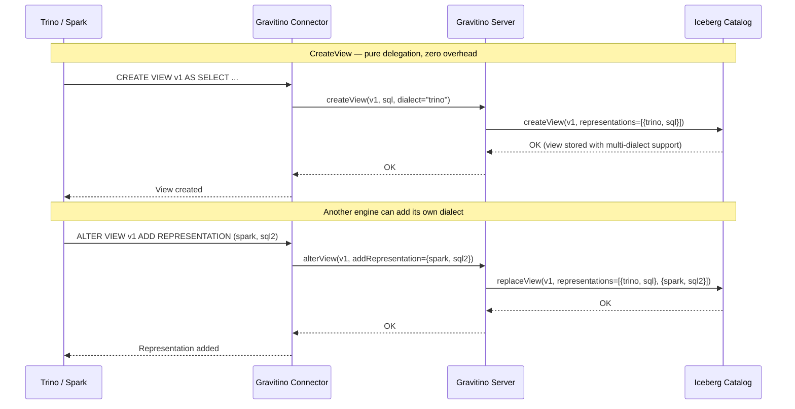
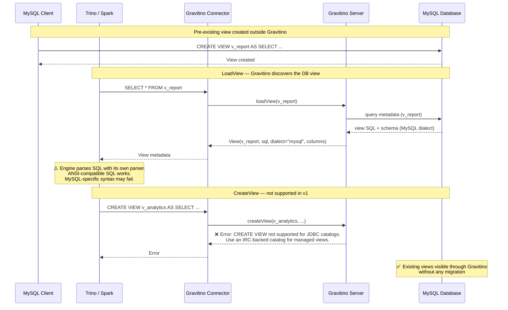
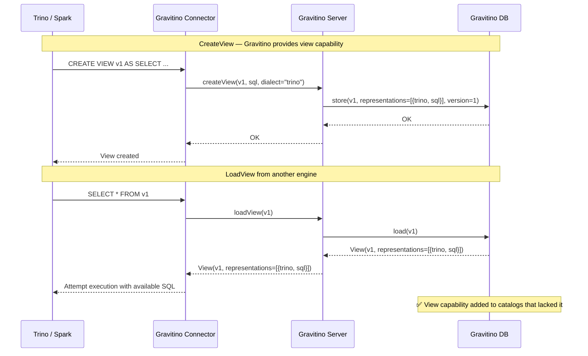
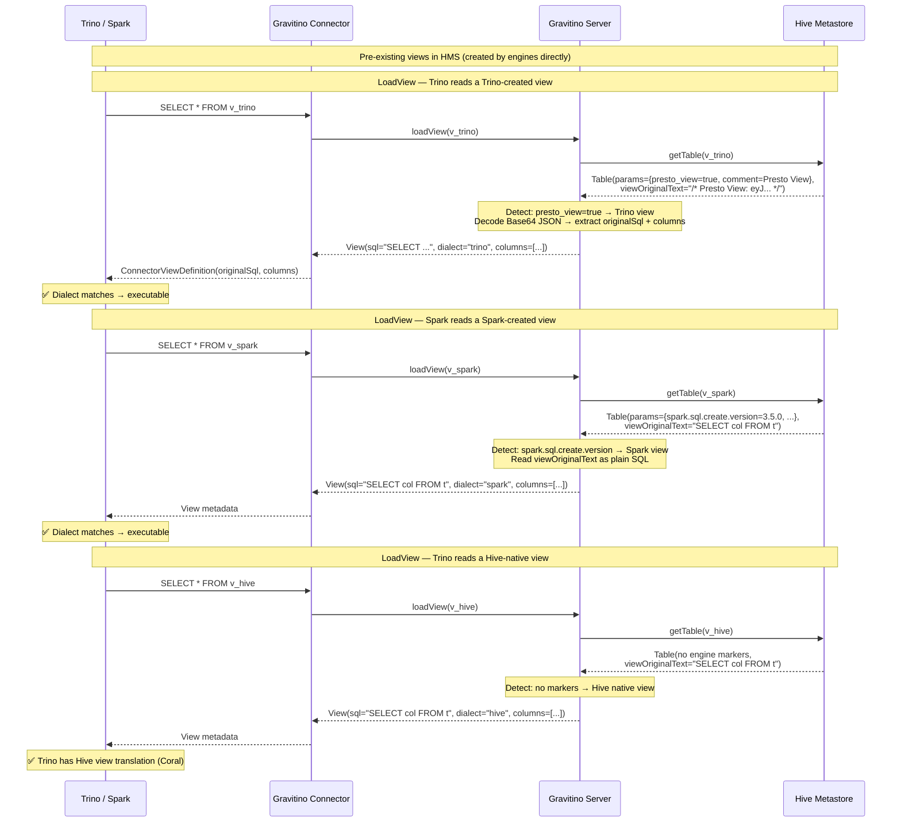
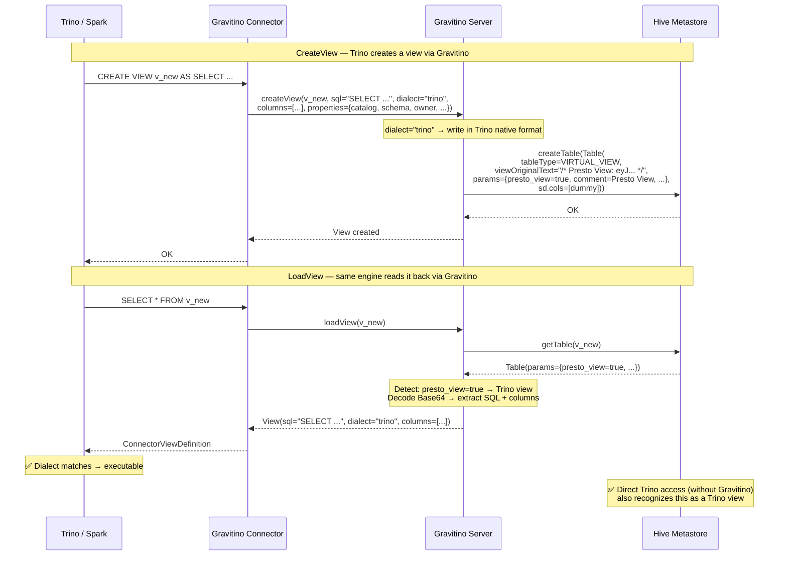
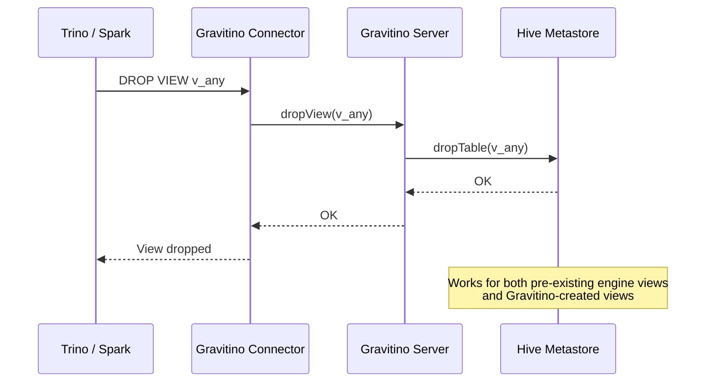

# Design of Logical View Management in Gravitino

## Background

In modern data lakehouse architectures, views serve as a fundamental abstraction for data access, security enforcement, and query simplification. Organizations leverage multiple query engines (Trino, Spark, Hive) to access the same underlying data, but view management across these heterogeneous systems presents significant challenges:

- **Portability Gap**: A view created in Trino cannot be read by Spark, and vice versa, due to differences in SQL dialects and metadata storage formats.
- **Fragmented Governance**: Views are scattered across different metastores (HMS, Iceberg REST Catalog, engine-specific stores), making unified access control and auditing difficult.
- **Inconsistent Security**: Each engine implements its own security model (definer/invoker), leading to inconsistent access control behavior across the data platform.

Apache Gravitino, as a unified metadata management system, is well-positioned to address these challenges by providing centralized view management with multi-engine compatibility.

---

## Goals

1. **Multi-Engine Compatibility**: Views managed by Gravitino are visible and manageable across engines. Multi-dialect SQL representation storage enables cross-engine view sharing.

2. **Unified View Management**: Provide standard CRUD operations for views:
   - Create view
   - Get/List views
   - Alter view (update SQL, add representations, modify properties)
   - Drop view

3. **Capability-Driven Storage Strategy**: Automatically select the optimal storage strategy based on each catalog's capabilities — no user-facing storage mode configuration needed. Gravitino transparently handles delegation, extension, and full management per catalog type.

4. **Access Control Integration**: Integrate with Gravitino's existing access control framework to provide metadata-level privileges (CREATE_VIEW, SELECT_VIEW, DROP_VIEW). Data-level access control remains the responsibility of the underlying compute engines.

5. **Audit Support**: View operations should be auditable with complete audit information.

6. **Event System Integration**: View operations should emit events for users to hook into.

---

## Non-Goals

1. **Materialized Views**: This design focuses on logical views only. Materialized views with physical storage are out of scope. We are aware of the ongoing Iceberg Materialized View effort and will take it into consideration for future work. The logical view infrastructure established here (multi-dialect representations, unified metadata model, catalog capability detection) is designed to serve as the foundation for future materialized view support.

2. **Temporary Views**: Session-scoped temporary views are managed by engines themselves and don't require persistent management.

3. **SQL Transpilation**: Gravitino will not automatically convert SQL between dialects. Users are responsible for providing correct SQL representations for each target dialect.

4. **Query Execution**: Gravitino manages view metadata only. Actual query execution is handled by the compute engines.

---

## Proposal

### Namespace

Views are registered under a specified schema in relational catalogs, following the three-level namespace hierarchy:

```
metalake
  └── catalog (relational)
        └── schema
              └── view
```

This is consistent with Gravitino's existing namespace design for tables and functions. **Views and tables share the same namespace within a schema** — a view and a table cannot have the same name under the same schema. This follows the standard behavior of most relational databases (MySQL, PostgreSQL, Hive, etc.).

---

### View Metadata Model

#### Core View Structure

```
View
├── name: string                          # View name (unique within schema, shared namespace with tables)
├── comment: string                       # Optional description
├── columns: array<ViewColumn>            # View schema definition
│   └── ViewColumn
│       ├── name: string
│       ├── type: DataType
│       └── comment: string (optional)
├── representations: array<Representation>    # Multi-dialect view definitions (one per dialect)
│   └── Representation
│       ├── type: string                      # Representation type, currently only "sql"
│       └── SQLRepresentation (type="sql")
│           ├── dialect: string               # e.g., "trino", "spark", "hive" (unique within a view)
│           ├── sql: string                   # The view definition SQL
│           ├── defaultCatalog: string        # Default catalog for unqualified refs
│           └── defaultSchema: string         # Default schema for unqualified refs
├── securityMode: enum                    # DEFINER | INVOKER
├── properties: map<string, string>       # Extensible key-value properties
└── auditInfo: AuditInfo                  # Creation/modification timestamps and users
```

**Field Details:**

- **columns**: The view's output schema definition. Required.
  - Typically provided by the engine connector, not by users directly — when a user executes `CREATE VIEW AS SELECT ...`, the engine infers the output schema and passes it to Gravitino.
  - Gravitino does not parse SQL or validate column-SQL consistency. Mismatches surface at query time in the engine.
  - Not auto-updated when underlying table schemas change — users must explicitly alter the view.

- **representations**: The multi-dialect definitions of a view. At least one required; each dialect unique per view.
  - Designed for extensibility via a `type` field. Currently only `type="sql"` (`SQLRepresentation`) is defined.
  - Future versions may introduce other representation types (e.g., dataframe-based definitions) without breaking the existing model.

- **dialect**: A free-form string identifying the SQL dialect (e.g., `"trino"`, `"spark"`, `"hive"`, `"flink"`).
  - Not a fixed enum — new dialects can be added without API changes.
  - Gravitino provides a set of standard dialect constants (e.g., `Dialects.TRINO`, `Dialects.SPARK`) for engine connectors to use, reducing the risk of typos while preserving extensibility.
  - Engine connectors use this value to locate the appropriate representation when loading a view.

- **defaultCatalog / defaultSchema**: The catalog and schema context in which the SQL was authored. Optional, per-representation.
  - Used by engines to resolve unqualified table references (e.g., `FROM orders` → `FROM defaultCatalog.defaultSchema.orders`).
  - View SQL may contain cross-catalog references (e.g., `catalog_a.schema.table JOIN catalog_b.schema.table`). The SQL is stored as-is; neither Gravitino, the IRC, nor the HMS validates, rewrites, or transforms view SQL at any point. The compute engine is responsible for resolving and executing cross-catalog queries at runtime.

- **securityMode**: Declares the security execution model of the view. This is a metadata property stored by Gravitino and **passed through to the compute engine** — Gravitino does not enforce it. Whether it takes effect depends on the engine's capability (e.g., MySQL natively supports DEFINER/INVOKER; Iceberg and Hive do not).
  - `DEFINER`: the engine should execute the view query with the view owner's privileges.
  - `INVOKER`: the engine should execute the view query with the querying user's privileges.

### Capability-Driven Storage Strategy

The storage strategy is driven by what users actually care about, rather than exposing implementation details:

1. **Usability** — Can I create and manage views through Gravitino, regardless of the underlying catalog?
2. **Multi-engine** — Can my views be used by Spark, Trino, and Flink simultaneously?
3. **Interoperability** — Can I see pre-existing views in the underlying catalog? Can views created via Gravitino be seen by other tools that access the underlying catalog directly?

Rather than exposing catalog differences to users via a storage mode configuration, Gravitino automatically selects the optimal strategy based on each catalog's native view capability. Catalogs fall into the following tiers:

- **Full view support** (Iceberg, Paimon) — Natively support multi-dialect view storage and CRUD operations.
- **Single-dialect view support** (HMS) — Can store views, but each engine uses its own private format within the same `VIRTUAL_VIEW` storage. Gravitino provides format-aware delegation to normalize these differences.
- **Native multi-dialect + legacy single-dialect** (Glue) — Glue natively supports multi-dialect views through its Data Catalog view API (available since Glue 5.0) with ATHENA/REDSHIFT/SPARK dialects; it also contains legacy `VIRTUAL_VIEW` entries created by engines through the HMS-compatible path. Gravitino handles both. See [Glue View Considerations](#glue-view-considerations) for details.
- **Read-only view support** (JDBC catalogs) — Can store views, but engine dialect mismatch makes write operations impractical. Gravitino provides read-only discovery in v1.
- **No view support** (Hudi, Generic/Delta/Lance, etc.) — Do not support view operations at all.

The table below maps each tier to the corresponding storage strategy:

| Catalog Type | Strategy | Description |
|-------------|----------|-------------|
| **Iceberg** | Complete delegation | All CRUD delegated to Iceberg catalog (native multi-dialect support) |
| **Paimon** | Complete delegation | All CRUD delegated to Paimon catalog (native multi-dialect support, Hive/REST backends) |
| **HMS** | Format-aware delegation | Gravitino detects engine-specific formats, normalizes view definitions, and writes new views in engine-native format (see [HMS View Behavior](#hms-view-behavior)) |
| **Glue** | Format-aware delegation | Glue has two view storage mechanisms: native Data Catalog view (`ViewDefinition` API, multi-dialect) and legacy `VIRTUAL_VIEW` (Hive-compatible, single-dialect). Gravitino detects the storage mechanism first, then applies engine dialect detection within each (see [Glue View Considerations](#glue-view-considerations)) |
| **JDBC** (MySQL, PostgreSQL, Doris, StarRocks, etc.) | Read-only discovery (v1) | Pre-existing database views are auto-discovered and exposed through Gravitino; CREATE VIEW not supported in v1 (future enhancement) |
| **Catalogs without native view support** (Hudi, Generic/Delta/Lance, etc.) | Fully Gravitino-managed | All view metadata stored in Gravitino DB |

#### Per-Catalog CRUD Behavior

For **complete delegation** catalogs (Iceberg, Paimon), all operations are delegated to the underlying catalog. Gravitino's role: pure proxy + privilege control + event audit, consistent with Table architecture.

For **fully Gravitino-managed** catalogs (Hudi, Generic/Delta/Lance, etc.), all operations are handled by Gravitino DB.

For **format-aware delegation** catalogs:

- **HMS** — All views are stored as `VIRTUAL_VIEW`; Gravitino detects the creating engine and normalizes the view definition. See [HMS View Behavior](#hms-view-behavior) for details.
- **Glue** — Two view storage mechanisms coexist: native Data Catalog view (multi-dialect) and legacy `VIRTUAL_VIEW` (Hive-compatible). Gravitino detects the mechanism on load and selects the appropriate one on create. See [Glue View Considerations](#glue-view-considerations) for details. Note: Glue view support is not in v1 scope.

For **read-only discovery** catalogs (JDBC), behavior is as follows:

| Operation | Behavior |
|-----------|----------|
| Load | Read view metadata from underlying database via JDBC; return SQL text + schema |
| List | List all views in the underlying database |
| Create / Alter / Drop | Not supported in v1; return clear error directing users to IRC-backed catalogs |

> **JDBC View Column Discovery:** For JDBC catalogs, view column information is discovered via query-based introspection (`SELECT * FROM <view> WHERE 1=0`) using `ResultSetMetaData`, rather than `DatabaseMetaData.getColumns()`. This ensures computed and expression columns are correctly captured in the view schema.

#### Sequence Diagrams

The following diagrams illustrate how each strategy works in practice, highlighting the key benefits: existing views remain visible, and the existing ecosystem continues to work without disruption. In addition to engine connectors, data platforms can also create and manage views with any dialect directly through Gravitino's REST API, without depending on a specific query engine.

**1. Complete Delegation (Iceberg)**

Gravitino acts as a pure proxy. All operations delegated to the Iceberg catalog, which natively supports multi-dialect view storage.



**2. Format-Aware Delegation (HMS)**

See the [HMS View Behavior](#hms-view-behavior) section below for detailed sequence diagrams and behavior specification.

**3. Read-Only Discovery (JDBC — e.g., MySQL) [v1]**

Engines cannot natively issue view DDL against JDBC data sources. In v1, Gravitino provides read-only discovery of pre-existing database views. CREATE VIEW against JDBC catalogs is not supported; users needing managed views should use IRC-backed catalogs.



**4. Fully Gravitino-Managed (Hudi, Delta, etc.)**

For catalogs without any native view support, Gravitino provides full view capability — a feature that didn't exist before.



---

### View Metadata Storage

View metadata is stored in Gravitino's relational database. Depending on the catalog type, the DB may store full view metadata (catalogs without native view support). For complete delegation catalogs (Iceberg, Paimon) and format-aware delegation catalogs (HMS, Glue), the underlying metastore is the source of truth for view definitions. Gravitino DB still maintains view metadata references for access control and audit purposes. For JDBC catalogs (read-only discovery in v1), the underlying database is the source of truth.

#### view_meta table

The main table stores view-level metadata that is version-independent.

```sql
CREATE TABLE IF NOT EXISTS `view_meta` (
    `view_id` BIGINT(20) UNSIGNED NOT NULL COMMENT 'view id',
    `view_name` VARCHAR(128) NOT NULL COMMENT 'view name',
    `metalake_id` BIGINT(20) UNSIGNED NOT NULL COMMENT 'metalake id',
    `catalog_id` BIGINT(20) UNSIGNED NOT NULL COMMENT 'catalog id',
    `schema_id` BIGINT(20) UNSIGNED NOT NULL COMMENT 'schema id',
    `audit_info` MEDIUMTEXT NOT NULL COMMENT 'view audit info (JSON)',
    `current_version` INT UNSIGNED NOT NULL DEFAULT 1 COMMENT 'current version pointer',
    `latest_version` INT UNSIGNED NOT NULL DEFAULT 1 COMMENT 'latest version number',
    `deleted_at` BIGINT(20) UNSIGNED NOT NULL DEFAULT 0 COMMENT 'soft delete timestamp',
    PRIMARY KEY (`view_id`),
    UNIQUE KEY `uk_sid_vn_del` (`schema_id`, `view_name`, `deleted_at`),
    KEY `idx_mid` (`metalake_id`),
    KEY `idx_cid` (`catalog_id`)
) ENGINE=InnoDB DEFAULT CHARSET=utf8mb4 COLLATE=utf8mb4_bin COMMENT 'view metadata';
```

#### view_version_info table

Each alter operation creates a new version. The version table stores version-specific metadata including comment, columns snapshot, properties, representations, and audit info. Representations are stored as a JSON array.

```sql
CREATE TABLE IF NOT EXISTS `view_version_info` (
    `id` BIGINT(20) UNSIGNED NOT NULL AUTO_INCREMENT COMMENT 'auto increment id',
    `metalake_id` BIGINT(20) UNSIGNED NOT NULL COMMENT 'metalake id',
    `catalog_id` BIGINT(20) UNSIGNED NOT NULL COMMENT 'catalog id',
    `schema_id` BIGINT(20) UNSIGNED NOT NULL COMMENT 'schema id',
    `view_id` BIGINT(20) UNSIGNED NOT NULL COMMENT 'view id',
    `version` INT UNSIGNED NOT NULL COMMENT 'view version',
    `view_comment` TEXT DEFAULT NULL COMMENT 'version-specific comment',
    `columns` MEDIUMTEXT NOT NULL COMMENT 'view columns definition snapshot (JSON)',
    `properties` MEDIUMTEXT DEFAULT NULL COMMENT 'view properties (JSON)',
    `security_mode` VARCHAR(32) NOT NULL DEFAULT 'DEFINER' COMMENT 'DEFINER or INVOKER, immutable in V1',
    `representations` MEDIUMTEXT NOT NULL COMMENT 'SQL representations (JSON array)',
    `audit_info` MEDIUMTEXT NOT NULL COMMENT 'version audit info (JSON)',
    `deleted_at` BIGINT(20) UNSIGNED NOT NULL DEFAULT 0 COMMENT 'soft delete timestamp',
    PRIMARY KEY (`id`),
    UNIQUE KEY `uk_vid_ver_del` (`view_id`, `version`, `deleted_at`),
    KEY `idx_mid` (`metalake_id`),
    KEY `idx_cid` (`catalog_id`),
    KEY `idx_sid` (`schema_id`)
) ENGINE=InnoDB DEFAULT CHARSET=utf8mb4 COLLATE=utf8mb4_bin COMMENT 'view version info';
```

---

### HMS View Behavior

HMS (Hive Metastore) requires special handling because different query engines store views in HMS using **incompatible private formats**. Unlike IRC (which has a standardized view API), HMS is a raw metadata store where the view format depends entirely on which engine created the view. Gravitino implements **format-aware delegation** to normalize these differences.

#### Engine Detection Mechanism

When reading a view from HMS (`tableType = "VIRTUAL_VIEW"`), Gravitino identifies the creating engine by checking HMS `Table.parameters` in the following priority order:

| Priority | Condition | Engine | SQL Extraction | Schema Extraction |
|----------|-----------|--------|----------------|-------------------|
| 1 | `presto_view = "true"` AND `comment` ≈ `"Presto View"` | Trino | Decode Base64 JSON blob from `viewOriginalText` → `originalSql` field | From Base64 JSON blob → `columns` field |
| 2 | `spark.sql.create.version` exists | Spark | `viewOriginalText` (Spark SQL) | `sd.cols`, or `spark.sql.sources.schema` property if `sd.cols` is empty |
| 3 | `is_generic = "true"` AND `flink.schema.0.name` exists | Flink | `viewOriginalText` (Flink SQL) | Deserialized from `flink.schema.N.name` / `flink.schema.N.data-type` properties |
| 4 | None of the above | Hive (native) | `viewOriginalText` or `viewExpandedText` (HiveQL) | `sd.cols` |

> **Source code references**: Detection conditions are verified against engine source code — Trino's `ViewReaderUtil.isTrinoView()`, Spark's `HiveExternalCatalog` properties, and Flink's `HiveTableUtil.isHiveTable()`.

#### CRUD Behavior

| Operation | Behavior |
|-----------|----------|
| **LoadView** | Read HMS table → detect engine via priority chain above → extract SQL, schema, dialect → return standardized Gravitino View definition |
| **ListViews** | List all `VIRTUAL_VIEW` entries from HMS → classify each by detection chain → return with dialect info |
| **CreateView** | Write to HMS in the creating engine's native format (see [CreateView Format](#createview-format) below) |
| **AlterView** | Update the HMS table entry; maintain the original engine format. v1 supports alter only for Gravitino-created views. |
| **DropView** | Delegate to HMS — drop the HMS table entry |

#### CreateView Format

When a view is created through Gravitino (e.g., Trino user runs `CREATE VIEW` via Gravitino connector), it is written to HMS **in the creating engine's native format**, ensuring that engines connecting directly to HMS can also recognize and execute the view.

| Dialect | HMS Format | Key Properties | viewOriginalText |
|---------|-----------|---------------|-----------------|
| `trino` | Trino native | `presto_view=true`, `comment=Presto View`, `trino_created_by`, `trino_version` | `/* Presto View: <Base64(JSON)> */` |
| `spark` | Spark native | `spark.sql.create.version`, `view.query.out.numCols`, `view.query.out.col.N` | Plain Spark SQL text |
| `hive` | Hive native | No special properties | Plain HiveQL text |
| `flink` | Flink native (v1.1) | `is_generic=true`, `flink.schema.N.name`, `flink.schema.N.data-type` | Plain Flink SQL text |

**Implementation note:** The Gravitino engine connector must pass sufficient metadata (beyond just SQL text and columns) for the HMS catalog provider to reconstruct the engine-native format. For example, the Trino connector needs to pass the `ConnectorViewDefinition` fields (`catalog`, `schema`, `owner`, `runAsInvoker`) as view properties, which the HMS provider uses to build the Base64 JSON blob.

**v1 limitation:** Each HMS view stores exactly one dialect — the dialect of the creating engine. Multi-dialect views in HMS are not supported in v1. For multi-dialect view support, use IRC-backed catalogs.

> **Note on format-level detection:** In HMS, the view storage format is always `VIRTUAL_VIEW` — the only variable is which engine created it (Trino, Spark, Hive, Flink). Therefore, engine detection alone is sufficient. This is different from Glue, where two distinct view storage mechanisms coexist (Data Catalog view and legacy `VIRTUAL_VIEW`), requiring an additional format-level detection step before engine detection. See [Glue View Considerations](#glue-view-considerations).

#### Sequence Diagrams

**LoadView — Reading pre-existing engine views**



**CreateView — Engine creates a new view through Gravitino**



**DropView**



#### Compatibility Matrix

| HMS View Source | Read via Gravitino (same engine) | Read via Gravitino (different engine) | Read via direct HMS (without Gravitino) |
|----------------|--------------------------------|--------------------------------------|----------------------------------------|
| **Trino-created** (pre-existing) | ✅ Base64 decoded, dialect matches | ⚠️ SQL extracted as plain text; ANSI SQL may work | ✅ Trino recognizes natively |
| **Spark-created** (pre-existing) | ✅ SQL read directly, dialect matches | ⚠️ Simple SQL may be compatible | ✅ Spark recognizes natively |
| **Hive-native** (pre-existing) | ✅ Engines have Hive translation | ✅ HiveQL widely compatible | ✅ Hive recognizes natively |
| **Trino (via Gravitino)** | ✅ Dialect matches, fully executable | ⚠️ Depends on SQL compatibility | ✅ Written in Trino native format |
| **Spark (via Gravitino)** | ✅ Dialect matches, fully executable | ⚠️ Depends on SQL compatibility | ✅ Written in Spark native format |

#### Phased Implementation

| Phase | Scope |
|-------|-------|
| **v1** | LoadView (format-aware delegation for Trino, Spark, Hive views) + CreateView (engine-native format for Trino, Spark, Hive) + DropView + ListViews |
| **v1.1** | Flink view format reader/writer; AlterView for Gravitino-created views |
| **v2** | Glue view support: Data Catalog view read/write for ATHENA/REDSHIFT/SPARK dialects + legacy `VIRTUAL_VIEW` handling (pending Glue catalog `ViewCatalog` interface) |
| **Future** | Multi-dialect extension model |

---

### Glue View Considerations

AWS Glue Data Catalog is a multi-format catalog (Hive, Iceberg, Delta, Parquet tables coexist) that supports two distinct view storage mechanisms. This section describes how Gravitino will handle views in Glue when the Glue catalog `ViewCatalog` interface is implemented (v2 scope).

#### Two View Storage Mechanisms

1. **Data Catalog view** (Glue 5.0+, also known as Multi-Dialect View):
   - Stored via `Table.ViewDefinition` with a `Representations[]` array, where each representation contains a `Dialect` (ATHENA / REDSHIFT / SPARK), `DialectVersion`, `ViewOriginalText`, and `ViewExpandedText`.
   - Identified by `Table.IsMultiDialectView = true`.
   - Enforces DEFINER security semantics via AWS Lake Formation — only `PROTECTED` views are supported.
   - Natively multi-dialect: a single view can store SQL representations for multiple supported dialects.
   - Limitations: cannot reference other views; cannot reference cross-account tables; max 10 representations for input; only 3 dialects supported (ATHENA, REDSHIFT, SPARK).

2. **Legacy `VIRTUAL_VIEW`** (Hive-compatible):
   - Identical to HMS view storage: `TableType = VIRTUAL_VIEW` with `ViewOriginalText` / `ViewExpandedText` fields and engine-specific properties.
   - Created by engines that interact with Glue through the HMS-compatible Thrift endpoint or engines that write Hive-format metadata via the Glue SDK directly (e.g., Trino's `GlueHiveMetastore`).
   - Each view stores exactly one dialect in the creating engine's private format.

#### How Engines Create Views in Glue

Different engines use different mechanisms depending on their integration path with Glue:

| Engine / Context | View Storage Mechanism | Dialect | Integration Path |
|---|---|---|---|
| Athena (Data Catalog view syntax) | Data Catalog view | `ATHENA` | Glue SDK (native) |
| Athena (legacy `CREATE VIEW` syntax) | Legacy `VIRTUAL_VIEW` | N/A (Presto format) | Glue SDK (HMS-compatible) |
| Redshift | Data Catalog view | `REDSHIFT` | Glue SDK (native) |
| Spark on Glue 5.0 / EMR Serverless (Data Catalog view syntax) | Data Catalog view | `SPARK` | Glue SDK (native) |
| Spark on EMR / standalone (regular `CREATE VIEW`) | Legacy `VIRTUAL_VIEW` | N/A (Spark format) | HMS-compatible Thrift |
| Trino (`hive.metastore=glue`) | Legacy `VIRTUAL_VIEW` | N/A (Presto/Trino format) | Glue SDK (HMS-compatible) |

#### Planned CRUD Behavior

| Operation | Behavior |
|-----------|----------|
| **LoadView** | Read Glue table → check `IsMultiDialectView` flag → if `true`: parse `ViewDefinition.Representations[]` and map to Gravitino view representations; if `false`: apply the same engine detection chain as [HMS View Behavior](#hms-view-behavior) |
| **ListViews** | List all Glue tables where `TableType = VIRTUAL_VIEW` or `IsMultiDialectView = true` → classify each → return with dialect info |
| **CreateView** | For dialects supported by Data Catalog view (ATHENA/REDSHIFT/SPARK): write via `ViewDefinition` API as a Data Catalog view. For other dialects (e.g., Trino, Hive): write as legacy `VIRTUAL_VIEW` in engine-native format (same logic as HMS) |
| **DropView** | Delegate to Glue — delete the Glue table entry |

> **Open question:** CreateView with Data Catalog view API requires Lake Formation integration (DEFINER + PROTECTED). If the target Glue catalog does not have Lake Formation configured, should Gravitino fall back to legacy `VIRTUAL_VIEW` for all dialects, or return an error for ATHENA/REDSHIFT/SPARK dialects?

---

### API Design

#### REST API

##### Create View

```
POST /api/metalakes/{metalake}/catalogs/{catalog}/schemas/{schema}/views
```

**Request Body:**

```json
{
  "name": "customer_summary",
  "comment": "Aggregated customer data view",
  "columns": [
    {"name": "customer_id", "type": "bigint", "comment": "Customer identifier"},
    {"name": "total_orders", "type": "int", "comment": "Total number of orders"},
    {"name": "total_amount", "type": "decimal(18,2)", "comment": "Total order amount"}
  ],
  "representations": [
    {
      "dialect": "trino",
      "sql": "SELECT customer_id, COUNT(*) as total_orders, SUM(amount) as total_amount FROM orders GROUP BY customer_id",
      "defaultCatalog": "iceberg_prod",
      "defaultSchema": "sales"
    },
    {
      "dialect": "spark",
      "sql": "SELECT customer_id, COUNT(*) as total_orders, SUM(amount) as total_amount FROM orders GROUP BY customer_id",
      "defaultCatalog": "iceberg_prod",
      "defaultSchema": "sales"
    }
  ],
  "securityMode": "DEFINER",
  "properties": {
    "description": "Customer order summary for analytics"
  }
}
```

**Response:** `200 OK` with the created view object.

##### Get View

```
GET /api/metalakes/{metalake}/catalogs/{catalog}/schemas/{schema}/views/{view}
```

**Response:**

```json
{
  "name": "customer_summary",
  "comment": "Aggregated customer data view",
  "columns": [...],
  "representations": [...],
  "securityMode": "...",
  "properties": {...},
  "auditInfo": {
    "creator": "admin",
    "createTime": "2026-01-31T10:00:00Z",
    "lastModifier": "admin",
    "lastModifiedTime": "2026-01-31T10:00:00Z"
  }
}
```

##### List Views

```
GET /api/metalakes/{metalake}/catalogs/{catalog}/schemas/{schema}/views
```

**Response:**

```json
{
  "identifiers": [
    {"namespace": ["catalog", "schema"], "name": "customer_summary"},
    {"namespace": ["catalog", "schema"], "name": "order_details"}
  ]
}
```

##### Alter View

Alter View supports fine-grained modification operations, following the same `ViewChange` pattern as `TableChange` and `FunctionChange`. Multiple changes can be submitted in a single request and are applied atomically.

**Supported change types:**

| Change Type | Description | Notes |
|------------|-------------|-------|
| `rename` | Rename the view | Also renames in the underlying catalog if delegated |
| `updateComment` | Update view comment | |
| `setProperty` | Set a view property | |
| `removeProperty` | Remove a view property | |
| `addRepresentation` | Add a new dialect representation | If the dialect matches the underlying catalog's native dialect, the operation is also delegated to the underlying catalog |
| `updateRepresentation` | Update SQL for an existing dialect | If the dialect matches the underlying catalog's native dialect, the update is also synced to the underlying catalog |
| `removeRepresentation` | Remove a dialect representation | Delegated to the underlying catalog if dialect matches; removing the last representation is prohibited — use `dropView` instead |

**Versioning behavior**: Every alter operation internally creates a new version in storage (comment, columns snapshot, and all representations are captured as a new version). This is transparent to the user in V1 — no version management API is exposed. Future versions may add `listVersions` / `rollbackToVersion` capabilities.

```
PUT /api/metalakes/{metalake}/catalogs/{catalog}/schemas/{schema}/views/{view}
```

**Request Body:**

```json
{
  "updates": [
    {
      "@type": "updateComment",
      "newComment": "Updated customer summary view"
    },
    {
      "@type": "addRepresentation",
      "representation": {
        "dialect": "hive",
        "sql": "SELECT customer_id, COUNT(*) as total_orders, SUM(amount) as total_amount FROM orders GROUP BY customer_id",
        "defaultCatalog": "hive_prod",
        "defaultSchema": "sales"
      }
    },
    {
      "@type": "updateRepresentation",
      "dialect": "trino",
      "newSql": "SELECT customer_id, COUNT(*) as total_orders, SUM(amount) as total_amount, MAX(order_date) as last_order FROM orders GROUP BY customer_id"
    },
    {
      "@type": "removeRepresentation",
      "dialect": "spark"
    },
    {
      "@type": "setProperty",
      "property": "key",
      "value": "value"
    },
    {
      "@type": "removeProperty",
      "property": "key"
    }
  ]
}
```

##### Drop View

```
DELETE /api/metalakes/{metalake}/catalogs/{catalog}/schemas/{schema}/views/{view}
```

**Response:** `200 OK`

---

#### Java API

```java
// Get ViewCatalog interface from catalog
ViewCatalog viewCatalog = catalog.asViewCatalog();

// Create a view with multiple dialect representations
View view = viewCatalog.createView(
    NameIdentifier.of("analytics_schema", "customer_summary"),
    ViewBuilder.builder()
        .withComment("Aggregated customer data view")
        .withColumn("customer_id", Types.LongType.get(), "Customer identifier")
        .withColumn("total_orders", Types.IntegerType.get(), "Total number of orders")
        .withColumn("total_amount", Types.DecimalType.of(18, 2), "Total order amount")
        .withRepresentation(
            SQLRepresentation.builder()
                .withDialect("trino")
                .withSql("SELECT customer_id, COUNT(*) as total_orders, SUM(amount) as total_amount FROM orders GROUP BY customer_id")
                .withDefaultCatalog("iceberg_prod")
                .withDefaultSchema("sales")
                .build())
        .withRepresentation(
            SQLRepresentation.builder()
                .withDialect("spark")
                .withSql("SELECT customer_id, COUNT(*) as total_orders, SUM(amount) as total_amount FROM orders GROUP BY customer_id")
                .withDefaultCatalog("iceberg_prod")
                .withDefaultSchema("sales")
                .build())
        .withSecurityMode(SecurityMode.DEFINER)
        .withProperty("description", "Customer order summary for analytics")
        .build());

// Get a view
View gotView = viewCatalog.loadView(NameIdentifier.of("analytics_schema", "customer_summary"));

// Get SQL for specific dialect
Optional<SQLRepresentation> trinoSql = gotView.getRepresentation("trino");

// List views in a schema
NameIdentifier[] views = viewCatalog.listViews(Namespace.of("analytics_schema"));

// Alter a view - add new representation
ViewChange[] changes = {
    ViewChange.addRepresentation(
        SQLRepresentation.builder()
            .withDialect("hive")
            .withSql("SELECT customer_id, COUNT(*) as total_orders, SUM(amount) as total_amount FROM orders GROUP BY customer_id")
            .withDefaultCatalog("hive_prod")
            .withDefaultSchema("sales")
            .build()),
    ViewChange.updateComment("Updated customer summary view")
};
View alteredView = viewCatalog.alterView(
    NameIdentifier.of("analytics_schema", "customer_summary"), 
    changes);

// Drop a view
boolean dropped = viewCatalog.dropView(NameIdentifier.of("analytics_schema", "customer_summary"));
```

#### Python API

```python
from gravitino import NameIdentifier, Namespace
from gravitino.api.view import SQLRepresentation, SecurityMode

# Get ViewCatalog interface
view_catalog = catalog.as_view_catalog()

# Create a view
view = view_catalog.create_view(
    ident=NameIdentifier.of("analytics_schema", "customer_summary"),
    comment="Aggregated customer data view",
    columns=[
        {"name": "customer_id", "type": "bigint", "comment": "Customer identifier"},
        {"name": "total_orders", "type": "int", "comment": "Total number of orders"},
        {"name": "total_amount", "type": "decimal(18,2)", "comment": "Total order amount"},
    ],
    representations=[
        SQLRepresentation(
            dialect="trino",
            sql="SELECT customer_id, COUNT(*) as total_orders, SUM(amount) as total_amount FROM orders GROUP BY customer_id",
            default_catalog="iceberg_prod",
            default_schema="sales"
        ),
        SQLRepresentation(
            dialect="spark",
            sql="SELECT customer_id, COUNT(*) as total_orders, SUM(amount) as total_amount FROM orders GROUP BY customer_id",
            default_catalog="iceberg_prod",
            default_schema="sales"
        ),
    ],
    security_mode=SecurityMode.DEFINER,
    properties={"description": "Customer order summary for analytics"}
)

# Get a view
got_view = view_catalog.load_view(NameIdentifier.of("analytics_schema", "customer_summary"))

# Get SQL for specific dialect
trino_sql = got_view.get_representation("trino")

# List views
views = view_catalog.list_views(Namespace.of("analytics_schema"))

# Alter a view
from gravitino.api.view import ViewChange

altered_view = view_catalog.alter_view(
    NameIdentifier.of("analytics_schema", "customer_summary"),
    ViewChange.add_representation(
        SQLRepresentation(
            dialect="hive",
            sql="SELECT customer_id, COUNT(*) as total_orders, SUM(amount) as total_amount FROM orders GROUP BY customer_id",
            default_catalog="hive_prod",
            default_schema="sales"
        )
    ),
    ViewChange.update_comment("Updated customer summary view")
)

# Drop a view
dropped = view_catalog.drop_view(NameIdentifier.of("analytics_schema", "customer_summary"))
```

---

### View Privileges

Gravitino defines the following privileges for view management, integrated with the existing access control framework:

| Privilege | Description |
|-----------|-------------|
| `CREATE_VIEW` | Permission to create views in a schema |
| `SELECT_VIEW` | Permission to read view metadata and use the view |
| `ALTER_VIEW` | Permission to modify view definition |
| `DROP_VIEW` | Permission to delete a view |

**Permission Requirements:**

| Operation | Required Privileges |
|-----------|-------------------|
| Create View | `USE_CATALOG` on catalog + `USE_SCHEMA` on schema + `CREATE_VIEW` on schema |
| Read View | `USE_CATALOG` on catalog + `USE_SCHEMA` on schema + `SELECT_VIEW` on view |
| Alter View | `USE_CATALOG` on catalog + `USE_SCHEMA` on schema + `ALTER_VIEW` on view |
| Drop View | `USE_CATALOG` on catalog + `USE_SCHEMA` on schema + `DROP_VIEW` on view |

> **Note:** These privileges control access to view **metadata** in Gravitino. Access to the **underlying data** when executing view queries is controlled by the compute engine and underlying catalog's permission system.

> **Relationship with `securityMode`**: The `securityMode` field (DEFINER/INVOKER) is a metadata property stored by Gravitino but enforced by the compute engine at query execution time. Whether it takes effect depends on engine capability — for example, MySQL natively supports DEFINER/INVOKER semantics, while Iceberg and Hive do not. For engines without native support, the field serves as a metadata annotation only. In summary: View Privileges govern *who can manage view metadata through Gravitino*, while `securityMode` governs *how the engine accesses underlying data when executing the view* (subject to engine support).

---

### Engine Adaptation

#### Trino Integration

Gravitino's Trino connector implements the view-related interfaces in [`ConnectorMetadata`](https://github.com/trinodb/trino/blob/480/core/trino-spi/src/main/java/io/trino/spi/connector/ConnectorMetadata.java#L957):

```java
public class GravitinoConnectorMetadata implements ConnectorMetadata {
    
    @Override
    public void createView(
            ConnectorSession session,
            SchemaTableName viewName,
            ConnectorViewDefinition definition,
            boolean replace) {
        // Convert Trino's ConnectorViewDefinition to Gravitino View
        // Store with dialect="trino"
        ViewBuilder builder = ViewBuilder.builder()
            .withRepresentation(
                SQLRepresentation.builder()
                    .withDialect("trino")
                    .withSql(definition.getOriginalSql())
                    .withDefaultCatalog(definition.getCatalog().orElse(null))
                    .withDefaultSchema(definition.getSchema().orElse(null))
                    .build())
            .withSecurityMode(definition.isRunAsInvoker() 
                        ? SecurityMode.INVOKER 
                        : SecurityMode.DEFINER);
        
        // Add columns
        for (ViewColumn col : definition.getColumns()) {
            builder.withColumn(col.getName(), convertType(col.getType()), col.getComment());
        }
        
        viewCatalog.createView(toNameIdentifier(viewName), builder.build());
    }
    
    @Override
    public Optional<ConnectorViewDefinition> getView(
            ConnectorSession session,
            SchemaTableName viewName) {
        View view = viewCatalog.loadView(toNameIdentifier(viewName));
        
        // Get Trino-specific representation
        Optional<SQLRepresentation> representation = view.getRepresentation("trino");
        if (representation.isEmpty()) {
            throw new TrinoException(NOT_SUPPORTED, 
                "View has no Trino SQL representation; use ALTER VIEW to add one");
        }
        
        return representation.map(rep -> new ConnectorViewDefinition(
            rep.getSql(),
            Optional.ofNullable(rep.getDefaultCatalog()),
            Optional.ofNullable(rep.getDefaultSchema()),
            convertColumns(view.getColumns()),
            Optional.ofNullable(view.getComment()),
            Optional.empty(), // owner managed via Gravitino's owner_meta
            view.getSecurityMode() == SecurityMode.INVOKER
        ));
    }
    
    @Override
    public List<SchemaTableName> listViews(ConnectorSession session, Optional<String> schemaName) {
        // List views from Gravitino
    }
    
    @Override
    public void dropView(ConnectorSession session, SchemaTableName viewName) {
        viewCatalog.dropView(toNameIdentifier(viewName));
    }
}
```

#### Spark Integration

Gravitino's Spark connector implements the [`ViewCatalog`](https://github.com/apache/spark/blob/v4.1.1/sql/catalyst/src/main/java/org/apache/spark/sql/connector/catalog/ViewCatalog.java) interface:

```java
public class GravitinoSparkCatalog implements ViewCatalog {
    
    @Override
    public View createView(
            Identifier ident,
            String sql,
            String currentCatalog,
            String[] currentNamespace,
            StructType schema,
            String[] queryColumnNames,
            String[] columnAliases,
            String[] columnComments,
            Map<String, String> properties) throws ViewAlreadyExistsException {
        
        // Convert Spark view to Gravitino View
        ViewBuilder builder = ViewBuilder.builder()
            .withRepresentation(
                SQLRepresentation.builder()
                    .withDialect("spark")
                    .withSql(sql)
                    .withDefaultCatalog(currentCatalog)
                    .withDefaultSchema(String.join(".", currentNamespace))
                    .build())
            .withProperties(properties);
        
        // Add columns from schema
        for (StructField field : schema.fields()) {
            builder.withColumn(
                field.name(), 
                convertType(field.dataType()), 
                field.getComment().orElse(null));
        }
        
        gravitinoViewCatalog.createView(toNameIdentifier(ident), builder.build());
        return loadView(ident);
    }
    
    @Override
    public View loadView(Identifier ident) throws NoSuchViewException {
        org.apache.gravitino.rel.View gravitinoView = 
            gravitinoViewCatalog.loadView(toNameIdentifier(ident));
        
        // Get Spark-specific representation
        Optional<SQLRepresentation> representation = gravitinoView.getRepresentation("spark");
        if (representation.isEmpty()) {
            // Try Hive representation as fallback (Spark is compatible with HiveQL)
            representation = gravitinoView.getRepresentation("hive");
        }
        if (representation.isEmpty()) {
            throw new NoSuchViewException("No compatible SQL representation for Spark");
        }
        
        return new GravitinoSparkView(gravitinoView, representation.get());
    }
    
    @Override
    public Identifier[] listViews(String... namespace) {
        // List views from Gravitino
    }
    
    @Override
    public boolean dropView(Identifier ident) {
        return gravitinoViewCatalog.dropView(toNameIdentifier(ident));
    }
}
```

#### Flink Integration

Gravitino's Flink connector integrates view support through Flink's [`CatalogView`](https://github.com/apache/flink/blob/release-1.20.2/flink-table/flink-table-common/src/main/java/org/apache/flink/table/catalog/CatalogView.java) API. Unlike Spark and Trino which have separate `ViewCatalog` interfaces, Flink handles views through its standard `createTable`/`getTable`/`dropTable` methods, distinguishing them via `CatalogBaseTable.TableKind`.

The key challenge is Flink's dual-query model — each view requires both an `originalQuery` (user's SQL) and an `expandedQuery` (fully-qualified SQL). Since Gravitino's view model doesn't have a dedicated expanded query field, it is stored as a view property (`flink.expanded-query`).

```java
public class GravitinoFlinkCatalog extends AbstractCatalog {

    @Override
    public List<String> listViews(String databaseName) throws DatabaseNotExistException {
        Namespace ns = Namespace.of(databaseName);
        return Arrays.stream(gravitinoViewCatalog.listViews(ns))
            .map(NameIdentifier::name)
            .collect(Collectors.toList());
    }

    @Override
    public CatalogBaseTable getTable(ObjectPath tablePath)
            throws TableNotExistException {
        // Try loading as a table first
        try {
            return super.getTable(tablePath);
        } catch (TableNotExistException e) {
            // Fall back to loading as a view
            org.apache.gravitino.rel.View gravitinoView =
                gravitinoViewCatalog.loadView(toNameIdentifier(tablePath));

            // Get Flink-specific representation
            SQLRepresentation rep = gravitinoView.getRepresentation("flink")
                .orElseThrow(() -> new TableNotExistException(
                    getName(), tablePath,
                    "View has no Flink SQL representation; use ALTER VIEW to add one"));

            String expandedQuery = gravitinoView.properties()
                .getOrDefault("flink.expanded-query", rep.sql());

            return CatalogView.of(
                convertSchema(gravitinoView.columns()),
                gravitinoView.comment(),
                rep.sql(),          // originalQuery
                expandedQuery,       // expandedQuery
                gravitinoView.properties());
        }
    }

    @Override
    public void createTable(ObjectPath path, CatalogBaseTable table,
            boolean ignoreIfExists) throws TableAlreadyExistException {
        if (table instanceof CatalogView) {
            CatalogView catalogView = (CatalogView) table;
            gravitinoViewCatalog.createView(
                toNameIdentifier(path),
                ViewBuilder.builder()
                    .withRepresentation(SQLRepresentation.builder()
                        .withDialect("flink")
                        .withSql(catalogView.getOriginalQuery())
                        .build())
                    .withComment(catalogView.getComment())
                    .withProperty("flink.expanded-query",
                        catalogView.getExpandedQuery())
                    .withColumns(convertColumns(table.getUnresolvedSchema()))
                    .build());
        } else {
            super.createTable(path, table, ignoreIfExists);
        }
    }

    @Override
    public void dropTable(ObjectPath path, boolean ignoreIfNotExists)
            throws TableNotExistException {
        // Try dropping as table first, fall back to view
        try {
            super.dropTable(path, ignoreIfNotExists);
        } catch (TableNotExistException e) {
            if (!gravitinoViewCatalog.dropView(toNameIdentifier(path))) {
                if (!ignoreIfNotExists) {
                    throw e;
                }
            }
        }
    }
}
```

---

## Development Plan

> The estimates below are high-level rough estimates intended to give an overall sense of effort at the design review stage. Detailed per-data-source prioritization and effort breakdown will be performed after the design is approved, driven by community requirements and adoption priorities.

| Phase | Task | Priority |
|-------|------|----------|
| **I. Core Infrastructure** | | |
| | View research and system design | P0 |
| | Add Java APIs for view operations | P0 |
| | Add relational storage support for views (view_meta + view_version_info) | P0 |
| | Add server-side REST implementation | P0 |
| | Java client support | P0 |
| | Python client support | P1 |
| **II. Catalog Integration** | | |
| | Iceberg catalog — complete delegation | P0 |
| | Paimon catalog — complete delegation | P2 |
| | HMS catalog — delegation | P0 |
| | JDBC catalogs (MySQL, PostgreSQL, Doris, StarRocks) — read-only discovery | P2 |
| | Cross-source merge logic and consistency strategy (lazy detection) | P2 |
| **III. Engine Adaptation** | | |
| | Trino connector ViewCatalog implementation | P0 |
| | Spark connector ViewCatalog implementation | P0 | 
| | Flink connector ViewCatalog implementation | P1 |
| **IV. Governance & Security** | | |
| | View privilege definitions | P1 |
| | Event listener support for view operations | P1 |
| **V. Documentation & UX** | | |
| | Documentation for view management | P1 |
| | UI support for view management | P2 |
