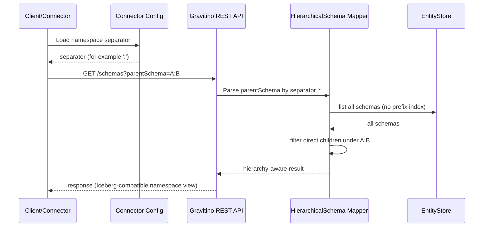

<!--
  Licensed to the Apache Software Foundation (ASF) under one
  or more contributor license agreements.  See the NOTICE file
  distributed with this work for additional information
  regarding copyright ownership.  The ASF licenses this file
  to you under the Apache License, Version 2.0 (the
  "License"); you may not use this file except in compliance
  with the License.  You may obtain a copy of the License at

   http://www.apache.org/licenses/LICENSE-2.0

  Unless required by applicable law or agreed to in writing,
  software distributed under the License is distributed on an
  "AS IS" BASIS, WITHOUT WARRANTIES OR CONDITIONS OF ANY
  KIND, either express or implied.  See the License for the
  specific language governing permissions and limitations
  under the License.
-->
# [Iceberg REST] Supported Nested Namespace Design

## Background

This document describes one practical solution to support Iceberg nested namespaces in Gravitino.
The scope is not only UI privilege granting, but also namespace mapping, identifier handling,
authorization scope, and compatibility behavior across Iceberg REST and Gravitino.

References:

- https://github.com/apache/gravitino/blob/main/docs/security/access-control.md
- https://github.com/apache/gravitino/blob/main/docs/iceberg-rest-service.md
- https://github.com/apache/gravitino/blob/main/docs/manage-relational-metadata-using-gravitino.md
- https://github.com/apache/gravitino/discussions/7296

## Goal

- Support nested namespace operations from Iceberg REST to Gravitino through schema mapping.
- Support privilege granting for different nested namespace scopes (including UI workflow).
- Keep metadata model stable and avoid heavy refactor.


## Solution Options

### Option A: Add a new metadata object `NestedNamespace`

Use a new metadata object `NestedNamespace` to represent nested namespace explicitly.
`NestedNamespace` has a one-to-one mapping with Iceberg `Namespace` to avoid ambiguity
with existing Gravitino `Namespace` concepts.

Catalog -> NestedNamespace a -> NestedNamespace a.b -> Table a.b.c
                              -> NestedNamespace a.c -> NestedNamespace a.c.d -> Table a.c.d.e

Pros:

- Clearer concept modeling.

Cons:

- Large refactor across metadata model, API, authorization, and UI.

### Option B (Recommended): Reuse `Schema` entity and enhance schema expression capability

Keep physical metadata unchanged (still persisted as `Schema`) and introduce
`HierarchicalSchema` as a logical expression layer in Iceberg REST adaptation,
identifier rendering, and authorization scope matching.

Pros:

- Low-impact evolution path without introducing a new metadata entity.
- Decouples nested namespace semantics from `.` and reduces parser ambiguity.
- Reuses existing metadata and authorization model to reduce implementation risk.

Cons:

- Requires explicit conversion rules between logical path and physical schema name.
- Authorization matching and identifier serialization become more complex.
#### Option B Separator (Fixed): Use `:` as logical separator

Examples:

- `A:B:C` as logical `HierarchicalSchema` path.
- Physical schema name remains mapped through conversion layer.

Pros:

- Better readability than escaping `.` in many clients and UI forms.
- Lower routing conflict risk than `/`.
- Easier to keep backward compatibility with existing non-nested schema handling.

Cons:

- Needs clear validation rule to avoid ambiguity with existing schema names containing `:`.

## Design

### Identifier Rules

- Introduce logical identifier concept: `HierarchicalSchema`.
- `HierarchicalSchema` uses a configurable external separator in logic/API layer.
- The external separator comes from server configuration.
- For Gravitino REST create/update schema APIs, `request.getName()` keeps the logical schema name
  and may contain `:` (for example `A:B` or `A:B:C`).
- External schema name uses configured separator representation in this design.
- Before persisting to `EntityStore`, schema path is normalized to `.`-separated physical schema
  name.
- Escaping strategy: no encoding/escaping is used in this phase.
- The configured external separator is reserved as hierarchy separator and is not allowed inside a
  single namespace segment.
- Parsing is direct split/join by configured separator at API boundary.
- Keep flat storage model and convert `HierarchicalSchema` path to physical schema name by mapping rules.
- Identifier rendering rule:
  - Use encoded `HierarchicalSchema` path directly in schema position.
  - Do not rely on single-quote wrapping for schema disambiguation in this phase.

Examples:

- Nested namespace `A:B` maps to logical `HierarchicalSchema` path `A:B` (assuming configured
  separator is `:`).
- Nested namespace `A:B:C` maps to logical `HierarchicalSchema` path `A:B:C` (assuming configured
  separator is `:`).
- Logical `HierarchicalSchema` path is then converted to physical schema name through mapping rules.
- Namespace levels `["team", "sales"]` are serialized using configured separator, e.g.
  `team:sales`.
- Parsing `team:sales` returns `["team", "sales"]` when separator is `:`.
- Identifier rendering example:
  - `metalake.catalog.A:B.table1`
  - `metalake.catalog.team:sales.table2`
- In UI display and API transport, use logical path directly (for example `A:B:C`).

### Separator Configuration

- The delimiter exposed to users (API/UI/config) is configurable.
- **Persisted schema name in `EntityStore` always uses `.` as the internal storage separator** for
  stable storage semantics.
- External request/response handling uses the configured delimiter and converts at API boundary.
- Connector-facing behavior remains Iceberg-compatible and does not require users to configure or
  input internal storage representation.

### Delimiter Validation Strategy

For configurable schema delimiters, there are two possible strategies, '.' isn't allowed:

- **Option 1: Restrict to a limited set of delimiters**
  - Delimiter values are validated against an allowlist (for example `:`, `/`, `_`).
  - This reduces ambiguity and improves consistency across catalogs and engines.

- **Option 2: Do not restrict the delimiter; any delimiter can be used**
  - Delimiter value is treated as an arbitrary string from configuration.
  - This gives maximum flexibility but may introduce cross-catalog behavior differences.

These two options also lead to different behaviors when creating new tables (and auto-creating
schema paths):

- **Under Option 1**
  - Only Iceberg path parsing can create nested schemas using the configured delimiter.
  - Before persisting to `EntityStore`, parsed namespace path is normalized to `.`-separated schema
    names.
  - Hive schema names containing the configured delimiter are rejected as invalid schema names.
  - This keeps delimiter semantics dedicated to nested namespace interpretation.

- **Under Option 2**
  - Hive can create a non-nested schema even if the schema name contains the configured delimiter.
  - The delimiter inside a Hive schema name is treated as plain text rather than a hierarchy marker.
  - Persisted schema representation is still normalized to `.` in `EntityStore`; conversion is
    handled only at external boundary.
  - This allows broader compatibility for existing Hive naming patterns.

### Parsing Sequence Diagram




### Iceberg REST Side Behavior

- **Create nested namespace**:
  - Creating `A:B:C` will create (or ensure existence of) three schemas in Gravitino: `A`, `A.B`, and `A.B.C`.
  - Set the created namespace owner as current user.
- **Update nested namespace**:
  - Support updating namespace properties through mapped schema operations.
  - Property update is applied to the mapped target namespace scope.
- **Drop nested namespace**: Will drop the schemas of the Gravitino 
- **Rename nested namespace**: not needed because Iceberg REST does not support namespace rename.

### Gravitino Side Behavior

- `list schema` should express nested hierarchy semantics for users.
- `list schema` REST API (GET `/metalakes/{metalake}/catalogs/{catalog}/schemas`) should support an
  optional query parameter `parentSchema`.
  - When `parentSchema` is not provided, return only top-level schemas (first layer).
  - When `parentSchema` is provided, return only the direct child schemas under the
    given parent (next layer), instead of the full subtree.
  - `parentSchema` value follows direct `HierarchicalSchema` path format (for example `A:B`).
- Gravitino does not provide a dedicated `list sub-schema` API; hierarchy is expressed via
  `list schema`/`list namespaces` results.
- Example: for schemas `A`, `B`, `A:B`, `A:B:C`, hierarchy view is `A -> A:B -> A:B:C` and `B`;
  root listing returns `A` and `B`, and querying parent `A` returns `A:B`.
- To make nested semantics explicit, `list namespaces` should express parent-child relationships
  (hierarchical view) even when underlying storage is flat.
- Example hierarchical view from flat schemas: `A` -> `A:B` -> `A:B:C`, and `B` as another root.
- This list-level hierarchical expression is the primary semantic model for users, reducing
  ambiguity caused by one request creating multiple physical schema objects.
- Gravitino server REST supports namespace create/update/drop operations for nested namespace
  workflows, aligned with Iceberg REST behavior.
- Existing schema/table APIs remain compatible with non-nested cases.

Examples (Gravitino REST side):

- **Create from Gravitino side**
  - Request: `POST /metalakes/m1/catalogs/c1/schemas` with `name=A:B:C`
  - Behavior: ensure parent chain exists (`A`, `A:B`) and then create `A:B:C`.
- **List from Gravitino side**
  - Request: `GET /metalakes/m1/catalogs/c1/schemas`
  - Behavior: return top-level schemas only (first layer), for example `A`, `B`.
  - Request: `GET /metalakes/m1/catalogs/c1/schemas?parentSchema=A:B`
  - Behavior: return direct children of `A:B` only (next layer), for example `A:B:C`, `A:B:D`.
- **Alter from Gravitino side**
  - Request: `PUT /metalakes/m1/catalogs/c1/schemas/A:B:C` with updates
    (for example set/remove properties).
  - Behavior: update properties on target schema `A:B:C` only; parent scopes are not modified.
- **Delete from Gravitino side**
  - Request: `DELETE /metalakes/m1/catalogs/c1/schemas/A:B?cascade=false`
  - Behavior: fail if `A:B` still contains child namespace/table.
  - Request: `DELETE /metalakes/m1/catalogs/c1/schemas/A:B?cascade=true`
  - Behavior: delete `A:B` and all descendants/tables under that subtree.

### Performance Considerations

- Current `EntityStore` does not support prefix matching on schema names.
- As a result, `list schema` with `parentSchema` cannot be implemented as an
  efficient prefix query at storage layer. The server must list all schemas in the catalog and
  then compute the top-level / direct-children view in memory.
- This may introduce higher-than-expected latency and load for catalogs with a large number of
  schemas.

Mitigations:

- Cache computed hierarchy results per catalog with a short TTL and invalidate on schema
  create/update/drop.
- Enforce reasonable limits (pagination / maximum returned items) for list operations.
- Add performance/regression tests with large schema counts to validate behavior.
- Consider enhancing `EntityStore` to support prefix/index queries as a follow-up optimization.

## Privileges and Authorization

- Authorization follows nested namespace scope by logical `HierarchicalSchema` path and mapped schema name.
- Namespace privileges follow inheritance: privilege on parent namespace applies to child namespace.
- For operations requiring `USE_SCHEMA`, authorization succeeds if any ancestor scope
  (including the current schema scope) has `USE_SCHEMA`; it is not required on every level.
- Effective rule for `A:B:C`: check `A:B:C` -> `A:B` -> `A`, and pass on the first scope that has
  `USE_SCHEMA`.
- UI privilege granting is one usage scenario of this overall nested namespace solution.

### Option P1 (Recommended): Extend `create_schema` semantics

- Keep current privilege model and do not add a new privilege type.
- Clarify `create_schema` as container-scoped capability: permission on parent namespace allows
  creating direct child namespace under that scope.
- Example: `create_schema` on `A` allows creating `A:B`, and `create_schema` on `A:B` allows
  creating `A:B:C`.

Pros:

- Lowest implementation and migration cost.
- Reuses existing authorization model and UI privilege workflow.
- Keeps backward compatibility for current grants.

Cons:

- Semantics are less explicit because `create_schema` now covers both normal schema creation and
  nested namespace creation.

### Option P2: Introduce a dedicated nested-namespace privilege

- Add a new privilege (for example `create_nested_namespace`) for creating child namespaces.
- Keep `create_schema` semantics unchanged for existing schema creation behavior.
- Evaluate both privileges independently in authorization expression where needed.

Pros:

- Clearer and more explicit permission model.
- Better long-term extensibility for fine-grained namespace governance.

Cons:

- Requires privilege model/API/UI updates and migration planning.
- Increases operational complexity for users and administrators.

### Selection Guidance

- Phase-1 recommends Option P1 for faster delivery and lower risk.
- Option P2 can be considered in a later phase if stronger permission separation is required.

Examples:

- Privilege on `A:B` applies to that specific scope.
- Privilege on `A` also applies to `A:B` (or other configured child path) based on the namespace inheritance rule.

## Code Snippets (Design-Level)

The following snippets are design-level examples to clarify how `HierarchicalSchema`
(`:` preferred) should be converted and consumed in key code paths.

### Snippet 1: Convert Iceberg namespace to logical path and physical schema

```java
// Example utility methods in IcebergRESTUtils (or a dedicated HierarchicalSchemaUtil)
public static String serializeHierarchicalPath(String[] levels) {
  // ["team", "sales"] -> "team:sales"
  // ':' is reserved separator and not allowed inside one level.
  return String.join(":", levels);
}

public static String[] parseHierarchicalPath(String path) {
  // "team:sales" -> ["team", "sales"]
  return path.split(":", -1);
}

public static String toPhysicalSchemaName(String hierarchicalPath) {
  // Phase-1 mapping keeps flat schema storage: "A:B:C" -> "A.B.C"
  return hierarchicalPath.replace(":", ".");
}
```

### Snippet 2: Namespace extraction in authorization interceptor

```java
// Example in IcebergMetadataAuthorizationMethodInterceptor
Namespace rawNamespace = RESTUtil.decodeNamespace(value);
String hierarchicalPath = HierarchicalSchemaUtil.toPath(rawNamespace, ":");
String schema = HierarchicalSchemaUtil.toPhysicalSchemaName(hierarchicalPath);

nameIdentifierMap.put(
    Entity.EntityType.SCHEMA,
    NameIdentifierUtil.ofSchema(metalakeName, catalog, schema));
```

### Snippet 3: Parent-scope authorization check

```java
// Example path inheritance for A:B:C
List<String> authzScopes = HierarchicalSchemaUtil.parentScopes("A:B:C");
// Result: ["A", "A:B", "A:B:C"]
// Authorization passes if user has required privilege on any allowed parent scope by policy.
```

### Snippet 4: Create nested namespace in executor flow

```java
// For create namespace A:B:C, ensure parent schemas exist in physical model
for (String scope : HierarchicalSchemaUtil.parentScopes("A:B:C")) {
  String schemaName = HierarchicalSchemaUtil.toPhysicalSchemaName(scope); // A, A.B, A.B.C
  // create schema if not exists
}
```

## Affected Classes

### Iceberg REST and namespace dispatch

- `iceberg/iceberg-rest-server/src/main/java/org/apache/gravitino/iceberg/service/IcebergRESTUtils.java`
- `iceberg/iceberg-rest-server/src/main/java/org/apache/gravitino/iceberg/service/dispatcher/IcebergNamespaceOperationDispatcher.java`
- `iceberg/iceberg-rest-server/src/main/java/org/apache/gravitino/iceberg/service/dispatcher/IcebergNamespaceOperationExecutor.java`
- `iceberg/iceberg-rest-server/src/main/java/org/apache/gravitino/iceberg/service/dispatcher/IcebergNamespaceEventDispatcher.java`

### Authorization interception

- `iceberg/iceberg-rest-server/src/main/java/org/apache/gravitino/server/web/filter/BaseMetadataAuthorizationMethodInterceptor.java`
- `iceberg/iceberg-rest-server/src/main/java/org/apache/gravitino/server/web/filter/IcebergMetadataAuthorizationMethodInterceptor.java`
- `iceberg/iceberg-rest-server/src/main/java/org/apache/gravitino/server/web/filter/LoadTableAuthzHandler.java`
- `iceberg/iceberg-rest-server/src/main/java/org/apache/gravitino/server/web/filter/RenameTableAuthzHandler.java`
- `iceberg/iceberg-rest-server/src/main/java/org/apache/gravitino/server/web/filter/RenameViewAuthzHandler.java`

### Identifier and metadata object mapping

- `api/src/main/java/org/apache/gravitino/NameIdentifier.java`
- `core/src/main/java/org/apache/gravitino/utils/NameIdentifierUtil.java`

### Tests

- `iceberg/iceberg-rest-server/src/test/java/org/apache/gravitino/server/web/filter/TestIcebergMetadataAuthorizationMethodInterceptor.java`
- `api/src/test/java/org/apache/gravitino/TestNameIdentifier.java`
- `core/src/test/java/org/apache/gravitino/utils/TestNameIdentifierUtil.java`

## Expected Changes

### 1) Namespace path mapping

- Add a dedicated conversion utility for `HierarchicalSchema` path:
  - Iceberg namespace levels -> logical path (preferred `:`).
  - Logical path -> physical schema name (phase-1 uses `.` flattened mapping).
- Override `Capability.specificationOnName(SCHEMA, name)` naming rules for related catalogs so
  schema names containing `:` are accepted in this phase.

### 2) Authorization behavior

- In interceptor and handlers, stop treating the last namespace level as the only schema segment.
- Build schema identity from the full namespace path through conversion rules.
- Evaluate parent-scope inheritance using hierarchical logical scopes (`A`, `A:B`, `A:B:C`) before or during expression evaluation.
- For `USE_SCHEMA` checks, short-circuit on the nearest scope that has permission; do not require
  `USE_SCHEMA` on each intermediate level.

### 3) Namespace operation behavior

- `createNamespace` should ensure parent schemas exist for each hierarchical level.
- `updateNamespace` should support property updates for mapped namespace scope.
- `dropNamespace` should target mapped physical schema and preserve existing non-nested behavior.
- `listSchemas` should accept an optional query parameter `parentSchema`.
  - When absent, return only top-level schemas (first layer).
  - When present, return only direct children under the given parent (next layer).
- `listNamespaces` should return hierarchy-aware semantics (or equivalent parent-child expression)
  while keeping current flat storage model.
- Catalog implementations must support namespace lifecycle APIs (create/list/alter/drop namespace)
  for this feature path.

### 4) Identifier compatibility

- Keep `NameIdentifier` external compatibility for existing dotted identifiers.
- Add schema-level rendering/parsing guidance for logical separator and quoted schema output where ambiguity exists.
- Keep change scope limited to schema handling in this phase to reduce regression risk for table/view/function paths.

## Compatibility

- No metadata model migration required.
- Existing non-nested namespace behavior remains unchanged.
- Limiting quoted identifier parsing to `schema` reduces regression risk for catalog/table/view/function identifier parsing.
- Internal representation in Gravitino may use `:` for hierarchical schema semantics.
- Spark/Flink/Trino connector-facing namespace representation must stay consistent with Iceberg
  conventions and should not require users to input Gravitino-internal `:` format directly.
- Connector layer is responsible for translation between Iceberg-style namespace representation and
  Gravitino internal hierarchical schema representation.

Rationale:

- Keep connector-facing behavior aligned with Iceberg to preserve existing engine user experience
  and avoid introducing a Gravitino-specific namespace syntax into Spark/Flink/Trino SQL or APIs.
- Reduce migration cost and compatibility risk for current Iceberg workloads, scripts, and
  operational tooling that already assume Iceberg namespace conventions.
- Isolate internal representation changes inside Gravitino/connector translation boundaries, so
  future internal evolution does not force external breaking changes for engine integrations.

Engine Delimiter Support (Connector-facing):

| Engine | User-facing namespace delimiter | Requires internal `:` input? | Notes |
|---|---|---|---|
| Spark connector | `a.b.c` style namespace string | No | Spark side uses dotted namespace representation and connector converts to internal format. |
| Flink connector | `a.b.c` style namespace string | No | Flink side uses dotted namespace representation and connector converts to internal format. |
| Trino connector | `"a.b.c"` style quoted namespace string | No | Trino side uses quoted dotted namespace representation and connector converts to internal format. |

All engines should keep external namespace semantics aligned with Iceberg. Internal `:` is an
implementation detail inside Gravitino and connector translation logic.

### Connector `NestedNameIdentifier` Conversion

Connector side must explicitly convert namespace representation when building and parsing
`NestedNameIdentifier`/`NameIdentifier` values:

- **Input parsing (engine -> connector)**:
  - Read namespace in engine-native/Iceberg style.
  - Build connector logical path first, then convert to Gravitino internal schema representation.
- **Request construction (connector -> Gravitino)**:
  - For schema-level operations, send converted schema name in request/path/query expected by
    Gravitino REST.
  - For list operations, `parentSchema` must use the converted internal hierarchical schema
    representation.
- **Response rendering (Gravitino -> connector -> engine)**:
  - Convert internal hierarchical schema representation back to engine-native/Iceberg style before
    returning identifiers to Spark/Flink/Trino users.
- **Round-trip requirement**:
  - `engine identifier -> connector converted identifier -> server -> connector rendered identifier`
    must be stable and lossless for nested namespace paths.

Example conversion flow:

- Engine input: namespace `[A, B, C]`, table `t1`
- Connector logical identifier: `A.B.C.t1` (engine-facing)
- Connector to Gravitino identifier: schema `A:B:C`, table `t1`
- Gravitino response schema: `A:B:C`
- Connector rendered back to engine: namespace `[A, B, C]`, table `t1`

Trino-specific example:

- Trino input namespace string: `"a.b.c"`
- Connector converts to Gravitino internal schema: `a:b:c`
- Gravitino returns schema: `a:b:c`
- Connector renders back to Trino quoted style: `"a.b.c"`

## Test Plan

- Unit tests for schema name parse/quote handling when name contains `.`.
- Unit/integration tests for Iceberg REST create/update/drop nested namespace mapping.
- Authorization tests for nested scope behavior (`A`, `A:B`, `A:B:C`).
- Regression tests for non-nested namespace authorization behavior.

