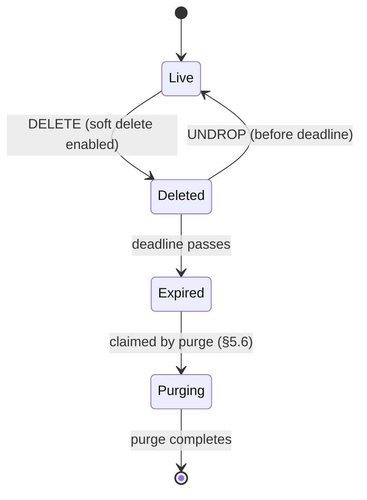
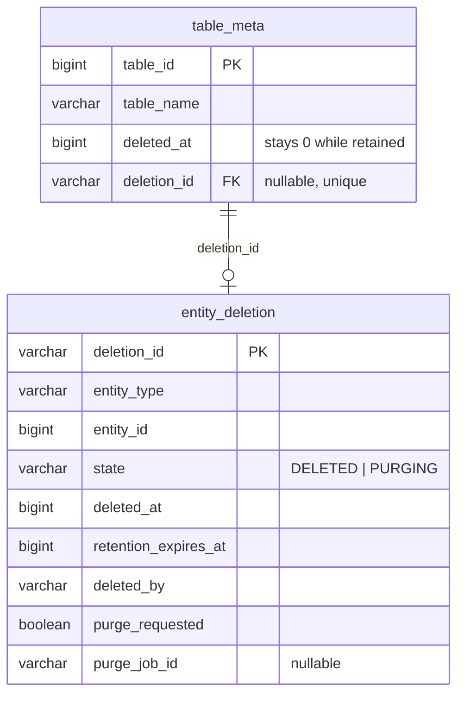
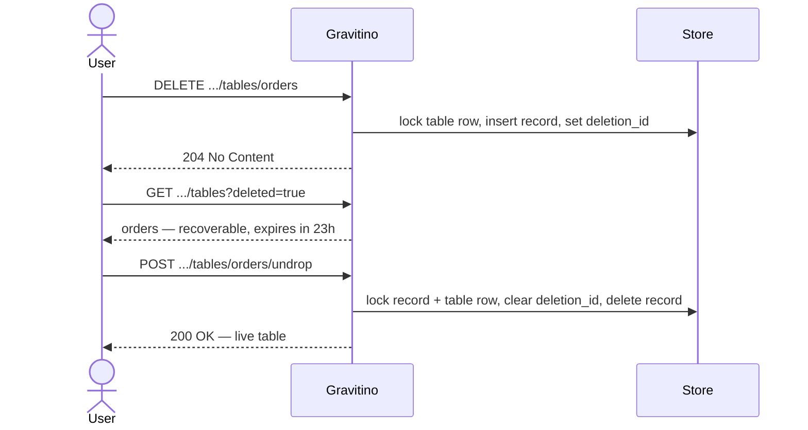
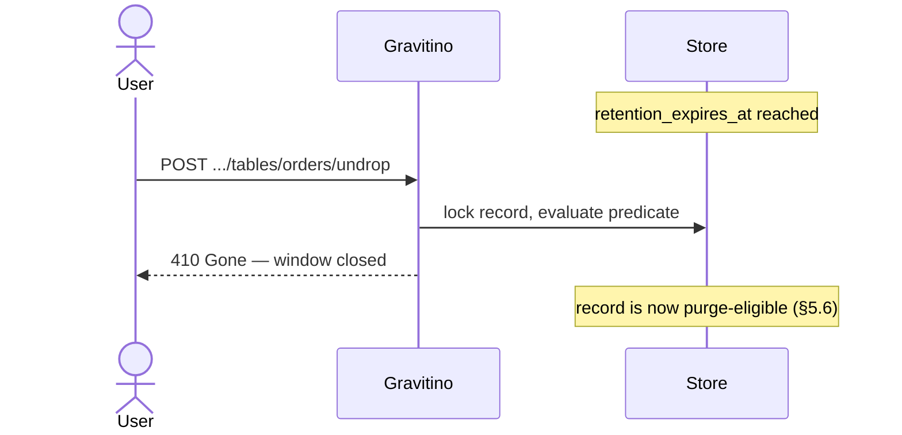
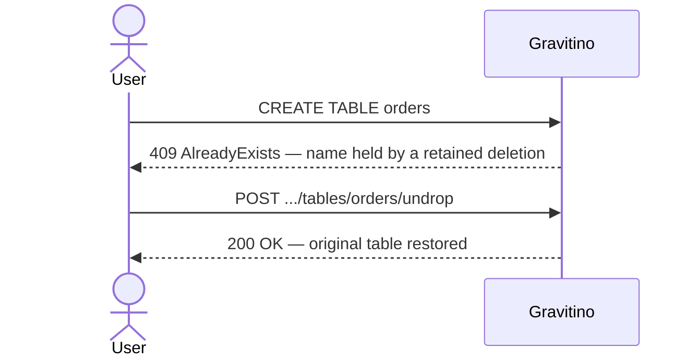
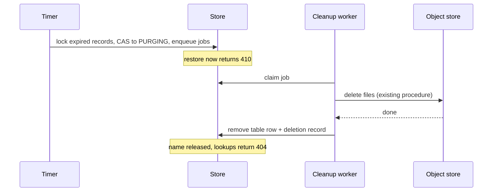

<!--
  Licensed to the Apache Software Foundation (ASF) under one
  or more contributor license agreements.  See the NOTICE file
  distributed with this work for additional information
  regarding copyright ownership.  The ASF licenses this file
  to you under the Apache License, Version 2.0 (the
  "License"); you may not use this file except in compliance
  with the License.  You may obtain a copy of the License at

   http://www.apache.org/licenses/LICENSE-2.0

  Unless required by applicable law or agreed to in writing,
  software distributed under the License is distributed on an
  "AS IS" BASIS, WITHOUT WARRANTIES OR CONDITIONS OF ANY
  KIND, either express or implied.  See the License for the
  specific language governing permissions and limitations
  under the License.
-->

# Design: Soft Deletion for Iceberg Tables

| Field   | Value                                                                               |
| ------- | ----------------------------------------------------------------------------------- |
| Status  | Draft — for discussion                                                              |
| Author  | Nevin Zheng                                                                         |
| Created | 2026-07-29                                                                          |
| Module  | `core`, `server`, `iceberg/iceberg-rest-server`                                     |
| Related | [Asynchronous Hard Deletion](./async-iceberg-rest-hard-deletion.md) (§3 Non-Goal 1) |

**Scope.** The deletion record, the metadata model, and the API for discovering and
undeleting a dropped Iceberg table, and the purge that runs when the window closes.
Purge reuses the shipped cleanup worker; its scheduling and operator tooling are
deferred (§5.6). Existing drop and purge behavior is unchanged.

---

## 1. Background

Dropping an Iceberg table is terminal — no window exists in which a mistaken drop
can be undone.

| Request                                       | What happens                                  | Recoverable |
| --------------------------------------------- | --------------------------------------------- | ----------- |
| `DELETE …` (no purge)                         | Registration removed; data files orphaned     | No          |
| `DELETE …?purgeRequested=true` (synchronous)  | Files deleted on the request thread           | No          |
| `DELETE …?purgeRequested=true` (asynchronous) | A cleanup job deletes files in the background | No          |

The asynchronous path shipped with
[Asynchronous Hard Deletion](./async-iceberg-rest-hard-deletion.md), which moved
cleanup off the request thread. It deliberately left recovery out — its §3 Non-Goal
1 destroys files with no undrop path and defers soft delete to a follow-up. This is
that follow-up.

Two existing mechanisms look adjacent but are not recovery. **Relational
tombstones** (`deleted_at` plus `RelationalGarbageCollector`) are storage hygiene:
nothing reads those rows back, there is no restore verb, and the name frees up at
once. **The purge tombstone** holds an identifier only while a cleanup job runs, to
stop a recreate landing on the old storage prefix.

Gravitino keeps deleted rows and reserves deleted names, yet a user cannot see what
they dropped or get it back. Missing is a durable record saying *this was deleted,
it can still be restored, and here is when that stops being true.*

---

## 2. Goals

1. **Recoverable window**: a dropped table is restorable to its *original* identity
   — same id, name, and attached metadata — until a persisted deadline.
2. **Bounded**: recoverability ends at that deadline whether or not purge has run.
3. **Reserved name**: the name stays occupied until purge, so no new table can take
   it and make restore ambiguous.
4. **Discoverable**: users can list what they dropped and how long they have left,
   through the existing Gravitino metadata API.
5. **No Iceberg REST wire change**: standard clients drop tables exactly as today.
6. **Automatic expiry**: when the window closes, purge removes the files and the
   metadata with no operator action.

---

## 3. Non-Goals

1. **Purge internals**: §5.6 defines the purge lifecycle and its transactions;
   scheduling parameters, retry tuning, and operator repair tooling are deferred.
2. **Changing existing drop or purge behavior**: the synchronous and asynchronous
   hard-delete paths are untouched, including their defaults and `purgeRequested`.
3. **Non-Iceberg connectors**: JDBC, Kafka, and Paimon drops destroy the object at
   the source. Iceberg is recoverable because a saved metadata pointer can be
   re-registered.
4. **Namespace, schema, and view recovery**: different containment rules; a follow-up.
5. **Per-catalog retention**: phase 1 ships one server-level window.
6. **Trash / recycle-bin UX**: no Web UI work.

---

## 4. Solution Investigations

The decision is **where deletion state lives**. Everything else follows.

| Approach                                            | Pros                                                        | Cons                                                                                                                              | Decision   |
| --------------------------------------------------- | ----------------------------------------------------------- | --------------------------------------------------------------------------------------------------------------------------------- | ---------- |
| **A.** Extend the entity row (today's `deleted_at`) | No new table; the column already exists nearly everywhere    | Not obviously correct — one row means two things; every entity table needs the same new columns; restore becomes un-editing fields |  Rejected  |
| **B.** Extend the async purge job row               | Already carries the Iceberg recovery input and the name lock | Conflates a *cleanup job* with a *recoverable deletion*; exists only on the purge path; cannot describe file-less objects          | Rejected   |
| **C.** Derive state from the audit / change log     | No new authoritative state                                   | A log explains history; it cannot arbitrate a race between restore and expiry                                                     | Rejected   |
| **D. Dedicated deletion action row**                | Obviously correct, reversible, extensible                    | One new table and one nullable pointer                                                                                            | **Chosen** |

**Obviously correct.** A deletion has its own lifetime, so it gets its own row. The
table row means one thing — the table. The deletion row means one thing — this drop,
and whether it can still be undone. Neither requires knowing which combination of
nullable columns is currently live, which matters in a lifecycle where a wrong
answer either destroys recoverable data or resurrects data meant to be gone.

**Reversible.** Restore *removes the deletion record*; the table row and everything
keyed to it are untouched. Under option A restore is the inverse of a multi-column
edit, and that inverse is only as trustworthy as the completeness of the field list.

**Extensible.** The row describes a deletion, not a table, so adding a type later is
a new column value rather than a migration on another entity table. Option B cannot
follow — a cleanup job presupposes files to clean up.

---

## 5. Proposal

### 5.1 Overview

A drop with soft delete enabled writes a **deletion record** and leaves the table
row in place. The record holds the deadline and is the only thing making the table
recoverable. Restore deletes the record; passing the deadline ends recoverability.



`Expired` is derived, not stored — it is `DELETED` with the deadline behind it.
`Purging` is stored and is the hard cutoff: once a purge owns the record, restore is
refused even if no file has been deleted. There is no `Restoring` state; restore is
a single transaction.

### 5.2 API

All new surface extends the **Gravitino metadata routes**. No new route tree, and no
change to the Iceberg REST wire protocol.

| Operation    | Route                                                                      |
| ------------ | -------------------------------------------------------------------------- |
| Drop         | `DELETE /api/metalakes/{m}/catalogs/{c}/schemas/{s}/tables/{t}`             |
| List deleted | `GET  /api/metalakes/{m}/catalogs/{c}/schemas/{s}/tables?deleted=true`      |
| Load deleted | `GET  /api/metalakes/{m}/catalogs/{c}/schemas/{s}/tables/{t}?deleted=true`  |
| Restore      | `POST /api/metalakes/{m}/catalogs/{c}/schemas/{s}/tables/{t}/undrop`        |

`deleted=true` reuses the existing table routes rather than adding a `/deletions`
tree: the table is addressed by the name it still holds, so clients need no second
identifier. The response carries safe fields only — never a metadata location,
FileIO properties, or credentials:

```json
{
  "name": "orders",
  "entityId": "984273",
  "deletedAt": 1784800000000,
  "retentionExpiresAt": 1784886400000,
  "deletedBy": "alice",
  "purgeRequested": true,
  "recoverable": true
}
```

**Drop behavior.** With soft delete disabled, all three paths in §1 are untouched.
With it enabled, a deletion record is created and the table row is retained;
`purgeRequested` is *captured on the record* and consumed by purge when the window
closes (§5.6), so the parameter keeps its meaning — files still die if it was
`true`, just later.

**Errors.** No conditional headers, so no `412` or `428`.

| Code  | Condition                                                                  |
| ----- | -------------------------------------------------------------------------- |
| `204` | Drop accepted                                                              |
| `200` | Deleted read or restore succeeded                                          |
| `400` | Malformed request                                                          |
| `403` | Caller may not read deleted metadata or restore                            |
| `404` | No live table, or no retained deletion — including after a completed purge  |
| `409` | Create, register, or rename targets a name held by a retained deletion      |
| `410` | The deadline has passed, or a purge already owns the record                 |

### 5.3 Metadata model

One new table, one nullable pointer on the table row.



| Column                 | Purpose                                                                                            |
| ---------------------- | -------------------------------------------------------------------------------------------------- |
| `deletion_id`          | Opaque key for one drop. Identifies the generation, not the name.                                  |
| `entity_type`          | `TABLE` in phase 1. Lets a future purge resolve a target without scanning every entity table.       |
| `entity_id`            | The original table id, so restore returns the same identity.                                       |
| `state`                | `DELETED` (recoverable until the deadline) or `PURGING` (claimed, never recoverable).                |
| `retention_expires_at` | Computed once at drop time; later configuration changes affect only later drops.                     |
| `purge_requested`      | Whether purge deletes files, or only removes metadata (§5.6).                                      |
| `purge_job_id`         | Set when a purge claims the record; `NULL` while recoverable.                                       |

**A soft delete sets only `deletion_id`, leaving `deleted_at` at `0`.** The deletion
timestamp lives on the record. Deletion becomes one predicate, propagated through
the system:

```
isDeleted = deleted_at != 0 OR deletion_id IS NOT NULL
```

Three properties follow. The existing garbage collector scans `deleted_at`, so it
never sees a retained row. The row stays in the live namespace, so the existing
unique key on `(schema_id, table_name, deleted_at)` already rejects a same-name
create — **names are reserved until purge**, with no new logic. And at most one
active record per table is enforced by the unique index on `deletion_id` plus the
drop transaction's `deletion_id IS NULL` check, needing no filtered index and so
portable across MySQL, PostgreSQL, and H2.

`table_meta.deletion_id` is the only reference direction and must not cascade —
removing a table row must never silently remove a deletion record.

### 5.4 Concurrency

Consistency comes from **row locks**, not ETags or a revision column. There is no
`If-Match` and no client-visible precondition. Each transaction takes
`SELECT … FOR UPDATE` on the rows it touches, in one order — **record, then table
row**.

| Transaction     | Locks                  | Steps                                                                                                                  |
| --------------- | ---------------------- | ---------------------------------------------------------------------------------------------------------------------- |
| **Drop**        | table row only         | Verify live and `deletion_id IS NULL`; insert the record; set `deletion_id`; commit                                     |
| **Restore**     | record, then table row | Verify the predicate below; clear `deletion_id`; delete the record; commit                                              |
| **Purge claim** | record, then table row | Re-verify the deadline has passed; CAS `DELETED → PURGING` and attach `purge_job_id`; commit                             |

Drop takes a single lock, so it cannot be in a deadlock cycle, and because the
pointer it writes lives on the row it locks, it still serializes against restore and
purge. Recoverability is a predicate, not a stored flag:

```
state = 'DELETED' AND now < retention_expires_at AND purge_job_id IS NULL
```

The deadline is exclusive for restore and inclusive for purge, so no instant is
both. `server_now` is captured once per transaction; clock skew across nodes could
let one consider a record recoverable while another considers it expired, which the
`PURGING` CAS still resolves to a single winner.

Restore consumes the record, so it cannot apply twice: a replayed restore finds a
live table and no record, returning `404`. A replayed drop finds `deletion_id`
already set and creates nothing.

### 5.5 User journeys

**Drop and restore.**



**Deadline passes.**



**Name held during the window.**



The `409` is deliberate: a user recreating the name usually meant to get the old
table back, and letting a new empty table take it would strand the recoverable one.

### 5.6 Purge

Purge runs in three phases. The middle one is the shipped async cleanup worker,
unchanged — only the claim and the finalization are new.

```mermaid
stateDiagram-v2
    [*] --> Deleted: DELETE
    Deleted --> Live: UNDROP (before deadline)
    Deleted --> Expired: deadline passes
    Expired --> Purging: timer claims (row lock + CAS + enqueue)
    Purging --> Purging: retry on failure; name stays reserved
    Purging --> [*]: files gone, then table row and record removed
```



| Phase           | Runs                                                                                                   | Notes                                                            |
| --------------- | ------------------------------------------------------------------------------------------------------ | ---------------------------------------------------------------- |
| **1. Claim**    | A timer, in one transaction per batch: row lock each expired record, CAS `DELETED → PURGING`, set `purge_job_id`, insert a cleanup job | Purely relational; no external side effect yet |
| **2. Delete**   | The shipped cleanup worker, unchanged                                                                   | Rebuilds the file graph from the table's metadata pointer and deletes leaf-first, root `metadata.json` last |
| **3. Finalize** | One transaction: remove table-owned rows, the table row, then the record                                | Only on confirmed success                                        |



Three rules make this safe. Finalization is **predicated** on matching `table_id`,
`deletion_id`, and `purge_job_id`, so a table that was restored and dropped again is
never destroyed by the old generation's job. When `purge_requested` is false, phase
2 is skipped and only metadata is removed — files are left, matching today's
metadata-only drop. And a job that exhausts its retries leaves the record in
`PURGING` with the name still reserved, awaiting operator repair; a failed purge
never silently releases a name or returns the record to `DELETED`.

### 5.7 Interoperation with asynchronous hard deletion

Soft delete and the shipped async hard deletion never act on the same table at once.
Configuration decides which path a drop takes:

| Soft delete | A drop is handled by            | The name is reserved by |
| ----------- | ------------------------------- | ----------------------- |
| Disabled    | Async hard deletion (unchanged) | The cleanup job row     |
| Enabled     | Soft deletion (this design)     | The retained table row  |

They meet at exactly one point: when the deadline passes, the `DELETED → PURGING`
CAS hands the table over. That single transition is why only one owner ever holds a
name at a time.

**The flag gates writes, not reads.** Creating a deletion record is the only
conditional behavior; every read of `entity_deletion` is always active, and
hard-delete teardown always removes any record it finds — in the same transaction
that removes the table row, since the pointer does not cascade. So the flag governs
new drops only: turning it off stops new retained deletions while existing records
keep draining through restore or expiry, rather than stranding with names held.
Where the feature was never enabled the table is empty and every read is an indexed
miss.

### 5.8 Configuration

| Key                                         | Default    | Description                                    |
| ------------------------------------------- | ---------- | ---------------------------------------------- |
| `gravitino.entity.soft-delete.enabled`      | `false`    | Opt-in. Off means today's behavior exactly.    |
| `gravitino.entity.soft-delete.retention-ms` | `86400000` | Window length (24h). Valid range 0 to 90 days. |

Phase 1 honors these for Iceberg tables only. Retention `0` means the record is
immediately expired — no usable window.

### 5.9 Authorization

Reading deleted metadata and restoring are authorized before anything is disclosed
or changed, against *current* permissions rather than those captured at drop time.
Because a deleted table's owner may no longer be evaluable, phase 1 authorizes both
against the parent schema. Unauthorized, wrong-generation, and missing targets share
a sanitized `404`, so `deleted=true` cannot probe for existence.

Restore reinstates the table's pre-drop grants, owner, tags, and policies, since
those rows were never touched.

### 5.10 Backward compatibility

With soft delete disabled, behavior is unchanged. With it enabled:

- Live reads and lists exclude retained tables once the `isDeleted` predicate is
  propagated (§5.3).
- A dropped name stays occupied until purge, so create, register, and rename may
  return `409` where they previously succeeded. This is the one visible change.
- Standard Iceberg REST clients see no protocol change — a drop still succeeds and
  `HEAD` still returns `404`.
- Metadata and files survive until purge runs, so an enabled deployment holds
  storage for at least the length of the window.

---

## 6. Open Questions

**Should the existing `deleted_at` tombstones migrate into `entity_deletion`?** The
two answer different questions — `deleted_at` says "this row is
garbage-collectable", `deletion_id` says "this table is recoverable until a
deadline" — so unifying them may not be desirable.

- **(a) Migrate and unify** on one record, with a single lifecycle to reason about.
- **(b) Coexist**, creating an `entity_deletion` row only for recoverable drops.

---

## 7. Task Breakdown

### Phase 1: Record and lifecycle
- [ ] Add the `entity_deletion` table and migrations (MySQL, H2, PostgreSQL)
- [ ] Add nullable `table_meta.deletion_id` with its unique index and conversion objects
- [ ] Propagate the `isDeleted` predicate (§5.3) through every read path
- [ ] Implement the row-locked drop transaction behind the soft-delete config
- [ ] Implement the row-locked restore transaction

### Phase 2: API
- [ ] Add `?deleted=true` to table list and load in `server/`
- [ ] Add the `POST …/undrop` endpoint and DTOs
- [ ] Authorization for deleted reads and restore
- [ ] Java and Python client support
- [ ] Update the OpenAPI spec and validate with `./gradlew :docs:build`
- [ ] Update user-facing documentation in `docs/`

### Phase 3: Purge
- [ ] Timer that claims expired records: row lock, CAS to `PURGING`, enqueue the cleanup job
- [ ] Route claimed records into the shipped cleanup worker; skip file deletion when `purge_requested` is false
- [ ] Predicated finalization: table-owned rows, the table row, then the record
- [ ] Operator repair path for records stuck in `PURGING`

---

## 8. Testing

- **Unit**: drop writes exactly one record; restore consumes it; replayed drop and
  restore are safe; the recoverability predicate at each boundary, including
  retention `0`.
- **Concurrency**: restore versus purge claim — exactly one wins; concurrent drops
  produce one record; lock ordering under contention on H2, MySQL, and PostgreSQL.
- **Integration** (`gravitino-docker-test`): drop, list with `deleted=true`, restore,
  then confirm the original identity and attached metadata survive; restore after the
  deadline returns `410`; a same-name create returns `409` on both the Gravitino and
  Iceberg REST paths; restart mid-window loses nothing.
- **Purge**: expiry deletes files and releases the name; `purge_requested = false`
  removes metadata and leaves files; a table restored and re-dropped is never
  destroyed by the old generation's job.
