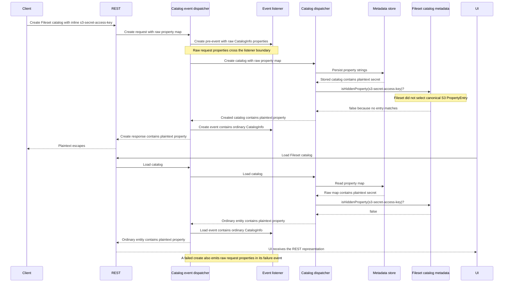
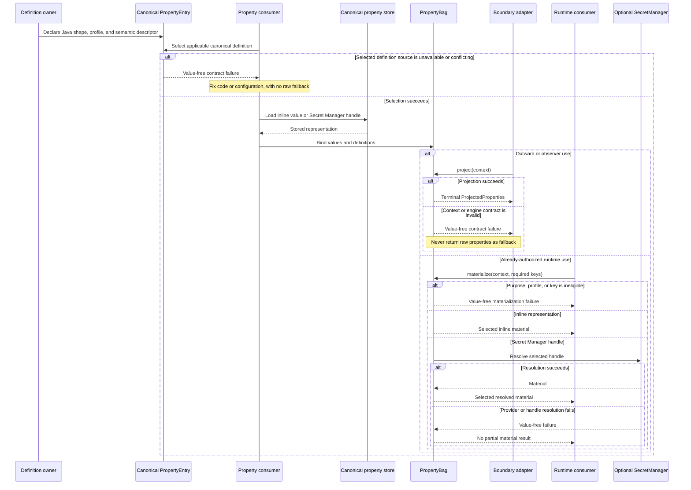
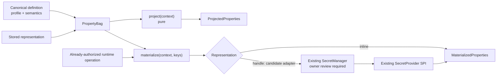
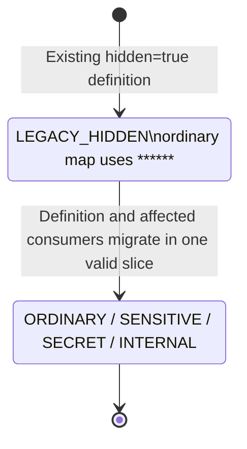
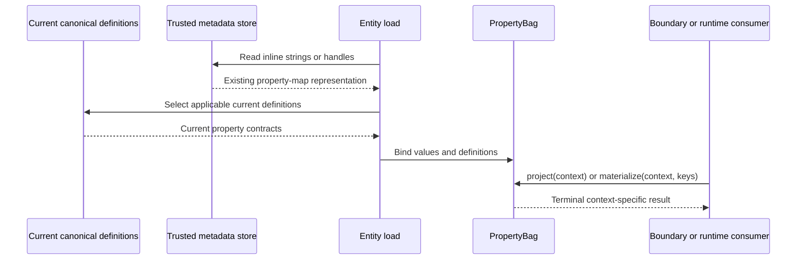

<!--
  Licensed to the Apache Software Foundation (ASF) under one
  or more contributor license agreements. See the NOTICE file
  distributed with this work for additional information
  regarding copyright ownership. The ASF licenses this file
  to you under the Apache License, Version 2.0 (the
  "License"); you may not use this file except in compliance
  with the License. You may obtain a copy of the License at

  http://www.apache.org/licenses/LICENSE-2.0

  Unless required by applicable law or agreed to in writing,
  software distributed under the License is distributed on an
  "AS IS" BASIS, WITHOUT WARRANTIES OR CONDITIONS OF ANY
  KIND, either express or implied. See the License for the
  specific language governing permissions and limitations
  under the License.
-->

# Design: Context-Aware Property Security in Gravitino

| Field          | Value                                                                                                              |
| -------------- | ------------------------------------------------------------------------------------------------------------------ |
| Status         | Draft                                                                                                              |
| Scope          | Apache Gravitino property declaration, projection, and runtime material access                                     |
| Updated        | 2026-08-27                                                                                                         |
| Related design | [Entity Secrets Management](https://github.com/apache/gravitino/blob/main/design-docs/gravitino-entity-secrets.md) |

## Abstract

Gravitino represents many entity properties as `Map<String, String>`. The existing `hidden` flag
and opt-in Entity Secrets support solve parts of safe property handling, but neither establishes one
contract for what a logical property means or how different uses may handle it. When a Fileset
catalog consumer omitted the canonical S3 definition, an inline `s3-secret-access-key` followed
ordinary-property behavior and crossed a normal REST response boundary.

This design enriches canonical property definitions with shared security semantics and introduces a
schema-bound `PropertyBag`. `project(context)` produces a safe representation for an outward or
observer boundary. `materialize(context, keys)` supplies selected values to an already-authorized
runtime operation, resolving Secret Manager handles only when needed. Classification remains
independent of storage representation, authorization, and credential behavior.

## Part I. Apache Gravitino proposal

### Q1. What are you trying to do?

Gravitino properties are declared by definition owners and used by many property consumers. The
current declarations describe Java-level shape and limited display behavior, but they cannot state
one reusable security contract for what a property means, how each boundary may represent it, or
when runtime code may receive its material value.

The proposal adds three cooperating contracts:

1. A definition owner attaches shared security semantics to the canonical property definition.
2. A consumer selects the applicable definitions and binds them to loaded or newly supplied values.
3. The shared engine projects a context-safe view or materializes selected values for an
   already-authorized runtime operation.

For example, the canonical definition of `s3-secret-access-key` is declared once. Entity responses,
events, errors, and logs then receive safe projections, while a connector-runtime operation can
still request the material it needs. Inline values and Secret Manager handles follow the same
outward contract.

The conceptual API is intentionally small:

```java
PropertyEntry<String> secretAccessKey =
    stringProperty("s3-secret-access-key")
        .security(PropertySecurityProfile.SECRET)
        .semanticType(PropertySemanticType.OPAQUE)
        .build();

ProjectedProperties response = propertyBag.project(PropertyContexts.ENTITY_RESPONSE);

MaterializedProperties runtime =
    propertyBag.materialize(
        PropertyContexts.CONNECTOR_INITIALIZATION,
        Set.of("s3-secret-access-key"));
```

Names and builder syntax are illustrative. The important contract is declaration, binding,
projection, and selected material access.

This is a cooperative trusted-process model. Definition owners must declare the right semantics,
consumers must select the applicable definitions, and boundary adapters must use the protected API.
Existing Gravitino authorization still decides whether an operation may run.

### Q2. What is outside this design?

This design does not:

- implement actor authorization, roles, principals, or per-property ACLs;
- replace `SecretManager`, `SecretProvider`, Entity Secrets lifecycle, credential vending, or the
  existing `SupportsSecrets#getSecrets()` contract;
- infer arbitrary secret meaning from property names or values, automatically discover all
  definitions, or add a global property registry;
- protect a compromised Gravitino process, arbitrary heap inspection, a malicious trusted
  component, the canonical metadata database, or backups;
- add a property-engine audit subsystem, cache, policy language, conformance framework, or special
  rollout machinery;
- define a new public configuration-presence endpoint, client/UI implementation, or browser-side
  security layer; or
- scan or remediate historical databases, logs, queues, indexes, caches, or exposed credentials.

A future field-level authorization layer could provide a constraint that narrows a projection
decision before the existing engine executes it. Such a constraint must not bypass the property's
security floor. Principal models, ACL persistence, and policy syntax remain outside this version.

### Q3. How does property handling work today, and where does it fail?

`PropertyEntry` and `PropertiesMetadata` already form a schema-like declaration API. Their current
security-facing declaration is a context-free `hidden` boolean. `PropertiesMetadata` checks exact
and prefix entries; `isHiddenProperty` returns `false` when neither lookup finds a match. Unknown
properties therefore retain ordinary visible-string compatibility.

Fileset catalog metadata is composed explicitly. Currently,
`FilesetCatalogPropertiesMetadata` includes Fileset, authentication, Kerberos, and credential
configuration entries, but not the shared S3, GCS, Azure, or OSS storage-property definitions. S3
marks `s3-access-key-id` and `s3-secret-access-key` hidden; Azure and OSS also mark credential
properties hidden. Because Fileset does not select those definitions, its hidden lookup cannot
consult them.

The GCS definition for `gcs-service-account-file` uses `hidden=false`. Its value is a file locator,
not the service-account document itself, so that declaration is not automatically a plaintext
credential leak. It still requires an explicit reviewed profile under the new contract rather than
an inference from its name.

The concrete failure spans creation, persistence, load, classification, and response generation:



The immediate cause is incomplete consumer-side definition selection combined with an ordinary
compatibility default for undeclared inline properties. The reported REST escape occurs when the
loaded value is evaluated against incomplete metadata and copied into the normal entity response.
Create pre/failure events also expose request-derived raw properties to listener code before that
filtering. The UI is a downstream API client, not the root cause.

The architectural gap is generic. `BaseCatalog`, `OperationDispatcher`, `MetalakeManager`, and
combined entity wrappers share variants of the same late hidden-property mechanism. A consumer can
repeat the defect whenever it omits an applicable sensitive definition, and an observer boundary can
leak independently if it receives raw request or change data before an entity response is filtered.

The effective design radius is every current property definition and every consumer of property
data. That is a large change radius, but it can be delivered one property-and-boundary vertical slice
at a time while every intermediate change remains valid.

| Scope                                                        | Evidence in current code                                                                                                                                                                      |
| ------------------------------------------------------------ | --------------------------------------------------------------------------------------------------------------------------------------------------------------------------------------------- |
| Fileset catalog, schema, and Fileset properties              | Shared S3/GCS/Azure/OSS definitions are not selected; the S3 catalog reproduction is confirmed.                                                                                               |
| Shared entity wrappers and managers                          | Catalog, schema, table, Fileset, view, topic, model, and model-version paths depend on shared late filtering. This is generic risk, not proof that each currently contains a sensitive value. |
| Metalake                                                     | Load/list filtering differs from direct create/alter return behavior; current metadata does not establish a concrete credential leak.                                                         |
| Events and listeners                                         | Create pre/failure events may carry request-derived raw properties; alter events may carry value-bearing changes.                                                                             |
| REST clients and UI                                          | They propagate the server representation and do not add an independent security decision.                                                                                                     |
| Runtime, persistence, `getSecrets()`, and credential vending | These are intentional material or storage boundaries with separate contracts.                                                                                                                 |

Recognized Entity Secrets handles receive an independent secret-safe outward floor in current code.
That protects a recognized handle but cannot classify a legacy inline credential whose definition was
omitted. Entity Secrets supplies opt-in storage and resolution; this proposal supplies the runtime
property-handling contract for both inline and handle-backed representations.

### Q4. What is the proposed design?

The design has three components.

| Component                             | Responsibility                                                                                           |
| ------------------------------------- | -------------------------------------------------------------------------------------------------------- |
| Definition contract                   | Attach a shared profile and optional semantic descriptor to the canonical property definition.           |
| Consumer contract                     | Select applicable definitions, bind values, and request the context that truthfully describes a use.     |
| Projection and materialization engine | Execute core-owned safe actions or deliver selected material to an already-authorized runtime operation. |

The initial author-facing profiles are:

| Profile     | Meaning                                                                               |
| ----------- | ------------------------------------------------------------------------------------- |
| `ORDINARY`  | Normal configuration whose stored representation may be exposed in ordinary contexts. |
| `SENSITIVE` | Non-secret data that should not appear freely in outward or observer representations. |
| `SECRET`    | Secret material whose value or handle must not cross ordinary boundaries.             |
| `INTERNAL`  | Gravitino implementation state not intended for ordinary external representation.     |

The profile does not choose storage. A `SECRET` may remain an inline string or use Entity Secrets.
A recognized Secret Manager handle always imposes at least secret-safe outward behavior even if its
definition is absent or weaker.

The Secret Manager resolution branch in the sequence below is the candidate integration shape; it
remains gated on Entity Secrets owner review. Pure projection, the recognized-handle floor, and the
unchanged public `getSecrets()` contract do not depend on that adapter.

The complete interaction is:



One limitation is deliberate: the framework cannot distinguish an accidentally omitted definition
from a legitimate undeclared custom key. Undeclared keys remain `ORDINARY` for compatibility. The
definition owner and consumer are responsible for correct selection, supported by normal review and
tests. If a consumer explicitly selects a definition source and that source fails to load or
conflicts, the operation fails safely instead of returning a raw map.

The first complete application is the Fileset catalog S3 journey. Fileset selects the canonical
provider definitions, binds the property map, and projects every server boundary exercised by that
vertical slice. A metadata-only patch is not a substitute for adopting the shared boundary API.

### Q5. Who implements and consumes the contract?

| Contract                 | Meaning                                                                  | Implementer                                                               | Consumer                                                              | Required behavior                                                              |
| ------------------------ | ------------------------------------------------------------------------ | ------------------------------------------------------------------------- | --------------------------------------------------------------------- | ------------------------------------------------------------------------------ |
| Canonical definition     | Authoritative Java shape and security meaning for one logical property   | Owning Apache provider or component                                       | Every entity/runtime component using the property                     | Define once and reuse; do not weaken locally.                                  |
| Definition selection     | Explicit composition of definitions applicable to an entity or operation | Entity/catalog consumer                                                   | `PropertyBag` binding                                                 | Select exact and prefix definitions required by the consumer.                  |
| Use context              | Typed purpose and server surface facts; not identity or authorization    | Apache core defines named presets; boundary owners choose one             | Projection/materialization engine                                     | Choose the context that describes the real use.                                |
| Projection engine        | Deterministic profile-plus-context decision and core action execution    | Apache core/API                                                           | REST, events, errors, logs, plugins, and other server egress adapters | Consume `ProjectedProperties`, not raw maps.                                   |
| Materialization          | Selected-key delivery for an already-authorized runtime operation        | Apache core; candidate handle adapter reviewed with Entity Secrets owners | Catalog/provider connectors and other server runtime consumers        | Request only required eligible keys; do not reuse material as an outward view. |
| Entity Secrets lifecycle | Optional binding/reference storage and provider resolution               | Existing `SecretManager` and `SecretProvider` owners                      | Materialization and existing `getSecrets()`                           | Resolve handles without redefining profile or projection semantics.            |
| Downstream API behavior  | Rendering or editing of the server response contract                     | API owners define the server contract                                     | UI, SDK, CLI, and other HTTP clients                                  | Do not infer classification or treat replacement output as stored data.        |

Correct use remains a contributor responsibility. Bypassing the protected API inside trusted code is
an implementation defect addressed through review and ordinary tests, not a new in-process sandbox.

### Q6. What are the risks?

| Risk                                                               | Consequence                                         | Accepted handling                                                                                               |
| ------------------------------------------------------------------ | --------------------------------------------------- | --------------------------------------------------------------------------------------------------------------- |
| A definition owner misclassifies a property or a consumer omits it | An inline value follows ordinary compatibility      | Make ownership and selection explicit; cover sensitive definitions and migrated boundaries with sentinel tests. |
| A boundary adapter bypasses the protected API                      | Raw or material values cross an egress boundary     | Treat the API as the safety boundary; use typed results, code review, and server integration tests.             |
| Profiles or contexts become a general policy language              | The API becomes difficult to review and use         | Keep a small core-owned profile/action set; require evidence and review for extensions.                         |
| A replacement token is mistaken for source data                    | Configuration edits corrupt or re-store the token   | Keep replacement output presentation-only; never accept it as an unchanged write value.                         |
| A definition changes under schema-on-read                          | Future projections change without rewriting storage | Treat canonical-definition changes as security-relevant reviews; retain the recognized-handle floor.            |
| Legitimately materialized values are logged or republished         | The boundary is bypassed after authorized delivery  | Keep runtime results narrow and value-free in diagnostics; migrate connector logging boundaries.                |
| Migration changes legacy behavior                                  | Existing clients or connectors break                | Preserve `LEGACY_HIDDEN`, ordinary undeclared defaults, and independently valid vertical PRs.                   |

### Q7. How will this be delivered?

The target is comprehensive, but delivery is incremental. Every PR must build, pass its normal tests,
and leave the repository in a valid state.

1. Add the canonical profile, semantic descriptor, use context, result contracts, and legacy adapter.
2. Add the core projection/materialization engine and value-free failure behavior.
3. Apply the complete contract to Fileset catalog S3 as the first vertical slice, including provider
   definition selection; create, alter, load, and list responses; persistence/reload; and the server
   observers touched by those paths.
4. Migrate remaining server property definitions and consumers in coherent surface-owned slices.
5. Integrate optional Entity Secrets materialization only after its owner validates the adapter.

There is no flag-day conversion and no temporarily broken intermediate PR. Existing direct
containment work is reused where it fits the first systemic slice rather than duplicated.

### Q8. What demonstrates success?

The first exam is the Fileset catalog S3 vertical slice:

- one canonical S3 definition is selected by Fileset;
- an inline sentinel survives persistence and reload but never appears in create, alter, load, list,
  event, error, or log output changed by the slice;
- ordinary properties keep their compatibility behavior;
- a connector-runtime consumer still receives only the eligible S3 values it requests;
- pure projection performs no Secret Provider call; and
- legacy hidden behavior and recognized-handle protection remain intact.

The final exam is inventory-based. Every applicable canonical sensitive definition has an owner,
every committed server consumer has a follow-up issue and a migrated boundary, and server integration
journeys demonstrate that protected values do not cross ordinary/observer outputs while legitimate
runtime material access still works.

## Part II. Apache Gravitino technical design

### Appendix A. Property contract and engine

#### A1. Enrich canonical `PropertyEntry` definitions

The existing builder remains the canonical runtime declaration mechanism. New fields are additive:

```java
public enum PropertySecurityProfile {
  ORDINARY,
  SENSITIVE,
  SECRET,
  INTERNAL
}

public enum PropertySemanticType {
  OPAQUE
}

// Illustrative additions to the existing PropertyEntry.Builder<T>.
new PropertyEntry.Builder<String>()
    .withName("s3-secret-access-key")
    .withSecurityProfile(PropertySecurityProfile.SECRET)
    .withSemanticType(PropertySemanticType.OPAQUE)
    // Existing type, description, validation, and encoding fields remain unchanged.
    .build();
```

The existing final `PropertyEntry<T>` class and builder construction model remain unchanged; only
fields, accessors, and builder methods are added. Exact Java names and placement remain
implementation details. The contract is:

- every declared property has one profile;
- existing `hidden=true` declarations bind to the internal `LEGACY_HIDDEN` compatibility profile;
  other existing declarations without the new field behave as `ORDINARY`;
- new or materially modified definitions should select a profile deliberately;
- the optional semantic descriptor defaults to `OPAQUE` and remains independent of profile; and
- definitions do not carry renderer callbacks, arbitrary policies, or executable masking code.

Semantic descriptors allow reviewed future transforms to understand rough structure without
inferring it from a key or raw value. Version one ships no email-, phone-, or identifier-specific
masker. Secret replacement is fixed and independent of source content and length.

#### A2. Select and bind canonical definitions explicitly

One module owns the authoritative definition of a logical property. Consumers reuse that definition
and compose the exact and prefix entries applicable to their entity or operation. Reusable aggregate
helpers are allowed; a global runtime registry and automatic contributor discovery are not required.

Binding has three outcomes:

1. A supplied matching definition is selected and its contract applies.
2. No supplied definition matches, so the key is recorded as undeclared and follows `ORDINARY`
   compatibility.
3. A definition source was explicitly selected but cannot load, or supplied definitions conflict,
   so binding fails with a value-free contract error and no raw-map fallback.

This limitation is honest: the framework cannot prove that every sensitive definition was supplied.
Omitting one is an implementation bug. The first correction is therefore both generic and concrete:
Fileset must select the applicable S3, GCS, Azure, and OSS definitions, and each of those definitions
must receive a deliberate reviewed profile.

#### A3. Describe use with a structured context

One immutable value carries a typed purpose and server surface:

```java
public record PropertyUseContext(PropertyPurpose purpose, PropertySurface surface) {}

public enum PropertyPurpose {
  ENTITY_READ,
  WRITE_RESPONSE,
  CONFIGURATION_VIEW,
  OBSERVER_OUTPUT,
  CONNECTOR_RUNTIME,
  TRUSTED_INTERNAL
}

public enum PropertySurface {
  API,
  EVENT,
  ERROR,
  LOG,
  PLUGIN,
  SECONDARY_STORE,
  IN_PROCESS
}
```

Normal call sites use reviewed named presets:

```java
public final class PropertyContexts {
  public static final PropertyUseContext ENTITY_RESPONSE =
      new PropertyUseContext(PropertyPurpose.ENTITY_READ, PropertySurface.API);

  public static final PropertyUseContext WRITE_RESPONSE =
      new PropertyUseContext(PropertyPurpose.WRITE_RESPONSE, PropertySurface.API);

  public static final PropertyUseContext CONFIGURATION_RESPONSE =
      new PropertyUseContext(PropertyPurpose.CONFIGURATION_VIEW, PropertySurface.API);

  public static final PropertyUseContext CONNECTOR_INITIALIZATION =
      new PropertyUseContext(PropertyPurpose.CONNECTOR_RUNTIME, PropertySurface.IN_PROCESS);

  public static final PropertyUseContext TRUSTED_INTERNAL =
      new PropertyUseContext(PropertyPurpose.TRUSTED_INTERNAL, PropertySurface.IN_PROCESS);
}
```

The type is structured so the project can add reviewed contexts without replacing the API, but
version one does not define an arbitrary purpose-by-surface policy language. The valid combinations
are:

| Purpose              | Valid surface                                           |
| -------------------- | ------------------------------------------------------- |
| `ENTITY_READ`        | `API`                                                   |
| `WRITE_RESPONSE`     | `API`                                                   |
| `CONFIGURATION_VIEW` | `API`                                                   |
| `OBSERVER_OUTPUT`    | `EVENT`, `ERROR`, `LOG`, `PLUGIN`, or `SECONDARY_STORE` |
| `CONNECTOR_RUNTIME`  | `IN_PROCESS`                                            |
| `TRUSTED_INTERNAL`   | `IN_PROCESS`                                            |

Purpose selects the treatment and surface identifies the boundary; a surface never makes a purpose
more permissive. The named presets are the ordinary construction path. Constructing an unsupported
pair is an internal contract violation and fails without including property values.

The context contains no principal, role, tenant, credential, or authorization result. It is not a
capability and grants nothing. The owning operation authorizes first and then selects the context
that truthfully describes its use. HTTP clients, including the UI, all consume the `API` surface;
there is no UI-specific security context.

`project()` without an argument remains convenient and applies each profile's conservative default.
Named boundaries should use an explicit preset. Review must prevent permissive internal contexts at
outward boundaries.

#### A4. Keep raw, projected, and material results distinct

```java
public interface PropertyBag {
  ProjectedProperties project();

  ProjectedProperties project(PropertyUseContext context);

  MaterializedProperties materialize(
      PropertyUseContext context, Set<String> propertyNames);
}

public interface ProjectedProperties {
  Map<String, String> asMap();

  Optional<PropertyProjectionDecision> decision(String propertyName);
}

public record PropertyProjectionDecision(
    String propertyName,
    PropertySecurityProfile profile,
    PropertyProjectionAction action,
    PropertyPresence presence) {}

public enum PropertyProjectionAction {
  EXPOSE,
  OMIT,
  FIXED_REPLACEMENT,
  PRESENCE_ONLY
}
```

`PropertyBag` is a schema-bound internal container and does not implement `Map`. Trusted raw access,
if an implementation needs it, is explicit and separate from the easy egress API.

`ProjectedProperties` is immutable and terminal for the selected context. It retains no source bag,
withheld plaintext, Secret Manager handle, provider locator, recovery callback, or lazy reference to
raw values. Its map contains only the chosen outward representation. Internal decision metadata is
also context-bound and does not automatically become a public DTO.

The decision accessor follows the same observational rules as the map:

- `OMIT` returns no key, value, or presence fact when the context may not observe presence;
- `PRESENCE_ONLY` exposes only the context-permitted configured state;
- `EXPOSE` and `FIXED_REPLACEMENT` may expose safe decision metadata because the key is already
  observable; and
- asking for decision metadata never widens the projection.

`MaterializedProperties` is a separate narrow result and must not be accepted by normal entity DTO
serialization. Materialization requires an already-authorized operation, a material-capable context,
and an explicit requested-key set. The context does not provide authorization.

#### A5. Centralize action execution

Core owns the meaning and default implementation of every action:

| Action              | Result                                                                    |
| ------------------- | ------------------------------------------------------------------------- |
| `EXPOSE`            | Copy the stored representation without resolving a handle.                |
| `OMIT`              | Emit no key, value, or unauthorized presence fact.                        |
| `FIXED_REPLACEMENT` | Emit one stable content- and length-independent replacement.              |
| `PRESENCE_ONLY`     | Emit structured configured/defaulted/absent state without a string value. |

The executor may have an interface for testability or reviewed implementation replacement, but an
extension cannot change these invariants, relax a security floor, or perform provider I/O during
projection. Consumers and individual property definitions do not supply callbacks.

The initial deterministic projection matrix is:

| Context                                        | `ORDINARY` | `SENSITIVE`         | `SECRET`            | `INTERNAL` |
| ---------------------------------------------- | ---------- | ------------------- | ------------------- | ---------- |
| No-argument default                            | `EXPOSE`   | `FIXED_REPLACEMENT` | `FIXED_REPLACEMENT` | `OMIT`     |
| `ENTITY_READ` or `WRITE_RESPONSE` + `API`      | `EXPOSE`   | `FIXED_REPLACEMENT` | `FIXED_REPLACEMENT` | `OMIT`     |
| `CONFIGURATION_VIEW` + `API`                   | `EXPOSE`   | `PRESENCE_ONLY`     | `PRESENCE_ONLY`     | `OMIT`     |
| `OBSERVER_OUTPUT` + any valid observer surface | `EXPOSE`   | `OMIT`              | `OMIT`              | `OMIT`     |
| `TRUSTED_INTERNAL` + `IN_PROCESS`              | `EXPOSE`   | `EXPOSE`            | `EXPOSE`            | `EXPOSE`   |

`EXPOSE` in a trusted internal projection returns the stored representation and never resolves a
handle. Material delivery is not a projection action. Its initial eligibility contract is separate:

| Materialization context            | Eligible keys                                                                                       | Representation behavior                                |
| ---------------------------------- | --------------------------------------------------------------------------------------------------- | ------------------------------------------------------ |
| `CONNECTOR_RUNTIME` + `IN_PROCESS` | Explicitly requested keys from any profile, `LEGACY_HIDDEN`, or undeclared ordinary-compatible data | Return an inline value or resolve a recognized handle. |
| Any projection or observer context | None                                                                                                | Reject the material operation value-free.              |
| Any unsupported future combination | None until reviewed and added to this contract                                                      | Reject the material operation value-free.              |

Allowing a profile in connector runtime preserves existing server behavior; it does not authorize
the caller or make the value remotely readable. The owning runtime operation must authorize first,
and materialization returns only explicitly requested keys.

The engine owns one replacement constant for new profiles; it is not a user or property setting.
The existing `******` value is separately preserved for `LEGACY_HIDDEN` compatibility.

#### A6. Keep state dimensions independent

| Dimension      | Examples                                       | Meaning                                                 |
| -------------- | ---------------------------------------------- | ------------------------------------------------------- |
| Declaration    | Declared, undeclared                           | Whether a matching supplied definition exists.          |
| Presence       | Absent, defaulted, configured                  | Whether and how a value is available before projection. |
| Profile        | Ordinary, sensitive, secret, internal          | The logical security contract.                          |
| Representation | Inline, Secret Manager handle                  | How canonical storage represents the value.             |
| Treatment      | Expose, omit, fixed replacement, presence only | What the selected projection emits.                     |
| Outcome        | Success, operation failure                     | Whether the requested operation completed.              |

An absent key and an omitted key are observationally identical unless the context explicitly permits
presence. A fixed replacement means the engine replaced a present/defaulted value; it is never the
source. A failed operation is not another masking state.

Projection is pure:

```text
for each bound property:
  resolve supplied definition or ordinary undeclared compatibility
  impose at least the secret outward floor for a recognized handle
  select the deterministic profile/context action
  execute the action without provider I/O
  copy only safe output and context-safe decision metadata
return an immutable terminal result
```

No exception path returns `rawProperties()` as fallback.

### Appendix B. Common user journeys

The master interaction is in Q4. This appendix records distinct journeys without repeating that
sequence.

| Journey                                         | Canonical representation                 | Required server behavior                                                           | Observable result                                                |
| ----------------------------------------------- | ---------------------------------------- | ---------------------------------------------------------------------------------- | ---------------------------------------------------------------- |
| Definition owner declares a property            | Definition metadata                      | Select a profile and optional semantic descriptor once.                            | Every consumer can reuse the same meaning.                       |
| Create with an inline secret                    | Plain string in trusted metadata storage | Validate and persist the input; project events and the create response.            | No outward boundary echoes material.                             |
| Create with a managed binding                   | Secret Manager handle                    | Preserve existing managed-write lifecycle; project the response without resolving. | No handle or material appears in ordinary output.                |
| Create with an external reference               | Secret Manager handle                    | Preserve existing reference lifecycle; project without locator disclosure.         | No handle, locator, or material appears.                         |
| Load or list an entity                          | Inline string or handle                  | Bind current definitions on read and use `ENTITY_RESPONSE`.                        | Context-safe value, fixed replacement, or omission.              |
| View configuration                              | Inline string or handle                  | If an API exists, use `CONFIGURATION_RESPONSE`.                                    | Structured presence where permitted; never material.             |
| Preserve, replace, or remove                    | Existing value plus explicit mutation    | Absence of mutation preserves; new material replaces; explicit remove deletes.     | A display replacement is never accepted as unchanged data.       |
| Produce an event, error, log, or plugin payload | Request, change, or loaded values        | Project before the observer receives data; render failures value-free.             | No protected material, handle, locator, or unsafe provider text. |
| Initialize a connector                          | Inline string or handle                  | Authorize the operation, request eligible keys, and materialize late.              | Runtime receives only requested material.                        |
| Persist and reload                              | Existing string-map representation       | Store no bag/profile/projection envelope; rebind current definitions after load.   | Current schema controls the next projection.                     |
| Call existing `getSecrets()`                    | Recognized handle                        | Keep the existing separate operation and eligibility.                              | Existing handle-backed plaintext behavior is unchanged.          |

Classification does not choose representation:

| User choice        | Canonical entity storage | Ordinary projection                                    | Runtime materialization                               |
| ------------------ | ------------------------ | ------------------------------------------------------ | ----------------------------------------------------- |
| Inline value       | Plain string             | Profile action; never material for `SECRET`            | Return the requested eligible inline value.           |
| Managed binding    | Secret Manager handle    | Secret-safe action; never handle or material           | Resolve the requested handle through `SecretManager`. |
| External reference | Secret Manager handle    | Secret-safe action; never handle, locator, or material | Resolve through `SecretManager` and its provider.     |

The server owns API behavior. UI, SDK, CLI, and direct HTTP callers receive the same projection for
the same endpoint and authorization result. Browser-side redaction is not a security boundary.

### Appendix C. Entity Secrets coexistence

Entity Secrets and property security own different concerns:

| Concern                                                  | Owner                                              |
| -------------------------------------------------------- | -------------------------------------------------- |
| Logical profile and semantic descriptor                  | Canonical property definition                      |
| Context decision and outward action                      | Property projection engine                         |
| Inline versus binding/reference representation           | Existing create/alter contract and `SecretManager` |
| Provider write, reference, resolve, and delete lifecycle | Existing `SecretManager` and `SecretProvider`      |
| Operation authorization                                  | Existing authorizer and owning API                 |

Four coexistence invariants are settled by this design: classification is independent of storage
representation; projection is pure and provider-independent; recognized handles impose at least the
`SECRET` outward floor; and the existing `SupportsSecrets#getSecrets()` contract is unchanged.

The adapter shown below is a candidate implementation integration, not a change to the Entity
Secrets contract. After the key and context checks above, `PropertyBag.materialize(...)` may delegate
recognized handles to the existing `SecretManager`. The Entity Secrets owners must review that
adapter before implementation.



Projection makes zero provider calls and remains available during a provider outage. If the candidate
adapter is adopted, materialization resolves only requested eligible handles and returns no stored
handle text as a fallback. A malformed handle, key mismatch, or provider failure produces a
value-free failure and no partial result.

After persistence, a recognized handle may not reliably preserve whether it originated from a
managed binding or external reference. The generic representation term is therefore
`SECRET_MANAGER_HANDLE`. Lifecycle ownership remains with the existing Entity Secrets path rather
than being inferred by the projection engine.

`SupportsSecrets#getSecrets()` remains structurally separate and handle-only in this design. It does
not begin returning classified inline secrets, change privilege, or gain a new audit contract. A
future implementation may reuse internal selected-key materialization mechanics only after Entity
Secrets owners approve the behavior and compatibility.

### Appendix D. Legacy `hidden` compatibility

Currently, recognized `hidden=true` properties use a fixed `******`
replacement on ordinary map reads, and writes reject that token as source data. Recognized Secret
Manager handles receive equivalent outward protection. Those behaviors must survive migration.

Core represents an unmigrated `hidden=true` definition as an internal `LEGACY_HIDDEN` compatibility
profile. It is not author-facing and does not imply `SECRET`, because legacy hidden properties may
represent internal state or other non-secret values. `hidden=false` retains ordinary compatibility
until the definition owner selects a richer profile.

The compatibility adapter makes each boundary explicit:

| Use                                                          | `LEGACY_HIDDEN` behavior                                                                                            |
| ------------------------------------------------------------ | ------------------------------------------------------------------------------------------------------------------- |
| Existing entity and write-response map                       | Emit the fixed `******` replacement for a configured value.                                                         |
| Create or update input                                       | Reject `******` as source material; accept an explicit real value or explicit removal through the owning operation. |
| New event, error, log, plugin, or secondary-store projection | Omit the property.                                                                                                  |
| Trusted internal projection                                  | Expose the stored representation without resolving a recognized handle.                                             |
| Connector runtime materialization                            | Preserve intentional runtime access: return requested inline material or resolve a requested recognized handle.     |

At existing legacy map boundaries, a recognized handle continues to produce `******`. At new
projection boundaries, the representation-derived `SECRET` floor applies whenever it is stricter
than legacy behavior. The adapter exists only to permit gradual migration; it does not create a
second independent policy.



A logical property is governed by either the legacy adapter or one explicit new profile, never two
independent policies. Existing `isHiddenProperty` callers may temporarily derive hidden-equivalent
behavior from the new canonical contract while their boundary is migrated.

The catalog credential-backfill compatibility option can re-add stored credentials after ordinary
filtering. It must not weaken outward projection and should move behind an intentional runtime
material boundary when that path is migrated.

### Appendix E. Error handling and operation contracts

The primary invariant is simple: binding, projection, and materialization failures are value-free
and never fall back to raw properties.

| Journey                                                                | Result                                                                  |
| ---------------------------------------------------------------------- | ----------------------------------------------------------------------- |
| A projection intentionally omits, replaces, or reports presence        | The enclosing operation succeeds with the selected representation.      |
| An explicitly selected definition source is unavailable or conflicting | The operation fails; no raw map is returned.                            |
| An arbitrary key has no supplied definition                            | It remains undeclared and follows ordinary compatibility.               |
| Projection receives an invalid internal context or impossible action   | The boundary operation fails as an internal contract defect.            |
| Materialization requests an ineligible property or context             | The material operation fails with no material.                          |
| A handle is malformed or mismatched                                    | The material operation fails; the handle is never returned as fallback. |
| A provider is unavailable                                              | Materialization fails; pure projection remains available.               |
| One key in a multi-key request fails                                   | The initial contract returns no partial material result.                |

Public errors never contain a property value, handle, locator, raw property object, unsafe provider
message, value-bearing stack, or request DTO. `project` and `materialize` are read/access operations;
transaction rollback and create-time compensation remain owned by the calling operation and Entity
Secrets lifecycle.

The REST contract borrows AIP-193's structured `ErrorInfo` idea without replacing Gravitino's
existing `{code,type,message,stack?}` envelope or claiming full Google RPC compliance. One optional,
generic field provides stable machine meaning:

```json
{
  "code": 1002,
  "type": "RuntimeException",
  "message": "The server could not safely process entity properties.",
  "errorInfo": {
    "reason": "PROPERTY_SECURITY_CONTRACT_VIOLATION",
    "domain": "gravitino.apache.org",
    "metadata": {}
  }
}
```

`type` is retained for compatibility and does not promise a Java exception hierarchy. `stack` is
absent. Version-one public metadata is empty unless a separately reviewed stable and value-free field
is required.

| Condition                                                    | AIP semantic status  | Existing HTTP / Gravitino code | Stable reason                          | Retry meaning                                           |
| ------------------------------------------------------------ | -------------------- | ------------------------------ | -------------------------------------- | ------------------------------------------------------- |
| Intentional omit/replacement/presence                        | `OK`                 | Original success / `0`         | None                                   | Not an error.                                           |
| Invalid public property input                                | `INVALID_ARGUMENT`   | 400 / `1001`                   | `PROPERTY_INPUT_INVALID`               | Do not retry unchanged input.                           |
| Missing authentication                                       | `UNAUTHENTICATED`    | 401 / `1011`                   | Authentication-owned                   | Retry only after credentials change.                    |
| Actor permission denial                                      | `PERMISSION_DENIED`  | 403 / `1008`                   | Authorization-owned                    | Retry only after authorization changes.                 |
| Invalid selection, conflict, context, eligibility, or action | `INTERNAL`           | 500 / `1002`                   | `PROPERTY_SECURITY_CONTRACT_VIOLATION` | Non-retryable until code/configuration is fixed.        |
| Malformed handle or impossible trusted state                 | `INTERNAL`           | 500 / `1002`                   | `SECRET_MATERIAL_STATE_INVALID`        | Non-retryable until state/configuration is fixed.       |
| Secret Provider unavailable                                  | `UNAVAILABLE` family | 502 / `1007`                   | `SECRET_PROVIDER_UNAVAILABLE`          | Owning operation decides; never blindly retry mutation. |
| Multi-key failure                                            | Underlying status    | Underlying mapping             | Underlying reason                      | No partial result.                                      |

This mapping follows existing Gravitino distinctions: sensitive integrity-style failures can use a
fixed stack-free internal response, actor authentication/authorization remains 401/403, and
downstream connection failure remains a 502 category. Exact internal Java carriers are
implementation details.

### Appendix F. Schema-on-read persistence and threat model

This version trusts Gravitino's canonical metadata store. It protects disclosure boundaries rather
than changing storage protection.

Canonical persistence remains unchanged:

- inline properties remain strings in the entity property map;
- Entity Secrets properties remain recognized handles in that map;
- Secret Provider backends retain their existing storage and lifecycle; and
- profiles, semantic descriptors, bags, projection decisions, and projected views are not persisted
  beside each value.

Every load selects current canonical definitions and binds a new `PropertyBag` before a migrated
consumer projects or materializes values:



The trusted boundary includes canonical metadata storage, reviewed definition code, the existing
authorizer, `SecretManager`, configured `SecretProvider` implementations, and already-authorized
runtime consumers for their narrow purpose. REST responses, events, plugins, logs, errors, metrics,
traces, secondary stores, indexes, search systems, and browser/client state are disclosure
boundaries and do not
receive protected material by default.

Schema evolution follows the current definition on the next bind. Strengthening a profile protects
existing inline values without a data rewrite. Deliberately weakening a profile also changes later
projections after security review, except that a recognized handle retains its representation-derived
secret floor. A missing definition returns to ordinary compatibility; that is why definition
selection and migration tests remain part of the cooperative contract.

`ProjectedProperties` is a terminal serialization result for one context. If a durable consumer
stores it, reading it later does not reconstruct raw values or authority. A consumer that needs a
new decision reloads canonical state and rebinds current definitions.

Future work may move more inline values into Secret Manager or strengthen database/backup
protection. Neither is required to close inappropriate API and observer disclosure.

### Appendix G. Server change planner and verification

The conceptual contract applies to all property definitions and consumers. The committed delivery
planner below is narrower: server-owned surfaces and server integration journeys. Every row must be
mapped to a de-duplicated follow-up issue before implementation of that row begins.

#### G1. Committed server-side surfaces

| Server surface                             | Required adaptation                                                                                                      | Natural owner                              | Follow-up issue                      |
| ------------------------------------------ | ------------------------------------------------------------------------------------------------------------------------ | ------------------------------------------ | ------------------------------------ |
| Canonical property definitions             | Add reviewed profiles and semantic descriptors; select all applicable provider definitions.                              | Provider/component owners with core review | TODO                                 |
| Core binding and conflict handling         | Bind current exact/prefix definitions, preserve undeclared compatibility, and fail selected-source conflicts value-free. | Apache core/API                            | TODO                                 |
| Projection engine and terminal results     | Implement deterministic actions, context presets, safe decisions, and no raw fallback.                                   | Apache core/API                            | TODO                                 |
| Materialization and Entity Secrets adapter | Deliver selected eligible inline values or resolve selected handles without widening `getSecrets()`.                     | Apache core plus Entity Secrets owner      | TODO after owner review              |
| REST create and alter responses            | Project input-derived and stored properties before DTO serialization; never echo protected input.                        | Server/entity owners                       | TODO                                 |
| REST load and list responses               | Bind after load and project before every property-bearing response.                                                      | Server/entity owners                       | TODO                                 |
| OpenAPI server contract                    | Describe replacement/presence behavior that is actually exposed while retaining compatible dynamic maps.                 | Server/OpenAPI owners                      | TODO                                 |
| Server exception translation               | Add value-free `ErrorInfo` reason/domain mapping while preserving current codes and stack-free behavior.                 | Server-common/API owners                   | TODO                                 |
| Event payloads and listeners               | Project create/alter/load data before ordinary listeners; do not expose executable raw changes.                          | Event/entity owners                        | TODO                                 |
| Async queues                               | Queue only the safe observer representation selected by the owning event boundary.                                       | Event framework owners                     | TODO                                 |
| Plugins and secondary sinks                | Pass projected or purpose-built safe DTOs across plugin and durable-derived boundaries.                                  | Plugin/sink owners                         | TODO                                 |
| Server logs and object rendering           | Remove full property/configuration dumps and value-bearing `toString()`/diagnostics at migrated paths.                   | Owning module maintainers                  | TODO                                 |
| Metrics and traces                         | Keep property values, handles, locators, bodies, and high-cardinality arbitrary keys out of attributes and labels.       | Observability owners                       | TODO                                 |
| Catalog/provider connector runtime         | Use selected-key materialization for legitimate server runtime configuration and keep diagnostics value-free.            | Catalog/provider owners                    | TODO                                 |
| Existing `getSecrets()` server path        | Preserve current handle-only eligibility and outward behavior while verifying compatibility.                             | Entity Secrets/server owners               | Reuse existing work; no scope change |

#### G2. Downstream surfaces visible but not committed here

| Surface                         | Boundary supplied by this design         | Deferred work                                             |
| ------------------------------- | ---------------------------------------- | --------------------------------------------------------- |
| Java and Python SDKs            | Receive the server-projected response.   | Client-specific implementation and exceptions.            |
| CLI                             | Receives the server-projected response.  | Rendering behavior.                                       |
| UI                              | Acts as an ordinary API client.          | Browser implementation beyond consuming the API contract. |
| Configuration-presence endpoint | Internal `PRESENCE_ONLY` can support it. | Public schema, authorization, and endpoint design.        |

#### G3. Server integration acceptance

| Journey                                  | Expected evidence                                                                                                                                        |
| ---------------------------------------- | -------------------------------------------------------------------------------------------------------------------------------------------------------- |
| Inline `SECRET` create and reload        | A unique sentinel persists and remains usable by runtime, but is absent from changed outward/observer JSON and diagnostics.                              |
| Handle-backed `SECRET` create and reload | No handle, locator, or material appears in ordinary output; only requested eligible keys resolve at runtime.                                             |
| Provider outage during ordinary read     | Projection succeeds and performs no provider call.                                                                                                       |
| Provider outage during materialization   | The operation returns `SECRET_PROVIDER_UNAVAILABLE` semantics with no partial material or fallback handle.                                               |
| Undeclared custom property               | Existing ordinary compatibility remains.                                                                                                                 |
| Explicitly selected definition failure   | The operation fails value-free and never serializes the raw map.                                                                                         |
| Legacy hidden property                   | Existing `******` output and rejection-as-input behavior remain; explicitly requested trusted runtime access still receives inline or resolved material. |
| Error mapping                            | Existing HTTP/application codes remain; reason/domain are stable; metadata is empty/safe; stack and sentinel are absent.                                 |
| Fileset provider coverage                | S3/Azure/OSS receive explicit protected profiles; the GCS locator receives an explicit reviewed classification decision.                                 |
| Runtime connector                        | Only explicitly requested and eligible material reaches the server runtime consumer.                                                                     |
| Existing `getSecrets()`                  | Handle-only behavior remains unchanged.                                                                                                                  |

Focused unit tests for new decision logic remain normal repository requirements. This design adds no
special conformance framework or cache. They cover every profile across every valid named context,
invalid purpose/surface pairs, recognized-handle floor precedence, decision-metadata non-disclosure
under `OMIT`, materialization eligibility and all-or-nothing failure, and every row of the
`LEGACY_HIDDEN` compatibility table.

### Appendix H. Existing approaches and reusable ideas

No evaluated library supplies the complete Gravitino contract as an appropriate dependency. The
useful patterns are vocabulary and separation of concerns:

| Approach                                                                                                                                                                                                                                                                      | Reusable idea                                                                               | Limitation for Gravitino                                                                         |
| ----------------------------------------------------------------------------------------------------------------------------------------------------------------------------------------------------------------------------------------------------------------------------- | ------------------------------------------------------------------------------------------- | ------------------------------------------------------------------------------------------------ |
| [Apache NiFi `PropertyDescriptor`](https://nifi.apache.org/docs/nifi-docs/html/developer-guide.html#property_descriptor)                                                                                                                                                      | Builder/schema metadata can declare sensitivity.                                            | Boolean sensitivity does not supply multi-context projection and runtime materialization.        |
| [Apache Kafka `ConfigDef.Type.PASSWORD`](https://kafka.apache.org/40/javadoc/org/apache/kafka/common/config/ConfigDef.Type.html)                                                                                                                                              | A typed password can render safely by default.                                              | Covers one value type, not dynamic entity definitions or optional handle resolution.             |
| [Apache Flink sensitive-key handling](https://github.com/apache/flink/blob/master/flink-core/src/main/java/org/apache/flink/configuration/GlobalConfiguration.java) and [Apache Spark redaction](https://spark.apache.org/docs/latest/configuration.html#runtime-environment) | Shared presentation filtering reduces local mistakes.                                       | Name/regex inference is a backstop, not a canonical declaration contract.                        |
| [OpenAPI `writeOnly`](https://spec.openapis.org/oas/v3.0.3#fixed-fields-20)                                                                                                                                                                                                   | Directional schemas express write-but-not-read fields.                                      | A dynamic `additionalProperties` map cannot encode each key's internal semantics.                |
| [SCIM password handling](https://www.rfc-editor.org/rfc/rfc7643#section-4.1.2)                                                                                                                                                                                                | Presence and update semantics can be explicit without returning the value.                  | It is a wire rule, not an internal Java property engine.                                         |
| [Hadoop Credential Provider API](https://hadoop.apache.org/docs/current/hadoop-project-dist/hadoop-common/CredentialProviderAPI.html)                                                                                                                                         | Storage/resolution can remain separate from configuration consumers.                        | It does not classify arbitrary properties or project multiple boundaries.                        |
| [Google Sensitive Data Protection transformations](https://cloud.google.com/sensitive-data-protection/docs/transformations-reference) and [Microsoft Presidio](https://microsoft.github.io/presidio/anonymizer/)                                                              | Separate semantic identity, policy, and transformation.                                     | Remote/Python DLP systems are not suitable core dependencies; structural masks may reveal shape. |
| [Apache Ranger policy model](https://ranger.apache.org/blogs/policy_model.html)                                                                                                                                                                                               | Policy decision and enforcement action are separable.                                       | A full authorization platform is unnecessary for the cooperative in-process property contract.   |
| [AIP-193](https://google.aip.dev/193) and [AIP-194](https://google.aip.dev/194)                                                                                                                                                                                               | Stable reason/domain details distinguish machine meaning from messages and retry semantics. | Gravitino retains its brownfield envelope and codes.                                             |

The design borrows four common separations: semantic identity, security profile, use context, and
transformation. The existing builder—not an annotation—is the canonical source because many
properties are dynamic map keys and definitions are composed at runtime. Annotations may later
support documentation or linting, but cannot enforce the runtime contract alone.

### Appendix I. Alternatives considered

#### I1. Only add provider metadata to Fileset

Selecting S3/GCS/Azure/OSS metadata is required for the first vertical slice, but it does not protect
other consumers, request-derived events, errors, logs, plugins, or future boundaries. It also leaves
`hidden` unable to express presence, omission, runtime material, and representation-neutral behavior.

#### I2. Treat every unknown property as hidden

This would break legitimate custom/dynamic namespaces and still would not determine whether to omit,
replace, report presence, or permit runtime use. Undeclared keys remain ordinary for compatibility.

#### I3. Require Secret Manager for every secret

Secret Manager reduces plaintext storage but does not classify legacy inline values or define safe
representations. Users may continue to opt into inline or managed representations.

#### I4. Keep extending `hidden`

`hidden` is context-free and conflates presentation with security meaning. It remains only as a
compatibility profile while definitions migrate to the richer contract.

#### I5. Add per-property callbacks or arbitrary policy plugins

Executable callbacks make behavior difficult to review, test, and keep monotonic. Core-owned
profiles and actions provide a usable default; evidence may justify reviewed additions later.

#### I6. Use annotations as the security boundary

Annotations do not govern dynamic map keys, runtime definition selection, or downstream copies. They
may decorate declarations or lint usage later, but the builder and protected API remain authoritative.

#### I7. Persist profiles with every property value

Durable envelopes, provenance, tombstones, and schema versions add a new storage format and migration
problem. The defined threat model trusts canonical storage and binds current definitions on read.

#### I8. Add a global definition registry

Automatic discovery introduces namespace, lifecycle, activation, and conflict machinery without
evidence that explicit module-owned composition is insufficient. Reusable aggregate helpers are
enough for the initial design.

#### I9. Make clients or the UI redact raw server responses

Redaction after serialization is too late: material has already crossed the server boundary and may
enter caches, logs, or browser state. The server projects before constructing the response.

#### I10. Add a field-level ACL engine now

The use context describes purpose and surface, not an actor. Existing operation authorization remains
the owner. A future principal-aware evaluator may narrow a projection action, but cannot widen the
profile's security floor; no ACL model is needed for this disclosure correction.

### Appendix J. Decisions and deferred work

#### J1. Decisions represented by this design

- One comprehensive target delivered through independently valid stacked changes.
- Additive enrichment of canonical `PropertyEntry` definitions.
- `ORDINARY`, `SENSITIVE`, `SECRET`, and `INTERNAL`, with `LEGACY_HIDDEN` compatibility only.
- Explicit module-owned definition composition; no global registry or completeness proof.
- Ordinary undeclared compatibility and value-free failure for an explicitly selected source.
- One immutable purpose/surface context with named presets and no actor authorization.
- One schema-bound bag, terminal projections, separate material results, and core-owned actions.
- Deterministic initial profile/context defaults and one non-configurable fixed replacement action.
- Classification independent of inline, managed, or external representation.
- Provider-independent pure projection and selected-key materialization.
- Existing `getSecrets()` unchanged pending owner consultation.
- Schema on read, trusted canonical storage, and a recognized-handle outward floor.
- Server-side migration with normal tests and server integration journeys.

#### J2. Prototype details for code review

- Exact Java names, packages, builder syntax, and internal implementation placement.
- Exact constant used by new-profile `FIXED_REPLACEMENT`.
- Minimal context presets exercised by the first vertical slice.
- Exact internal representation of safe presence/decision metadata.
- Exact internal error carriers and multi-key failure implementation.
- Strict parsing and compatibility behavior for malformed legacy handles.
- Whether a trusted consumer may request a stricter action than the preset default.

#### J3. Deliberately deferred

- Semantic email, phone, locator, or identifier masking.
- A public configuration-schema/presence endpoint and its authorization.
- Further typed binding/reference alteration beyond the existing Fileset support, including
  catalog/schema support, rotation, removal, and ownership semantics.
- Guarded-value lifetime or zeroization after materialization.
- Any `getSecrets()` scope, privilege, audit, or representation change.
- Credential-vending authorization or behavior redesign.
- Principal ACLs, a new policy/profile extension SPI, or arbitrary policy backends.
- Property-engine audit delivery, caching, performance thresholds, or mixed-version wire behavior.

### Appendix K. Related Apache Gravitino work

Status was checked on 2026-08-27.

| Work                                                                                                                                                                             | Status                    | Relationship                                                                  |
| -------------------------------------------------------------------------------------------------------------------------------------------------------------------------------- | ------------------------- | ----------------------------------------------------------------------------- |
| [#12677](https://github.com/apache/gravitino/issues/12677)                                                                                                                       | Open                      | Tracks this context-aware property-security proposal and its delivery slices. |
| [Entity Secrets Management design](https://github.com/apache/gravitino/blob/main/design-docs/gravitino-entity-secrets.md)                                                        | Landed design             | Defines the complementary storage/provider lifecycle.                         |
| [#11642](https://github.com/apache/gravitino/issues/11642) / [#11674](https://github.com/apache/gravitino/pull/11674)                                                            | Issue open / PR open      | Narrow Fileset cloud-property containment; reuse rather than duplicate.       |
| [#12218](https://github.com/apache/gravitino/issues/12218) / [#12249](https://github.com/apache/gravitino/pull/12249)                                                            | Issue closed / PR merged  | Entity-connection `SecretProvider` SPI and design.                            |
| [#12252](https://github.com/apache/gravitino/issues/12252)                                                                                                                       | Closed                    | Entity Secrets SPI, REST contract, and in-memory provider workstream.         |
| [#12297](https://github.com/apache/gravitino/issues/12297)                                                                                                                       | Closed                    | Parent Entity Secrets workstream.                                             |
| [#12366](https://github.com/apache/gravitino/pull/12366) / [#12420](https://github.com/apache/gravitino/pull/12420)                                                              | Merged                    | Fileset, catalog, and schema create-time binding/reference support.           |
| [#12457](https://github.com/apache/gravitino/issues/12457) / [#12458](https://github.com/apache/gravitino/pull/12458) / [#12572](https://github.com/apache/gravitino/pull/12572) | Issue closed / PRs merged | Existing handle-backed `getSecrets()` API and adoption.                       |
| [#12580](https://github.com/apache/gravitino/issues/12580) / [#12581](https://github.com/apache/gravitino/pull/12581)                                                            | Issue closed / PR merged  | Fixed placeholder and write-token compatibility.                              |
| [#12645](https://github.com/apache/gravitino/issues/12645)                                                                                                                       | Open                      | Catalog/schema binding/reference alter follow-up.                             |
| [#12646](https://github.com/apache/gravitino/pull/12646)                                                                                                                         | Merged                    | Existing Fileset binding/reference alter support.                             |
