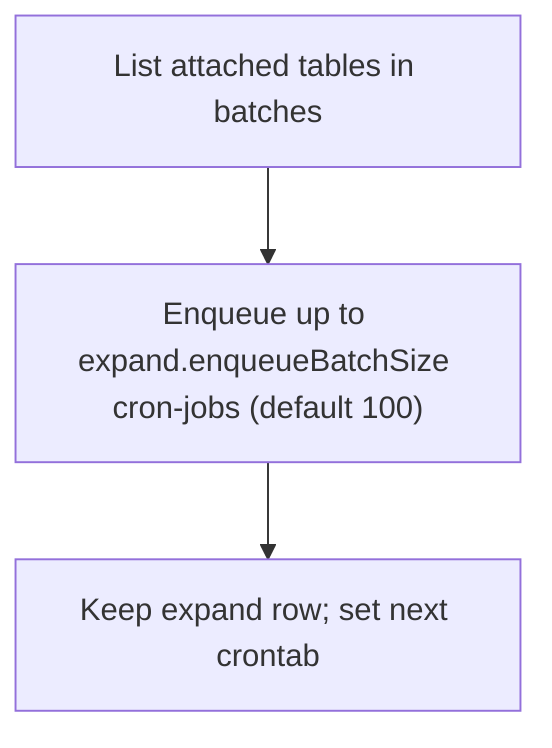
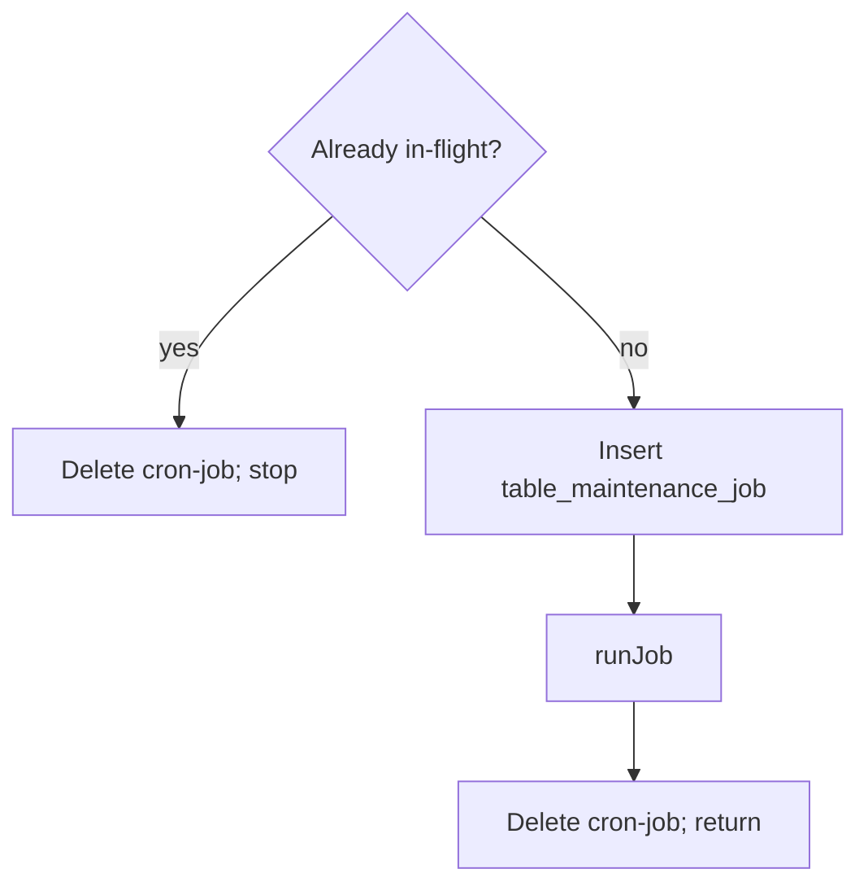
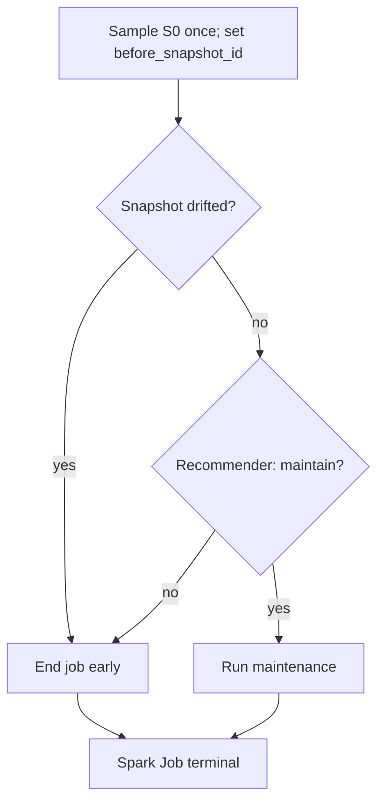
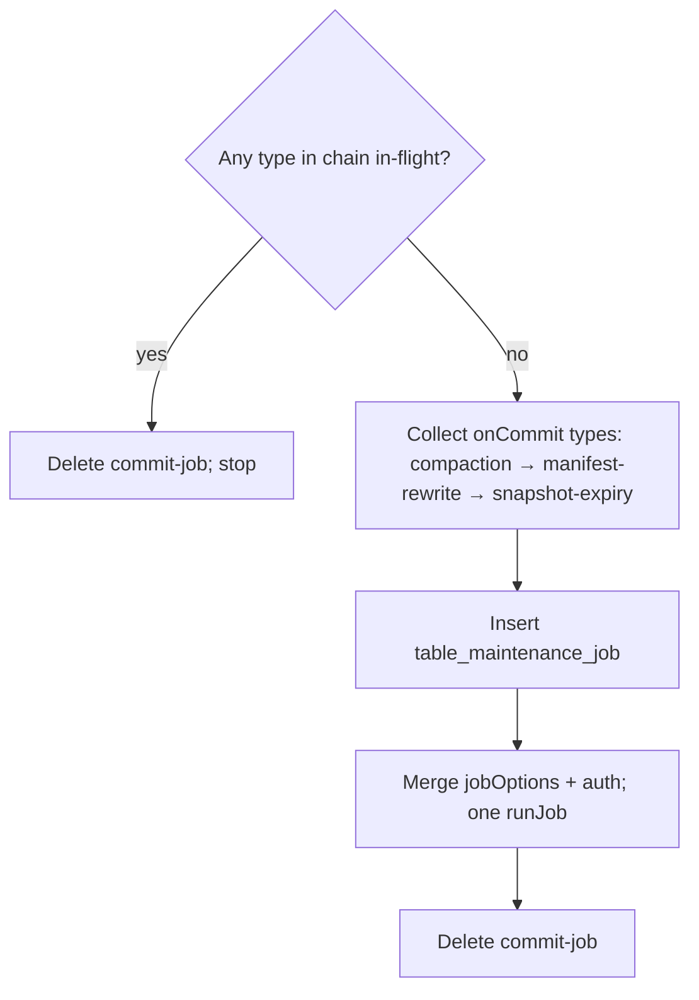
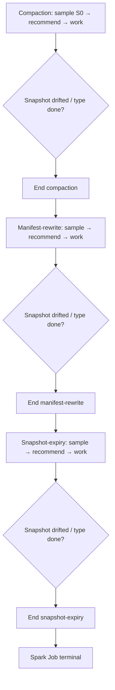
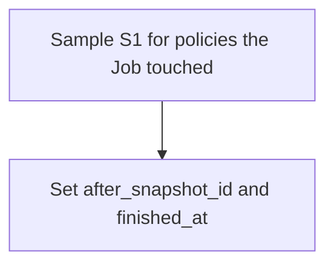

<!--
  Licensed to the Apache Software Foundation (ASF) under one
  or more contributor license agreements.  See the NOTICE file
  distributed with this work for additional information
  regarding copyright ownership.  The ASF licenses this file
  to you under the Apache License, Version 2.0 (the
  "License"); you may not use this file except in compliance
  with the License.  You may obtain a copy of the License at

   http://www.apache.org/licenses/LICENSE-2.0

  Unless required by applicable law or agreed to in writing,
  software distributed under the License is distributed on an
  "AS IS" BASIS, WITHOUT WARRANTIES OR CONDITIONS OF ANY
  KIND, either express or implied.  See the License for the
  specific language governing permissions and limitations
  under the License.
-->

# Design of Table Maintenance Service in Gravitino

## 1. Background

The Table Maintenance Service (TMS) turns the existing `maintenance/optimizer` core
(`Updater`, `Recommender`, providers, `JobSubmitter`) into a long-running capability on the
Gravitino main server.

Today that core can recommend and submit work, but nothing hosts it as a service:

1. Iceberg commits through IRC do not wake maintenance in-process.
2. Ad hoc runs lack a single place for configuration, audit, and service metrics.
3. There is no embedded, multi-node-safe scheduler for expand and submit.

This design closes those gaps by hosting that core in-process: policy-driven triggers, a
multi-node-safe scheduler for expand and submit, and Spark still on the Job framework.

---

## 2. Goals

1. Run TMS **in-process** on the main server so IRC can wake maintenance without HTTP.
2. After a successful Iceberg commit, **enqueue** commit-triggered work.
3. **Reuse** the optimizer core (`Updater` / `Recommender` / job submit) inside that process.
4. Keep Spark execution on the **Gravitino Job framework**; record each run for gates and
   Validation.
5. Store triggers and non-sensitive job settings on existing **Govern Policies** — no parallel
   policy store.
6. Stay **multi-node safe**: one scheduler claim per task; in-flight work gated by an unfinished
   job row.
7. Put **when** (`schedule`), **cooldown** (`minIntervalMs`), and **how to run**
   (`jobOptions` / `rewriteOptions`) in policy content; for each maintenance type, the
   nearest attachment wins.
8. Keep **client auth** cluster-static in `gravitino.conf` (one Gravitino identity, one IRC client
   auth).

---

## 3. Non-Goals

1. A standalone maintenance daemon or a dedicated aux Jetty port (for example **9301**).
2. Rewriting optimizer provider / submitter SPIs.
3. Commit reports from engines that bypass Gravitino IRC.
4. Commit-path HTTP or Kafka ingress (`POST …/events/iceberg-commit`, health resource).
5. Auto-creating a built-in TMS user or role. Operators grant privileges when authorization is on.

---

## 4. Solution Investigations

### 4.1 Deployment shape

| Option                              | Decision                                               |
| ----------------------------------- | ------------------------------------------------------ |
| **In-process plugin (main server)** | **Chosen** — same JVM as IRC; `extensionPackages`      |
| Separate long-running process       | Rejected — extra deployable                            |
| Aux Jetty listener (`:9301`)        | Rejected — extra port; diverges from IdP-style plugins |

**Chosen:** in-process plugin on the main server — same JVM as IRC, so commit can wake
maintenance without HTTP; loaded via `extensionPackages`. A separate process adds another
deployable and still needs a wake path into that process. An aux Jetty port adds another
listener and leaves the IdP-style plugin model used elsewhere on the main server.

### 4.2 Scheduler

TMS schedules three kinds of work (policy expand, cron Spark submit, commit-triggered Spark
submit). Industry options compared below:

|                                  | **db-scheduler** (Chosen) | JobRunr | ShedLock   | Quartz JDBC |
| -------------------------------- | ------------------------- | ------- | ---------- | ----------- |
| License                          | Apache 2.0                | LGPL v3 | Apache 2.0 | Apache 2.0  |
| Cluster CAS + heartbeat          | Yes                       | Yes     | Lock only  | Yes (heavy) |
| Fits long-lived expand + one-shot submits | Yes                | Yes     | No         | Yes         |

**Chosen:** db-scheduler — Apache 2.0, one `scheduled_tasks` table with built-in heartbeat, and it
fits both long-lived expand leases and one-shot cron/commit submits (three pools: expand / cron /
commit). JobRunr is LGPL. ShedLock only provides a lock, not the scheduler TMS needs. Quartz JDBC
can do the job but is heavier than needed here.

### 4.3 Snapshot drift

Question surveyed: if metrics were sampled at snapshot `S0` but `currentSnapshotId` is already
newer, do systems still trigger maintenance?

|                                                     | **Amoro** | **Floe** | **OpenHouse** |
| --------------------------------------------------- | --------- | -------- | ------------- |
| Gate when metrics `snapshotId` ≠ `currentSnapshotId`? | **Yes**   | No (not considered) | No (not considered) |

**Amoro:** evaluates / plans against the then-current snapshot and binds that id as
`targetSnapshotId`. Optimizers run from that plan; at commit Amoro calls Iceberg
`validateFromSnapshot(targetSnapshotId)` (OCC). If HEAD has moved in a way that invalidates the
rewrite, **the commit fails** — inconsistency is caught at submit time, after work may already have
run.

**Chosen:** TMS gates **before** continuing maintenance — after the in-job sample at `S0`, if HEAD
has moved, **do not continue** that type / cron job (end early; no re-sample loop). The next cron /
commit wake-up evaluates the fresher HEAD. Commit-time rewrite conflicts still use Iceberg OCC.

---

## 5. Proposal

TMS runs in-process on the Gravitino main server and uses db-scheduler. This chapter has two
parts:

1. **Policy** — what to maintain, when to trigger, and non-sensitive job settings.
2. **Scheduling and commit** — how work is enqueued, claimed, and recorded.

TMS has two trigger paths that stay separate:

- **crontab** — expand a policy into one-shot Spark submits (one type per submit).
- **onCommit** — after an IRC commit, enqueue one per-table commit-job; one pick runs a
  chained Spark Job for the allowed types.

Both paths end with a short control-plane `runJob` on the Gravitino Job framework. Read
policy first, then scheduling.

| Store                                                          | Role                                                         |
| -------------------------------------------------------------- | ------------------------------------------------------------ |
| `policy_meta` / `policy_relation_meta` / `policy_version_info` | Triggers + `minIntervalMs` + `jobOptions` / `rewriteOptions` |
| `scheduled_tasks`                                              | Scheduler rows: expand / cron-job / commit-job               |
| `table_maintenance_job`                                        | Per-run occupancy; before/after `snapshot_id`                |
| `table_snapshot_metrics`                                       | Metrics keyed by Iceberg `snapshot_id`                       |
| `gravitino.conf`                                               | Cluster-static Gravitino / IRC client auth                   |
| `job_run_meta`                                                 | Spark job run record / `runtime_job_template`                |

### 5.1 Policy

TMS reuses the existing metalake Policy APIs and does **not** add
`/api/maintenance/table/policies`. Each policy covers **one** maintenance type. The same
policy may enable both `onCommit` and `crontab`.

#### 5.1.1 Evaluate triggers (`onCommit` + `crontab`)

Triggers live in **`policy_version_info.content.schedule`**, next to `jobOptions`,
`rewriteOptions`, and `minIntervalMs`. Operators edit that versioned content through Policy
APIs. `policy_meta` only holds identity and attachment. `scheduled_tasks` is runtime state for db-scheduler — not where operators set triggers.

TMS has two trigger modes. They never feed each other's queues:

| Trigger    | Path                                     | Which types                                     |
| ---------- | ---------------------------------------- | ----------------------------------------------- |
| `onCommit` | IRC → **commit-job** only (skips expand) | Compaction / manifest-rewrite / snapshot-expiry |
| `crontab`  | **policy-expand** → cron-job             | All four types                                  |

**`onCommit`** runs after a successful Iceberg commit through IRC. That fits types that
rewrite or expire data and metadata from the commit stream. **`orphan-cleanup` does not:**
it scans storage for unreferenced files on a schedule. Running it on every commit would be
too heavy. Create/alter rejects `schedule.onCommit = true` for orphan-cleanup; that type is
**crontab-only**.

**`minIntervalMs`** sits in policy content **beside** `schedule` (not inside it). It is the
cooldown for **that policy's type** after `MAX(finished_at)` on `table_maintenance_job` for
`(table, policy)`. Server conf and code defaults are lower-priority fallbacks.

Example content:

```json
{
  "rewriteOptions": { "target-file-size-bytes": "536870912" },
  "jobOptions": {
    "spark.executor.memory": "7g",
    "uri": "http://host:9001/iceberg",
    "type": "rest"
  },
  "schedule": { "onCommit": true, "crontab": "0 2 * * *" },
  "minIntervalMs": 3600000
}
```

| Field               | Runtime effect                                                    |
| ------------------- | ----------------------------------------------------------------- |
| `schedule.onCommit` | IRC upserts commit-job; commit pool submits one chained Job       |
| `schedule.crontab`  | Sets / refreshes next `policy-expand` due time                    |
| `minIntervalMs`     | Cooldown for this policy's type; highest when set                 |
| `jobOptions`        | Non-sensitive Spark / IRC client props (`uri`, `type`, memory, …) |

Automated maintenance should set at least one of `onCommit` or `crontab` (orphan-cleanup:
**`crontab` only**).

#### 5.1.2 Sensitive credentials

Policy content is versioned, edited through Policy APIs, and readable with `VIEW_POLICY`.
**Secrets must not live there.** Put credential-shaped keys in `jobOptions` /
`rewriteOptions` and create/alter **rejects** them. Non-sensitive Spark / IRC client props
(`uri`, `type`, memory, …) stay on the nearest policy; auth is cluster-static in
`gravitino.conf` (values may be SecretManager references). Conf keys: §7.4.

TMS talks to **two** backends with **two** identities, so there are two prefixes:

| Prefix                                 | Who uses it                                              |
| -------------------------------------- | -------------------------------------------------------- |
| `gravitino.maintenance.gravitinoAuth.` | Control plane (expand / submit / RBAC) and Jobs that call **Gravitino** |
| `gravitino.maintenance.ircAuth.`       | Spark Jobs that call **Iceberg REST**                    |

They are not interchangeable: one principal for metalake APIs, one for IRC.

At `runJob`, the control plane builds the Job template’s two bags and **overlays** auth onto
each — it does not write secrets back into policy content:

| Runtime bag         | Non-sensitive (examples)                                      | Auth overlay                            |
| ------------------- | ------------------------------------------------------------- | --------------------------------------- |
| **`updateOptions`** | `gravitino_uri`, `metalake`, updater impl names, …            | `gravitino.maintenance.gravitinoAuth.*` |
| **`jobOptions`**    | nearest policy `jobOptions` (`uri`, `type`, Spark resources…) | `gravitino.maintenance.ircAuth.*`       |

### 5.2 Scheduling and commit

db-scheduler runs **three** task kinds in `scheduled_tasks`:

| Kind | `task_name`     | Role                                              |
| ---- | --------------- | ------------------------------------------------- |
| 1    | `policy-expand` | Long-lived lease per policy; fans out cron-jobs   |
| 2    | `cron-job`      | One-shot crontab Spark submit                     |
| 3    | `commit-job`    | One-shot commit-triggered chained Spark submit    |

**policy-expand** stays after each pick. **cron-job** and **commit-job** are deleted after a
short `runJob`. Spark lifetime and in-flight checks use `table_maintenance_job`, not those
one-shot rows.

Every node may poll; **exactly one claim wins** per due instance (CAS + heartbeat). Missed
heartbeats free only a hung **short** callback — not a long-running Spark Job.

| Pool   | Registers       | Default threads | conf key (`gravitino.maintenance.`) |
| ------ | --------------- | --------------- | ----------------------------------- |
| Expand | policy-expand   | 4               | `scheduler.expand.threads`          |
| Cron   | cron-job        | 8               | `scheduler.cron.threads`            |
| Commit | commit-job      | 4               | `scheduler.commit.threads`          |

PK is `(task_name, task_instance)`. `scheduled_tasks` uses upstream db-scheduler DDL.

**TMS tables used by cron-job and commit-job**

`job_run_meta` already records Spark runs. TMS still needs its own per-run row for **in-flight
gates**, **`minIntervalMs`**, and Iceberg **before/after snapshot ids**. That is
`table_maintenance_job`. Metric **values** live in `table_snapshot_metrics`.

| Column               | Type                       | Notes                                                                                      |
| -------------------- | -------------------------- | ------------------------------------------------------------------------------------------ |
| `id`                 | `BIGINT UNSIGNED` PK       | Auto increment                                                                             |
| `job_id`             | `BIGINT UNSIGNED NULL`     | Set at `runJob`; maps to `job_run_meta.job_run_id`; null if released before submit         |
| `table_id`           | `BIGINT UNSIGNED NOT NULL` | `table_meta` PK                                                                            |
| `policy_id`          | `BIGINT UNSIGNED NOT NULL` | Cron: that Job's policy. Commit chain: first type that ran; full chain in runtime template |
| `before_snapshot_id` | `BIGINT NULL`              | Set inside the Spark Job when S0 is sampled                                                |
| `after_snapshot_id`  | `BIGINT NULL`              | Iceberg snapshot after job terminal; null while pending                                    |
| `finished_at`        | `BIGINT UNSIGNED NULL`     | Epoch millis; **null = in-flight**                                                         |

```sql
CREATE TABLE IF NOT EXISTS `table_maintenance_job` (
    `id` BIGINT(20) UNSIGNED NOT NULL AUTO_INCREMENT COMMENT 'auto increment id',
    `job_id` BIGINT(20) UNSIGNED NULL COMMENT 'job id; set at runJob; maps to job_run_meta.job_run_id',
    `table_id` BIGINT(20) UNSIGNED NOT NULL COMMENT 'table id from table_meta',
    `policy_id` BIGINT(20) UNSIGNED NOT NULL COMMENT 'policy id from policy_meta',
    `before_snapshot_id` BIGINT(20) NULL COMMENT 'Iceberg snapshot id at sample; null until sampled',
    `after_snapshot_id` BIGINT(20) NULL COMMENT 'Iceberg snapshot id after job; null while pending',
    `finished_at` BIGINT(20) UNSIGNED NULL COMMENT 'end time; null = in-flight',
    PRIMARY KEY (`id`),
    UNIQUE KEY `uk_job_id` (`job_id`),
    KEY `idx_tmj_table_policy_finished` (`table_id`, `policy_id`, `finished_at`),
    KEY `idx_tmj_before_sid` (`table_id`, `before_snapshot_id`),
    KEY `idx_tmj_after_sid` (`table_id`, `after_snapshot_id`)
) ENGINE=InnoDB DEFAULT CHARSET=utf8mb4 COLLATE=utf8mb4_bin
  COMMENT 'per-run TMS job: snapshot pointers + submit gates';
```

Keep metrics in their own table so sample history can outlive a single run. **One row = one
`(table_id, policy_id, snapshot_id)`**. Include **`policy_id`** because the four types may sample
the same snapshot with different payloads.

```sql
CREATE TABLE IF NOT EXISTS `table_snapshot_metrics` (
    `id` BIGINT(20) UNSIGNED NOT NULL AUTO_INCREMENT COMMENT 'auto increment id',
    `table_id` BIGINT(20) UNSIGNED NOT NULL COMMENT 'table id from table_meta',
    `policy_id` BIGINT(20) UNSIGNED NOT NULL COMMENT 'policy id from policy_meta',
    `snapshot_id` BIGINT(20) NOT NULL COMMENT 'Iceberg snapshot id',
    `metrics_value` MEDIUMTEXT NOT NULL COMMENT 'JSON metrics for this snapshot',
    PRIMARY KEY (`id`),
    UNIQUE KEY `uk_tid_pid_sid` (`table_id`, `policy_id`, `snapshot_id`)
) ENGINE=InnoDB DEFAULT CHARSET=utf8mb4 COLLATE=utf8mb4_bin
  COMMENT 'per-policy table metrics by Iceberg snapshot_id';
```

Cron/commit claims **insert `table_maintenance_job` then `runJob`** — the scheduler callback stays
short. **Sampling is inside the Spark Job** (not on the control plane). On Job terminal, set
`after_snapshot_id` / `finished_at` (and `S1` metrics as needed).

The three subsections below describe each task kind.

#### 5.2.1 `policy-expand`

Each policy has one long-lived expand row (`{policy_id}`). Expand does not run Spark. When its
crontab is due, it turns the policy into many short **cron-job** rows (one candidate table at a
time). The expand row itself stays; only its next due time moves.

- **Create / enable:** insert the expand row, due at the next crontab.
- **Alter schedule:** update the due time.
- **Disable / drop:** delete the expand row.

When expand is due (expand pool):



Example with crontab `0 2 * * *`: create inserts expand due next 02:00; at 02:00 expand inserts
many cron-jobs due now, then schedules itself for the next 02:00. Expand's due time is when
**enqueue** happens — not when Spark runs.

#### 5.2.2 `cron-job`

Expand writes these one-shot rows. Most types use one table per job
(`table:{table_id}:{policy_id}`). Batched **snapshot-expiry** may use
`batch:{batch_id}:{policy_id}`.

When a cron-job is due (cron pool), keep the callback short — insert then submit; do not sample here:



Inside that Spark Job, sampling is part of the job:



If the snapshot drifts after the in-job sample, end this job early — do not re-sample in a loop.
A later wake-up sees the fresher state.

#### 5.2.3 `commit-job`

After a successful IRC table update in the same JVM, an `EventListenerPlugin` upserts one
commit-job for that table (`{table_id}`). Register it with `gravitino.eventListener.names` /
`{name}.class`. The listener only enqueues — it does not submit Spark or build the type chain.
Bursts of commits on the same table coalesce to one row.

When a commit-job is due (commit pool) — keep the callback short; Spark runs elsewhere:



Insert then `runJob` — sampling is **not** on the control plane.

Inside that **one** Spark Job, types run in order in the same process. Each type's full flow
includes its own sample / recommend / work. If the snapshot drifts during a type, **end that type**
and continue with the next type in the same Job — do not abort the whole Job:



When the Spark Job finishes (control plane Job listener):



---

## 6. Authorization privileges

TMS does **not** auto-create a metalake user, built-in role, or grants. Deployments already bind
identities through their own IdP and metalake RBAC; which catalogs TMS may touch is an operator
decision. A product-bundled privileged principal would surprise security reviews and fight that
existing model. Operators grant privileges when authorization is on.

When `gravitino.authorization.enable = false`, no RBAC identity is required.

When **authorization is enabled**, operators configure **`gravitino.maintenance.gravitinoAuth.*`**
in `gravitino.conf`. The Gravitino client authenticates with that cluster identity; the RBAC
principal is the identity from the **token**. Operators grant the privileges below **to that token
identity** so expand / submit can list metadata, read policies, resolve secrets / vend credentials
where needed, mutate tables, and run Jobs.

| Privilege          | Why                                                              |
| ------------------ | ---------------------------------------------------------------- |
| `USE_CATALOG`      | List / use catalogs                                              |
| `USE_SCHEMA`       | List / use schemas                                               |
| `PROBE_TABLE_LIKE` | Probe / list table-like objects (with `USE_SCHEMA`)              |
| `MODIFY_TABLE`     | Rewrite / expire / orphan cleanup mutate table data and metadata |
| `USE_SECRET`       | Retrieve secrets / vend credentials for objects the Jobs touch   |
| `VIEW_POLICY`      | Read attached maintenance policies and `jobOptions`              |
| `USE_JOB_TEMPLATE` | Use built-in maintenance job templates                           |
| `RUN_JOB`          | Submit Spark maintenance Jobs                                    |

---

## 7. Configuration

### 7.1 Enablement

| Key                                       | Description                                                                                      |
| ----------------------------------------- | ------------------------------------------------------------------------------------------------ |
| `gravitino.server.rest.extensionPackages` | Include TMS Feature package (e.g. `org.apache.gravitino.maintenance.web.rest.feature`)           |
| `gravitino.auxService.names`              | Include `iceberg-rest` when using IRC (same JVM)                                                 |
| `gravitino.eventListener.names`           | Include a TMS commit-job listener name (e.g. `tms-commit-job`)                                   |
| `gravitino.eventListener.{name}.class`    | FQCN of the TMS `EventListenerPlugin` that upserts commit-job on `IcebergUpdateTableEvent`       |

```properties
gravitino.server.rest.extensionPackages = org.apache.gravitino.maintenance.web.rest.feature
gravitino.auxService.names = iceberg-rest
gravitino.eventListener.names = tms-commit-job
gravitino.eventListener.tms-commit-job.class = \
  org.apache.gravitino.maintenance.listener.IcebergUpdateTableEventListener
gravitino.maintenance.scheduler.expand.threads = 4
gravitino.maintenance.scheduler.cron.threads = 8
gravitino.maintenance.scheduler.commit.threads = 4
```

`extensionPackages` plus colocated IRC start the TMS Feature and db-scheduler pools. The
**event-listener** config wakes commit maintenance: on successful IRC `IcebergUpdateTableEvent`,
the listener upserts `commit-job` / `{table_id}`. Without it, the crontab path still works;
onCommit does not. HTTP / Kafka commit ingress is out of scope.

### 7.2 Scheduler pools

| Key                                                     | Default | Description                   |
| ------------------------------------------------------- | ------- | ----------------------------- |
| `gravitino.maintenance.scheduler.expand.threads`        | `4`     | Expand pool                   |
| `gravitino.maintenance.scheduler.cron.threads`          | `8`     | Cron pool                     |
| `gravitino.maintenance.scheduler.commit.threads`        | `4`     | Commit pool                   |
| `gravitino.maintenance.scheduler.pollingIntervalMs`     | `10000` | Poll interval                 |
| `gravitino.maintenance.scheduler.heartbeatIntervalMs`   | `60000` | Heartbeat while callback runs |
| `gravitino.maintenance.scheduler.missedHeartbeatsLimit` | `6`     | Misses before dead            |
| `gravitino.maintenance.expand.enqueueBatchSize`         | `100`   | Max cron-jobs per expand pick |

### 7.3 Minimum interval

`minIntervalMs` may be set on policy content **peer to `schedule`**. It applies to **that
policy’s maintenance type**. When omitted, fall back to `gravitino.conf` then the code default.

| Task type          | Code-default `minIntervalMs` | Rationale                                              |
| ------------------ | ---------------------------- | ------------------------------------------------------ |
| `compaction`       | `3600000` (1h)               | Often `onCommit`; cooldown after commit storms         |
| `manifest-rewrite` | `3600000` (1h)               | Same — commit-driven with compaction / snapshot-expiry |
| `snapshot-expiry`  | `3600000` (1h)               | Same                                                   |
| `orphan-cleanup`   | `86400000` (1d)              | Crontab-only                                           |

**Resolution** for a given type (first hit wins):

1. effective policy content `minIntervalMs` (highest; that type’s policy)
2. global `gravitino.maintenance.task.<type>.minIntervalMs`
3. code default

Checked on cron/commit submit. Policy content still owns trigger thresholds (for example MSE); the
interval only limits how often a type may run after the last finished job.

### 7.4 Client auth (`gravitino.conf`)

Cluster-static — **not** in policy content and **not** a DB table.

| Prefix                                 | Role                                                         | Merged into `runJob` bag                        |
| -------------------------------------- | ------------------------------------------------------------ | ----------------------------------------------- |
| `gravitino.maintenance.gravitinoAuth.` | Expand / submit / RBAC client; also jobs that call Gravitino | `updateOptions` (+ non-sensitive updater props) |
| `gravitino.maintenance.ircAuth.`       | Iceberg REST client auth for Spark Jobs → IRC                | `jobOptions` (+ policy non-sensitive props)     |

Illustrative auth keys (same shape under each prefix; values may be SecretManager references where
the deployment supports them). Auth keys are **overlaid** onto each bag; they do not replace
non-sensitive updater / policy props:

| Key (suffix)        | Example                                  | Notes                |
| ------------------- | ---------------------------------------- | -------------------- |
| `authType`          | `none` / `basic` / `oauth2` / `kerberos` | Auth mode            |
| `password`          | secret ref or plaintext                  | basic                |
| `oauth2ServerUri`   | `https://idp/…/token`                    | oauth token endpoint |
| `oauthCredential`   | `client_id:client_secret`                | oauth credential     |
| `oauthScope`        | (IdP-defined; e.g. Azure `api://…/.default`) | oauth scope      |
| `kerberosPrincipal` | `tms/_HOST@REALM`                        | Kerberos             |
| `keytab`            | path or secret ref                       | Kerberos             |

```properties
# Gravitino client (control plane)
gravitino.maintenance.gravitinoAuth.authType = oauth2
gravitino.maintenance.gravitinoAuth.oauth2ServerUri = https://idp/realms/…/protocol/openid-connect/token
gravitino.maintenance.gravitinoAuth.oauthCredential = client_id:client_secret

# Iceberg REST client (Spark Jobs → IRC)
gravitino.maintenance.ircAuth.authType = oauth2
gravitino.maintenance.ircAuth.oauth2ServerUri = https://idp/realms/…/protocol/openid-connect/token
gravitino.maintenance.ircAuth.oauthCredential = client_id:client_secret
```

---

## 8. Work Plan and Checklist

| Phase | Work                                                                                  |
| ----- | ------------------------------------------------------------------------------------- |
| 1     | `TableMaintenanceRESTFeature`; start/stop three db-scheduler pools                    |
| 2     | `PolicyExpandPipeline` + `MaintenanceSparkSubmitPipeline` + gates                     |
| 3     | Migrations: `scheduled_tasks`, `table_maintenance_job`, `table_snapshot_metrics`      |
| 4     | IRC EventListener upserts commit-job; policy create → INSERT expand; Job listener     |
| 5     | Metrics, shutdown, docs; `gravitino.conf` client auth; privilege docs                 |

Implementation checklist:

- [ ] EventListener upserts commit-job only; crontab and onCommit paths do not cross.
- [ ] Expand → cron-jobs; cron/commit short submit then DELETE; occupancy on
      `table_maintenance_job`.
- [ ] Insert `table_maintenance_job` then `runJob`; sample / recommend / drift handling run
      **inside** the Spark Job; then DELETE the scheduled row.
- [ ] Validation reads metrics per type in the run; purge unreferenced history by TTL/N.
- [ ] Commit path: one chained Job; `policy_id` = first type; full chain in runtime template;
      orphan crontab-only; coalesce on `{table_id}`; Spark `jobOptions` merge uses max.
- [ ] Client auth from `gravitino.conf` only; reject credential-shaped keys in policy
      `jobOptions`.
- [ ] Authorization on ⇒ grants to the token identity; no auto user bootstrap.
- [ ] Multi-node: one pick wins; reconcile closes stale occupancy without inventing metrics.

---

## 9. References

1. [Gravitino Iceberg REST service](../docs/iceberg-rest-service.md)
2. [Manage policies in Gravitino](../docs/manage-policies-in-gravitino.md)
3. [Iceberg compaction policy](../docs/iceberg-compaction-policy.md)
4. [Table Maintenance optimizer overview](../docs/table-maintenance-service/optimizer.md)
5. [Credential vending](../docs/security/credential-vending.md)
6. [db-scheduler](https://github.com/kagkarlsson/db-scheduler) — Apache 2.0
7. [Apache Iceberg REST Catalog OpenAPI](https://github.com/apache/iceberg/blob/main/open-api/rest-catalog-open-api.yaml)
8. [Amoro AIP-3 – Event-Triggered Optimization](https://cwiki.apache.org/confluence/display/AMORO/AIP-3%3A+Event-Triggered+Optimization+of+Iceberg+Tables+in+Amoro)
9. [OpenHouse architecture](https://github.com/linkedin/openhouse/blob/main/ARCHITECTURE.md)
10. [Iceberg reliability (optimistic concurrency)](https://iceberg.apache.org/docs/latest/reliability/)
