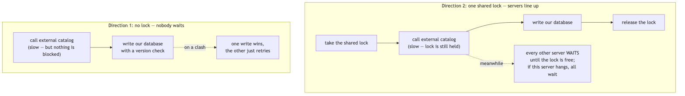

<!--
  Licensed to the Apache Software Foundation (ASF) under one
  or more contributor license agreements. See the NOTICE file
  distributed with this work for additional information
  regarding copyright ownership. The ASF licenses this file
  to you under the Apache License, Version 2.0 (the
  "License"); you may not use this file except in compliance
  with the License. You may obtain a copy of the License at

    http://www.apache.org/licenses/LICENSE-2.0

  Unless required by applicable law or agreed to in writing,
  software distributed under the License is distributed on an
  "AS IS" BASIS, WITHOUT WARRANTIES OR CONDITIONS OF ANY
  KIND, either express or implied. See the License for the
  specific language governing permissions and limitations
  under the License.
-->

# Design: Concurrency Control for Multi-Node Gravitino (TreeLock)

> Tracking issue: [#10474](https://github.com/apache/gravitino/issues/10474) — *Address TreeLock limitations for Gravitino HA deployment*

**Short words used in this doc:**

- **HA** = High Availability = running more than one Gravitino server at the same time behind a load balancer.
- **OCC** = Optimistic Concurrency Control = do not lock; instead, when you write, check "is the row still the version I read?" If yes, write; if no, someone else changed it first, so re-read and try again.
- **External catalog** = the real system that holds the data, such as Hive, Iceberg, MySQL, or Kafka.
- **Gravitino store** = Gravitino's own database (`RelationalEntityStore`) that keeps a copy of the metadata.
- **Source of truth** = the system whose data we trust as correct when two copies disagree.

---

## Background

Gravitino uses an in-memory lock called `TreeLock` (`core/src/main/java/org/apache/gravitino/lock/`) to run metadata operations one at a time. For every operation, `TreeLockUtils.doWithTreeLock` locks the whole path from the root down: a read lock on every parent, and a read or write lock on the target (or on its parent for rename/drop).

```
loadTable(metalake.cat.db.t1)        alterTable(... rename t1)        dropTable(metalake.cat.db.t1)
  /                  READ              /                  READ          /                  READ
  /metalake          READ             /metalake          READ          /metalake          READ
  /metalake/cat      READ             /metalake/cat      READ          /metalake/cat      READ
  /metalake/cat/db   READ             /metalake/cat/db   WRITE         /metalake/cat/db   WRITE
  /metalake/cat/db/t1 READ            (parent write-locked)            (parent write-locked)
```

This is built on `LockManager`, which keeps an in-memory tree of `TreeLockNode`s (each one wraps a `ReentrantReadWriteLock`), plus reference counting, a background thread that removes unused nodes, and another background thread that checks for deadlocks inside the same JVM. It is about 700 lines of code in total.

### The problem: TreeLock only works inside one JVM

Each Gravitino server has its **own** `LockManager` with its own lock tree in its own memory. A write lock taken on server A means nothing to server B. Behind a load balancer, two servers can each pass their *local* TreeLock and change the same resource at the same time. So the moment Gravitino runs in HA, TreeLock stops protecting anything across servers. This is the reason #10474 was opened.

This leaves us with a decision. There are two directions:

1. **Remove the lock** and let the shared database keep data correct.
2. **Keep the lock but make it work across nodes** (a distributed lock).

The rest of this document analyses what TreeLock really does today, then compares these two directions, then picks one.

---

## Goals

1. **Understand what TreeLock protects**: Describe what TreeLock actually guards today and whether the shared database can take that job over.
2. **Compare the two directions fairly**: Compare "remove the lock" against "make the lock work across nodes" on correctness, performance, maintainability, and operational cost, informed by how comparable systems solve the same two-store problem.
3. **Be correct no matter how many servers run**: The chosen design must be correct for one server and for many servers.
4. **Pick one direction with clear reasons**: End with a clear choice and a plan that a developer can start on.

---

## Non-Goals

1. **No single transaction across the external catalog and the Gravitino store**: We will not try 2PC/XA across the two stores. Reason: external catalogs do not all offer the same transaction guarantees; the existing pattern (re-sync on read, which is safe to repeat) is kept.
2. **No cache redesign**: Keeping caches fresh across servers (the `EntityChangeLogPoller` work) is tracked separately and only mentioned here. Reason: it is about stale (out-of-date) reads, not about wrong writes.
3. **No change to external-catalog behavior**: We will not change how Hive/Iceberg/JDBC connectors keep their own data correct. Reason: they are the source of truth for their own data.
4. **No general cleanup of stale store rows**: Removing Gravitino store rows whose external object is gone or was renamed (beyond today's `OrphanedSchemaCleanup` for schemas) is a separate, additive job — a background reconcile. Reason: it is a pre-existing gap (see the Analysis) that a lock never solved either, so it should not block this work; it is called out as a follow-up.

---

## Analysis and Investigation

### A metadata write touches two stores, with no shared transaction

The key fact that is easy to miss: **every catalog metadata operation touches two separate stores, and there is no single transaction that covers both of them**:

1. The **external catalog** (Hive, Iceberg REST, JDBC/MySQL, Kafka, …).
2. Gravitino's **own database**, the Gravitino store.

The order is always the same: **the external system first, the Gravitino store second.** From `TableOperationDispatcher`:

```text
internalCreateTable():  catalog.createTable(...)   →  store.put(tableEntity)     // lines 642-689
dropTable():            catalog.dropTable(...)      →  store.delete(ident, TABLE) // lines 366-386
alterTable():           catalog.alterTable(...)     →  store column-sync          // lines 267-340
importTable():          catalog.loadTable(...)      →  store.put(tableEntity)     // lines 474-527
```


When a table is created, its Gravitino id is written **into the external table's own properties** as a `StringIdentifier` (`internalCreateTable`, line 636). Later, when the table is read, `importTable` uses the data from the external system to **overwrite and correct** the stored copy. So for external-backed catalogs, the external system is the source of truth, and the Gravitino store is a copy that is updated later and fixes itself on the next read.

An important result: **no lock can make the two stores update as one unit.** If the process crashes after `catalog.createTable` finished but before `store.put` runs, the external system has a table with no matching Gravitino entity. This is a crash problem, not a "two things at once" problem, and neither a local nor a distributed lock can fix it. This already tells us that a lock is not the tool that keeps the two stores matched.

### How the store fixes itself, and where it stops working

Here is how the self-fix works, traced through the code. If create succeeds in the external system but the store write fails, the error is **hidden** — `internalCreateTable:688-696` catches it, logs it, and still returns success to the client with no stored entity. Nothing is fixed until someone reads the table again. On that next read, `loadTable:142` sees `imported == false` and runs `importTable`, which writes the entity into the store. Schemas behave the same way (`internalLoadSchema` + `importSchema`). So a failed store write **does** auto-correct on the next load.


The import step does not need the id to run; the id only decides how stable the result is. The details:

| External system | How "needs import" is detected | Id after the self-fix |
|---|---|---|
| Can store the id (e.g. Hive, Iceberg) — `stringId != null` | by id — `store.get(stringId.id())` (`internalLoadTable:596`) | **the original id is reused** (`importTable` sets `uid = stringId.id()`) |
| Cannot store the id (e.g. JDBC schema, PostgreSQL) — `stringId == null` | by name — `getEntity(ident)` (`internalLoadTable:570`, code comment at `:590`) | **a new id is generated** (`importTable` sets `uid = idGenerator.nextId()`) |

The narrow limit: for an id-less external system the id is really owned by the Gravitino store, so if that row is lost the id cannot be recovered, and anything that references the entity by id (owner, tag, policy, role) points at the old, now-missing id. This does not appear in the plain "create then store write fails" flow, because no id-based references exist yet.

### Not every catalog has an external system that decides the winner

Whether the external system can act as the judge depends on the catalog. In the code this is the `managedStorage` capability (`Capability` in `core/.../connector/capability/Capability.java`; the default returns "managed" only for functions). The catalogs split into two groups:

| Group | Catalogs | Source of truth for create/drop |
|---|---|---|
| **External-backed** (`managedStorage` = false for the entity) | Hive, Glue, JDBC (MySQL/PostgreSQL/Doris/OceanBase/StarRocks/BigQuery), Iceberg, Hudi, Paimon | the **external system** |
| **Gravitino-managed** (`managedStorage` = true) | fileset (schema, fileset), model (schema, model), lakehouse-generic (schema, table), kafka (schema; the topic itself is external), function | the **Gravitino store** |

This matters for the comparison below:

- For **external-backed** catalogs, the external system is a single shared system that all Gravitino nodes talk to, and it already runs its own DDL one at a time (a database rejects a duplicate `CREATE TABLE`, and will not create a table under a dropped database). Because TreeLock is per-node, **correctness across nodes here already depends on the external system today, not on TreeLock.** The exact strength differs by system (for example, JDBC databases enforce this per statement; Hive Metastore enforces it but has known weaker isolation), but the point stands: TreeLock is not what makes concurrent DDL against one shared Hive or one shared MySQL safe.
- For **Gravitino-managed** catalogs (fileset, model, and so on) there is **no external judge**. A fileset's "external" side is just a directory on HDFS or S3, which has no uniqueness check and no parent/child rule. For these, correctness can only come from the Gravitino store.

### What would break if TreeLock were simply deleted

Putting the above together, here is what happens with no in-process lock and no new database rule. The simple cases first:

| Two operations at the same time | Result | Predictable? |
|---|---|---|
| Two `createTable` with the same name (external-backed) | The external catalog allows only one; the other gets `TableAlreadyExistsException` | Yes |
| Two `alterTable` on the same table (external-backed) | The external system runs them one at a time; the store copy fixes itself on next read | Yes |
| Any write on an entity whose only source of truth is the Gravitino store (metalake, catalog, fileset, model, tag, policy, user, group, role, …) | Real lost-update / orphan races | Yes, but only closable at the database layer |
| Crash between the external op and `store.put` | Leftover object in the external system | No lock helps (crash, not concurrency) |

### Do conflicting external operations always report a clear winner?

This is a fair thing to check, because the analysis above leans on "the external system decides the winner." The precise answer: the external state always stays internally consistent (the shared metastore runs DDL one statement at a time and enforces its own integrity), **but Gravitino does not always learn which side won**, because a `drop` that finds nothing still returns without error.

- **create is loud.** A second `createTable` with the same name throws `TableAlreadyExistsException`; a `createTable` under a dropped schema throws `NoSuchSchemaException`. The loser fails clearly.
- **rename is loud.** Renaming a table whose source is gone throws `NoSuchTableException`.
- **drop is silent.** `dropTable` returns `true` if it dropped the table and `false` if the table "does not exist" (API contract: `TableCatalog.dropTable`; Hive catches not-found and returns `false`, `HiveCatalogOperations:983-993`). So a `false` can mean "someone else already dropped or renamed it" just as easily as "there was nothing to drop" — Gravitino cannot tell the two apart from the return value. `dropSchema` is the same, except it throws `NonEmptySchemaException` when the schema still has children and cascade is off.
- **drop-database vs create-table is order- and cascade-dependent.** If the create lands first and the drop cascades, both operations report success and the net external state is "gone." If the drop lands first, the create fails. If the drop is non-cascade and a child exists, the drop fails. In every ordering the external state is internally consistent, but there is no single "exactly one succeeds" rule.

Why this matters here: it does **not** make the external side inconsistent, and it does **not** cause a wrong store write (drop deletes the store row unconditionally, regardless of the boolean). But Gravitino cannot trust a drop's return value to know the true external state — one more reason the store copy needs an occasional reconcile rather than trusting each call's result. This is a reporting limit of the connector API, not something a lock would fix.

### The harder case: mixed alter / rename / drop

The worry is the mix of `alter`, `rename`, and `drop` on the same table from two servers at once. The good news: **with a healthy store, the pure concurrent race stays safe — it ends either consistent or missing a row (which self-heals). It does not by itself leave a stale row.**

Take **rename `t1 → t2` on server A** and **drop `t1` on server B**, both on an external-backed catalog. Each operation does the external step first, then the store step. Two details of the store step matter: rename's store step (`updateTable`) reads t1's row and moves it to t2 in place; drop's store step (`store.delete(t1)`) runs **unconditionally** for external-backed tables (`TableOperationDispatcher:385-386`), even when the external drop found nothing.

The external catalog serializes its own DDL, so the external side always ends consistent (either t2 exists, or nothing does). On the store side the two store steps can interleave, but with a healthy store the result is only one of these:


- **Consistent** — rename's store update lands, or drop's delete finds nothing to delete.
- **Store missing the row** — drop's `store.delete(t1)` runs between rename's external step and rename's store update, deleting the row rename was about to move; rename's update then hits 0 rows, so no row is written for t2. This **fixes itself** on the next `loadTable(t2)` via import.

The missing-row case matters only across nodes, or after removing TreeLock. Today TreeLock takes a write lock on the schema for both drop and rename, so on a single server they cannot interleave; under HA they already can, because the lock is per-node.

A second concurrent case is **create a child while its parent is being dropped** — `createTable(db.t1)` on server A while `dropSchema(db)` on server B. For external-backed catalogs the external system blocks it (it will not create a table under a dropped database). But for entities whose only source of truth is the Gravitino store, and for Gravitino's own rows, nothing stops server A from inserting the child row just after server B removed the parent — an **orphan child**. A per-row version check cannot express this; it is exactly what Change 3 (create only under a live parent) closes.

### A note on stale store rows

A natural follow-up: can the store keep a row that points at an external object that is already gone (a "stale row"), for example after an out-of-band drop in Hive or a failed `store.delete`? Yes, but for the entity itself it does not matter — relying on the external state is reliable here: `loadTable` asks the external system first, so a stale row is never trusted, and a later create with the same name overwrites it (`store.put(overwrite = true)`).

The one thing the external system cannot repair is **Gravitino-only data attached to the entity by id** — owner, tag, policy, and role relations — because `importTable` rebuilds only the entity row (a single `store.put`), not those relations. If an external object disappears out of band, those relations can be left dangling on a ghost id. This is a pre-existing data-hygiene matter that a background reconcile would clean; it is unrelated to the remove-vs-lock decision and is scoped out in Non-Goal 4.

### Summary of the analysis

- The external side is safe: for external-backed catalogs the external system decides the winner, today, with or without TreeLock.
- The concurrent rename/drop race, with a healthy store, ends either consistent or missing a row — and the missing-row case fixes itself on read (import).
- Relying on the external state to repair the store is reliable for the entity itself; only Gravitino-only relations (owner/tag/policy/role) can be left dangling, which is a pre-existing hygiene matter unrelated to this decision.
- The real correctness gap that this design must close is the writes whose only source of truth is the Gravitino store (lost updates and orphan children) — which can only be closed inside the database.

---

## How Other Systems Keep Two Stores Consistent

Changing an external system and a local store together, with no shared transaction, is the well-known "dual write" problem. It is worth checking how comparable systems solve it before we pick a direction. (This section is industry background, described at the pattern level, not verified against this repo.)

The short finding: **most modern answers avoid making a separate global lock the primary consistency mechanism.** They pick a single source of truth, let the other side catch up by itself (idempotent reconcile/cache refresh), and use a version check (OCC) or an atomic swap inside the source of truth. There are exceptions: for example, Hive ACID uses a durable metastore transaction/lock manager, and older or fallback Iceberg deployments can use an external lock manager when the catalog cannot provide atomic/OCC commits. Those are heavier, store-specific mechanisms. A lock only makes callers take turns; it does not make two writes happen as one.

| Pattern | How it stays consistent | Example systems | Separate cross-node lock? |
|---|---|---|---|
| One store only + atomic commit / OCC | There is a single metadata store; concurrent writers race on a version or an atomic pointer swap; the loser retries | Iceberg REST catalog / Apache Polaris, Nessie, AWS Glue Iceberg catalog | No for these examples |
| External is the source of truth + federated access/cache | The external system is authoritative; the service queries it or keeps a derived cache/index that is refreshed from it | Netflix Metacat (federated metadata; external stores remain authoritative), DNS resolvers (TTL cache) | No |
| Internal is the source of truth + reconcile loop | Desired state is stored internally; a controller keeps driving the external world to match, idempotently | Kubernetes (etcd + controllers), most cloud control planes | No (uses a version field / OCC) |
| Transactional outbox + async apply | Write the intent into the internal store in one transaction; a worker applies it to the external system, retrying until it succeeds | Debezium outbox pattern | No |
| Durable lock/transaction manager | Store locks/transactions in a shared durable metastore; use heartbeats/timeouts to recover crashed holders | Hive ACID / Hive Metastore `DbTxnManager` | Yes, for that lock-manager path; heavier and store-specific |
| Coordinated transaction | Two-phase commit, or a saga with compensation on failure | XA / 2PC (rare), saga frameworks | Not a lock, but heavy coordination; usually avoided |

The "internal source of truth + reconcile loop" pattern is the most common modern answer, and it looks like this:


Where Gravitino sits, and what to borrow:

- For **external-backed** catalogs, Gravitino already uses "external is the source of truth + read repair" (import on read). This is close to the federation/cache pattern: the authoritative system is outside Gravitino, and Gravitino's local row is derived from it. Metacat is only a loose comparison here because it federates schema metadata instead of materializing it as Gravitino rows.
- For **Gravitino-managed** entities, the store is the only source of truth, so the right tool is the "one store + OCC" pattern — exactly what Direction 1 proposes.
- Where Gravitino is thinner than best practice: its repair is lazy and only adds (import on read; it never removes stale rows). Systems that make the internal store authoritative (Kubernetes) run an active reconcile loop that also removes what should not exist. That active reconcile is the background job listed as a follow-up (Non-Goal 4).
- The outside signal is not that cross-node locks never exist. They do. The signal is that, for dual-write correctness, the core mechanism is usually a single authority plus OCC/atomic commit or idempotent reconciliation. A multi-node TreeLock would still not make the external catalog write and Gravitino store write atomic.

---

## Comparing the Two Directions

Both directions must reach the same bar: correct on one server and correct across many servers. They differ in how, and in what they cost.

### Direction 1 — Remove the lock, let the database keep data correct

Move the correctness rules into the shared database:

- **OCC**: most entity tables already have a version column; a write does `UPDATE ... WHERE current_version = N`. Only one of two racing writers advances `N → N+1`; the other changes 0 rows, re-reads, and retries. The database row lock for that single statement is the judge.
- **Conditional insert**: create a child only if the parent is still alive, in the same statement (`INSERT ... SELECT ... WHERE parent.deleted_at = 0`). This replaces TreeLock's "lock the parent" behavior.

After these rules exist, TreeLock no longer carries any correctness duty. It can be shrunk to a small in-process lock that only stops two operations on the **same** entity from overlapping (a speed helper, not a correctness tool).

### Direction 2 — Keep a lock, make it work across nodes

Add a cross-node lock so that, as today, one caller at a time holds the path. Two ways to build it:

- **2a — External lock service** (ZooKeeper, etcd, Redis): a real distributed lock keyed by the resource path.
- **2b — Database lock** (`SELECT ... FOR UPDATE` on a lock table): reuse the existing database as the lock, holding a row lock for the length of the operation.

Both directions do the same two steps: call the external catalog (Hive, Iceberg — this step can be slow, or even hang), then write Gravitino's own database. The real difference is what happens to the **other** servers while one server is doing this:

- **Direction 1 uses no lock.** Other servers never wait. If two servers change the same entity at the same time, the version check on the final database write lets one win; the other just retries.
- **Direction 2 makes every server take one shared lock first** and hold it through both steps — including the slow external call. While one server holds the lock, all the others wait; and if that server hangs during the external call, everyone is stuck.



### Side-by-side comparison

| Dimension | Direction 1 — remove the lock (DB OCC + conditional insert) | Direction 2 — cross-node lock (2a service / 2b DB `FOR UPDATE`) |
|---|---|---|
| Correct on one server | Yes | Yes |
| Correct across servers | Yes — the database is shared and is the judge | Yes — the lock is shared |
| Fixes the external-vs-store mismatch | No — but no lock can (see Analysis) | No — same limit |
| Cost per operation (no conflict) | None — the version check is part of the normal UPDATE | 2a: a network call to the lock service on every op. 2b: an extra lock row read/write on every op |
| Behavior during the slow external call | No lock is held during the external call | The lock is held for the **whole** operation, including the external call that may hang; one stuck holder blocks everyone |
| New dependency / single point of failure | None — reuses the database | 2a: yes, a new cluster to run and monitor. 2b: no new system, but a new lock table and new failure modes |
| Extra failure handling | Bounded retry on conflict (simple) | Lock leases, fencing tokens, and cleanup of locks held by crashed nodes (2a and 2b both need a timeout + cleanup) |
| Maintainability | Removes the ~700-line tree; adds small, local database rules; fewer moving parts overall | Keeps a lock subsystem and adds distributed-lock handling (client library, lease renewal, dialect-specific SQL for 2b); more moving parts |
| Effort to make correct | Real work: turn on OCC everywhere, fix versions, add conditional inserts (see Proposal) | Real work too: build and operate the lock layer, and still add database rules for the managed group, because the lock alone does not fix the crash gap or the managed-entity case cleanly |

### Reading the comparison

- Both directions can be made correct. The difference is cost and complexity.
- Direction 2's biggest problem is holding a lock during the external call — the slowest and least reliable step. This lowers throughput and lets one stuck node block others. Direction 1 never holds a lock during that call.
- Direction 2 also adds ongoing operational cost (a lock service to run, or lease/cleanup logic for crashed holders) with no matching correctness gain: it does **not** fix the external-vs-store mismatch, and for external-backed catalogs the external system already provides cross-node safety today.
- Direction 1 is simpler to maintain (it deletes a large subsystem) and has no per-operation network cost, but it requires spreading correctness rules across the write paths in the database layer.

---

## Conclusion

**Choose Direction 1: remove the lock as a correctness tool and let the shared database keep data correct.** Do **not** build a cross-node lock as the main mechanism.

Precisely, "remove" does **not** mean deleting all in-process locking. It means:

1. Move correctness into the database: turn on OCC, make the version always increase for every entity that uses OCC, and add a conditional insert for the parent/child rule.
2. Make failed writes safe: when the main UPDATE loses the race, all side writes in the same service must roll back.
3. Then shrink TreeLock from the ~700-line tree down to a small in-process lock that only stops two operations on the same entity from overlapping.
4. Keep a cross-node lock, if ever wanted, only as an optional, default-off fallback — not the main mechanism.

The reasons, drawn from the comparison:

- **Performance**: Direction 1 costs nothing on the normal path and never holds a lock during the slow external call. Direction 2 adds a per-operation cost and holds a lock across that call.
- **Maintainability**: Direction 1 deletes a large, tricky subsystem (the tree, reference counting, node cleanup, in-JVM deadlock checker). Direction 2 keeps it and adds distributed-lock handling on top.
- **Operational cost**: Direction 1 adds no new service and no single point of failure. Direction 2 adds a lock service to run (2a) or lease/cleanup logic for crashed holders (2a and 2b).
- **Correctness fit**: A lock cannot fix the external-vs-store mismatch, and external-backed catalogs already get cross-node safety from the shared external system. The only real gap is Gravitino-managed entities and Gravitino's own rows, which live in the shared database — exactly where Direction 1 puts the rules.
- **Matches how others solve it**: Comparable systems keep two stores consistent with a single source of truth plus idempotent reconcile and OCC, not a cross-node lock (see "How Other Systems Keep Two Stores Consistent"). Direction 1 follows that mainstream pattern.

**One hard condition on ordering.** Shrinking TreeLock (step 3 above) must come **after** the database rules (steps 1 and 2 above) are merged and tested. Doing it earlier would remove today's fallback before its replacement exists.

---

## Proposal

This is the design for Direction 1. Changes 1–3 add the database rules; Change 4 shrinks TreeLock.

### Change 1 — OCC as the base rule, with the retry in the right place

Add a typed exception and report the "0 rows updated" signal that already exists in each update path:

```java
/** Thrown when an entity UPDATE matches 0 rows because current_version changed at the same time. */
public class OptimisticLockException extends GravitinoRuntimeException { ... }
```

Put the exception in a shared module both `core` and `server` can use (for example `api/.../exceptions`). In each `*MetaService` write, throw it when the UPDATE changes 0 rows because the row still exists but its version changed. The UPDATE has this shape:

```sql
UPDATE catalog_meta
SET    ..., current_version = #{new.currentVersion}
WHERE  catalog_id = #{old.catalogId}
  AND  current_version = #{old.currentVersion}
  AND  deleted_at = 0;
```

**Where to put the retry.** The retry MUST NOT wrap the external-catalog call. Put it around the **store-only read-change-write step**, inside `RelationalEntityStore.update` / `backend.update`, where the change runs on a freshly re-read row and the only effect is the UPDATE. This way every retry sees a fresh version and repeats nothing external.

```
WRONG (simple):  doWithTreeLock { external.alter(); store.update(); }   ← retry repeats external.alter()
RIGHT:           external.alter(); retry { reRead(); apply(); conditionalUpdate(); }  ← store-only retry
```

- Retry only on WRITE paths; READ is unchanged.
- A limited number of attempts with growing wait time (config: `gravitino.entity.store.occ.maxRetries` default 3, wait 10ms → 20 → 40).
- After the attempts run out, return `OptimisticLockException` → HTTP 409 from the server `ExceptionMapper`.

Some update methods also write version rows, relation rows, or changelog rows. If the main UPDATE changes 0 rows, those side writes must roll back: run the main conditional UPDATE first, and if it changes 0 rows, throw inside the transaction so the whole transaction rolls back.

### Change 2 — Make the version always go up

OCC only works if the version goes up after a successful write. What the code does today is mixed. Verified by reading `POConverters`:

- `table` sets `currentVersion = lastVersion + 1` (`updateTablePOWithVersionAndSchemaId`). This is the good pattern.
- `metalake` and `catalog` keep the old version (`nextVersion = lastVersion` in `updateMetalakePOWithVersion` / `updateCatalogPOWithVersion`) and instead compare the whole old row field by field. That is weaker (it can miss a change that is later changed back) and fragile (it depends on `properties`/`audit_info` JSON serializing to the exact same bytes).

The other update paths (`schema`, `topic`, `user`, `group`, `role`, `tag`, `fileset`, `policy`, `view`, `function`, `model`) have **not** been checked line by line yet; some use version tables or a different version layout. Each must be audited before we rely on OCC for it.

Fix: for every entity that uses OCC, make a successful write raise the version, and reduce the UPDATE condition to `id = ? AND current_version = ? AND deleted_at = 0`. Add a test for the change-then-change-back case.

### Change 3 — Create a child only under a live parent

A per-row version check cannot stop "create a child under a parent being dropped." Make the child insert succeed only if the parent still exists, in the same transaction:

```sql
INSERT INTO table_meta (..., schema_id, ...)
SELECT ..., sm.schema_id, ...
FROM   schema_meta sm
WHERE  sm.schema_id = #{schemaId} AND sm.deleted_at = 0;
-- 0 rows inserted ⇒ the parent was dropped at the same time ⇒ NoSuchSchemaException
```

One per parent→child relation:

| Parent | Children that must check the parent is alive |
|---|---|
| metalake | catalog, tag, policy, user, group, role, job template, and other metalake-level rows |
| catalog | schema |
| schema | table, fileset, topic, model, view, function |

Import is a write on the read path, so its `store.put` must obey the same rule, or a load could re-create a child under a schema that was just dropped.

### Change 4 — Shrink TreeLock to a small in-process lock

**Condition: Changes 1–3 are merged and tested first.**

Replace the `LockManager` / `TreeLockNode` tree (with its reference counting, background node-cleanup thread, and in-JVM deadlock checker) with a small local lock keyed by the full `NameIdentifier`:

```java
// Small local helper, no tree, no cleanup thread, no deadlock checker.
// The real code must also clean unused entries safely.
private final ConcurrentMap<NameIdentifier, ReadWriteLock> locks = new ConcurrentHashMap<>();
ReadWriteLock lockFor(NameIdentifier ident) {
  return locks.computeIfAbsent(ident, ignored -> new ReentrantReadWriteLock());
}
```

- Keeps the only real benefit: running operations on the same entity one at a time inside one server, which avoids repeated external calls and database retries under bursts of DDL.
- Drops the chain of parent read locks — no longer needed, because Change 3 checks the live parent in the database.
- `doWithTreeLock(ident, type, exec)` keeps the same signature; only the code behind it changes, so call sites are untouched.
- Do **not** use a simple fixed-size striped lock unless the nested-lock case is solved: the current code calls `doWithTreeLock` inside `doWithTreeLock`, and with stripes a parent id and child id can map to the same lock, so a read lock followed by a write lock can deadlock.

### What removing TreeLock requires (summary)

The safety moves from one big in-memory lock into a few small, always-on database rules:

1. Report a conflict and retry (Change 1), retry scoped to the store only.
2. Always raise the version (Change 2).
3. Create a child only under a live parent (Change 3), including on import.
4. Roll back side writes when the main UPDATE loses (Change 1).
5. For rename across schemas, also check that the **target** schema is alive.

One boundary: `RelationalEntityStore.executeInTransaction` currently throws `UnsupportedOperationException` (`RelationalEntityStore.java:219-221`), so there is no way to wrap several different store services in one transaction. This is fine, because each rule above lives inside a single service method and uses that method's own transaction. Do not design a step that needs one transaction across multiple services.

### How users see it

1. **One server**: behavior is the same as today, except the TreeLock background threads are gone after Change 4.
2. **Many servers writing the same entity**: the writer that loses re-reads and tries again; after the attempts run out, the client gets HTTP 409 instead of 500. Unrelated entities are never blocked.
3. **No new configuration is needed** to be correct; OCC is on by default.

### Backward compatibility

- **APIs**: additions only. New `OptimisticLockException`; `doWithTreeLock` keeps its signature. No REST change except 409 replacing some 500s on write conflicts.
- **Storage**: no schema migration (reuses existing version columns); Change 2 changes how the version is computed; Change 3 changes the shape of the INSERT SQL, not the schema.
- **Behavior**: one-server behavior is unchanged through Change 3; Change 4 removes the TreeLock background threads and turns the `gravitino.lock.*` tree-size configs into no-ops (kept but ignored for one release).

---

## Task Breakdown

### Phase 1 — OCC base rule (the key phase)
- [ ] Add `OptimisticLockException` in a shared module (`api/.../exceptions`)
- [ ] In each `*MetaService` write, throw it when the UPDATE changes 0 rows (`TableMetaService`, `SchemaMetaService`, `CatalogMetaService`, `MetalakeMetaService`, `FilesetMetaService`, `TopicMetaService`, `ModelMetaService`, `ViewMetaService`, `FunctionMetaService`, `PolicyMetaService`, `TagMetaService`, `UserMetaService`, `GroupMetaService`, `RoleMetaService`, `JobTemplateMetaService`, and statistic services)
- [ ] Fix services that write side tables: on a 0-row main UPDATE, throw inside the transaction and roll back version/relation/changelog rows
- [ ] On 0 rows, re-read; if the entity is gone, throw `NoSuchEntityException` instead of retrying
- [ ] Add the bounded retry **inside `RelationalEntityStore.update` / `backend.update`**, not in `doWithTreeLock`
- [ ] Add config keys `gravitino.entity.store.occ.maxRetries` and the wait time; map the exhausted case to 409 in the server `ExceptionMapper`
- [ ] Unit tests: 0-row → retry succeeds, retries run out → 409, READ path does not retry, the external call runs once across retries, side rows roll back on conflict

### Phase 2 — Always-increasing version
- [ ] Audit every update path's version behavior in `POConverters` (confirmed frozen so far: metalake, catalog; confirmed good: table)
- [ ] Raise the version wherever it is frozen today
- [ ] Review fileset, policy, view, function, and model separately (version tables / different layout)
- [ ] Reduce UPDATE `WHERE` clauses to the version check once the version rule is correct; drop full-row compare
- [ ] Unit tests: change-then-change-back is rejected; concurrent property updates no longer depend on exact JSON bytes

### Phase 3 — Create a child only under a live parent
- [ ] Conditional `INSERT … SELECT … WHERE parent.deleted_at = 0` for each parent→child relation
- [ ] Make import / overwrite / upsert paths obey the same live-parent rule
- [ ] Map a 0-row insert to the right `NoSuch<Parent>Exception`
- [ ] Two-server test: `createTable` vs `dropSchema` leaves no orphan

### Phase 4 — Shrink TreeLock (needs Phases 1–3 first)
- [ ] Replace the `LockManager`/`TreeLockNode` tree with a small local keyed lock behind the existing `doWithTreeLock` signature
- [ ] Add a test for nested locks (read lock on a parent, write lock on a child, in the same thread)
- [ ] Remove the in-JVM deadlock checker and node-cleanup thread; keep but ignore the `gravitino.lock.*` configs for one release
- [ ] Regression: full one-server suite green; a small speed test shows no slowdown when many operations hit the same entity

### Phase 5 (optional) — Cross-node fallback lock
- [ ] Only if there is demand: add a pluggable lock backend with an in-process default and an opt-in database (`FOR UPDATE`) backend, layered above the OCC base and default-off, with a timeout and cleanup for crashed holders

### Validation (across phases)
- [ ] Two-server, shared-database tests for: same-entity write race, orphan child, change-then-change-back
- [ ] Metrics: retry rate, write-conflict 409 rate, write P99 latency
- [ ] Confirm no regression with all optional flags off
