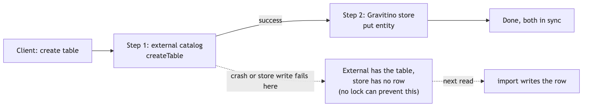
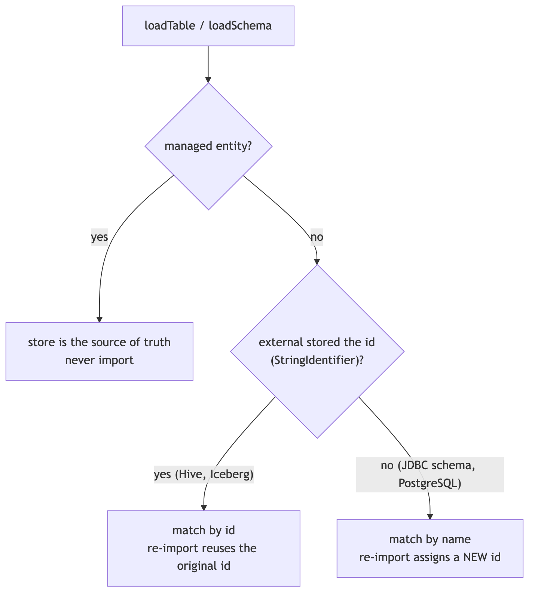
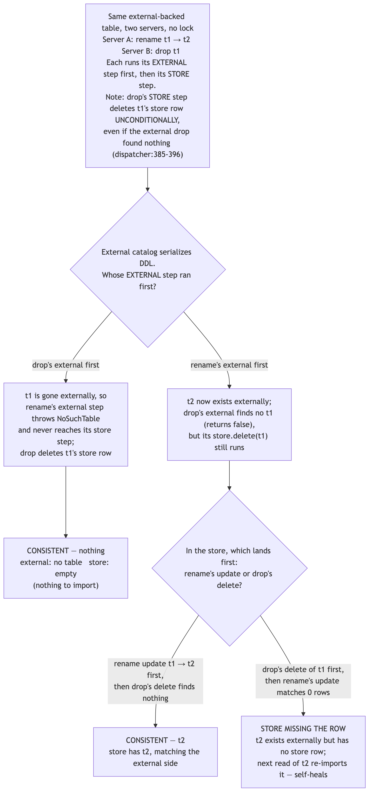
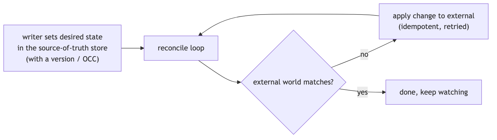

<!--
  Licensed to the Apache Software Foundation (ASF) under one
  or more contributor license agreements. See the NOTICE file
  distributed with this work for additional information
  regarding copyright ownership. The ASF licenses this file
  to you under the Apache License, Version 2.0 (the
  "License"); you may not use this file except in compliance
  with the License. You may obtain a copy of the License at

    http://www.apache.org/licenses/LICENSE-2.0

  Unless required by applicable law or agreed to in writing,
  software distributed under the License is distributed on an
  "AS IS" BASIS, WITHOUT WARRANTIES OR CONDITIONS OF ANY
  KIND, either express or implied. See the License for the
  specific language governing permissions and limitations
  under the License.
-->

# Design: Concurrency Control for Multi-Node Gravitino (TreeLock)

> Tracking issue: [#10474](https://github.com/apache/gravitino/issues/10474) — *Address TreeLock limitations for Gravitino HA deployment*

**Short words used in this doc:**

- **HA** = High Availability = running more than one Gravitino server at the same time behind a load balancer.
- **OCC** = Optimistic Concurrency Control = the caller does not take an application/path lock before work; when it writes, it checks "is the row still the version I read?" If yes, write; if no, someone else changed it first, so handle the conflict. The database still takes its normal short statement/transaction locks.
- **External catalog** = the real system that holds the data, such as Hive, Iceberg, MySQL, or Kafka.
- **Gravitino store** = Gravitino's own database (`RelationalEntityStore`) that keeps a copy of the metadata.
- **Source of truth** = the system whose data we trust as correct when two copies disagree.

---

## Background

Gravitino uses an in-memory lock called `TreeLock` (`core/src/main/java/org/apache/gravitino/lock/`) to run metadata operations one at a time. For every operation, `TreeLockUtils.doWithTreeLock` locks the whole path from the root down: a read lock on every parent, and a read or write lock on the target (or on its parent for rename/drop).

```
loadTable(metalake.cat.db.t1)        alterTable(... rename t1)        dropTable(metalake.cat.db.t1)
  /                  READ              /                  READ          /                  READ
  /metalake          READ             /metalake          READ          /metalake          READ
  /metalake/cat      READ             /metalake/cat      READ          /metalake/cat      READ
  /metalake/cat/db   READ             /metalake/cat/db   WRITE         /metalake/cat/db   WRITE
  /metalake/cat/db/t1 READ            (parent write-locked)            (parent write-locked)
```

This is built on `LockManager`, which keeps an in-memory tree of `TreeLockNode`s (each one wraps a `ReentrantReadWriteLock`), plus reference counting, a background thread that removes unused nodes, and another background thread that checks for deadlocks inside the same JVM. It is about 800 lines of code in total (`LockManager` ~300, `TreeLockNode` ~250, `TreeLock` ~180, `TreeLockUtils` ~70).

### The problem: TreeLock only works inside one JVM

Each Gravitino server has its **own** `LockManager` with its own lock tree in its own memory. A write lock taken on server A means nothing to server B. Behind a load balancer, two servers can each pass their *local* TreeLock and change the same resource at the same time. So the moment Gravitino runs in HA, TreeLock stops protecting anything across servers. This is the reason #10474 was opened.

This leaves us with a decision. There are two directions:

1. **Remove TreeLock's correctness role** and let explicit rules in the shared database keep data correct.
2. **Keep the lock but make it work across nodes** (a distributed lock).

The rest of this document analyses what TreeLock really does today, then compares these two directions, then picks one.

---

## Goals

1. **Understand what TreeLock protects today**: Describe what TreeLock actually guards, and which of those guarantees the shared database could provide instead.
2. **Evaluate the candidate directions on equal footing**: Assess each direction — database-native concurrency, and a cross-node distributed lock — against the same criteria (correctness, performance, maintainability, operational cost), informed by how comparable systems solve the two-store problem. Neither direction is assumed better going in.
3. **Correctness for one and for many servers**: Whatever is chosen must be correct with a single server and under HA.
4. **Decide with evidence**: End with a direction and the reasons behind it, plus a plan a developer can start on.

---

## Non-Goals

1. **No single transaction across the external catalog and the Gravitino store**: We will not try 2PC/XA across the two stores. External catalogs do not all offer the same transaction guarantees, so the existing pattern (re-sync on read, which is safe to repeat) is kept.
2. **Write correctness only, not read staleness**: This document is about correct concurrent *writes*. Keeping each server's *cached reads* fresh across nodes (the `EntityChangeLogPoller` work) is a separate effort, out of scope here.
3. **No change to external-catalog behavior**: We will not change how Hive/Iceberg/JDBC connectors keep their own data correct; they are the source of truth for their own data.

---

## Analysis and Investigation

### A metadata write touches two stores, with no shared transaction

The key fact that is easy to miss: **every catalog metadata operation touches two separate stores, and there is no single transaction that covers both of them**:

1. The **external catalog** (Hive, Iceberg REST, JDBC/MySQL, Kafka, …).
2. Gravitino's **own database**, the Gravitino store.

The order is always the same: **the external system first, the Gravitino store second.** From `TableOperationDispatcher`:

```text
internalCreateTable():  catalog.createTable(...)   →  store.put(tableEntity)     // lines 642-689
dropTable():            catalog.dropTable(...)      →  store.delete(ident, TABLE) // lines 366-386
alterTable():           catalog.alterTable(...)     →  store column-sync          // lines 267-340
importTable():          catalog.loadTable(...)      →  store.put(tableEntity)     // lines 474-527
```



When a table is created, its Gravitino id is written **into the external table's own properties** as a `StringIdentifier` (`internalCreateTable`, line 636). Later, when the table is read, `importTable` uses the data from the external system to **overwrite and correct** the stored copy. So for external-backed catalogs, the external system is the source of truth, and the Gravitino store is a copy that is updated later and fixes itself on the next read.

An important result: **no lock can make the two stores update as one unit.** If the process crashes after `catalog.createTable` finished but before `store.put` runs, the external system has a table with no matching Gravitino entity. This is a crash problem, not a "two things at once" problem, and neither a local nor a distributed lock can fix it. This already tells us that a lock is not the tool that keeps the two stores matched.

### How the store fixes itself, and where it stops working

Here is how the self-fix works, traced through the code. If create succeeds in the external system but the store write fails, the error is **hidden** — `internalCreateTable:688-696` catches it, logs it, and still returns success to the client with no stored entity. Nothing is fixed until someone reads the table again. On that next read, `loadTable:142` sees `imported == false` and runs `importTable`, which writes the entity into the store. Schemas behave the same way (`internalLoadSchema` + `importSchema`). So a failed store write **does** auto-correct on the next load.



The import step does not need the id to run; the id only decides how stable the result is. The details:

| External system                                                         | How "needs import" is detected                                                 | Id after the self-fix                                                       |
| ----------------------------------------------------------------------- | ------------------------------------------------------------------------------ | --------------------------------------------------------------------------- |
| Can store the id (e.g. Hive, Iceberg) — `stringId != null`              | by id — `store.get(stringId.id())` (`internalLoadTable:596`)                   | **the original id is reused** (`importTable` sets `uid = stringId.id()`)    |
| Cannot store the id (e.g. JDBC schema, PostgreSQL) — `stringId == null` | by name — `getEntity(ident)` (`internalLoadTable:570`, code comment at `:590`) | **a new id is generated** (`importTable` sets `uid = idGenerator.nextId()`) |

The narrow limit: for an id-less external system the id is really owned by the Gravitino store, so if that row is lost the id cannot be recovered, and anything that references the entity by id (owner, tag, policy, role) points at the old, now-missing id. This does not appear in the plain "create then store write fails" flow, because no id-based references exist yet.

### Not every catalog has an external system that decides the winner

Whether the external system can act as the judge depends on the catalog. In the code this is the `managedStorage` capability (`Capability` in `core/.../connector/capability/Capability.java`; the default returns "managed" only for functions). The catalogs split into two groups:

| Group                                                         | Catalogs                                                                                                                                    | Source of truth for create/drop |
| ------------------------------------------------------------- | ------------------------------------------------------------------------------------------------------------------------------------------- | ------------------------------- |
| **External-backed** (`managedStorage` = false for the entity) | Hive, Glue, JDBC (MySQL/PostgreSQL/Doris/OceanBase/StarRocks/BigQuery), Iceberg, Hudi, Paimon                                               | the **external system**         |
| **Gravitino-managed** (`managedStorage` = true)               | fileset (schema, fileset), model (schema, model), lakehouse-generic (schema, table), kafka (schema; the topic itself is external), function | the **Gravitino store**         |

This matters for the comparison below:

- For **external-backed** catalogs, the external system is a single shared authority that all Gravitino nodes talk to. It decides the final state according to its own concurrency semantics. For example, a database normally rejects a duplicate `CREATE TABLE`; Hive Metastore accepts full-table replacement alters without exposing a Gravitino-compatible version/CAS contract, so concurrent alters are not guaranteed to merge and may be last-writer-wins. Gravitino does not promise stronger merge semantics than the external catalog. Because TreeLock is per-node — and ordinary table alter currently takes a TreeLock read lock, so same-table alters can overlap even in one JVM — **cross-node behavior here already depends on the external system today, not on TreeLock.**
- For **Gravitino-managed** catalogs (fileset, model, and so on) there is **no external judge**. A fileset's "external" side is just a directory on HDFS or S3, which has no uniqueness check and no parent/child rule. For these, correctness can only come from the Gravitino store.

### What would break without TreeLock 

Putting the above together, here is what happens with no in-process lock and no new database rule. The simple cases first:

| Two operations at the same time                                                                                                                 | Result                                                                                                                                                               | Predictable?                                 |
| ----------------------------------------------------------------------------------------------------------------------------------------------- | -------------------------------------------------------------------------------------------------------------------------------------------------------------------- | -------------------------------------------- |
| Two `createTable` with the same name (external-backed)                                                                                          | The external catalog allows only one; the other gets `TableAlreadyExistsException`                                                                                   | Yes                                          |
| Two `alterTable` on the same table (external-backed)                                                                                            | The external system determines the final state under its own semantics; Gravitino does not guarantee field-level merge. The store mirror must converge to that state | Yes, within the external system's contract   |
| Any write on an entity whose only source of truth is the Gravitino store (metalake, catalog, fileset, model, tag, policy, user, group, role, …) | Real lost-update / orphan races                                                                                                                                      | Yes, but only closable at the database layer |
| Crash between the external op and `store.put`                                                                                                   | Leftover object in the external system                                                                                                                               | No lock helps (crash, not concurrency)       |

### Do conflicting external operations always report a clear winner?

This is a fair thing to check, because the analysis above leans on "the external system decides the winner." The precise answer is narrower: the external system is authoritative and applies its own integrity and concurrency rules, but those rules do not necessarily provide field-level merge, compare-and-set, or an "exactly one succeeds" result to Gravitino. Gravitino also does not always learn which side won, because a `drop` that finds nothing still returns without error.

- **create is loud.** A second `createTable` with the same name throws `TableAlreadyExistsException`; a `createTable` under a dropped schema throws `NoSuchSchemaException`. The loser fails clearly.
- **rename is loud.** Renaming a table whose source is gone throws `NoSuchTableException`.
- **drop is silent.** `dropTable` returns `true` if it dropped the table and `false` if the table "does not exist" (API contract: `TableCatalog.dropTable`; Hive catches not-found and returns `false`, `HiveCatalogOperations:983-993`). So a `false` can mean "someone else already dropped or renamed it" just as easily as "there was nothing to drop" — Gravitino cannot tell the two apart from the return value. `dropSchema` is the same, except it throws `NonEmptySchemaException` when the schema still has children and cascade is off.
- **drop-database vs create-table is order- and cascade-dependent.** If the create lands first and the drop cascades, both operations report success and the net external state is "gone." If the drop lands first, the create fails. If the drop is non-cascade and a child exists, the drop fails. In every ordering the external state is internally consistent, but there is no single "exactly one succeeds" rule.

Why this matters here: it does **not** make the external side inconsistent, and it does **not** cause a wrong store write (drop deletes the store row unconditionally, regardless of the boolean). But Gravitino cannot trust a drop's return value to know the true external state — one more reason the store copy needs an occasional reconcile rather than trusting each call's result. This is a reporting limit of the connector API, not something a lock would fix.

### The harder case: mixed alter / rename / drop

The worry is the mix of `alter`, `rename`, and `drop` on the same table from two servers at once. The good news: **with a healthy store, the pure concurrent race stays safe — it ends either consistent or missing a row (which self-heals). It does not by itself leave a stale row.**

Take **rename `t1 → t2` on server A** and **drop `t1` on server B**, both on an external-backed catalog. Each operation does the external step first, then the store step. Two details of the store step matter: rename's store step (`updateTable`) reads t1's row and moves it to t2 in place; drop's store step (`store.delete(t1)`) runs **unconditionally** for external-backed tables (`TableOperationDispatcher:385-386`), even when the external drop found nothing.

The external catalog serializes DDL, so which side wins on the external side depends on **whose external step ran first**. That, plus the fact that drop's store delete is unconditional, gives exactly these outcomes:



- **Drop's external step ran first** — t1 is already gone, so rename's external step throws `NoSuchTableException` and never reaches its store step. Drop deletes t1's store row. External and store both end empty → **consistent** (nothing to import).
- **Rename's external step ran first** — t2 now exists externally, and drop's external step finds no t1 (returns false) — but its store step still deletes t1's store row **unconditionally**. Now the two store steps race:
  - rename's store update (t1 → t2) lands before drop's delete → the store has t2 → **consistent**;
  - drop's delete removes t1's row before rename's store update → rename's update matches 0 rows and writes nothing → **store missing the row**: t2 exists externally but has no store row. This **fixes itself** on the next `loadTable(t2)` via import.

The missing-row case matters only across nodes, or after removing TreeLock. Today TreeLock takes a write lock on the schema for both drop and rename, so on a single server they cannot interleave; under HA they already can, because the lock is per-node.

A second concurrent case is **create a child while its parent is being dropped** — `createTable(db.t1)` on server A while `dropSchema(db)` on server B. For external-backed catalogs the external system decides this race. But for entities whose only source of truth is the Gravitino store, and for Gravitino's own rows, nothing stops server A from inserting the child row just after server B removed the parent — an **orphan child**. A per-row version check cannot express this. A plain `INSERT ... SELECT ... WHERE parent.deleted_at = 0` is also insufficient at Gravitino's `READ_COMMITTED` isolation: drop can check that there are no children, the create can then observe a live parent and commit, and the drop can finally delete the parent. Change 4 defines the required shared parent-row transaction protocol.

### A note on stale store rows

A natural follow-up: can the store keep a row that points at an external object that is already gone (a "stale row"), for example after an out-of-band drop in Hive or a failed `store.delete`? Yes, but for the entity itself it does not matter — relying on the external state is reliable here: `loadTable` asks the external system first, so a stale row is never trusted, and a later create with the same name overwrites it (`store.put(overwrite = true)`).

The one thing the external system cannot repair is **Gravitino-only data attached to the entity by id** — owner, tag, policy, and role relations — because `importTable` rebuilds only the entity row (a single `store.put`), not those relations. If an external object disappears out of band, those relations can be left dangling on a ghost id. This is a pre-existing data-hygiene matter that a background reconcile would clean; it is unrelated to the remove-vs-lock decision and is tracked separately (see the appendix, "Pre-existing hazards").

### Summary of the analysis

- For external-backed catalogs, the external system is authoritative and decides the final state under its own concurrency contract, today, with or without TreeLock. This does not imply that concurrent full-object alters are merged.
- The concurrent rename/drop race, with a healthy store, ends either consistent or missing a row — and the missing-row case fixes itself on read (import).
- Relying on the external state to repair the store is reliable for the entity itself; only Gravitino-only relations (owner/tag/policy/role) can be left dangling on a ghost id, which a background relation GC cleans (see the appendix, "Pre-existing hazards").
- The real correctness gap that this design must close is the writes whose only source of truth is the Gravitino store (lost updates and orphan children) — which can only be closed inside the database.

---

## How Other Systems Keep Two Stores Consistent

Changing an external system and a local store together, with no shared transaction, is the well-known "dual write" problem. It is worth checking how comparable systems solve it before we pick a direction. (This section is industry background, described at the pattern level, not verified against this repo.)

The short finding: **most modern answers avoid making a separate global lock the primary consistency mechanism.** They pick a single source of truth, let the other side catch up by itself (idempotent reconcile/cache refresh), and use a version check (OCC) or an atomic swap inside the source of truth. There are exceptions: for example, Hive ACID uses a durable metastore transaction/lock manager, and older or fallback Iceberg deployments can use an external lock manager when the catalog cannot provide atomic/OCC commits. Those are heavier, store-specific mechanisms. A lock only makes callers take turns; it does not make two writes happen as one.

| Pattern                                                  | How it stays consistent                                                                                                             | Example systems                                                                                       | Separate cross-node lock?                                   |
| -------------------------------------------------------- | ----------------------------------------------------------------------------------------------------------------------------------- | ----------------------------------------------------------------------------------------------------- | ----------------------------------------------------------- |
| One store only + atomic commit / OCC                     | There is a single metadata store; concurrent writers race on a version or an atomic pointer swap; the loser retries                 | Iceberg REST catalog / Apache Polaris, Nessie, AWS Glue Iceberg catalog                               | No for these examples                                       |
| External is the source of truth + federated access/cache | The external system is authoritative; the service queries it or keeps a derived cache/index that is refreshed from it               | Netflix Metacat (federated metadata; external stores remain authoritative), DNS resolvers (TTL cache) | No                                                          |
| Internal is the source of truth + reconcile loop         | Desired state is stored internally; a controller keeps driving the external world to match, idempotently                            | Kubernetes (etcd + controllers), most cloud control planes                                            | No (uses a version field / OCC)                             |
| Transactional outbox + async apply                       | Write the intent into the internal store in one transaction; a worker applies it to the external system, retrying until it succeeds | Debezium outbox pattern                                                                               | No                                                          |
| Durable lock/transaction manager                         | Store locks/transactions in a shared durable metastore; use heartbeats/timeouts to recover crashed holders                          | Hive ACID / Hive Metastore `DbTxnManager`                                                             | Yes, for that lock-manager path; heavier and store-specific |
| Coordinated transaction                                  | Two-phase commit, or a saga with compensation on failure                                                                            | XA / 2PC (rare), saga frameworks                                                                      | Not a lock, but heavy coordination; usually avoided         |

The "internal source of truth + reconcile loop" pattern is the most common modern answer, and it looks like this:



Where Gravitino sits, and what to borrow:

- For **external-backed** catalogs, Gravitino already uses "external is the source of truth + read repair" (import on read). This is close to the federation/cache pattern: the authoritative system is outside Gravitino, and Gravitino's local row is derived from it. Metacat is only a loose comparison here because it federates schema metadata instead of materializing it as Gravitino rows.
- For **Gravitino-managed** entities, the store is the only source of truth, so the right tool is the "one store + OCC" pattern — exactly what Direction 1 proposes.
- Where Gravitino is thinner than best practice: its repair is lazy and only adds (import on read; it never removes stale rows). Systems that make the internal store authoritative (Kubernetes) run an active reconcile loop that also removes what should not exist. That active reconcile is the background job listed in the appendix, "Pre-existing hazards".
- The outside signal is not that cross-node locks never exist. They do. The signal is that, for dual-write correctness, the core mechanism is usually a single authority plus OCC/atomic commit or idempotent reconciliation. A multi-node TreeLock would still not make the external catalog write and Gravitino store write atomic.

---

## Comparing the Two Directions

Both directions must reach the same bar: correct on one server and correct across many servers. They differ in how, and in what they cost.

### Direction 1 — Remove TreeLock's correctness role, use database-native concurrency

Move the correctness rules into the shared database:

- **OCC**: most entity tables already have a version column; a write does `UPDATE ... WHERE current_version = N`. Only one of two racing writers advances `N → N+1`; the other changes 0 rows, re-reads, and retries. The database row lock for that single statement is the judge.
- **Strict create**: a user create uses a non-overwriting insert so a unique-key conflict selects one winner. Idempotent upsert remains available only for import/reconcile paths.
- **Cross-row invariant protocol**: create-child, drop-parent, rename-to-parent, and relation-endpoint operations take the same parent or endpoint row lock inside a short database transaction. The lock is never held across an external-catalog RPC.

After these rules exist and the full call-site audit and two-node tests pass, TreeLock no longer carries any correctness duty. It can be shrunk to a small in-process helper (a speed helper, not a correctness tool).

### Direction 2 — Keep a lock, make it work across nodes

Add a cross-node lock so that, as today, one caller at a time holds the path. Two ways to build it:

- **2a — External lock service** (ZooKeeper, etcd, Redis): a real distributed lock keyed by the resource path.
- **2b — Database lock** (`SELECT ... FOR UPDATE` on a lock table): reuse the existing database as the lock, holding a row lock for the length of the operation.

Both directions do the same two steps: call the external catalog (Hive, Iceberg — this step can be slow, or even hang), then write Gravitino's own database. The real difference is what happens to the **other** servers while one server is doing this:

- **Direction 1 does not hold a global/path lock across the external call.** Same-row writes use OCC. Cross-row invariants can wait briefly on a parent or endpoint row inside the store transaction, but unrelated operations and external RPCs are not serialized.
- **Direction 2 makes every server take one shared lock first** and hold it through both steps — including the slow external call. While one server holds the lock, all the others wait; and if that server hangs during the external call, everyone is stuck.

```text
Direction 1: external RPC (no DB/path lock held) → short store transaction (OCC or targeted row lock)
Direction 2: acquire shared path lock → external RPC → store write → release shared path lock
```

### Side-by-side comparison

| Dimension                                | Direction 1 — remove TreeLock's correctness role (OCC + strict insert + targeted DB transaction guards)                                                | Direction 2 — cross-node path lock (2a service / 2b DB `FOR UPDATE`)                                                                                                                                                |
| ---------------------------------------- | ------------------------------------------------------------------------------------------------------------------------------------------------------ | ------------------------------------------------------------------------------------------------------------------------------------------------------------------------------------------------------------------- |
| Correct on one server                    | Yes                                                                                                                                                    | Yes                                                                                                                                                                                                                 |
| Correct across servers                   | Yes only after Changes 1–5 and their two-node tests pass — the database is shared and is the judge                                                     | Yes if the distributed lock is correctly implemented and every caller participates                                                                                                                                  |
| Fixes the external-vs-store mismatch     | No — but no lock can (see Analysis)                                                                                                                    | No — same limit                                                                                                                                                                                                     |
| Cost per operation (no conflict)         | Same-row OCC adds no round trip beyond the normal UPDATE; cross-row invariants add a short parent/endpoint row-lock query inside the store transaction | 2a: a network call to the lock service on every op. 2b: an extra lock row read/write on every op                                                                                                                    |
| Behavior during the slow external call   | No database or distributed lock is held during the external call                                                                                       | The path lock is held for the **whole** operation, including the external call that may hang; one stuck holder blocks everyone                                                                                      |
| New dependency / single point of failure | None — reuses the database                                                                                                                             | 2a: yes, a new cluster to run and monitor. 2b: no new system, but a new lock table and new failure modes                                                                                                            |
| Extra failure handling                   | Bounded OCC retry plus normal transaction timeout/deadlock handling                                                                                    | 2a needs leases, fencing, and crashed-holder handling. Transactional 2b row locks are released on commit, rollback, or connection loss, but still need lock/deadlock timeouts and must not span a slow external RPC |
| Maintainability                          | Removes the ~700-line tree; adds explicit database invariants and targeted transaction guards                                                          | Keeps a lock subsystem and adds distributed-lock handling (client library and lease renewal for 2a, or dialect-specific SQL and long-transaction risks for 2b)                                                      |
| Effort to make correct                   | Real work: enable OCC, split strict create from upsert, add parent/endpoint protocols, and audit every cross-row invariant (see Proposal)              | Real work too: build and operate the lock layer, and still add database rules for managed data and crash/reconcile cases                                                                                            |

### Reading the comparison

- Both directions can be made correct. The difference is cost and complexity.
- Direction 2's biggest problem is holding a lock during the external call — the slowest and least reliable step. This lowers throughput and lets one stuck node block others. Direction 1 never holds a lock during that call.
- Direction 2 also adds ongoing operational cost (a lock service with lease/fencing for 2a, or long database transactions and lock-timeout/deadlock handling for 2b) with no matching correctness gain: it does **not** fix the external-vs-store mismatch, and external-backed catalogs already rely on the external authority's own semantics today.
- Direction 1 is simpler to maintain (it deletes a large subsystem) and has no per-operation network cost, but it requires spreading correctness rules across the write paths in the database layer.

---

## Conclusion

**Choose Direction 1 as the target architecture: do not build a distributed TreeLock around the external-catalog call and the Gravitino-store write.** This is a directional decision, not approval to shrink TreeLock now.

The stronger statement "TreeLock is no longer needed after OCC plus a conditional insert" is **not yet proven**. The implementation and tests must first close all of these approval gates:

1. Enable real OCC and make every side write roll back with a losing update.
2. Split managed user-create from import/reconcile upsert so the unique constraint elects exactly one create winner.
3. Replace the insufficient live-parent conditional insert with a shared parent-row transaction protocol used by both child creation and parent deletion.
4. Split OCC conflict handling by source of truth: replay a delta for managed entities, but re-read or reconcile an external-backed mirror instead of replaying a stale external result.
5. Audit every TreeLock call site and close cross-row invariants such as relation endpoint liveness, single owner, and job/status transitions.
6. Pass deterministic two-server tests against every supported relational backend before shrinking TreeLock.

This means:

| Decision                                                                                 | Status                                         |
| ---------------------------------------------------------------------------------------- | ---------------------------------------------- |
| Build ZooKeeper/etcd/Redis TreeLock as the main mechanism                                | **Rejected**                                   |
| Hold a database path lock across an external-catalog RPC                                 | **Rejected**                                   |
| Use OCC for same-row Gravitino-store updates                                             | **Approved direction, implementation pending** |
| Use short transaction-scoped database row locks for parent/child and relation invariants | **Required**                                   |
| Shrink or remove hierarchical TreeLock now                                               | **Not approved**                               |
| Shrink TreeLock after Changes 1–5 and the validation gates pass                          | **Conditionally approved**                     |

"Remove TreeLock" therefore does not mean "use no locks." It means removing the JVM-local hierarchical lock from the correctness model. Database statements still take normal row locks, and the cross-row protocols below deliberately take short parent/endpoint row locks. None of those locks may span the external-catalog RPC.

---

## Proposal

This is the implementation design for Direction 1. Changes 1–5 are blocking correctness work. Change 6 may start only after all five changes and their two-node tests are complete.

### Change 1 — OCC as the base rule, with the retry in the right place

Add a typed exception and report the "0 rows updated" signal that already exists in each update path:

```java
/** Thrown when an entity UPDATE matches 0 rows because current_version changed at the same time. */
public class OptimisticLockException extends GravitinoRuntimeException { ... }
```

Put the exception in a shared module both `core` and `server` can use (for example `api/.../exceptions`). In each `*MetaService` write, throw it when the UPDATE changes 0 rows because the row still exists but its version changed. The UPDATE has this shape:

```sql
UPDATE catalog_meta
SET    ..., current_version = #{new.currentVersion}
WHERE  catalog_id = #{old.catalogId}
  AND  current_version = #{old.currentVersion}
  AND  deleted_at = 0;
```

**Where to put conflict handling.** It MUST NOT wrap the external-catalog call. The external operation may already have committed and is not generally safe to repeat. Conflict handling belongs around the **store-only read-change-write step**, but the action taken after a conflict depends on which store is authoritative.

```
WRONG (simple):  doWithTreeLock { external.alter(); store.update(); }   ← retry repeats external.alter()
MANAGED:          retry { reReadStore(); applyUserDelta(); conditionalUpdate(); }
EXTERNAL MIRROR:  external.alter(); onStoreConflict { reReadExternalAndSyncOrReconcile(); }
```

For a Gravitino-managed entity, re-read the latest store row and re-apply the original user **delta**, not a precomputed whole-row result. Use a limited number of attempts with growing wait time (config: `gravitino.entity.store.occ.maxRetries`, default 3; wait 10 ms → 20 ms → 40 ms). After the attempts run out, surface `OptimisticLockException` as HTTP 409.

For an external-backed entity, the object returned by `catalog.alterTable(...)` is only a snapshot of the external result at that point. Consider this ordering:

1. external alter A completes;
2. external alter B completes, so the external source of truth is now B;
3. B updates the Gravitino store first;
4. A's store CAS fails.

Re-reading the store and replaying the captured A object would overwrite B in the mirror even though the external source of truth is B. On this path, either re-read the external catalog and synchronize its current state, or skip the stale mirror write and enqueue/record reconciliation. Do not blindly retry the captured external result.

The current `OperationDispatcher.operateOnEntity` catches broad `Exception` and returns `null` (`core/src/main/java/org/apache/gravitino/catalog/OperationDispatcher.java:204-216`). The implementation must ensure that the typed OCC conflict is not swallowed on paths where the API promises HTTP 409. Document and test each dispatcher path's policy: retry, reconcile, or surface conflict.

- Retry/conflict handling applies only to WRITE paths; READ is unchanged except that an import write must follow the create and parent rules below.
- The external operation must execute exactly once, even if the store update conflicts.
- A store-mirror conflict must never make the mirror older than the external authority.

Some update methods also write version rows, relation rows, or changelog rows. If the main UPDATE changes 0 rows, those side writes must roll back: run the main conditional UPDATE first, and if it changes 0 rows, throw inside the transaction so the whole transaction rolls back.

**Acceptance criteria:**

- a managed delta retries against a freshly read version and either commits once or returns 409;
- an external alter runs exactly once, and a reversed store-write ordering converges the mirror to the final external value;
- a failed main CAS leaves no version, property, relation, audit, or changelog side row;
- `OptimisticLockException` reaches the server exception mapper on every path documented as returning 409.

### Change 2 — Make the version always go up

OCC only works if the version goes up after a successful write. What the code does today is mixed. Verified by reading `POConverters`:

- `table` is the only entity that raises the version: `currentVersion = lastVersion + 1` (`updateTablePOWithVersionAndSchemaId`).
- `metalake`, `catalog`, `schema`, and `topic` all **freeze** the version (`nextVersion = lastVersion` in `updateMetalakePOWithVersion` / `updateCatalogPOWithVersion` / `updateSchemaPOWithVersion` / `updateTopicPOWithVersion`) and instead compare the whole old row field by field. That is weaker (it can miss a change that is later changed back) and fragile (it depends on `properties`/`audit_info` JSON serializing to the exact same bytes).
- `fileset` and `policy` raise the version only when a versioned field actually changed (`updateFilesetPOWithVersion` / the policy converter increment `lastVersion++` conditionally).

A sharper point: **no entity does a clean "`WHERE current_version = N`" OCC today.** Even `table`, whose version does increase, still carries a full-row match in its `WHERE` clause (`table_name`, `metalake_id`, `catalog_id`, `schema_id`, `audit_info`, `current_version`, `last_version` — `TableMetaBaseSQLProvider.updateTableMeta`), and `metalake` compares `metalake_comment`, `properties`, `audit_info`, `schema_version`, and both versions (`MetalakeMetaBaseSQLProvider.updateMetalakeMeta`). So OCC-on-version-alone is not the current behaviour anywhere; the frozen-version entities in effect rely entirely on the fragile full-row compare. This is a pre-existing correctness gap that shrinking TreeLock would expose, which is why Change 2 is wider than it first appears.

The remaining update paths (`user`, `group`, `role`, `tag`, `view`, `function`, `model`) have **not** been checked line by line yet; some use version tables or a different version layout. Each must be audited before we rely on OCC for it.

Fix: for every entity that uses OCC, make a successful write raise the version, and reduce the UPDATE condition to `id = ? AND current_version = ? AND deleted_at = 0`. Add a test for the change-then-change-back case.

### Change 3 — Split strict user create from import/reconcile upsert

The database unique key cannot elect one create winner if the code turns the conflict into an update. This is the current managed-schema flow:

1. `ManagedSchemaOperations.createSchema` checks `store.exists(...)`;
2. two servers can both observe "not found" and generate different entity ids;
3. both call `store.put(schemaEntity, true)`;
4. `SchemaMetaBaseSQLProvider` uses `ON DUPLICATE KEY UPDATE`, so both requests can report success and the second request can overwrite fields on the row created by the first id.

The relevant starting points are:

- `core/src/main/java/org/apache/gravitino/catalog/ManagedSchemaOperations.java:92-119`
- `core/src/main/java/org/apache/gravitino/storage/relational/service/SchemaMetaService.java:195-203`
- `core/src/main/java/org/apache/gravitino/storage/relational/mapper/provider/base/SchemaMetaBaseSQLProvider.java:237`

Managed fileset creation has the same `exists` then `put(..., true)` shape:

- `catalogs/catalog-fileset/src/main/java/org/apache/gravitino/catalog/fileset/FilesetCatalogOperations.java:416,566`
- `core/src/main/java/org/apache/gravitino/storage/relational/service/FilesetMetaService.java:157-189`
- `core/src/main/java/org/apache/gravitino/storage/relational/mapper/provider/base/FilesetMetaBaseSQLProvider.java:246`

Implement explicit write intents instead of one ambiguous `overwrite` boolean:

| Intent                                    | Required behavior                                                                           |
| ----------------------------------------- | ------------------------------------------------------------------------------------------- |
| User create of the requested leaf         | strict non-overwriting insert; duplicate live name/id maps to `AlreadyExistsException`      |
| Automatically creating a missing ancestor | idempotent insert-if-absent is allowed, but it must return/re-read the canonical winning id |
| Import or read repair                     | idempotent upsert is allowed only after external identity and stale-row rules are applied   |
| Reconcile                                 | explicit overwrite/upsert, observable in metrics/logs, never used by a normal create API    |

Do not rely on the preliminary `exists` check for correctness. It may remain as an optimization, but the insert result/unique constraint decides the winner. Ensure property/version/audit rows use the canonical winning entity id and run in the same transaction as the entity insert.

**Acceptance criteria:**

- in a two-server managed-schema and managed-fileset create race, exactly one leaf create succeeds and the other receives `AlreadyExistsException`;
- there is one live entity row and no property/version/audit row for the losing generated id;
- two concurrent ancestor auto-creates converge on one canonical ancestor id;
- import/reconcile remains idempotent and cannot silently change normal create semantics.

### Change 4 — Protect parent/child and endpoint invariants in one database protocol

A plain live-parent conditional insert is not enough. Gravitino opens relational sessions at `READ_COMMITTED` (`SqlSessions.java:59-67`), and the metadata schema uses soft-delete without parent/child foreign keys. In `SchemaMetaService.deleteSchema`, the non-cascade child checks occur before the later delete transaction (`SchemaMetaService.java:367-419`). This ordering permits:

```text
Tdrop:   check "no child" --------------------------- soft-delete parent
Tcreate:                  observe live parent; insert child
result:  deleted parent + live child
```

Even an atomic `INSERT ... SELECT ... WHERE parent.deleted_at = 0` only proves that the parent was live at the insert statement's snapshot. It does not make the later parent deletion re-check the new child.

Create a shared transaction protocol in which every operation that can add/remove a dependent row locks the same live parent or endpoint row:

```text
create child transaction:
  SELECT parent_id FROM parent_meta
    WHERE parent_id = ? AND deleted_at = 0
    FOR UPDATE;
  if no row: throw NoSuchParent;
  strict-insert child and its side rows;
  commit;

drop parent transaction:
  SELECT parent_id FROM parent_meta
    WHERE parent_id = ? AND deleted_at = 0
    FOR UPDATE;
  if non-cascade: check every child table after taking the parent lock;
  if cascade: soft-delete every child/relation required by the contract;
  soft-delete parent;
  commit;
```

`FOR UPDATE` is illustrative; each database dialect may use the narrowest lock mode that creates the same conflict. Transactional database row locks are released automatically on commit, rollback, or connection loss; they do not need a distributed-lock lease. Configure/handle lock timeouts and deadlocks, and use one global lock order (`metalake → catalog → schema → entity/endpoint`) when an operation touches more than one row.

Apply this protocol to:

| Invariant           | Operations that must participate                                                                    |
| ------------------- | --------------------------------------------------------------------------------------------------- |
| metalake → children | create/import catalog, tag, policy, user, group, role, job template, and metalake drop              |
| catalog → schema    | create/import/rename schema and catalog drop                                                        |
| schema → entities   | create/import/rename table, fileset, topic, model, view, function and schema drop                   |
| rename target       | rename must lock/check the target parent; source and target parents follow the global id/order rule |
| relation endpoint   | associate owner/tag/policy/statistic/role relation and delete of either referenced endpoint         |

For external-backed entities, do not hold the parent/endpoint row lock while calling Hive, Iceberg, JDBC, or another external catalog. The external call remains first. The subsequent short store transaction revalidates the parent/endpoint; if it no longer exists, the mirror write is skipped/reconciled according to Change 1. The implementation must explicitly document the externally committed but locally rejected outcome because no database protocol can roll back the external operation.

`RelationalEntityStore.executeInTransaction` currently throws `UnsupportedOperationException` (`RelationalEntityStore.java:263-264`). Keep each invariant inside one `*MetaService` transaction, or first add a supported transaction boundary; do not simulate atomicity with several independent `SessionUtils` calls.

**Acceptance criteria:**

- `create child` versus cascade and non-cascade `drop parent` never leaves a live orphan;
- non-cascade drop either sees the concurrent child and fails, or commits before create so create fails;
- rename versus target-parent drop never moves an entity under a deleted parent;
- association versus endpoint deletion never leaves a live dangling relation;
- the same tests pass on every supported relational backend, with bounded deadlock/lock-timeout behavior.

### Change 5 — Audit every TreeLock call site by invariant

The initial audit found roughly 154 `doWithTreeLock` calls across entity dispatchers, access control, owner, tag, policy, statistics, and jobs. Auditing only entity-row OCC is not enough. Before changing lock semantics, create an inventory with one row per call site:

| Required inventory field               | Question to answer                                                                                 |
| -------------------------------------- | -------------------------------------------------------------------------------------------------- |
| Operation and current lock target/mode | What does the call lock today: entity, parent namespace, owner, or another key?                    |
| Rows read and written                  | Is it a same-row update, uniqueness rule, parent/child rule, relation, or state transition?        |
| Source of truth                        | External catalog or Gravitino store?                                                               |
| Existing database invariant            | Version CAS, unique key, foreign key, row lock, or none?                                           |
| Replacement                            | OCC, strict insert, parent/endpoint protocol, idempotent reconcile, or explicitly no guard needed? |
| Two-node test                          | Which barrier-controlled interleaving proves the replacement?                                      |

Known cases that must not be left implicit:

- `TagManager.associateTagsForMetadataObject` locks the object and tag namespace, while `TagMetaService` resolves endpoint ids before inserting relations (`TagManager.java:311-358`, `TagMetaService.java:294-355`). A flat local lock with unchanged call sites no longer conflicts with parent deletion; Change 4's endpoint protocol must replace that protection.
- `OwnerManager` and `OwnerMetaService` must enforce exactly one live owner per metadata object (`OwnerManager.java:68-110`, `OwnerMetaService.java:148-174`). The current owner unique key includes `owner_id`, so two different owners can both be live unless the service serializes/constraints the metadata-object key.
- Job/status and statistics operations need an explicit state-transition or endpoint-liveness rule instead of being assumed safe because they use TreeLock today.

The output of this change is both code fixes and a checked-in invariant matrix. Any call site marked "no replacement needed" requires a written reason and a two-node test when the operation writes Gravitino-owned data.

**Acceptance criteria:**

- every production `doWithTreeLock` call is present in the matrix;
- owner/tag/policy/role/statistic/job invariants have database-enforced replacements and deterministic race tests;
- no correctness argument depends on the proposed flat local lock;
- reviewers can map every removed ancestor-lock conflict to a database invariant or a documented external-authority behavior.

### Change 6 — Shrink TreeLock to a small in-process helper

**Condition: Changes 1–5 are merged, their invariant matrix is complete, and all validation gates pass first.**

Replace the `LockManager` / `TreeLockNode` tree (with its reference counting, background node-cleanup thread, and in-JVM deadlock checker) with a small local helper keyed by the full `NameIdentifier`:

```java
// Small local helper, no tree, no cleanup thread, no deadlock checker.
// The real code must also clean unused entries safely.
private final ConcurrentMap<NameIdentifier, ReadWriteLock> locks = new ConcurrentHashMap<>();
ReadWriteLock lockFor(NameIdentifier ident) {
  return locks.computeIfAbsent(ident, ignored -> new ReentrantReadWriteLock());
}
```

- Keeps only a performance benefit: reducing repeated external calls and database retries under bursts of DDL. It is not part of the correctness proof.
- Drops the chain of parent read locks only after Change 4 replaces every parent/endpoint invariant in the database.
- `doWithTreeLock(ident, type, exec)` keeps the same signature; only the code behind it changes, so call sites are untouched.
- Do **not** use a simple fixed-size striped lock unless the nested-lock case is solved: the current code calls `doWithTreeLock` inside `doWithTreeLock`, and with stripes a parent id and child id can map to the same lock, so a read lock followed by a write lock can deadlock.
- Do not claim that the helper runs every same-entity operation one at a time while call sites still request read locks: two readers, including ordinary table alters today, can overlap. Either describe it only as a contention-reduction helper or change and test the intended modes.

### What removing TreeLock requires (summary)

The safety moves from one JVM-local hierarchical lock into explicit, always-on database rules:

1. Report a conflict and handle it by authority (Change 1): retry a managed delta, but re-read/reconcile an external mirror.
2. Always raise the version (Change 2).
3. Use strict inserts for normal create and reserve upsert for explicit import/reconcile (Change 3).
4. Make both sides of every parent/child or endpoint race take the same short transaction-scoped database row lock (Change 4).
5. Roll back side writes when the main UPDATE/create loses (Changes 1 and 3).
6. Audit and replace every cross-row invariant currently associated with TreeLock (Change 5).
7. Shrink TreeLock only after deterministic two-node tests prove items 1–6 (Change 6).

### How users see it

1. **One server**: behavior is the same as today, except the TreeLock background threads are gone after Change 6.
2. **Many servers writing the same managed entity**: the writer that loses re-reads and tries again; after the attempts run out, the client gets HTTP 409 instead of 500. An external-backed mirror conflict follows the reconcile policy instead of replaying stale data. Unrelated entities are never blocked.
3. **Many servers creating the same managed entity**: exactly one user create succeeds; the loser gets `AlreadyExistsException`.
4. **Parent drop races**: non-cascade drop and create cannot both report a result that leaves an orphan. They serialize briefly on the parent row.
5. **No new external lock service is needed**; OCC and database invariant protocols are on by default.

### Backward compatibility

- **APIs**: additions only. New `OptimisticLockException`; `doWithTreeLock` keeps its signature. No REST change except 409 replacing some 500s on write conflicts.
- **Storage**: Changes 1–4 should reuse existing version, uniqueness, and parent rows where possible. Change 5 may require a schema migration when the current unique key cannot express an invariant (for example, one live owner per metadata object); decide this from the invariant matrix rather than promising no migration in advance.
- **Behavior**: concurrent managed duplicate creates become deterministic: one succeeds and one receives `AlreadyExistsException` instead of both potentially succeeding. Change 6 removes the TreeLock background threads and turns the `gravitino.lock.*` tree-size configs into no-ops (kept but ignored for one release).

---

## Task Breakdown

The checkboxes below are approval gates, not optional follow-up cleanup. A phase is complete only when its implementation, unit tests, and listed two-node integration tests are merged.

### Phase 0 — Check in the invariant inventory

- [ ] Generate the complete list of production `doWithTreeLock` call sites and check in the Change 5 matrix with operation, lock target/mode, rows touched, authority, current invariant, replacement, and race test.
- [ ] Review at least entity dispatchers, managed catalog operations, access control, owner, tag, policy, role, statistics, and jobs; do not use the narrower `*MetaService` list as proof of completeness.
- [ ] For every call site marked "no replacement," record why concurrent execution is safe without ancestor locking.
- [ ] Open concrete implementation issues grouped by invariant, not one issue per mechanical lock call.

### Phase 1 — OCC and source-of-truth-aware conflict handling

- [ ] Add `OptimisticLockException` in a shared module (`api/.../exceptions`).
- [ ] In each applicable `*MetaService` write, distinguish "row deleted" from "version changed" when the conditional UPDATE changes 0 rows.
- [ ] Run the main conditional UPDATE before side-table writes, or otherwise guarantee one transaction rolls back version/property/relation/audit/changelog rows on conflict.
- [ ] Audit `OperationDispatcher.operateOnEntity` and other broad catch blocks so typed conflicts are not swallowed.
- [ ] For managed entities, implement bounded store-only retry that re-reads the latest row and reapplies the original delta.
- [ ] For external-backed mirrors, implement re-read-and-sync or queued reconciliation on CAS conflict; prohibit replay of a captured stale external result.
- [ ] Add `gravitino.entity.store.occ.maxRetries` and wait configuration; map only documented exhausted managed conflicts to HTTP 409.
- [ ] Unit tests: managed retry succeeds; retries exhaust to 409; row deletion maps to `NoSuchEntityException`; external call runs once; reversed external-mirror store completion converges to the external final value; side rows roll back.

### Phase 2 — Always-increasing versions

- [ ] Audit every update path's version behavior in `POConverters` and the corresponding SQL provider. Confirmed starting points: frozen metalake/catalog/schema/topic; conditional fileset/policy; increasing table but still with a full-row `WHERE`.
- [ ] Raise `current_version` after every successful write covered by OCC.
- [ ] Reduce UPDATE predicates to `id + expected current_version + deleted_at` after the version rule is correct; remove fragile JSON/full-row equality from concurrency detection.
- [ ] Review fileset, policy, user, group, role, tag, view, function, model, job, and statistic paths separately because some use version tables or different layouts.
- [ ] Unit tests: change-then-change-back conflicts correctly; concurrent properties do not depend on JSON byte ordering; no-op semantics are explicitly defined.

### Phase 3 — Strict managed create

- [ ] Introduce explicit strict-create and import/reconcile write intents; stop passing `overwrite=true` from normal managed leaf create.
- [ ] Convert managed schema, fileset, model, and other managed leaf creation to strict insert and map unique conflicts to the correct `AlreadyExistsException`.
- [ ] Define idempotent ancestor creation so all callers re-read/use the canonical winning id.
- [ ] Keep entity plus property/version/audit rows in one transaction and prevent side rows for a losing generated id.
- [ ] Tests with barriers on two servers: same managed schema name; same fileset name; ancestor auto-create; create versus import. Assert exactly one canonical live id and no orphan side rows.

### Phase 4 — Parent/child and endpoint transaction protocols

- [ ] Add dialect-aware helpers to lock a live parent/endpoint row in the current `*MetaService` transaction, with a single documented lock order.
- [ ] Move non-cascade child checks inside the locked parent-delete transaction; cascade child/relation deletes and parent delete remain in that transaction.
- [ ] Make create/import/rename-target participate in the same parent protocol. A conditional insert may remain as defense in depth, but is not the synchronization mechanism.
- [ ] Make relation association and endpoint deletion participate in the same endpoint protocol.
- [ ] Never hold these database locks across an external-catalog call; document and implement reconcile behavior if external commit succeeds but local revalidation fails.
- [ ] Configure and test bounded lock/deadlock timeout handling for every supported relational backend.
- [ ] Barrier-controlled two-node tests: child create versus cascade drop; child create versus non-cascade drop; rename versus target-parent drop; import versus parent drop; relation associate versus either endpoint drop.

### Phase 5 — Close non-entity cross-row invariants

- [ ] Enforce exactly one live owner per metadata object; add a schema migration if service-level endpoint locking plus the current unique key cannot guarantee it.
- [ ] Define and enforce tag/policy/role/statistic endpoint liveness and deletion behavior.
- [ ] Define allowed job/status transitions and enforce them with OCC or a transaction guard.
- [ ] Complete any additional fixes discovered by the Phase 0 matrix.
- [ ] Add deterministic two-server tests for every invariant; garbage collection is not an acceptable substitute for preventing a successful operation from creating a live orphan.

### Phase 6 — TreeLock shrink approval gate

- [ ] Confirm Phases 0–5 are complete and the invariant matrix has no unresolved write path.
- [ ] Run the full two-server validation matrix on MySQL and PostgreSQL, plus every other relational backend claimed as supported by this change.
- [ ] Review test evidence and obtain explicit approval before changing `TreeLock`; do not combine the correctness replacements and TreeLock shrink into one unreviewable change.
- [ ] Replace `LockManager`/`TreeLockNode` with the small local helper behind the existing `doWithTreeLock` signature.
- [ ] Add nested-lock tests and document whether read-mode same-entity operations may still overlap.
- [ ] Remove the in-JVM deadlock checker and node-cleanup thread; keep but ignore the `gravitino.lock.*` configs for one release.
- [ ] Run the full one-server regression suite and a contention benchmark; correctness must remain unchanged if the local helper is disabled in a test build.

### Optional later work — Cross-node fallback lock

- [ ] Only if production evidence shows a need, evaluate a pluggable default-off path lock above the database rules. An external lock service needs lease/fencing semantics; a database lock needs transaction/deadlock timeouts and must never span the external RPC. This fallback must not replace Changes 1–5.

### Validation matrix and observability

- [ ] Run each race with explicit barriers controlling the relevant reads/writes; a high-volume timing loop alone is not deterministic evidence.
- [ ] Assert both API outcomes and final database state, including soft-deleted rows, generated ids, version/property/audit rows, and relations.
- [ ] For external-backed mirror races, also assert final external state and eventual mirror equality.
- [ ] Run against two Gravitino server instances sharing one database; a multithreaded single-server test is insufficient.
- [ ] Add metrics for OCC conflict/retry/exhaustion, strict-create conflict, parent/endpoint lock timeout/deadlock, mirror reconciliation, and write P99 latency.
- [ ] Confirm no correctness dependency on optional flags and no lock is held while an external connector call is in progress.

---

## Appendix — Pre-existing hazards, independent of the lock decision

The investigation surfaced six data-integrity hazards. **Two of them exist today with TreeLock in place — a lock never guarded them — so they are independent of the remove-vs-lock decision and can (and should) be fixed first, ahead of any TreeLock change.** They are tracked as do-first sub-issues of the epic [#10238](https://github.com/apache/gravitino/issues/10238). The other four are addressed by this design's own Changes and are listed here only so the full picture is in one place.

| #   | Hazard                                                                                                                                                                                                | Pre-existing & lock-independent?                                                                    | Fix                                                                                                                                                                                                                                                                                             | Where it lands            |
| --- | ----------------------------------------------------------------------------------------------------------------------------------------------------------------------------------------------------- | --------------------------------------------------------------------------------------------------- | ----------------------------------------------------------------------------------------------------------------------------------------------------------------------------------------------------------------------------------------------------------------------------------------------- | ------------------------- |
| 1   | id-less catalogs (JDBC/PostgreSQL) have no stable identity across a delete; relations orphaned by out-of-band store-row loss are never removed                                                        | **Yes** (the id part is an inherent limitation, not fixable; only the orphan cleanup is actionable) | background GC of relation rows whose `metadata_object_id` has no live entity ([#12154](https://github.com/apache/gravitino/issues/12154)). Reusing a tombstoned id on re-import was considered and **rejected as unsound** ([#12153](https://github.com/apache/gravitino/issues/12153), closed) | do first                  |
| 2   | **stale store rows**: a swallowed/failed `store.delete` or a crash leaves a row with no external object; never actively removed (only lazy read-repair, and `OrphanedSchemaCleanup` for schemas only) | **Yes**                                                                                             | generalize `SchemaEntityCleaner` into a guarded background reconcile for table/fileset/topic/model ([#12155](https://github.com/apache/gravitino/issues/12155))                                                                                                                                 | do first                  |
| 3   | **managed catalogs** (fileset/model) regress to lost-update / orphan child if the lock is shrunk before the DB rules land                                                                             | No — this is the ordering constraint of this design                                                 | gate TreeLock shrink behind all approval gates; require deterministic two-node ITs before flipping                                                                                                                                                                                              | this design (Changes 1–5) |
| 4   | **OCC not actually enabled today**: frozen versions + fragile full-row `WHERE` compare                                                                                                                | No — this is the substrate of Direction 1                                                           | always raise the version + version-only `WHERE` on the update path                                                                                                                                                                                                                              | this design (Changes 1–2) |
| 5   | **managed create is a blind upsert**: `exists` followed by `put(..., true)` lets two callers report success and can mix different generated ids with one winning row                                  | Yes in HA, because the current TreeLock is JVM-local                                                | use strict insert for user create; reserve idempotent upsert for import/reconcile                                                                                                                                                                                                               | this design (Change 3)    |
| 6   | **cross-row relations and state machines were not audited**: tag/policy/owner/job/statistic operations can race with endpoint deletion or with another transition                                     | Partly — some current lock targets do not protect the invariant even in one JVM                     | inventory every TreeLock call by invariant; add endpoint/owner/state constraints or transaction guards and two-node tests                                                                                                                                                                       | this design (Change 5)    |

Fix details for the two do-first hazards (code-grounded):

**1 — relation orphan GC (the actionable half of hazard 1).** Keeping the id itself stable across a delete is impossible for id-less catalogs — the external object carries no id, so a re-import mints a new one, and reusing a tombstoned id would resurrect a deleted table's owner/tag/policy relations onto a differently-created same-named object (rejected as unsound, [#12153](https://github.com/apache/gravitino/issues/12153)). What remains actionable is cleaning up orphaned relations. Add a pass to `RelationalGarbageCollector` that soft-deletes relation rows whose `metadata_object_id` points at no live entity of that type — one statement per relation table (`owner_meta`, `tag_relation_meta`, `policy_relation_meta`, `statistic_meta`, `role_meta_securable_object`), e.g. `UPDATE owner_meta SET deleted_at=? WHERE deleted_at=0 AND metadata_object_type='TABLE' AND NOT EXISTS (SELECT 1 FROM table_meta WHERE table_id=metadata_object_id AND deleted_at=0)`. Note the normal `deleteTable` path **already** cascades these relations in one transaction (`TableMetaService:274-298`); this GC only catches rows orphaned by out-of-band loss. It needs no way to tell "same table" from "recreated same name" — it only removes relations pointing at ids that no longer exist.

**2 — stale-row reconcile.** Generalize the existing `OrphanedSchemaCleanup` / `SchemaEntityCleaner` pattern (external-existence probe → delete orphaned store rows) from schemas to table/fileset/topic/model. Reuse `deleteTable`'s cascade so relations go with the row. Guardrails, because an external probe is slow and can flap: external-backed catalogs only (never for managed, whose store is authoritative); delete only after N consecutive misses plus a grace period; rate-limit and run on a low-priority schedule (the `RelationalGarbageCollector` cadence is a fit).
