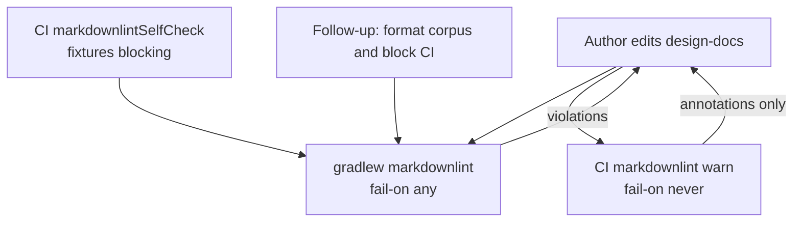

<!--
  Licensed to the Apache Software Foundation (ASF) under one
  or more contributor license agreements. See the NOTICE file
  distributed with this work for additional information
  regarding copyright ownership. The ASF licenses this file
  to you under the Apache License, Version 2.0 (the
  "License"); you may not use this file except in compliance
  with the License. You may obtain a copy of the License at

   http://www.apache.org/licenses/LICENSE-2.0

  Unless required by applicable law or agreed to in writing,
  software distributed under the License is distributed on an
  "AS IS" BASIS, WITHOUT WARRANTIES OR CONDITIONS OF ANY
  KIND, either express or implied. See the License for the
  specific language governing permissions and limitations
  under the License.
-->

# Markdown lint CUJs

These journeys are the contract for `./gradlew markdownlintSelfCheck`.
A second diagram set would not add coverage.

## Journeys

| ID  | Author / CI journey                          | Fixture or check     | Expect                |
| --- | -------------------------------------------- | -------------------- | --------------------- |
| C1  | Writer checks in an aligned comparison table | `valid-table.md`     | pass                  |
| C2  | Writer leaves pipes ragged                   | `unaligned-table.md` | fail MD060            |
| C3  | CI sees the same ragged table                | `unaligned-table.md` | warn, exit 0          |
| C4  | Writer pastes an unlabeled ASCII diagram     | `ascii-diagram.md`   | pass                  |
| C5  | Writer has a wide table row                  | `wide-table.md`      | pass, no MD013        |
| C6  | Writer leaves a long prose sentence          | `long-prose.md`      | fail MD013            |
| C7  | Writer omits outer table pipes               | `missing-pipes.md`   | fail MD055            |
| C8  | CI lint of real design docs stays warn-only  | workflow file        | `failOn=never`        |
| C9  | Production Gradle task stays on design-docs  | `markdownlint` task  | path is `design-docs` |

## Flow

