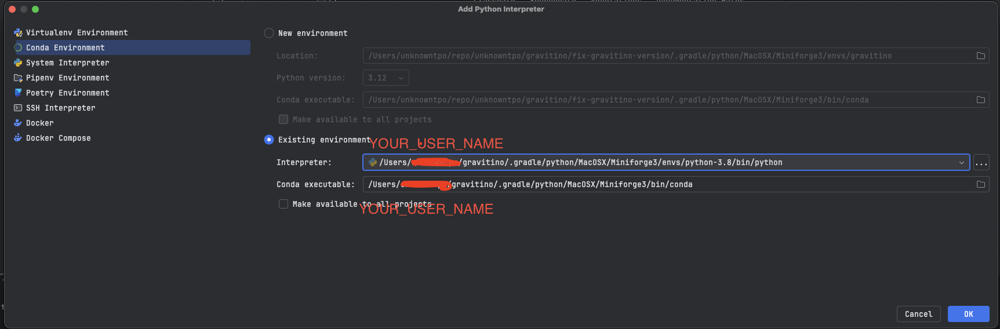
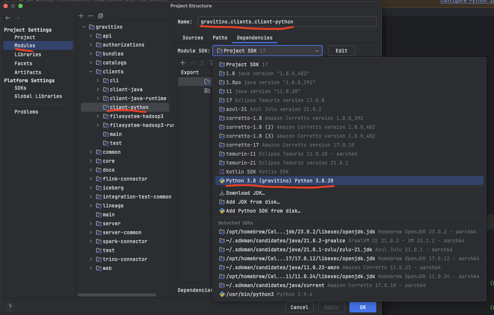

# Apache Gravitino Python client

Apache Gravitino is a high-performance, geo-distributed, and federated metadata lake.
It manages the metadata directly in different sources, types, and regions.
It also provides users the unified metadata access for data and AI assets.

Gravitino Python client helps data scientists easily manage metadata using Python language.


## Use Guidance

You can use Gravitino Python client library with Spark, PyTorch, Tensorflow, Ray and Python environment.

First of all, You must have a Gravitino server set up and run.
You can check the [install guide](../install/install.md) for building Gravitino server from source code
and installing it in your local environment.

### Apache Gravitino Python client API

```shell
pip install apache-gravitino
```

1. [Manage metalake using Gravitino Python API](../admin/metalake.md?language=python)
1. [Manage fileset metadata using Gravitino Python API](../metadata/fileset.md?language=python)

### Apache Gravitino Fileset Example

The Gravitino project provides a playground environment.
Using this environment, you can quickly learn how to use the Gravitino Python client
to manage non-tabular data on HDFS via Fileset in Gravitino.
For more details, check [installing the playground](../playground/install.md).

With the playground environment ready, in your browser, you can go to
`http://localhost:18888/lab/tree/gravitino-fileset-example.ipynb` and run the example.

The `gravitino-fileset-example` contains the following code snippets:

1. Install HDFS Python client.
1. Create a HDFS client to connect HDFS and to do some test operations.
1. Install Gravitino Python client.
1. Initialize Gravitino admin client and create a Gravitino metalake.
1. Initialize Gravitino client and list metalakes.
1. Create a Gravitino `Catalog` and special `type` is `Catalog.Type.FILESET` and `provider` is
   [hadoop](../catalogs/fileset/hadoop/hadoop-catalog.md)
1. Create a Gravitino `Schema` with the `location` pointed to a HDFS path,
   and use `hdfs client` to check if the schema location is successfully created in HDFS.
1. Create a `Fileset` with `type` is [Fileset.Type.MANAGED](../metadata/fileset.md#fileset-operations),
   use `hdfs client` to check if the fileset location was successfully created in HDFS.
1. Drop this `Fileset.Type.MANAGED` type fileset and check if the fileset location was successfully deleted.
1. Create a `Fileset` with `type` is [Fileset.Type.EXTERNAL](../metadata/fileset.md#fileset-operations)
   with `location` pointing to an existing HDFS path.
1. Drop this `Fileset.Type.EXTERNAL` type fileset and check if the fileset location was not deleted in HDFS.

## How to develop Apache Gravitino Python Client

You can ues any IDE to develop Gravitino Python Client.
Directly open the client-python module project in the IDE.

### Prerequisites

- Python 3.8+
- Refer to [How to build Gravitino](../develop/how-to-build.md#prerequisites) to have necessary build
  environment ready for building.

### Build and testing

1. Clone the Gravitino project.

   ```shell
   git clone git@github.com:apache/gravitino.git
   ```

1. Build the Gravitino Python client module

   ```shell
   ./gradlew :clients:client-python:build
   ```

   The default Python version is 3.8.
   If you want to build the Python client for a specify Python version,
   you can specify the `-PpythonVersion` parameter with the version number.
   For example, the following command builds the client for Python 3.10.

   ```shell
   ./gradlew :clients:client-python:build -PpythonVersion=3.10
   ```

   :::note
   You may encounter the error: `fatal error: 'cstdlib' file not found` while setting up Python.
   This might because default Python version (3.8) is too old.
   In this case, you may want to switch to a newer version like Python 3.9.
   :::

1. Run unit tests

   ```shell
   ./gradlew :clients:client-python:test -PskipITs
   ```

1. Run integration tests

   Because Python client connects to Gravitino Server to run integration tests,
   So it runs `./gradlew compileDistribution -x test` command automatically
   to compile the Gravitino project in the `distribution` directory.
   When you run integration tests via Gradle command or IDE,
   Gravitino integration test framework (`integration_test_env.py`) will start
   and stop Gravitino server automatically.

   ```shell
   ./gradlew :clients:client-python:test
   ```

1. Distribute the Gravitino Python client module

   ```shell
   ./gradlew :clients:client-python:distribution
   ```

1. Deploy the Gravitino Python client to https://pypi.org/project/apache-gravitino/

   ```shell
   ./gradlew :clients:client-python:deploy
   ```

   
## IDE specific settings

### JetBrains IntelliJ IDEA

We use Conda Environment to manage Python Environment.
To configure the Python SDK, you need to:

1. Make sure you have installed the [Python Plugin](https://plugins.jetbrains.com/plugin/631-python).
1. Make sure you have built the Python module by following the steps in [Build and testing](#build-and-testing).
1. Make sure you are at the root directory of Gravitino Git repository. 
1. Find conda executable by executing this command

   ```shell
   find $(pwd)/.gradle/python/*/Miniforge3/bin/conda
   ```
   
   The output is similar to this:

   ```console
   /Users/tiger/gravitino/.gradle/python/MacOSX/Miniforge3/bin/conda
   ```

1. Find the Python interpreter with this command:

   ```shell
   find $(pwd)/.gradle/python/*/Miniforge3/envs/*/bin/python
   ```
   
   The output is similar to this:

   ```console
   /Users/tiger/gravitino/.gradle/python/MacOSX/Miniforge3/envs/python-3.8/bin/python
   ```

1. Configure the Python SDK, by following guide in [create a conda environment](https://www.jetbrains.com/help/idea/configuring-python-sdk.html#gdizlj_44).
   When you are at step 5, choose [Existing conda environment](https://www.jetbrains.com/help/idea/configuring-python-sdk.html#existing-conda-environment).

1. Fill in the output from step 4 into *Conda executable* field, step 5 into *Interpreter* field.

   

   You will see a new Python SDK has been added, and it has several packages installed.

   

1. Set `clients/client-python` module SDK to the one we set in the previous step.

   

1. Done! Now, open any Python files and start developing Gravitino Python Client.

### Notes about running the integration tests in IntelliJ IDEA.

Since the integration tests require Gravitino Java distribution,
you cannot run tests with IntelliJ [Run tests button](https://www.jetbrains.com/help/idea/performing-tests.html).
You may see errors like this:

```console
ERROR:tests.integration.integration_test_env:Gravitino Python client integration test must configure `GRAVITINO_HOME`

Process finished with exit code 0
```

You need to execute this gradle task using the [Gradle Plugin](https://plugins.jetbrains.com/docs/intellij/tools-intellij-platform-gradle-plugin.html)
or run the intergration tests from the command line.

```shell
./gradlew clients:client-python:integrationTest
```

## Resources

- Official website https://gravitino.apache.org/
- Project home on GitHub: https://github.com/apache/gravitino/
- Playground with Docker: https://github.com/apache/gravitino-playground
- User documentation: https://gravitino.apache.org/docs/
- Slack Community: [https://the-asf.slack.com#gravitino](https://the-asf.slack.com/archives/C078RESTT19)

## License

Gravitino is under the Apache License Version 2.0, see the
[LICENSE](https://github.com/apache/gravitino/blob/main/LICENSE) for the details.

## ASF Incubator disclaimer

Apache Gravitino is an effort undergoing incubation at The Apache Software Foundation (ASF),
sponsored by the Apache Incubator. Incubation is required of all newly accepted projects
until a further review indicates that the infrastructure, communications,
and decision making process have stabilized in a manner consistent with other successful ASF projects. 
While incubation status is not necessarily a reflection of the completeness or stability of the code, 
it does indicate that the project has yet to be fully endorsed by the ASF.

