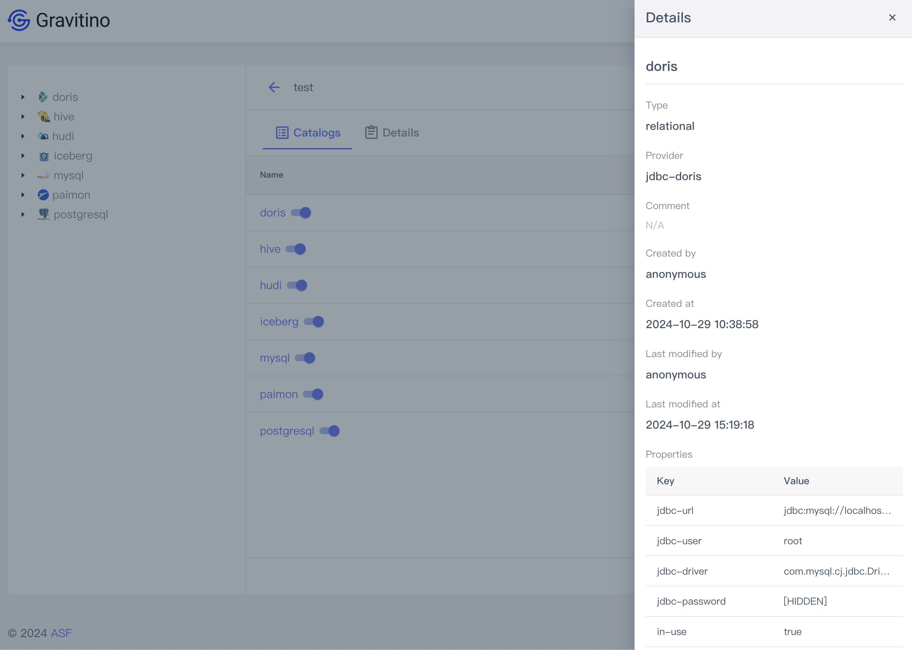

## Catalog

Click on a metalake name in the table to view catalogs in the metalake.

If this is the first time, it shows no data until after creating a catalog.

Click on the left arrow icon button <Icon icon='mdi:arrow-left' fontSize='24' color='#6877ef' />
takes you to the metalake page.

Click on the Tab - `DETAILS` to view the details of the metalake on the metalake catalogs page.

On the left side of the page is a tree list,
and the icons of the catalog correspond to their type and provider.

- Catalog <Icon icon='openmoji:iceberg' fontSize='24px' /> (e.g. iceberg catalog)
- Schema <Icon icon='bx:coin-stack' fontSize='24px' />
- Table <Icon icon='bx:table' fontSize='24px' />

Hover your mouse over the corresponding icon to the data changes to a reload icon
<Icon icon='mdi:reload' fontSize='24px' />.
Click on this icon to reload the currently selected data.

### Create a catalog

Click on the `CREATE CATALOG` button displays the dialog to create a catalog.

The following fields are available when creating a catalog:

- **Catalog name** (_required_): The name of the catalog.
- **Type** (_required_): The type of the catalog.
  Valid values include `relational`, `fileset`, `messaging`, and `model`.
  The default value is `relational`.

- **Provider** (_required_):

  - For `relational` type of catalogs, the valid values are:
    `hive`, `iceberg`, `mysql`, `postgresql`, `doris`, `paimon`, `hudi`, and `oceanbase`.
  - For `fileset` type of catalogs, the only option is `hadoop`.
  - For `messaging` type of catalogs, the only option is `kafka`.
  - For `model` type of catalogs, there is no provider.

- **Comment** (_optional_): the comment for this catalog.
- **Properties**: each *provider* has specific requirements on property fields.

#### `relational` catalogs

<Tabs>
<TabItem value='hive' label='Hive'>

 Follow the [Apache Hive catalog](../../catalogs/relational/hive/index.md) document.

 <Image img={require('../../assets/webui/props-hive.png')} style={{ width: 480 }} />

 **Properties**

 - `metastore.uris`: The Hive metastore URIs e.g. `thrift://127.0.0.1:9083`

</TabItem>
<TabItem value='iceberg' label='Iceberg'>

  Follow the [Lakehouse Iceberg catalog](../../catalogs/relational/lakehouse/iceberg.md) document.
  
  - `catalog-backend`: can be one of `hive` or `jdbc`.
  
    <Image img={require('../../assets/webui/props-iceberg-hive.png')} style={{ width: 480 }} />
  
    For a Hive catalog, the following properties can be specified:
  
    - `uri`: The Iceberg catalog URI.
    - `warehouse`: The Iceberg catalog warehouse.
  
  - `jdbc`
  
    <Image img={require('../../assets/webui/props-iceberg-jdbc.png')} style={{ width: 480 }} />

    For a JDBC catalog, the following properties can be specified:
   
    - `uri`: The Iceberg catalog URI.
    - `warehouse`: The Iceberg catalog warehouse.
    - `jdbc-driver`: For MySQL, this is "com.mysql.jdbc.Driver" or "com.mysql.cj.jdbc.Driver";
      For PostgreSQL, this should be "org.postgresql.Driver".
    - `jdbc-user`: The JDBC user name
    - `jdbc-password`: The JDBC password.

    The `authentication.type` property can be one of `simple` and `Kerberos`.

    <Image img={require('../../assets/webui/props-authentication-type.png')} style={{ width: 480 }} />

    - `Kerberos`

      <Image img={require('../../assets/webui/props-authentication-kerberos.png')} style={{ width: 480 }} />

     
      The following properties can be specified for Kerberos authentication:

      - `authentication.kerberos.principal`: The principal for Kerberos authentication.
      - `authentication.kerberos.keytab-uri`: The URI of the keytab for the Kerberos authentication.

  </TabItem>
  <TabItem value='mysql' label='MySQL'>

    Follow the [JDBC MySQL catalog](../../catalogs/relational/jdbc/mysql.md) document.

    <Image img={require('../../assets/webui/props-mysql.png')} style={{ width: 480 }} />

    The following properties can be specified for a MySQL catalog:

    - `jdbc-driver`: JDBC driver used for connecting to the database.
      e.g. `com.mysql.jdbc.Driver` or `com.mysql.cj.jdbc.Driver`.
    - `jdbc-url`: The JDBC URL for the database. e.g. `jdbc:mysql://localhost:3306`
    - `jdbc-user`: The JDBC user name.
    - `jdbc-password`: The JDBC password.

  </TabItem>
  <TabItem value='postgresql' label='PostgreSQL'>

    Follow the [JDBC PostgreSQL catalog](../../catalogs/relational/jdbc/postgresql.md) document.

    <Image img={require('../../assets/webui/props-pg.png')} style={{ width: 480 }} />

    The following properties can be specified for a MySQL catalog:

    - `jdbc-driver`: The JDBC drvier to use. E.g. `org.postgresql.Driver`.
    - `jdbc-url`: The JDBC URL to the database. E.g. `jdbc:postgresql://localhost:5432/your_database`.
    - `jdbc-database`: The JDBC database to use.
    - `jdbc-user`: The JDBC user name.
    - `jdbc-password`: The JDBC password.

  </TabItem>
  <TabItem value='doris' label='Doris'>

    Follow the [JDBC Doris catalog](../../catalogs/relational/jdbc/doris.md) document.

    <Image img={require('../../assets/webui/props-doris.png')} style={{ width: 480 }} />

    The following properties can be specified for a Doris catalog:

    - `jdbc-driver`: The JDBC driver to use.
    - `jdbc-url`: The JDBC URL for connecting to the database.
    - `jdbc-user`: The JDBC user name.
    - `jdbc-password`: The JDBC password. 

  </TabItem>
  <TabItem value='Paimon' label='Paimon'>
    
    Follow the [lakehouse-paimon-catalog](../../catalogs/relational/lakehouse/paimon.md) document.

    - `catalog-backend`: The catalog backend to use. It can be one of `filesystem`, `hive` and `jdbc`.

    - `filesystem`

      <Image img={require('../../assets/webui/props-paimon-filesystem.png')} style={{ width: 480 }} />

      For a filesystem backend catalog, the following properties are supported:

      - `warehouse`: The Paimon catalog warehouse.

    - `hive`

      <Image img={require('../../assets/webui/props-paimon-hive.png')} style={{ width: 480 }} />

      For a Hive backed catalog, the following properties can be specified:

      - `uri`: The Paimon catalog URI.
      - `warehouse`: The Paimon catalog warehouse.

    - `jdbc`

      <Image img={require('../../assets/webui/props-paimon-jdbc.png')} style={{ width: 480 }} />

      For a JDBC backed catalog, the following properties can be specified:

      - `uri`: The Paimon catalog URI.
      - `warehouse`: The Paimon catalog warehouse.
      - `jdbc-driver`: The JDBC driver to use.
        For MySQL backend, this can be one of "com.mysql.jdbc.Driver" or "com.mysql.cj.jdbc.Driver";
        for PostgreSQL backend, this can be "org.postgresql.Driver".
      - `jdbc-user`: The JDBC user name.
      - `jdbc-password`: The JDBC password.
  
    The parameter `authentication.type` can be one of `simple` and `Kerberos`.

    <Image img={require('../../assets/webui/props-authentication-type.png')} style={{ width: 480 }} />

    - `Kerberos`

      <Image img={require('../../assets/webui/props-authentication-kerberos.png')} style={{ width: 480 }} />

      For Kerberos authentication, the following properties can be specified:

      - `authentication.type`: The type of authentication for Paimon catalog backend.
        Currently Gravitino only supports `Kerberos` and `simple`.
      - `authentication.kerberos.principal: The principal of the Kerberos authentication.
      - `authentication.kerberos.keytab-uri`: The URI of the keytab for the Kerberos authentication.

  </TabItem>
  <TabItem value='Hudi' label='Hudi'>

    Follow the [lakehouse-hudi-catalog](../../catalogs/relational/lakehouse/hudi.md) document.

    <Image img={require('../../assets/webui/props-hudi.png')} style={{ width: 480 }} />

    For a Hudi catalog, the following properties are supported:

    - `catalog-backend`: This is the backend to use. For example: `hms`.
    - `uri`: The Hudi catalog URI.

  </TabItem>
  <TabItem value='OceanBase' label='OceanBase'>

    Follow the [jdbc-oceanbase-catalog](../../catalogs/relational/jdbc/oceanbase.md) document.

    <Image img={require('../../assets/webui/props-oceanbase.png')} style={{ width: 480 }} />

    For an OceanBase catalog, the following properties are supported:

    - `jdbc-driver`: The JDBC driver to use.
      E.g. `com.mysql.jdbc.Driver`, `com.mysql.cj.jdbc.Driver`, or `com.oceanbase.jdbc.Driver`.
    - `jdbc-url`: The JDBC URL for the database.
      E.g. `jdbc:mysql://localhost:2881`, `jdbc:oceanbase://localhost:2881`.
    - `jdbc-user`: The JDBC user name.
    - `jdbc-password`: The JDBC password.

  </TabItem>
</Tabs>

#### `fileset` catalogs

<Tabs>
  <TabItem value='hadoop' label='Hadoop'>

    Follow the [Hadoop catalog](../../catalogs/fileset/hadoop/hadoop-catalog.md) document.

    <Image img={require('../../assets/webui/create-fileset-hadoop-catalog-dialog.png')} style={{ width: 480 }} />

  </TabItem>
</Tabs>

#### `messaging` catalogs

<Tabs>
  <TabItem value='kafka' label='Kafka'>

    Follow the [Kafka catalog](../../catalogs/messaging/kafka/index.md) document.

    <Image img={require('../../assets/webui/create-messaging-kafka-catalog-dialog.png')} style={{ width: 480 }} />

    The following properties are supported for a Kafka catalog:

    - `bootstrap.servers`: The Kafka broker(s) to connect to.
      Multiple endpoints can be specified using comma-separated string.

  </TabItem>
</Tabs>

After verifying the values of these fields, clicking on the `CREATE` button to create a catalog.

### Show catalog details

Click on the action icon <Icon icon='bx:show-alt' fontSize='24' /> in the table cell.

You can see the detailed information of this catalog in the drawer component on the right.

### Edit a catalog

Click on the action icon <Icon icon='mdi:square-edit-outline' fontSize='24' />
in the table cell.

Displays the dialog for modifying fields of the selected catalog.

Only the `name`, `comment`, and custom fields in `properties` can be modified.
Other fields such as `type`, `provider`, and default fields in `properties`
cannot be modified.

The immutable fields cannot be selected and modified in the web UI.

### Disable a catalog

Catalog defaults to in-use after successful creation.

Hop your mouse over the switch next to the catalog's name,
you can see the 'In-use' tip.

Click on the switch will disable the catalog,
hop over the switch next to the catalog's name,
you can see the 'Not in-use' tip.

### Delete a catalog

Click on the action icon <Icon icon='mdi:delete-outline' fontSize='24' color='red' />
in the table cell.

Displays a confirmation dialog, clicking on the SUBMIT button deletes this catalog.

