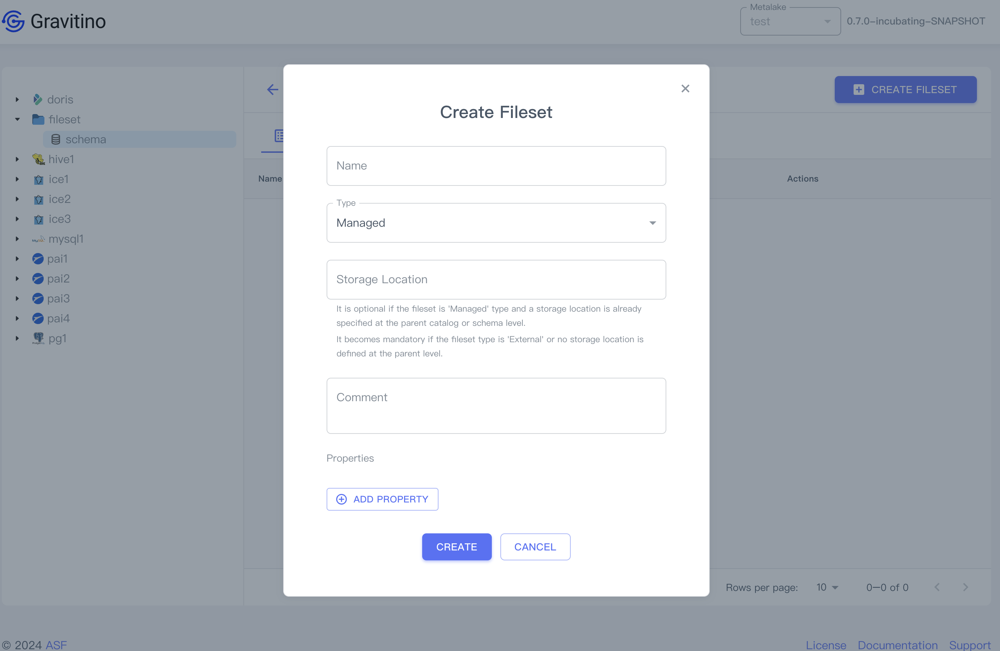

## Fileset

Click the fileset schema tree node on the left sidebar or the schema name link in the table cell.

Displays the list filesets of the schema.

### Create a fileset

Click on the `CREATE FILESET` button displays the dialog to create a fileset.

Creating a fileset needs these fields:

1. **Name** (_required_): the name of the fileset.
1. **Type** (_required_): `managed`/`external`, the default value is `managed`.
1. **Storage Location** (_optional_): 
   1. It is optional if the fileset is *MANAGED* type
      and a storage location is already specified at the parent catalog or schema level.
   1. The location is mandatory if the fileset type is *EXTERNAL*
      or no storage location is defined at the parent level.
1. **Comment** (_optional_): the comment of the fileset.
1. **Properties** (_optional_): Click on the `ADD PROPERTY` button to add custom properties.

### Show fileset details

Click on the action icon <Icon icon='bx:show-alt' fontSize='24' /> in the table cell.

You can see the detailed information of this fileset in the drawer component on the right.

Click the fileset tree node on the left sidebar or the fileset name link in the table cell.

You can see the detailed information on the right page.

### Edit a fileset

Click on the action icon <Icon icon='mdi:square-edit-outline' fontSize='24' />
in the table cell.

Displays the dialog for modifying fields of the selected fileset.

### Drop a fileset

Click on the action icon <Icon icon='mdi:delete-outline' fontSize='24' color='red' /> in the table cell.

Displays a confirmation dialog, clicking on the `DROP` button drops this fileset.

