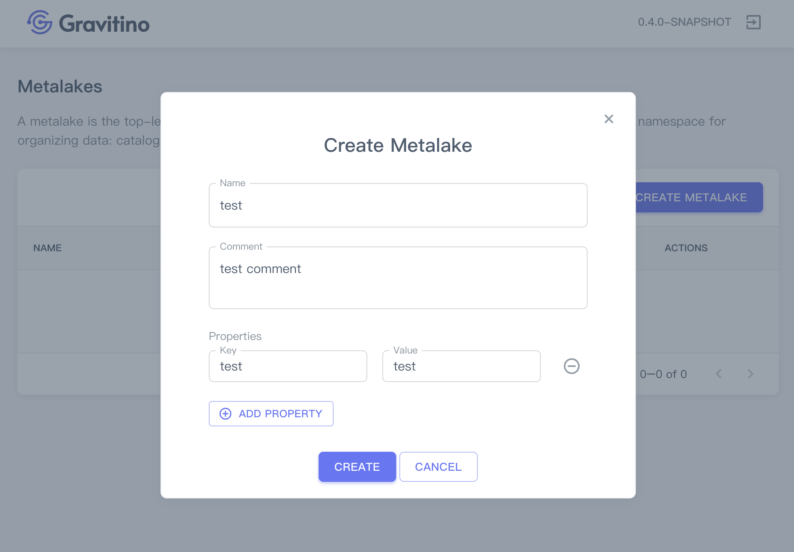
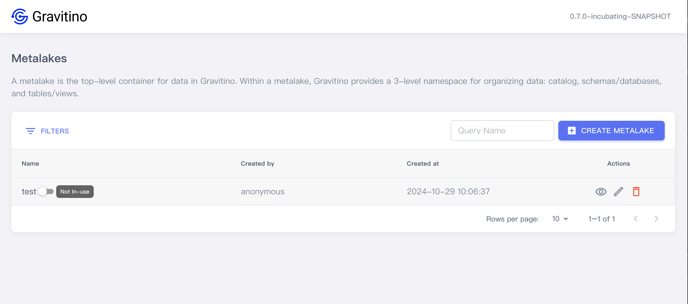
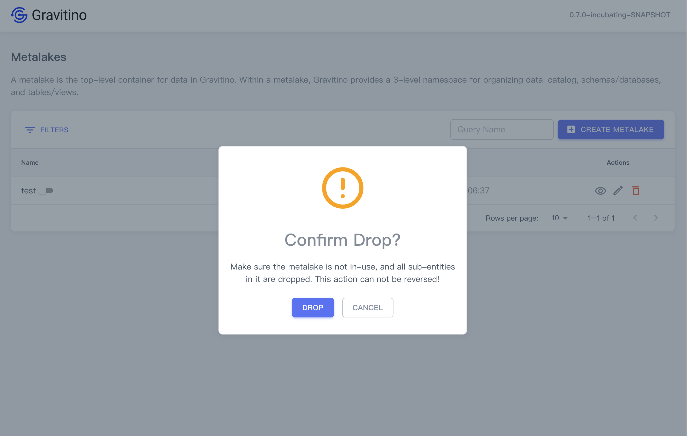

## Metalake

### Create a metalake

On the homepage, clicking on the `CREATE METALAKE` button displays a dialog to create a metalake.

Creating a metalake needs these fields:

1. **Name** (_required_): the name of the metalake.
1. **Comment** (_optional_): the comment of the metalake.
1. **Properties** (_optional_): Click on the `ADD PROPERTY` button to add custom properties.

There are 3 actions you can perform on a metalake.

#### Show metalake details

Click on the action icon <Icon icon='bx:show-alt' fontSize='24' /> in the table cell.

You can see the detailed information of this metalake in the drawer component on the right.

#### Edit a metalake

Click on the action icon <Icon icon='mdi:square-edit-outline' fontSize='24' />
in the table cell.

Displays the dialog for modifying fields of the selected metalake.

#### Disable metalake

Metalake defaults to in-use after successful creation.

Hover over the switch next to the metalake's name, you can see the 'In-use' tip.

Click on the switch will disable the metalake.
Hover over the switch next to the metalake's name, you can see the 'Not in-use' tip.

### Drop a metalake

Click on the action icon <Icon icon='mdi:delete-outline' fontSize='24' color='red' />
in the table cell.

Displays a confirmation dialog, clicking on the `DROP` button drops this metalake.

