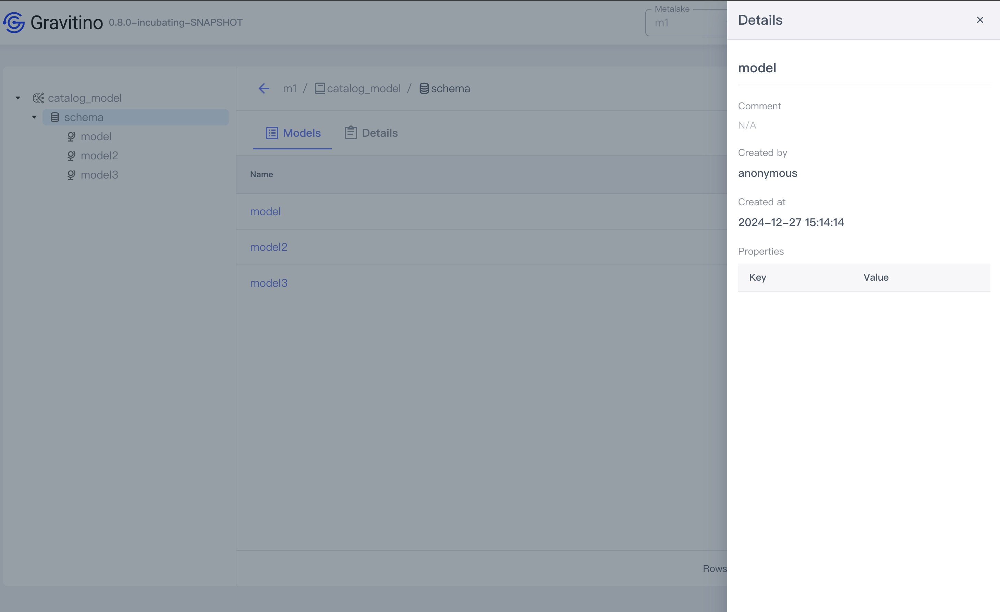
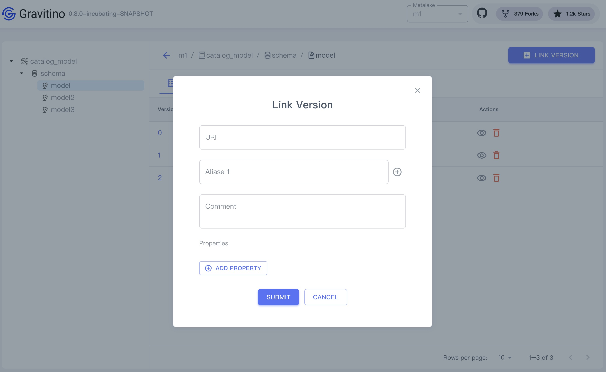
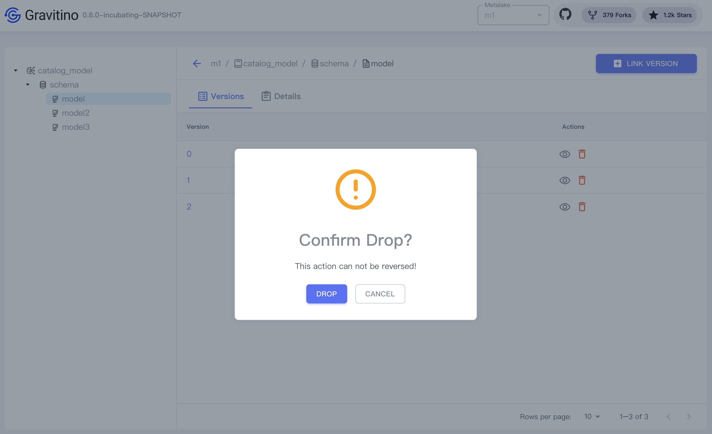

## Model

Click the model schema tree node on the left sidebar or the schema name link in the table cell.

Displays the list model of the schema.

### Register model

Click on the `REGISTER MODEL` button displays the dialog to register a model.

Register a model needs these fields:

1. **Name**(_required_): the name of the model.
2. **Comment**(_optional_): the comment of the model.
3. **Properties**(_optional_): Click on the `ADD PROPERTY` button to add custom properties.

### Show model details

Click on the action icon <Icon icon='bx:show-alt' fontSize='24' /> in the table cell.

You can see the detailed information of this model in the drawer component on the right.

### Drop model

Click on the action icon <Icon icon='mdi:delete-outline' fontSize='24' color='red' />
in the table cell.

Displays a confirmation dialog, clicking on the `DROP` button drops this model.

## ModelVersion

Click the model tree node on the left sidebar or the model name link in the table cell.

Displays the list versions for the model.

### Link ModelVersion

Click on the `LINK VERSION` button displays the dialog to link a version.

Link a version needs these fields:

1. **URI** (_required_): the URI of the ModelVrsion.
1. **Aliases** (_required_): the aliases of the ModelVersion.
   An alias cannot be a number or number string.
1. **Comment** (_optional_): the comment of the model.
1. **Properties** (_optional_): Click on the `ADD PROPERTY` button to add custom properties.

### Show ModelVersion details

Click on the action icon <Icon icon='bx:show-alt' fontSize='24' /> in the table cell.

You can see the detailed information of this version in the drawer component on the right.

### Drop ModelVersion

Click on the action icon <Icon icon='mdi:delete-outline' fontSize='24' color='red' />
in the table cell.

Displays a confirmation dialog, clicking on the `DROP` button drops this version.

