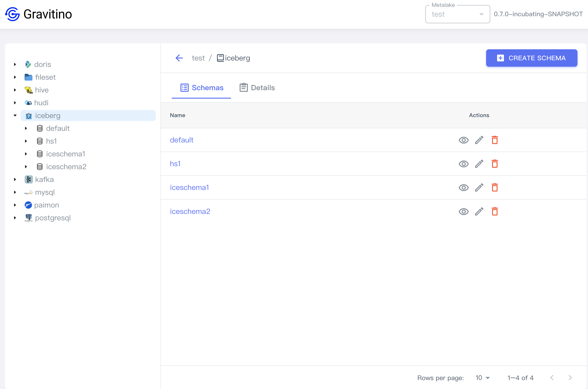
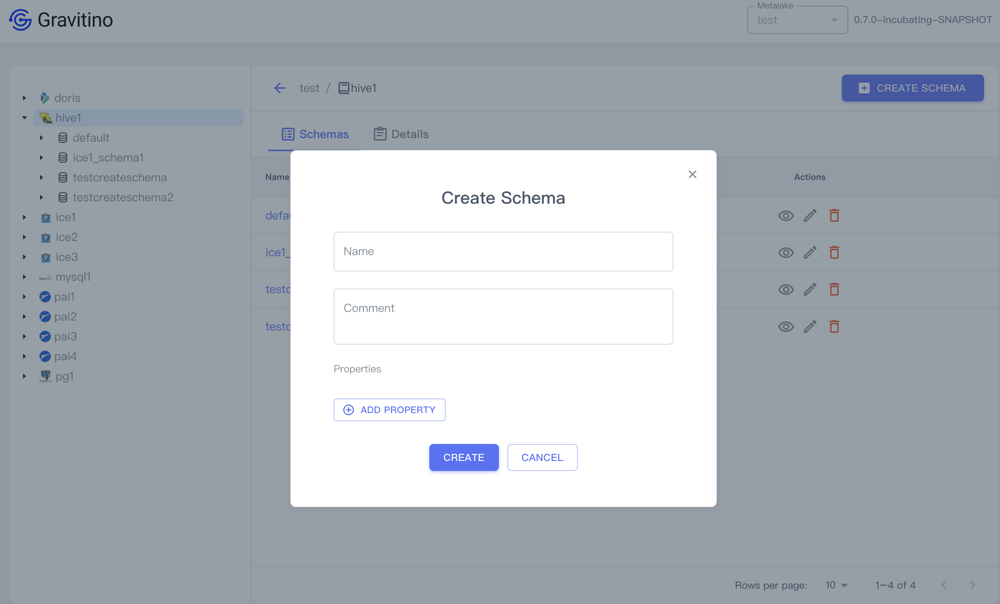

## Schema

Click the catalog tree node on the left sidebar or the catalog name link in the table cell.

Displays the list schemas of the catalog.

### Create a schema

Click on the `CREATE SCHEMA` button displays the dialog to create a schema.

Creating a schema needs these fields:

1. **Name** (_required_the name of the schema.
1. **Comment** (_optional_): the comment of the schema.
1. **Properties** (_optional_): Click on the `ADD PROPERTY` button to add custom properties.

#### Show schema details

Click on the action icon <Icon icon='bx:show-alt' fontSize='24' /> in the table cell.

You can see the detailed information of this schema in the drawer component on the right.

#### Edit a schema

Click on the action icon <Icon icon='mdi:square-edit-outline' fontSize='24' />
in the table cell.

Displays the dialog for modifying fields of the selected schema.

#### Drop a schema

Click on the action icon <Icon icon='mdi:delete-outline' fontSize='24' color='red' />
in the table cell.

Displays a confirmation dialog, clicking on the `DROP` button drops this schema.

