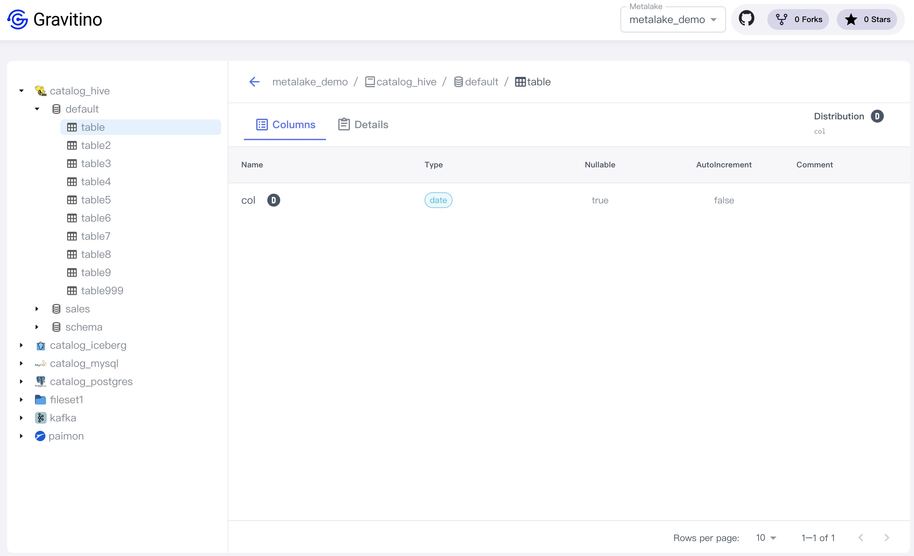
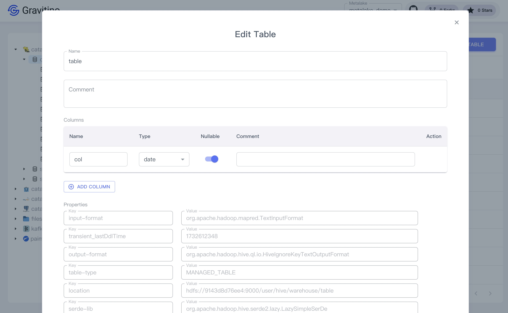

## Table

<!--TODO(Qiming): This is not generic-->
Click the hive schema tree node on the left sidebar or the schema name link in the table cell.

Displays the list tables of the schema.

### Create a table

Click on the `CREATE TABLE` button displays the dialog to create a table.

Creating a table needs these fields:

1. **Name** (_required_): the name of the table.
1. **Columns** (_required_):

   1. The name and type of each column are required.
   1. Only suppport simple types, cannot support complex types by UI.
      You can create complex types by calling the APIs.

1. **Comment** (_optional_): the comment of the table.
1. **Properties** (_optional_): Click on the `ADD PROPERTY` button to add custom properties.

#### Show table details

Click on the action icon <Icon icon='bx:show-alt' fontSize='24' />
in the table cell.

You can see the detailed information of this table in the drawer component on the right.

Click the table tree node on the left sidebar or the table name link in the table cell.

You can see the columns and detailed information on the right page.

#### Edit a table

Click on the action icon <Icon icon='mdi:square-edit-outline' fontSize='24' />
in the table cell.

Displays the dialog for modifying fields of the selected table.

#### Drop a table

Click on the action icon <Icon icon='mdi:delete-outline' fontSize='24' color='red' />
in the table cell.

Displays a confirmation dialog, clicking on the `DROP` button drops this table.

