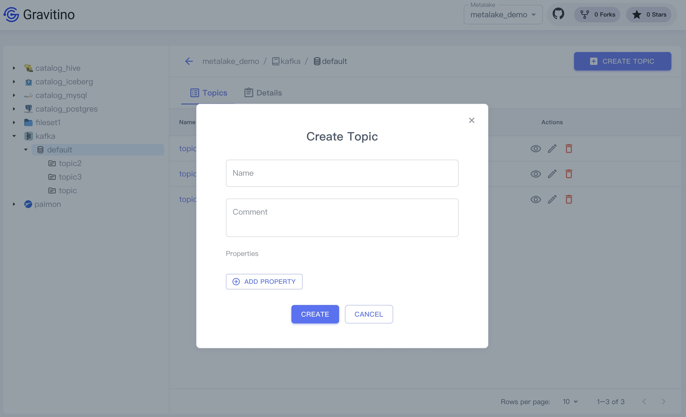
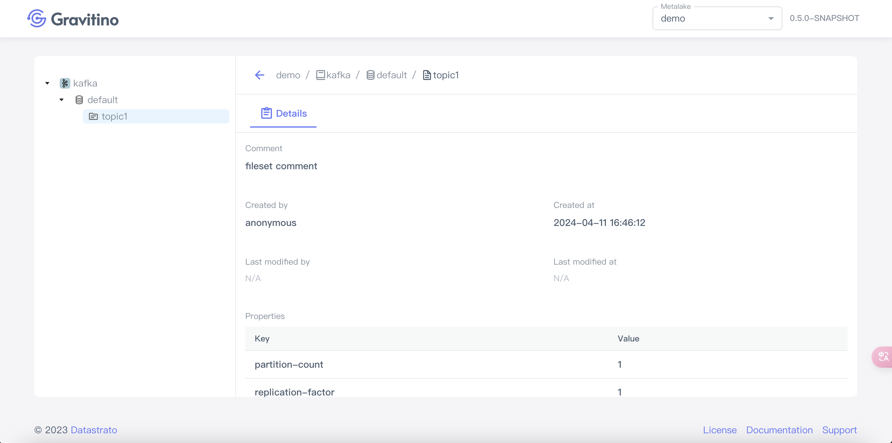
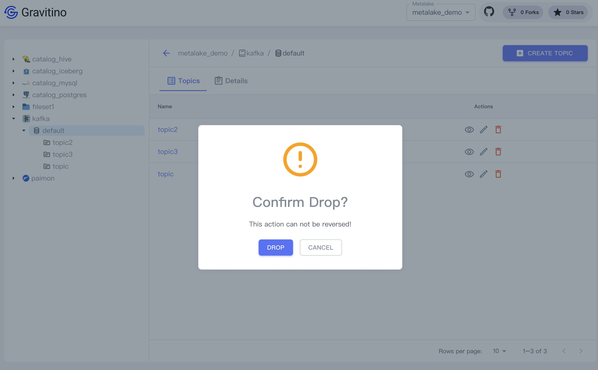

## Topics

Click the kafka schema tree node on the left sidebar or the schema name link in the table cell.

Displays the list topics of the schema.

### Create a topic

Click on the `CREATE TOPIC` button displays the dialog to create a topic.

Creating a topic needs these fields:

1. **Name**(**_required_**): the name of the topic.
2. **Comment**(_optional_): the comment of the topic.
3. **Properties**(_optional_): Click on the `ADD PROPERTY` button to add custom properties.

### Show topic details

Click on the action icon <Icon icon='bx:show-alt' fontSize='24' /> in the table cell.

You can see the detailed information of this topic in the drawer component on the right.

Click the topic tree node on the left sidebar or the topic name link in the table cell.

You can see the detailed information on the right page.

### Edit a topic

Click on the action icon <Icon icon='mdi:square-edit-outline' fontSize='24' /> in the table cell.

Displays the dialog for modifying fields of the selected topic.

### Drop a topic

Click on the action icon <Icon icon='mdi:delete-outline' fontSize='24' color='red' />
in the table cell.

Displays a confirmation dialog, clicking on the `DROP` button drops this topic.

