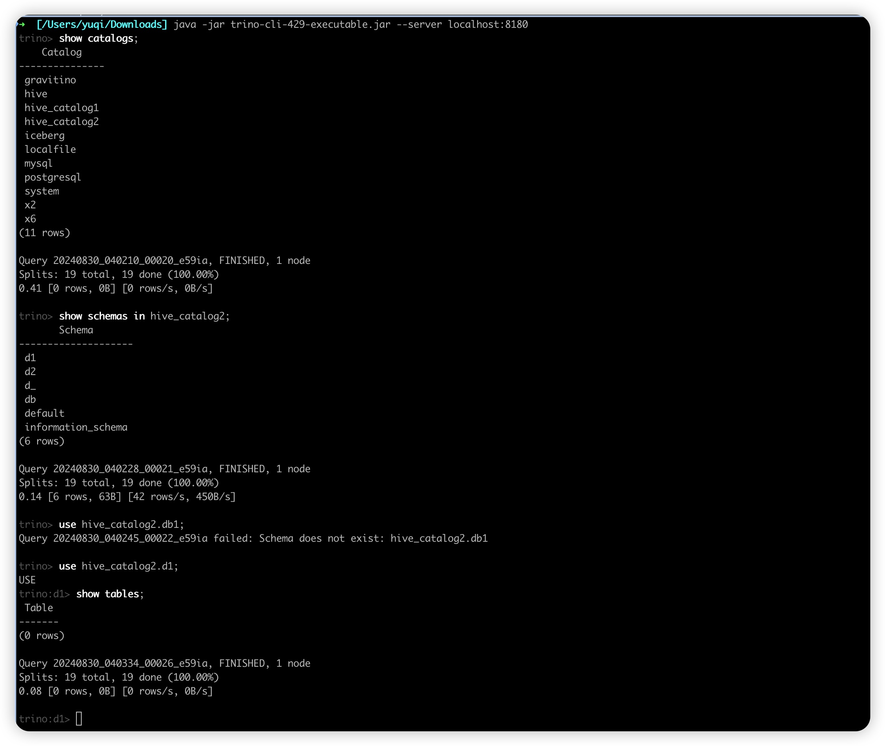

This page is about the development of the Apache Gravitino Trino connector for Trino.

## Prerequisites

Before you start developing the Gravitino Trino connector,
you need to have the following prerequisites in place:

1. You need to start the Gravitino server locally.
   For more information, please refer to [starting Gravitino server](../../install/install.md)

2. Create a catalog in the Gravitino server.
   For more information, please refer to [Gravitino metadata management](../../metadata/relational.md).
   The following commands create a MySQL catalog:

   ```curl
   cat <<EOF >metalake.json
   {
     "name": "test",
     "comment": "metalake for testing",
     "properties":{}
   }
   EOF

   curl -X POST \
     -H "Content-Type: application/json" \
     -d '@metalake.json' \
     http://localhost:8090/api/metalakes
  
   cat <<EOF >catalog.json
   {
     "type": "RELATIONAL",
     "provider": "jdbc-mysql",
     "name": "mysql_catalog3",
     "comment": "a catalog for testing",
     "properties": {
       "jdbc-url": "jdbc:mysql://127.0.0.1:3306?useSSL=false&allowPublicKeyRetrieval=true",
       "jdbc-user": "root",
       "jdbc-password": "123456",
       "jdbc-driver": "com.mysql.cj.jdbc.Driver"
     }
   }
   EOF

   curl -X POST \
     -H "Content-Type: application/json" \
     -d '@catalog.json' \
     http://localhost:8090/api/metalakes/test/catalogs
   ```

## Development environment

To develop the Gravitino Trino connector locally, you need to set up the environment:

### IDEA

1. Clone the Trino repository from the [GitHub](https://github.com/trinodb/trino).
   The released version 'Trino-435' is the least version that Gravitino supports.

1. Open the Trino project in your IDEA.

1. Create a new module for the Gravitino Trino connector in the Trino project
   as shown in the following picture.
   We will use the name `trino-gravitino` as the module name in the following steps.

   

1. Add a soft link to the Gravitino Trino connector module in the Trino project.
   Assuming the Java source main directory for the Trino connector
   in the Gravitino project is
   `gravitino/path/to/gravitino-trino-connector/src/main/java`,
   and the Java source main directory for trino-gravitino in the Trino project is
   `trino/path/to/trino-gravitino/src/main/java`,
   you can use the following command to create a soft link:

   ```shell
   ln -s gravitino/path/to/trino-connector/src/main/java \
     trino/path/to/trino-gravitino/src/main/java
   ```

   You can then see the `gravitino-trino-connecor` source files and directories
   in the `trino-gravitino` module as shown below:

   

1. Add `<module>plugin/trino-gravitino</module>` to `trino/pom.xml`
   and change the `pom.xml` file in the `trino-gravitino` module accordingly.
   This is an example content of the `pom.xml` file in the `trino-gravitino` module.
   Ensure that the version of trino-root is identical to the version of trino.

   ```xml
   <?xml version="1.0" encoding="UTF-8"?>
   <project xmlns="http://maven.apache.org/POM/4.0.0"
     xmlns:xsi="http://www.w3.org/2001/XMLSchema-instance"
     xsi:schemaLocation="http://maven.apache.org/POM/4.0.0 http://maven.apache.org/xsd/maven-4.0.0.xsd">

     <modelVersion>4.0.0</modelVersion>
     <parent>
       <groupId>io.trino</groupId>
       <artifactId>trino-root</artifactId>
       <version>435</version>
       <relativePath>../../pom.xml</relativePath>
     </parent>

     <artifactId>trino-gravitino</artifactId>
     <packaging>trino-plugin</packaging>
     <description>Trino - Gravitino Connector</description>

     <properties>
       <air.main.basedir>${project.parent.basedir}</air.main.basedir>
     </properties>

     <dependencies>
       <!--
         You can switch to the snapshot version as you like,
         for example, if you want to use the jar of latest main branch,
         you can execute the following command to install Gravitino `client-java-runtime` jar locally.
         ./gradlew publishToMavenLocal
       -->
       <dependency>
         <groupId>org.apache.gravitino</groupId>
         <artifactId>catalog-common</artifactId>
         <version><GRAVITINO_VERSION></version>
         <exclusions>
           <exclusion>
             <groupId>io.dropwizard.metrics</groupId>
             <artifactId>metrics-core</artifactId>
           </exclusion>
           <exclusion>
             <groupId>io.netty</groupId>
             <artifactId>netty</artifactId>
           </exclusion>
           <exclusion>
             <groupId>org.apache.logging.log4j</groupId>
             <artifactId>log4j-core</artifactId>
           </exclusion>
         </exclusions>
       </dependency>

       <dependency>
         <groupId>org.apache.gravitino</groupId>
         <artifactId>client-java-runtime</artifactId>
         <version><GRAVITINO_VERSION></version>
       </dependency>

       <dependency>
         <groupId>io.airlift</groupId>
         <artifactId>json</artifactId>
       </dependency>

       <dependency>
         <groupId>io.airlift.resolver</groupId>
         <artifactId>resolver</artifactId>
         <version>1.6</version>
       </dependency>

       <dependency>
         <groupId>io.trino</groupId>
         <artifactId>trino-client</artifactId>
       </dependency>

       <dependency>
         <groupId>io.trino</groupId>
         <artifactId>trino-jdbc</artifactId>
       </dependency>

       <dependency>
         <groupId>joda-time</groupId>
         <artifactId>joda-time</artifactId>
       </dependency>

       <dependency>
         <groupId>org.apache.commons</groupId>
         <artifactId>commons-collections4</artifactId>
         <version>4.4</version>
       </dependency>

       <dependency>
         <groupId>org.apache.commons</groupId>
         <artifactId>commons-lang3</artifactId>
       </dependency>

       <dependency>
         <groupId>org.codehaus.plexus</groupId>
         <artifactId>plexus-xml</artifactId>
         <version>4.0.2</version>
       </dependency>

       <dependency>
         <groupId>org.slf4j</groupId>
         <artifactId>slf4j-api</artifactId>
         <version>2.0.9</version>
       </dependency>

       <dependency>
         <groupId>org.apache.logging.log4j</groupId>
         <artifactId>log4j-slf4j2-impl</artifactId>
         <version>2.22.0</version>
       </dependency>

       <dependency>
         <groupId>org.apache.logging.log4j</groupId>
         <artifactId>log4j-api</artifactId>
         <version>2.22.0</version>
       </dependency>

       <dependency>
         <groupId>org.apache.logging.log4j</groupId>
         <artifactId>log4j-core</artifactId>
         <version>2.22.0</version>
       </dependency>

       <dependency>
         <groupId>com.fasterxml.jackson.core</groupId>
         <artifactId>jackson-annotations</artifactId>
         <scope>provided</scope>
       </dependency>

       <dependency>
         <groupId>io.opentelemetry</groupId>
         <artifactId>opentelemetry-api</artifactId>
         <scope>provided</scope>
       </dependency>

       <dependency>
         <groupId>io.trino</groupId>
         <artifactId>trino-spi</artifactId>
         <scope>provided</scope>
       </dependency>
     </dependencies>
   </project>
   ```

1. Compile the module `trino-gravitino` and resolve errors if there are any. 

   ```shell
   # build the whole trino project
   ./mvnw -pl '!core/trino-server-rpm' package -DskipTests -Dair.check.skip-all=true

   # build the trino-gravitino module if we change the code in the trino-gravitino module
   ./mvnw clean -pl 'plugin/trino-gravitino' package \
      -DskipTests -Dcheckstyle.skip \
      -Dair.check.skip-checkstyle=true \
      -Dair.check.skip-all=true
   ```

   :::note
   If you see an error like the following when compiling the module:

   `The following artifacts could not be resolved: org.apache.gravitino:xxx:jar`

   you can try resolve it by running `./gradlew publishToMavenLocal` in gravitino.
   :::

1. Set up the configuration for the Gravitino Trino connector in the Trino project,
   as shown in the following picture:

   

   The configuration files are:

   - `gravitino.properties`: Gravitino properties file 

     ```properties
     # the connector name is always 'gravitino'
     connector.name=gravitino

     # URI of the gravitino server
     gravitino.uri=http://localhost:8090

     # The name of the metalake for the connector to connect
     gravitino.metalake=test
     ```

   - `config.properties`: Trino configuration file: 

     ```properties
     # WARNING
     # ^^^^^^^
     # This configuration file is for development only and should NOT be used
     # in production. For example configuration, see the Trino documentation.
     # sample nodeId to provide consistency across test runs
     node.id=ffffffff-ffff-ffff-ffff-ffffffffffff
     node.environment=test
     node.internal-address=localhost
     experimental.concurrent-startup=true

     # Default port is 8080, We change it to 8180
     http-server.http.port=8180

     discovery.uri=http://localhost:8180

     exchange.http-client.max-connections=1000
     exchange.http-client.max-connections-per-server=1000
     exchange.http-client.connect-timeout=1m
     exchange.http-client.idle-timeout=1m

     scheduler.http-client.max-connections=1000
     scheduler.http-client.max-connections-per-server=1000
     scheduler.http-client.connect-timeout=1m
     scheduler.http-client.idle-timeout=1m

     query.client.timeout=5m
     query.min-expire-age=30m

     # We removed several catalogs that won't be used in Gravitino
     plugin.bundles=\
       ../../plugin/trino-iceberg/pom.xml,\
       ../../plugin/trino-hive/pom.xml,\
       ../../plugin/trino-local-file/pom.xml, \
       ../../plugin/trino-mysql/pom.xml,\
       ../../plugin/trino-postgresql/pom.xml, \
       ../../plugin/trino-exchange-filesystem/pom.xml, \
       ../../plugin/trino-gravitino/pom.xml

     node-scheduler.include-coordinator=true

     # Note: The Gravitino Trino connector olny supports with The dynamic catalog manager
     catalog.management=dynamic
     ```

   :::note
   Remove the file `/etc/catalogs/xxx.properties` if the corresponding `plugin/trino-xxx/pom.xml`
   is not recorded in the `/etc/config.properties`.
   For the hive plugin, please use  `plugin/trino-hive/pom.xml` after release version 435.
   Others should use `plugin/trino-hive-hadoop2/pom.xml`.
   :::

1. Start the Trino server and connect to the Gravitino server.

   

1. If the DevelopmentServer has started successfully, you can connect to the Trino server
   using the `trino-cli` and run the following command to see
   if the Gravitino Trino connector is available:

   ```shell
   java -jar trino-cli-429-executable.jar --server localhost:8180
   ```
   :::note
   The `trino-cli-429-executable.jar` is the Trino CLI jar file, you can download it
   from the [Trino release page](https://trino.io/docs/current/client/cli.html).
   **Users can use the version of the Trino CLI jar file according to the version of the Trino server.**
   :::

1. If everying works, you can start developing the Gravitino Trino connector
   in the Gravitino project and debug it in the Trino project.

   

