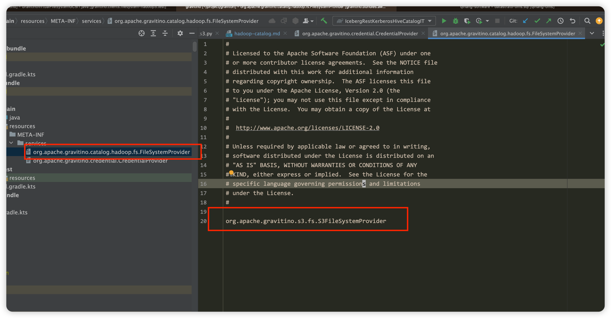

## Introduction

Fileset catalog is a fileset catalog that using Hadoop Compatible File System (HCFS) to manage
the storage location of the fileset. Currently, it supports the local filesystem and HDFS. Since 
0.7.0-incubating, Gravitino supports [S3](fileset-catalog-with-s3.md), [GCS](fileset-catalog-with-gcs.md),
[OSS](fileset-catalog-with-oss.md) and [Azure Blob Storage](fileset-catalog-with-adls.md) through Fileset catalog. 

The rest of this document will use HDFS or local file as an example to illustrate how to use the Fileset catalog.
For S3, GCS, OSS and Azure Blob Storage, the configuration is similar to HDFS, 
please refer to the corresponding document for more details.

Note that Gravitino uses Hadoop 3 dependencies to build Fileset catalog. Theoretically, it should be
compatible with both Hadoop 2.x and 3.x, since Gravitino doesn't leverage any new features in
Hadoop 3. If there's any compatibility issue, please create an [issue](https://github.com/apache/gravitino/issues).

## Catalog

### Catalog properties

Besides the [common catalog properties](./gravitino-server-config.md#apache-gravitino-catalog-properties-configuration), the Fileset catalog has the following properties:

| Property Name                        | Description                                                                                                                                                                                                                                                                                                         | Default Value   | Required | Since Version    |
|--------------------------------------|---------------------------------------------------------------------------------------------------------------------------------------------------------------------------------------------------------------------------------------------------------------------------------------------------------------------|-----------------|----------|------------------|
| `location`                           | The storage location managed by Fileset catalog. Its location name is `unknown`. The value should always a directory(HDFS) or path prefix(cloud storage like S3, GCS.) and does not support a single file.                                                                                                          | (none)          | No       | 0.5.0            |
| `location-`                          | The property prefix. User can use `location-{name}={path}` to set multiple locations with different names for the catalog.                                                                                                                                                                                          | (none)          | No       | 0.9.0-incubating |
| `default-filesystem-provider`        | The default filesystem provider of this Fileset catalog if users do not specify the scheme in the URI. Candidate values are 'builtin-local', 'builtin-hdfs', 's3', 'gcs', 'abs' and 'oss'. Default value is `builtin-local`. For S3, if we set this value to 's3', we can omit the prefix 's3a://' in the location. | `builtin-local` | No       | 0.7.0-incubating |
| `filesystem-providers`               | The file system providers to add. Users need to set this configuration to support cloud storage or custom HCFS. For instance, set it to `s3` or a comma separated string that contains `s3` like `gs,s3` to support multiple kinds of fileset including `s3`.                                                       | (none)          | Yes      | 0.7.0-incubating |
| `credential-providers`               | The credential provider types, separated by comma.                                                                                                                                                                                                                                                                  | (none)          | No       | 0.8.0-incubating |
| `filesystem-conn-timeout-secs`       | The timeout of getting the file system using Hadoop FileSystem client instance. Time unit: seconds.                                                                                                                                                                                                                 | 6               | No       | 0.8.0-incubating |
| `disable-filesystem-ops`             | The configuration to disable file system operations in the server side. If set to true, the Fileset catalog in the server side will not create, drop files or folder when the schema, fileset is created, dropped.                                                                                                  | false           | No       | 0.9.0-incubating |
| `fileset-cache-eviction-interval-ms` | The interval in milliseconds to evict the fileset cache, -1 means never evict.                                                                                                                                                                                                                                      | 3600000         | No       | 0.9.0-incubating |
| `fileset-cache-max-size`             | The maximum number of the filesets the cache may contain, -1 means no limit.                                                                                                                                                                                                                                        | 200000          | No       | 0.9.0-incubating |

Please refer to [Credential vending](./security/credential-vending.md) for more details about credential vending.

### HDFS fileset 

Apart from the above properties, to access fileset like HDFS fileset, you need to configure the following extra properties.

| Property Name                                      | Description                                                                                    | Default Value | Required                                                    | Since Version |
|----------------------------------------------------|------------------------------------------------------------------------------------------------|---------------|-------------------------------------------------------------|---------------|
| `authentication.impersonation-enable`              | Whether to enable impersonation for the Fileset catalog.                                        | `false`       | No                                                          | 0.5.1         |
| `authentication.type`                              | The type of authentication for Fileset catalog, currently we only support `kerberos`, `simple`. | `simple`      | No                                                          | 0.5.1         |
| `authentication.kerberos.principal`                | The principal of the Kerberos authentication                                                   | (none)        | required if the value of `authentication.type` is Kerberos. | 0.5.1         |
| `authentication.kerberos.keytab-uri`               | The URI of The keytab for the Kerberos authentication.                                         | (none)        | required if the value of `authentication.type` is Kerberos. | 0.5.1         |
| `authentication.kerberos.check-interval-sec`       | The check interval of Kerberos credential for Fileset catalog.                                  | 60            | No                                                          | 0.5.1         |
| `authentication.kerberos.keytab-fetch-timeout-sec` | The fetch timeout of retrieving Kerberos keytab from `authentication.kerberos.keytab-uri`.     | 60            | No                                                          | 0.5.1         |

### Fileset catalog with Cloud Storage
- For S3, please refer to [Fileset-catalog-with-s3](./fileset-catalog-with-s3.md) for more details.
- For GCS, please refer to [Fileset-catalog-with-gcs](./fileset-catalog-with-gcs.md) for more details.
- For OSS, please refer to [Fileset-catalog-with-oss](./fileset-catalog-with-oss.md) for more details.
- For Azure Blob Storage, please refer to [Fileset-catalog-with-adls](./fileset-catalog-with-adls.md) for more details.

### How to custom your own HCFS file system fileset?

Developers and users can custom their own HCFS file system fileset by implementing the`FileSystemProvider` interface in the jar [gravitino-hadoop-common](https://repo1.maven.org/maven2/org/apache/gravitino/gravitino-hadoop-common/). The `FileSystemProvider` interface is defined as follows:

```java
  
  // Create a FileSystem instance by the properties you have set when creating the catalog. 
  FileSystem getFileSystem(@Nonnull Path path, @Nonnull Map<String, String> config)
      throws IOException;
  
  // The schema name of the file system provider. 'file' for Local file system,
  // 'hdfs' for HDFS, 's3a' for AWS S3, 'gs' for GCS, 'oss' for Aliyun OSS. 
  String scheme();

  // Name of the file system provider. 'builtin-local' for Local file system, 'builtin-hdfs' for HDFS, 
  // 's3' for AWS S3, 'gcs' for GCS, 'oss' for Aliyun OSS.
  // You need to set catalog properties `filesystem-providers` to support this file system.
  String name();
```

In the meantime, `FileSystemProvider` uses Java SPI to load the custom file system provider. You
need to create a file named `org.apache.gravitino.catalog.hadoop.fs.FileSystemProvider` in the
`META-INF/services` directory of the jar file. The content of the file is the full class name of
the custom file system provider. For example, the content of `S3FileSystemProvider` is as follows:


After implementing the `FileSystemProvider` interface, you need to put the jar file into the
`$GRAVITINO_HOME/catalogs/fileset/libs` directory. Then you can set the `filesystem-providers`
property to use your custom file system provider.

### Authentication for Fileset Catalog

The Fileset catalog supports multi-level authentication to control access, allowing different authentication settings for the catalog, schema, and fileset. The priority of authentication settings is as follows: catalog < schema < fileset. Specifically:

- **Catalog**: The default authentication is `simple`.
- **Schema**: Inherits the authentication setting from the catalog if not explicitly set. For more information about schema settings, please refer to [Schema properties](#schema-properties).
- **Fileset**: Inherits the authentication setting from the schema if not explicitly set. For more information about fileset settings, please refer to [Fileset properties](#fileset-properties).

The default value of `authentication.impersonation-enable` is false, and the default value for catalogs about this configuration is false, for
schemas and filesets, the default value is inherited from the parent. Value set by the user will override the parent value, and the priority mechanism is the same as authentication.

### Catalog operations

Refer to [Catalog operations](./manage-fileset-metadata-using-gravitino.md#catalog-operations) for more details.

## Schema

### Schema capabilities

The Fileset catalog supports creating, updating, deleting, and listing schema.

### Schema properties

| Property name                         | Description                                                                                                               | Default value             | Required | Since Version    |
|---------------------------------------|---------------------------------------------------------------------------------------------------------------------------|---------------------------|----------|------------------|
| `location`                            | The storage location managed by schema. Its location name is `unknown`. It's also should be a directory or path prefix.   | (none)                    | No       | 0.5.0            |
| `location-`                           | The property prefix. User can use `location-{name}={path}` to set multiple locations with different names for the schema. | (none)                    | No       | 0.9.0-incubating |
| `authentication.impersonation-enable` | Whether to enable impersonation for this schema of the Fileset catalog.                                                   | The parent(catalog) value | No       | 0.6.0-incubating |
| `authentication.type`                 | The type of authentication for this schema of Fileset catalog , currently we only support `kerberos`, `simple`.           | The parent(catalog) value | No       | 0.6.0-incubating |
| `authentication.kerberos.principal`   | The principal of the Kerberos authentication for this schema.                                                             | The parent(catalog) value | No       | 0.6.0-incubating |
| `authentication.kerberos.keytab-uri`  | The URI of The keytab for the Kerberos authentication for this schema.                                                    | The parent(catalog) value | No       | 0.6.0-incubating |
| `credential-providers`                | The credential provider types, separated by comma.                                                                        | (none)                    | No       | 0.8.0-incubating |

### Schema operations

Refer to [Schema operation](./manage-fileset-metadata-using-gravitino.md#schema-operations) for more details.

:::note
During schema creation or deletion, Gravitino automatically creates or removes the corresponding filesystem directories for the schema locations. 
This behavior is skipped in either of these cases:
1. When the catalog property `disable-filesystem-ops` is set to `true`
2. When the location contains [placeholders](./manage-fileset-metadata-using-gravitino.md#placeholder)
:::

## Fileset

### Fileset capabilities

- The Fileset catalog supports creating, updating, deleting, and listing filesets.

### Fileset properties

| Property name                         | Description                                                                                                          | Default value                                                                                                  | Required                                   | Immutable | Since Version    |
|---------------------------------------|----------------------------------------------------------------------------------------------------------------------|----------------------------------------------------------------------------------------------------------------|--------------------------------------------|-----------|------------------|
| `authentication.impersonation-enable` | Whether to enable impersonation for the Fileset catalog fileset.                                                     | The parent(schema) value                                                                                       | No                                         | Yes       | 0.6.0-incubating |
| `authentication.type`                 | The type of authentication for Fileset catalog fileset, currently we only support `kerberos`, `simple`.              | The parent(schema) value                                                                                       | No                                         | No        | 0.6.0-incubating |
| `authentication.kerberos.principal`   | The principal of the Kerberos authentication for the fileset.                                                        | The parent(schema) value                                                                                       | No                                         | No        | 0.6.0-incubating |
| `authentication.kerberos.keytab-uri`  | The URI of The keytab for the Kerberos authentication for the fileset.                                               | The parent(schema) value                                                                                       | No                                         | No        | 0.6.0-incubating |
| `credential-providers`                | The credential provider types, separated by comma.                                                                   | (none)                                                                                                         | No                                         | No        | 0.8.0-incubating |
| `placeholder-`                        | Properties that start with `placeholder-` are used to replace placeholders in the location.                          | (none)                                                                                                         | No                                         | Yes       | 0.9.0-incubating |
| `default-location-name`               | The name of the default location of the fileset, mainly used for GVFS operations without specifying a location name. | When the fileset has only one location, its location name will be automatically selected as the default value. | Yes, if the fileset has multiple locations | Yes       | 0.9.0-incubating |

Some properties are reserved and cannot be set by users:

| Property name         | Description                                                                                              | Default value               | Since Version    |
|-----------------------|----------------------------------------------------------------------------------------------------------|-----------------------------|------------------|
| `placeholder-catalog` | The placeholder for the catalog name.                                                                    | catalog name of the fileset | 0.9.0-incubating |
| `placeholder-schema`  | The placeholder for the schema name.                                                                     | schema name of the fileset  | 0.9.0-incubating |
| `placeholder-fileset` | The placeholder for the fileset name.                                                                    | fileset name                | 0.9.0-incubating |

Credential providers can be specified in several places, as listed below. Gravitino checks the `credential-providers` setting in the following order of precedence:

1. Fileset properties
2. Schema properties
3. Catalog properties

### Fileset operations

Refer to [Fileset operations](./manage-fileset-metadata-using-gravitino.md#fileset-operations) for more details.
