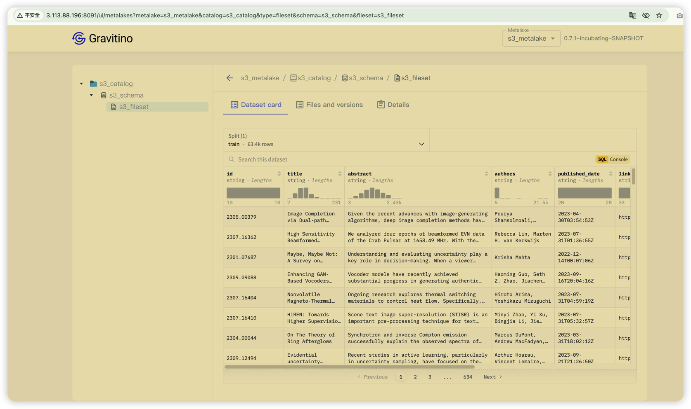

## Overall
The document describes how to create an S3 and OSS fileset.


Preparation:

- Create an S3 bucket and an OSS bucket and get corresponding access keys. Please make sure permissions have already been granted to the access keys correctly.
- Gravitino server is installed and running.

To run Gravitino server, you can use the following command:

```shell
docker run -p 8090:8090 datastrato/gravitino:poc -d
```


## Create metalake and catalog

### 1. Create a metalake

### 2. Create a catalog


   
For s3 catalog, the following configurations are required:

- `s3-access-key-id`: The access key ID for the S3 bucket.
- `s3-secret-access-key`: The secret access key for the S3 bucket.
- `s3-endpoint`: The endpoint of the S3 bucket.
- `filesystem-providers`: The file system providers. Set it to `s3` for S3 fileset.


### 3. Create a schema after S3 catalog has already been created.

### 4. create a fileset.


If you do not sepcify the properties `location` in catalog and schema, then you need to specify the value for the fileset explicitly.

- `location`: The path of this fileset.




## Create an OSS fileset

Most steps are the same as creating an S3 fileset. The following configurations are required to create an OSS catalog:


- `oss-access-key-id`: The access key ID for the oss.
- `oss-secret-access-key`: The secret access key for the oss.
- `oss-endpoint`: The endpoint of the oss.
- `filesystem-providers`: The file system providers. Set it to `oss` for OSS fileset.

then create a schema and fileset as the same as creating an S3 fileset. 


## Using the fileset

### Using the fileset by GVFS Java client
```java

// The following are common configuration Gravitino fileset;
Configuration conf = new Configuration();
conf.set("fs.gvfs.impl", "org.apache.gravitino.filesystem.hadoop.GravitinoVirtualFileSystem");
conf.set("fs.AbstractFileSystem.gvfs.impl", "org.apache.gravitino.filesystem.hadoop.Gvfs");
conf.set("fs.gvfs.impl.disable.cache", "true");

// Gravitino server address
conf.set("fs.gravitino.server.uri", "http://localhost:8080");
conf.set("fs.gravitino.client.metalake", metalakeName);

// The following configuration is for S3 fileset;
conf.set("fs.gvfs.filesystem.providers", "s3");
conf.set("s3-endpoint", s3Endpoint);
conf.set("s3-access-key-id", accessKey);
conf.set("s3-secret-access-key", secretKey);

// The following configuration is for OSS fileset;
conf.set("fs.gvfs.filesystem.providers", "oss");
conf.set("oss-endpoint", ossEndpoint);
conf.set("oss-access-key-id", ossAccessKey);
conf.set("oss-secret-access-key", ossSecretKey);

String gvfsPath = "gvfs://fileset/{catalogName}/{schemaName}/{filesetName}";
FileSystem fs = filesetPath.getFileSystem(conf);
```

Note: To access S3 fileset via the GVFS Java client, you need to add `gravitino-aws-bundle-{version}.jar` to the classpath and gravitino-oss-bundle-{version}.jar for OSS fileset.

### Using the fileset by GVFS Python client
```python

from gravitino import gvfs

# s3 options
options = {
    "s3_access_key": access_key,
    "s3_secret_key": secret_key,
    "s3_endpoint": s3_endpoint,
    # .... other common options
}

# oss options
options = {
    "oss_access_key": access_key,
    "oss_secret_key": secret_key,
    "oss_endpoint": oss_endpoint,
    # .... other common options
}

fs = gvfs.GravitinoVirtualFileSystem(server_uri="http://localhost:8090", metalake_name="test_metalake", options=options)
fs.ls("gvfs://fileset/{catalogName}/{schemaName}/{filesetName}")
```

More detail about how to use the fileset, please refer to [Gravitino Hadoop catalog](./hadoop-catalog.md) and [Gravitino GVFS client](./how-to-use-gvfs.md).


