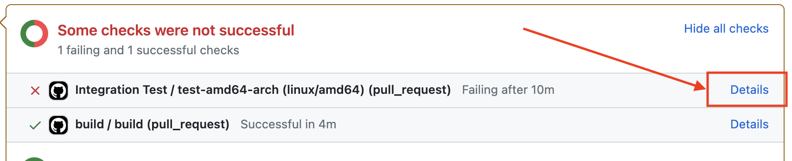
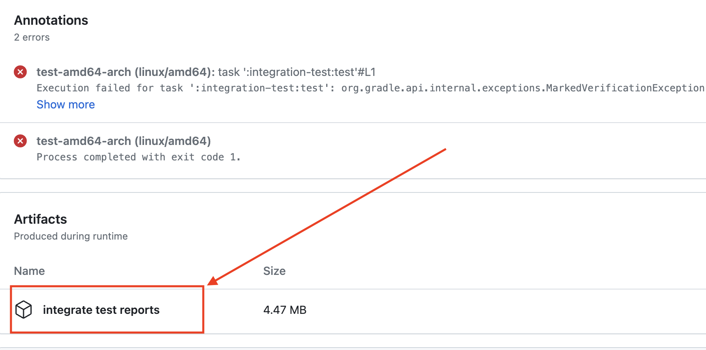

Apache Gravitino has two types of tests:

  - Unit tests, focus on the functionalities of the specific class, module, or component.
  - Integration tests, end-to-end tests that cover the whole system.

:::note before test
* If you want to run the complete integration test suites, you need to install Docker in your
  environment.
* Refer to [How to build Gravitino](./how-to-build.md) to make sure you have
  a build environment ready.
* You can use [OrbStack](https://orbstack.dev/) to replace Docker Desktop
  on macOS. OrbStack automatically configures the network between the Docker containers.
* If you are using Docker Desktop for macOS, launch the
  [mac-docker-connector](https://github.com/wenjunxiao/mac-docker-connector) before running the tests.
 Read `$GRAVITINO_HOME/dev/docker/tools/README.md` and
  `$GRAVITINO_HOME/dev/docker/tools/mac-docker-connector.sh` for more details.
:::

## Run the unit tests

To run the unit tests, run the following command:

```shell

./gradlew test -PskipITs
```

This command runs all the unit tests and skips the integration tests.

## Run the integration tests

Gravitino has two modes to run the integration tests, the default `embedded` mode and `deploy` mode.

* In `embedded` mode, the integration test starts an embedded `MiniGravitino` server
  within the same process as the integration test to run the integration tests.
* In `deploy` mode, you have to build (`./gradlew compileDistribution`) a Gravitino binary package beforehand. The
  integration test launches and connects to the local Gravitino server to run the integration
  tests.

### Run the integration tests in embedded mode

1. Run the `./gradlew build -x test` command to build the Gravitino project.

2. Use the `./gradlew test [--rerun-tasks] -PskipTests -PtestMode=embedded` commands to run the
   integration tests.

:::note
Running the `./gradlew build` command triggers the build and runs the integration tests in embedded mode.
:::

### Deploy the Apache Gravitino server and run the integration tests in deploy mode

To deploy the Gravitino server locally to run the integration tests, follow these steps:

1. Run the `./gradlew build -x test` command to build the Gravitino project.
2. Use the `./gradlew compileDistribution` command to compile and package the Gravitino project
   in the `distribution` directory.
3. Use the `./gradlew test [--rerun-tasks] -PskipTests -PtestMode=deploy` command to run the
   integration tests in the `distribution` directory.
4. Use the `bash trino-connector/integration-test/trino-test-tools/trino_test.sh` command to run all the
   Trino test sets in the `trino-connector/integration-test/src/test/resources/trino-ci-testset/testsets` directory.
   Specify the `--trino_worker_num` parameter to make the Trino test sets run in a distributed environment.

## Skip tests

* Skip unit tests by using the `./gradlew build -PskipTests` command.
* Skip integration tests by using the `./gradlew build -PskipITs` command.
* Skip web frontend integration tests by using the `./gradlew build -x :web:integration-test:test` command.
* Skip both unit tests and integration tests by using the `./gradlew build -x test` or `./gradlew build -PskipTests -PskipITs` commands.

## Configuring parameters for integration tests
### `DISPLAY_WEBPAGE_IN_TESTING`
By default, the Gravitino web frontend page will not pop up when running integration tests. 
If you wish to display the web frontend page during integrations test, you can set the `DISPLAY_WEBPAGE_IN_TESTING` environment variable in `setIntegrationTestEnvironment` in file build.gradle.kts. 
For example:
```param.environment("DISPLAY_WEBPAGE_IN_TESTING", true)```

## Docker test environment

Some integration test cases depend on the Gravitino CI Docker image.

If an integration test relies on the specific Gravitino CI Docker image,
set the `@tag(gravitino-docker-test)` annotation in the test class.
For example, the `integration-test/src/test/.../CatalogHiveIT.java` test needs to connect to
the `apache/gravitino-ci:hive-{hive-version}` Docker container for testing the Hive data source.
Therefore, it should have the following `@tag` annotation:`@tag(gravitino-docker-test)`. This annotation
helps identify the specific Docker container required for the integration test.

For example:

```java
@Tag("gravitino-docker-test")
public class CatalogHiveIT extends AbstractIT {
...
}
```

## Running all the integration tests

:::note
* Make sure that the `Docker server` is running before running all the
  integration tests. Otherwise, it only runs the integration tests without the `gravitino-docker-test` tag.
* To run Docker-related tests, make sure you have installed Docker in your environment and either
   set skipDockerTests=false in the gradle.properties file (or use `-PskipDockerTests=false` in the command) or
  (2) export SKIP_DOCKER_TESTS=false in shell. Otherwise, all tests requiring Docker will be skipped.
* On macOS, be sure to run the `${GRAVITINO_HOME}/dev/docker/tools/mac-docker-connector.sh`
  script before running the integration tests; or make sure that
  [OrbStack](https://orbstack.dev/) is running.
:::

When integration tests run, they check the whole environment and output the status of the
required environment, for example:

```text
------------------ Check Docker environment ---------------------
Docker server status ............................................ [running]
mac-docker-connector status ..................................... [stop]
OrbStack status ................................................. [yes]
Using Gravitino IT Docker container to run all integration tests. [deploy test]
-----------------------------------------------------------------
```

Complete integration tests only run when all the required environments are met. Otherwise,
only parts of them without the `gravitino-docker-test` tag run.

## How to debug Apache Gravitino server and integration tests in embedded mode

By default, the integration tests run in the embedded mode, in which `MiniGravitino` starts in the
same process. Debugging `MiniGravitino` is simple and easy, you can modify any code in the
Gravitino project and set breakpoints anywhere.

## How to debug Apache Gravitino server and integration tests in deploy mode

This mode is closer to the actual environment, but more complex to debug. To debug the Gravitino server code, follow these steps:

* Run the `./gradlew build -x test` command to build the Gravitino project.
* Use the `./gradlew compileDistribution` command to republish the packaged project in the `distribution` directory.
* If you are only debugging integration test codes, You don't have to do any setup to debug directly.
* If you need to debug Gravitino server codes, follow these steps:
  * Enable the `GRAVITINO_DEBUG_OPTS` environment variable in the
  `distribution/package/conf/gravitino-env.sh` file to enable remote JVM debugging.
  * Manually start the Gravitino server using the `./distribution/package/bin/gravitino.sh
  start` command.
  * Select the `gravitino.server.main` module classpath in the `Remote JVM Debug` to attach the
  Gravitino server process and debug it.

## Running on GitHub actions

* GitHub Actions automatically run integration tests in the embedded and deploy modes when you
  submit a pull request.
* View the test results in the `Actions` tab of the pull request page.
* Run the integration tests in several steps:
  * The Gravitino integration tests pull the CI Docker image from the Docker Hub repository. This step typically takes around 15 seconds.
  * The Gravitino project compiles and packages in the `distribution` directory using the `./gradlew compileDistribution` command.
  * Run the `./gradlew test -PtestMode=[embedded|deploy]` command.

## Test failure and test log

If a test fails, you can retrieve valuable information from the logs and test reports. Test reports are in the `./build/reports` directory. The integration test logs are in the `./integrate-test/build` directory. In deploy mode, Gravitino server logs are in the `./distribution/package/logs/` directory. 

In the event of a test failure within the GitHub workflow, the system generates archived logs and test reports. To obtain the archive, follow these steps:

1. Click the `detail` link associated with the failed integration test in the pull request. This redirects you to the job page.

   

2. On the job page, locate the `Summary` button on the left-hand side and click it to access the workflow summary page.

   

3. Look for the Artifacts item on the summary page and download the archive from there.

   

4. You can also add the tag `upload log` to your PR to upload the logs to the PR page. in this case, no matter the CI pipeline status, the logs will be uploaded to the PR page.
   
