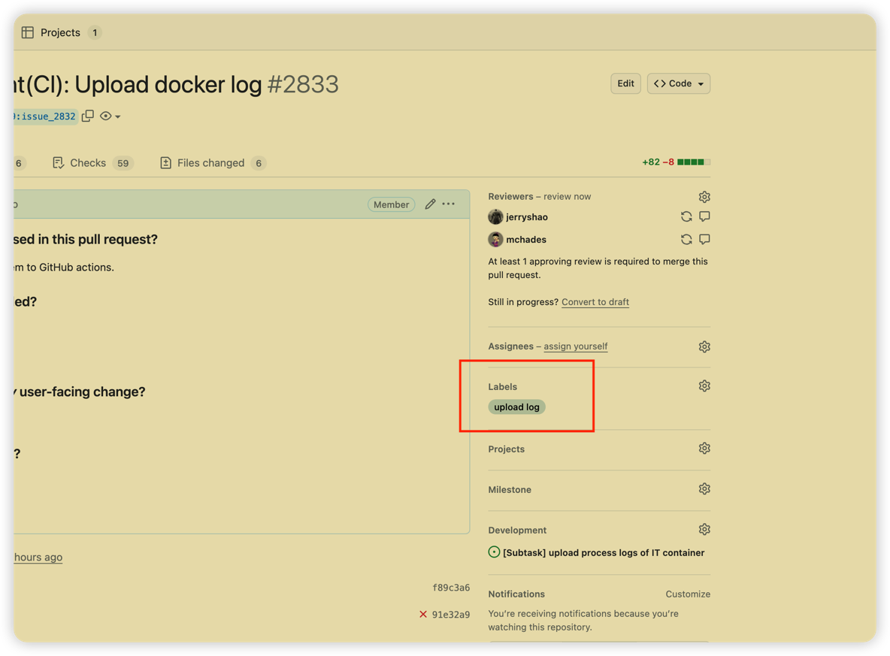

Apache Gravitino has two types of tests:

- **Unit tests** focus on the functionalities of a specific class, module, or component.
- **Integration tests** conduct end-to-end tests that cover the whole system.

## Prerequisites

* Refer to [How to build Gravitino](./how-to-build.md) to make sure you have a build environment ready.
* Install a docker environment by following the [install docker](./how-tobuild.md#install-docker) instructions.

## Unit tests

To run all the unit tests while skipping the integration tests (ITs):

```shell
./gradlew test -PskipITs
```

## Integration tests

Gravitino supports two modes for running integration tests.
In either mode, you will need to run the `./gradlew build -x test` command to build the Gravitino project.

* **embedded mode** (default): An in-process `MiniGravitino` server is started to run the integration tests.
* **deploy mode**: The test launches a local Gravitino server and connects to it to run the integration tests.

<!-- docker related tests -->
:::note
By default, all tests that require Docker are skipped.
Some integration test cases depend on the Gravitino CI Docker image.
If you want to run the complete integration test suite, refer to [complete tests](#complete-tests).
:::

### Embedded mode

Use the  command to run the integration tests.

```shell
./gradlew test [--rerun-tasks] -PskipTests -PtestMode=embedded
```

:::note
The `./gradlew build` command triggers the build and runs the integration tests in embedded mode.
:::

### Deploy mode 

Before running the integration tests under the **deploy mode**, you need to package the Gravitino project.
See [compiling the binary package](./how-to-build.md#compile-the-binary-package) for more details.

The following command triggers the integration tests under **deploy mode**:

```shell
./gradlew test [--rerun-tasks] -PskipTests -PtestMode=deploy
```

<!-- Trino tests -->
To run all the Trino test sets:

```shell
bash trino-connector/integration-test/trino-test-tools/trino_test.sh 
```

The Trino tests are located in the `trino-connector/integration-test/src/test/resources/trino-ci-testset/testsets`
directory.

## Complete tests

<!-- This should be moved elsewhere -->
If an integration test relies on the specific Gravitino CI Docker image,
set the `@tag(gravitino-docker-test)` annotation in the test class.
For example, the `integration-test/src/test/.../CatalogHiveIT.java` test needs to connect to
the `apache/gravitino-ci:hive-{hive-version}` Docker container for testing the Hive data source.
Therefore, it should have the annotation:`@tag(gravitino-docker-test)`.
This annotation helps identify the specific Docker container required for the integration test.

```java
@Tag("gravitino-docker-test")
public class CatalogHiveIT extends AbstractIT {
  ...
}
```

## Running all the integration tests

You need to [install Docker](./how-to-install.md#install-docker) to run all integration tests.
Before running the Docker-related integration tests, make sure that the Docker daemon is running,
and one of the following setttings is specified.

- set `skipDockerTests=false` in the `gradle.properties` file
- use `-PskipDockerTests=false` in the command line
- `export SKIP_DOCKER_TESTS=false` in your Shell

:::note
On macOS, be sure to run the `${GRAVITINO_HOME}/dev/docker/tools/mac-docker-connector.sh` script
before running the integration tests; or make sure that [OrbStack](https://orbstack.dev/) is running.
:::

An integration test will check the Docker environment and report the check result.
Complete integration tests only run when all the required conditions are met.
Otherwise, only the integration tests without the `gravitino-docker-test` tag are executed.

For example:

```text
------------------ Check Docker environment ---------------------
Docker server status ............................................ [running]
mac-docker-connector status ..................................... [stop]
OrbStack status ................................................. [yes]
Using Gravitino IT Docker container to run all integration tests. [deploy test]
-----------------------------------------------------------------
```

### Config parameters for integration tests

#### `DISPLAY_WEBPAGE_IN_TESTING`

By default, the Gravitino Web frontend page will not pop up when running integration tests. 
If you want to show the Web frontend page during integration tests,
you can set the `DISPLAY_WEBPAGE_IN_TESTING` environment variable in `setIntegrationTestEnvironment`
in file `build.gradle.kts`. 

For example:

```
param.environment("DISPLAY_WEBPAGE_IN_TESTING", true)
```

## Debugging the Apache Gravitino Server

### Debugging in embedded mode

By default, the integration tests run in the *embedded* mode.
Debugging the `MiniGravitino` instance is simple and easy,
you can modify any code in the project and set breakpoints as needed.

### Debugging in deploy mode

The *deploy mode* is closer to the actual deployment environment, but more complex to debug.
To debug the Gravitino server:

* [Build the Gravitino project](./how-to-build.md#build-the-gravitino-project).
  Optionally, you can specify `-x test` to skip all tests.

* [Compile the binary package](./how-to-build.md#compile-the-binary-package).

* If you are only debugging integration test related code, you don't need extra setup.

* To debug the Gravitino server code:

  - Enable remote JVM debugging by uncommenting the `GRAVITINO_DEBUG_OPTS` environment variable
    in the `conf/gravitino-env.sh` file.

  - Manually [start the Gravitino server](./how-to-build.md#start-the-server).

  - Select the `gravitino.server.main` module classpath in the *Remote JVM Debug* to attach the
    Gravitino server process and debug it.

## Test failures and test logs

If a test fails, you can get valuable information from the logs and test reports.
The test reports are located in the `./build/reports` directory.
The integration test logs can be found in the `./integrate-test/build` directory.
In the *deploy mode*, Gravitino server logs are written to the `./distribution/package/logs/` directory. 

## CI Testing on GitHub

The Gravitino project leverages *GitHub Actions* to conduct continuous integration (CI) tests.
When you submit a pull request (PR) to the Gravitino repository,
the automation workflow runs the integration tests in the *embedded* and the *deploy* modes .

The CI integration test consists of several steps:

* The automation pulls the CI Docker image from Docker Hub.
  This step typically takes around 15 seconds.
* The Gravitino project is then compiled and packaged into the `distribution` directory.
* The `./gradlew test -PtestMode=[embedded|deploy]` command is then triggered to run the specified tests.

You can view the test results in the *Actions* tab on the pull request page.

In the event of a CI test failure, the GitHub workflow generates archived logs and reports.
To retrieve the archive:

1. Click the *detail* link associated with the failed integration test on the Pull Request page.
   This redirects you to the *job* page.

   

1. On the *Job* page, locate the *Summary* button on the left-hand side and click it to access the workflow summary.

   

1. Look for the *Artifacts* item on the summary page and download the archive.

   

1. You can also add the tag `upload log` to your PR to upload the logs to the PR page.
   In this case, the logs will be uploaded to the PR page regardless of the CI workflow result.
   

