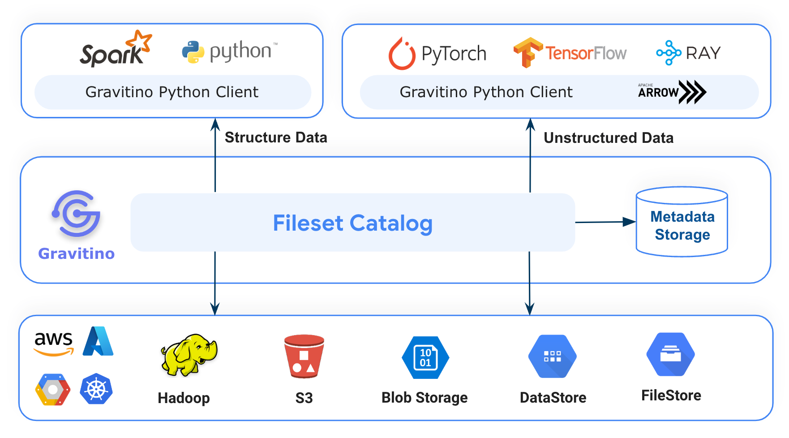
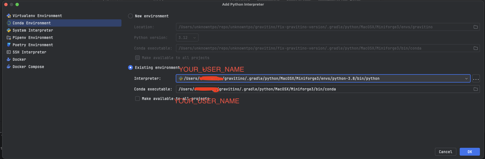
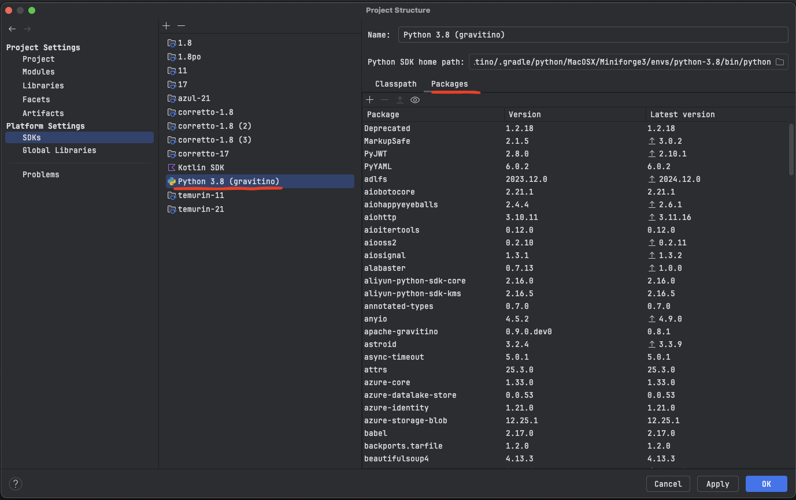
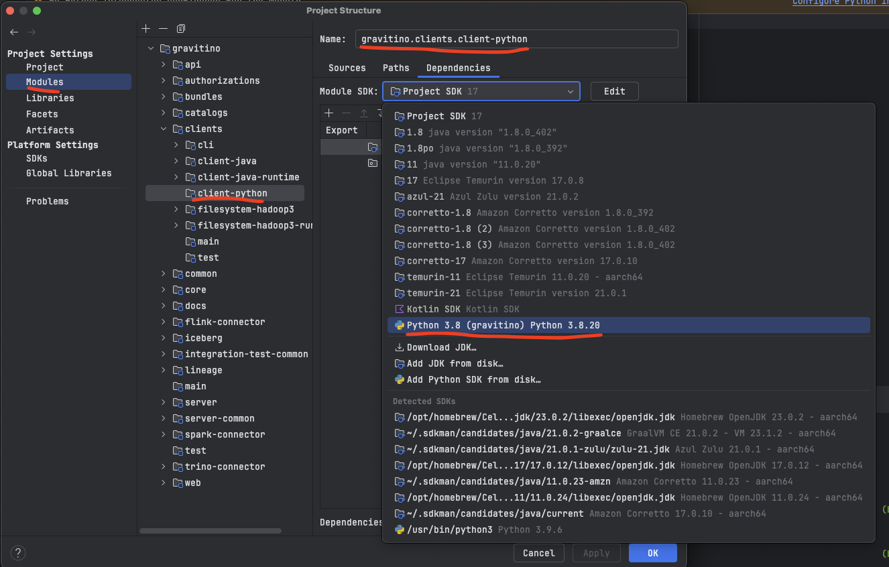

# Apache Gravitino Python client

Apache Gravitino is a high-performance, geo-distributed, and federated metadata lake.
It manages the metadata directly in different sources, types, and regions, also provides users
the unified metadata access for data and AI assets.

Gravitino Python client helps data scientists easily manage metadata using Python language.



## Use Guidance

You can use Gravitino Python client library with Spark, PyTorch, Tensorflow, Ray and Python environment.

First of all, You must have a Gravitino server set up and run, You can refer document of
[How to install Gravitino](./how-to-install.md) to build Gravitino server from source code and
install it in your local.

### Apache Gravitino Python client API

```shell
pip install apache-gravitino
```

1. [Manage metalake using Gravitino Python API](./manage-metalake-using-gravitino.md?language=python)
2. [Manage fileset metadata using Gravitino Python API](./manage-fileset-metadata-using-gravitino.md?language=python)

### Apache Gravitino Fileset Example

We offer a playground environment to help you quickly understand how to use Gravitino Python
client to manage non-tabular data on HDFS via Fileset in Gravitino. You can refer to the
document [How to use the playground](./how-to-use-the-playground.md)
to launch a Gravitino server, HDFS and Jupyter notebook environment in you local Docker environment.

Waiting for the playground Docker environment to start, you can directly open
`http://localhost:18888/lab/tree/gravitino-fileset-example.ipynb` in the browser and run the example.

The [gravitino-fileset-example](https://github.com/apache/gravitino-playground/blob/main/init/jupyter/gravitino-fileset-example.ipynb)
contains the following code snippets:

1. Install HDFS Python client.
2. Create a HDFS client to connect HDFS and to do some test operations.
3. Install Gravitino Python client.
4. Initialize Gravitino admin client and create a Gravitino metalake.
5. Initialize Gravitino client and list metalakes.
6. Create a Gravitino `Catalog` and special `type` is `Catalog.Type.FILESET` and `provider` is
   [fileset](./fileset-catalog.md)
7. Create a Gravitino `Schema` with the `location` pointed to a HDFS path, and use `hdfs client` to
   check if the schema location is successfully created in HDFS.
8. Create a `Fileset` with `type` is [Fileset.Type.MANAGED](./manage-fileset-metadata-using-gravitino.md#fileset-operations),
   use `hdfs client` to check if the fileset location was successfully created in HDFS.
9. Drop this `Fileset.Type.MANAGED` type fileset and check if the fileset location was
   successfully deleted in HDFS.
10. Create a `Fileset` with `type` is [Fileset.Type.EXTERNAL](./manage-fileset-metadata-using-gravitino.md#fileset-operations)
    and `location` pointed to exist HDFS path
11. Drop this `Fileset.Type.EXTERNAL` type fileset and check if the fileset location was
    not deleted in HDFS.

## How to develop Apache Gravitino Python Client

You can ues any IDE to develop Gravitino Python Client. Directly open the client-python module project in the IDE.

### Prerequisites

+ Python 3.9+
+ Refer to [How to build Gravitino](./how-to-build.md#prerequisites) to have necessary build
  environment ready for building.

### Build and testing

1. Clone the Gravitino project.

    ```shell
    git clone git@github.com:apache/gravitino.git
    ```

2. Build the Gravitino Python client module

    ```shell
    # Default Python version is 3.9
    ./gradlew :clients:client-python:build
    # If you want to build Python client with specific Python version,
    # add `-PpythonVersion` with version number:
    ./gradlew :clients:client-python:build -PpythonVersion=3.10
    ```
 
3. Run unit tests

    ```shell
    ./gradlew :clients:client-python:test -PskipITs
    ```

4. Run integration tests

   Because Python client connects to Gravitino Server to run integration tests,
   So it runs `./gradlew compileDistribution -x test` command automatically to compile the
   Gravitino project in the `distribution` directory. When you run integration tests via Gradle
   command or IDE, Gravitino integration test framework (`integration_test_env.py`)
   will start and stop Gravitino server automatically.

    ```shell
    ./gradlew :clients:client-python:test
    ```

5. Distribute the Gravitino Python client module

    ```shell
    ./gradlew :clients:client-python:distribution
    ```

6. Deploy the Gravitino Python client to https://pypi.org/project/apache-gravitino/

    ```shell
    ./gradlew :clients:client-python:deploy
    ```
   
### IDE specific settings

#### JetBrains IntelliJ IDEA

We use Conda Environment to manage Python Environment, to configure Python
SDK, you need to:

1. Make sure you installed [Python Plugin](https://plugins.jetbrains.com/plugin/631-python).
2. Make sure you followed the step to build python module in [Build and testing](#build-and-testing)
3. Make sure you are at the root directory of Gravitino Git repository. 
4. Find conda executable by executing this command

   ```shell
   find $(pwd)/.gradle/python/*/Miniforge3/bin/conda
   
   # example output
   /Users/YOUR_USER_NAME/gravitino/.gradle/python/MacOSX/Miniforge3/bin/conda
   ```

5. Find Python Interpreter with this command:

   ```shell
   find $(pwd)/.gradle/python/*/Miniforge3/envs/*/bin/python
   
   # example output
   /Users/YOUR_USER_NAME/gravitino/.gradle/python/MacOSX/Miniforge3/envs/python-3.9/bin/python
   ```

6. Follow steps in [Create a conda environment](https://www.jetbrains.com/help/idea/configuring-python-sdk.html#gdizlj_44), 
and at step 5, choose [Existing conda environment](https://www.jetbrains.com/help/idea/configuring-python-sdk.html#existing-conda-environment)

7. Fill in the output from step 4 into *Conda executable* field, step 5 into *Interpreter* field.

And you will see a new Python SDK is added, and it has several packages installed.


8. Set `clients/client-python` module sdk to the one we set in previous step.


9. Done! Now, open any python files and start developing Gravitino Python Client.

##### Note about running integration tests of Gravitino Python client in IntelliJ IDEA.

Since integration tests require Gravitino Java distribution, so you can not run tests with IntelliJ
[Run tests button](https://www.jetbrains.com/help/idea/performing-tests.html),
Please execute this gradle task with [Gradle Plugin](https://plugins.jetbrains.com/docs/intellij/tools-intellij-platform-gradle-plugin.html)
or in command line to run integration tests.

```shell
./gradlew clients:client-python:integrationTest
```

Or, you would see errors like:

```shell
...
ERROR:tests.integration.integration_test_env:Gravitino Python client integration test must configure `GRAVITINO_HOME`

Process finished with exit code 0
```

## Resources

+ Official website https://gravitino.apache.org/
+ Project home on GitHub: https://github.com/apache/gravitino/
+ Playground with Docker: https://github.com/apache/gravitino-playground
+ User documentation: https://gravitino.apache.org/docs/
+ Slack Community: [https://the-asf.slack.com#gravitino](https://the-asf.slack.com/archives/C078RESTT19)

## License

Gravitino is under the Apache License Version 2.0, See the [LICENSE](https://github.com/apache/gravitino/blob/main/LICENSE) for the details.

