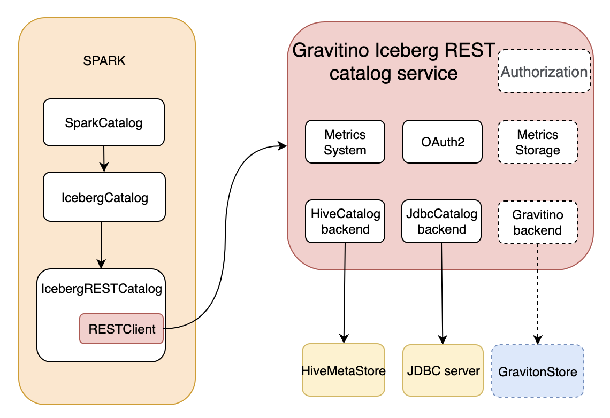

## Background
[Apache Iceberg](https://iceberg.apache.org/) is a popular high-performance format for huge analytic tables. Iceberg catalogs is responsible for creating, dropping, alerting Iceberg tables and namespaces. The catalog stores a reference to the current table metadata, and provides the grant of atomic update to the current table metadata. Iceberg catalog is completely pluggable and provides several implements:
1. Hive catalog, tracks namespaces and tables using a Hive metastore.
2. JDBC catalog, tracks namespaces and tables in a simple JDBC database like MySQL or PostGreSQL.
3. HADOOP catalog, tracks namespaces and tables in HDFS.
 
All above catalogs implement all catalog logics in client side, challenges persist:
1. **Client compatibility**: Client is responsible for compatibility.
2. **Language and Ecosystem Compatibility**: The current Java implementation poses challenges for maintenance in other languages and native engines.
3. **Consistency**: Consistency across implementations.
4. **Performance Limitations**: Opportunities for performance enhancements remain underexplored.

In response, the Iceberg 0.14.0 release ushered in the REST catalog, outlined in the [Iceberg REST API specification](https://github.com/apache/iceberg/blob/main/open-api/rest-catalog-open-api.yaml). This introduces a paradigm shift, placing the bulk of logic on the server side, making the client lightweight.

[Gravitino](https://datastrato.ai/gravitino/) is opensource, high-performance, geo-distributed, and federated metadata lake, provides a unified interface to operate diverse catalogs like Hive, Iceberg, JDBC. Gravitino seamlessly integrates Iceberg REST interfaces defined in the Iceberg REST API specification, capable of serving as an Iceberg REST service.

## Gravitino Iceberg REST catalog service

Gravitino Iceberg REST service aspires to be a high-performance, product-quality Iceberg REST service, fully supporting the Iceberg REST interface.
Architecture Overview:

It's working in the proxy mode, proxy operations to the Iceberg backend catalog like `HiveCatalog` or `JdbcCatalog`. It covers all namespace and table operations, including creating tables, dropping tables, altering tables and renaming tables.
Beyond these fundamental operations, it provides server metrics and OAuth support crucial for production environments.

## Roadmap

1. **Security Enhancement**: Broadening support for various authentication and authorization systems.
2. **Performance improvement**: Implementing cache methods to enhance operational efficiency.
3. **Full interface support**: Store Iceberg metrics.

If you are any ideas or requirements, feel free to open an issue in the [Gravitino GitHub repository](https://github.com/datastrato/gravitino).  Your contributions will propel the evolution of this dynamic Iceberg REST catalog service.
