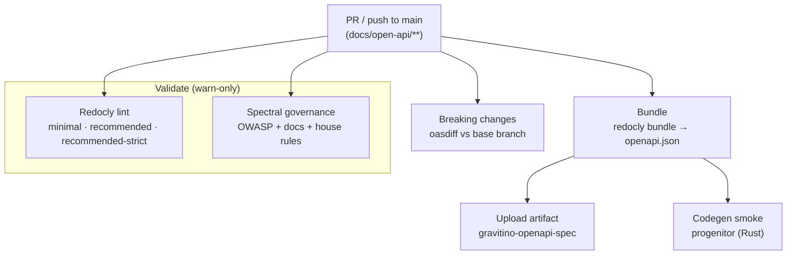

## Introduction

The Gravitino REST API is described by an OpenAPI specification under
[`docs/open-api`](https://github.com/apache/gravitino/tree/main/docs/open-api).
That description is a **contract** for every non-Java consumer: SDK generators
(Rust, TypeScript, Go), catalog connectors, mock servers, and contract tests all
read it to produce typed bindings. The value of shipping an OpenAPI spec is that
someone can point a generator at it and get a working, typed client with zero
friction — so the spec must be strictly valid and codegen-clean, not merely
renderable.

This page documents how the spec is validated in CI and how the machine-readable
artifact is produced and (eventually) published. The tooling lives in
[`dev/openapi`](https://github.com/apache/gravitino/tree/main/dev/openapi) and
runs from [`.github/workflows/openapi.yml`](https://github.com/apache/gravitino/blob/main/.github/workflows/openapi.yml).

## Objectives

The pipeline exists to keep three guarantees true on every change:

- **Strictly valid and codegen-clean.** The spec generates typed clients with no
  hand-holding, so it is linted at full strictness and run through a real
  generator.
- **Consistently governed.** House conventions, API security, and documentation
  completeness are enforced mechanically rather than by reviewer memory.
- **Always on current tooling.** Linter and generator versions are declared in
  `dev/openapi/package.json` and tracked by Dependabot, and validation is a
  first-class GitHub Actions workflow.

## The pipeline



Every stage is **warn-only** today: it annotates findings on the pull request but
never fails the build. This is deliberate — it exposes the existing backlog
without turning `main` red. Stages are promoted to enforcing as the backlog is
fixed.

### 1. Redocly, at multiple strictness levels

Redocly performs structural validation. CI runs it as a matrix over three
built-in rulesets so the finding gradient is visible at a glance:

| Level | What it adds |
|---|---|
| `minimal` | The smallest set of hard structural rules. |
| `recommended` | Redocly's recommended defaults. |
| `recommended-strict` | The above, with warnings promoted to errors (strict examples, no unused components, and so on). |

Running all three shows exactly which findings appear only under strictness,
which helps triage what to fix first.

### 2. Spectral, the governance kitchen sink

Redocly answers "is this a valid OpenAPI document?". [Spectral](https://github.com/stoplightio/spectral)
answers "does it follow our house rules and best practices?". The ruleset in
`dev/openapi/.spectral.yaml` layers:

- **`spectral:oas`** — baseline OpenAPI hygiene.
- **OWASP API Security Top 10** — define security schemes, constrain strings and
  arrays (`maxLength`, `maxItems`), bound integers, require rate-limit responses,
  and so on.
- **Documentation completeness** — descriptions and examples on schemas,
  parameters, and responses.
- **Gravitino house rules** — the `application/vnd.gravitino.v1+json` media type,
  PascalCase schema names, camelCase properties, tagged operations.

The kitchen sink surfaces hundreds of findings on first run by design; rules are
promoted from `warn` to `error` over time.

### Crashes are a signal, not a nuisance

Nothing in the ruleset is disabled to force a green run. If a linter **crashes**
— aborts with an exception instead of returning findings — that is treated as a
stronger signal than any single finding: the document is malformed enough to
break the tool. The workflow detects a Spectral crash by its error signature and
raises an "investigate the spec" warning (with the trace in the job summary)
rather than muting the offending rule. The fix belongs in the document.

### 3. Bundle → artifact

`redocly bundle` resolves the ~30 cross-referenced files into a single
`openapi.json` (and `openapi.yaml`). CI publishes it as the
`gravitino-openapi-spec` artifact — the clean, single-file input a generator
should consume instead of resolving the multi-file tree itself. This step always
runs, independent of lint results.

### 4. Codegen smoke test (progenitor)

[progenitor](https://github.com/oxidecomputer/progenitor) generates a Rust client
from the bundled spec. Its `typify` backend is stricter than most generators, so
it catches issues broad tools tolerate (for example `default: null` or a bare
`format` without a `type`). A failure to generate is the earliest, sharpest
signal that the spec is not codegen-clean.

### 5. Breaking-change detection (oasdiff)

On pull requests, [oasdiff](https://github.com/oasdiff/oasdiff) diffs the bundled
spec against the base branch and reports breaking changes. Both sides are bundled
with the pull request's tooling so the check works even when the base branch
predates this pipeline.

## Local usage

```bash
cd dev/openapi
npm ci

npm run lint       # Redocly (recommended-strict) + Spectral
npm run bundle     # -> build/openapi.json and build/openapi.yaml
```

Requires Node `20.19+` / `22.12+` / `23+` (Redocly v2). See
[`dev/openapi/README.md`](https://github.com/apache/gravitino/blob/main/dev/openapi/README.md).

## Publishing the artifact

The bundled `openapi.json` is currently published as a **CI artifact** on every
run, built from `HEAD`. Consumers who want the machine-readable spec can download
it from the workflow run.

Two extensions are planned:

- **A stable URL on the website.** The Gravitino site
  ([`apache/gravitino-site`](https://github.com/apache/gravitino-site)) is a
  Docusaurus app that already renders the spec as human documentation. Docusaurus
  serves files under `static/` verbatim, so dropping the bundled `openapi.json`
  there publishes it at a fixed URL (for example
  `https://gravitino.apache.org/openapi/openapi.json`) that generators can point
  at directly.
- **Per-release versions.** Only `HEAD` is built today. Release-tagged bundles
  can be produced later via `workflow_dispatch` or tag triggers, giving each
  Gravitino version its own immutable spec.
