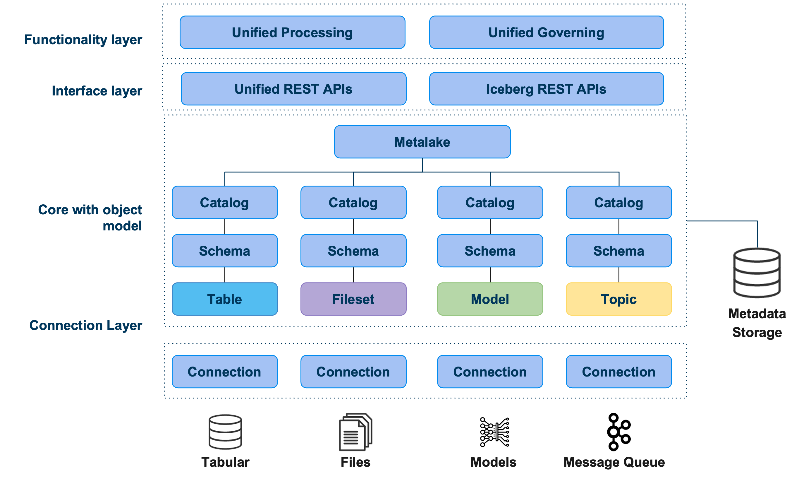
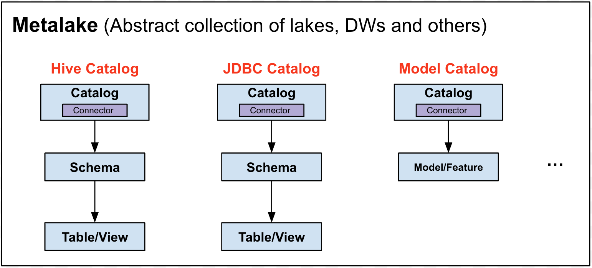

## Introduction

Gravitino is a high-performance, geo-distributed, and federated metadata lake. It manages the
metadata directly in different sources, types, and regions. It also provides users with unified metadata access for data and AI assets.

Gravitino aims to provide several key features:

* SSOT (Single Source of Truth) for multi-regional data with geo-distributed architecture support.
* Unified Data + AI asset management for both users and engines.
* Security in one place, centralize the security for different sources.
* Built-in data management + data access management.

## Architecture

* **Functionality Layer**: Gravitino provides an API for users to manage and govern the
  metadata, including standard metadata creation, update, and delete operations. In the meantime, it also provides the ability to govern the metadata in a unified way, including access control, discovery, and others.
* **Interface Layer**: Gravitino provides a standard REST API as the interface layer for users. Future support includes Thrift and JDBC interfaces.
* **Core Object Model**: Gravitino defines a generic metadata model to represent the metadata in different sources and types and manages them in a unified way.
* **Connection Layer**: In the connection layer, Gravitino provides a set of connectors to connect to different metadata sources, including Apache Hive, MySQL, PostgreSQL, and others. It also allows connecting and managing heterogeneous metadata other than Tabular data.

## Features

### Unified metadata management and governance

Gravitino abstracts the unified metadata models and APIs for different kinds of metadata sources.
For example, relational metadata models for tabular data, like Hive, MySQL, PostgreSQL, etc.
File metadata model for all the unstructured data, like HDFS, S3, and others.

Besides the unified metadata models, Gravitino also provides a unified metadata governance layer
(WIP) to manage the metadata in a unified way, including access control, auditing, discovery and
others.

### Direct metadata management

Unlike traditional metadata management systems, which need to collect the metadata
actively or passively from underlying systems, Gravitino manages these systems directly.
It provides a set of connectors to connect to different metadata sources.
The changes in Gravitino directly reflect in the underlying systems, and vice versa.

### Geo-distribution support (WIP)

Gravitino supports geo-distribution deployment, which means different instances of Gravitino
can deploy in different regions or clouds, and they can connect to get
the metadata from each other. With this, users can get a global view of metadata across the
regions or clouds.

### Multi-engine support

Gravitino supports different query engines to access the metadata. Currently, it supports
[Trino](https://trino.io/), users can use Trino to query the metadata and data without needing to
change the existing SQL dialects.

In the meantime, other query engine support is on the roadmap, including
[Apache Spark](https://spark.apache.org/), [Apache Flink](https://flink.apache.org/) and others.

### AI asset management (WIP)

The goal of Gravitino is to unify the data management in both data and AI assets. The support of AI
assets like models, features, and others are under development.

## Terminology

### The model of Gravitino

* **Metalake**: The top-level container for metadata. Typically, one group has one metalake
  to manage all the metadata in it. Each metalake exposes a three-level namespace(catalog.schema.
  table) to organize the data.
* **Catalog**: A catalog is a collection of metadata from a specific metadata source.
  Each catalog has a related connector to connect to the specific metadata source.
* **Schema**: A schema is equivalent to a database, Schemas only exist in the specific catalogs
  that support relational metadata sources, such as Apache Hive, MySQL, PostgreSQL, and others.
* **Table**: The lowest level in the object hierarchy for catalogs that support relational
  metadata sources. You can create Tables in specific schemas in the catalogs.
* **Model**: The model represents the metadata in the specific catalogs that support model management.
