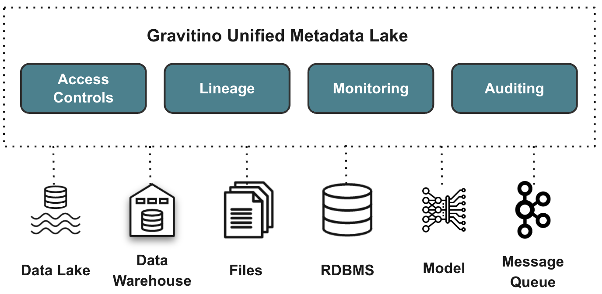
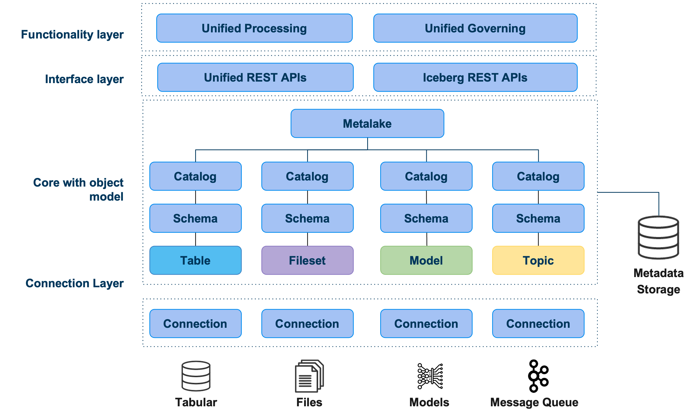

Apache Gravitino is a high-performance, geo-distributed, federated metadata catalog. A single Gravitino deployment manages metadata across heterogeneous sources, including Apache Iceberg tables in object storage, Apache Hive tables in HDFS, relational databases such as MySQL and PostgreSQL, filesets, Apache Kafka topics, and ML models, with consistent access control and governance across all of them.

Gravitino is designed for environments where data lives in multiple catalogs across multiple regions, clouds, or business units, and where the operating need is a coherent governance and access layer over that landscape rather than a migration to a single underlying system.

*Gravitino unifies access controls, lineage, monitoring, and auditing across data and AI sources.*

Gravitino exposes its catalogs through standard REST interfaces, including the Apache Iceberg REST Catalog protocol. Engines such as Trino, Apache Spark, Apache Flink, and Daft connect to Gravitino as they would to any catalog service, with no client modifications.

## Capabilities

### Federated Catalog Management

Gravitino federates existing catalogs rather than replacing them. Connect to live Apache Iceberg, Apache Hive, JDBC, Apache Kafka, and other catalogs, and Gravitino reflects their metadata in a unified hierarchy. Changes made through Gravitino propagate to the underlying systems. Changes made directly to those systems remain visible through Gravitino.

### Iceberg REST Catalog Service

Gravitino implements the Apache Iceberg REST Catalog protocol as a server interface. Any IRC-compatible engine connects to Gravitino in the same way it would connect to any other IRC server and gains federation, credential vending, and centralized policy in the process. A Gravitino deployment can also operate as a geo-distributed IRC layer, where a local Gravitino instance proxies to a remote one so engines see a consistent global metadata view across regions or clouds. See the [Iceberg REST catalog service](iceberg-rest-service.md) for details.

### Multi-Engine Query Support

Gravitino integrates with major lakehouse engines through dedicated connectors and the Iceberg REST Catalog protocol:

* [Trino connector](trino-connector/index.md), [Apache Spark connector](spark-connector/spark-connector.md), [Apache Flink connector](flink-connector/flink-connector.md), and [Daft connector](daft-connector/daft-connector.md) for engine-native catalog integration.
* Iceberg REST Catalog protocol for any IRC-compatible engine.
* Standard REST API for custom integrations.

### Unified Governance

Access control, credential vending, lineage, and audit operate across all catalogs in a metalake. Policies are configured once and enforced wherever data is accessed through Gravitino. See [Access control](security/access-control.md) and [Credential vending](security/credential-vending.md).

### Data and AI Assets

The Gravitino metadata model accommodates relational tables, filesets, ML models, and message queue topics as first-class objects. AI workflows that depend on a mix of tabular data, model artifacts, and unstructured files can be governed through one system.

## Architecture

The Gravitino server is organized into four layers:

* **Functionality layer.** The metadata management and governance surface. Standard create, read, update, and delete operations on metalakes, catalogs, schemas, and assets, plus governance features such as access control, lineage, and discovery.
* **Interface layer.** Standard REST APIs for unified Gravitino metadata, plus the Iceberg REST Catalog protocol for Iceberg-native engine integration. Thrift and JDBC interfaces are on the roadmap.
* **Core with object model.** A generic metadata model that represents tabular, fileset, model, and topic assets in a uniform three-level namespace (`catalog.schema.asset`) under a metalake.
* **Connection layer.** Catalog-specific connectors that bind Gravitino to source systems, including Apache Iceberg, Apache Hive, JDBC databases, Apache Kafka, and object storage filesets.

Gravitino persists its own metadata in a metadata backend, either a JDBC database such as MySQL or PostgreSQL, or its built-in storage. Source system metadata remains in its original system; Gravitino reads and writes through the connection layer. See [Relational backend storage](how-to-use-relational-backend-storage.md) for backend configuration.

## Terminology

### The Metadata Object

* **Metalake.** The container or tenant for metadata. A group typically has one metalake that holds all of its metadata. Each metalake exposes a three-level namespace (`catalog.schema.asset`) for organizing data.
* **Catalog.** A collection of metadata from a specific source. Each catalog has a connector that binds it to its source.
* **Schema.** The second-level namespace, grouping a collection of metadata. A schema can map to a database or schema in a relational source such as Apache Hive, MySQL, or PostgreSQL, or to a logical namespace in fileset and model catalogs.
* **Table.** The lowest level in the object hierarchy for catalogs that support relational metadata. Tables are created inside schemas within a catalog.
* **Fileset.** A collection of files and directories in a file system. The fileset object holds the logical metadata for those files.
* **Model.** Represents metadata in catalogs that support model management.
* **Topic.** Represents metadata in catalogs that manage topics for a message queue system, such as Apache Kafka.
