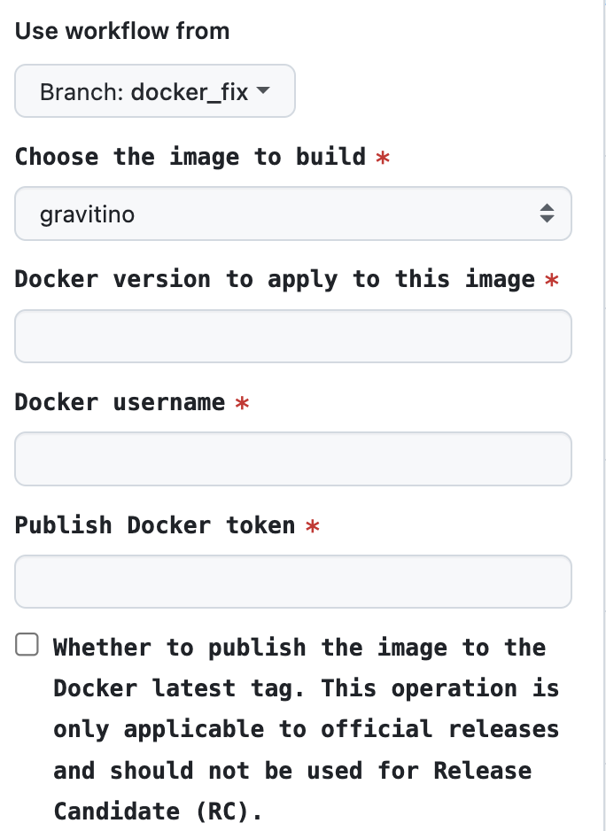

## How to Publish Docker Images

## Introduction

The Gravitino project provides a set of docker images to facilitate the publishing, development and testing of the Gravitino project.
The Gravitino official docker images are published to the [datastrato](https://hub.docker.com/u/datastrato) DockerHub repository.

## Publish Docker Images to Docker Hub

We use Github Actions to publish the docker images to the DockerHub repository.

1. Open the <https://github.com/datastrato/gravitino/actions/workflows/docker-image.yml>
2. Click the `Run workflow` button.
3. Select the branch you want to publish.

   + If you select `main` branch, the docker image will be published the specified tag and the `latest` tag.
   + If you select another branch, the docker image will only publish the specified tag.

4. Input the `tag name`, for example: `0.1.0`, Then build and push the docker image name is `datastrato/{image-name}:0.1.0`.

   + Currently, only the `hive` docker image is supported, for example: `datastrato/gravitino-ci-hive`.
   + Publishing other data sources, for example, `Iceberg` docker image will be supported in the future.

5. You must enter the correct `publish docker token` before you can execute run `Publish Docker Image` workflow.
6. Wait for the workflow to complete. You can see a new docker image shown in the [datastrato](https://hub.docker.com/u/datastrato) DockerHub repository.

## The Version of the Data Source

+ [gravitino-ci-hive](../dev/docker/hive/README.md)
