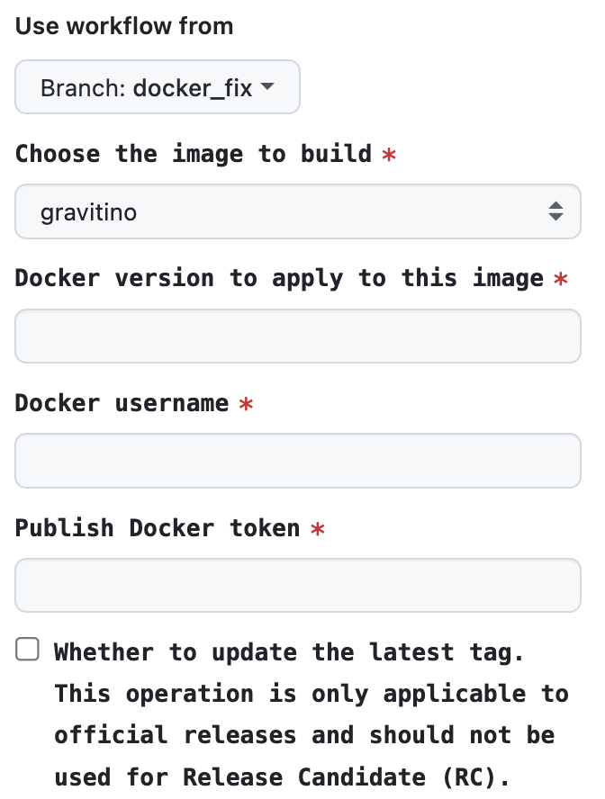

## Introduction

The Apache Gravitino project provides a set of Docker images to facilitate the publishing, development, and testing of the Gravitino project.
[Apache Docker Hub](https://hub.docker.com/u/apache) repository publishes the official Gravitino Docker images.

## Publish Docker images to Docker Hub

You can use GitHub actions to publish Docker images to the Docker Hub repository.

1. Open the [Docker publish link](https://github.com/apache/gravitino/actions/workflows/docker-image.yml)
2. Click the `Run workflow` button.
3. Select the branch you want to build
   + Selecting the main branch results in publishing the Docker image with the specified tag and the latest tag.
   + Selecting another branch, results are publishing the Docker image with the specified tag.
4. Choose the image you want to build
   + `apache/gravitino-ci:hive`.
   + `apache/gravitino-ci:trino`.
   + Future plans include support for other data sources.
5. Input the `tag name`, for example: `0.1.0`, Then build and push the Docker image name. Currently, the Docker image name is in the format:
   1. `apache/gravitino-ci:{image-type}-0.1.0` if this is a trino CI image, image-type is `trino`, `hive`, `kerberos-hive`, `doris`, `ranger`.
   2. `apache/gravitino-playground:{image-type}-0.1.0` if this is a playground image, image-type is `trino`, `hive`, `ranger`.
   3. `apache/gravitino:0.1.0` if this is a gravitino server image.
   4. `apache/gravitino-iceberg-rest:0.1.0` if this is an iceberg-rest server image.
6. You must enter the correct `docker user name`and `publish docker token` before you can execute run `Publish Docker Image` workflow.
7. If you want to update the latest tag, select the box for `Whether to update the latest tag`.
8. Wait for the workflow to complete. You can see a new Docker image shown in the [Apache Docker Hub](https://hub.docker.com/u/apache) repository.

## More details of Apache Gravitino Docker images

+ [Gravitino Docker images](docker-image-details.md)
