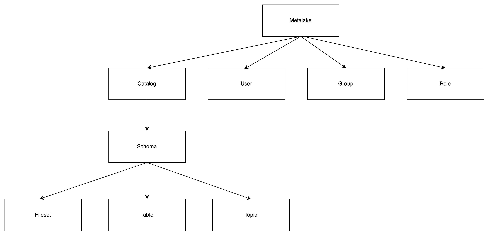
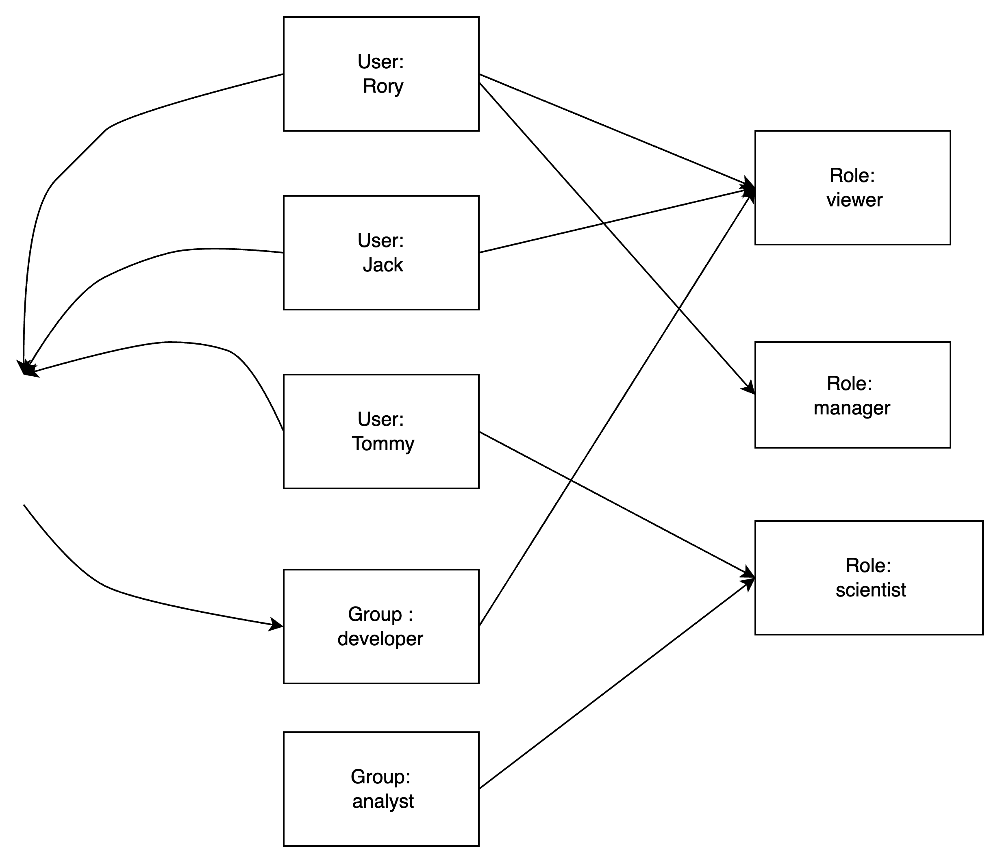
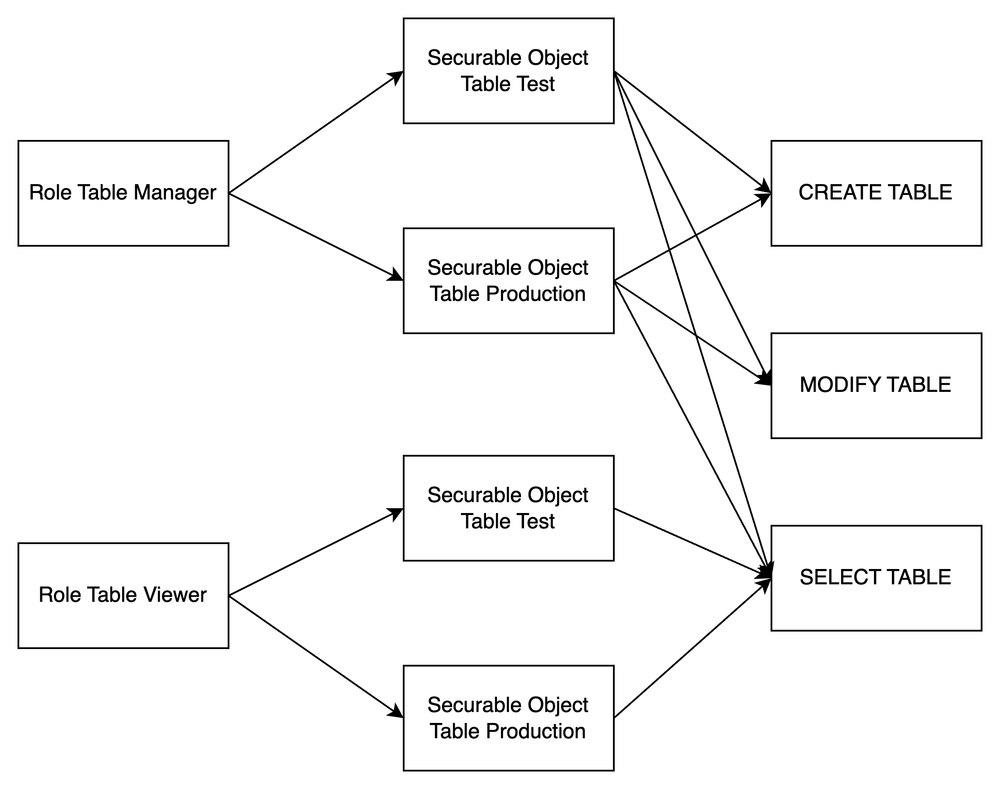
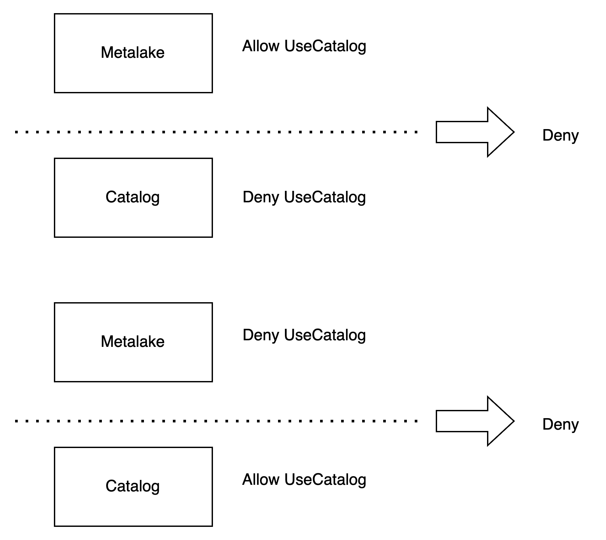
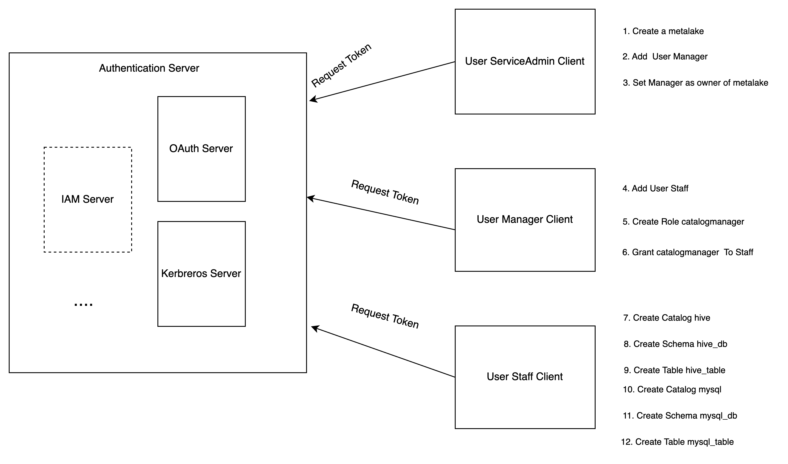

## Overview

Gravitino adopts RBAC and DAC. 

Role-based Access Control (RBAC): Access privileges are assigned to roles, which are in turn assigned to users or groups.

Discretionary Access Control(DAC): Each metadata object has an owner, who can in turn grant access to that object.

:::info

Gravitino only supports authorization for securable objects, when Gravitino supports to pass the privileges to underlying authorization plugin.
Gravitino doesn't support metadata authentication. It means that Gravitino won't check the privileges when Gravitino receives the requests.

:::


## Concept

### Role

A metadata object to which privileges can be granted. Roles are in turn assigned to users or groups.

### Privilege

A defined level of access to an object. Multiple distinct privileges may be used to control the granularity of access granted.

### User

A user identity recognized by Gravitino. External user system instead of Gravitino manages users. 

### Group

A group identity recognized by Gravitino. External user system instead of Gravitino manages groups. 

### Metadata objects

Metadata objects are managed in Gravitino, such as `CATALOG`, `SCHEMA`, `TABLE`,
`COLUMN`, `FILESET`, `TOPIC`, `COLUMN`, `ROLE`, `METALAKE`. A metadata object is combined by a `type` and a
comma-separated `name`. For example, a `CATAGLOG` object has a name "catalog1" with type
"CATALOG", a `SCHEMA` object has a name "catalog1.schema1" with type "SCHEMA", a `TABLE`
object has a name "catalog1.schema1.table1" with type "TABLE". A `METALAKE` object has a name "metalake1".

### Securable objects

A metadata object to which access can be granted. Unless allowed by a grant, access is denied. 
Every securable object resides within a logical container in a hierarchy of containers.
The top container is the metalake. 
Catalogs are under the metalake. Catalogs represent different kinds of data sources.
Schemas are under the catalog. There are tables, topics, or filesets under the schema.



The relationship of the concepts is as below.




### Ownership

Every metadata object has an owner. The owner could be a user or group, and has all the privileges of the metadata object.
Meanwhile, you can transfer the ownership of securable object to another user or group.

## The types of roles

### Service Admin

Service admin is only used for managing the metalakes. Usually, this role is for the maintainer of the service.

### Custom Roles

You can also create a dedicated role for your business by API or the client.

## The types of privileges

### User privileges

| Name        | Supports Securable Object | Operation           |
|-------------|---------------------------|---------------------|
| ManageUsers | Metalake                  | Add or remove users |

### Group privileges

| Name         | Supports Securable Object | Operation            |
|--------------|---------------------------|----------------------|
| ManageGroups | Metalake                  | Add or remove groups |

### Role privileges

| Name       | Supports Securable Object | Operation     |
|------------|---------------------------|---------------|
| CreateRole | Metalake                  | Create a role |

### Permission privileges

| Name         | Supports Securable Object | Operation              |
|--------------|---------------------------|------------------------|
| ManageGrants | Metalake                  | grant or revoke a role |

### Catalog privileges

| Name          | Supports Securable Object | Operation        |
|---------------|---------------------------|------------------|
| CreateCatalog | Metalake                  | Create a catalog |
| UseCatalog    | Metalake, Catalog         |                  |

:::info

`USE_CATALOG` is needed for a user to interact with any object within the catalog. 

For example, to select data from a table, users need to have the SELECT_TABLE privilege on that table and
`USE CATALOG` privileges on its parent catalog as well as `USE SCHEMA` privileges on its parent schema.

:::

### Schema privileges

| Name         | Supports Securable Object | Operation       |
|--------------|---------------------------|-----------------|
| CreateSchema | Metalake, Catalog         | Create a schema |
| UseSchema    | Metalake, Catalog, Schema | Use a schema    |

:::info

`UseSchema`is needed for a user to interact with any object within the schema. 

For example, to select data from a table, users need to have the `SELECT_TABLE` privilege on that table
and `USE SCHEMA` privileges on its parent schema.

:::

### Table privileges

| Name        | Supports Securable Object         | Operation                                      |
|-------------|-----------------------------------|------------------------------------------------|
| CreateTable | Metalake, Catalog, Schema         | Create a table                                 |
| ModifyTable | Metalake, Catalog, Schema, Table  | Use the SQL `UPDATE`,`DELETE`,`INSERT` a table |
| SelectTable | Metalake, Catalog, Schema, Table  | Use the SQL `SELECT` data from a table         |

### Topic privileges

| Name         | Supports Securable Object        | Operation                                 |
|--------------|----------------------------------|-------------------------------------------|
| CreateTopic  | Metalake, Catalog, Schema        | Create a topic                            |
| ProduceTopic | Metalake, Catalog, Schema, Topic | Produce a topic (including alter a topic) |
| ConsumeTopic | Metalake, Catalog, Schema, Topic | Consume a topic                           |

### Fileset privileges

| Name          | Supports Securable Object          | Operation                                   |
|---------------|------------------------------------|---------------------------------------------|
| CreateFileset | Metalake, Catalog, Schema          | Create a fileset                            |
| WriteFileset  | Metalake, Catalog, Schema, Fileset | Write a fileset (including alter a fileset) |
| ReadFileset   | Metalake, Catalog, Schema, Fileset | read a fileset                              |

## Inheritance Model

Securable objects in Gravitino are hierarchical and privileges are inherited downward.

This means that granting a privilege on a metalake, catalog or schema automatically grants
the privilege to all current and future objects within the metalake, catalog or schema.

For example, if you give a use that `SELECT_TABLE` privilege on a catalog, then that the user
will be able to select(read) all tables in that catalog.

## Privilege Condition

The privilege supports two condition: `allow` and `deny`. `allow` means that you are able to use the privilege,
`deny` means that you aren't able to use the privilege.
`deny` condition is prior to `allow` condition. If a role has the `allow` condition and `deny` condition at the same time. 
The user won't be able to use the privilege.

If parent securable object has the same privilege name with different condition, the securable object won't override the parent object privilege.
For example, securable metalake object allows to use the catalog, but securable catalog denies to use the catalog, the user isn't able to use the catalog.
If securable metalake object denies to use the catalog, but securable catalog allows to use the catalog, the user isn't able to use the catalog, too.



## Server Configuration

If you want to enable the access control, you should enable the authorization.

The related configuration is as follows.

| Configuration item                       | Description                                                            | Default value | Required                         | Since Version |
|------------------------------------------|------------------------------------------------------------------------|---------------|----------------------------------|---------------|
| `gravitino.authorization.enable`         | Whether Gravitino enable authorization or not.                         | false         | No                               | 0.5.0         |
| `gravitino.authorization.serviceAdmins`  | The admins of Gravitino service, Multiple admins are spitted by comma. | (none)        | Yes if enables the authorization | 0.5.0         |


## User Operation

### Add a user

You should add the user to your metalake before you use the authorization.

<Tabs groupId='language' queryString>
<TabItem value="shell" label="Shell">

```shell
curl -X POST -H "Accept: application/vnd.gravitino.v1+json" \
-H "Content-Type: application/json" -d '{
  "name": "user1",
}' http://localhost:8090/api/metalakes/test/users
```

</TabItem>
<TabItem value="java" label="Java">

```java
GravitinoClient client = ...
User user =
    client.addUser("user1");
```

</TabItem>
</Tabs>

### Get a user

You can get a user by its name.

<Tabs groupId='language' queryString>
<TabItem value="shell" label="Shell">

```shell
curl -X GET -H "Accept: application/vnd.gravitino.v1+json" \
-H "Content-Type: application/json" http://localhost:8090/api/metalakes/test/users/user1
```

</TabItem>
<TabItem value="java" label="Java">

```java
GravitinoClient client = ...
User user =
    client.getUser("user1");
```

</TabItem>
</Tabs>

### Delete a user

You can delete a user by its name.

<Tabs groupId='language' queryString>
<TabItem value="shell" label="Shell">

```shell
curl -X DELETE -H "Accept: application/vnd.gravitino.v1+json" \
-H "Content-Type: application/json" http://localhost:8090/api/metalakes/test/users/user1
```

</TabItem>
<TabItem value="java" label="Java">

```java
GravitinoClient client = ...
boolean deleted =
    client.deleteUser("user1");
```

</TabItem>
</Tabs>

## Group Operation

### Add a Group

You should add the group to your metalake before you use the authorization.

<Tabs groupId='language' queryString>
<TabItem value="shell" label="Shell">

```shell
curl -X POST -H "Accept: application/vnd.gravitino.v1+json" \
-H "Content-Type: application/json" -d '{
  "name": "group1",
}' http://localhost:8090/api/metalakes/test/groups
```

</TabItem>
<TabItem value="java" label="Java">

```java
GravitinoClient client = ...
Group group =
    client.addGroup("group1");
```

</TabItem>
</Tabs>

### Get a group

You can get a group by its name.

<Tabs groupId='language' queryString>
<TabItem value="shell" label="Shell">

```shell
curl -X GET -H "Accept: application/vnd.gravitino.v1+json" \
-H "Content-Type: application/json" http://localhost:8090/api/metalakes/test/groups/group1
```

</TabItem>
<TabItem value="java" label="Java">

```java
GravitinoClient client = ...
Group group =
    client.getGroup("group1");
```

</TabItem>
</Tabs>

### Delete a group

You can delete a group by its name.

<Tabs groupId='language' queryString>
<TabItem value="shell" label="Shell">

```shell
curl -X DELETE -H "Accept: application/vnd.gravitino.v1+json" \
-H "Content-Type: application/json" http://localhost:8090/api/metalakes/test/groups/group1
```

</TabItem>
<TabItem value="java" label="Java">

```java
GravitinoClient client = ...
boolean deleted =
    client.deleteGroup("group1");
```

</TabItem>
</Tabs>

## Role Operation

### Create a role

You can create a role by given properties.

<Tabs groupId='language' queryString>
<TabItem value="shell" label="Shell">

```shell
curl -X POST -H "Accept: application/vnd.gravitino.v1+json" \
-H "Content-Type: application/json" -d '{
   "name": "role1",
   "properties": {"k1", "v1"}
   "securableObjects": [
          {
             "fullName": "catalog1.schema1.table1",
             "type": "TABLE",
             "privileges": [
                    {
                         "name": "SELECT_TABLE",
                         "condition": "ALLOW"
                    }
             ]    
          }
   ]
}' http://localhost:8090/api/metalakes/test/roles
```

</TabItem>
<TabItem value="java" label="Java">

```java
GravitinoClient client = ...

SecurableObject securableObject =
    SecurableObjects.ofTable(
        SecurableObjects.ofSchema(
            SecurableObjects.ofCatalog("catalog1", Collections.emptyList()),
            "schema1",
            Collections.emptyList()),
        "table1",
        Lists.newArrayList(Privileges.SelectTable.allow()));
      
Role role =
    client.createRole("role1", ImmutableMap.of("k1", "v1"), Lists.newArrayList(securableObject));
```

</TabItem>
</Tabs>

### Get a role

You can get a role by its name.

<Tabs groupId='language' queryString>
<TabItem value="shell" label="Shell">

```shell
curl -X GET -H "Accept: application/vnd.gravitino.v1+json" \
-H "Content-Type: application/json" -d http://localhost:8090/api/metalakes/test/roles/role1
```

</TabItem>
<TabItem value="java" label="Java">

```java
GravitinoClient client = ...
Role role =
    client.getRole("role1");
```

</TabItem>
</Tabs>

### Delete a role

You can delete a role by its name.

<Tabs groupId='language' queryString>
<TabItem value="shell" label="Shell">

```shell
curl -X DELETE -H "Accept: application/vnd.gravitino.v1+json" \
-H "Content-Type: application/json" http://localhost:8090/api/metalakes/test/roles/role1
```

</TabItem>
<TabItem value="java" label="Java">

```java
GravitinoClient client = ...
boolean deleted =
    client.deleteRole("role1");
```

</TabItem>
</Tabs>

## Permission Operation

### Grant roles to a user

You can grant specific roles to a user.

<Tabs groupId='language' queryString>
<TabItem value="shell" label="Shell">

```shell
curl -X PUT -H "Accept: application/vnd.gravitino.v1+json" \
-H "Content-Type: application/json" -d '{
    "roleNames": ["role1"]
}'http://localhost:8090/api/metalakes/test/permissions/users/user1/grant
```

</TabItem>
<TabItem value="java" label="Java">

```java
GravitinoClient client = ...
User user = client.grantRolesToUser(Lists.newList("role1"), "user1");
```

</TabItem>
</Tabs>

### Revoke roles from a user

You can revoke specific roles from a user.

<Tabs groupId='language' queryString>
<TabItem value="shell" label="Shell">

```shell
curl -X PUT -H "Accept: application/vnd.gravitino.v1+json" \
-H "Content-Type: application/json" -d '{
    "roleNames": ["role1"]
}'http://localhost:8090/api/metalakes/test/permissions/users/user1/revoke
```

</TabItem>
<TabItem value="java" label="Java">

```java
GravitinoClient client = ...
User user = client.revokeRolesFromUser(Lists.newList("role1"), "user1");
```

</TabItem>
</Tabs>


### Grant roles to a group

You can grant specific roles to a group.

<Tabs groupId='language' queryString>
<TabItem value="shell" label="Shell">

```shell
curl -X PUT -H "Accept: application/vnd.gravitino.v1+json" \
-H "Content-Type: application/json" -d '{
    "roleNames": ["role1"]
}'http://localhost:8090/api/metalakes/test/permissions/groups/group1/grant
```

</TabItem>
<TabItem value="java" label="Java">

```java
GravitinoClient client = ...
Group group = client.grantRolesToGroup(Lists.newList("role1"), "group1");
```

</TabItem>
</Tabs>

### Revoke roles from a group

You can revoke specific roles from a group.

<Tabs groupId='language' queryString>
<TabItem value="shell" label="Shell">

```shell
curl -X PUT -H "Accept: application/vnd.gravitino.v1+json" \
-H "Content-Type: application/json" -d '{
    "roleNames": ["role1"]
}'http://localhost:8090/api/metalakes/test/permissions/groups/group1/revoke
```

</TabItem>
<TabItem value="java" label="Java">

```java
GravitinoClient client = ...
Group group = client.grantRolesToGroup(Lists.newList("role1"), "group1");
```

</TabItem>
</Tabs>

## Ownership Operation

### get the owner

You can get the owner of a metadata object.

<Tabs groupId='language' queryString>
<TabItem value="shell" label="Shell">

```shell
curl -X GET -H "Accept: application/vnd.gravitino.v1+json" \
-H "Content-Type: application/json" http://localhost:8090/api/metalakes/test/owners/table/catalog1.schema1.table1
```

</TabItem>
<TabItem value="java" label="Java">

```java
GravitinoClient client = ...

MetadataObject table =
        MetadataObjects.of(Lists.newArrayList("catalog1", "schema1", "table1"), MetadataObject.Type.TABLE);        

Owner owner = client.getOwner(table);
```

</TabItem>
</Tabs>

### set the owner

You can set the owner of a metadata object.

<Tabs groupId='language' queryString>
<TabItem value="shell" label="Shell">

```shell
curl -X PUT -H "Accept: application/vnd.gravitino.v1+json" \
-H "Content-Type: application/json" -d '{
    "name": "user1",
    "type": "USER"
}'http://localhost:8090/api/metalakes/test/owners/table/catalog1.schema1.table1
```

</TabItem>
<TabItem value="java" label="Java">

```java
GravitinoClient client = ...

MetadataObject table =
        MetadataObjects.of(Lists.newArrayList("catalog1", "schema1", "table1"), MetadataObject.Type.TABLE);        

client.setOwner(table, "user1", "USER");
```

</TabItem>
</Tabs>

## Example

You can follow the steps to achieve the authorization of Gravitino.



1. Service admin configures the Gravitino server to enable authorization and creates a metalake.

2. Service admin adds the user `Manager` to the metalake.

3. Service admin sets the `Manager` as the owner of the metalake.

4. `Manager` adds the user `Staff`.

5. `Manager` creates a specific role `catalog_manager` with `CREATE_CATALOG` privilege.

6. `Manager` grants the role `catalog_manager` to the user `Staff`.

7. `Staff` creates a Hive type catalog.

8. `Staff` creates a schema `hive_db` for Hive catalog.

9. `Staff` creates a table `hive_table` under the schema `hive_db`.

10. `Staff` creates a MySQL type catalog.

11. `Staff` creates a schema `mysql_db` for MySQL catalog.

12. `Staff` creates a table `mysql_table` under the schema `mysql_db`.

13. `Staff` can use Gravitino connector to query the tables from different catalogs.
