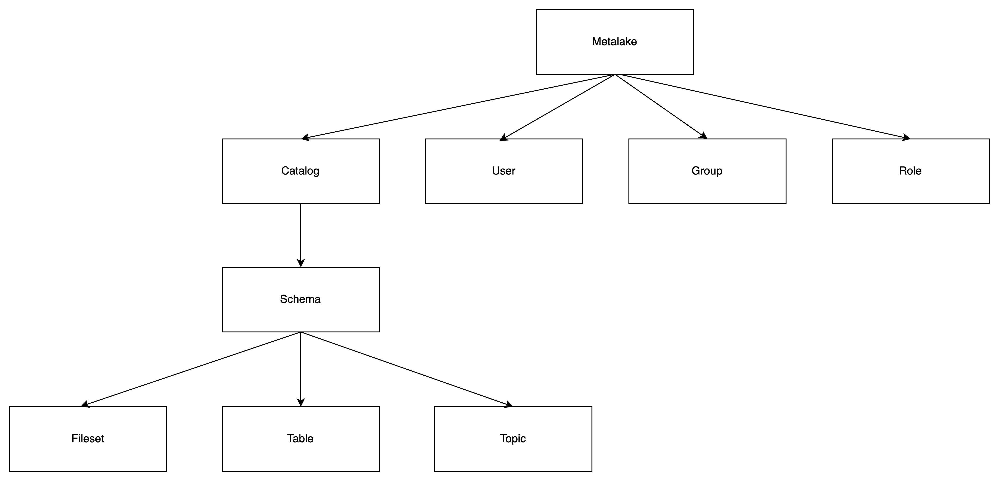
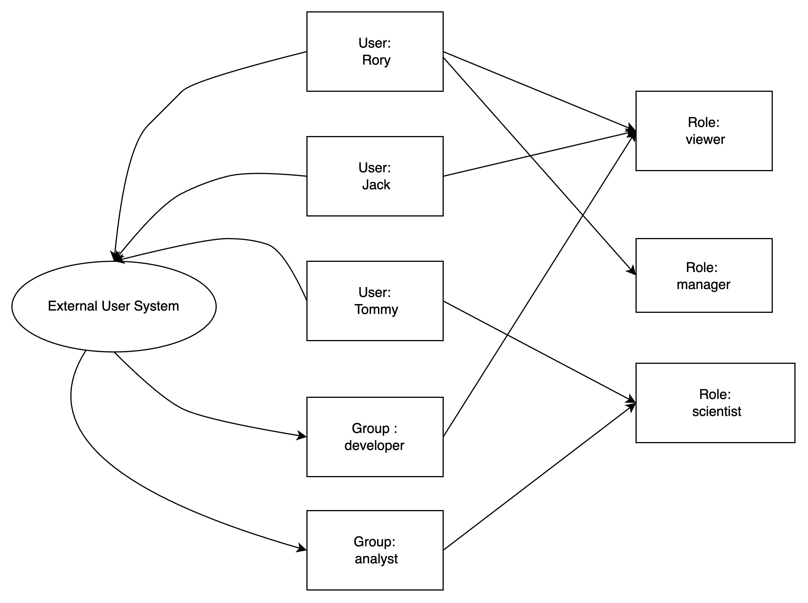
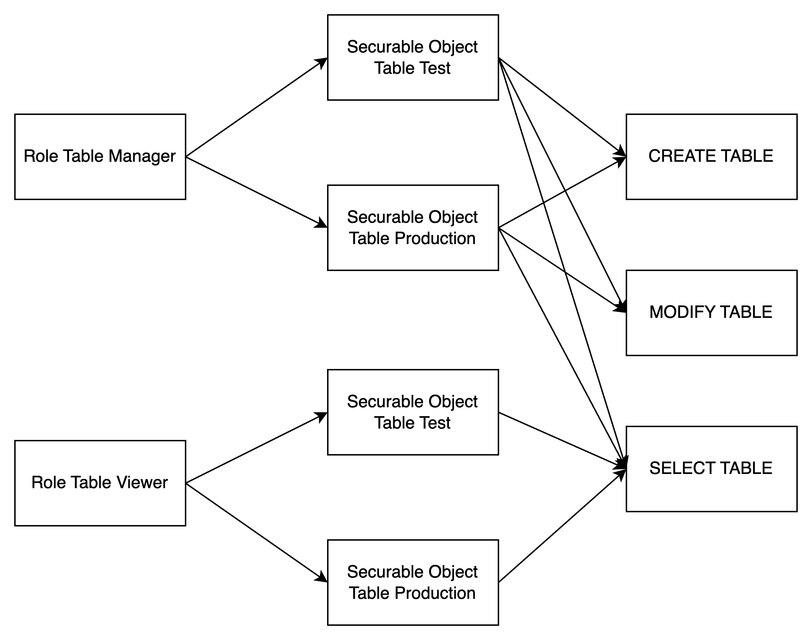
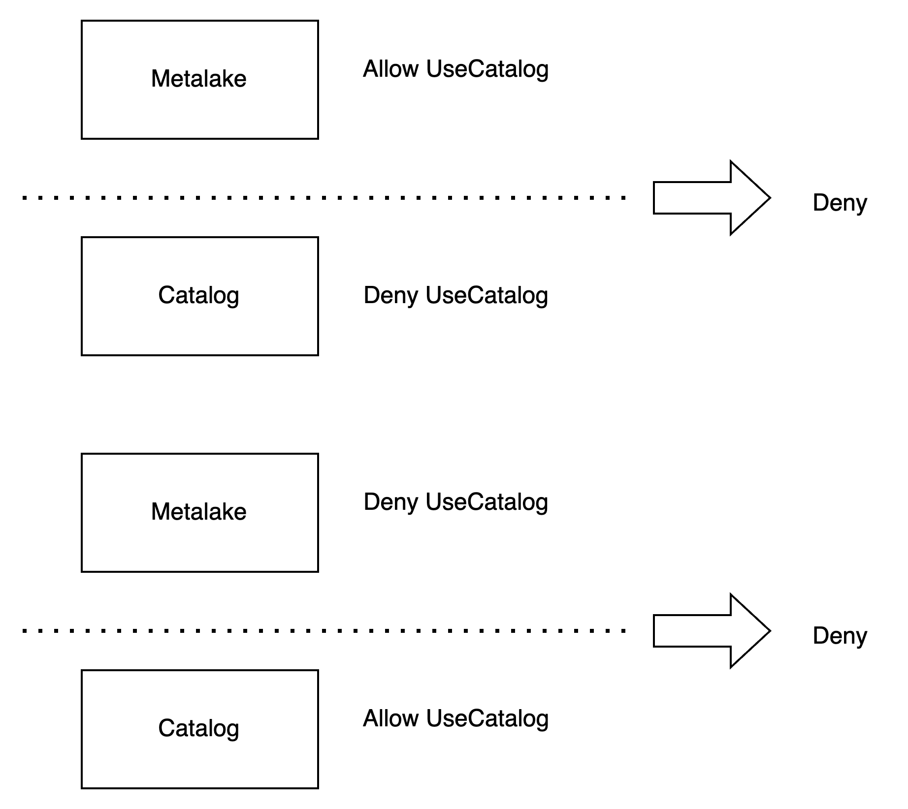
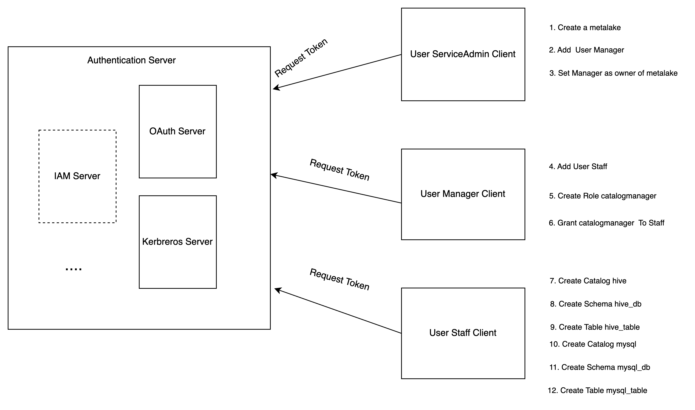

## Overview

Apache Gravitino is a technical data catalog that uses a unified metadata paradigm to manage multiple data sources while still allowing multiple engines like Spark, Trino, and Flink, or Python to connect to these data sources for data processing through Gravitino.

Because each underlying data source will have its own access control system, it can be difficult to plug in data engines with the intent of querying multiple of these data at once.
This is especially important for data governance practitioners who have to worry about data access restrictions and data compliance issues, but this is streamlined through Gravitino.
Therefore, in the hopes of solving this big data issue, Gravitino plans to implement a universal set of privilege models and paradigms.
With this, users will be able to manage all of their data sources on a single access plane, regardless of whether the data source is a database, or a message queue or an object storage system.

After authorizing these data sources within Gravitino’s metadata lake, authentication can then be performed in Spark, Trino, and Flink Engines, as well as our Python client.
This abstraction allows users to control access to data and make compliant use of the data without having to obstruct other teams and worrying about the tedious work of individual access control systems.

### Gravitino Privilege Model

Gravitino’s unified management model allows for each data source to have its own authorization features. However, each data source may come with its own dedicated authorization model and methods.
We may not be able to properly set permissions to the underlying system, so when a given user tries to access this data, the underlying authorization system may result in permission inconsistencies and cause issues for external access.
To mitigate this issue, Gravitino aims to provide a unified authorization model and accompanying methods that sit on top of all the data sources instead, making it much easier to manage access privileges.

It is important to note that Gravitino’s authorization model will not merge the access control systems of the underlying data sources to form a large and unwieldy set of privileges.
Instead, We will summarize the usage of the privileges currently in use within the data system, and offer a set of Gravitino-native privilege models that accurately reflect it.

This is so that when users and data engines use Gravitino for data processing, this permission model is used to address the complexity of managing access control for different data sources.
This set of permission models is meant to keep everything within the Gravitino system while still managing the access control settings of different data sources separately.

Gravitino adopts RBAC and DAC. 

Role-based Access Control (RBAC): Access privileges are assigned to roles, which are in turn assigned to users or groups.

Discretionary Access Control(DAC): Each metadata object has an owner, who can in turn grant access to that object.

:::info

Gravitino only supports authorization for securable objects, when Gravitino supports to pass the privileges to underlying authorization plugin.
Gravitino doesn't support metadata authentication. It means that Gravitino won't check the privileges when Gravitino receives the requests.

:::

## Concept

### Authorization

#### Build-in Authorization

Gravitino provides built-in metadata authorization. You can enable the built-in metadata authorization through the following configuration.

```
gravitino.authorization.enable = true
```

You can close the built-in metadata authorization through the following configuration.

```
gravitino.authorization.impl = org.apache.gravitino.server.authorization.PassThroughAuthorizer
```

:::info

Built-in metadata authorization depends on the authentication feature. To use the built-in metadata authorization, authentication must be enabled and privileges must be granted to users.You can see the privileges required for different REST APIs in the [API required conditions](##API required conditions).

:::

#### Authorization push down

Gravitino also provides a set of authorization frameworks to interact with different underlying data source
authorization systems (e.g., MySQL's own access control management and the Apache Ranger access control management system for big data)
in accordance with its own authorization model and methodology.
More information you can see the [Authorization push down](authorization-pushdown.md).

### Authentication

As mentioned above, Gravitino uses Ownership to control the privileges of securable object in the management category and uses Role to control access securable objects,
so when a user performs a specific operation on a specified resource,
Gravitino will perform a composite authentication on the Ownership and Role to which the securable object belongs.
When a user has more than one Role, Gravitino will use the user's all the Roles for authentication.

### Role

The traditional access control system generally uses RBAC (Role-Based Access Control) for access control management,
where each Role contains a collection of different operating privileges for a different securable object.
When the system adds a new user or user group, you can select the Roles which they are expected to be granted to,
so that the user can quickly start using it, without waiting for the administrator to gradually set up the access privileges to securable object for him.

Roles also employ the concept of ownership – the owner of a Role is by default the creator of the Role,
implying the owner has all the access control to operate the Role, including deleting the Role.

### Privilege

Privilege is a specific operation method for securable object, if you need to control fine-grained privileges on a securable object in the system,
then you need to design many different Privileges, however, too many Privileges will cause too complicated settings in the authorization.

If you only need to carry out coarse-grained privilege control on the securable object in the system, then you only need to design a small number of Privileges,
but it will result in too weak control ability when the authentication. Therefore, the design of Privilege is an important trade-off in the access control system.
We know that Privilege is generally divided into two types, one is the management category of Privilege, such as the `CREATE`, `DELETE` resource privilege,
and the other is the operation category of Privilege, such as the `READ` and `WRITE` resource privilege.

In most organizations, the number of data managers is much smaller than the number of data users.
Because it is the data users who need fine-grained privilege control,
we must provide more Privileges related to usage and more tightly gatekeeper the administrative Privileges.
To enforce this, we’ll introduce the concept of Ownership as a complete replacement for the administrative category of Privilege.

### Ownership

When you create a securable object (Gravitino Service, Metalake, Catalog, and any other entity) in Gravitino, each entity has an Owner field that defines the user (or group) to which the resource belongs.
The owner of each entity has implicit administrative class privilege, for example, to delete that securable object.
Only the Owner of a securable object can fully manage that resource.
If a securable object needs to be managed by more than one person at the same time, the owner is assigned to a user group.

The metadata object that supports ownership is as follows:

| Metadata Object Type |
|----------------------|
| Metalake             |
| Catalog              |
| Schema               |
| Table                |
| Topic                |
| Fileset              |
| Role                 |
| Model                |

### User
Users are generally granted one or multiple Roles, and users have different operating privileges depending on their Role.

### Group
To make it easier to grant a single access control to multiple users, we can add users to a user group, and then grant one or multiple roles to that user group.
This process allows all users belonging to that user group to have the access control in those roles.

### Metadata objects

Metadata objects are managed in Gravitino, such as `CATALOG`, `SCHEMA`, `TABLE`,
`COLUMN`, `FILESET`, `TOPIC`, `COLUMN`, `ROLE`, `METALAKE`. A metadata object is combined by a `type` and a
comma-separated `name`. For example, a `CATALOG` object has a name "catalog1" with type
"CATALOG", a `SCHEMA` object has a name "catalog1.schema1" with type "SCHEMA", a `TABLE`
object has a name "catalog1.schema1.table1" with type "TABLE". A `METALAKE` object has a name "metalake1".

### Securable objects

A metadata object to which access can be granted. Unless allowed by a grant, access is denied. 
Every securable object resides within a logical container in a hierarchy of containers.
The top container is the metalake. 
Catalogs are under the metalake. Catalogs represent different kinds of data sources.
Schemas are under the catalog. There are tables, topics, or filesets under the schema.



The relationship of the concepts is as below.




## The types of roles

### Service Admin

Service admin is only used for managing the metalakes. Usually, this role is for the maintainer of the service.

### Custom Roles

You can also create a dedicated role for your business by API or the client.

## The types of privileges

### User privileges

| Name         | Supports Securable Object | Operation           |
|--------------|---------------------------|---------------------|
| MANAGE_USERS | Metalake                  | Add or remove users |

### Group privileges

| Name          | Supports Securable Object | Operation            |
|---------------|---------------------------|----------------------|
| MANAGE_GROUPS | Metalake                  | Add or remove groups |

### Role privileges

| Name        | Supports Securable Object | Operation     |
|-------------|---------------------------|---------------|
| CREATE_ROLE | Metalake                  | Create a role |

### Permission privileges

| Name          | Supports Securable Object | Operation                                                                                                     |
|---------------|---------------------------|---------------------------------------------------------------------------------------------------------------|
| MANAGE_GRANTS | Metalake                  | Manages roles granted to or revoked from the user or group, and privilege granted to or revoked from the role |

### Catalog privileges

| Name           | Supports Securable Object | Operation        |
|----------------|---------------------------|------------------|
| CREATE_CATALOG | Metalake                  | Create a catalog |
| USE_CATALOG    | Metalake, Catalog         | Use a catalog    |

:::info

`USE_CATALOG` is needed for a user to interact with any object within the catalog. 

For example, to select data from a table, users need to have the `SELECT_TABLE` privilege on that table and
`USE_CATALOG` privileges on its parent catalog as well as `USE_SCHEMA` privileges on its parent schema.

:::

### Schema privileges

| Name          | Supports Securable Object | Operation       |
|---------------|---------------------------|-----------------|
| CREATE_SCHEMA | Metalake, Catalog         | Create a schema |
| USE_SCHEMA    | Metalake, Catalog, Schema | Use a schema    |

:::info

`USE_SCHEMA`is needed for a user to interact with any object within the schema. 

For example, to select data from a table, users need to have the `SELECT_TABLE` privilege on that table
and `USE_SCHEMA` privileges on its parent schema.

:::

### Table privileges

| Name         | Supports Securable Object         | Operation                                                                 |
|--------------|-----------------------------------|---------------------------------------------------------------------------|
| CREATE_TABLE | Metalake, Catalog, Schema         | Create a table                                                            |
| MODIFY_TABLE | Metalake, Catalog, Schema, Table  | Select data from a data, write data to a table or modify the table schema |
| SELECT_TABLE | Metalake, Catalog, Schema, Table  | Select data from a table                                                  |

DENY `MODIFY_TABLE` won't deny the `SELECT_TABLE` operation if the user has the privilege to `ALLOW SELECT_TABLE` on the table.
DENY `SELECT_TABLE` won‘t deny the `MODIFY_TABLE` operation if the user has the privilege `ALLOW MODIFY_TABLE` on the table. 

### Topic privileges

| Name          | Supports Securable Object        | Operation                                             |
|---------------|----------------------------------|-------------------------------------------------------|
| CREATE_TOPIC  | Metalake, Catalog, Schema        | Create a topic                                        |
| PRODUCE_TOPIC | Metalake, Catalog, Schema, Topic | Consume and produce a topic (including alter a topic) |
| CONSUME_TOPIC | Metalake, Catalog, Schema, Topic | Consume a topic                                       |

DENY `PRODUCE_TOPIC` won't deny the `COMSUME_TOPIC` operation if the user has the privilege to `ALLOW CONSUME_TOPIC` on the topic.
DENY `CONSUME_TOPIC` won‘t deny the `PRODUCE_TOPIC` operation if the user has the privilege `ALLOW PRODUCE_TOPIC` on the topic.

### Fileset privileges

| Name           | Supports Securable Object          | Operation                                            |
|----------------|------------------------------------|------------------------------------------------------|
| CREATE_FILESET | Metalake, Catalog, Schema          | Create a fileset                                     |
| WRITE_FILESET  | Metalake, Catalog, Schema, Fileset | Read and write a fileset (including alter a fileset) |
| READ_FILESET   | Metalake, Catalog, Schema, Fileset | Read a fileset                                       |

DENY `READ_FILESET` won't deny the `WRITE_FILESET` operation if the user has the privilege to `ALLOW WRITE_FILESET` on the fileset.
DENY `WRITE_FILESET` won‘t deny the `READ_FILESET` operation if the user has the privilege `ALLOW READ_FILESET` on the fileset.

### Model privileges

| Name                 | Supports Securable Object        | Operation                                                          |
|----------------------|----------------------------------|--------------------------------------------------------------------|
| CREATE_MODEL         | Metalake, Catalog, Schema        | Create a model                                                     |
| CREATE_MODEL_VERSION | Metalake, Catalog, Schema, Model | Create a model version                                             |
| USE_MODEL            | Metalake, Catalog, Schema, Model | View the metadata of the model and download all the model versions |

## Inheritance Model

Securable objects in Gravitino are hierarchical and privileges are inherited downward.

This means that granting a privilege on a metalake, catalog or schema automatically grants
the privilege to all current and future objects within the metalake, catalog or schema.

For example, if you give a use that `SELECT_TABLE` privilege on a catalog, then that the user
will be able to select(read) all tables in that catalog.

## Privilege Condition

The privilege supports two condition: `ALLOW` and `DENY`. `ALLOW` means that you are able to use the privilege,
`DENY` means that you aren't able to use the privilege.
`DENY` condition is prior to `ALLOW` condition. If a role has the `ALLOW` condition and `DENY` condition at the same time. 
The user won't be able to use the privilege.

If parent securable object has the same privilege name with different condition, the securable object won't override the parent object privilege.
For example, securable metalake object allows to use the catalog, but securable catalog denies to use the catalog, the user isn't able to use the catalog.
If securable metalake object denies to use the catalog, but securable catalog allows to use the catalog, the user isn't able to use the catalog, too.



## Server Configuration

If you want to enable the access control, you should enable the authorization.

The related configuration is as follows.

| Configuration item                       | Description                                                            | Default value | Required                         | Since Version |
|------------------------------------------|------------------------------------------------------------------------|---------------|----------------------------------|---------------|
| `gravitino.authorization.enable`         | Whether Gravitino enable authorization or not.                         | false         | No                               | 0.5.0         |
| `gravitino.authorization.serviceAdmins`  | The admins of Gravitino service, multiple admins are spitted by comma. | (none)        | Yes if enables the authorization | 0.5.0         |

:::info

If you enable authorization, you should add users to the metalake first, otherwise you will fail to create metadata objects.
If you don't set a user explicitly, you will use `anonymous` as the user.
When you enable authorization and create a metalake, the service will add the creator to the metalake automatically.

:::

## User Operation

### Add a user

You should add the user to your metalake before you use the authorization.

<Tabs groupId='language' queryString>
<TabItem value="shell" label="Shell">

```shell
curl -X POST -H "Accept: application/vnd.gravitino.v1+json" \
-H "Content-Type: application/json" -d '{
  "name": "user1"
}' http://localhost:8090/api/metalakes/test/users
```

</TabItem>
<TabItem value="java" label="Java">

```java
GravitinoClient client = ...
User user =
    client.addUser("user1");
```

</TabItem>
</Tabs>

### List users

You can list the created users in a metalake.
Returns the list of users if details is true, otherwise returns the list of user name.

<Tabs groupId='language' queryString>
<TabItem value="shell" label="Shell">

```shell
curl -X GET -H "Accept: application/vnd.gravitino.v1+json" \
-H "Content-Type: application/json" http://localhost:8090/api/metalakes/test/users/

curl -X GET -H "Accept: application/vnd.gravitino.v1+json" \
-H "Content-Type: application/json" http://localhost:8090/api/metalakes/test/users/?details=true
```

</TabItem>
<TabItem value="java" label="Java">

```java
GravitinoClient client = ...
String[] usernames = client.listUserNames();

User[] users = client.listUsers();
```

</TabItem>
</Tabs>

### Get a user

You can get a user by its name.

<Tabs groupId='language' queryString>
<TabItem value="shell" label="Shell">

```shell
curl -X GET -H "Accept: application/vnd.gravitino.v1+json" \
-H "Content-Type: application/json" http://localhost:8090/api/metalakes/test/users/user1
```

</TabItem>
<TabItem value="java" label="Java">

```java
GravitinoClient client = ...
User user =
    client.getUser("user1");
```

</TabItem>
</Tabs>

### Delete a user

You can delete a user by its name.

<Tabs groupId='language' queryString>
<TabItem value="shell" label="Shell">

```shell
curl -X DELETE -H "Accept: application/vnd.gravitino.v1+json" \
-H "Content-Type: application/json" http://localhost:8090/api/metalakes/test/users/user1
```

</TabItem>
<TabItem value="java" label="Java">

```java
GravitinoClient client = ...
boolean deleted =
    client.deleteUser("user1");
```

</TabItem>
</Tabs>

## Group Operation

### Add a Group

You should add the group to your metalake before you use the authorization.

<Tabs groupId='language' queryString>
<TabItem value="shell" label="Shell">

```shell
curl -X POST -H "Accept: application/vnd.gravitino.v1+json" \
-H "Content-Type: application/json" -d '{
  "name": "group1"
}' http://localhost:8090/api/metalakes/test/groups
```

</TabItem>
<TabItem value="java" label="Java">

```java
GravitinoClient client = ...
Group group =
    client.addGroup("group1");
```

</TabItem>
</Tabs>

### List groups

You can list the created groups in a metalake.
Returns the list of groups if details is true, otherwise returns the list of group name.

<Tabs groupId='language' queryString>
<TabItem value="shell" label="Shell">

```shell
curl -X GET -H "Accept: application/vnd.gravitino.v1+json" \
-H "Content-Type: application/json" http://localhost:8090/api/metalakes/test/groups/

curl -X GET -H "Accept: application/vnd.gravitino.v1+json" \
-H "Content-Type: application/json" http://localhost:8090/api/metalakes/test/groups/?details=true
```

</TabItem>
<TabItem value="java" label="Java">

```java
GravitinoClient client = ...
String[] usernames = client.listGroupNames();

User[] users = client.listGroups();
```

</TabItem>
</Tabs>

### Get a group

You can get a group by its name.

<Tabs groupId='language' queryString>
<TabItem value="shell" label="Shell">

```shell
curl -X GET -H "Accept: application/vnd.gravitino.v1+json" \
-H "Content-Type: application/json" http://localhost:8090/api/metalakes/test/groups/group1
```

</TabItem>
<TabItem value="java" label="Java">

```java
GravitinoClient client = ...
Group group =
    client.getGroup("group1");
```

</TabItem>
</Tabs>

### Delete a group

You can delete a group by its name.

<Tabs groupId='language' queryString>
<TabItem value="shell" label="Shell">

```shell
curl -X DELETE -H "Accept: application/vnd.gravitino.v1+json" \
-H "Content-Type: application/json" http://localhost:8090/api/metalakes/test/groups/group1
```

</TabItem>
<TabItem value="java" label="Java">

```java
GravitinoClient client = ...
boolean deleted =
    client.deleteGroup("group1");
```

</TabItem>
</Tabs>

## Role Operation

### Create a role

You can create a role by given properties.

<Tabs groupId='language' queryString>
<TabItem value="shell" label="Shell">

```shell
curl -X POST -H "Accept: application/vnd.gravitino.v1+json" \
-H "Content-Type: application/json" -d '{
   "name": "role1",
   "properties": {"k1": "v1"},
   "securableObjects": [
          {
             "fullName": "catalog1.schema1.table1",
             "type": "TABLE",
             "privileges": [
                    {
                         "name": "SELECT_TABLE",
                         "condition": "ALLOW"
                    }
             ]    
          }
   ]
}' http://localhost:8090/api/metalakes/test/roles
```

</TabItem>
<TabItem value="java" label="Java">

```java
GravitinoClient client = ...

SecurableObject securableObject =
    SecurableObjects.ofTable(
        SecurableObjects.ofSchema(
            SecurableObjects.ofCatalog("catalog1", Collections.emptyList()),
            "schema1",
            Collections.emptyList()),
        "table1",
        Lists.newArrayList(Privileges.SelectTable.allow()));
      
Role role =
    client.createRole("role1", ImmutableMap.of("k1", "v1"), Lists.newArrayList(securableObject));
```

</TabItem>
</Tabs>

### List roles

You can list the created roles in a metalake.

<Tabs groupId='language' queryString>
<TabItem value="shell" label="Shell">

```shell
curl -X GET -H "Accept: application/vnd.gravitino.v1+json" \
-H "Content-Type: application/json" http://localhost:8090/api/metalakes/test/roles/
```

</TabItem>
<TabItem value="java" label="Java">

```java
GravitinoClient client = ...
String[] usernames = client.listRoleNames();
```

</TabItem>
</Tabs>

### List roles for the metadata object

You can list the binding roles for a metadata object in a metalake.

The request path for REST API is `/api/metalakes/{metalake}/objects/{metadataObjectType}/{metadataObjectName}/roles`.

<Tabs groupId='language' queryString>
<TabItem value="shell" label="Shell">

```shell
curl -X GET -H "Accept: application/vnd.gravitino.v1+json" \
http://localhost:8090/api/metalakes/test/objects/catalog/catalog1/roles

curl -X GET -H "Accept: application/vnd.gravitino.v1+json" \
http://localhost:8090/api/metalakes/test/objects/schema/catalog1.schema1/roles
```

</TabItem>
<TabItem value="java" label="Java">

```java
Catalog catalog1 = ..
String[] roles = catalog1.supportsRoles().listBindingRoleNames();

Schema schema1 = ...
String[] roles = schema1.supportsRoles().listBindingRoleNames();
```

</TabItem>
</Tabs>

### Get a role

You can get a role by its name.

<Tabs groupId='language' queryString>
<TabItem value="shell" label="Shell">

```shell
curl -X GET -H "Accept: application/vnd.gravitino.v1+json" \
-H "Content-Type: application/json"  http://localhost:8090/api/metalakes/test/roles/role1
```

</TabItem>
<TabItem value="java" label="Java">

```java
GravitinoClient client = ...
Role role =
    client.getRole("role1");
```

</TabItem>
</Tabs>

### Delete a role

You can delete a role by its name.

<Tabs groupId='language' queryString>
<TabItem value="shell" label="Shell">

```shell
curl -X DELETE -H "Accept: application/vnd.gravitino.v1+json" \
-H "Content-Type: application/json" http://localhost:8090/api/metalakes/test/roles/role1
```

</TabItem>
<TabItem value="java" label="Java">

```java
GravitinoClient client = ...
boolean deleted =
    client.deleteRole("role1");
```

</TabItem>
</Tabs>

## Permission Operation

### Grant privileges to a role

You can grant specific privileges to a role.
The request path for REST API is `/api/metalakes/{metalake}/permissions/roles/{role}/{metadataObjectType}/{metadataObjectName}/grant`.

<Tabs groupId='language' queryString>
<TabItem value="shell" label="Shell">

```shell
curl -X PUT -H "Accept: application/vnd.gravitino.v1+json" \
-H "Content-Type: application/json" -d '{
    "privileges": [
      {
      "name": "SELECT_TABLE",
      "condition": "ALLOW"
      }]
}' http://localhost:8090/api/metalakes/test/permissions/roles/role1/schema/catalog1.schema1/grant

curl -X PUT -H "Accept: application/vnd.gravitino.v1+json" \
-H "Content-Type: application/json" -d '{
    "privileges": [
      {
      "name": "SELECT_TABLE",
      "condition": "ALLOW"
      }]
}' http://localhost:8090/api/metalakes/test/permissions/roles/role1/table/catalog1.schema1.table1/grant
```

</TabItem>
<TabItem value="java" label="Java">

```java
GravitinoClient client = ...

// Grant the privilege allowing `SELEC_TABLE` for the `schema` to `role1`        
MetadataObject schema = ...
Role role = client.grantPrivilegesToRole("role1", schema, Lists.newArrayList(Privileges.SelectTable.allow()));        

// Grant the privilege allowing `SELEC_TABLE` for the `table` to `role1`        
MetadataObject table = ...
Role role = client.grantPrivilegesToRole("role1", table, Lists.newArrayList(Privileges.SelectTable.allow()));
```
</TabItem>
</Tabs>

### Revoke privileges from a role

You can revoke specific privileges from a role.
The request path for REST API is `/api/metalakes/{metalake}/permissions/roles/{role}/{metadataObjectType}/{metadataObjectName}/revoke`.

<Tabs groupId='language' queryString>
<TabItem value="shell" label="Shell">

```shell
curl -X PUT -H "Accept: application/vnd.gravitino.v1+json" \
-H "Content-Type: application/json" -d '{
    "privileges": [
      {
      "name": "SELECT_TABLE",
      "condition": "ALLOW"
      }]
}' http://localhost:8090/api/metalakes/test/permissions/roles/role1/schema/catalog1.schema1/revoke

curl -X PUT -H "Accept: application/vnd.gravitino.v1+json" \
-H "Content-Type: application/json" -d '{
    "privileges": [
      {
      "name": "SELECT_TABLE",
      "condition": "ALLOW"
      }]
}' http://localhost:8090/api/metalakes/test/permissions/roles/role1/table/catalog1.schema1.table1/revoke
```

</TabItem>
<TabItem value="java" label="Java">

```java
GravitinoClient client = ...

// Revoke the privilege allowing `SELEC_TABLE` for the `schema` from `role1`         
MetadataObject schema = ...
Role role = client.revokePrivilegesFromRole("role1", schema, Lists.newArrayList(Privileges.SelectTable.allow()));

// Revoke the privilege allowing `SELEC_TABLE` for the `table` from `role1`         
MetadataObject table = ...
Role role = client.revokePrivilegesFromRole("role1", table, Lists.newArrayList(Privileges.SelectTable.allow()));

```
</TabItem>
</Tabs>

### Grant roles to a user

You can grant specific roles to a user.

<Tabs groupId='language' queryString>
<TabItem value="shell" label="Shell">

```shell
curl -X PUT -H "Accept: application/vnd.gravitino.v1+json" \
-H "Content-Type: application/json" -d '{
    "roleNames": ["role1"]
}' http://localhost:8090/api/metalakes/test/permissions/users/user1/grant
```

</TabItem>
<TabItem value="java" label="Java">

```java
GravitinoClient client = ...
User user = client.grantRolesToUser(Lists.newList("role1"), "user1");
```

</TabItem>
</Tabs>

### Revoke roles from a user

You can revoke specific roles from a user.

<Tabs groupId='language' queryString>
<TabItem value="shell" label="Shell">

```shell
curl -X PUT -H "Accept: application/vnd.gravitino.v1+json" \
-H "Content-Type: application/json" -d '{
    "roleNames": ["role1"]
}' http://localhost:8090/api/metalakes/test/permissions/users/user1/revoke
```

</TabItem>
<TabItem value="java" label="Java">

```java
GravitinoClient client = ...
User user = client.revokeRolesFromUser(Lists.newList("role1"), "user1");
```

</TabItem>
</Tabs>


### Grant roles to a group

You can grant specific roles to a group.

<Tabs groupId='language' queryString>
<TabItem value="shell" label="Shell">

```shell
curl -X PUT -H "Accept: application/vnd.gravitino.v1+json" \
-H "Content-Type: application/json" -d '{
    "roleNames": ["role1"]
}' http://localhost:8090/api/metalakes/test/permissions/groups/group1/grant
```

</TabItem>
<TabItem value="java" label="Java">

```java
GravitinoClient client = ...
Group group = client.grantRolesToGroup(Lists.newList("role1"), "group1");
```

</TabItem>
</Tabs>

### Revoke roles from a group

You can revoke specific roles from a group.

<Tabs groupId='language' queryString>
<TabItem value="shell" label="Shell">

```shell
curl -X PUT -H "Accept: application/vnd.gravitino.v1+json" \
-H "Content-Type: application/json" -d '{
    "roleNames": ["role1"]
}' http://localhost:8090/api/metalakes/test/permissions/groups/group1/revoke
```

</TabItem>
<TabItem value="java" label="Java">

```java
GravitinoClient client = ...
Group group = client.revokeRolesFromGroup(Lists.newList("role1"), "group1");
```

</TabItem>
</Tabs>

## Ownership Operation

### get the owner

You can get the owner of a metadata object.

<Tabs groupId='language' queryString>
<TabItem value="shell" label="Shell">

```shell
curl -X GET -H "Accept: application/vnd.gravitino.v1+json" \
-H "Content-Type: application/json" http://localhost:8090/api/metalakes/test/owners/table/catalog1.schema1.table1
```

</TabItem>
<TabItem value="java" label="Java">

```java
GravitinoClient client = ...

MetadataObject table =
        MetadataObjects.of(Lists.newArrayList("catalog1", "schema1", "table1"), MetadataObject.Type.TABLE);        

Owner owner = client.getOwner(table);
```

</TabItem>
</Tabs>

### set the owner

You can set the owner of a metadata object.

<Tabs groupId='language' queryString>
<TabItem value="shell" label="Shell">

```shell
curl -X PUT -H "Accept: application/vnd.gravitino.v1+json" \
-H "Content-Type: application/json" -d '{
    "name": "user1",
    "type": "USER"
}' http://localhost:8090/api/metalakes/test/owners/table/catalog1.schema1.table1
```

</TabItem>
<TabItem value="java" label="Java">

```java
GravitinoClient client = ...

MetadataObject table =
        MetadataObjects.of(Lists.newArrayList("catalog1", "schema1", "table1"), MetadataObject.Type.TABLE);        

client.setOwner(table, "user1", "USER");
```

</TabItem>
</Tabs>

## Example

You can follow the steps to achieve the authorization of Gravitino.



1. Service admin configures the Gravitino server to enable authorization and creates a metalake.

2. Service admin adds the user `Manager` to the metalake.

3. Service admin sets the `Manager` as the owner of the metalake.

4. `Manager` adds the user `Staff`.

5. `Manager` creates a specific role `catalog_manager` with `CREATE_CATALOG` privilege.

6. `Manager` grants the role `catalog_manager` to the user `Staff`.

7. `Staff` creates a Hive type catalog.

8. `Staff` creates a schema `hive_db` for Hive catalog.

9. `Staff` creates a table `hive_table` under the schema `hive_db`.

10. `Staff` creates a MySQL type catalog.

11. `Staff` creates a schema `mysql_db` for MySQL catalog.

12. `Staff` creates a table `mysql_table` under the schema `mysql_db`.

13. `Staff` can use Gravitino connector to query the tables from different catalogs.

## API required conditions

The following table lists the required privileges for each API.

| API                         | Required Conditions(s)                                                                                                                                                                                                                        |
|-----------------------------|-----------------------------------------------------------------------------------------------------------------------------------------------------------------------------------------------------------------------------------------------|
| create metalake             | The user must be the service admins, configured in the server configurations.                                                                                                                                                                 |
| load metalake               | The user is in the metalake                                                                                                                                                                                                                   |
| alter metalake              | The owner of the metalake                                                                                                                                                                                                                     |
| drop metalake               | The owner of the metalake                                                                                                                                                                                                                     | 
| create catalog              | `CREATE_CATALOG` on the metalake or the owner of the metalake                                                                                                                                                                                 |
| alter catalog               | The owner of the catalog, metalake                                                                                                                                                                                                            |
| drop catalog                | The owner of the catalog, metalake                                                                                                                                                                                                            |
| list catalog                | The owner of the metalake can see all the catalogs, others can see the catalogs which they can load                                                                                                                                           |
| load catalog                | The one of owners of the metalake, catalog or have `USE_CATALOG` on the metalake,catalog                                                                                                                                                      |
| create schema               | `CREATE_SCHEMA` and `USE_CATALOG` on the metalake, catalog or the owner of the metalake, catalog.                                                                                                                                             |
| alter schema                | First, you should have the privilege to load the catalog. Then, you are one of the owners of the schema, catalog, metalake                                                                                                                    |
| drop schema                 | First, you should have the privilege to load the catalog. Then, you are one of the owners of the schema, catalog, metalake                                                                                                                    |
| list schema                 | First, you should have the privilege to load the catalog. Then, the owner of the metalake, catalog can see all the schemas, others can see the schemas which they can load.                                                                   |
| load schema                 | First, you should have the privilege to load the catalog. Then, you are the owner of the metalake, catalog, schema or have `USE_SCHEMA` on the metalake, catalog, schema.                                                                     |
| create table                | First, you should have the privilege to load the catalog and the schema. `CREATE_TABLE` on the metalake, catalog, schema or the owner of the metalake, catalog, schema                                                                        |
| alter table                 | First, you should have the privilege to load the catalog and the schema. Then, you are one of the owners of the table, schema,catalog, metalake or have `MODIFY_TABLE` on the table, schema, catalog, metalake                                |
| drop table                  | First, you should have the privilege to load the catalog and the schema. Then, you are one of the owners of the table, schema, catalog, metalake                                                                                              |
| list table                  | First, you should have the privilege to load the catalog and the schema. Then, the owner of the schema, catalog, metalake can see all the tables, others can see the tables which they can load                                               |
| load table                  | First, you should have the privilege to load the catalog and the schema. Then, you are one of the owners of the table, schema, metalake, catalog or have either `SELECT_TABLE` or `MODIFY_TABLE` on the table, schema, catalog, metalake      |
| create topic                | First, you should have the privilege to load the catalog and the schema. Then, you have `CREATE_TOPIC` on the metalake, catalog, schema or are the owner of the metalake, catalog, schema                                                     |
| alter topic                 | First, you should have the privilege to load the catalog and the schema. Then, you are one of the owners of the topic, schema,catalog, metalake or have `PRODUCE_TOPIC` on the topic, schema, catalog, metalake                               |
| drop topic                  | First, you should have the privilege to load the catalog and the schema. Then, you are one of the owners of the topic, schema, catalog, metalake                                                                                              |
| list topic                  | First, you should have the privilege to load the catalog and the schema. Then, the owner of the schema, catalog, metalake can see all the topics, others can see the topics which they can load                                               |
| load topic                  | First, you should have the privilege to load the catalog and the schema. Then, you are one of the owners of the topic, schema, metalake, catalog or  have either `CONSUME_TOPIC` or `PRODUCE_TOPIC` on the topic, schema, catalog, metalake   |
| create fileset              | First, you should have the privilege to load the catalog and the schema. Then, you have`CREATE_FILESET` on the metalake, catalog, schema or are the owner of the metalake, catalog, schema                                                    |
| alter fileset               | First, you should have the privilege to load the catalog and the schema. Then, you are one of the owners of the fileset, schema,catalog, metalake or `WRITE_FILESET` on the fileset, schema, catalog, metalake                                |
| drop fileset                | First, you should have the privilege to load the catalog and the schema. Then, you are one of the owners of the fileset, schema, catalog, metalake                                                                                            |
| list fileset                | First, you should have the privilege to load the catalog and the schema. Then, you are one of the owners of the schema, catalog, metalake can see all the filesets, others can see the filesets which they can load                           |
| load fileset                | First, you should have the privilege to load the catalog and the schema. Then, you are one of the owners of the fileset, schema, metalake, catalog or have either `READ_FILESET` or `WRITE_FILESET` on the fileset, schema, catalog, metalake |
| list file                   | First, you should have the privilege to load the catalog and the schema. Then, you are one of the owners of the fileset, schema, metalake, catalog or have either `READ_FILESET` or `WRITE_FILESET` on the fileset, schema, catalog, metalake |
| register model              | First, you should have the privilege to load the catalog and the schema. Then, you have `CREATE_MODEL` on the metalake, catalog, schema or are the owner of the metalake, catalog, schema                                                     |
| link model version          | First, you should have the privilege to load the catalog, the schema and the model. Then, you have `CREATE_MODEL_VERSION` on the metalake, catalog, schema, model or are the owner of the metalake, catalog, schema, model                    |
| alter model                 | First, you should have the privilege to load the catalog and the schema. Then, you are one of the owners of the model, schema, catalog, metalake                                                                                              |
| drop model                  | First, you should have the privilege to load the catalog and the schema. Then, you are one of the owners of the model, schema, catalog, metalake                                                                                              |
| list model                  | First, you should have the privilege to load the catalog and the schema. Then the owner of the schema, catalog, metalake can see all the models, others can see the models which they can load                                                |
| load model                  | First, you should have the privilege to load the catalog and the schema. Then, you are one of the owners of the model, schema, metalake, catalog or have `USE_MODEL on the model, schema, catalog, metalake                                   |
| list model version          | First, you should have the privilege to load the catalog and the schema. Then, you are one of the owners of the model, schema, catalog, metalake or have `USE_MODEL on the model, schema, catalog, metalake                                   |
| load model version          | First, you should have the privilege to load the catalog and the schema. Then, you are one of the owners of the model, schema, metalake, catalog or have `USE_MODEL on the model, schema, catalog, metalake                                   |
| load model version by alias | First, you should have the privilege to load the catalog and the schema. Then, you are one of the owners of the model, schema, metalake, catalog or have `USE_MODEL on the model, schema, catalog, metalake                                   |
| delete model version        | First, you should have the privilege to load the catalog and the schema. Then, you are one of the owners of the model, schema, metalake, catalog.                                                                                             |
| alter model version         | First, you should have the privilege to load the catalog and the schema. Then, you are one of the owners of the model, schema, metalake, catalog.                                                                                             |
| delete model version alias  | First, you should have the privilege to load the catalog and the schema. Then, you are one of the owners of the model, schema, metalake, catalog.                                                                                             |
| add user                    | `MANAGE_USERS` on the metalake  or the owner of the metalake                                                                                                                                                                                  |
| delete user                 | `MANAGE_USERS` on the metalake  or the owner of the metalake                                                                                                                                                                                  |
| get user                    | `MANAGE_USERS` on the metalake  or the owner of the metalake or himself                                                                                                                                                                       |
| list users                  | `MANAGE_USERS` on the metalake  or the owner of the metalake can see all the users, others can see himself                                                                                                                                    |
| add group                   | `MANAGE_GROUPS` on the metalake or the owner of the metalake                                                                                                                                                                                  |
| delete group                | `MANAGE_GROUPS` on the metalake or the owner of the metalake                                                                                                                                                                                  |
| get group                   | `MANAGE_GROUPS` on the metalake or the owner of the metalake or his groups                                                                                                                                                                    |
| list groups                 | `MANAGE_GROUPS` on the metalake or the owner of the metalake can see all the groups, others can see his group                                                                                                                                 |
| create role                 | `CREATE_ROLE` on the metalake or the owner of the metalake                                                                                                                                                                                    |
| delete role                 | The owner of the metalake or the role                                                                                                                                                                                                         |
| get role                    | The owner of the metalake or the role. others can see his granted or owned roles.                                                                                                                                                             |
| list roles                  | The owner of the metalake can see all the roles. Others can see his granted roles or owned roles.                                                                                                                                             |
| grant role                  | `MANAGE_GRANTS` on the metalake                                                                                                                                                                                                               |
| revoke role                 | `MANAGE_GRANTS` on the metalake                                                                                                                                                                                                               |
| grant privilege             | `MANAGE_GRANTS` on the metalake or the owner of the securable object                                                                                                                                                                          |
| revoke privilege            | `MANAGE_GRANTS` on the metalake or the owner of the securable object                                                                                                                                                                          |
| set owner                   | The owner of the securable object                                                                                                                                                                                                             |

