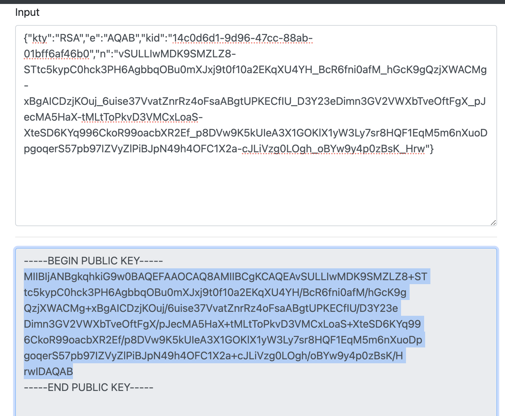

## Authentication

Apache Gravitino supports three kinds of authentication mechanisms: `simple`, `OAuth` and `Kerberos`.
If you don't enable authentication for your client and server explicitly,
you will be using user `anonymous` to access the server.

### Simple mode

In the `simple` mode, the client uses the environment variable `GRAVITINO_USER` as the user.
If the environment variable isn't set, the client uses the current OS user who sends requests.

For the client side, users can enable `simple` mode using the following code:

```java
GravitinoClient client = GravitinoClient.builder(uri)
    .withMetalake("mymetalake")
    .withSimpleAuth()
    .build();
```

Additionally, the username can be directly used as a parameter for creating  a client.

```java
GravitinoClient client = GravitinoClient.builder(uri)
    .withMetalake("mymetalake")
    .withSimpleAuth("my_user_name")
    .build();
```

### OAuth mode

Gravitino only supports external OAuth 2.0 servers.
To enable the `OAuth` mode, users should follow the steps below.

1. Make sure that an external OAuth 2.0 server is correctly configured to supports Bearer JWT.

1. On the server side, set `gravitino.authenticators` to `oauth`,
   and ensure the following options are properly set:

   - `gravitino.authenticator.oauth.defaultSignKey`
   - `gravitino.authenticator.oauth.serverUri`
   - `gravitino.authenticator.oauth.tokenPath`

1. From the client side, enable `OAuth` mode using the following code:

   ```java
   DefaultOAuth2TokenProvider authDataProvider = DefaultOAuth2TokenProvider.builder()
       .withUri("oauth server uri")
       .withCredential("yy:xx")
       .withPath("oauth/token")
       .withScope("test")
       .build();
   
   GravitinoClient client = GravitinoClient.builder(uri)
       .withMetalake("mymetalake")
       .withOAuth(authDataProvider)
       .build();
   ```

### Kerberos mode

To enable the `Kerberos` mode, users need to guarantee that
both the server and the client have the correct Kerberos configurations.
At the server side, users should set <tt>gravitino.authenticators</tt> to `kerberos`
and make sure the following options are properly set:

- `gravitino.authenticator.kerberos.principal`
- `gravitino.authenticator.kerberos.keytab`

At the client side, users can enable `kerberos` mode using the following code:

```java
// Use keytab to create KerberosTokenProvider
KerberosTokenProvider provider = KerberosTokenProvider.builder()
    .withClientPrincipal(clientPrincipal)
    .withKeyTabFile(new File(keytabFile))
    .build();

// Use ticketCache to create KerberosTokenProvider
KerberosTokenProvider provider = KerberosTokenProvider.builder()
    .withClientPrincipal(clientPrincipal)
    .build();        

GravitinoClient client = GravitinoClient.builder(uri)
    .withMetalake("mymetalake")
    .withKerberosAuth(provider)
    .build();
```

:::info
Now Iceberg REST service doesn't support Kerberos authentication.
The URI must use the hostname of server instead of IP.
:::

### Server configuration

<table>
<thead>
<tr>
  <th>Configuration item</th>
  <th>Description</th>
  <th>Default value</th>
  <th>Required</th>
  <th>Since version</th>
</tr>
</thead>
<tbody>
<tr>
  <td><tt>gravitino.authenticator</tt></td>
  <td>
    This option is deprecated since *Gravitino 0.6.0*. 
    Please use `gravitino.authenticators` instead.
  </td>
  <td>`simple`</td>
  <td>No</td>
  <td>`0.3.0`</td>
</tr>
<tr>
  <td><tt>gravitino.authenticators</tt></td>
  <td>
    The authenticator mode for Gravitino server.
    Valid values are `simple`, `oauth`, and `kerberos`.
    Multiple authenticators can be separated by commas.
    If a request is supported by multiple authenticators simultaneously,
    the first authenticator will be used by default.
  </td>
  <td>`simple`</td>
  <td>No</td>
  <td>`0.6.0-incubating`</td>
</tr>
<tr>
  <td><tt>gravitino.authenticator.oauth.serviceAudience</tt></td>
  <td>
    The audience name when Gravitino uses OAuth as the authenticator.
  </td>
  <td>`GravitinoServer`</td>
  <td>No</td>
  <td>`0.3.0`</td>
</tr>
<tr>
  <td><tt>gravitino.authenticator.oauth.allowSkewSecs</tt></td>
  <td>
    The JWT allows skew seconds when Gravitino uses OAuth as the authenticator.
  </td>
  <td>`0`</td>
  <td>No</td>
  <td>`0.3.0`</td>
</tr>
<tr>
  <td><tt>gravitino.authenticator.oauth.defaultSignKey</tt></td>
  <td>
    The signing key of JWT when Gravitino uses OAuth as the authenticator.

    This field is required if `oauth` mode is used.
  </td>
  <td>(none)</td>
  <td>Yes|No</td>
  <td>`0.3.0`</td>
</tr>
<tr>
  <td><tt>gravitino.authenticator.oauth.signAlgorithmType</tt></td>
  <td>
    The signature algorithm when Gravitino uses OAuth as the authenticator.
  </td>
  <td>`RS256`</td>
  <td>No</td>
  <td>`0.3.0`</td>
</tr>
<tr>
  <td><tt>gravitino.authenticator.oauth.serverUri</tt></td>
  <td>
    The URI of the default OAuth server.

    This field is required if `oauth` mode is used.
  </td>
  <td>(none)</td>
  <td>Yes|No</td>
  <td>`0.3.0`</td>
</tr>
<tr>
  <td><tt>gravitino.authenticator.oauth.tokenPath</tt></td>
  <td>
    The token path for the default OAuth server.

    This field is required if `oauth` mode is used.
  </td>
  <td>(none)</td>
  <td>Yes|No</td>
  <td>`0.3.0`</td>
</tr>
<tr>
  <td><tt>gravitino.authenticator.kerberos.principal</tt></td>
  <td>
    The Kerberos principal to be used for HTTP endpoint.
    A principal should start with `HTTP/`.

    This field is required if `kerberos` mode is used.
  </td>
  <td>(none)</td>
  <td>Yes|no</td>
  <td>`0.4.0`</td>
</tr>
<tr>
  <td><tt>gravitino.authenticator.kerberos.keytab</tt></td>
  <td>
    Location of the keytab file with the credentials for the principal.

    This field is required if `kerberos` mode is used.
  </td>
  <td>(none)</td>
  <td>Yes|No</td>
  <td>`0.4.0`</td>
</tr>
</tbody>
</table>

The signature algorithms that Gravitino supports follows:

<table>
<thead>
<tr>
  <th>Name</th>
  <th>Description</th>
</tr>
</thead>
<tbody>
<tr>
  <td>HS256</td>
  <td>HMAC using SHA-25A</td>
</tr>
<tr>
  <td>HS384</td>
  <td>HMAC using SHA-384</td>
</tr>
<tr>
  <td>HS512</td>
  <td>HMAC using SHA-51</td>
</tr>
<tr>
  <td>RS256</td>
  <td>RSASSA-PKCS-v1_5 using SHA-256</td>
</tr>
<tr>
  <td>RS384</td>
  <td>RSASSA-PKCS-v1_5 using SHA-384</td>
</tr>
<tr>
  <td>RS512</td>
  <td>RSASSA-PKCS-v1_5 using SHA-512</td>
</tr>
<tr>
  <td>ES256</td>
  <td>ECDSA using P-256 and SHA-256</td>
</tr>
<tr>
  <td>ES384</td>
  <td>ECDSA using P-384 and SHA-384</td>
</tr>
<tr>
  <td>ES512</td>
  <td>ECDSA using P-521 and SHA-512</td>
</tr>
<tr>
  <td>PS256</td>
  <td>RSASSA-PSS using SHA-256 and MGF1 with SHA-256</td>
</tr>
<tr>
  <td>PS384</td>
  <td>RSASSA-PSS using SHA-384 and MGF1 with SHA-384</td>
</tr>
<tr>
  <td>PS512</td>
  <td>RSASSA-PSS using SHA-512 and MGF1 with SHA-512</td>
</tr>
</tbody>
</table>

### Example

You can follow the steps to set up an OAuth mode Gravitino server.

1. Prerequisite

   You need to install the JDK8 and Docker.

1. Set up an external OAuth 2.0 server

   There is a sample-authorization-server based on
   [spring-authorization-server](https://github.com/spring-projects/spring-authorization-server/tree/1.0.3).
   The image has registered client information in the external OAuth 2.0 server
   and its clientId is `test`, secret is `test`, scope is `test`.

   ```shell
   docker run -d -p 8177:8177 --name sample-auth-server \
     datastrato/sample-authorization-server:0.3.0
   ```

1. Open [the JWK URL of the Authorization server](http://localhost:8177/oauth2/jwks)
   in the browser and you can get the JWK.

   

1. Convert the JWK to PEM.
   You can use the [online tool](https://8gwifi.org/jwkconvertfunctions.jsp#google_vignette)
   or other tools.

   

1. Copy the public key and remove the character `\n`.
   You can get the default signing key of Gravitino server.

1. You can refer to the [Configurations](../admin/server-config.md)
   and append the configurations to the `conf/gravitino.conf` file.

   ```text
   gravitino.authenticators = oauth
   gravitino.authenticator.oauth.serviceAudience = test
   gravitino.authenticator.oauth.defaultSignKey = <the default signing key>
   gravitino.authenticator.oauth.tokenPath = /oauth2/token
   gravitino.authenticator.oauth.serverUri = http://localhost:8177
   ```

1. Open [the URL of Gravitino server](http://localhost:8090) and login in
   with clientId `test`, clientSecret `test`, and scope `test`.

   

1. You can also use the curl command to access Gravitino.

   Get access token:

   ```shell
   curl --location -X POST \
     http://127.0.0.1:8177/oauth2/token?grant_type=client_credentials&client_id=test&client_secret=test&scope=test
   ```

   Use the access token to request the Gravitino

   ```shell
   curl -v -X GET \
     -H "Accept: application/vnd.gravitino.v1+json" \
     -H "Authorization: Bearer <access_token>" \
     http://localhost:8090/api/version
   ```

