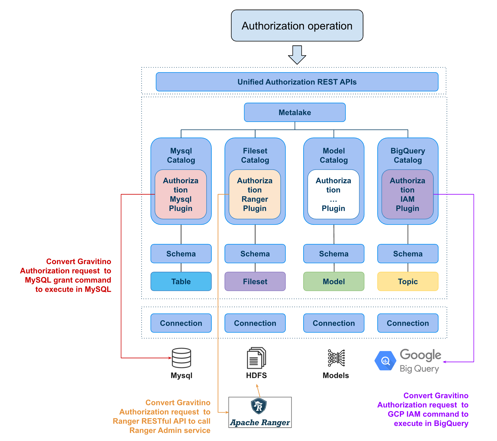

## Authorization Push-down



Gravitino offers a set of authorization frameworks that integrate with various underlying data source permission systems, such as MySQL's native permission management and Apache Ranger for big data. These frameworks align with Gravitino's own authorization model and methodology.
Gravitino manages different data sources through Catalogs, and when a user performs an authorization operation on data within a Catalog, Gravitino invokes the Authorization Plugin module for that Catalog.
This module translates Gravitino's authorization model into the permission rules of the underlying data source. The permissions are then enforced by the underlying permission system via the respective client, such as JDBC or the Apache Ranger client.

### Authorization Hive with Ranger properties

In order to use the Authorization Ranger Hive Plugin, you need to configure the following properties and [Apache Hive catalog properties](../apache-hive-catalog.md#catalog-properties):

| Property Name                       | Description                                                                                                                                          | Default Value | Required | Since Version    |
|-------------------------------------|------------------------------------------------------------------------------------------------------------------------------------------------------|---------------|----------|------------------|
| `authorization-provider`            | Providers to use to implement authorization plugin such as `ranger`.                                                                                 | (none)        | No       | 0.6.0-incubating |
| `authorization.ranger.admin.url`    | The Apache Ranger web URIs.                                                                                                                          | (none)        | No       | 0.6.0-incubating |
| `authorization.ranger.auth.type`    | The Apache Ranger authentication type `simple` or `kerberos`.                                                                                        | `simple`      | No       | 0.6.0-incubating |
| `authorization.ranger.username`     | The Apache Ranger admin web login username (auth type=simple), or kerberos principal(auth type=kerberos), Need have Ranger administrator permission. | (none)        | No       | 0.6.0-incubating |
| `authorization.ranger.password`     | The Apache Ranger admin web login user password (auth type=simple), or path of the keytab file(auth type=kerberos)                                   | (none)        | No       | 0.6.0-incubating |
| `authorization.ranger.service.name` | The Apache Ranger service name.                                                                                                                      | (none)        | No       | 0.6.0-incubating |

Once you have used the correct configuration, you can perform authorization operations by calling Gravitino [authorization RESTful API](https://gravitino.apache.org/docs/latest/api/rest/grant-roles-to-a-user).

#### Example of using the Authorization Ranger Hive Plugin

Suppose you have an Apache Hive service in your datacenter and have created a `hiveRepo` in Apache Ranger to manage its permissions.
The Ranger service is accessible at `172.0.0.100:6080`, with the username `Jack` and the password `PWD123`.
To add this Hive service to Gravitino using the Hive catalog, you'll need to configure the following parameters.

```properties
authorization-provider=ranger
authorization.ranger.admin.url=172.0.0.100:6080
authorization.ranger.auth.type=simple
authorization.ranger.username=Jack
authorization.ranger.password=PWD123
authorization.ranger.service.name=hiveRepo
```

:::caution
Gravitino 0.6.0 only supports the authorization Apache Ranger Hive service and more data source authorization is under development.
:::