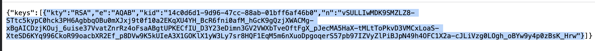
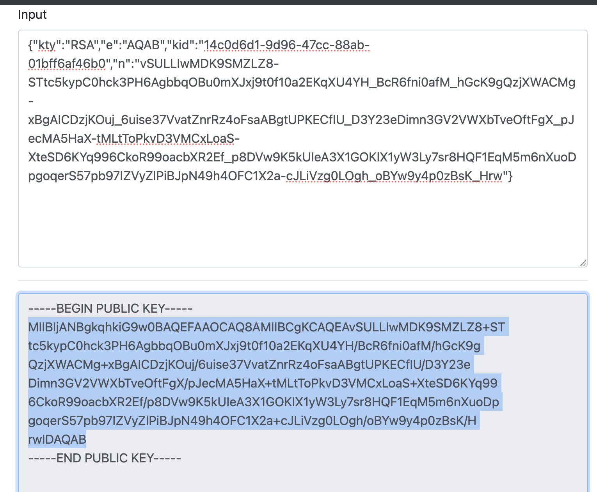
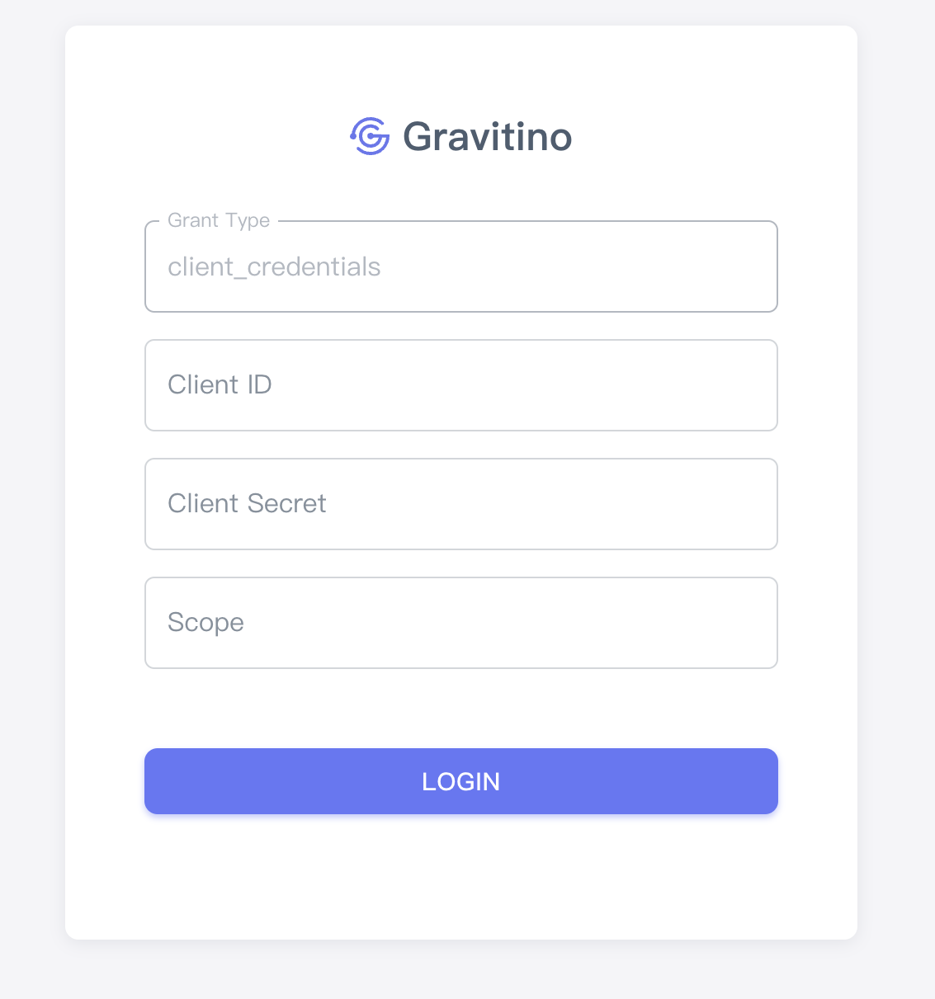
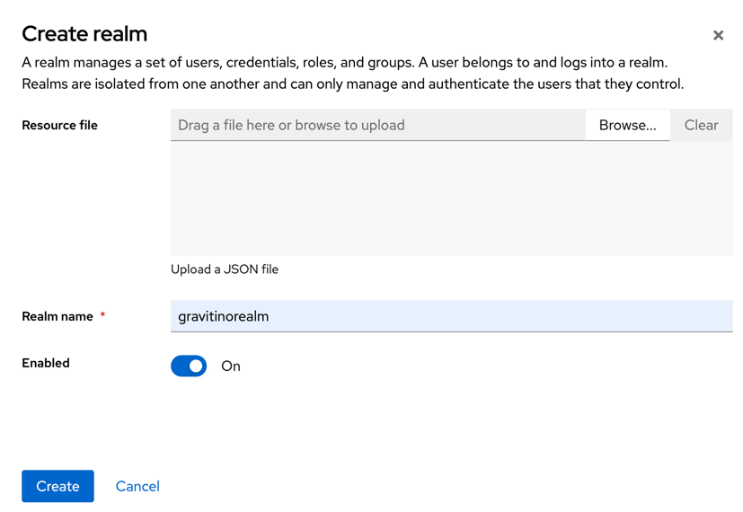
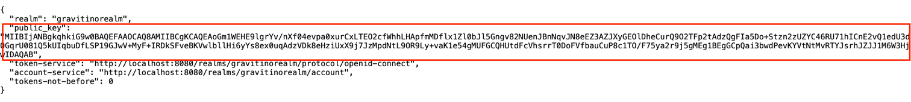
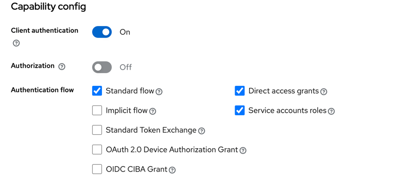

## Authentication

Apache Gravitino supports three kinds of authentication mechanisms: simple, OAuth and Kerberos.
If you don't enable authentication for your client and server explicitly, the user `anonymous` will be used to access the server.

### Simple mode

In simple mode, the client uses the value of the `GRAVITINO_USER` environment variable as the username.
If the environment variable `GRAVITINO_USER` in the client isn't set, the client defaults to the username of the user logged into the machine sending the requests.

For the client side, users can enable `simple` mode by the following code:

```java
GravitinoClient client = GravitinoClient.builder(uri)
    .withMetalake("metalake")
    .withSimpleAuth()
    .build();
```

Additionally, the username can be directly used as a parameter to create a client.

```java
GravitinoClient client = GravitinoClient.builder(uri)
    .withMetalake("metalake")
    .withSimpleAuth("test_user_name")
    .build();
```

### OAuth mode

Gravitino supports external OAuth 2.0 servers with two token validation methods:

1. **Static signing key validation** - Uses a pre-configured signing key to validate JWT tokens
2. **JWKS-based validation** - Dynamically fetches public keys from OAuth provider's JWKS endpoint (supports OIDC providers like Azure AD, and other JWKS-compatible providers)

To enable OAuth mode:

- First, ensure the external OAuth 2.0 server supports Bearer JWT tokens.
- For **static key validation**: Configure `gravitino.authenticator.oauth.defaultSignKey`, `gravitino.authenticator.oauth.serverUri` and `gravitino.authenticator.oauth.tokenPath`.
- For **JWKS validation**: Configure `gravitino.authenticator.oauth.jwksUri` and `gravitino.authenticator.oauth.tokenValidatorClass=org.apache.gravitino.server.authentication.JwksTokenValidator`. You can use either `gravitino.authenticator.oauth.provider=default` or `gravitino.authenticator.oauth.provider=oidc` depending on whether you want Web UI OIDC login flow.
- For **Web UI OIDC authentication**: Set `gravitino.authenticator.oauth.provider=oidc` and configure `gravitino.authenticator.oauth.clientId`, `gravitino.authenticator.oauth.authority`, and `gravitino.authenticator.oauth.scope`. These settings are exposed to the Web UI via the `/configs` endpoint to enable OAuth login flow. Configure your OAuth provider with the callback redirect URI: `https://your-gravitino-server/ui/oauth/callback`.
- Next, for the client side, users can enable `OAuth` mode by the following code:

```java
DefaultOAuth2TokenProvider authDataProvider = DefaultOAuth2TokenProvider.builder()
    .withUri("oauth server uri")
    .withCredential("yy:xx")
    .withPath("oauth/token")
    .withScope("test")
    .build();

GravitinoClient client = GravitinoClient.builder(uri)
    .withMetalake("metalake")
    .withOAuth(authDataProvider)
    .build();
```

### Kerberos mode

To enable Kerberos mode, users must ensure that the server and client have the correct Kerberos configuration. On the server side, users should set `gravitino.authenticators` as `kerberos` and give
`gravitino.authenticator.kerberos.principal` and `gravitino.authenticator.kerberos.keytab` a proper value. For the client side, users can enable `kerberos` mode by the following code:

```java
// Use keytab to create KerberosTokenProvider
KerberosTokenProvider provider = KerberosTokenProvider.builder()
        .withClientPrincipal(clientPrincipal)
        .withKeyTabFile(new File(keytabFile))
        .build();

// Use ticketCache to create KerberosTokenProvider
KerberosTokenProvider provider = KerberosTokenProvider.builder()
        .withClientPrincipal(clientPrincipal)
        .build();        

GravitinoClient client = GravitinoClient.builder(uri)
    .withMetalake("metalake")
    .withKerberosAuth(provider)
    .build();
```

:::info
Currently, the Iceberg REST service does not support Kerberos authentication.
The URI must be the server's hostname instead of its IP address.
:::

### Custom mode

Gravitino also supports custom authentication implementations.
For server side, you can implement the interface `Authenticator` and specify `gravitino.authenciators`.
For client side, you extend the abstract class `CustomTokenProvider` and specify the token provider.

```java
GravitinoClient client = GravitinoClient.builder(uri)
    .withMetalake("metalake")
    .withCustomProvider(provider)
    .build();
```

### Server configuration

| Configuration item                                | Description                                                                                                                                                                                                                                                | Default value     | Required                                   | Since version    |
|---------------------------------------------------|------------------------------------------------------------------------------------------------------------------------------------------------------------------------------------------------------------------------------------------------------------|-------------------|--------------------------------------------|------------------|
| `gravitino.authenticator`                         | It is deprecated since Gravitino 0.6.0. Please use `gravitino.authenticators` instead.                                                                                                                                                                     | `simple`          | No                                         | 0.3.0            |
| `gravitino.authenticators`                        | The authenticators which Gravitino uses, setting as `simple`,`oauth` or `kerberos`. Multiple authenticators are separated by commas. If a request is supported by multiple authenticators simultaneously, the first authenticator will be used by default. | `simple`          | No                                         | 0.6.0-incubating |
| `gravitino.authenticator.oauth.serviceAudience`   | The audience name when Gravitino uses OAuth as the authenticator.                                                                                                                                                                                          | `GravitinoServer` | No                                         | 0.3.0            |
| `gravitino.authenticator.oauth.allowSkewSecs`     | The JWT allows skew seconds when Gravitino uses OAuth as the authenticator.                                                                                                                                                                                | `0`               | No                                         | 0.3.0            |
| `gravitino.authenticator.oauth.defaultSignKey`    | The signing key of JWT when Gravitino uses OAuth as the authenticator.                                                                                                                                                                                     | (none)            | Yes if use `oauth` as the authenticator    | 0.3.0            |
| `gravitino.authenticator.oauth.signAlgorithmType` | The signature algorithm when Gravitino uses OAuth as the authenticator.                                                                                                                                                                                    | `RS256`           | No                                         | 0.3.0            |
| `gravitino.authenticator.oauth.serverUri`         | The URI of the default OAuth server.                                                                                                                                                                                                                       | (none)            | Yes if use `oauth` as the authenticator    | 0.3.0            |
| `gravitino.authenticator.oauth.tokenPath`         | The path for token of the default OAuth server.                                                                                                                                                                                                            | (none)            | Yes if use `oauth` as the authenticator    | 0.3.0            |
| `gravitino.authenticator.oauth.provider`           | OAuth provider type (default, oidc). Determines the Web UI authentication flow. Use 'oidc' for Web UI OIDC login, 'default' for legacy login or API-only authentication.                                   | `default`         | No                                         | 1.0.0            |
| `gravitino.authenticator.oauth.clientId`           | OAuth client ID for Web UI authentication.                                                                                                                                                                    | (none)            | Yes if provider is `oidc`                 | 1.0.0            |
| `gravitino.authenticator.oauth.authority`          | OAuth authority/issuer URL for OIDC providers for web UI authentication. (e.g., Azure AD tenant URL).                                                                                                                                   | (none)            | Yes if provider is `oidc`                 | 1.0.0            |
| `gravitino.authenticator.oauth.scope`              | OAuth scopes for Web UI authentication (space-separated).                                                                                                                                                      | (none)            | Yes if provider is `oidc`                 | 1.0.0            |
| `gravitino.authenticator.oauth.jwksUri`            | JWKS URI for server-side OAuth token validation. Required when using JWKS-based validation.                                                                                                                                                               | (none)            | Yes if `tokenValidatorClass` is `org.apache.gravitino.server.authentication.JwksTokenValidator` | 1.0.0            |
| `gravitino.authenticator.oauth.principalFields`     | JWT claim field(s) to use as principal identity. Comma-separated list for fallback in order (e.g., 'preferred_username,email,sub').                                                                                                                       | `sub`             | No                                         | 1.0.0            |
| `gravitino.authenticator.oauth.tokenValidatorClass`| Fully qualified class name of the OAuth token validator implementation. Use `org.apache.gravitino.server.authentication.JwksTokenValidator` for JWKS-based validation or `org.apache.gravitino.server.authentication.StaticSignKeyValidator` for static key validation. | `org.apache.gravitino.server.authentication.StaticSignKeyValidator` | No | 1.0.0 |
| `gravitino.authenticator.kerberos.principal`      | Indicates the Kerberos principal to be used for HTTP endpoint. Principal should start with `HTTP/`.                                                                                                                                                        | (none)            | Yes if use `kerberos` as the authenticator | 0.4.0            |
| `gravitino.authenticator.kerberos.keytab`         | Location of the keytab file with the credentials for the principal.                                                                                                                                                                                        | (none)            | Yes if use `kerberos` as the authenticator | 0.4.0            |

The signature algorithms that Gravitino supports follows:

| Name  | Description                                    |
|-------|------------------------------------------------|
| HS256 | HMAC using SHA-25A                             |
| HS384 | HMAC using SHA-384                             |
| HS512 | HMAC using SHA-51                              |
| RS256 | RSASSA-PKCS-v1_5 using SHA-256                 |
| RS384 | RSASSA-PKCS-v1_5 using SHA-384                 |
| RS512 | RSASSA-PKCS-v1_5 using SHA-512                 |
| ES256 | ECDSA using P-256 and SHA-256                  |
| ES384 | ECDSA using P-384 and SHA-384                  |
| ES512 | ECDSA using P-521 and SHA-512                  |
| PS256 | RSASSA-PSS using SHA-256 and MGF1 with SHA-256 |
| PS384 | RSASSA-PSS using SHA-384 and MGF1 with SHA-384 |
| PS512 | RSASSA-PSS using SHA-512 and MGF1 with SHA-512 |

### Example: Azure AD as OIDC Provider with JWKS Validation

This example shows how to configure Gravitino with Azure AD using JWKS-based token validation.

**Prerequisites:**
- Azure AD tenant with an application registration
- Application configured with:
  - Client ID (Application ID)
  - Redirect URI: `https://your-gravitino-server/ui/oauth/callback`
  - Required API permissions/scopes (typically `openid`, `profile`, `email`)

**Configuration:**

```text
# Enable OAuth authentication
gravitino.authenticators = oauth

# OIDC Provider Configuration for Web UI
gravitino.authenticator.oauth.provider = oidc
gravitino.authenticator.oauth.clientId = <your-azure-app-client-id>
gravitino.authenticator.oauth.authority = https://sts.windows.net/<your-tenant-id>/
gravitino.authenticator.oauth.scope = openid profile email

# JWKS-based Token Validation
gravitino.authenticator.oauth.jwksUri = https://login.microsoftonline.com/<your-tenant-id>/discovery/v2.0/keys
gravitino.authenticator.oauth.tokenValidatorClass = org.apache.gravitino.server.authentication.JwksTokenValidator
gravitino.authenticator.oauth.serviceAudience = <your-azure-app-client-id-or-api-identifier>
gravitino.authenticator.oauth.principalFields = preferred_username,email,sub
```

**Usage:**
- **Web UI**: Navigate to Gravitino Web UI, which will redirect to Azure AD for authentication
- **API Access**: Use Azure AD tokens in the `Authorization: Bearer <token>` header

:::note
The `serviceAudience` should match the `aud` claim in your Azure AD tokens. This is typically your Azure AD application's client ID, but could be a custom API identifier if you've configured custom API scopes (e.g., `api://<client-id>`).

The `principalFields` supports multiple fallback options. Gravitino will try each field in order (e.g., first `preferred_username`, then `email`, then `sub`) until it finds a non-null value to use as the user identity.

With JWKS validation, you don't need to configure `defaultSignKey`, `serverUri`, or `tokenPath` as the validator dynamically fetches public keys from Azure AD's JWKS endpoint.
:::

### Example: Static Key OAuth Provider

For compatibility with existing OAuth servers that don't support JWKS:

```text
gravitino.authenticators = oauth
gravitino.authenticator.oauth.provider = default
gravitino.authenticator.oauth.clientId = test
gravitino.authenticator.oauth.scope = test
gravitino.authenticator.oauth.serviceAudience = test
gravitino.authenticator.oauth.tokenValidatorClass = org.apache.gravitino.server.authentication.StaticSignKeyValidator
gravitino.authenticator.oauth.serverUri = http://your-oauth-server
gravitino.authenticator.oauth.tokenPath = /oauth2/token
gravitino.authenticator.oauth.defaultSignKey = <your-static-signing-key>
```

### Example: JWKS Validation with Default Provider

For JWKS-based token validation without Web UI OIDC workflow:

```text
gravitino.authenticators = oauth
gravitino.authenticator.oauth.provider = default
gravitino.authenticator.oauth.serviceAudience = <your-audience>
gravitino.authenticator.oauth.tokenValidatorClass = org.apache.gravitino.server.authentication.JwksTokenValidator
gravitino.authenticator.oauth.jwksUri = https://your-oauth-provider/.well-known/jwks.json
```

### Example 

You can follow the steps to set up an OAuth mode Gravitino server.

1. Prerequisite

   You need to install the JDK8 and Docker.

2. Set up an external OAuth 2.0 server

   There is a sample-authorization-server based on [spring-authorization-server](https://github.com/spring-projects/spring-authorization-server/tree/1.0.3). The image has registered client information in the external OAuth 2.0 server
   and its clientId is `test`, secret is `test`, scope is `test`.

```shell
 docker run -p 8177:8177 --name sample-auth-server -d datastrato/sample-authorization-server:0.3.0
```

3. Open [the JWK URL of the Authorization server](http://localhost:8177/oauth2/jwks) in the browser and you can get the JWK.

   

4. Convert the JWK to PEM. You can use the [online tool](https://8gwifi.org/jwkconvertfunctions.jsp#google_vignette) or other tools.

   

5. Copy the public key and remove the character `\n` and you can get the default signing key of Gravitino server.

6. Refer to the [Configurations](../gravitino-server-config.md) and append the configurations to the conf/gravitino.conf.

```text
gravitino.authenticators = oauth
gravitino.authenticator.oauth.serviceAudience = test
gravitino.authenticator.oauth.defaultSignKey = <the default signing key>
gravitino.authenticator.oauth.tokenPath = /oauth2/token
gravitino.authenticator.oauth.serverUri = http://localhost:8177
```

7. Open [the URL of Gravitino server](http://localhost:8090) and login in with clientId `test`, clientSecret `test`, and scope `test`.

   

8. You can also use the curl command to access Gravitino.

Get access token

```shell
curl --location --request POST 'http://127.0.0.1:8177/oauth2/token?grant_type=client_credentials&client_id=test&client_secret=test&scope=test'
```

Use the access token to request the Gravitino

```shell
curl -v -X GET -H "Accept: application/vnd.gravitino.v1+json" -H "Content-Type: application/json" -H "Authorization: Bearer <access_token>" http://localhost:8090/api/version
```

### Example: Keycloak as OAuth providers

1. Set up an external Keycloak server, you can refer to [Keycloak document](https://www.keycloak.org/getting-started/getting-started-docker)

```shell
docker run -dti -p 8080:8080 -e KC_BOOTSTRAP_ADMIN_USERNAME=admin -e KC_BOOTSTRAP_ADMIN_PASSWORD=admin quay.io/keycloak/keycloak:26.2.5 start-dev
```

2. Go to the [Keycloak admin console](http://localhost:8080/), log in with the initial admin user with the username `admin` and password `admin`

3. Create a realm for Gravitino
   * Click *Manage realms* in the left-hand menu.
   * Click *Create realm* button

    

4. Get the `gravitinorealm` public key, which is the <the default signing key> in gravitino.conf
   Access `http://localhost:8080/realms/gravitinorealm` in browser

   

5. Add users

    Initially, the realm has no users. Use these steps to create a user:
   * Verify that you are still in the gravitinorealm realm, which is next to *Current realm*.
   * Click Users in the left-hand menu.
   * Click *Create new user*.
   * Fill in the form with the following values:  
   *Username*: usera, *First name*: any first name, *Last name*: any last name, *Email*: any email
   * Click *credentials*, fill in the *Set password form* with a password.
   * Toggle Temporary to Off so that the user does not need to update this password at the first login.

    You can now log in to the [Account Console(gravitinorealm)](http://localhost:8080/realms/gravitinorealm/account) to verify this user is configured correctly.

6. Register Gravitino in Keycloak

   * Click *gravitinorealm* next to *Current realm*.
   *  Click *Clients*.
   *  Click *Create client*
   *  Fill in *Client type*: `OpenID Connect` *Client ID*: `gravitino-client`
   *  Click *Next*
   *  Confirm that `Client authentication` `Standard flow` `Direct access grants` `Service accounts roles` is enabled.
   *  Click *Next*
   *  Set *Valid redirect URIs* to `http://localhost:8090/*`
   *  Set *Web origins* to `http://localhost:8090`
   *  Click *Save*.
   *  Click *Credentials* tab page, get `Client Secret`. 

   

7. You can refer to the [Configurations](../gravitino-server-config.md) and append the configurations to the conf/gravitino.conf.

```text
gravitino.authenticators = oauth
gravitino.authenticator.oauth.serviceAudience = account
gravitino.authenticator.oauth.defaultSignKey = <the default signing key>
gravitino.authenticator.oauth.tokenPath = /realms/gravitinorealm/protocol/openid-connect/token
gravitino.authenticator.oauth.serverUri = http://localhost:8080
```

8. Use client credentials to authenticate. The `access token` is bound to a service account.

Get access token

```shell
curl \
  -d "client_id=gravitino-client" \
  -d "client_secret=FL20ezBgQAOlDQeNifzwliQ56wohhqNo" \
  -d "grant_type=client_credentials" \
  "http://localhost:8080/realms/gravitinorealm/protocol/openid-connect/token"
```

Use the access token to request the Gravitino

```shell
curl -v -X GET -H "Accept: application/vnd.gravitino.v1+json" -H "Content-Type: application/json" -H "Authorization: Bearer <access_token>" http://localhost:8090/api/version
```

9. Use password to authenticate users. The openid scope returns an `id_token` that includes user information which can be used for consumer mapping and group mapping in future posts.

Get access token

```shell
curl \
  -d "client_id=gravitino-client" \
  -d "client_secret=FL20ezBgQAOlDQeNifzwliQ56wohhqNo" \
  -d "username=usera" \
  -d "password=Admin@123" \
  -d "grant_type=password" \
  -d "scope=openid" \
  "http://localhost:8080/realms/gravitinorealm/protocol/openid-connect/token"
```

Use the access token to make requests to the Gravitino server

```shell
curl -v -X GET -H "Accept: application/vnd.gravitino.v1+json" -H "Content-Type: application/json" -H "Authorization: Bearer <access_token>" http://localhost:8090/api/version
``` 