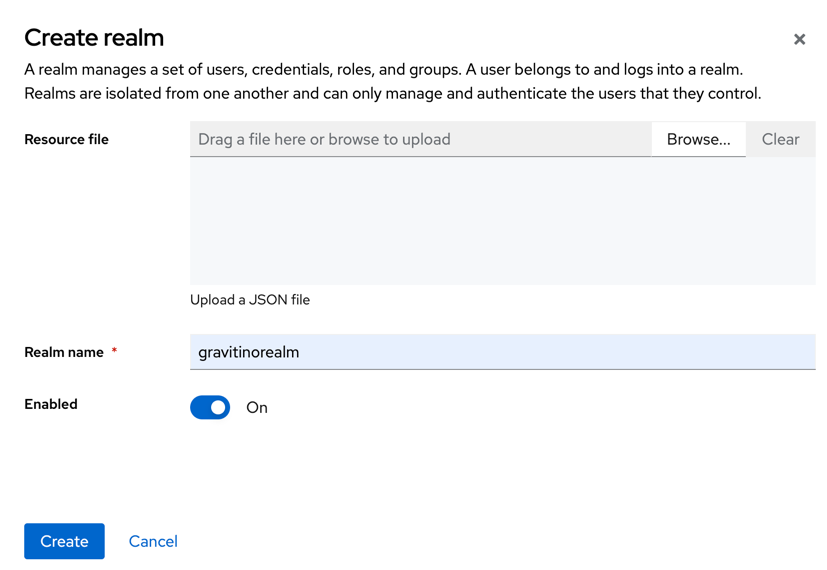
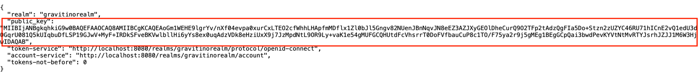

## Introduction

Apache Gravitino supports four kinds of authentication mechanisms: simple, Basic, OAuth and Kerberos.
If you don't enable authentication for your client and server explicitly, the user `anonymous` will be used to access the server.

### Simple Mode

In simple mode, the client uses the value of the `GRAVITINO_USER` environment variable as the username.
If the environment variable `GRAVITINO_USER` in the client isn't set, the client defaults to the username of the user logged into the machine sending the requests.

For the client side, users can enable `simple` mode by the following code:

```java
GravitinoClient client = GravitinoClient.builder(uri)
    .withMetalake("metalake")
    .withSimpleAuth()
    .build();
```

Additionally, the username can be directly used as a parameter to create a client.

```java
GravitinoClient client = GravitinoClient.builder(uri)
    .withMetalake("metalake")
    .withSimpleAuth("test_user_name")
    .build();
```

When using curl or other HTTP clients, authenticate with the `Authorization` header:

```shell
curl -v -X GET \
  -H "Accept: application/vnd.gravitino.v1+json" \
  -H "Content-Type: application/json" \
  -H "Authorization: Basic $(echo -n 'admin:' | base64)" \
  http://localhost:8090/api/version
```

### Basic Mode

In Basic mode, Gravitino verifies HTTP Basic credentials against built-in IDP user metadata stored
in the relational entity store.

To enable Basic mode:

- Set `gravitino.authenticators` to `basic`.
- Set `gravitino.server.rest.extensionPackages` to `org.apache.gravitino.idp.web.rest.feature`.
- Set `gravitino.authorization.serviceAdmins` to the service admin usernames that should exist in
  the built-in IDP.

Built-in IdP is **incompatible** with the `simple` authenticator (the default),
`gravitino.authenticators` must include `basic` and must not include `simple`.
- On the first startup, if any configured service admin does not yet have a password, set the
  `GRAVITINO_INITIAL_ADMIN_PASSWORD` environment variable to the initial password (12 to 64
  characters) before starting Gravitino. The same password is applied to every configured service
  admin that does not yet exist in the built-in IDP.

For the client side, enable Basic mode with the following code:

```java
GravitinoClient client = GravitinoClient.builder(uri)
    .withMetalake("metalake")
    .withBasicAuth("admin", "YourSecureGravitinoPassword")
    .build();
```

```python
from gravitino.auth.basic_auth_provider import BasicAuthProvider
from gravitino.client.gravitino_client import GravitinoClient

client = GravitinoClient(
    uri="http://localhost:8090",
    metalake_name="metalake",
    auth_data_provider=BasicAuthProvider("admin", "YourSecureGravitinoPassword"),
)
```

```shell
curl -v -X GET \
  -H "Accept: application/vnd.gravitino.v1+json" \
  -H "Content-Type: application/json" \
  -H "Authorization: Basic $(echo -n 'admin:YourSecureGravitinoPassword' | base64)" \
  http://localhost:8090/api/version
```

The Web UI uses the first entry in `gravitino.authenticators` from `/configs`. When it is `basic`,
the login page shows a username and password form backed by built-in IdP user metadata. See
[built-in IDP Web UI](how-to-use-built-in-idp.md#web-ui).

### OAuth Mode

Gravitino supports external OAuth 2.0 servers with two token validation methods:

1. **Static signing key validation** - Uses a pre-configured signing key to validate JWT tokens
2. **JWKS-based validation** - Dynamically fetches public keys from OAuth provider's JWKS endpoint (supports OIDC providers like Azure AD, and other JWKS-compatible providers)

To enable OAuth mode:

- First, ensure the external OAuth 2.0 server supports Bearer JWT tokens.
- For **static key validation**: Configure `gravitino.authenticator.oauth.defaultSignKey`, `gravitino.authenticator.oauth.serverUri` and `gravitino.authenticator.oauth.tokenPath`.
- For **JWKS validation**: Configure `gravitino.authenticator.oauth.jwksUri` and `gravitino.authenticator.oauth.tokenValidatorClass=org.apache.gravitino.server.authentication.JwksTokenValidator`. You can use either `gravitino.authenticator.oauth.provider=default` or `gravitino.authenticator.oauth.provider=oidc` depending on whether you want Web UI OIDC login flow.
- For **Web UI OIDC authentication**: Set `gravitino.authenticator.oauth.provider=oidc` and configure `gravitino.authenticator.oauth.clientId`, `gravitino.authenticator.oauth.authority`, and `gravitino.authenticator.oauth.scope`. These settings are exposed to the Web UI via the `/configs` endpoint to enable OAuth login flow. Configure your OAuth provider with the callback redirect URI: `https://your-gravitino-server/ui/oauth/callback`.

  :::note
  The Web UI OIDC login uses the Authorization Code flow with PKCE, which depends on the browser
  [Web Crypto API](https://developer.mozilla.org/en-US/docs/Web/API/Web_Crypto_API). Browsers only
  expose this API in a [secure context](https://developer.mozilla.org/en-US/docs/Web/Security/Secure_Contexts),
  that is, when the Web UI is served over HTTPS or from `localhost`. If you open the Web UI over plain
  HTTP on a non-`localhost` host, login fails because the crypto primitives required for PKCE are
  unavailable. Serve the Web UI over HTTPS (or access it via `localhost`) for OIDC login to work.
  :::
- Next, for the client side, users can enable `OAuth` mode by the following code:

```java
DefaultOAuth2TokenProvider authDataProvider = DefaultOAuth2TokenProvider.builder()
    .withUri("oauth server uri")
    .withCredential("yy:xx")
    .withPath("oauth/token")
    .withScope("test")
    .build();

GravitinoClient client = GravitinoClient.builder(uri)
    .withMetalake("metalake")
    .withOAuth(authDataProvider)
    .build();
```

### Kerberos Mode

To enable Kerberos mode, users must ensure that the server and client have the correct Kerberos configuration. On the server side, users should set `gravitino.authenticators` as `kerberos` and give
`gravitino.authenticator.kerberos.principal` and `gravitino.authenticator.kerberos.keytab` a proper value. For the client side, users can enable `kerberos` mode by the following code:

```java
// Use keytab to create KerberosTokenProvider
KerberosTokenProvider provider = KerberosTokenProvider.builder()
        .withClientPrincipal(clientPrincipal)
        .withKeyTabFile(new File(keytabFile))
        .build();

// Use ticketCache to create KerberosTokenProvider
KerberosTokenProvider provider = KerberosTokenProvider.builder()
        .withClientPrincipal(clientPrincipal)
        .build();        

GravitinoClient client = GravitinoClient.builder(uri)
    .withMetalake("metalake")
    .withKerberosAuth(provider)
    .build();
```

:::info
The Iceberg REST service does not support Kerberos authentication.
The URI must be the server's hostname instead of its IP address.
:::

### Custom Mode

Gravitino also supports custom authentication implementations.
For server side, you can implement the interface `Authenticator` and specify `gravitino.authenciators`.
For client side, you extend the abstract class `CustomTokenProvider` and specify the token provider.

```java
GravitinoClient client = GravitinoClient.builder(uri)
    .withMetalake("metalake")
    .withCustomProvider(provider)
    .build();
```

### Principal Mapping

Gravitino supports principal mapping to transform authenticated principals (from OAuth or Kerberos) into user identities for authorization. By default, Gravitino uses regex-based mapping.

### Group Mapping

Gravitino supports group mapping to transform authenticated groups (from OAuth) into Gravitino groups for authorization. By default, Gravitino uses regex-based mapping.

#### OAuth Group Mapping

For OAuth authentication, groups are extracted from JWT claims (configured via `gravitino.authenticator.oauth.groupsFields`). Customize how these groups are mapped:

```text
# Use default regex mapper that extracts everything (passes through unchanged)
gravitino.authenticator.oauth.groupMapper = regex
gravitino.authenticator.oauth.groupMapper.regex.pattern = ^(.*)$

# Extract group from a complex string (e.g., /group -> group)
gravitino.authenticator.oauth.groupMapper = regex
gravitino.authenticator.oauth.groupMapper.regex.pattern = ^/(.*)


# Use custom group mapper implementation
gravitino.authenticator.oauth.groupMapper = com.example.MyCustomGroupMapper
```

#### Custom Group Mapper

For advanced use cases, implement the `GroupMapper` interface:

```java
package com.example;

import org.apache.gravitino.UserGroup;
import org.apache.gravitino.auth.GroupMapper;
import java.util.Collections;
import java.util.List;
import java.util.Optional;
import java.util.stream.Collectors;

public class MyCustomGroupMapper implements GroupMapper {
  @Override
  public List<UserGroup> map(List<Object> groups) {
    if (groups == null) {
      return Collections.emptyList();
    }
    return groups.stream()
        .map(g -> new UserGroup(Optional.empty(), "mapped_" + g.toString()))
        .collect(Collectors.toList());
  }
}
```

Configure Gravitino to use your custom mapper:

```text
gravitino.authenticator.oauth.groupMapper = com.example.MyCustomGroupMapper
```

#### OAuth Principal Mapping

For OAuth authentication, principals are extracted from JWT claims (configured via `gravitino.authenticator.oauth.principalFields`). Customize how these principals are mapped:

```text
# Use default regex mapper that extracts everything (passes through unchanged)
gravitino.authenticator.oauth.principalMapper = regex
gravitino.authenticator.oauth.principalMapper.regex.pattern = ^(.*)$

# Extract username from email (e.g., user@example.com -> user)
gravitino.authenticator.oauth.principalMapper = regex
gravitino.authenticator.oauth.principalMapper.regex.pattern = ([^@]+)@.*

# Use custom mapper implementation
gravitino.authenticator.oauth.principalMapper = com.example.MyCustomPrincipalMapper
```

#### Custom Principal Mapper

For advanced use cases, implement the `PrincipalMapper` interface:

```java
package com.example;

import org.apache.gravitino.auth.PrincipalMapper;
import java.security.Principal;

public class MyCustomPrincipalMapper implements PrincipalMapper {
  @Override
  public Principal map(String principal) {
    return () -> "mapped_" + principal;
  }
}
```

Configure Gravitino to use your custom mapper:

```text
gravitino.authenticator.oauth.principalMapper = com.example.MyCustomPrincipalMapper
```

#### Kerberos Principal Mapping

For Kerberos authentication, principals follow the format `primary[/instance][@REALM]`. The default mapper extracts the primary component (username before `@`):

```text
# Default: Extract primary component (user@REALM -> user, HTTP/server@REALM -> HTTP)
gravitino.authenticator.kerberos.principalMapper = regex
gravitino.authenticator.kerberos.principalMapper.regex.pattern = ([^@]+).*

# Extract only the first part before '/' (HTTP/server@REALM -> HTTP)
gravitino.authenticator.kerberos.principalMapper = regex
gravitino.authenticator.kerberos.principalMapper.regex.pattern = ([^/@]+).*
```

#### Custom Kerberos Principal Mapper

For advanced use cases, implement the `PrincipalMapper` interface:

```java
package com.example;

import org.apache.gravitino.auth.KerberosPrincipal;
import org.apache.gravitino.auth.KerberosPrincipalMapper;
import org.apache.gravitino.auth.PrincipalMapper;

import java.security.Principal;

public class RealmBasedMapper implements PrincipalMapper {
  private final KerberosPrincipalMapper parser = new KerberosPrincipalMapper();

  @Override
  public Principal map(String principal) {
    // Parse Kerberos principal components
    KerberosPrincipal krbPrincipal = (KerberosPrincipal) parser.map(principal);
    
    // Route based on realm
    if ("DEV.EXAMPLE.COM".equals(krbPrincipal.getRealm().orElse(null))) {
      return () -> "dev_" + krbPrincipal.getName();
    } else if ("PROD.EXAMPLE.COM".equals(krbPrincipal.getRealm().orElse(null))) {
      return () -> "prod_" + krbPrincipal.getName();
    }
    
    // Default: use primary with instance (e.g., "HTTP/server")
    return () -> krbPrincipal.getPrimaryWithInstance();
  }
}
```

Configure Gravitino to use your custom mapper:

```text
gravitino.authenticator.kerberos.principalMapper = com.example.RealmBasedMapper
```

### Server Configuration

Gravitino server and Gravitino Iceberg REST server share the same configuration items, you doesn't need to add `gravitino.iceberg-rest` prefix for Gravitino Iceberg REST server.

| Configuration item                                  | Description                                                                                                                                                                                                                                                             | Default value                                                       | Required                                                                                        | Since version    |
|-----------------------------------------------------|-------------------------------------------------------------------------------------------------------------------------------------------------------------------------------------------------------------------------------------------------------------------------|---------------------------------------------------------------------|-------------------------------------------------------------------------------------------------|------------------|
| `gravitino.authenticator`                           | It is deprecated since Gravitino 0.6.0. Please use `gravitino.authenticators` instead.                                                                                                                                                                                  | `simple`                                                            | No                                                                                              | 0.3.0            |
| `gravitino.authenticators`                          | The authenticators which Gravitino uses, setting as `simple`, `basic`, `oauth` or `kerberos`. Multiple authenticators are separated by commas. If a request is supported by multiple authenticators simultaneously, the first authenticator will be used by default.    | `simple`                                                            | No                                                                                              | 0.6.0-incubating |
| `gravitino.authenticator.oauth.serviceAudience`     | The audience name when Gravitino uses OAuth as the authenticator.                                                                                                                                                                                                       | `GravitinoServer`                                                   | No                                                                                              | 0.3.0            |
| `gravitino.authenticator.oauth.allowSkewSecs`       | The JWT allows skew seconds when Gravitino uses OAuth as the authenticator.                                                                                                                                                                                             | `0`                                                                 | No                                                                                              | 0.3.0            |
| `gravitino.authenticator.oauth.defaultSignKey`      | The signing key of JWT when Gravitino uses OAuth as the authenticator.                                                                                                                                                                                                  | (none)                                                              | Yes if use `oauth` as the authenticator                                                         | 0.3.0            |
| `gravitino.authenticator.oauth.signAlgorithmType`   | The signature algorithm when Gravitino uses OAuth as the authenticator.                                                                                                                                                                                                 | `RS256`                                                             | No                                                                                              | 0.3.0            |
| `gravitino.authenticator.oauth.serverUri`           | The URI of the default OAuth server. Required when using StaticSignKeyValidator, not required for JWKS-based validators.                                                                                                                                                | (none)                                                              | Yes if using `StaticSignKeyValidator`                                                           | 0.3.0            |
| `gravitino.authenticator.oauth.tokenPath`           | The path for token of the default OAuth server. Required when using StaticSignKeyValidator, not required for JWKS-based validators.                                                                                                                                     | (none)                                                              | Yes if using `StaticSignKeyValidator`                                                           | 0.3.0            |
| `gravitino.authenticator.oauth.provider`            | OAuth provider type (default, oidc). Determines the Web UI authentication flow. Use 'oidc' for Web UI OIDC login, 'default' for legacy login or API-only authentication.                                                                                                | `default`                                                           | No                                                                                              | 1.0.0            |
| `gravitino.authenticator.oauth.clientId`            | OAuth client ID for Web UI authentication.                                                                                                                                                                                                                              | (none)                                                              | Yes if provider is `oidc`                                                                       | 1.0.0            |
| `gravitino.authenticator.oauth.authority`           | OAuth authority/issuer URL for OIDC providers for web UI authentication. (e.g., Azure AD tenant URL).                                                                                                                                                                   | (none)                                                              | Yes if provider is `oidc`                                                                       | 1.0.0            |
| `gravitino.authenticator.oauth.scope`               | OAuth scopes for Web UI authentication (space-separated).                                                                                                                                                                                                               | (none)                                                              | Yes if provider is `oidc`                                                                       | 1.0.0            |
| `gravitino.authenticator.oauth.jwksUri`             | JWKS URI for server-side OAuth token validation. Required when using JWKS-based validation.                                                                                                                                                                             | (none)                                                              | Yes if `tokenValidatorClass` is `org.apache.gravitino.server.authentication.JwksTokenValidator` | 1.0.0            |
| `gravitino.authenticator.oauth.principalFields`     | JWT claim field(s) to use as principal identity. Comma-separated list for fallback in order (e.g., 'preferred_username,email,sub').                                                                                                                                     | `sub`                                                               | No                                                                                              | 1.0.0            |
| `gravitino.authenticator.oauth.groupsFields`        | JWT claim field(s) to use as group membership. Comma-separated list for fallback in order (e.g., 'groups,roles').                                                                                                                                                       | `groups`                                                            | No                                                                                              | 1.3.0            |
| `gravitino.authenticator.oauth.tokenValidatorClass` | Fully qualified class name of the OAuth token validator implementation. Use `org.apache.gravitino.server.authentication.JwksTokenValidator` for JWKS-based validation or `org.apache.gravitino.server.authentication.StaticSignKeyValidator` for static key validation. | `org.apache.gravitino.server.authentication.StaticSignKeyValidator` | No                                                                                              | 1.0.0            |
| `gravitino.authenticator.oauth.principalMapper` | Principal mapper type for OAuth. Use 'regex' for regex-based mapping, or provide a fully qualified class name implementing `org.apache.gravitino.auth.PrincipalMapper`.                                                                                                 | `regex`                                                             | No                                                                                              | 1.2.0            |
| `gravitino.authenticator.oauth.principalMapper.regex.pattern` | Regex pattern for OAuth principal mapping. First capture group becomes the mapped principal. Only used when principalMapper is 'regex'.                                                                                                                           | `^(.*)$`                                                            | No                                                                                              | 1.2.0            |
| `gravitino.authenticator.oauth.groupMapper` | Group mapper type for OAuth. Use 'regex' for regex-based mapping, or provide a fully qualified class name implementing `org.apache.gravitino.auth.GroupMapper`.                                                                                                         | `regex`                                                             | No                                                                                              | 1.3.0            |
| `gravitino.authenticator.oauth.groupMapper.regex.pattern` | Regex pattern for OAuth group mapping. First capture group becomes the mapped group. Only used when groupMapper is 'regex'.                                                                                                                                       | `^(.*)$`                                                            | No                                                                                              | 1.3.0            |
| `gravitino.authenticator.kerberos.principal`        | Indicates the Kerberos principal to be used for HTTP endpoint. Principal should start with `HTTP/`.                                                                                                                                                                     | (none)                                                              | Yes if use `kerberos` as the authenticator                                                      | 0.4.0            |
| `gravitino.authenticator.kerberos.keytab`           | Location of the keytab file with the credentials for the principal.                                                                                                                                                                                                     | (none)                                                              | Yes if use `kerberos` as the authenticator                                                      | 0.4.0            |
| `gravitino.authenticator.kerberos.principalMapper` | Principal mapper type for Kerberos. Use 'regex' for regex-based mapping, or provide a fully qualified class name implementing `org.apache.gravitino.auth.PrincipalMapper`.                                                                                            | `regex`                                                             | No                                                                                              | 1.2.0            |
| `gravitino.authenticator.kerberos.principalMapper.regex.pattern` | Regex pattern for Kerberos principal mapping. First capture group becomes the mapped principal. Only used when principalMapper is 'regex'.                                                                                                                       | `([^@]+).*`                                                         | No                                                                                              | 1.2.0            |

The signature algorithms that Gravitino supports follows:

| Name  | Description                                    |
|-------|------------------------------------------------|
| HS256 | HMAC using SHA-25A                             |
| HS384 | HMAC using SHA-384                             |
| HS512 | HMAC using SHA-51                              |
| RS256 | RSASSA-PKCS-v1_5 using SHA-256                 |
| RS384 | RSASSA-PKCS-v1_5 using SHA-384                 |
| RS512 | RSASSA-PKCS-v1_5 using SHA-512                 |
| ES256 | ECDSA using P-256 and SHA-256                  |
| ES384 | ECDSA using P-384 and SHA-384                  |
| ES512 | ECDSA using P-521 and SHA-512                  |
| PS256 | RSASSA-PSS using SHA-256 and MGF1 with SHA-256 |
| PS384 | RSASSA-PSS using SHA-384 and MGF1 with SHA-384 |
| PS512 | RSASSA-PSS using SHA-512 and MGF1 with SHA-512 |

### Example: Basic authentication

This example shows how to enable built-in Basic authentication.

**Prerequisites:**

- Gravitino distribution package (includes the idp-basic plugin on the server classpath)

Built-in IdP is **incompatible** with the `simple` authenticator (the default),
`gravitino.authenticators` must include `basic` and must not include `simple`.

**Configuration:**

Append the following to `conf/gravitino.conf`:

```text
gravitino.authenticators = basic
gravitino.server.rest.extensionPackages = org.apache.gravitino.idp.web.rest.feature
gravitino.authorization.serviceAdmins = admin
```

On the first startup, if the `admin` service admin does not yet have a password in the store,
set initial passwords before starting the server:

```bash
export GRAVITINO_INITIAL_ADMIN_PASSWORD='YourSecureGravitinoPassword'
./bin/start-gravitino.sh
```

**Usage:**

```shell
curl -v -X GET \
  -H "Accept: application/vnd.gravitino.v1+json" \
  -H "Content-Type: application/json" \
  -H "Authorization: Basic $(echo -n 'admin:YourSecureGravitinoPassword' | base64)" \
  http://localhost:8090/api/version
```

If the service admin already has a password, you do not need to set
`GRAVITINO_INITIAL_ADMIN_PASSWORD` on restart. Gravitino does not change existing passwords
when the server starts again.

### Example: Azure AD as OIDC Provider with JWKS Validation

This example shows how to configure Gravitino with Azure AD using JWKS-based token validation.

**Prerequisites:**
- Azure AD tenant with an application registration (Single-page application)
- Application configured with:
  - Client ID (Application ID)
  - Platform configuration: Single-page application (SPA)
  - Redirect URI: `https://your-gravitino-server/ui/oauth/callback`
  - Required API permissions/scopes (typically `openid`, `profile`, `email`)

**Configuration:**

```text
# Enable OAuth authentication
gravitino.authenticators = oauth

# OIDC Provider Configuration for Web UI
gravitino.authenticator.oauth.provider = oidc
gravitino.authenticator.oauth.clientId = <your-azure-app-client-id>
gravitino.authenticator.oauth.authority = https://login.microsoftonline.com/<your-tenant-id>/v2.0
gravitino.authenticator.oauth.scope = openid profile email

# JWKS-based Token Validation
gravitino.authenticator.oauth.jwksUri = https://login.microsoftonline.com/<your-tenant-id>/discovery/v2.0/keys
gravitino.authenticator.oauth.tokenValidatorClass = org.apache.gravitino.server.authentication.JwksTokenValidator
gravitino.authenticator.oauth.serviceAudience = <your-azure-app-client-id-or-api-identifier>
gravitino.authenticator.oauth.principalFields = preferred_username,email,sub
```

**Usage:**
- **Web UI**: Navigate to Gravitino Web UI, which will redirect to Azure AD for authentication
- **API Access**: Use Azure AD tokens in the `Authorization: Bearer <token>` header

**Azure AD v2.0 Endpoint (Recommended):**
The `authority` must use the v2.0 endpoint (`/v2.0` suffix) to match the v2.0 JWKS URI. This ensures that tokens issued during OIDC discovery use the correct token format and issuer claim that matches your JWKS configuration.

**Alternative: Azure AD v1.0 Endpoint:**
For legacy applications or organizational policies requiring v1.0 tokens, use:
```text
gravitino.authenticator.oauth.authority = https://sts.windows.net/<your-tenant-id>/
gravitino.authenticator.oauth.jwksUri = https://login.microsoftonline.com/<your-tenant-id>/discovery/v2.0/keys
```
Azure AD uses the same signing keys for both v1.0 and v2.0, so v2.0 JWKS can validate v1.0 tokens.

**Important:** Do NOT use `https://login.microsoftonline.com/<tenant-id>/` (without `/v2.0`) as the authority when using v2.0 JWKS. This causes an issuer mismatch: the token will have `iss: "https://sts.windows.net/..."` but the server expects `iss: "https://login.microsoftonline.com/..."`.

**Service Audience:**
The `serviceAudience` should match the `aud` claim in your Azure AD tokens. This is typically your Azure AD application's client ID, but could be a custom API identifier if you've configured custom API scopes (e.g., `api://<client-id>`).

**Principal Fields:**
The `principalFields` supports multiple fallback options. Gravitino will try each field in order (e.g., first `preferred_username`, then `email`, then `sub`) until it finds a non-null value to use as the user identity.

With JWKS validation, you don't need to configure `defaultSignKey`, `serverUri`, or `tokenPath` as the validator dynamically fetches public keys from Azure AD's JWKS endpoint.
:::

### Example: Static Key OAuth Provider

For compatibility with existing OAuth servers that don't support JWKS:

```text
gravitino.authenticators = oauth
gravitino.authenticator.oauth.provider = default
gravitino.authenticator.oauth.clientId = test
gravitino.authenticator.oauth.scope = test
gravitino.authenticator.oauth.serviceAudience = test
gravitino.authenticator.oauth.tokenValidatorClass = org.apache.gravitino.server.authentication.StaticSignKeyValidator
gravitino.authenticator.oauth.serverUri = http://your-oauth-server
gravitino.authenticator.oauth.tokenPath = /oauth2/token
gravitino.authenticator.oauth.defaultSignKey = <your-static-signing-key>
```

### Example: JWKS Validation with Default Provider

For JWKS-based token validation without Web UI OIDC workflow:

```text
gravitino.authenticators = oauth
gravitino.authenticator.oauth.provider = default
gravitino.authenticator.oauth.serviceAudience = <your-audience>
gravitino.authenticator.oauth.tokenValidatorClass = org.apache.gravitino.server.authentication.JwksTokenValidator
gravitino.authenticator.oauth.jwksUri = https://your-oauth-provider/.well-known/jwks.json
```

### Example

Follow these steps to set up an OAuth mode Gravitino server:

1. Prerequisite

   You need to install the JDK8 and Docker.

2. Set up an external OAuth 2.0 server

   There is a sample-authorization-server based on [spring-authorization-server](https://github.com/spring-projects/spring-authorization-server/tree/1.0.3). The image has registered client information in the external OAuth 2.0 server
   and its clientId is `test`, secret is `test`, scope is `test`.

```shell
 docker run -p 8177:8177 --name sample-auth-server -d datastrato/sample-authorization-server:0.3.0
```

3. Open [the JWK URL of the Authorization server](http://localhost:8177/oauth2/jwks) in the browser and you can get the JWK.

   

4. Convert the JWK to PEM. You can use the [online tool](https://8gwifi.org/jwkconvertfunctions.jsp#google_vignette) or other tools.

   

5. Copy the public key and remove the character `\n` and you can get the default signing key of Gravitino server.

6. Refer to the [Configurations](../gravitino-server-config.md) and append the configurations to the conf/gravitino.conf.

```text
gravitino.authenticators = oauth
gravitino.authenticator.oauth.serviceAudience = test
gravitino.authenticator.oauth.defaultSignKey = <the default signing key>
gravitino.authenticator.oauth.tokenPath = /oauth2/token
gravitino.authenticator.oauth.serverUri = http://localhost:8177
```

7. Open [the URL of Gravitino server](http://localhost:8090) and login in with clientId `test`, clientSecret `test`, and scope `test`.

   

8. Use the curl command to access Gravitino.

Get access token

```shell
curl --location --request POST 'http://127.0.0.1:8177/oauth2/token?grant_type=client_credentials&client_id=test&client_secret=test&scope=test'
```

Use the access token to request the Gravitino

```shell
curl -v -X GET -H "Accept: application/vnd.gravitino.v1+json" -H "Content-Type: application/json" -H "Authorization: Bearer <access_token>" http://localhost:8090/api/version
```

### Configure Keycloak as an OAuth Provider

1. Set up an external Keycloak server, you can refer to [Keycloak document](https://www.keycloak.org/getting-started/getting-started-docker)

```shell
docker run -dti -p 8080:8080 -e KC_BOOTSTRAP_ADMIN_USERNAME=admin -e KC_BOOTSTRAP_ADMIN_PASSWORD=admin quay.io/keycloak/keycloak:26.2.5 start-dev
```

2. Go to the [Keycloak admin console](http://localhost:8080/), log in with the initial admin user with the username `admin` and password `admin`

3. Create a realm for Gravitino
   * Click *Manage realms* in the left-hand menu.
   * Click *Create realm* button

    

4. Get the `gravitinorealm` public key, which is the `<the default signing key>` in gravitino.conf
   Access `http://localhost:8080/realms/gravitinorealm` in browser

   

5. Add users

    Initially, the realm has no users. Use these steps to create a user:
   * Verify that you are still in the gravitinorealm realm, which is next to *Current realm*.
   * Click Users in the left-hand menu.
   * Click *Create new user*.
   * Fill in the form with the following values:  
   *Username*: usera, *First name*: any first name, *Last name*: any last name, *Email*: any email
   * Click *credentials*, fill in the *Set password form* with a password.
   * Toggle Temporary to Off so that the user does not need to update this password at the first login.

    You can now log in to the [Account Console(gravitinorealm)](http://localhost:8080/realms/gravitinorealm/account) to verify this user is configured correctly.

6. Register Gravitino in Keycloak

   * Click *gravitinorealm* next to *Current realm*.
   *  Click *Clients*.
   *  Click *Create client*
   *  Fill in *Client type*: `OpenID Connect` *Client ID*: `gravitino-client`
   *  Click *Next*
   *  Confirm that `Client authentication` `Standard flow` `Direct access grants` `Service accounts roles` is enabled.
   *  Click *Next*
   *  Set *Valid redirect URIs* to `http://localhost:8090/*`
   *  Set *Web origins* to `http://localhost:8090`
   *  Click *Save*.
   *  Click *Credentials* tab page, get `Client Secret`. 

   

7. Refer to the [Configurations](../gravitino-server-config.md) and append the configurations to the conf/gravitino.conf.

```text
gravitino.authenticators = oauth
gravitino.authenticator.oauth.serviceAudience = account
gravitino.authenticator.oauth.defaultSignKey = <the default signing key>
gravitino.authenticator.oauth.tokenPath = /realms/gravitinorealm/protocol/openid-connect/token
gravitino.authenticator.oauth.serverUri = http://localhost:8080
```

8. Use client credentials to authenticate. The `access token` is bound to a service account.

Get access token

```shell
curl \
  -d "client_id=gravitino-client" \
  -d "client_secret=FL20ezBgQAOlDQeNifzwliQ56wohhqNo" \
  -d "grant_type=client_credentials" \
  "http://localhost:8080/realms/gravitinorealm/protocol/openid-connect/token"
```

Use the access token to request the Gravitino

```shell
curl -v -X GET -H "Accept: application/vnd.gravitino.v1+json" -H "Content-Type: application/json" -H "Authorization: Bearer <access_token>" http://localhost:8090/api/version
```

9. Use password to authenticate users. The openid scope returns an `id_token` that includes user information which can be used for consumer mapping and group mapping in future posts.

Get access token

```shell
curl \
  -d "client_id=gravitino-client" \
  -d "client_secret=FL20ezBgQAOlDQeNifzwliQ56wohhqNo" \
  -d "username=usera" \
  -d "password=Admin@123" \
  -d "grant_type=password" \
  -d "scope=openid" \
  "http://localhost:8080/realms/gravitinorealm/protocol/openid-connect/token"
```

Use the access token to make requests to the Gravitino server:

```shell
curl -v -X GET -H "Accept: application/vnd.gravitino.v1+json" -H "Content-Type: application/json" -H "Authorization: Bearer <access_token>" http://localhost:8090/api/version
```

For Gravitino Iceberg REST Service, the 'Accept: application/vnd.gravitino.v1+json' header is not required,  you could use following command:

```shell
curl -v -X GET -H "Content-Type: application/json" -H "Authorization: Bearer <access_token>" http://127.0.0.1:9001/iceberg/v1/config
```

### Enable Web UI OIDC login with Keycloak

The `gravitino-client` registered above is a confidential client used for machine-to-machine flows
(client credentials and password grants). The browser Web UI cannot use a confidential client because
it cannot keep a client secret, so the Web UI OIDC login requires a separate public client. A typical
Keycloak deployment therefore uses two clients:

| Client             | Type         | Used by                                                       | Keycloak settings                                                                   |
|--------------------|--------------|---------------------------------------------------------------|-------------------------------------------------------------------------------------|
| `gravitino-client` | Confidential | Engines and machine flows (CLI, connectors, service accounts) | *Client authentication* on, *Standard flow* and *Service accounts roles* enabled    |
| `gravitino-ui`     | Public       | Browser Web UI OIDC login                                     | *Client authentication* off, *Standard flow* enabled                                |

To register the public client for the Web UI:

* Click *Clients* in the `gravitinorealm` realm, then *Create client*.
* Fill in *Client type*: `OpenID Connect`, *Client ID*: `gravitino-ui`, then click *Next*.
* Turn *Client authentication* **off** (this makes it a public client) and enable *Standard flow*. Click *Next*.
* Set *Valid redirect URIs* to `https://your-gravitino-server/ui/oauth/callback`.
* Set *Valid post logout redirect URIs* to `https://your-gravitino-server/*` so logout can redirect back to the Web UI.
* Set *Web origins* to `https://your-gravitino-server`.
* Click *Save*.

Then point the Web UI OIDC settings at this public client in `conf/gravitino.conf`:

```text
gravitino.authenticators = oauth
gravitino.authenticator.oauth.provider = oidc
gravitino.authenticator.oauth.clientId = gravitino-ui
gravitino.authenticator.oauth.authority = http://localhost:8080/realms/gravitinorealm
gravitino.authenticator.oauth.scope = openid profile email
gravitino.authenticator.oauth.jwksUri = http://localhost:8080/realms/gravitinorealm/protocol/openid-connect/certs
gravitino.authenticator.oauth.tokenValidatorClass = org.apache.gravitino.server.authentication.JwksTokenValidator
gravitino.authenticator.oauth.serviceAudience = account
gravitino.authenticator.oauth.principalFields = preferred_username,email,sub
```

This example uses JWKS-based validation, where the server fetches Keycloak's public keys from
`jwksUri` automatically. It therefore does not need the static-key settings
(`gravitino.authenticator.oauth.defaultSignKey`, `gravitino.authenticator.oauth.serverUri`, and
`gravitino.authenticator.oauth.tokenPath`) shown in the machine-flow example above. JWKS validation
is recommended for Keycloak; only set the static-key settings if you intentionally use
`tokenValidatorClass=org.apache.gravitino.server.authentication.StaticSignKeyValidator` instead. The
same server configuration validates tokens from both the Web UI and the machine clients, so you do
not need a separate validator per client.

:::note
The Web UI OIDC login requires a [secure context](https://developer.mozilla.org/en-US/docs/Web/Security/Secure_Contexts):
serve the Web UI over HTTPS or access it via `localhost`. See the secure-context note in the
[OAuth Mode](#oauth-mode) section for details.
:::

#### Align the token issuer for split-hostname deployments

The `iss` (issuer) claim in a Keycloak token is built from the hostname the token was obtained
through. When the browser and the Gravitino server reach Keycloak through different hostnames (for
example, the browser uses a public URL while the server uses an internal Docker or cluster hostname),
the `iss` claim in the browser-issued token will not match the `authority` the server expects, and
validation fails with an error such as `JWT iss claim value rejected`.

To keep the issuer consistent regardless of which hostname is used to reach Keycloak, set a unified
**Frontend URL** on the realm:

* Open the `gravitinorealm` realm, go to *Realm settings* > *General*.
* Set *Frontend URL* to the canonical, externally reachable Keycloak base URL (for example,
  `https://keycloak.example.com`).
* Save, then use that same base URL in `gravitino.authenticator.oauth.authority` (and the matching
  `jwksUri`).

With the Frontend URL set, Keycloak stamps the same `iss` claim on every token regardless of the
hostname the request arrived on, so browser-issued and server-validated tokens agree.
