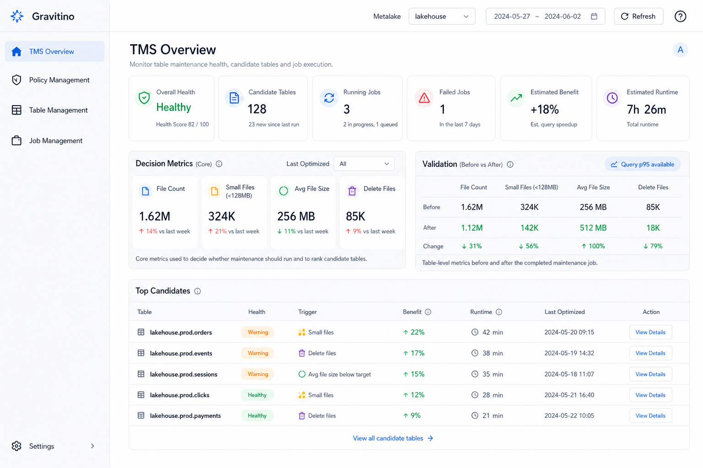
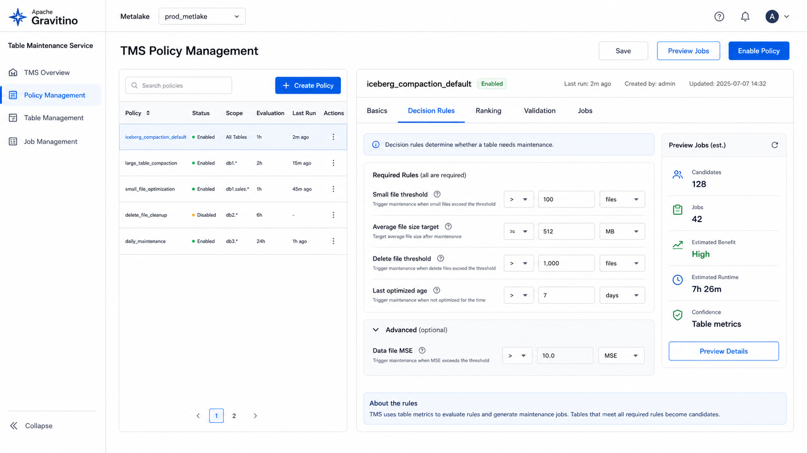
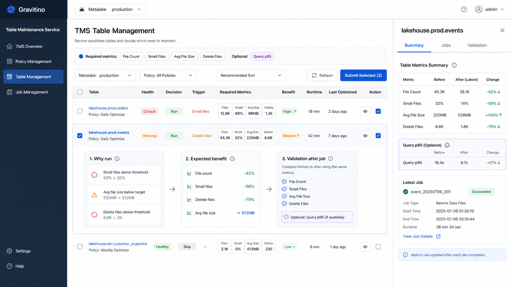
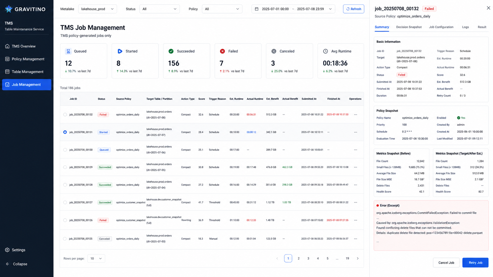

# Gravitino TMS UI Design

## Context

Gravitino Table Maintenance Service (TMS) helps users evaluate table health, decide whether table maintenance should run, and submit maintenance jobs through Gravitino's job system. The first UI scope focuses on policy-driven Iceberg compaction, while keeping the structure extensible for later maintenance strategies.

The UI should expose the full decision loop:

1. Collect table statistics and metrics.
2. Evaluate TMS policies.
3. Rank maintenance candidates.
4. Generate TMS jobs from policy decisions.
5. Observe execution results and feed them back into table health.

This design uses four TMS pages:

- TMS Overview
- TMS Policy Management
- TMS Table Management
- TMS Job Management

The Job Management page only shows jobs generated by TMS policies. It is not a general Gravitino job center.









## Design Goals

- Make policy editing operationally safe and understandable.
- Help users understand why a table or partition is selected for maintenance.
- Make prioritization transparent through health score, cost, benefit, and score breakdowns.
- Connect policies, tables, and jobs into one traceable workflow.
- Keep resource and job-template details secondary unless they explain a TMS decision.

## Non-Goals

- Build a general job template management UI.
- Manage non-TMS jobs.
- Expose raw policy JSON as the primary editing experience.
- Recreate Amoro's optimizer resource management as a separate first-version page.
- Support all custom policy types in the first version.

## Reference Inputs

- Google Doc scope: TMS UI should include Overview, Policy Management, and Table Management. This design adds TMS Job Management because policy-generated jobs need a dedicated execution view.
- Gravitino TMS docs: `docs/table-maintenance-service/optimizer.md`
- Gravitino Iceberg compaction policy docs: `docs/iceberg-compaction-policy.md`
- Gravitino job system docs: `docs/manage-jobs-in-gravitino.md`
- Amoro reference: Self-optimizing pages emphasize table health, optimizing status, quota/occupation, and table-level optimizing details.

## Information Architecture

### TMS Overview

Overview is the operational landing page. It should answer:

- Is TMS healthy?
- How much optimization opportunity exists?
- Are jobs running or failing?
- Which policies and tables need attention?

Primary sections:

- Health summary: overall health score, unhealthy table count, degraded partition count.
- Opportunity summary: estimated benefit, estimated runtime, candidate job count.
- Execution summary: running jobs, queued jobs, failed jobs, success rate, average runtime.
- Top candidates: highest priority tables or partitions, sorted by default policy ranking.
- Recent jobs: recent policy-generated jobs with status and result.
- Policy coverage: enabled policies and associated object counts.

Recommended actions:

- View policy
- View candidates
- View failed jobs
- Submit top candidates, if manual submission is enabled

### TMS Policy Management

Policy Management is where users create, edit, preview, enable, and disable TMS policies.

The first version should provide a typed editor for `system_iceberg_compaction` instead of making users edit raw JSON.

List view columns:

- Policy name
- Status
- Policy type
- Scope
- Evaluation period
- Associated objects
- Candidate jobs from last evaluation
- Last evaluated at
- Last generated jobs
- Updated at
- Operations

Policy detail tabs:

- Overview
- Rules
- Ranking
- Job Generation
- Associations
- Evaluation History

Policy editor sections:

- Basic information: name, description, enabled state.
- Scope: catalog, schema, table associations.
- Evaluation: evaluation period, evaluation window, manual preview action.
- Trigger thresholds:
  - Minimum data file MSE
  - Minimum delete file number
  - Optional target file size helper that can calculate MSE threshold from target size and tolerance ratio.
- Ranking weights:
  - Data file MSE weight
  - Delete file number weight
  - Optional benefit/cost weight if the backend exposes these metrics.
- Job generation:
  - Job template name, read-only for built-in policy.
  - Maximum partition number.
  - Rewrite options.
- Transparency:
  - Generated `trigger-expr`
  - Generated `score-expr`
  - Supported object types

Key interaction: Preview Jobs.

Before submitting changes or before generating jobs, users can preview:

- Candidate tables and partitions.
- Triggered metrics.
- Score and ranking.
- Estimated runtime.
- Estimated benefit.
- Jobs that would be generated.
- Objects skipped and skip reasons.

### TMS Table Management

Table Management is the decision workspace. It shows table and partition health, maintenance candidates, and ranking.

It should answer:

- Which tables need optimization?
- Why did they trigger?
- What benefit should we expect?
- What will it cost?
- Which jobs should be submitted first?

Top controls:

- Metalake/catalog/schema filters.
- Policy filter.
- Object level toggle: table or partition.
- Status filter: healthy, warning, critical, candidate, running, recently optimized.
- Sort menu.
- Manual refresh.
- Submit selected jobs, if manual submission is enabled.

Default table columns:

- Object name
- Health score
- Maintenance status
- Source policy
- Trigger reason
- Score
- Estimated benefit
- Estimated runtime
- Benefit/cost ratio
- File count
- Small file count
- Average file size
- File size variance or MSE
- Delete file count
- Last optimized at
- Operations

Default sorting:

1. Critical health status first.
2. Higher benefit/cost ratio.
3. Higher score.
4. Older last optimized time.

Row expansion should show decision transparency:

- Trigger explanation: which metric crossed which threshold.
- Score breakdown: formula, metric values, weights, final score.
- Cost breakdown: estimated runtime and resource inputs.
- Benefit breakdown: expected file count reduction, file size improvement, delete file cleanup, health score improvement.
- Candidate job preview: generated job template and job configuration summary.

Table detail drawer tabs:

- Health
- Metrics
- Candidate Jobs
- History
- Policies

### TMS Job Management

Job Management only shows jobs generated by TMS policies. It should not show manually submitted general jobs unless they are part of TMS.

It should answer:

- Which TMS jobs were generated?
- Which policy generated each job?
- Which table or partition does each job affect?
- What was the decision snapshot when the job was generated?
- What happened after execution?

List view columns:

- Job ID
- Status
- Source policy
- Target table or partition
- Action type
- Score
- Trigger reason
- Estimated runtime
- Actual runtime
- Estimated benefit
- Actual benefit
- Submitted at
- Finished at
- Operations

Filters:

- Status
- Policy
- Catalog/schema/table
- Action type
- Submitted time range
- Failed only
- Running only

Supported actions:

- View details
- View logs
- Cancel, when the job is cancelable
- Retry failed job, if the backend supports retry
- Open source policy
- Open target table

Job detail drawer tabs:

- Summary
- Decision Snapshot
- Job Configuration
- Logs
- Result

Decision Snapshot should include:

- Policy name and policy version or last updated timestamp.
- Trigger expression.
- Score expression.
- Metric values at generation time.
- Triggered thresholds.
- Ranking position at generation time.

Result should include before/after metrics:

- File count
- Small file count
- Average file size
- File size variance or MSE
- Delete file count
- Health score
- Runtime
- Failure reason, if failed

## Core Concepts

### Health Score

Health score is the user-facing summary of table maintenance risk. It should be displayed as a compact score with a clear state:

- Healthy
- Warning
- Critical
- Unknown

The score should be explainable. Users must be able to open the breakdown and see which metrics affected the score.

Initial score inputs:

- Small file count.
- Average file size.
- File size variance or MSE.
- Delete file count.
- Last optimized time.
- Optional failed job penalty.

### Cost

Cost represents estimated maintenance effort, not cloud billing. The first version should calculate
cost as an operational score and expose the inputs behind it.

Recommended first-version formula:

```text
estimatedRuntimeMinutes = baseOverheadMinutes
  + inputFileCount * fileScanCostMinutes
  + inputSizeGiB * rewriteCostMinutesPerGiB
  + selectedPartitionCount * partitionPlanningCostMinutes

estimatedResourceCost = estimatedRuntimeMinutes * executorCostUnit

riskPenalty = recentFailureCount * failurePenalty
  + runningJobConflictCount * conflictPenalty

costScore = normalize(estimatedResourceCost + riskPenalty)
```

Initial default inputs:

- `inputFileCount`: number of files selected for maintenance.
- `inputSizeGiB`: selected data size in GiB.
- `selectedPartitionCount`: number of partitions selected for the job.
- `recentFailureCount`: recent failed TMS jobs for the same table or policy.
- `runningJobConflictCount`: running TMS jobs targeting the same table.

Initial configurable weights:

- `baseOverheadMinutes`: fixed startup and planning cost.
- `fileScanCostMinutes`: per-file planning and scan overhead.
- `rewriteCostMinutesPerGiB`: rewrite cost per GiB.
- `partitionPlanningCostMinutes`: per-partition planning overhead.
- `executorCostUnit`: optional multiplier for executor cost.
- `failurePenalty`: penalty for recent failed jobs.
- `conflictPenalty`: penalty for concurrent table maintenance.

The UI should show both the human-readable estimate and the score used for sorting:

- Estimated runtime: for example `18 min`.
- Estimated resource cost: for example `18 executor-min`.
- Cost score: normalized value for sorting.
- Cost breakdown: file count, data size, partitions, risk penalties.

If the backend does not expose enough data for the full formula, the UI should show partial
estimates and mark missing inputs explicitly instead of inventing values.

### Benefit

Benefit should represent expected query speed improvement, with table quality metrics used as
leading indicators. The UI should distinguish estimated benefit before a job runs from actual
benefit after the job finishes.

Preferred actual benefit metrics, when query history is available:

- Query duration improvement: compare `p50`, `p90`, and `p95` query duration before and after
  maintenance for queries that scan the optimized table.
- Planning time improvement: compare query planning or metadata load time before and after
  maintenance.
- Scan time improvement: compare table scan operator time before and after maintenance.
- Query minutes saved: `(baselineDuration - postMaintenanceDuration) * queryCount`.
- Speedup ratio: `baselineDuration / postMaintenanceDuration`.

Actual benefit should use comparable query windows, for example seven days before and seven days
after the maintenance job. The comparison should normalize or segment by query shape when possible:

- Same table or partition.
- Similar scanned bytes.
- Similar filter pattern or query template.
- Same execution engine, if engine information is available.

Estimated benefit can be calculated before the job runs with a scan-cost proxy:

```text
fileOpenTimeSaved = (fileCountBefore - estimatedFileCountAfter) * fileOpenLatencyMs
metadataTimeSaved = (manifestCountBefore - estimatedManifestCountAfter) * manifestReadLatencyMs
deleteMergeTimeSaved = (deleteFileCountBefore - estimatedDeleteFileCountAfter) * deleteMergeCostMs
skewTimeSaved = fileSizeVarianceReductionRatio * skewPenaltyMs

estimatedTimeSavedPerQuery = fileOpenTimeSaved
  + metadataTimeSaved
  + deleteMergeTimeSaved
  + skewTimeSaved

estimatedQueryMinutesSavedPerDay = estimatedTimeSavedPerQuery
  * dailyQueryCount
  * affectedQueryRatio
  / 60000

estimatedSpeedupPercent = estimatedTimeSavedPerQuery / baselineQueryDurationMs * 100
```

Initial estimated benefit inputs:

- `fileCountBefore` and `estimatedFileCountAfter`.
- `manifestCountBefore` and `estimatedManifestCountAfter`, if available.
- `deleteFileCountBefore` and `estimatedDeleteFileCountAfter`.
- `fileSizeVarianceReductionRatio` or MSE reduction.
- `dailyQueryCount` for the table.
- `affectedQueryRatio`: share of queries expected to benefit from the optimized files or partitions.
- `baselineQueryDurationMs`, from query history if available.

Initial configurable weights:

- `fileOpenLatencyMs`: per-file open overhead.
- `manifestReadLatencyMs`: per-manifest metadata overhead.
- `deleteMergeCostMs`: per-delete-file scan merge overhead.
- `skewPenaltyMs`: estimated query tail-latency penalty from file size skew.

The UI should show query-speed benefit in user-facing terms:

- Estimated speedup: for example `+18%`.
- Estimated query minutes saved per day.
- Estimated p95 reduction, if baseline p95 is available.
- Confidence: high when query history exists, medium when table metrics exist, low when inputs are
  missing.
- Explanation: file opens reduced, delete merge cost reduced, file size skew reduced, or metadata
  planning reduced.

If query history is unavailable, the UI should label the value as a table-metric estimate rather
than an observed query speedup.

### Sorting

Sorting should be explicit, not hidden in an opaque score.

Built-in sort presets:

- Recommended
- Health score ascending
- Benefit descending
- Runtime ascending
- Benefit/cost descending
- Last optimized oldest first
- File size variance descending
- Small file count descending

The Recommended preset should show a tooltip or detail panel explaining the active ranking formula.

## Primary Workflows

### Edit Policy and Preview Jobs

1. User opens Policy Management.
2. User edits thresholds, ranking weights, evaluation period, or rewrite options.
3. UI shows generated trigger and score expressions.
4. User clicks Preview Jobs.
5. UI displays candidates, skipped objects, estimated cost, estimated benefit, and generated job count.
6. User saves the policy.
7. Depending on mode, jobs are either generated automatically on schedule or remain candidates for manual submission.

### Investigate a Candidate Table

1. User opens Table Management.
2. User sorts by Recommended or Benefit/cost.
3. User expands a candidate row.
4. UI shows trigger reason, score breakdown, and expected benefit.
5. User opens the table drawer for history and policy associations.
6. User submits a job or waits for scheduled generation.

### Track a Policy-Generated Job

1. User opens Job Management.
2. User filters by source policy or failed status.
3. User opens a job detail drawer.
4. UI shows policy snapshot, metrics snapshot, jobConf, logs, and before/after result.
5. User retries, cancels, or navigates back to the table or policy.

## State Model

Table maintenance status:

- Healthy
- Candidate
- Job queued
- Job running
- Recently optimized
- Optimization failed
- Unknown

TMS job status should follow the Gravitino job status where possible, with TMS-specific display labels if needed:

- Queued
- Started
- Succeeded
- Failed
- Canceled
- Unknown

Policy status:

- Enabled
- Disabled
- Draft, only if the product supports unsaved or staged policy changes
- Error, if the last evaluation failed

## Error Handling

- Missing metrics: show Unknown health and explain which metrics are missing.
- Policy preview failure: show failed evaluator step and preserve unsaved form input.
- Job generation failure: show affected object, policy, and backend error.
- Job status stale: show last refreshed time and a stale-status hint.
- Invalid policy values: validate inline before save and before preview.
- Unsupported object type: show skip reason in preview and evaluation history.

## Permissions

The UI should respect existing Gravitino authorization concepts:

- Policy edit requires policy update permission.
- Job submission requires run job permission.
- Job template details should be visible only as needed for TMS-generated jobs.
- Users without edit permission can still view policy decisions if they can view the underlying objects.

## Visual Design Direction

The UI should be dense, operational, and table-oriented. Avoid marketing-style cards and oversized explanatory text.

Recommended patterns:

- Use compact summary bands for Overview metrics.
- Use tables with sortable columns for candidates and jobs.
- Use drawers for decision details.
- Use segmented controls for table vs partition view.
- Use switches for enabled state.
- Use numeric inputs or sliders for weights and thresholds.
- Use status chips for health and job state.
- Use tooltips for formulas and compact metric labels.

## Open Questions

- Should policy evaluation automatically generate jobs on a schedule, or only generate candidates for manual submission?
- Is evaluation period persisted in policy content, scheduler configuration, or a separate TMS configuration object?
- Does the backend expose estimated runtime and estimated benefit, or should the UI initially show these as unavailable until estimator support exists?
- Will health score be computed by backend and stored, or computed by UI from metrics?
- Should retry create a new job linked to the original job or rerun the same job identifier?
- Is policy versioning available for stable decision snapshots, or should snapshots use policy updated timestamp plus copied rule content?

## First-Version Recommendation

Build the first version around `system_iceberg_compaction`.

Recommended first-version scope:

- Four TMS pages.
- Typed policy editor for Iceberg compaction.
- Policy preview with candidate and generated-job preview.
- Table candidate list with trigger and score breakdown.
- TMS-only job list with policy and table links.
- Job detail drawer with decision snapshot, job configuration, logs, and before/after metrics.

Defer:

- General custom policy editor.
- General job center.
- Full resource management page.
- Advanced scheduling policy editor unless evaluation period and scheduler semantics are already stable.
