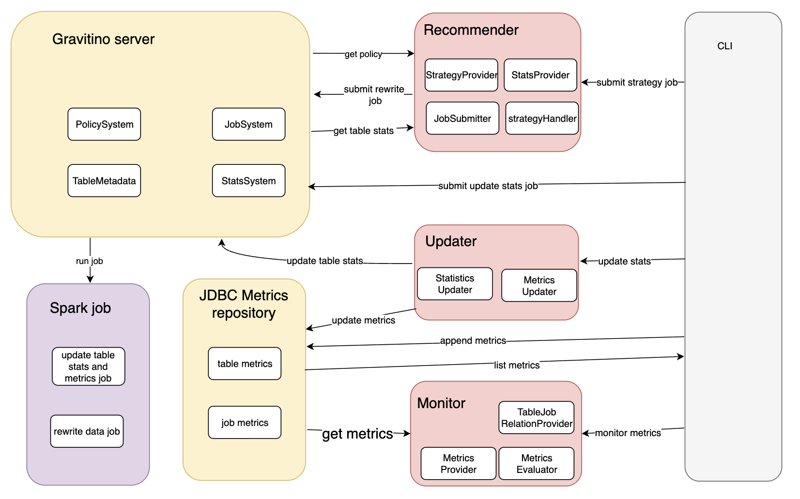

## Overview

The Table Maintenance Service automates table maintenance by attaching policies to catalogs, schemas, or tables, collecting statistics, and submitting jobs based on policy rules. The framework is generic: metrics infrastructure, policy evaluation, and job submission are not tied to any specific table format. In alpha, the built-in capability covers Iceberg data file compaction on identity-partitioned tables. Other table formats and maintenance actions are supported through Java ServiceLoader extension points.

The CLI commands and configuration keys use the `optimizer` name.

## Alpha Scope

The Table Maintenance Service framework is general, but the built-in capabilities ship with a narrow scope. Confirm your environment matches before starting a POC against the built-ins; anything outside this list requires custom extensions (see [Extension Guide](./optimizer-extension-guide.md)).

Built-in capabilities in alpha:

- **Compaction is the only built-in strategy.** No built-in snapshot expiration, orphan file cleanup, or sort/cluster optimization.
- **Built-in compaction targets Iceberg only.** Hudi, Delta, Paimon, and filesets require custom strategy handlers and job adapters.
- **Identity partition transforms only.** Iceberg tables using `days()`, `hours()`, `bucket()`, or `truncate()` partitions will fail during rewrite. See the compatibility matrix in [Troubleshooting](./optimizer-troubleshooting.md).
- **CLI-driven.** No built-in scheduler; trigger runs from the optimizer CLI or your own scheduler.

## Extensibility

The framework is designed for extension beyond the built-in capability. Custom providers, strategy handlers, job adapters, calculators, and evaluators are loaded through Java ServiceLoader and config keys. See [Optimizer Extension Guide](./optimizer-extension-guide.md).

## How It Works

The optimizer workflow has four steps:

1. **Attach a policy.** Define thresholds and weights, then attach to a catalog, schema, or table.
2. **Collect statistics.** Run a stats collection job to populate per-partition signals. The built-in Iceberg job populates `custom-data-file-mse` (file-size variance) and `custom-delete-file-number`; other metrics are possible through custom calculators.
3. **Evaluate and submit.** Run `submit-strategy-jobs`. The optimizer reads the policy, scores partitions against current statistics, and submits a Spark rewrite job for the highest-scoring candidates.
4. **Verify.** Track job status through the Gravitino REST API and inspect rewrite logs or Iceberg snapshot history.

The diagram shows end-to-end interactions between the CLI, Gravitino server, Spark jobs, the JDBC metrics repository, and the Recommender, Updater, and Monitor modules.

## Execution Modes

| Mode | Entry point | Use when |
| --- | --- | --- |
| Policy-driven workflow | Gravitino REST + optimizer CLI | You want the optimizer to compact your tables based on attached policies. **This is the POC path.** |
| Local JSONL calculator | `gravitino-optimizer.sh --calculator-name local-stats-calculator` | You want to test rule evaluation against handwritten statistics without running Spark. |

POC users should follow the policy-driven workflow. The local JSONL calculator is a developer and integration-testing tool.

## Configuration Layers

Three layers of configuration interact. See [Optimizer Configuration](./optimizer-configuration.md) for the full reference.

| Layer | Scope | Typical keys |
| --- | --- | --- |
| Gravitino server config | Job manager and executor runtime | `gravitino.job.executor`, `gravitino.job.statusPullIntervalInMs`, `gravitino.jobExecutor.local.sparkHome` |
| Optimizer CLI config | CLI commands | `gravitino.optimizer.*` in `conf/gravitino-optimizer.conf` |
| Job submission `jobConf` | Per job run | `catalog_name`, `table_identifier`, `spark_*`, template-specific args |

## Names You Will See

The optimizer uses four layered names. Distinguishing them matters because the CLI flag `--strategy-name` takes the policy name, not the strategy type.

| Layer | What it identifies | Example value | Where it appears |
| --- | --- | --- | --- |
| Policy name | A specific policy you create | `iceberg_compaction_default` | CLI `--strategy-name`, policy listing APIs |
| Policy type | The kind of policy, which controls what fields are valid | `system_iceberg_compaction` | REST `policyType` field when creating a policy |
| Strategy type | The action the policy generates | `iceberg-data-compaction` | Policy `strategy.type` field, strategy handler config |
| Job template | The Spark job blueprint the strategy runs | `builtin-iceberg-rewrite-data-files` | Job submission and job status APIs |

A built-in compaction policy created with policy type `system_iceberg_compaction` generates a strategy of type `iceberg-data-compaction`, which runs the job template `builtin-iceberg-rewrite-data-files`.

## Related

- [Optimizer Configuration](./optimizer-configuration.md)
- [Optimizer Extension Guide](./optimizer-extension-guide.md)
- [Optimizer Quick Start and Verification](./optimizer-quick-start.md)
- [Optimizer CLI Reference](./optimizer-cli-reference.md)
- [Optimizer Troubleshooting](./optimizer-troubleshooting.md)
- [Manage policies in Gravitino](../manage-policies-in-gravitino.md)
- [Iceberg compaction policy](../iceberg-compaction-policy.md)
- [Manage jobs in Gravitino](../manage-jobs-in-gravitino.md)
- [Manage statistics in Gravitino](../manage-statistics-in-gravitino.md)
