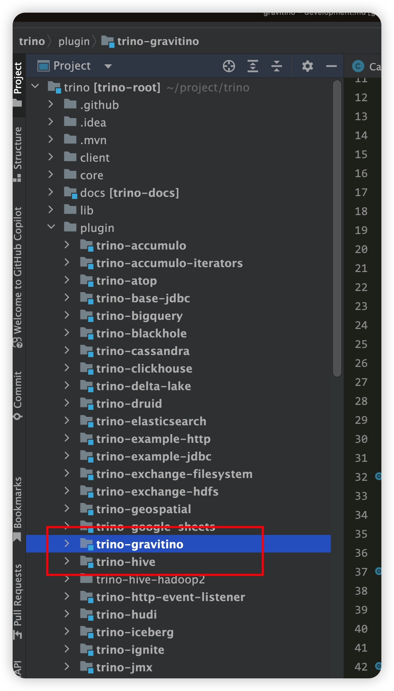
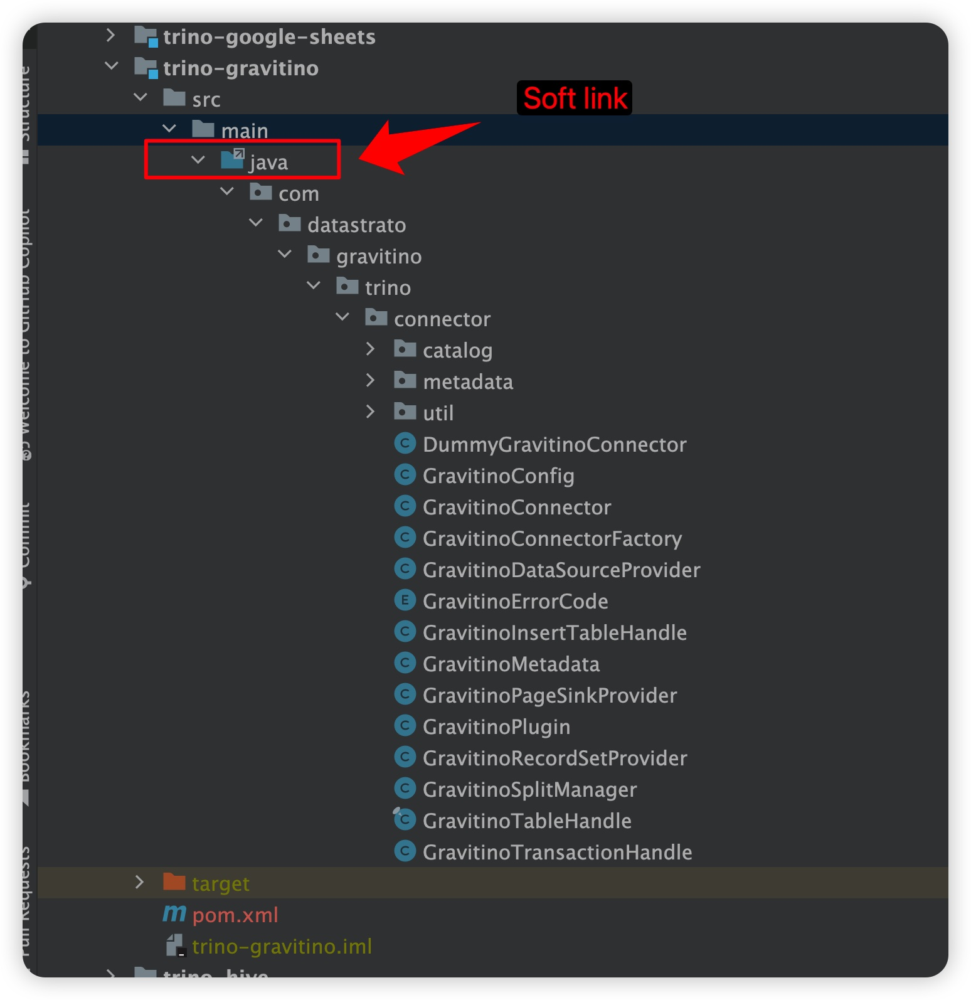
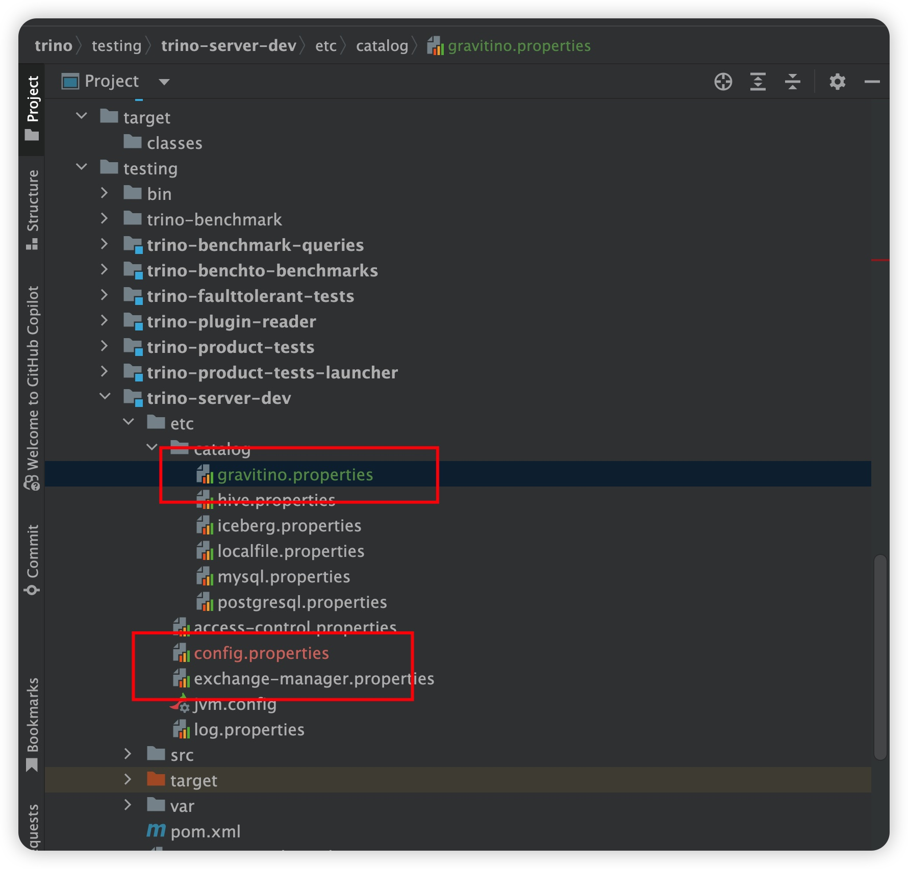
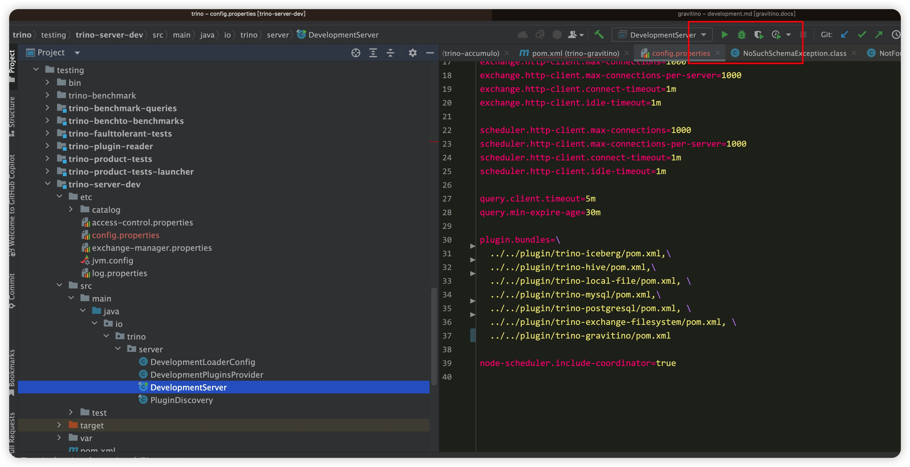
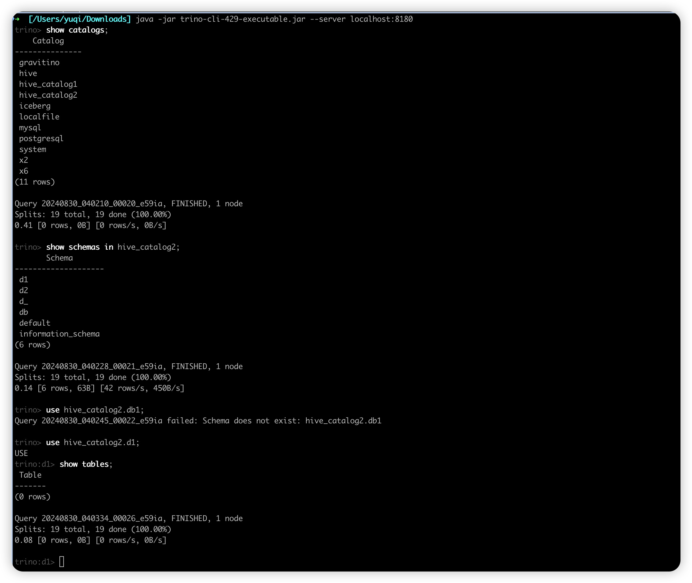

This document is to guide users through the development of the Gravitino connector for Trino locally.

## Prerequisites

Before you start developing the Gravitino trino connector, you need to have the following prerequisites:

1. You need to start the Gravitino server locally, for more information, please refer to the [start Gravitino server](../how-to-install.md)
2. Create a catalog in the Gravitino server, for more information, please refer to the [Gravitino metadata management](../manage-relational-metadata-using-gravitino.md). Assuming we have just created a MySQL catalog using the following command:

```curl
curl -X POST -H "Content-Type: application/json" -d '{"name":"test","comment":"comment","properties":{}}' http://localhost:8090/api/metalakes

curl -X POST -H "Content-Type: application/json" -d '{"name":"mysql_catalog3","type":"RELATIONAL","comment":"comment","provider":"jdbc-mysql", "properties":{
  "jdbc-url": "jdbc:mysql://127.0.0.1:3306?useSSL=false&allowPublicKeyRetrieval=true",
  "jdbc-user": "root",
  "jdbc-password": "123456",
  "jdbc-driver": "com.mysql.cj.jdbc.Driver"
}}' http://localhost:8090/api/metalakes/test/catalogs
```

:::note
Please change the above `localhost`, `port` and the names of metalake and catalogs accordingly.
:::


## Development environment

To develop the Gravitino connector locally, you need to do the following steps:

### IDEA

1. Clone the Trino repository from the [GitHub](https://github.com/trinodb/trino) repository. We advise you to use the release version 426 or 435. 
2. Open the Trino project in your IDEA.
3. Create a new module for the Gravitino connector in the Trino project as the following picture (we will use the name `trino-gravitino` as the module name in the following steps). 
4. Add a soft link to the Gravitino trino connector module in the Trino project. Assuming the src java main directory of the Gravitino trino connector in project Gravitino is `gravitino/path/to/gravitino-trino-connector/src/main/java`, 
and the src java main directory of trino-gravitino in the Trino project is `trino/path/to/trino-gravitino/src/main/java`, you can use the following command to create a soft link:

```shell
ln -s gravitino/path/to/trino-connector/src/main/java trino/path/to/trino-gravitino/src/main/java
```
then you can see the `gravitino-trino-connecor` source files and directories in the `trino-gravitino` module as follows:



5. Add `<module>plugin/trino-gravitino</module>` to `trino/pom.xml` and change the `pom.xml` file in the `trino-gravitino` module accordingly. This is an example content of the `pom.xml` file in the `trino-gravitino` module. Ensure that the version of trino-root is identical to the version of trino.

```xml
<?xml version="1.0" encoding="UTF-8"?>
<!--
 Copyright 2024 Datastrato Pvt Ltd.
 This software is licensed under the Apache License version 2.
-->

<project xmlns="http://maven.apache.org/POM/4.0.0" xmlns:xsi="http://www.w3.org/2001/XMLSchema-instance" xsi:schemaLocation="http://maven.apache.org/POM/4.0.0 http://maven.apache.org/xsd/maven-4.0.0.xsd">
    <modelVersion>4.0.0</modelVersion>
    <parent>
        <groupId>io.trino</groupId>
        <artifactId>trino-root</artifactId>
        <version>426</version>
        <relativePath>../../pom.xml</relativePath>
    </parent>

    <artifactId>trino-gravitino</artifactId>
    <packaging>trino-plugin</packaging>
    <description>Trino - Graviton Connector</description>

    <properties>
        <air.main.basedir>${project.parent.basedir}</air.main.basedir>
    </properties>

    <dependencies>
        <!--
        The following dependencies are required for the Gravitino connector. You can install them
        locally (./gradlew publishToMavenLocal) or just use the release version like 0.4.0
        -->
        <dependency>
            <groupId>com.datastrato.gravitino</groupId>
            <artifactId>bundled-catalog</artifactId>
            <version>0.5.0-SNAPSHOT</version>
        </dependency>

        <dependency>
            <groupId>com.datastrato.gravitino</groupId>
            <artifactId>client-java-runtime</artifactId>
            <version>0.5.0-SNAPSHOT</version>
        </dependency>

        <dependency>
            <groupId>com.fasterxml.jackson.core</groupId>
            <artifactId>jackson-databind</artifactId>
        </dependency>
        <dependency>
            <groupId>com.google.guava</groupId>
            <artifactId>guava</artifactId>
        </dependency>

        <dependency>
            <groupId>com.google.inject</groupId>
            <artifactId>guice</artifactId>
        </dependency>

        <dependency>
            <groupId>io.airlift</groupId>
            <artifactId>bootstrap</artifactId>
            <exclusions>
                <exclusion>
                    <groupId>org.apache.logging.log4j</groupId>
                    <artifactId>log4j-to-slf4j</artifactId>
                </exclusion>
            </exclusions>
        </dependency>

        <dependency>
            <groupId>io.airlift</groupId>
            <artifactId>configuration</artifactId>
        </dependency>

        <dependency>
            <groupId>io.airlift</groupId>
            <artifactId>json</artifactId>
        </dependency>

        <dependency>
            <groupId>io.trino</groupId>
            <artifactId>trino-plugin-toolkit</artifactId>
        </dependency>

        <dependency>
            <groupId>jakarta.validation</groupId>
            <artifactId>jakarta.validation-api</artifactId>
        </dependency>

        <dependency>
            <groupId>org.apache.commons</groupId>
            <artifactId>commons-collections4</artifactId>
            <version>4.4</version>
        </dependency>

        <dependency>
            <groupId>org.apache.commons</groupId>
            <artifactId>commons-lang3</artifactId>
        </dependency>

        <dependency>
            <groupId>org.apache.httpcomponents.client5</groupId>
            <artifactId>httpclient5</artifactId>
            <version>5.2.1</version>
        </dependency>

        <dependency>
            <groupId>com.fasterxml.jackson.core</groupId>
            <artifactId>jackson-annotations</artifactId>
            <scope>provided</scope>
        </dependency>

        <dependency>
            <groupId>io.airlift</groupId>
            <artifactId>slice</artifactId>
            <scope>provided</scope>
        </dependency>

        <dependency>
            <groupId>io.opentelemetry</groupId>
            <artifactId>opentelemetry-api</artifactId>
            <scope>provided</scope>
        </dependency>

        <dependency>
            <groupId>io.opentelemetry</groupId>
            <artifactId>opentelemetry-context</artifactId>
            <scope>provided</scope>
        </dependency>

        <dependency>
            <groupId>io.trino</groupId>
            <artifactId>trino-spi</artifactId>
            <scope>provided</scope>
        </dependency>

        <dependency>
            <groupId>org.openjdk.jol</groupId>
            <artifactId>jol-core</artifactId>
            <scope>provided</scope>
        </dependency>

        <dependency>
            <groupId>io.airlift</groupId>
            <artifactId>node</artifactId>
            <scope>runtime</scope>
        </dependency>
        <dependency>
            <groupId>io.trino</groupId>
            <artifactId>trino-memory</artifactId>
            <scope>test</scope>
        </dependency>
        <dependency>
            <groupId>io.trino</groupId>
            <artifactId>trino-testing</artifactId>
            <scope>test</scope>
        </dependency>

        <dependency>
            <groupId>org.testng</groupId>
            <artifactId>testng</artifactId>
            <scope>test</scope>
        </dependency>
    </dependencies>
</project>
```

6. Try to compile module `trino-gravitino` to see if there are any errors. 
```shell
# build the whole trino project
./mvnw -pl '!core/trino-server-rpm' package -DskipTests -Dair.check.skip-all=true


# build the trino-gravitino module if we change the code in the trino-gravitino module
./mvnw clean -pl 'plugin/trino-gravitino' package -DskipTests -Dcheckstyle.skip -Dair.check.skip-checkstyle=true -DskipTests -Dair.check.skip-all=true
```
:::note
If a compile error occurs due to `The following artifacts could not be resolved: com.datastrato.gravitino:xxx:jar`, which can be resolved by executing `./gradlew publishToMavenLocal` in gravitino beforehand.
:::

7. Set up the configuration for the Gravitino connector in the Trino project. You can do as the following picture shows:


The corresponding configuration files are here:

- Gravitino properties file: `gravitino.properties`
```properties
#
# Copyright 2024 Datastrato Pvt Ltd.
# This software is licensed under the Apache License version 2.
#

# the connector name is always 'gravitino'
connector.name=gravitino

# uri of the gravitino server, you need to change it according to your environment
gravitino.uri=http://localhost:8090

# The name of the metalake to which the connector is connected, you need to change it according to your environment
gravitino.metalake=test
```
- Trino configuration file: `config.properties`
```properties
#
# Copyright 2024 Datastrato Pvt Ltd.
# This software is licensed under the Apache License version 2.
#

#
# WARNING
# ^^^^^^^
# This configuration file is for development only and should NOT be used
# in production. For example configuration, see the Trino documentation.
# sample nodeId to provide consistency across test runs
node.id=ffffffff-ffff-ffff-ffff-ffffffffffff
node.environment=test
node.internal-address=localhost
experimental.concurrent-startup=true

# Default port is 8080, We change it to 8180
http-server.http.port=8180

discovery.uri=http://localhost:8180

exchange.http-client.max-connections=1000
exchange.http-client.max-connections-per-server=1000
exchange.http-client.connect-timeout=1m
exchange.http-client.idle-timeout=1m

scheduler.http-client.max-connections=1000
scheduler.http-client.max-connections-per-server=1000
scheduler.http-client.connect-timeout=1m
scheduler.http-client.idle-timeout=1m

query.client.timeout=5m
query.min-expire-age=30m

# We removed several catalogs that won't be used in Gravitino
plugin.bundles=\
  ../../plugin/trino-iceberg/pom.xml,\
  ../../plugin/trino-hive/pom.xml,\
  ../../plugin/trino-local-file/pom.xml, \
  ../../plugin/trino-mysql/pom.xml,\
  ../../plugin/trino-postgresql/pom.xml, \
  ../../plugin/trino-exchange-filesystem/pom.xml, \
  ../../plugin/trino-gravitino/pom.xml

node-scheduler.include-coordinator=true
```

:::note
Remove the file `/etc/catalogs/xxx.properties` if the corresponding `plugin/trino-xxx/pom.xml` is not recorded in the `/etc/config.properties`. For the hive plugin, please use  `plugin/trino-hive/pom.xml` after release version 435. Others should use `plugin/trino-hive-hadoop2/pom.xml`.
:::

8. Start the Trino server and connect to the Gravitino server.

9. If `DevelopmentServer` has started successfully, you can connect to the Trino server using the `trino-cli` and run the following command to see if the Gravitino connector is available:
```shell
java -jar trino-cli-429-executable.jar --server localhost:8180
```
:::note
The `trino-cli-429-executable.jar` is the Trino CLI jar file, you can download it from the [Trino release page](https://trino.io/docs/current/client/cli.html). **Users can use the version of the Trino CLI jar file according to the version of the Trino server.**
:::

10. If nothing goes wrong, you can start developing the Gravitino connector in the Gravitino project and debug it in the Trino project.

